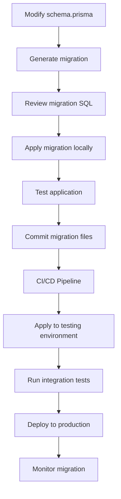
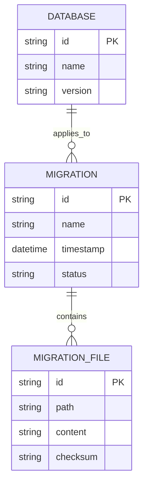
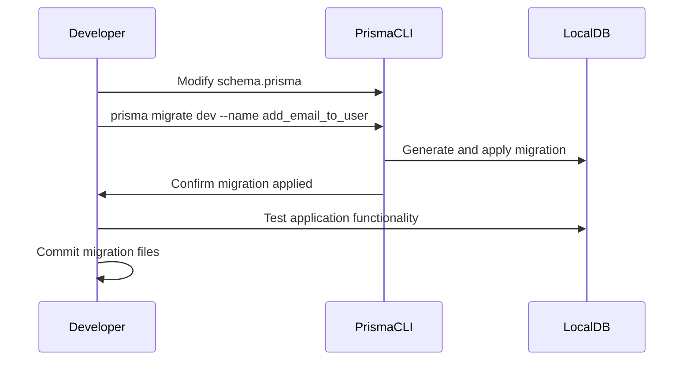
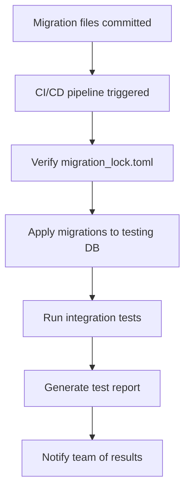
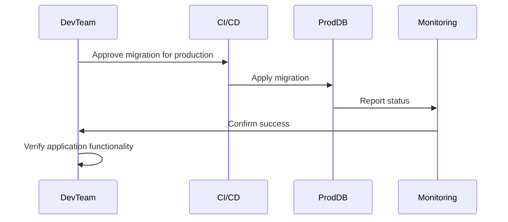
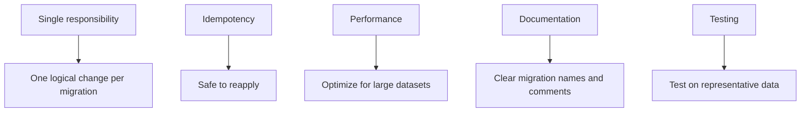
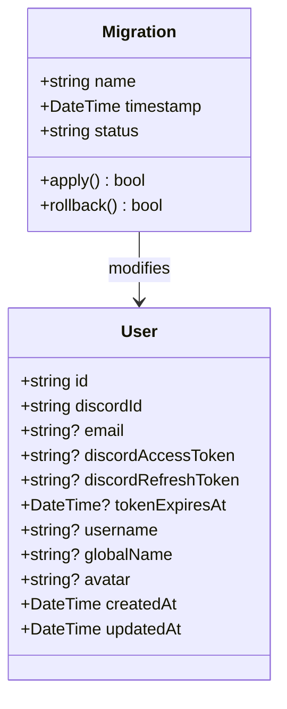
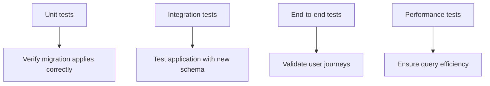
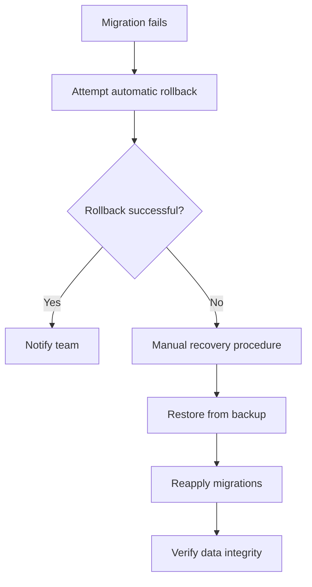
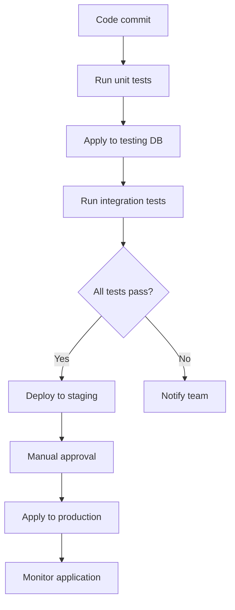

# Database Migrations

<cite>
**Referenced Files in This Document**   
- [schema.prisma](file://apps/admin-api/prisma/schema.prisma)
- [migration_lock.toml](file://apps/admin-api/prisma/migrations/migration_lock.toml)
- [20241106000000_init/migration.sql](file://apps/admin-api/prisma/migrations/20241106000000_init/migration.sql)
- [20251125162943_add_email_to_user/migration.sql](file://apps/admin-api/prisma/migrations/20251125162943_add_email_to_user/migration.sql)
- [20251125174900_add_discord_tokens/migration.sql](file://apps/admin-api/prisma/migrations/20251125174900_add_discord_tokens/migration.sql)
- [database.js](file://apps/admin-api/lib/database.js)
- [package.json](file://apps/admin-api/package.json)
</cite>

## Table of Contents
1. [Introduction](#introduction)
2. [Migration Workflow Overview](#migration-workflow-overview)
3. [Migration File Structure](#migration-file-structure)
4. [Development Environment Workflow](#development-environment-workflow)
5. [Testing Environment Workflow](#testing-environment-workflow)
6. [Production Environment Workflow](#production-environment-workflow)
7. [Migration Lock File](#migration-lock-file)
8. [Best Practices for Migration Scripts](#best-practices-for-migration-scripts)
9. [Data Transformation and Backward Compatibility](#data-transformation-and-backward-compatibility)
10. [Testing Migrations](#testing-migrations)
11. [Recovery from Failed Migrations](#recovery-from-failed-migrations)
12. [CI/CD Integration](#cicd-integration)
13. [Conclusion](#conclusion)

## Introduction

The slimy-monorepo platform utilizes Prisma Migrate for managing database schema changes across development, testing, and production environments. This documentation provides a comprehensive guide to the database migration process, covering the workflow, file structure, best practices, and integration with the CI/CD pipeline. The system is designed to ensure consistent schema evolution while maintaining data integrity and backward compatibility.

Prisma Migrate tracks schema changes through migration files stored in the migrations directory, with each migration representing an incremental change to the database schema. The process is designed to be collaborative, allowing multiple developers to work on schema changes while preventing conflicts through the migration_lock.toml file.

**Section sources**
- [schema.prisma](file://apps/admin-api/prisma/schema.prisma)
- [migration_lock.toml](file://apps/admin-api/prisma/migrations/migration_lock.toml)

## Migration Workflow Overview

The database migration workflow in the slimy-monorepo platform follows a structured process that begins with schema definition in Prisma's schema.prisma file and progresses through migration generation, application, and deployment. The workflow is designed to be consistent across all environments while accommodating the specific requirements of each deployment stage.

The process starts with developers modifying the schema.prisma file to reflect desired database changes. Prisma Migrate then generates migration files that contain the SQL statements necessary to implement these changes. Each migration is timestamped and stored in a dedicated directory within the migrations folder, ensuring a chronological record of schema evolution.



**Diagram sources**
- [schema.prisma](file://apps/admin-api/prisma/schema.prisma)
- [20241106000000_init/migration.sql](file://apps/admin-api/prisma/migrations/20241106000000_init/migration.sql)

**Section sources**
- [schema.prisma](file://apps/admin-api/prisma/schema.prisma)
- [package.json](file://apps/admin-api/package.json)

## Migration File Structure

Migration files in the slimy-monorepo platform are organized in timestamped directories within the migrations folder, with each directory containing a migration.sql file and potentially other related files. This structure ensures that migrations are applied in the correct order and provides a clear audit trail of schema changes.

The migration files follow a consistent naming convention based on UTC timestamps, such as 20241106000000_init and 20251125162943_add_email_to_user. This timestamp-based naming ensures that migrations are applied in chronological order, regardless of when they were created or by which developer.



**Diagram sources**
- [20241106000000_init/migration.sql](file://apps/admin-api/prisma/migrations/20241106000000_init/migration.sql)
- [20251125162943_add_email_to_user/migration.sql](file://apps/admin-api/prisma/migrations/20251125162943_add_email_to_user/migration.sql)

**Section sources**
- [20241106000000_init/migration.sql](file://apps/admin-api/prisma/migrations/20241106000000_init/migration.sql)
- [20251125162943_add_email_to_user/migration.sql](file://apps/admin-api/prisma/migrations/20251125162943_add_email_to_user/migration.sql)

## Development Environment Workflow

In the development environment, the migration workflow is designed to be flexible and iterative, allowing developers to experiment with schema changes and refine their migrations before sharing them with the team. Developers begin by modifying the schema.prisma file to reflect the desired database changes.

Once the schema changes are defined, developers use the Prisma CLI to generate migration files. The generated migration.sql file contains the SQL statements necessary to implement the changes, which developers should review carefully to ensure correctness and optimize performance. After reviewing the migration, developers apply it to their local database using Prisma Migrate.



**Diagram sources**
- [schema.prisma](file://apps/admin-api/prisma/schema.prisma)
- [20251125162943_add_email_to_user/migration.sql](file://apps/admin-api/prisma/migrations/20251125162943_add_email_to_user/migration.sql)

**Section sources**
- [schema.prisma](file://apps/admin-api/prisma/schema.prisma)
- [20251125162943_add_email_to_user/migration.sql](file://apps/admin-api/prisma/migrations/20251125162943_add_email_to_user/migration.sql)
- [database.js](file://apps/admin-api/lib/database.js)

## Testing Environment Workflow

The testing environment workflow focuses on validating migrations in a shared environment that closely mirrors production. When migration files are committed to the repository and pushed to the main branch, the CI/CD pipeline automatically applies them to the testing database.

Before applying migrations to the testing environment, the system verifies that all migrations in the history have been applied and that there are no conflicts. The migration_lock.toml file plays a crucial role in this process by preventing concurrent migration operations that could lead to schema inconsistencies.



**Diagram sources**
- [migration_lock.toml](file://apps/admin-api/prisma/migrations/migration_lock.toml)
- [20251125174900_add_discord_tokens/migration.sql](file://apps/admin-api/prisma/migrations/20251125174900_add_discord_tokens/migration.sql)

**Section sources**
- [migration_lock.toml](file://apps/admin-api/prisma/migrations/migration_lock.toml)
- [20251125174900_add_discord_tokens/migration.sql](file://apps/admin-api/prisma/migrations/20251125174900_add_discord_tokens/migration.sql)

## Production Environment Workflow

The production environment workflow follows a more cautious approach, with additional safeguards to prevent downtime and data loss. Migrations are applied during designated maintenance windows, and a rollback plan is always prepared before any migration is executed.

The process begins with a final review of the migration files and their impact on the production database. Once approved, the migration is applied using Prisma Migrate in a controlled manner, with monitoring in place to detect any issues immediately. After the migration is complete, automated tests verify that the application functions correctly with the new schema.



**Diagram sources**
- [20251125174900_add_discord_tokens/migration.sql](file://apps/admin-api/prisma/migrations/20251125174900_add_discord_tokens/migration.sql)
- [database.js](file://apps/admin-api/lib/database.js)

**Section sources**
- [20251125174900_add_discord_tokens/migration.sql](file://apps/admin-api/prisma/migrations/20251125174900_add_discord_tokens/migration.sql)
- [database.js](file://apps/admin-api/lib/database.js)

## Migration Lock File

The migration_lock.toml file is a critical component of the migration system, designed to prevent concurrent migration operations that could lead to schema inconsistencies. This file is automatically generated and maintained by Prisma Migrate and should not be edited manually.

The lock file serves multiple purposes: it records the current state of the migration history, prevents multiple developers from creating migrations simultaneously, and ensures that migrations are applied in the correct order. When a developer creates a new migration, Prisma checks the lock file to ensure no other migrations have been created since their last sync with the repository.

```toml
# Please do not edit this file manually
# It should be added in your version-control system (e.g., Git)
provider = "mysql"
```

**Section sources**
- [migration_lock.toml](file://apps/admin-api/prisma/migrations/migration_lock.toml)

## Best Practices for Migration Scripts

Creating effective migration scripts requires adherence to several best practices that ensure reliability, performance, and maintainability. These practices are particularly important in a collaborative environment like the slimy-monorepo platform.

First, migrations should be atomic and focused on a single logical change. For example, adding the email field to the User model and adding Discord tokens should be separate migrations, as demonstrated in the existing migration files. This approach makes it easier to understand, review, and potentially roll back individual changes.

Second, migrations should be written to be idempotent whenever possible, meaning they can be safely applied multiple times without changing the result beyond the initial application. This is particularly important in distributed systems where network issues might cause a migration to appear to fail when it actually succeeded.



**Diagram sources**
- [20251125162943_add_email_to_user/migration.sql](file://apps/admin-api/prisma/migrations/20251125162943_add_email_to_user/migration.sql)
- [20251125174900_add_discord_tokens/migration.sql](file://apps/admin-api/prisma/migrations/20251125174900_add_discord_tokens/migration.sql)

**Section sources**
- [20251125162943_add_email_to_user/migration.sql](file://apps/admin-api/prisma/migrations/20251125162943_add_email_to_user/migration.sql)
- [20251125174900_add_discord_tokens/migration.sql](file://apps/admin-api/prisma/migrations/20251125174900_add_discord_tokens/migration.sql)

## Data Transformation and Backward Compatibility

Data transformation during migrations requires careful planning to maintain backward compatibility and ensure data integrity. When adding new fields like email to the User model or Discord tokens, the migration must account for existing data and the application's ability to handle both old and new schema versions.

For example, when adding the email field to the User model, the migration includes a warning about the unique constraint and handles null values appropriately. This approach ensures that existing users without email addresses can continue to function while allowing new users to provide their email.



**Diagram sources**
- [schema.prisma](file://apps/admin-api/prisma/schema.prisma)
- [20251125162943_add_email_to_user/migration.sql](file://apps/admin-api/prisma/migrations/20251125162943_add_email_to_user/migration.sql)

**Section sources**
- [schema.prisma](file://apps/admin-api/prisma/schema.prisma)
- [20251125162943_add_email_to_user/migration.sql](file://apps/admin-api/prisma/migrations/20251125162943_add_email_to_user/migration.sql)

## Testing Migrations

Testing migrations is a critical step in the deployment process, ensuring that schema changes do not introduce bugs or performance issues. The slimy-monorepo platform employs a multi-layered testing approach that includes unit tests, integration tests, and end-to-end tests.

Unit tests verify that individual migration scripts apply correctly to a fresh database schema. Integration tests ensure that the application functions correctly with the new schema, particularly focusing on the affected models and their relationships. End-to-end tests validate the complete user journey, confirming that schema changes do not break existing functionality.



**Section sources**
- [database.js](file://apps/admin-api/lib/database.js)
- [20251125174900_add_discord_tokens/migration.sql](file://apps/admin-api/prisma/migrations/20251125174900_add_discord_tokens/migration.sql)

## Recovery from Failed Migrations

Recovery from failed migrations is an essential aspect of the database management strategy. The slimy-monorepo platform employs several mechanisms to handle migration failures, including automated rollback procedures and manual intervention protocols.

When a migration fails, the system automatically attempts to roll back to the previous schema state. This rollback is possible because Prisma Migrate maintains a history of all applied migrations and their corresponding rollback scripts. If the automatic rollback fails, manual intervention is required, following a documented recovery procedure.



**Section sources**
- [database.js](file://apps/admin-api/lib/database.js)
- [20251125174900_add_discord_tokens/migration.sql](file://apps/admin-api/prisma/migrations/20251125174900_add_discord_tokens/migration.sql)

## CI/CD Integration

The CI/CD integration for database migrations ensures that schema changes are automatically tested and deployed across environments. The pipeline is configured to apply migrations to the testing database whenever changes are pushed to the main branch, followed by comprehensive integration tests.

For production deployments, the pipeline requires manual approval before applying migrations, ensuring that changes are reviewed and approved by the team. The integration also includes monitoring and alerting to detect any issues immediately after migration application.



**Section sources**
- [package.json](file://apps/admin-api/package.json)
- [database.js](file://apps/admin-api/lib/database.js)

## Conclusion

The database migration process in the slimy-monorepo platform is designed to be reliable, collaborative, and safe. By following the documented workflow and best practices, developers can confidently make schema changes that evolve the application while maintaining data integrity and backward compatibility.

The combination of Prisma Migrate, the migration_lock.toml file, and CI/CD integration provides a robust framework for managing database schema evolution across all environments. This approach minimizes the risk of conflicts and ensures that migrations are applied consistently and predictably.

By adhering to the principles outlined in this documentation, the development team can maintain a healthy database schema that supports the application's growth and changing requirements.