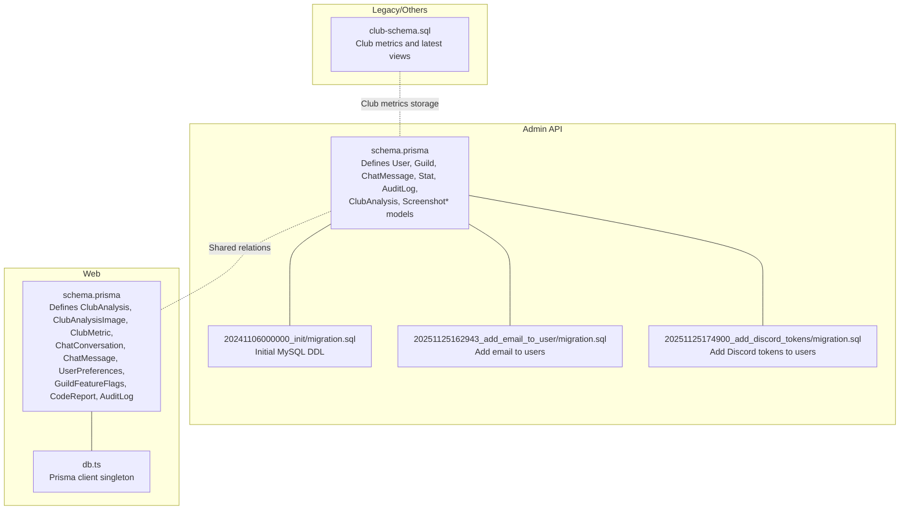
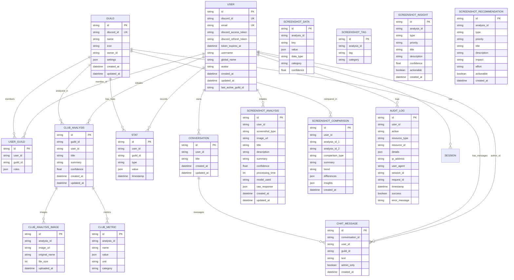
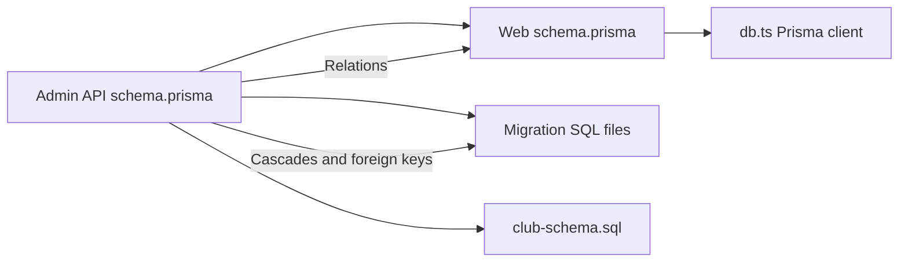

# Database Schema

<cite>
**Referenced Files in This Document**
- [schema.prisma](file://apps/admin-api/prisma/schema.prisma)
- [schema.prisma](file://apps/web/prisma/schema.prisma)
- [20241106000000_init/migration.sql](file://apps/admin-api/prisma/migrations/20241106000000_init/migration.sql)
- [20251125162943_add_email_to_user/migration.sql](file://apps/admin-api/prisma/migrations/20251125162943_add_email_to_user/migration.sql)
- [20251125174900_add_discord_tokens/migration.sql](file://apps/admin-api/prisma/migrations/20251125174900_add_discord_tokens/migration.sql)
- [club-schema.sql](file://apps/admin-api/lib/club-schema.sql)
- [db.ts](file://apps/web/lib/db.ts)
- [database.js](file://apps/admin-api/src/lib/database.js)
- [audit.js](file://apps/admin-api/src/services/audit.js)
- [database-optimization.js](file://apps/admin-api/lib/database-optimization.js)
- [club-analytics.repository.ts](file://apps/web/lib/repositories/club-analytics.repository.ts)
</cite>

## Table of Contents
1. [Introduction](#introduction)
2. [Project Structure](#project-structure)
3. [Core Components](#core-components)
4. [Architecture Overview](#architecture-overview)
5. [Detailed Component Analysis](#detailed-component-analysis)
6. [Dependency Analysis](#dependency-analysis)
7. [Performance Considerations](#performance-considerations)
8. [Troubleshooting Guide](#troubleshooting-guide)
9. [Conclusion](#conclusion)
10. [Appendices](#appendices)

## Introduction
This document describes the database schema for the slimy-monorepo platform, focusing on the Prisma-defined entity relationships and constraints for core models used by the admin API and web applications. It explains the purpose of each model, its role in the system, primary/foreign keys, indexes, and performance optimizations. It also provides examples of common queries and data access patterns using Prisma ORM, illustrates relationships with diagrams, and outlines validation rules, defaults, and timestamps. Guidance is included for extending the schema and best practices for defining new models.

## Project Structure
The database schema is defined in two Prisma schema files:
- Admin API schema: defines the authoritative schema for users, guilds, chat, statistics, audit logs, and screenshot/club analytics.
- Web schema: defines models for club analytics, chat conversations/messages, user preferences, feature flags, and audit logs.

There are also legacy SQL migration files and a dedicated club metrics schema for OCR-driven metrics.

**Diagram sources**
- [schema.prisma](file://apps/admin-api/prisma/schema.prisma#L1-L464)
- [schema.prisma](file://apps/web/prisma/schema.prisma#L1-L200)
- [20241106000000_init/migration.sql](file://apps/admin-api/prisma/migrations/20241106000000_init/migration.sql#L1-L399)
- [20251125162943_add_email_to_user/migration.sql](file://apps/admin-api/prisma/migrations/20251125162943_add_email_to_user/migration.sql#L1-L12)
- [20251125174900_add_discord_tokens/migration.sql](file://apps/admin-api/prisma/migrations/20251125174900_add_discord_tokens/migration.sql#L1-L5)
- [club-schema.sql](file://apps/admin-api/lib/club-schema.sql#L1-L58)
- [db.ts](file://apps/web/lib/db.ts#L1-L83)

**Section sources**
- [schema.prisma](file://apps/admin-api/prisma/schema.prisma#L1-L464)
- [schema.prisma](file://apps/web/prisma/schema.prisma#L1-L200)
- [20241106000000_init/migration.sql](file://apps/admin-api/prisma/migrations/20241106000000_init/migration.sql#L1-L399)
- [20251125162943_add_email_to_user/migration.sql](file://apps/admin-api/prisma/migrations/20251125162943_add_email_to_user/migration.sql#L1-L12)
- [20251125174900_add_discord_tokens/migration.sql](file://apps/admin-api/prisma/migrations/20251125174900_add_discord_tokens/migration.sql#L1-L5)
- [club-schema.sql](file://apps/admin-api/lib/club-schema.sql#L1-L58)
- [db.ts](file://apps/web/lib/db.ts#L1-L83)

## Core Components
This section summarizes the core models and their roles:

- User
  - Purpose: Represents Discord users with optional email and Discord OAuth tokens. Tracks last active guild via optional relation.
  - Key fields: id, discordId (unique), email (unique), discordAccessToken, discordRefreshToken, tokenExpiresAt, username, globalName, avatar, timestamps.
  - Constraints: Unique discordId; optional unique email; timestamps managed automatically.
  - Indexes: createdAt, updatedAt, (discordId, createdAt), lastActiveGuildId.

- Guild
  - Purpose: Represents Discord guilds (servers) with owner and settings.
  - Key fields: id (Discord guild ID), name, icon, ownerId, settings (JSON), timestamps.
  - Constraints: Owner relation to User; settings stored as JSON.
  - Indexes: ownerId, createdAt, updatedAt.

- UserGuild (many-to-many)
  - Purpose: Links users to guilds with roles.
  - Key fields: id, userId, guildId, roles (JSON array).
  - Constraints: Unique (userId, guildId); cascading deletes.
  - Indexes: userId, guildId, (userId, guildId).

- Conversation
  - Purpose: Chat conversation container.
  - Key fields: id, userId, title, timestamps.
  - Indexes: userId, createdAt.

- ChatMessage
  - Purpose: Individual chat messages; optionally linked to a conversation and guild.
  - Key fields: id, conversationId (optional), userId, guildId (optional), text, adminOnly (default false), timestamps.
  - Indexes: userId, guildId, conversationId, createdAt, (userId, createdAt), (guildId, createdAt), (conversationId, createdAt), (adminOnly, createdAt).

- Stat
  - Purpose: Generic statistics/events with JSON values and timestamps.
  - Key fields: id, userId (optional), guildId (optional), type, value (JSON), timestamp (default now).
  - Indexes: userId, guildId, type, timestamp, (userId, timestamp), (guildId, timestamp), (type, timestamp), (userId, type, timestamp), (guildId, type, timestamp).

- ClubAnalysis
  - Purpose: AI-generated club analysis results with confidence and timestamps.
  - Key fields: id, guildId, userId, title (optional), summary, confidence, timestamps.
  - Relations: belongs to Guild and User; has images and metrics.
  - Indexes: guildId, userId, createdAt, updatedAt, confidence, (guildId, createdAt), (userId, createdAt), (guildId, confidence), (userId, confidence).

- ClubAnalysisImage
  - Purpose: Image assets associated with analyses.
  - Key fields: id, analysisId, imageUrl, originalName, fileSize, uploadedAt.
  - Indexes: analysisId, uploadedAt, fileSize.

- ClubMetric
  - Purpose: Metrics extracted from analyses.
  - Key fields: id, analysisId, name, value (JSON), unit (optional), category.
  - Constraints: Unique (analysisId, name).
  - Indexes: analysisId, name, category, (analysisId, name), (analysisId, category), (category, name).

- ScreenshotAnalysis
  - Purpose: Screenshot-based AI analysis with type, confidence, processing metadata.
  - Key fields: id, userId, screenshotType, imageUrl, title, description, summary, confidence, processingTime, modelUsed, rawResponse (JSON), timestamps.
  - Indexes: userId, screenshotType, createdAt, confidence, (userId, screenshotType), (userId, createdAt), (screenshotType, createdAt).

- ScreenshotData
  - Purpose: Extracted data points from screenshots.
  - Key fields: id, analysisId, key, value (JSON), dataType, category, confidence (optional).
  - Constraints: Unique (analysisId, key).
  - Indexes: analysisId, key, category, (analysisId, key), (analysisId, category), (category, key).

- ScreenshotTag
  - Purpose: Tags associated with screenshot analyses.
  - Key fields: id, analysisId, tag, category.
  - Constraints: Unique (analysisId, tag).
  - Indexes: analysisId, tag, category, (analysisId, tag), (category, tag).

- ScreenshotComparison
  - Purpose: Comparisons between two screenshot analyses.
  - Key fields: id, userId, analysisId1, analysisId2, comparisonType, summary, trend, differences (JSON), insights (JSON), createdAt.
  - Constraints: Unique (analysisId1, analysisId2, comparisonType).
  - Indexes: userId, analysisId1, analysisId2, comparisonType, createdAt, (userId, createdAt).

- ScreenshotInsight
  - Purpose: Insights derived from screenshot analyses.
  - Key fields: id, analysisId, type, priority, title, description, confidence, actionable (default false), createdAt.
  - Indexes: analysisId, type, priority, actionable, (analysisId, type), (analysisId, priority).

- ScreenshotRecommendation
  - Purpose: Recommendations derived from screenshot analyses.
  - Key fields: id, analysisId, type, priority, title, description, impact, effort, actionable (default true), createdAt.
  - Indexes: analysisId, type, priority, impact, effort, (analysisId, priority), (analysisId, type).

- AuditLog
  - Purpose: Event sourcing and compliance logging.
  - Key fields: id, userId (optional), action, resourceType, resourceId, details (JSON), ipAddress, userAgent, sessionId, requestId, timestamp (default now), success (default true), errorMessage.
  - Indexes: userId, action, resourceType, resourceId, timestamp, success, (userId, timestamp), (action, timestamp), (resourceType, timestamp), (userId, action, timestamp), (resourceType, resourceId), requestId.

**Section sources**
- [schema.prisma](file://apps/admin-api/prisma/schema.prisma#L14-L464)
- [schema.prisma](file://apps/web/prisma/schema.prisma#L1-L200)

## Architecture Overview
The schema is centered around users and guilds, with optional relations to chat, statistics, and analytics. The admin API schema defines richer analytics and audit models, while the web schema focuses on chat and user preferences.

**Diagram sources**
- [schema.prisma](file://apps/admin-api/prisma/schema.prisma#L14-L464)

## Detailed Component Analysis

### User Model
- Identity and authentication: discordId is unique; optional email is unique; optional OAuth tokens and expiry.
- Optional last-active guild relation enables quick access to a user’s last joined guild.
- Timestamps: createdAt and updatedAt managed by Prisma.
- Indexes: createdAt, updatedAt, (discordId, createdAt), lastActiveGuildId.

Common operations:
- Upsert user by discordId.
- Update profile fields (username, globalName, avatar).
- Set lastActiveGuildId when a user joins a guild.

**Section sources**
- [schema.prisma](file://apps/admin-api/prisma/schema.prisma#L14-L49)

### Guild Model
- Represents Discord servers with owner and settings JSON.
- Indexes: ownerId, createdAt, updatedAt.

Common operations:
- Upsert guild by Discord id.
- Update settings.
- List guilds with optional search and pagination.

**Section sources**
- [schema.prisma](file://apps/admin-api/prisma/schema.prisma#L71-L95)
- [database.js](file://apps/admin-api/src/lib/database.js#L311-L374)

### UserGuild (Many-to-Many)
- Links users to guilds with roles stored as JSON.
- Unique constraint ensures one membership per user/guild.
- Cascading deletes maintain referential integrity.

Common operations:
- Add/update/remove user from guild.
- List user’s guilds with included guild details.
- List guild members with optional search.

**Section sources**
- [schema.prisma](file://apps/admin-api/prisma/schema.prisma#L97-L115)
- [database.js](file://apps/admin-api/src/lib/database.js#L419-L494)

### ChatMessage and Conversation
- Conversation stores user and title; ChatMessage optionally belongs to a conversation and can be scoped to a guild.
- adminOnly flag allows moderation filtering.
- Rich indexes enable efficient timeline queries and filtering.

Common operations:
- Create conversation.
- Create chat message with optional conversationId and guildId.
- Fetch recent messages with optional admin-only filtering.

**Section sources**
- [schema.prisma](file://apps/admin-api/prisma/schema.prisma#L117-L158)
- [database.js](file://apps/admin-api/src/lib/database.js#L526-L595)

### Stat Model
- Generic statistics with JSON values and timestamps.
- Supports filtering by user, guild, type, and date range.
- Aggregation support via groupBy.

Common operations:
- Record stat with type/value/timestamp.
- Retrieve recent stats with optional filters.
- Aggregate counts/sums by type.

**Section sources**
- [schema.prisma](file://apps/admin-api/prisma/schema.prisma#L160-L185)
- [database.js](file://apps/admin-api/src/lib/database.js#L597-L650)

### ClubAnalysis, Images, and Metrics
- ClubAnalysis captures AI summaries with confidence and timestamps.
- Images and Metrics are embedded as arrays with unique constraints on (analysisId, name) and (analysisId, key).
- Indexes optimize lookups by guild/user and temporal filters.

Common operations:
- Create analysis with nested images and metrics.
- Search by title/summary with optional guild/user filters.
- Paginate recent analyses.

**Section sources**
- [schema.prisma](file://apps/admin-api/prisma/schema.prisma#L187-L260)
- [schema.prisma](file://apps/web/prisma/schema.prisma#L14-L67)
- [club-analytics.repository.ts](file://apps/web/lib/repositories/club-analytics.repository.ts#L1-L197)

### Screenshot Analytics and Related Models
- ScreenshotAnalysis captures type, confidence, processing metadata, and timestamps.
- ScreenshotData, ScreenshotTag, ScreenshotInsight, and ScreenshotRecommendation provide granular extraction and recommendations.
- ScreenshotComparison compares two analyses with unique triple key.

Indexes:
- ScreenshotAnalysis: userId, screenshotType, createdAt, confidence, and composite indexes.
- ScreenshotData/Tag/Metric: analysisId, key/category, and composite indexes.
- ScreenshotComparison: userId, analysisId1, analysisId2, comparisonType, createdAt.

**Section sources**
- [schema.prisma](file://apps/admin-api/prisma/schema.prisma#L262-L427)

### AuditLog
- Comprehensive event logging with optional user context, resource identifiers, and correlation IDs.
- Rich indexes enable efficient filtering by user/action/resource/time.

Common operations:
- Create audit log entries.
- Filter by user, action, resource, timestamp, and success.

**Section sources**
- [schema.prisma](file://apps/admin-api/prisma/schema.prisma#L429-L464)
- [database.js](file://apps/admin-api/src/lib/database.js#L75-L105)

### Legacy Club Metrics Schema
- Dedicated tables for historical metrics and latest aggregated view.
- Indexes on guild_id/member_key and timestamps.
- Unique constraints on (guild_id, member_key, observed_at) and (guild_id, member_key).

**Section sources**
- [club-schema.sql](file://apps/admin-api/lib/club-schema.sql#L1-L58)

## Dependency Analysis
The Admin API schema defines the authoritative relations and constraints. The Web schema mirrors core analytics and chat models, enabling cross-application access patterns.

**Diagram sources**
- [schema.prisma](file://apps/admin-api/prisma/schema.prisma#L14-L464)
- [schema.prisma](file://apps/web/prisma/schema.prisma#L1-L200)
- [20241106000000_init/migration.sql](file://apps/admin-api/prisma/migrations/20241106000000_init/migration.sql#L334-L399)
- [club-schema.sql](file://apps/admin-api/lib/club-schema.sql#L1-L58)
- [db.ts](file://apps/web/lib/db.ts#L1-L83)

**Section sources**
- [schema.prisma](file://apps/admin-api/prisma/schema.prisma#L14-L464)
- [schema.prisma](file://apps/web/prisma/schema.prisma#L1-L200)
- [20241106000000_init/migration.sql](file://apps/admin-api/prisma/migrations/20241106000000_init/migration.sql#L334-L399)
- [db.ts](file://apps/web/lib/db.ts#L1-L83)

## Performance Considerations
- Indexes are strategically placed to support frequent queries:
  - User: (discordId, createdAt), lastActiveGuildId
  - ChatMessage: (userId, createdAt), (guildId, createdAt), (conversationId, createdAt), (adminOnly, createdAt)
  - Stat: (userId, timestamp), (guildId, timestamp), (type, timestamp), (userId, type, timestamp), (guildId, type, timestamp)
  - ClubAnalysis: (guildId, createdAt), (userId, createdAt), (guildId, confidence), (userId, confidence)
  - ScreenshotAnalysis: (userId, screenshotType), (userId, createdAt), (screenshotType, createdAt)
- Composite indexes reduce cost for multi-column filters.
- Unique constraints on (analysisId, name) and (analysisId, key) enforce uniqueness and speed up lookups.
- Application-level caching is used for chat message pagination to reduce load.

**Section sources**
- [schema.prisma](file://apps/admin-api/prisma/schema.prisma#L42-L464)
- [database-optimization.js](file://apps/admin-api/lib/database-optimization.js#L217-L246)

## Troubleshooting Guide
- Connection and client initialization:
  - The web app initializes a Prisma client singleton with optional logging and health checks.
- Database initialization and middleware:
  - The admin API initializes Prisma with configurable log levels and records query metrics.
- Audit logging:
  - Audit log creation is supported via the admin API database wrapper; ensure required fields are present.
- Common issues:
  - Unique constraint violations on email or Discord tokens indicate duplicate values; resolve duplicates or adjust constraints.
  - Cascading deletes ensure child records are removed when parents are deleted; verify foreign keys in migrations.

**Section sources**
- [db.ts](file://apps/web/lib/db.ts#L1-L83)
- [database.js](file://apps/admin-api/src/lib/database.js#L1-L72)
- [audit.js](file://apps/admin-api/src/services/audit.js#L1-L26)
- [20251125162943_add_email_to_user/migration.sql](file://apps/admin-api/prisma/migrations/20251125162943_add_email_to_user/migration.sql#L1-L12)
- [20251125174900_add_discord_tokens/migration.sql](file://apps/admin-api/prisma/migrations/20251125174900_add_discord_tokens/migration.sql#L1-L5)

## Conclusion
The slimy-monorepo database schema is designed around users, guilds, chat, statistics, and analytics. The Admin API schema provides comprehensive relations and indexes for performance, while the Web schema aligns closely for shared analytics and chat. The presence of legacy club metrics tables and migration files demonstrates a clear evolution path. Following the outlined best practices and leveraging the provided indexes and patterns will help maintain scalability and reliability.

## Appendices

### Common Prisma Query Patterns
- User
  - Upsert by discordId: [database.js](file://apps/admin-api/src/lib/database.js#L311-L324)
  - Update profile fields: [database.js](file://apps/admin-api/src/lib/database.js#L392-L399)
- Guild
  - List with search and pagination: [database.js](file://apps/admin-api/src/lib/database.js#L342-L374)
  - Update settings: [database.js](file://apps/admin-api/src/lib/database.js#L410-L416)
- User-Guild
  - Add user to guild: [database.js](file://apps/admin-api/src/lib/database.js#L419-L436)
  - List user’s guilds: [database.js](file://apps/admin-api/src/lib/database.js#L451-L460)
  - List guild members: [database.js](file://apps/admin-api/src/lib/database.js#L462-L494)
- Chat
  - Create message: [database.js](file://apps/admin-api/src/lib/database.js#L526-L543)
  - Fetch recent messages: [database.js](file://apps/admin-api/src/lib/database.js#L545-L566)
  - Create conversation: [database.js](file://apps/admin-api/src/lib/database.js#L569-L578)
  - List user conversations: [database.js](file://apps/admin-api/src/lib/database.js#L580-L595)
- Stats
  - Record stat: [database.js](file://apps/admin-api/src/lib/database.js#L598-L610)
  - Retrieve stats: [database.js](file://apps/admin-api/src/lib/database.js#L612-L627)
  - Aggregate stats: [database.js](file://apps/admin-api/src/lib/database.js#L629-L650)
- Club Analytics
  - Create analysis with images/metrics: [club-analytics.repository.ts](file://apps/web/lib/repositories/club-analytics.repository.ts#L45-L65)
  - Search analyses: [club-analytics.repository.ts](file://apps/web/lib/repositories/club-analytics.repository.ts#L168-L197)

### Extending the Schema and Best Practices
- Define relations explicitly with foreign keys and onDelete behavior (e.g., Cascade, SetNull).
- Add indexes for frequently filtered/sorted columns and composite indexes for multi-column filters.
- Use unique constraints for business-unique pairs (e.g., (analysisId, name)).
- Prefer JSON fields for flexible data but consider normalization when data becomes structured and queried heavily.
- Keep timestamps consistent (default now, updatedAt) and leverage Prisma’s automatic timestamp management.
- When adding optional relations, use nullable foreign keys and appropriate onDelete behavior to avoid orphaned records.
- For audit trails, capture user context, action, resource, and correlation IDs; ensure indexes support common filters.

[No sources needed since this section provides general guidance]