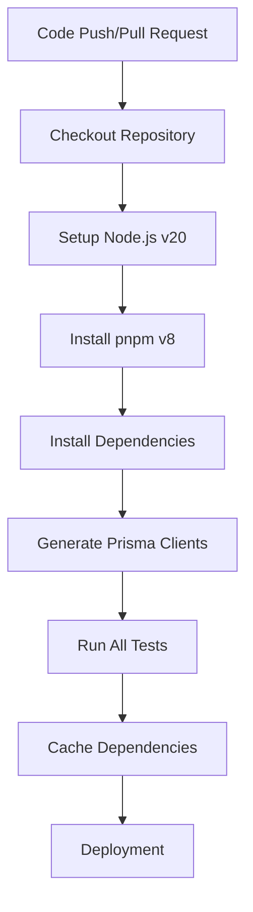
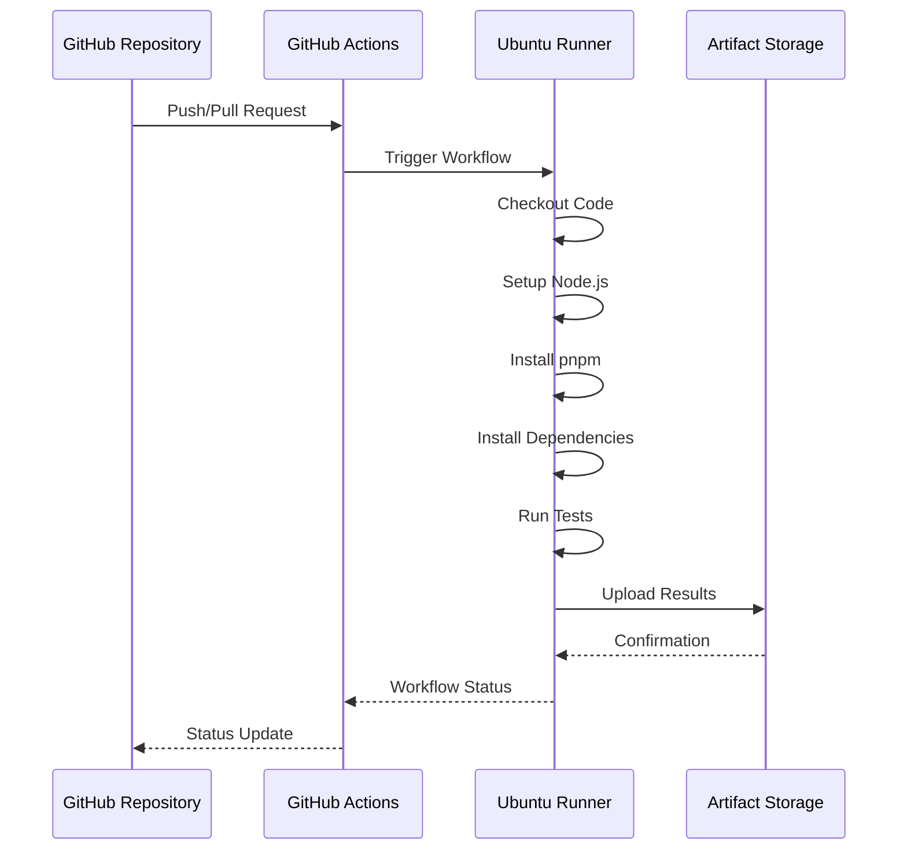
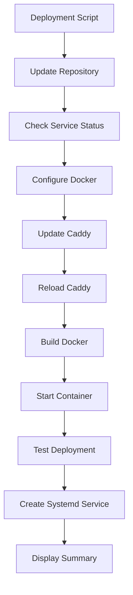

# CI/CD Pipeline

<cite>
**Referenced Files in This Document**   
- [package.json](file://package.json)
- [pnpm-workspace.yaml](file://pnpm-workspace.yaml)
- [CI.md](file://docs/CI.md)
- [DOCKER_DEPLOYMENT.md](file://DOCKER_DEPLOYMENT.md)
- [aggregate-codes-workflow.yml](file://apps/web/aggregate-codes-workflow.yml)
- [deploy-to-server.sh](file://apps/web/deploy-to-server.sh)
- [quickstart.sh](file://apps/web/quickstart.sh)
- [setup-env.sh](file://apps/web/setup-env.sh)
- [apply-club-schema.sh](file://scripts/apply-club-schema.sh)
- [deploy-debug.sh](file://scripts/deploy-debug.sh)
</cite>

## Table of Contents
1. [Introduction](#introduction)
2. [CI/CD Workflow Configuration](#cicd-workflow-configuration)
3. [GitHub Actions Implementation](#github-actions-implementation)
4. [Script Functionality](#script-functionality)
5. [Versioning and Dependency Management](#versioning-and-dependency-management)
6. [Branching Strategy and Merge Policies](#branching-strategy-and-merge-policies)
7. [Pipeline Execution Examples](#pipeline-execution-examples)
8. [Security Considerations](#security-considerations)
9. [Conclusion](#conclusion)

## Introduction
The CI/CD pipeline for the slimy-monorepo is designed to automate testing, building, and deployment processes across multiple applications within the monorepo structure. The system leverages GitHub Actions for continuous integration and custom shell scripts for deployment operations. The pipeline supports multiple applications including admin-api, web, admin-ui, and bot services, with a focus on reliability, security, and efficient dependency management through pnpm workspaces.

**Section sources**
- [docs/CI.md](file://docs/CI.md#L1-L140)
- [DOCKER_DEPLOYMENT.md](file://DOCKER_DEPLOYMENT.md#L1-L326)

## CI/CD Workflow Configuration
The CI/CD workflow is configured to automatically validate code changes through automated testing and build processes. The pipeline triggers on pull requests targeting the main branch and direct pushes to main. The workflow includes comprehensive steps for environment setup, dependency installation, and test execution across all workspace packages.

The pipeline configuration ensures that all applications are properly tested before deployment. For applications in the monorepo, the root-level `pnpm test:all` command automatically discovers and runs tests in all workspace packages, ensuring comprehensive test coverage. The system uses pnpm workspaces to manage dependencies across multiple applications, with workspace configuration defined in the root `pnpm-workspace.yaml` file.



**Diagram sources**
- [CI.md](file://docs/CI.md#L13-L22)
- [package.json](file://package.json#L8-L28)

**Section sources**
- [CI.md](file://docs/CI.md#L1-L140)
- [package.json](file://package.json#L8-L28)

## GitHub Actions Implementation
The GitHub Actions implementation provides automated testing and scheduled workflows for the slimy-monorepo. The primary CI workflow runs on pull requests and pushes to the main branch, executing a series of steps to validate code changes. The system uses Ubuntu runners with Node.js v20 and pnpm v8 for dependency management.

A specialized workflow, `aggregate-codes-workflow.yml`, runs every 10 minutes to aggregate codes from various sources. This scheduled workflow checks out the repository, sets up the Node.js environment, installs dependencies, and executes the aggregation process. The workflow uploads the resulting codes snapshot as an artifact and checks for any failures in the aggregation process.



**Diagram sources**
- [aggregate-codes-workflow.yml](file://apps/web/aggregate-codes-workflow.yml#L1-L85)
- [CI.md](file://docs/CI.md#L13-L22)

**Section sources**
- [aggregate-codes-workflow.yml](file://apps/web/aggregate-codes-workflow.yml#L1-L85)
- [CI.md](file://docs/CI.md#L1-L140)

## Script Functionality
The deployment infrastructure includes several shell scripts that automate environment setup, deployment, and debugging processes. These scripts provide consistent deployment procedures across different environments and simplify complex deployment operations.

The `deploy-to-server.sh` script automates the deployment of the web application to production servers. It handles repository updates, Docker container management, Caddy web server configuration, and systemd service creation. The script includes comprehensive error checking and provides detailed status information throughout the deployment process.

The `quickstart.sh` script facilitates local development setup by configuring environment variables, installing dependencies, and starting Docker containers. It includes health checks for both the admin API and web application, ensuring that services are properly running before completing the setup process.

Additional utility scripts include `setup-env.sh` for environment configuration and `apply-club-schema.sh` for database schema management. These scripts incorporate safety measures such as confirmation prompts for destructive operations and automatic backup recommendations.



**Diagram sources**
- [deploy-to-server.sh](file://apps/web/deploy-to-server.sh#L1-L231)
- [quickstart.sh](file://apps/web/quickstart.sh#L1-L97)

**Section sources**
- [deploy-to-server.sh](file://apps/web/deploy-to-server.sh#L1-L231)
- [quickstart.sh](file://apps/web/quickstart.sh#L1-L97)
- [setup-env.sh](file://apps/web/setup-env.sh#L1-L27)
- [apply-club-schema.sh](file://scripts/apply-club-schema.sh#L1-L122)

## Versioning and Dependency Management
The slimy-monorepo utilizes pnpm workspaces for efficient dependency management across multiple applications. The workspace configuration is defined in `pnpm-workspace.yaml`, which specifies the workspace packages as `apps/*` and `packages/*`. This structure enables shared dependencies and consistent versioning across the monorepo.

The system implements a sophisticated approach to handling build scripts in pnpm v10+, which introduced security features that block dependency lifecycle scripts by default. The `pnpm-workspace.yaml` file includes an `onlyBuiltDependencies` section that explicitly allows trusted packages to run their build scripts during installation. This includes critical packages such as Prisma, Sharp, and esbuild, ensuring proper compilation of native binaries and generation of Prisma clients.

The monorepo uses a single root `pnpm-lock.yaml` file to ensure consistent dependencies across all workspace packages. This approach eliminates the "multiple lockfiles" warning from Next.js and ensures that all applications use the same dependency versions, reducing potential compatibility issues.

```mermaid
graph TB
A[pnpm-workspace.yaml] --> B[apps/*]
A --> C[packages/*]
B --> D[admin-api]
B --> E[web]
B --> F[admin-ui]
B --> G[bot]
C --> H[shared-auth]
C --> I[shared-codes]
C --> J[shared-config]
A --> K[onlyBuiltDependencies]
K --> L[@prisma/client]
K --> M[@prisma/engines]
K --> N[prisma]
K --> O[sharp]
K --> P[esbuild]
```

**Diagram sources**
- [pnpm-workspace.yaml](file://pnpm-workspace.yaml#L1-L14)
- [package.json](file://package.json#L4-L7)

**Section sources**
- [pnpm-workspace.yaml](file://pnpm-workspace.yaml#L1-L14)
- [package.json](file://package.json#L4-L7)
- [DOCKER_DEPLOYMENT.md](file://DOCKER_DEPLOYMENT.md#L135-L145)

## Branching Strategy and Merge Policies
The CI/CD pipeline integrates with a structured branching strategy that emphasizes code quality and stability. The main branch serves as the primary integration branch, with all changes required to pass through pull requests before merging. The CI workflow automatically validates all pull requests targeting the main branch, ensuring that tests pass and code quality standards are met.

The merge policy requires successful completion of the CI pipeline before code can be merged into main. This includes passing all automated tests and successful execution of the Prisma client generation process. The system is configured to run comprehensive tests across all workspace packages, with individual test commands available for specific applications.

For deployment, the system follows a manual approval process after successful CI validation. This ensures that deployments are intentional and can be coordinated with other team members. The deployment scripts include safety checks and confirmation prompts to prevent accidental deployments to production environments.

**Section sources**
- [CI.md](file://docs/CI.md#L8-L9)
- [package.json](file://package.json#L13-L17)

## Pipeline Execution Examples
The CI/CD pipeline has been successfully executed in various scenarios, demonstrating its reliability and effectiveness. Successful pipeline runs follow the standard workflow: code push triggers CI, tests pass, and manual deployment is executed using the deployment scripts.

For the aggregate codes workflow, successful runs occur every 10 minutes, producing a codes snapshot artifact that contains the latest aggregated data from various sources. The workflow includes error detection that generates warnings if any data sources fail or are degraded, allowing for prompt identification and resolution of issues.

In cases of pipeline failures, recovery procedures include checking the specific failure point, verifying environment variables and secrets, and examining logs from the failed step. For Docker-related issues, the system provides a safe cache cleanup procedure that resolves overlay2 storage driver corruption without data loss.

Common failure recovery steps include:
1. Verifying environment variables and secrets
2. Checking Docker build cache integrity
3. Ensuring proper Prisma client generation
4. Validating database connection strings
5. Confirming proper file permissions

**Section sources**
- [aggregate-codes-workflow.yml](file://apps/web/aggregate-codes-workflow.yml#L1-L85)
- [deploy-to-server.sh](file://apps/web/deploy-to-server.sh#L1-L231)
- [DOCKER_DEPLOYMENT.md](file://DOCKER_DEPLOYMENT.md#L206-L227)

## Security Considerations
The CI/CD process incorporates several security measures to protect the application and infrastructure. Secret management is handled through GitHub Actions secrets, which are securely stored and only accessible during workflow execution. The system uses environment variables for sensitive configuration, with secrets injected at runtime rather than stored in the repository.

Artifact signing is implemented through the deployment process, with Docker images built from verified source code and dependencies. The system uses trusted base images and verifies package integrity through the pnpm lockfile. The `onlyBuiltDependencies` configuration in `pnpm-workspace.yaml` explicitly defines which packages are allowed to execute build scripts, preventing unauthorized code execution during dependency installation.

Additional security measures include:
- Regular dependency updates and vulnerability scanning
- Limited permissions for deployment scripts
- Confirmation prompts for destructive operations
- Comprehensive logging and monitoring
- Network isolation through Docker containers
- HTTPS termination with Caddy web server

The deployment scripts implement the principle of least privilege, with specific permissions required for different operations. The system also includes security headers in the Caddy configuration, such as HSTS, XSS protection, and frame denial, to protect against common web vulnerabilities.

**Section sources**
- [aggregate-codes-workflow.yml](file://apps/web/aggregate-codes-workflow.yml#L33-L35)
- [deploy-to-server.sh](file://apps/web/deploy-to-server.sh#L102-L108)
- [pnpm-workspace.yaml](file://pnpm-workspace.yaml#L7-L14)

## Conclusion
The CI/CD pipeline for the slimy-monorepo provides a robust and automated infrastructure for continuous integration and deployment. By leveraging GitHub Actions for automated testing and custom scripts for deployment, the system ensures code quality and reliable deployments. The use of pnpm workspaces enables efficient dependency management across multiple applications, while the security measures protect sensitive information and prevent unauthorized access.

The pipeline's design emphasizes reliability, security, and ease of use, with comprehensive error handling and recovery procedures. The combination of automated testing, manual deployment approval, and detailed monitoring provides a balanced approach to software delivery that supports both rapid development and production stability.