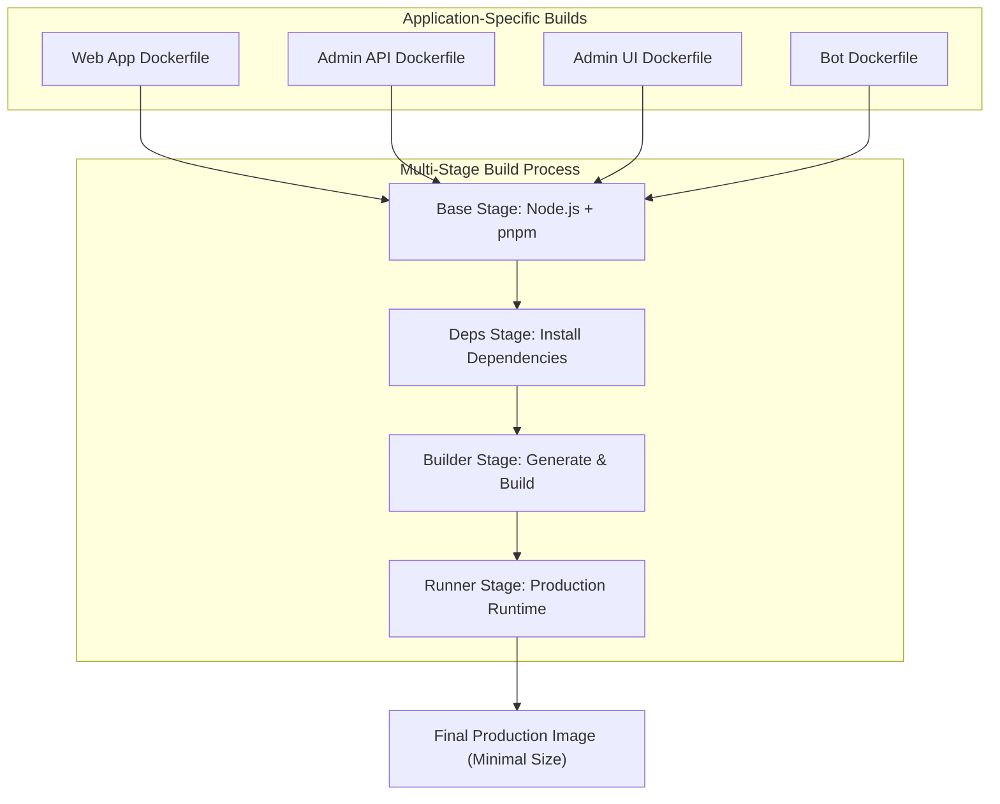
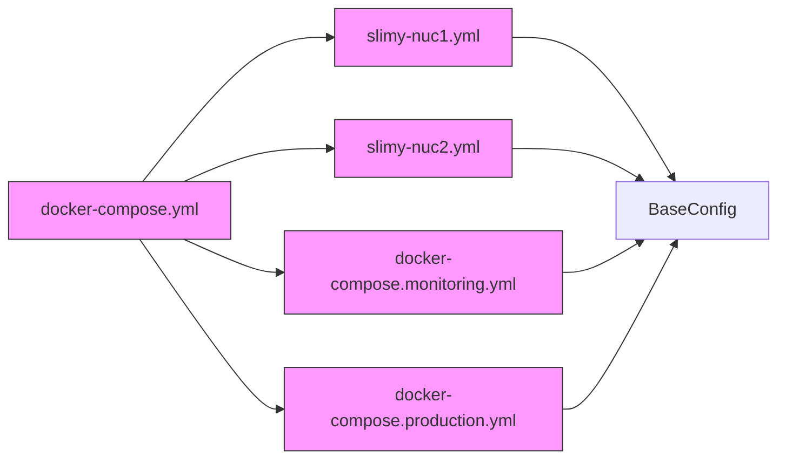
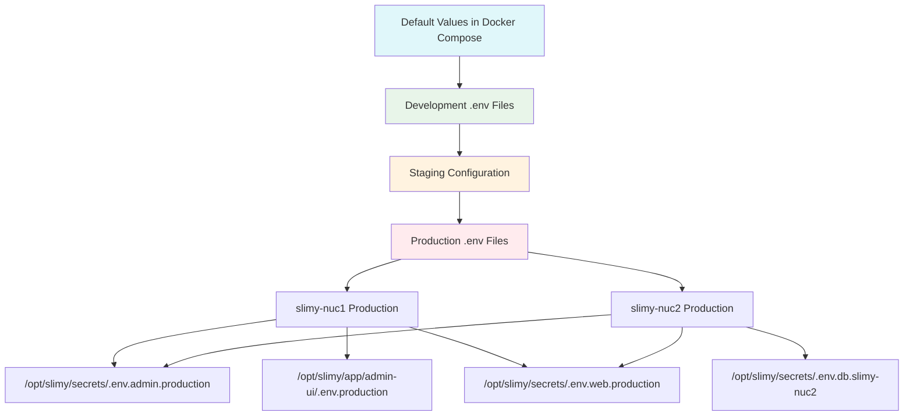
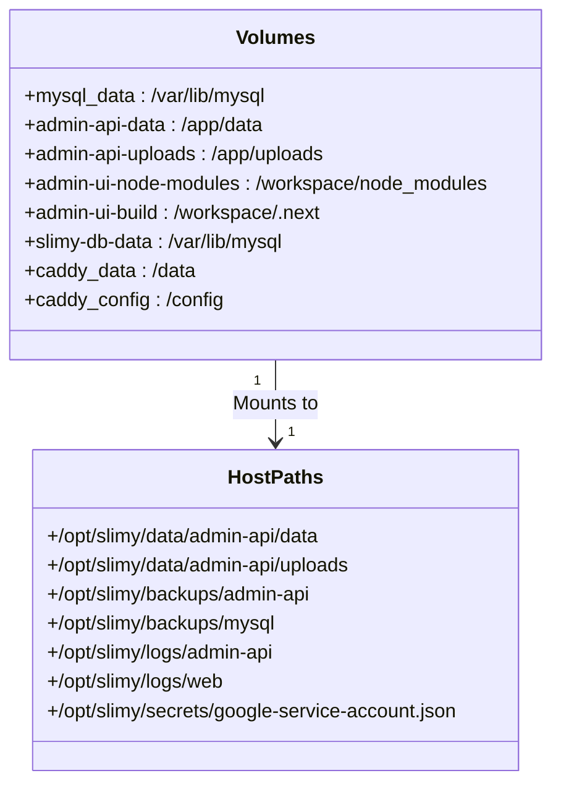
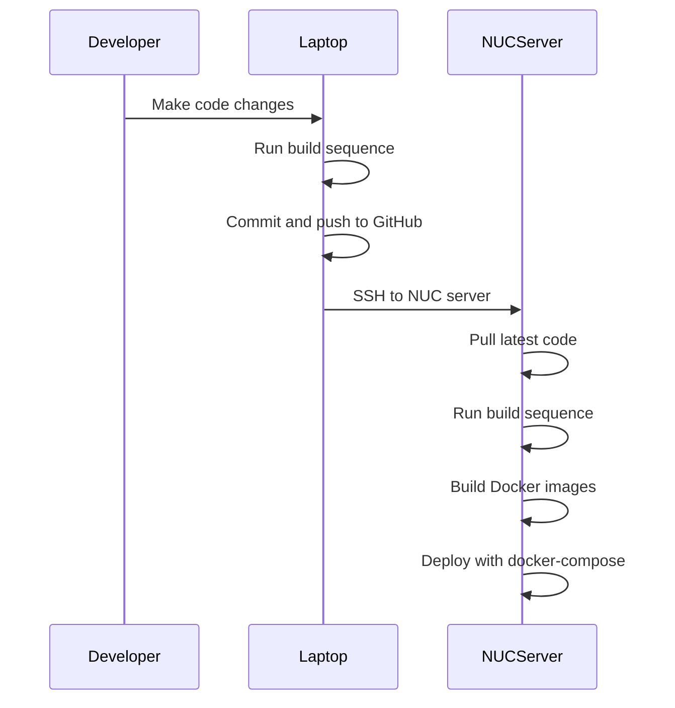

# Deployment

<cite>
**Referenced Files in This Document**   
- [DOCKER_DEPLOYMENT.md](file://DOCKER_DEPLOYMENT.md)
- [docker-compose.yml](file://docker-compose.yml)
- [apps/admin-api/Dockerfile](file://apps/admin-api/Dockerfile)
- [apps/web/Dockerfile](file://apps/web/Dockerfile)
- [apps/admin-ui/Dockerfile](file://apps/admin-ui/Dockerfile)
- [apps/bot/Dockerfile](file://apps/bot/Dockerfile)
- [infra/docker/docker-compose.slimy-nuc1.yml](file://infra/docker/docker-compose.slimy-nuc1.yml)
- [infra/docker/docker-compose.slimy-nuc2.yml](file://infra/docker/docker-compose.slimy-nuc2.yml)
- [scripts/deploy-debug.sh](file://scripts/deploy-debug.sh)
</cite>

## Table of Contents
1. [Introduction](#introduction)
2. [Containerization Strategy](#containerization-strategy)
3. [Multi-Container Orchestration](#multi-container-orchestration)
4. [Environment Configuration](#environment-configuration)
5. [Production Deployment Topology](#production-deployment-topology)
6. [Deployment Scenarios](#deployment-scenarios)
7. [CI/CD Pipeline and Automation](#cicd-pipeline-and-automation)
8. [Scaling and High Availability](#scaling-and-high-availability)
9. [Backup and Recovery](#backup-and-recovery)
10. [Security Considerations](#security-considerations)

## Introduction
This document provides comprehensive guidance for deploying the slimy-monorepo platform using Docker containerization and orchestration. The deployment strategy is designed to support multiple environments including local development, staging, and production, with a focus on reliability, security, and maintainability. The platform consists of multiple applications including a web frontend, admin API, admin UI, and Discord bot, all orchestrated through Docker Compose with environment-specific configurations.

## Containerization Strategy
The slimy-monorepo platform employs a multi-stage Docker containerization strategy for each application, ensuring optimized build processes and minimal production images. Each application has its own Dockerfile that follows best practices for monorepo deployments.



**Diagram sources**
- [apps/admin-api/Dockerfile](file://apps/admin-api/Dockerfile)
- [apps/web/Dockerfile](file://apps/web/Dockerfile)
- [apps/admin-ui/Dockerfile](file://apps/admin-ui/Dockerfile)
- [apps/bot/Dockerfile](file://apps/bot/Dockerfile)

**Section sources**
- [apps/admin-api/Dockerfile](file://apps/admin-api/Dockerfile#L1-L97)
- [apps/web/Dockerfile](file://apps/web/Dockerfile#L1-L93)
- [apps/admin-ui/Dockerfile](file://apps/admin-ui/Dockerfile#L1-L81)
- [apps/bot/Dockerfile](file://apps/bot/Dockerfile#L1-L61)

### Key Containerization Features
- **Monorepo-Aware Build Context**: All Docker builds use the monorepo root as the build context to ensure proper workspace dependency resolution
- **Multi-Stage Builds**: Each application uses a four-stage build process (base, deps, builder, runner) to minimize final image size
- **pnpm Workspace Support**: The build process properly handles pnpm workspaces and shared dependencies
- **Build Script Management**: The `pnpm-workspace.yaml` file includes `onlyBuiltDependencies` to allow critical build scripts to run in Docker
- **Security Hardening**: Production images run as non-root users with minimal privileges

## Multi-Container Orchestration
The platform uses Docker Compose for multi-container orchestration, with different configuration files for various deployment environments. The orchestration strategy ensures proper service dependencies, network isolation, and health monitoring.



**Diagram sources**
- [docker-compose.yml](file://docker-compose.yml)
- [infra/docker/docker-compose.slimy-nuc1.yml](file://infra/docker/docker-compose.slimy-nuc1.yml)
- [infra/docker/docker-compose.slimy-nuc2.yml](file://infra/docker/docker-compose.slimy-nuc2.yml)

**Section sources**
- [docker-compose.yml](file://docker-compose.yml#L1-L154)
- [infra/docker/docker-compose.slimy-nuc1.yml](file://infra/docker/docker-compose.slimy-nuc1.yml#L1-L172)
- [infra/docker/docker-compose.slimy-nuc2.yml](file://infra/docker/docker-compose.slimy-nuc2.yml#L1-L149)

### Core Services
The primary docker-compose configuration defines the following services:

- **db**: MySQL 8.0 database with persistent volume storage and health checks
- **admin-api**: Node.js backend API with Prisma ORM and health monitoring
- **web**: Next.js frontend application with SSR capabilities
- **admin-ui**: Administrative interface with separate configuration
- **bot**: Discord bot service for platform integration

Each service is configured with appropriate restart policies, environment variables, and dependency conditions to ensure reliable operation.

## Environment Configuration
The deployment system uses environment-specific configuration files (.env) to manage settings across different environments. This approach separates configuration from code while maintaining security for sensitive data.

### Environment File Structure
The platform uses a hierarchical environment configuration system:



**Diagram sources**
- [docker-compose.yml](file://docker-compose.yml#L9-L70)
- [infra/docker/docker-compose.slimy-nuc1.yml](file://infra/docker/docker-compose.slimy-nuc1.yml#L33-L34)
- [infra/docker/docker-compose.slimy-nuc2.yml](file://infra/docker/docker-compose.slimy-nuc2.yml#L8-L9)

**Section sources**
- [docker-compose.yml](file://docker-compose.yml#L9-L70)
- [infra/docker/docker-compose.slimy-nuc1.yml](file://infra/docker/docker-compose.slimy-nuc1.yml#L33-L60)
- [infra/docker/docker-compose.slimy-nuc2.yml](file://infra/docker/docker-compose.slimy-nuc2.yml#L8-L43)

### Docker Secrets Management
For production deployments, sensitive configuration is managed through external .env files stored in secure locations:

- **slimy-nuc1**: Environment files stored in application-specific directories
- **slimy-nuc2**: Environment files centralized in `/opt/slimy/secrets/` directory with restricted access

This separation ensures that sensitive credentials (database passwords, API keys, etc.) are not stored in the repository and can be managed with appropriate access controls.

## Production Deployment Topology
The production deployment topology is designed for reliability, performance, and maintainability, with distinct configurations for different production servers (slimy-nuc1 and slimy-nuc2).

### Network Configuration
The platform uses custom Docker networks to isolate services and control communication:

- **slimy-network** (default): Bridge network for internal service communication
- **slimy-net** (nuc1): Custom bridge network for NUC1 deployment
- **slimy** (nuc2): Named network with external volume integration

Services communicate over these internal networks using Docker's DNS resolution, with ports exposed only for external access points.

### Volume Mounting Strategy
The deployment uses a comprehensive volume mounting strategy to ensure data persistence and facilitate monitoring:



**Diagram sources**
- [infra/docker/docker-compose.slimy-nuc1.yml](file://infra/docker/docker-compose.slimy-nuc1.yml#L38-L40)
- [infra/docker/docker-compose.slimy-nuc2.yml](file://infra/docker/docker-compose.slimy-nuc2.yml#L13-L15)

**Section sources**
- [infra/docker/docker-compose.slimy-nuc1.yml](file://infra/docker/docker-compose.slimy-nuc1.yml#L38-L168)
- [infra/docker/docker-compose.slimy-nuc2.yml](file://infra/docker/docker-compose.slimy-nuc2.yml#L13-L15)

### Resource Allocation
The production deployment includes appropriate resource allocation for each service:

- **Database**: Persistent volume for MySQL data with regular backup capabilities
- **API Services**: Dedicated volumes for application data, uploads, and logs
- **Frontend**: Optimized build artifacts with static asset caching
- **Monitoring**: External volumes for Caddy configuration and data

## Deployment Scenarios
The platform supports multiple deployment scenarios tailored to different environments and use cases.

### Local Development
For local development without Docker, the following workflow is recommended:

```bash
# 1. Install dependencies
pnpm install

# 2. Generate Prisma client for web app
pnpm --filter @slimy/web run db:generate

# 3. Build web app
pnpm --filter @slimy/web run build

# 4. Run tests
pnpm --filter @slimy/web test

# 5. Start development server
pnpm --filter @slimy/web run dev
```

This allows developers to work on the application without the overhead of containerization during the development phase.

### Staging Environment
The staging environment uses the base docker-compose.yml configuration with appropriate environment variables. This setup mirrors production but may use less restrictive settings for easier debugging and testing.

### Production Environments
The platform has two production configurations for different NUC servers:

#### slimy-nuc1 Configuration
- Targeted at test/staging workloads
- Environment files stored in application directories
- Simpler volume mounting strategy
- Direct service exposure on standard ports

#### slimy-nuc2 Configuration
- Production-grade deployment with enhanced security
- Centralized secrets management in `/opt/slimy/secrets/`
- Comprehensive logging and backup directories
- Additional services including Caddy reverse proxy and loopback server
- External Docker volumes for data persistence

The deployment process for both environments follows a standardized workflow:
1. Pull latest code from repository
2. Run build sequence with pnpm
3. Build Docker images using environment-specific compose files
4. Deploy services with docker-compose up -d

**Section sources**
- [DOCKER_DEPLOYMENT.md](file://DOCKER_DEPLOYMENT.md#L11-L54)
- [infra/docker/docker-compose.slimy-nuc1.yml](file://infra/docker/docker-compose.slimy-nuc1.yml)
- [infra/docker/docker-compose.slimy-nuc2.yml](file://infra/docker/docker-compose.slimy-nuc2.yml)

## CI/CD Pipeline and Automation
The deployment process is supported by automation scripts and a well-defined CI/CD workflow to ensure consistent and reliable deployments.

### Deployment Automation Scripts
The repository includes scripts to automate common deployment tasks:



**Diagram sources**
- [DOCKER_DEPLOYMENT.md](file://DOCKER_DEPLOYMENT.md#L15-L54)
- [scripts/deploy-debug.sh](file://scripts/deploy-debug.sh)

**Section sources**
- [DOCKER_DEPLOYMENT.md](file://DOCKER_DEPLOYMENT.md#L15-L54)
- [scripts/deploy-debug.sh](file://scripts/deploy-debug.sh#L1-L10)

### Debug Deployment Script
The `deploy-debug.sh` script automates the deployment of debug builds to NUC2:

```bash
#!/bin/bash
echo "🚀 Deploying Debug Build to NUC2..."
ssh slimy@slimy-nuc2 "cd  && git pull origin main && docker compose -f infra/docker/docker-compose.slimy-nuc2.yml up -d --build slimy-admin-api"
echo "👀 Watching Logs (Press Ctrl+C to stop)..."
ssh slimy@slimy-nuc2 "docker logs -f slimy-admin-api --tail 100"
```

This script streamlines the debug deployment process by automating the git pull, build, and deployment steps, then immediately showing the container logs for monitoring.

## Scaling and High Availability
While the current deployment configuration is designed for single-server operation, the architecture supports scaling and high availability through several mechanisms.

### Current Scaling Limitations
The current docker-compose configurations are optimized for single-node deployments on NUC servers. However, the service design follows best practices that would facilitate scaling:

- **Stateless Services**: The web, admin-api, and admin-ui services are stateless and could be scaled horizontally
- **Externalized Data**: Database and file storage are externalized, allowing multiple service instances to share the same data
- **Health Checks**: Comprehensive health checks enable reliable service monitoring

### High Availability Considerations
For high availability deployments, the following enhancements would be required:

- **Database Replication**: Implement MySQL master-slave replication or use a managed database service
- **Load Balancing**: Add a load balancer (like Caddy or NGINX) in front of multiple service instances
- **Service Discovery**: Implement service discovery for dynamic scaling
- **Distributed Caching**: Use Redis or similar for distributed session storage

The current NUC2 configuration already includes Caddy as a reverse proxy, which could be extended to support load balancing across multiple service instances.

## Backup and Recovery
The deployment strategy includes provisions for data backup and recovery, particularly in the production configuration.

### Backup Strategy
The slimy-nuc2 configuration implements a comprehensive backup strategy:

- **Database Backups**: MySQL data is mounted to `/opt/slimy/backups/mysql` for regular backups
- **Application Data**: Admin API data and uploads are persisted to host directories
- **Configuration Backups**: Caddy configuration and data are stored in external volumes

### Recovery Procedures
In the event of a failure, recovery can be performed by:

1. Restoring database data from backups
2. Recreating Docker volumes with preserved data
3. Redeploying services using the standard deployment process
4. Verifying service health through built-in health checks

The use of Docker volumes and externalized data storage ensures that application data persists across container restarts and deployments.

**Section sources**
- [infra/docker/docker-compose.slimy-nuc2.yml](file://infra/docker/docker-compose.slimy-nuc2.yml#L14-L15)
- [infra/docker/docker-compose.slimy-nuc2.yml](file://infra/docker/docker-compose.slimy-nuc2.yml#L52-L53)

## Security Considerations
The production deployment incorporates several security measures to protect the platform and its data.

### Network Isolation
- **Internal Networks**: Services communicate over dedicated Docker networks, isolating them from the host network
- **Port Exposure**: Only necessary ports are exposed to the host (3306, 3080, 3000, 1455)
- **Caddy Reverse Proxy**: The NUC2 configuration uses Caddy in host network mode for secure external access

### Secret Management
- **External .env Files**: Sensitive configuration is stored in external files outside the repository
- **Restricted Access**: The `/opt/slimy/secrets/` directory on NUC2 has restricted permissions
- **Read-Only Mounts**: Secrets are mounted as read-only volumes to prevent accidental modification

### Vulnerability Scanning
While not explicitly configured in the provided files, the following practices help mitigate vulnerabilities:

- **Regular Updates**: The use of up-to-date base images (node:20-alpine, mysql:8.0)
- **Minimal Images**: Production images are minimized to reduce attack surface
- **Non-Root Users**: Services run as non-root users in production containers
- **Dependency Management**: pnpm with frozen lockfiles ensures reproducible builds

The deployment process also includes safeguards against common issues like Docker overlay2 cache corruption, with documented procedures for safe cache cleanup and recovery.

**Section sources**
- [infra/docker/docker-compose.slimy-nuc2.yml](file://infra/docker/docker-compose.slimy-nuc2.yml#L54)
- [apps/admin-api/Dockerfile](file://apps/admin-api/Dockerfile#L67)
- [apps/web/Dockerfile](file://apps/web/Dockerfile#L62)
- [apps/admin-ui/Dockerfile](file://apps/admin-ui/Dockerfile#L52)
- [apps/bot/Dockerfile](file://apps/bot/Dockerfile#L45)