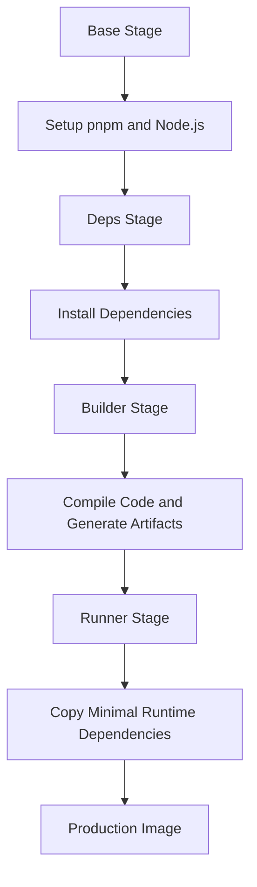
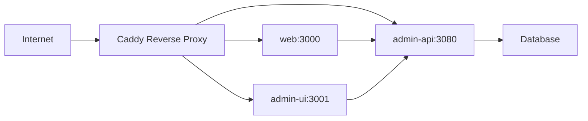
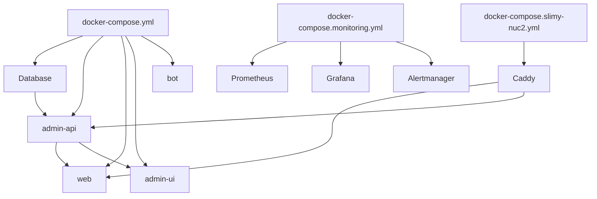

# Docker Configuration

<cite>
**Referenced Files in This Document**   
- [apps/admin-api/Dockerfile](file://apps/admin-api/Dockerfile)
- [apps/admin-ui/Dockerfile](file://apps/admin-ui/Dockerfile)
- [apps/bot/Dockerfile](file://apps/bot/Dockerfile)
- [apps/web/Dockerfile](file://apps/web/Dockerfile)
- [docker-compose.yml](file://docker-compose.yml)
- [infra/docker/docker-compose.slimy-nuc2.yml](file://infra/docker/docker-compose.slimy-nuc2.yml)
- [apps/web/Caddyfile.template](file://apps/web/Caddyfile.template)
- [infra/docker/Caddyfile.slimy-nuc2](file://infra/docker/Caddyfile.slimy-nuc2)
- [apps/web/docker-compose.production.yml](file://apps/web/docker-compose.production.yml)
- [apps/web/docker-compose.monitoring.yml](file://apps/web/docker-compose.monitoring.yml)
- [DOCKER_DEPLOYMENT.md](file://DOCKER_DEPLOYMENT.md)
</cite>

## Table of Contents
1. [Introduction](#introduction)
2. [Dockerfile Architecture](#dockerfile-architecture)
3. [Service-Specific Docker Configurations](#service-specific-docker-configurations)
4. [Multi-Stage Build Process](#multi-stage-build-process)
5. [Environment Configuration and Build Arguments](#environment-configuration-and-build-arguments)
6. [Caddy Integration for Reverse Proxy](#caddy-integration-for-reverse-proxy)
7. [Image Optimization and Security Hardening](#image-optimization-and-security-hardening)
8. [Docker Commands and Build Procedures](#docker-commands-and-build-procedures)
9. [docker-compose Orchestration](#docker-compose-orchestration)
10. [Common Build Issues and Debugging](#common-build-issues-and-debugging)
11. [Production Deployment Workflow](#production-deployment-workflow)

## Introduction
The slimy-monorepo employs a comprehensive Docker containerization strategy to deploy its microservices architecture. This documentation details the Docker configuration for the admin-api, admin-ui, bot, and web services, focusing on containerization best practices, multi-stage builds, and production deployment patterns. The system leverages Docker's multi-stage build capabilities to optimize image size while maintaining build integrity across the monorepo structure. Integration with Caddy as a reverse proxy enables secure routing and TLS termination in production environments. The configuration supports both development and production workflows through environment-specific docker-compose files and build arguments.

**Section sources**
- [DOCKER_DEPLOYMENT.md](file://DOCKER_DEPLOYMENT.md#L1-L326)

## Dockerfile Architecture
The Docker configuration for the slimy-monorepo applications follows a consistent multi-stage architecture pattern across all services. Each Dockerfile is designed to handle the monorepo structure correctly by using the monorepo root as the build context, ensuring proper resolution of workspace dependencies through pnpm. The architecture implements a four-stage build process: base setup, dependency installation, artifact building, and production runtime. This approach minimizes final image size by separating build-time dependencies from runtime requirements. All services use pnpm v10.22.0 for package management, with explicit build script approval configured in pnpm-workspace.yaml to handle Prisma client generation and native binary compilation. The Dockerfiles are optimized for layer caching, with dependency installation separated from source code copying to maximize cache reuse during development iterations.

**Section sources**
- [apps/admin-api/Dockerfile](file://apps/admin-api/Dockerfile#L1-L97)
- [apps/admin-ui/Dockerfile](file://apps/admin-ui/Dockerfile#L1-L81)
- [apps/bot/Dockerfile](file://apps/bot/Dockerfile#L1-L61)
- [apps/web/Dockerfile](file://apps/web/Dockerfile#L1-L93)

## Service-Specific Docker Configurations

### admin-api Docker Configuration
The admin-api service uses a multi-stage Docker build process optimized for Node.js applications with Prisma ORM. The Dockerfile begins with a node:20-alpine base image for minimal footprint, followed by dependency installation that includes workspace packages and vendor dependencies. A dedicated builder stage generates the Prisma client, which is then copied to the final runtime image. The production runner stage uses a clean node:20-alpine image, copying only necessary dependencies and generated artifacts. The container exposes port 3080 and includes a health check that verifies the /health endpoint. The configuration implements proper .dockerignore rules to exclude development files and environment variables from the build context.

**Section sources**
- [apps/admin-api/Dockerfile](file://apps/admin-api/Dockerfile#L1-L97)
- [apps/admin-api/.dockerignore](file://apps/admin-api/.dockerignore#L1-L12)

### admin-ui Docker Configuration
The admin-ui service, built with Next.js, employs a specialized Docker configuration to handle the framework's standalone server mode. The Dockerfile uses node:22-slim as the base image and implements a multi-stage build that properly handles the nested directory structure generated by Next.js standalone mode. The builder stage compiles the application and generates the standalone server output, while the runner stage carefully copies the built artifacts to maintain correct symlinks. A critical fix ensures static assets are copied to the root .next/static directory so the server can locate them. The container runs as a non-root user (nextjs) for security and exposes port 3000. Environment variables for API base URLs are passed as build arguments to enable environment-specific configuration.

**Section sources**
- [apps/admin-ui/Dockerfile](file://apps/admin-ui/Dockerfile#L1-L81)

### bot Docker Configuration
The bot service Docker configuration is optimized for the Discord bot application written in TypeScript. Similar to other services, it uses a multi-stage build with node:22-slim as the base image. The build process installs dependencies, compiles the TypeScript code, and creates a production-ready image with minimal attack surface. The final runner stage copies only the compiled JavaScript files from the dist directory, along with the package.json and production node_modules. The container runs as a dedicated system user (botuser) for security isolation. The configuration includes proper dependency resolution for monorepo workspace packages, ensuring all shared libraries are available during the build process.

**Section sources**
- [apps/bot/Dockerfile](file://apps/bot/Dockerfile#L1-L61)

### web Docker Configuration
The web service Docker configuration supports the Next.js frontend application with Prisma integration. It follows the same multi-stage pattern as other services but includes additional steps for Prisma client generation before the Next.js build. The Dockerfile explicitly copies Tailwind and PostCSS configuration files to ensure they are available during the build process. The runner stage implements a complex copy strategy to handle Next.js standalone mode, copying public assets, static files, and the standalone server output to the correct locations. The container runs as a non-root user (nextjs) and exposes port 3000. Environment variables for external API endpoints are passed as build arguments to support different deployment environments.

**Section sources**
- [apps/web/Dockerfile](file://apps/web/Dockerfile#L1-L93)

## Multi-Stage Build Process
The slimy-monorepo implements a sophisticated multi-stage build process across all services to optimize image size and build efficiency. The process consists of four distinct stages: base, deps, builder, and runner. The base stage sets up the fundamental environment with pnpm installed. The deps stage installs all dependencies, including workspace packages from the monorepo structure, using --frozen-lockfile to ensure reproducible builds. The builder stage compiles source code and generates necessary artifacts like the Prisma client or Next.js standalone server. Finally, the runner stage creates a minimal production image by copying only the required dependencies and built artifacts from previous stages. This approach significantly reduces final image size by excluding development dependencies, source maps, and build tools. The stage separation also enables better Docker layer caching, as dependency installation is decoupled from source code changes, allowing cached layers to be reused when only application code is modified.

**Diagram sources**
- [apps/admin-api/Dockerfile](file://apps/admin-api/Dockerfile#L15-L97)
- [apps/admin-ui/Dockerfile](file://apps/admin-ui/Dockerfile#L1-L81)

## Environment Configuration and Build Arguments
The Docker configuration supports environment-specific deployments through a combination of environment variables and build arguments. Build arguments like NEXT_PUBLIC_ADMIN_API_BASE, NEXT_PUBLIC_SNELP_CODES_URL, and NEXT_PUBLIC_PLAUSIBLE_DOMAIN are passed during the Docker build process to configure the application for different environments. These arguments are converted to environment variables in the container, allowing the application to adapt to its deployment context. For production deployments, environment variables are loaded from external .env files using the env_file directive in docker-compose, keeping sensitive configuration separate from the container image. The system distinguishes between build-time configuration (passed as arguments) and runtime configuration (provided via environment variables), enabling flexible deployment strategies. This approach allows the same Docker image to be deployed across multiple environments with different configurations, promoting consistency and reducing the risk of environment-specific bugs.

**Section sources**
- [docker-compose.yml](file://docker-compose.yml#L87-L118)
- [infra/docker/docker-compose.slimy-nuc2.yml](file://infra/docker/docker-compose.slimy-nuc2.yml#L74-L87)

## Caddy Integration for Reverse Proxy
The production deployment integrates Caddy as a reverse proxy to handle HTTP routing, TLS termination, and security headers. Caddy is configured through Caddyfile templates that define virtual hosts for different subdomains like admin.slimyai.xyz, login.slimyai.xyz, and chat.slimyai.xyz. The reverse proxy routes API requests to the admin-api service on port 3080 while serving frontend content from the web service on port 3000. Caddy automatically provisions and renews TLS certificates using Let's Encrypt, ensuring secure HTTPS connections. The configuration includes comprehensive security headers such as HSTS, XSS protection, and content security policies to protect against common web vulnerabilities. Health checks are configured for upstream services to ensure traffic is only routed to healthy instances. The Caddy container runs in host network mode to simplify port binding and certificate provisioning, with configuration files mounted as read-only volumes for security.

**Diagram sources**
- [infra/docker/docker-compose.slimy-nuc2.yml](file://infra/docker/docker-compose.slimy-nuc2.yml#L105-L119)
- [infra/docker/Caddyfile.slimy-nuc2](file://infra/docker/Caddyfile.slimy-nuc2#L1-L133)

## Image Optimization and Security Hardening
The Docker configuration implements several optimization and security hardening measures to ensure efficient and secure container deployments. Image size is minimized through multi-stage builds that exclude development dependencies from the final runtime image. Alpine Linux and slim variants are used as base images to reduce the attack surface and download size. Security is enhanced by running containers as non-root users with dedicated system accounts, reducing the potential impact of privilege escalation vulnerabilities. The configuration includes health checks for all services to enable automatic container restarts when applications become unresponsive. Sensitive files like environment variables and secrets are excluded from the build context using .dockerignore and mounted as read-only volumes in production. Dependency caching is optimized by ordering Dockerfile instructions to maximize layer reuse, with dependency installation separated from application code copying. The system also implements proper cleanup of package manager caches to reduce image size.

**Section sources**
- [apps/admin-api/Dockerfile](file://apps/admin-api/Dockerfile#L15-L97)
- [apps/admin-ui/Dockerfile](file://apps/admin-ui/Dockerfile#L54-L55)
- [apps/bot/Dockerfile](file://apps/bot/Dockerfile#L47-L48)

## Docker Commands and Build Procedures
The Docker build and deployment process follows a standardized procedure documented in DOCKER_DEPLOYMENT.md. The build process begins with pulling the latest code from the repository, followed by installing dependencies using pnpm. Before building Docker images, the Prisma client must be generated to ensure type safety and database connectivity. The docker-compose build command is used with the appropriate configuration file (docker-compose.slimy-nuc1.yml or docker-compose.slimy-nuc2.yml) to build all services. For production deployments, the --no-cache flag can be used to ensure a clean build when encountering overlay2 storage driver issues. Containers are started using docker-compose up with the -d flag for detached operation. The system includes monitoring services that can be enabled by combining multiple docker-compose files. For troubleshooting, the docker-compose logs command provides access to container output, while docker builder prune can be used to clean build cache when encountering corruption issues.

**Section sources**
- [DOCKER_DEPLOYMENT.md](file://DOCKER_DEPLOYMENT.md#L43-L95)

## docker-compose Orchestration
The slimy-monorepo uses docker-compose for service orchestration, with multiple configuration files for different deployment scenarios. The primary docker-compose.yml defines all core services including the database, admin-api, web, admin-ui, and bot, with proper dependency ordering and health checks. Production deployments use specialized configuration files like docker-compose.slimy-nuc2.yml that include Caddy as a reverse proxy and configure external volumes for data persistence. The monitoring stack is defined in docker-compose.monitoring.yml, which can be combined with the main configuration to enable Prometheus, Grafana, and Alertmanager for observability. Service dependencies are carefully configured with condition: service_healthy to ensure proper startup ordering, particularly for services that depend on the database. Network isolation is achieved through a dedicated bridge network, while external access is controlled through explicit port mappings. The configuration supports environment variable injection from external files, allowing sensitive configuration to be managed separately from the codebase.

**Diagram sources**
- [docker-compose.yml](file://docker-compose.yml#L1-L154)
- [infra/docker/docker-compose.slimy-nuc2.yml](file://infra/docker/docker-compose.slimy-nuc2.yml#L1-L149)
- [apps/web/docker-compose.monitoring.yml](file://apps/web/docker-compose.monitoring.yml#L1-L63)

## Common Build Issues and Debugging
Several common build issues have been identified and documented in the DOCKER_DEPLOYMENT.md guide. The most frequent problem is Docker overlay2 cache corruption, which manifests as errors about replacing directories with files during the build process. This is resolved by stopping the stack, pruning the build cache, and rebuilding with --no-cache. Another common issue involves pnpm v10's security feature that blocks dependency lifecycle scripts by default, preventing Prisma client generation. This is addressed by configuring pnpm-workspace.yaml with onlyBuiltDependencies to explicitly allow trusted packages. Font loading failures during build have been resolved by switching from Google Fonts to system fonts via Tailwind CSS. Multiple lockfile warnings are prevented by maintaining a single root pnpm-lock.yaml. Debugging typically involves checking Docker logs with docker-compose logs -f, verifying environment file locations, and ensuring the build context is correctly set to the monorepo root.

**Section sources**
- [DOCKER_DEPLOYMENT.md](file://DOCKER_DEPLOYMENT.md#L187-L285)

## Production Deployment Workflow
The production deployment workflow for the slimy-monorepo follows a structured process to ensure reliable updates. The workflow begins with local development and testing, followed by committing changes to the repository. On the target NUC server, the process involves pulling the latest code, running the build sequence locally to verify integrity, and then building Docker images using the appropriate docker-compose configuration file. The deployment uses a blue-green pattern where the new stack is built alongside the existing one, minimizing downtime. Caddy automatically handles TLS certificate provisioning and renewal, while health checks ensure traffic is only routed to healthy services. The workflow includes safeguards against common issues like overlay2 cache corruption, with documented procedures for cache cleanup and rebuild. Monitoring services provide visibility into application performance and error rates, enabling rapid response to production issues. The entire process is designed to be repeatable and reliable, with clear documentation for each step.

**Section sources**
- [DOCKER_DEPLOYMENT.md](file://DOCKER_DEPLOYMENT.md#L11-L54)
- [infra/docker/docker-compose.slimy-nuc2.yml](file://infra/docker/docker-compose.slimy-nuc2.yml#L1-L149)