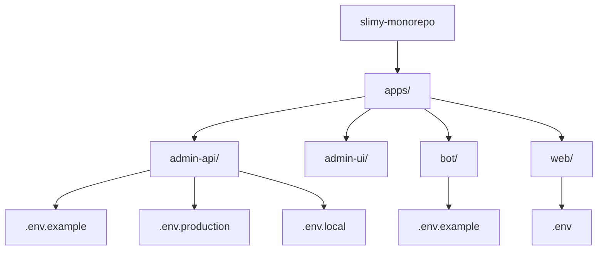
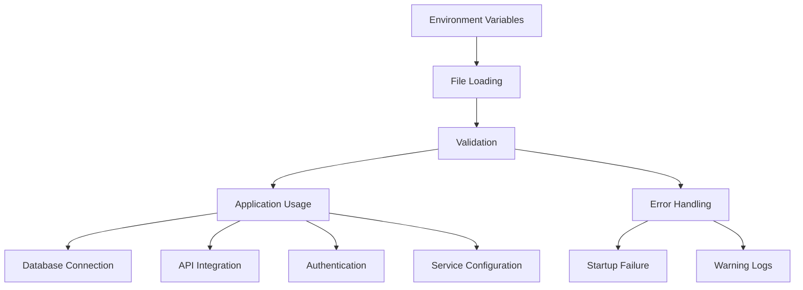
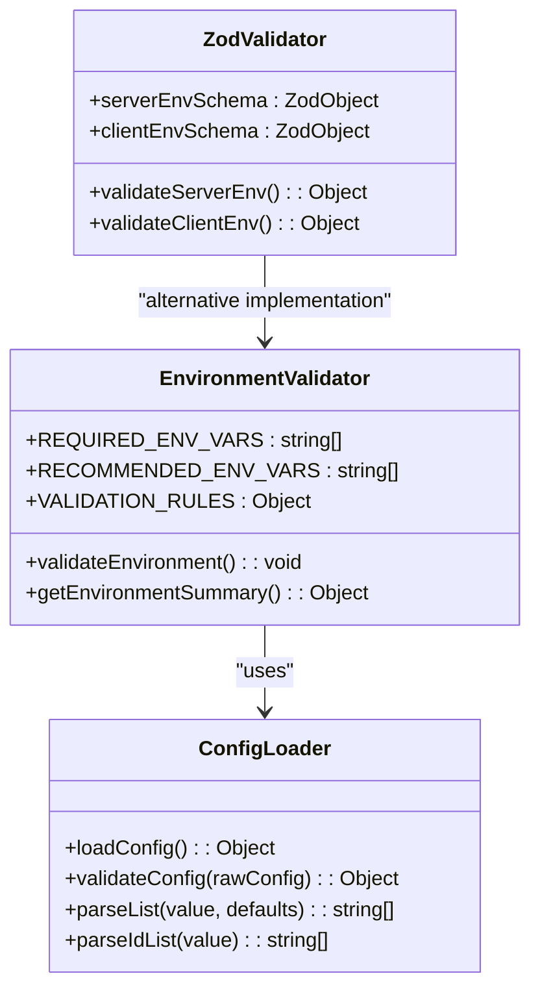
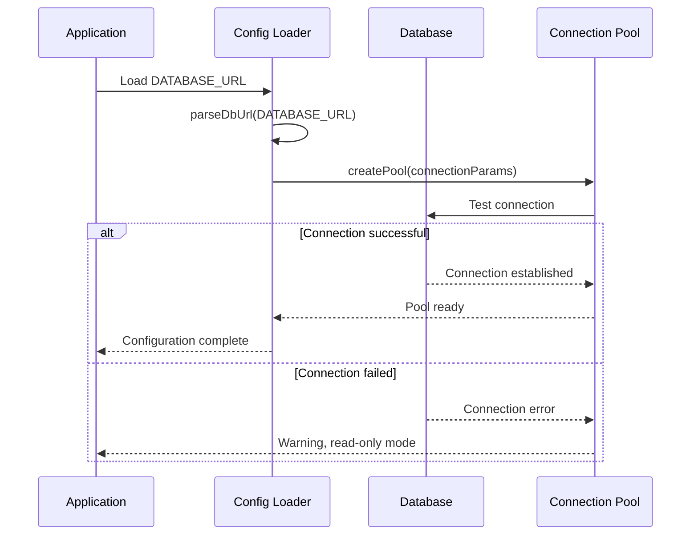
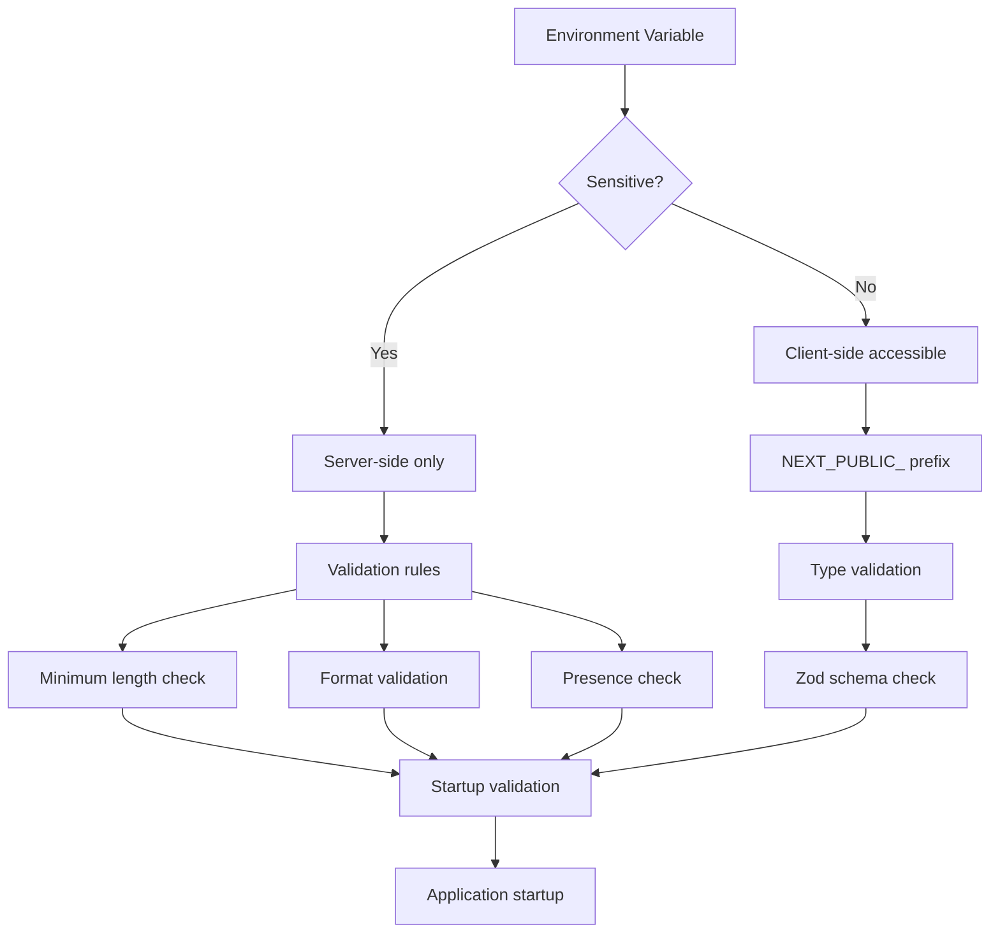
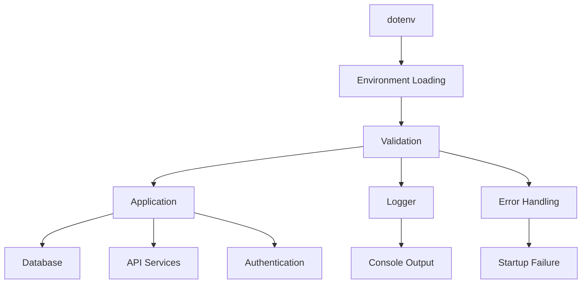

# Environment Variables

<cite>
**Referenced Files in This Document**   
- [.env](file://apps/admin-api/.env)
- [.env.example](file://apps/admin-api/.env.example)
- [.env.production](file://apps/admin-api/.env.production)
- [.env.local](file://apps/admin-api/.env.local)
- [.env.admin](file://apps/admin-api/.env.admin)
- [.env](file://apps/web/.env)
- [.env.example](file://apps/bot/.env.example)
- [env-validation.js](file://apps/admin-api/src/lib/env-validation.js)
- [config.js](file://apps/admin-api/src/config.js)
- [index.js](file://apps/admin-api/src/lib/config/index.js)
- [env.js](file://apps/web/lib/env.js)
- [env.ts](file://apps/web/lib/env.ts)
- [database.js](file://apps/admin-api/lib/database.js)
- [db.ts](file://apps/web/lib/db.ts)
- [redis.js](file://apps/admin-api/lib/cache/redis.js)
</cite>

## Table of Contents
1. [Introduction](#introduction)
2. [Project Structure](#project-structure)
3. [Core Components](#core-components)
4. [Architecture Overview](#architecture-overview)
5. [Detailed Component Analysis](#detailed-component-analysis)
6. [Dependency Analysis](#dependency-analysis)
7. [Performance Considerations](#performance-considerations)
8. [Troubleshooting Guide](#troubleshooting-guide)
9. [Conclusion](#conclusion)
10. [Appendices](#appendices) (if necessary)

## Introduction
The slimy-monorepo employs a comprehensive environment variable management system across its microservices architecture. This documentation details the configuration strategy for development, staging, and production environments, focusing on security practices, validation mechanisms, and hierarchical loading patterns. The system ensures consistent behavior across applications while maintaining environment-specific configurations for database connections, API integrations, authentication secrets, and service endpoints.

## Project Structure
The slimy-monorepo follows a monorepo architecture with multiple applications under the `apps/` directory, each with its own environment configuration. The primary applications include `admin-api`, `admin-ui`, `bot`, and `web`, each maintaining environment-specific `.env` files. The configuration system uses a hierarchy of environment files, with example files providing templates and production files containing actual secrets. The structure supports both server-side and client-side environment variables, with careful separation of sensitive data.

**Diagram sources**
- [.env.example](file://apps/admin-api/.env.example)
- [.env](file://apps/web/.env)
- [.env.example](file://apps/bot/.env.example)

**Section sources**
- [apps/admin-api/.env.example](file://apps/admin-api/.env.example)
- [apps/web/.env](file://apps/web/.env)
- [apps/bot/.env.example](file://apps/bot/.env.example)

## Core Components
The environment variable system in the slimy-monorepo consists of several core components: validation mechanisms, configuration loaders, and security practices. The `env-validation.js` file in the admin-api application defines required and recommended environment variables with specific validation rules. The `config.js` and `index.js` files in the config module provide centralized access to configuration values with default fallbacks. The web application uses Zod schemas in `env.js` and `env.ts` for type-safe environment variable validation, distinguishing between server-side and client-side variables.

**Section sources**
- [env-validation.js](file://apps/admin-api/src/lib/env-validation.js)
- [config.js](file://apps/admin-api/src/config.js)
- [index.js](file://apps/admin-api/src/lib/config/index.js)
- [env.js](file://apps/web/lib/env.js)
- [env.ts](file://apps/web/lib/env.ts)

## Architecture Overview
The environment variable architecture follows a layered approach with validation at multiple levels. Each application loads environment variables from `.env` files using dotenv or equivalent mechanisms, then validates them against predefined schemas. The admin-api uses a custom validation system with specific rules for secrets, database URLs, and API keys, while the web application employs Zod for comprehensive type checking. Sensitive variables are never exposed to the client side, with public variables prefixed with `NEXT_PUBLIC_`. The system includes startup validation that prevents application launch if critical variables are missing or invalid.

**Diagram sources**
- [env-validation.js](file://apps/admin-api/src/lib/env-validation.js)
- [env.js](file://apps/web/lib/env.js)
- [env.ts](file://apps/web/lib/env.ts)

## Detailed Component Analysis

### Environment Validation and Configuration Loading
The environment variable system in the slimy-monorepo implements robust validation and configuration loading patterns. The admin-api application uses a custom validation mechanism defined in `env-validation.js` that checks for required variables such as `SESSION_SECRET`, `JWT_SECRET`, `DISCORD_CLIENT_ID`, `DISCORD_CLIENT_SECRET`, and `DATABASE_URL`. These variables must meet specific criteria, including minimum length requirements for secrets and proper formatting for database URLs. The validation process distinguishes between required and recommended variables, providing warnings for missing recommended values while preventing startup if required variables are absent.

**Diagram sources**
- [env-validation.js](file://apps/admin-api/src/lib/env-validation.js)
- [index.js](file://apps/admin-api/src/lib/config/index.js)
- [env.js](file://apps/web/lib/env.js)
- [env.ts](file://apps/web/lib/env.ts)

### Database Configuration and Connection Management
Database configuration in the slimy-monorepo is managed through environment variables that define connection parameters. The admin-api application uses the `DATABASE_URL` variable in MySQL connection string format, while the web application relies on Prisma for database operations. The `database.js` file in admin-api includes a `parseDbUrl` function that extracts connection parameters from the URL, and implements connection pooling with error handling for failed database connections. The system allows the application to continue in read-only mode if the database is unavailable, providing graceful degradation.

**Diagram sources**
- [database.js](file://apps/admin-api/lib/database.js)
- [db.ts](file://apps/web/lib/db.ts)
- [index.js](file://apps/admin-api/src/lib/config/index.js)

### Security Practices for Sensitive Data
The slimy-monorepo implements several security practices for handling sensitive data in environment variables. Critical secrets such as `SESSION_SECRET`, `JWT_SECRET`, `DISCORD_CLIENT_SECRET`, and `OPENAI_API_KEY` are never committed to version control, with example files providing templates without actual values. The validation system enforces minimum length requirements for secrets (32+ characters) and checks for proper formatting of API keys. Client-side exposure is minimized by prefixing public variables with `NEXT_PUBLIC_`, ensuring that sensitive server-side variables remain inaccessible to browser code. The system also includes warnings for potentially misconfigured values, such as OpenAI API keys that don't start with "sk-".

**Diagram sources**
- [env-validation.js](file://apps/admin-api/src/lib/env-validation.js)
- [index.js](file://apps/admin-api/src/lib/config/index.js)
- [env.js](file://apps/web/lib/env.js)
- [env.ts](file://apps/web/lib/env.ts)

## Dependency Analysis
The environment variable system has dependencies across multiple applications and libraries. The admin-api depends on `mysql2/promise` for database operations and custom validation logic, while the web application relies on Zod for schema validation. Both applications use dotenv or equivalent mechanisms to load environment variables from files. The configuration system is tightly coupled with the application startup process, as validation occurs before the main application logic initializes. There are no circular dependencies in the configuration system, with clear separation between loading, validation, and usage layers.

**Diagram sources**
- [env-validation.js](file://apps/admin-api/src/lib/env-validation.js)
- [env.js](file://apps/web/lib/env.js)
- [env.ts](file://apps/web/lib/env.ts)
- [database.js](file://apps/admin-api/lib/database.js)

**Section sources**
- [env-validation.js](file://apps/admin-api/src/lib/env-validation.js)
- [env.js](file://apps/web/lib/env.js)
- [env.ts](file://apps/web/lib/env.ts)
- [database.js](file://apps/admin-api/lib/database.js)

## Performance Considerations
The environment variable system is designed for minimal performance impact. Configuration loading and validation occur once at application startup, with cached results used throughout the application lifecycle. The validation process is optimized to check only necessary variables and rules, avoiding expensive operations during runtime. Database connection pooling reduces the overhead of establishing new connections for each request. The use of environment variables themselves has negligible performance cost, as they are accessed directly from the process environment. The system prioritizes startup validation over runtime checks to ensure configuration correctness before handling requests.

## Troubleshooting Guide
Common issues with environment variables in the slimy-monorepo typically involve missing or incorrectly formatted values. If the application fails to start, check the console output for validation errors indicating which variables are missing or invalid. For database connection issues, verify that `DATABASE_URL` is correctly formatted and accessible from the application environment. Authentication problems may indicate incorrect `DISCORD_CLIENT_ID` or `DISCORD_CLIENT_SECRET` values. When deploying to production, ensure that `.env.production` contains all required variables and that file permissions prevent unauthorized access. Use the `getEnvironmentSummary` function to debug configuration issues by logging non-sensitive variable states.

**Section sources**
- [env-validation.js](file://apps/admin-api/src/lib/env-validation.js)
- [index.js](file://apps/admin-api/src/lib/config/index.js)
- [env.js](file://apps/web/lib/env.js)
- [env.ts](file://apps/web/lib/env.ts)

## Conclusion
The environment variable management system in the slimy-monorepo provides a robust foundation for configuration across multiple environments. By implementing comprehensive validation, secure handling of secrets, and clear separation between server and client variables, the system ensures reliable operation while maintaining security. The use of example files, hierarchical loading, and startup validation helps prevent configuration-related issues in production. Developers should follow the established patterns when adding new configuration variables, ensuring proper validation and documentation to maintain system integrity.