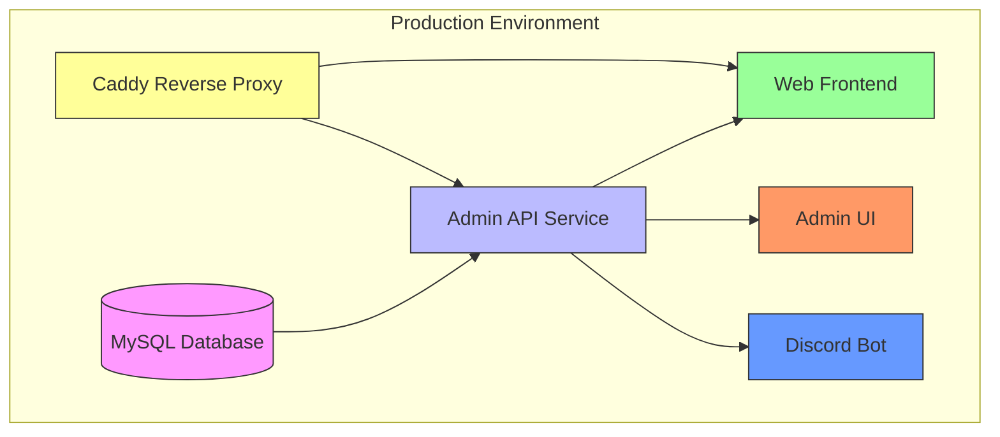
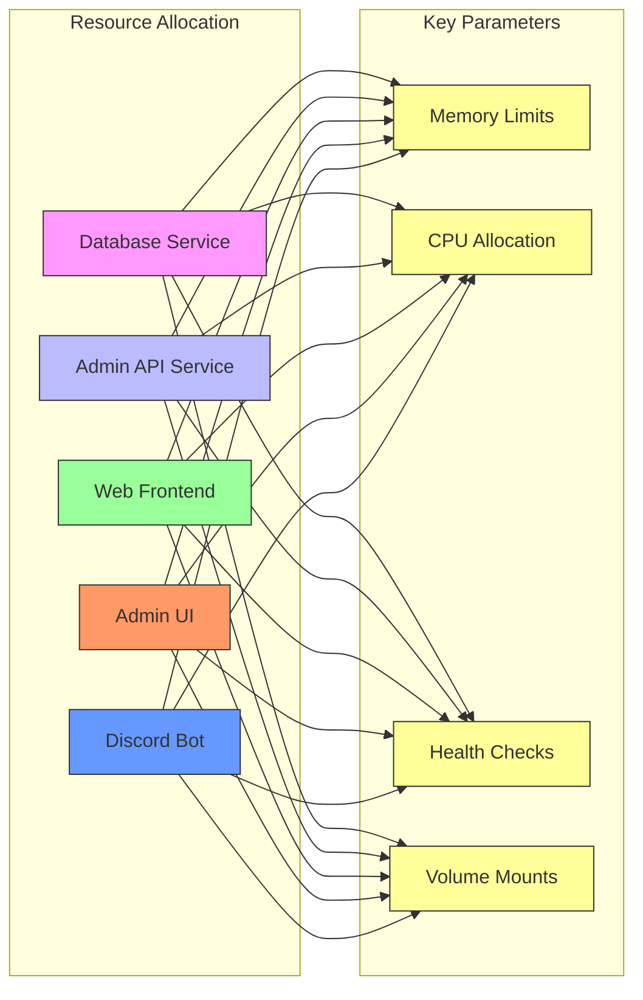
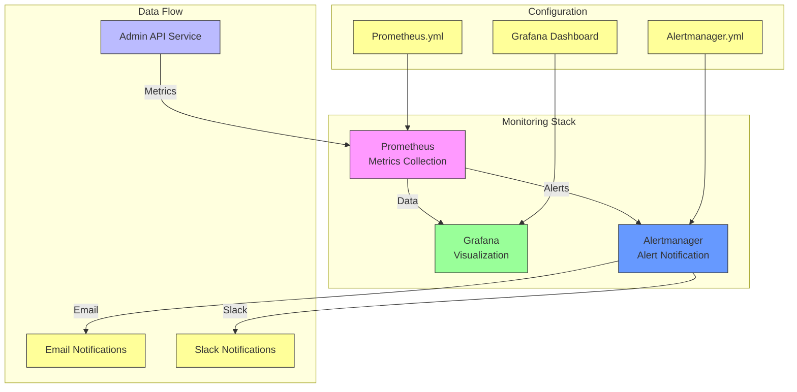
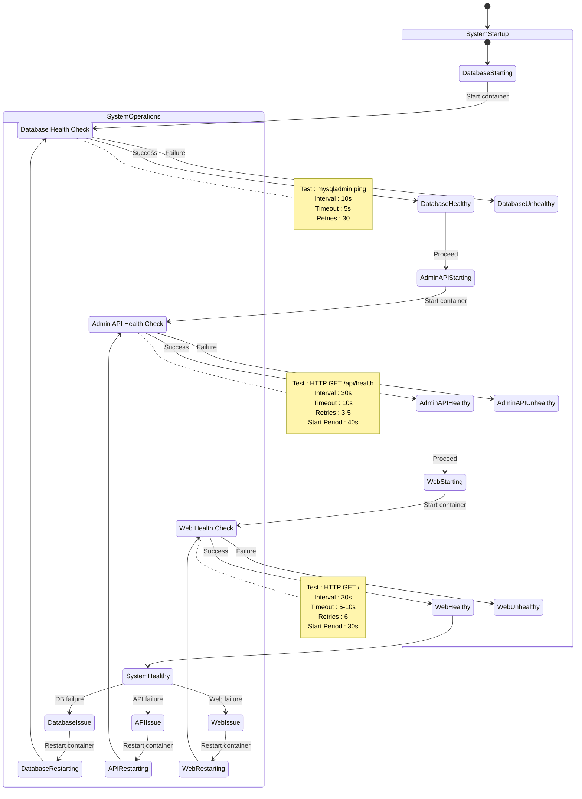
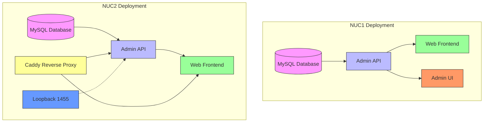

# Production Setup

<cite>
**Referenced Files in This Document**   
- [docker-compose.yml](file://docker-compose.yml)
- [docker-compose.production.yml](file://apps/web/docker-compose.production.yml)
- [docker-compose.monitoring.yml](file://apps/web/docker-compose.monitoring.yml)
- [docker-compose.slimy-nuc1.yml](file://infra/docker/docker-compose.slimy-nuc1.yml)
- [docker-compose.slimy-nuc2.yml](file://infra/docker/docker-compose.slimy-nuc2.yml)
- [Dockerfile](file://apps/admin-api/Dockerfile)
- [Dockerfile](file://apps/web/Dockerfile)
- [Dockerfile](file://apps/bot/Dockerfile)
- [deploy-to-server.sh](file://apps/web/deploy-to-server.sh)
- [grafana-dashboard.json](file://apps/admin-api/monitoring/dashboards/grafana-dashboard.json)
- [alertmanager.yml](file://apps/web/monitoring/alertmanager.yml)
</cite>

## Table of Contents
1. [Multi-Container Orchestration Strategy](#multi-container-orchestration-strategy)
2. [Environment-Specific Docker Compose Configurations](#environment-specific-docker-compose-configurations)
3. [Resource Allocation and Performance Tuning](#resource-allocation-and-performance-tuning)
4. [Logging and Monitoring Configuration](#logging-and-monitoring-configuration)
5. [Health Checks and Production Resilience](#health-checks-and-production-resilience)
6. [Physical Hardware Deployment (NUC1/NUC2)](#physical-hardware-deployment-nuc1nuc2)
7. [Zero-Downtime Deployments and Rollback Strategies](#zero-downtime-deployments-and-rollback-strategies)
8. [Backup Mechanisms and Disaster Recovery](#backup-mechanisms-and-disaster-recovery)
9. [Performance Tuning Recommendations](#performance-tuning-recommendations)

## Multi-Container Orchestration Strategy

The slimy-monorepo implements a comprehensive multi-container orchestration strategy using Docker Compose to manage service dependencies, network configuration, and volume mounting. The architecture consists of four primary services: database (MySQL), admin API (backend), web (frontend), admin UI (admin frontend), and bot (Discord integration).

The orchestration strategy establishes explicit service dependencies through the `depends_on` directive with health-based conditions. The admin-api service depends on the db service being healthy before startup, ensuring database availability. Similarly, the web and admin-ui services depend on the admin-api service being healthy, creating a proper startup sequence that prevents race conditions.

Network configuration is handled through a dedicated bridge network named `slimy-network` (or `slimy-net` in NUC-specific configurations). This isolated network enables secure inter-service communication while maintaining separation from the host network. All services are connected to this network, allowing them to communicate using service names as hostnames.

Volume mounting is implemented for both persistent data storage and configuration management. The database service uses a named volume `mysql_data` for persistent storage of MySQL data. Application services mount configuration files and data directories as needed, with specific volume configurations varying between environments.



**Diagram sources**
- [docker-compose.yml](file://docker-compose.yml#L5-L154)
- [docker-compose.slimy-nuc2.yml](file://infra/docker/docker-compose.slimy-nuc2.yml#L105-L119)

**Section sources**
- [docker-compose.yml](file://docker-compose.yml#L1-L154)
- [infra/docker/docker-compose.slimy-nuc1.yml](file://infra/docker/docker-compose.slimy-nuc1.yml#L1-L172)
- [infra/docker/docker-compose.slimy-nuc2.yml](file://infra/docker/docker-compose.slimy-nuc2.yml#L1-L149)

## Environment-Specific Docker Compose Configurations

The slimy-monorepo employs different Docker Compose configurations for various environments: local development, staging, and production. This approach allows for environment-specific optimizations while maintaining consistency in the core service definitions.

The base `docker-compose.yml` file serves as the foundation for local development, exposing all services on standard ports and using environment variables from local `.env` files. This configuration prioritizes developer convenience with minimal security restrictions and maximum visibility into service operations.

The production configuration, represented by `docker-compose.production.yml`, focuses on security and performance. It uses external networks, restricts environment variables to production values, and configures health checks with appropriate timeouts and retry policies. The production configuration also sets explicit restart policies to ensure service availability.

Environment-specific configurations are further specialized for physical hardware deployments on NUC1 and NUC2 systems. The `docker-compose.slimy-nuc1.yml` and `docker-compose.slimy-nuc2.yml` files contain hardware-specific optimizations, including:

- NUC1 configuration uses local volume mounts and internal network routing
- NUC2 configuration implements Caddy as a reverse proxy with host network mode for improved performance
- Different volume mounting strategies for data persistence and backup operations
- Hardware-specific resource allocation and startup sequences

The configuration hierarchy follows Docker Compose's multiple file override pattern, where base configurations are extended and modified by environment-specific files. This allows for incremental changes rather than maintaining completely separate configuration files.

```mermaid
graph TD
Base[Base Configuration<br>docker-compose.yml] --> Local[Local Development]
Base --> Staging[Staging Environment]
Base --> Production[Production Base]
Production --> NUC1[NUC1 Configuration<br>docker-compose.slimy-nuc1.yml]
Production --> NUC2[NUC2 Configuration<br>docker-compose.slimy-nuc2.yml]
Local -.->|Uses .env files| EnvFiles[.env, .env.local]
Staging -.->|Uses staging vars| EnvFiles
NUC1 -.->|Uses production secrets| SecretFiles[/opt/slimy/secrets/.env.*]
NUC2 -.->|Uses production secrets| SecretFiles
style Base fill:#f9f,stroke:#333
style Local fill:#9f9,stroke:#333
style Staging fill:#9f9,stroke:#333
style Production fill:#f96,stroke:#333
style NUC1 fill:#69f,stroke:#333
style NUC2 fill:#69f,stroke:#333
style EnvFiles fill:#ff9,stroke:#333
style SecretFiles fill:#ff9,stroke:#333
click Base "file://docker-compose.yml"
click NUC1 "file://infra/docker/docker-compose.slimy-nuc1.yml"
click NUC2 "file://infra/docker/docker-compose.slimy-nuc2.yml"
```

**Diagram sources**
- [docker-compose.yml](file://docker-compose.yml)
- [docker-compose.production.yml](file://apps/web/docker-compose.production.yml)
- [docker-compose.slimy-nuc1.yml](file://infra/docker/docker-compose.slimy-nuc1.yml)
- [docker-compose.slimy-nuc2.yml](file://infra/docker/docker-compose.slimy-nuc2.yml)

**Section sources**
- [docker-compose.yml](file://docker-compose.yml)
- [apps/web/docker-compose.production.yml](file://apps/web/docker-compose.production.yml)
- [infra/docker/docker-compose.slimy-nuc1.yml](file://infra/docker/docker-compose.slimy-nuc1.yml)
- [infra/docker/docker-compose.slimy-nuc2.yml](file://infra/docker/docker-compose.slimy-nuc2.yml)

## Resource Allocation and Performance Tuning

The production setup implements strategic resource allocation and performance tuning to ensure optimal operation under production workloads. Each service is configured with appropriate resource limits and startup parameters to balance performance with system stability.

For the database service, resource allocation focuses on memory and storage optimization. The MySQL container is configured with appropriate memory limits and uses a dedicated named volume for data persistence. The health check interval is set to 10 seconds with a 5-second timeout, allowing for timely detection of database issues while avoiding excessive load from frequent checks.

The admin-api service, being the core backend component, receives special attention in resource allocation. It uses a multi-stage Docker build process to minimize image size while ensuring all dependencies are properly installed. The service is configured with a 30-second health check interval and a 40-second start period to accommodate initialization time for database connections and service startup.

The web frontend service is optimized for high-concurrency scenarios with a focus on response time and connection handling. It uses a standalone Next.js server configuration with static assets properly mounted to ensure fast content delivery. The health check is configured with a 30-second interval and 5-second timeout to quickly detect service issues.

Resource allocation varies between the NUC1 and NUC2 deployments based on hardware capabilities:

- NUC1: Standard resource allocation with local volume mounting
- NUC2: Enhanced resource allocation with external volumes and Caddy reverse proxy for improved performance



**Diagram sources**
- [docker-compose.yml](file://docker-compose.yml)
- [docker-compose.slimy-nuc1.yml](file://infra/docker/docker-compose.slimy-nuc1.yml)
- [docker-compose.slimy-nuc2.yml](file://infra/docker/docker-compose.slimy-nuc2.yml)

**Section sources**
- [docker-compose.yml](file://docker-compose.yml)
- [infra/docker/docker-compose.slimy-nuc1.yml](file://infra/docker/docker-compose.slimy-nuc1.yml)
- [infra/docker/docker-compose.slimy-nuc2.yml](file://infra/docker/docker-compose.slimy-nuc2.yml)

## Logging and Monitoring Configuration

The production setup includes a comprehensive logging and monitoring configuration to ensure system observability and rapid issue detection. The monitoring stack consists of Prometheus for metrics collection, Grafana for visualization, and Alertmanager for alert notification.

The monitoring services are defined in `docker-compose.monitoring.yml`, which can be combined with the base configuration using Docker Compose's multiple file feature. This modular approach allows monitoring to be enabled or disabled as needed without modifying the core service definitions.

Prometheus is configured to scrape metrics from the admin-api service, collecting key performance indicators such as request rates, response times, error rates, and system resource usage. The configuration includes a 200-hour retention period for time-series data, balancing storage requirements with historical analysis capabilities.

Grafana provides a web-based dashboard for visualizing system metrics, with a pre-configured dashboard defined in `grafana-dashboard.json`. This dashboard includes panels for service health, uptime, error rates, response time percentiles, request rates, HTTP status codes, memory usage, database performance, and application metrics. Grafana is configured with a default admin password and plugin installation for enhanced visualization capabilities.

Alertmanager handles alert notifications with configurable routes based on severity levels. The configuration supports email notifications with customizable templates, and includes commented configuration for Slack integration. Alert routing is configured with appropriate group wait, group interval, and repeat interval settings to prevent alert fatigue while ensuring timely notification of critical issues.

Log aggregation is implemented through centralized logging to designated log directories, with logs stored in `/opt/slimy/logs/` on the NUC2 deployment. The Caddy reverse proxy also maintains access logs with rotation configured to keep the most recent 10 files of up to 10MB each.



**Diagram sources**
- [docker-compose.monitoring.yml](file://apps/web/docker-compose.monitoring.yml)
- [grafana-dashboard.json](file://apps/admin-api/monitoring/dashboards/grafana-dashboard.json)
- [alertmanager.yml](file://apps/web/monitoring/alertmanager.yml)

**Section sources**
- [apps/web/docker-compose.monitoring.yml](file://apps/web/docker-compose.monitoring.yml)
- [apps/admin-api/monitoring/dashboards/grafana-dashboard.json](file://apps/admin-api/monitoring/dashboards/grafana-dashboard.json)
- [apps/web/monitoring/alertmanager.yml](file://apps/web/monitoring/alertmanager.yml)

## Health Checks and Production Resilience

The production setup implements comprehensive health checks to ensure system resilience and automatic recovery from failures. Each service is configured with appropriate health check parameters that validate both container liveness and application readiness.

The database service uses a MySQL-specific health check that executes `mysqladmin ping` to verify database connectivity. This check runs every 10 seconds with a 5-second timeout and allows 30 retries before marking the service as unhealthy. The health check uses environment variables for authentication, ensuring it can adapt to different deployment configurations.

The admin-api service implements an HTTP-based health check that queries the `/api/health` endpoint. This application-level check verifies not only that the service is running but also that it can respond to requests and access its dependencies. The check runs every 30 seconds with a 10-second timeout and 3-5 retries, with a 40-second start period to accommodate initialization time.

The web frontend service uses a similar HTTP health check targeting the root path (`/`). This check ensures the Next.js application is fully operational and capable of serving content. The health check is configured with a 30-second interval, 5-10 second timeout, and appropriate retry policies.

Health checks are integrated with service dependencies through the `depends_on` directive with `service_healthy` conditions. This ensures services only start when their dependencies are fully operational, preventing cascading failures during startup. For example, the web service depends on both the admin-api and database services being healthy before starting.

The health check configuration varies between environments to account for different performance characteristics and reliability requirements:

- Local/staging: More lenient timeouts and fewer retries
- Production (NUC1): Standard production settings
- Production (NUC2): Enhanced settings with longer start periods for critical services



**Diagram sources**
- [docker-compose.yml](file://docker-compose.yml)
- [docker-compose.slimy-nuc1.yml](file://infra/docker/docker-compose.slimy-nuc1.yml)
- [docker-compose.slimy-nuc2.yml](file://infra/docker/docker-compose.slimy-nuc2.yml)

**Section sources**
- [docker-compose.yml](file://docker-compose.yml)
- [infra/docker/docker-compose.slimy-nuc1.yml](file://infra/docker/docker-compose.slimy-nuc1.yml)
- [infra/docker/docker-compose.slimy-nuc2.yml](file://infra/docker/docker-compose.slimy-nuc2.yml)

## Physical Hardware Deployment (NUC1/NUC2)

The production setup includes specialized configurations for deployment on physical hardware, specifically Intel NUC1 and NUC2 systems. These configurations address hardware-specific requirements for performance, reliability, and maintenance.

The NUC1 deployment, configured in `docker-compose.slimy-nuc1.yml`, uses a standard Docker Compose setup with local volume mounting and internal network routing. Key features include:

- Dedicated named volumes for database, application data, and uploads
- Local file system mounts for configuration files from `/opt/slimy/app/`
- Standard bridge network configuration
- Health checks with appropriate start periods for service initialization

The NUC2 deployment, configured in `docker-compose.slimy-nuc2.yml`, implements a more sophisticated architecture optimized for production performance and reliability. Key features include:

- Caddy reverse proxy running in host network mode for improved performance
- External named volumes for database and Caddy data, enabling data persistence across container updates
- Hardware-specific volume mounts for backups, logs, and configuration
- Loopback service for port 1455 to support specific application requirements
- Enhanced security with read-only mounts for sensitive configuration files

Both NUC deployments use environment-specific `.env` files stored in protected directories (`/opt/slimy/secrets/`) to manage sensitive configuration data. The NUC2 deployment specifically mounts a Google service account key file for authentication with external services.

The deployment process for both NUC systems is automated through the `deploy-to-server.sh` script, which handles repository updates, configuration management, Docker container management, and service verification. This script also configures Caddy as a reverse proxy with SSL termination, security headers, and access logging.



**Diagram sources**
- [docker-compose.slimy-nuc1.yml](file://infra/docker/docker-compose.slimy-nuc1.yml)
- [docker-compose.slimy-nuc2.yml](file://infra/docker/docker-compose.slimy-nuc2.yml)

**Section sources**
- [infra/docker/docker-compose.slimy-nuc1.yml](file://infra/docker/docker-compose.slimy-nuc1.yml)
- [infra/docker/docker-compose.slimy-nuc2.yml](file://infra/docker/docker-compose.slimy-nuc2.yml)
- [apps/web/deploy-to-server.sh](file://apps/web/deploy-to-server.sh)

## Zero-Downtime Deployments and Rollback Strategies

The production setup implements robust zero-downtime deployment and rollback strategies to ensure service availability during updates and maintenance. These strategies leverage Docker Compose's service orchestration capabilities and complementary tools like Caddy for traffic management.

The deployment process is automated through the `deploy-to-server.sh` script, which implements a comprehensive deployment workflow:

1. Repository update or clone
2. Service status verification
3. Configuration file generation
4. Caddy reverse proxy configuration
5. Docker container recreation
6. Health verification
7. Systemd service configuration

The zero-downtime deployment strategy relies on Caddy's reverse proxy capabilities to manage traffic during updates. When updating the web service, the deployment script configures Caddy to route traffic to the new container while the old container continues to serve existing connections. This approach ensures no requests are dropped during the deployment process.

Rollback strategies are implemented through several mechanisms:

- Docker Compose maintains previous container states, allowing for quick rollback using `docker compose down` followed by `docker compose up` with the previous configuration
- Caddy configuration backups are created before updates, enabling rapid restoration of the previous proxy configuration
- Systemd service files provide an additional layer of service management and recovery

The deployment script includes comprehensive health checks after deployment to verify service functionality before considering the deployment successful. These checks include:

- Direct container access on localhost
- External access through the Caddy reverse proxy
- API endpoint verification when the admin API is available

Version control of configuration files and Docker images ensures that previous working versions can be restored if needed. The use of tagged Docker images (implied by the build process) allows for consistent deployment of specific versions across environments.

```mermaid
graph TD
A[Start Deployment] --> B[Update Repository]
B --> C{Admin API Running?}
C --> |Yes| D[Mark API Status]
C --> |No| E[Warn API Status]
D --> F[Generate docker-compose.yml]
E --> F
F --> G[Backup Caddy Configuration]
G --> H[Update Caddy Configuration]
H --> I[Reload Caddy]
I --> J[Stop Old Containers]
J --> K[Start New Containers]
K --> L[Wait for Health]
L --> M[Test Web App]
M --> N{Test Success?}
N --> |Yes| O[Test Caddy Proxy]
N --> |No| P[Display Logs]
P --> Q[Exit Failure]
O --> R{Test Success?}
R --> |Yes| S[Test API Proxy]
R --> |No| P
S --> T{Test Success?}
T --> |Yes| U[Create Systemd Service]
T --> |No| V[Warning Only]
V --> U
U --> W[Display Summary]
W --> X[Deployment Complete]
style A fill:#f9f,stroke:#333
style Q fill:#f66,stroke:#333
style X fill:#9f9,stroke:#333
style P fill:#f66,stroke:#333
style V fill:#f96,stroke:#333
click A "file://apps/web/deploy-to-server.sh#L8"
click B "file://apps/web/deploy-to-server.sh#L21-L32"
click C "file://apps/web/deploy-to-server.sh#L35-L43"
click F "file://apps/web/deploy-to-server.sh#L47-L69"
click G "file://apps/web/deploy-to-server.sh#L74-L77"
click H "file://apps/web/deploy-to-server.sh#L80-L122"
click I "file://apps/web/deploy-to-server.sh#L127-L130"
click J "file://apps/web/deploy-to-server.sh#L138"
click K "file://apps/web/deploy-to-server.sh#L139"
click L "file://apps/web/deploy-to-server.sh#L149-L150"
click M "file://apps/web/deploy-to-server.sh#L156-L161"
click O "file://apps/web/deploy-to-server.sh#L165-L169"
click S "file://apps/web/deploy-to-server.sh#L174-L178"
click U "file://apps/web/deploy-to-server.sh#L182-L203"
click W "file://apps/web/deploy-to-server.sh#L206-L230"
```



**Diagram sources**
- [deploy-to-server.sh](file://apps/web/deploy-to-server.sh)

**Section sources**
- [apps/web/deploy-to-server.sh](file://apps/web/deploy-to-server.sh)

## Backup Mechanisms and Disaster Recovery

The production setup implements comprehensive backup mechanisms and disaster recovery planning to protect against data loss and ensure business continuity. The backup strategy addresses both database and application data, with different approaches for the NUC1 and NUC2 deployments.

For database backups, the NUC2 deployment includes a dedicated volume mount for MySQL backups at `/opt/slimy/backups/mysql`. This directory is mounted as a volume in the database container, allowing backup scripts to access the data directly. The external volume configuration ensures that backups persist even if the container is recreated.

Application data backups are implemented through volume mounts to persistent storage locations:

- NUC1: Uses named volumes for admin-api data and uploads
- NUC2: Mounts backup directories at `/opt/slimy/backups/admin-api` for data and MySQL backups

The disaster recovery plan includes several key components:

1. **Configuration Management**: Environment variables and sensitive configuration are stored in protected directories (`/opt/slimy/secrets/`) with appropriate file permissions.

2. **Data Persistence**: Critical data is stored on external volumes or host-mounted directories that survive container recreation.

3. **Service Recovery**: Systemd services are configured to automatically restart containers after system reboots.

4. **Configuration Backups**: The deployment script creates backups of Caddy configuration files before updates.

5. **Rollback Capability**: Previous container states are maintained by Docker, allowing for quick rollback to known working configurations.

The monitoring stack also contributes to disaster recovery by providing early warning of system issues through the Alertmanager configuration. Email alerts are configured for critical and warning severity levels, ensuring that administrators are notified of potential issues before they escalate to system failures.

Regular backup verification is implied by the monitoring dashboard, which includes metrics for backup-related operations. The combination of automated backups, configuration management, and monitoring creates a robust disaster recovery framework that minimizes downtime and data loss.

```mermaid
graph TD
subgraph "Backup Sources"
DB[MySQL Database]
AppData[Application Data]
Config[Configuration Files]
end
subgraph "Backup Destinations"
DBBackup[/opt/slimy/backups/mysql]
DataBackup[/opt/slimy/backups/admin-api]
ConfigBackup[Caddy Config Backups]
end
subgraph "Recovery Mechanisms"
VolumeRestore[External Volumes]
ContainerRecreate[Docker Recreate]
ConfigRestore[Configuration Backup]
Systemd[Auto Restart]
end
DB --> DBBackup
AppData --> DataBackup
Config --> ConfigBackup
DBBackup --> VolumeRestore
DataBackup --> VolumeRestore
ConfigBackup --> ConfigRestore
VolumeRestore --> Recovery
ConfigRestore --> Recovery
Systemd --> Recovery
Recovery[Disaster Recovery] --> ServiceRestoration
style DB fill:#f9f,stroke:#333
style AppData fill:#9f9,stroke:#333
style Config fill:#69f,stroke:#333
style DBBackup fill:#ff9,stroke:#333
style DataBackup fill:#ff9,stroke:#333
style ConfigBackup fill:#ff9,stroke:#333
style VolumeRestore fill:#f96,stroke:#333
style ContainerRecreate fill:#f96,stroke:#333
style ConfigRestore fill:#f96,stroke:#333
style Systemd fill:#f96,stroke:#333
style Recovery fill:#bbf,stroke:#333
style ServiceRestoration fill:#9f9,stroke:#333
click DB "file://infra/docker/docker-compose.slimy-nuc2.yml#L14"
click DBBackup "file://infra/docker/docker-compose.slimy-nuc2.yml#L14"
click DataBackup "file://infra/docker/docker-compose.slimy-nuc2.yml#L52"
click ConfigBackup "file://apps/web/deploy-to-server.sh#L76"
click Systemd "file://apps/web/deploy-to-server.sh#L182-L203"
```

**Diagram sources**
- [docker-compose.slimy-nuc2.yml](file://infra/docker/docker-compose.slimy-nuc2.yml)
- [deploy-to-server.sh](file://apps/web/deploy-to-server.sh)

**Section sources**
- [infra/docker/docker-compose.slimy-nuc2.yml](file://infra/docker/docker-compose.slimy-nuc2.yml)
- [apps/web/deploy-to-server.sh](file://apps/web/deploy-to-server.sh)

## Performance Tuning Recommendations

Based on the production setup analysis, the following performance tuning recommendations are provided to optimize the slimy-monorepo deployment for production workloads:

1. **Database Optimization**:
   - Ensure adequate memory allocation for MySQL to maximize InnoDB buffer pool performance
   - Monitor and optimize slow queries using the database query time metrics in Grafana
   - Consider implementing query caching for frequently accessed data

2. **Application Performance**:
   - Monitor response time percentiles (P50, P95, P99) in Grafana to identify performance bottlenecks
   - Optimize Prisma queries and database access patterns to reduce query execution time
   - Implement proper indexing on frequently queried database fields

3. **Resource Allocation**:
   - Adjust Docker resource limits based on actual usage patterns observed in monitoring
   - Ensure sufficient CPU and memory allocation for the admin-api service during peak loads
   - Monitor memory usage metrics to prevent out-of-memory conditions

4. **Caching Strategy**:
   - Leverage Redis for application-level caching of frequently accessed data
   - Implement HTTP caching headers through Caddy for static assets
   - Consider implementing a CDN for global content delivery

5. **Monitoring and Alerting**:
   - Fine-tune alert thresholds based on historical performance data
   - Set up alerts for critical metrics such as error rates, response times, and database connections
   - Regularly review and optimize monitoring dashboards for relevance

6. **Network Configuration**:
   - Ensure proper network bandwidth allocation for the NUC systems
   - Monitor network latency between services, especially between the web frontend and admin-api
   - Consider implementing connection pooling for database connections

7. **Deployment Optimization**:
   - Implement blue-green deployment patterns for zero-downtime updates
   - Optimize Docker image build process to reduce deployment times
   - Use tagged releases for more predictable deployments

8. **Security and Performance Balance**:
   - Ensure security headers in Caddy do not negatively impact performance
   - Balance rate limiting with user experience requirements
   - Monitor the impact of security features on overall system performance

These recommendations should be implemented incrementally with careful monitoring to assess their impact on system performance and stability.

**Section sources**
- [docker-compose.yml](file://docker-compose.yml)
- [docker-compose.slimy-nuc1.yml](file://infra/docker/docker-compose.slimy-nuc1.yml)
- [docker-compose.slimy-nuc2.yml](file://infra/docker/docker-compose.slimy-nuc2.yml)
- [grafana-dashboard.json](file://apps/admin-api/monitoring/dashboards/grafana-dashboard.json)