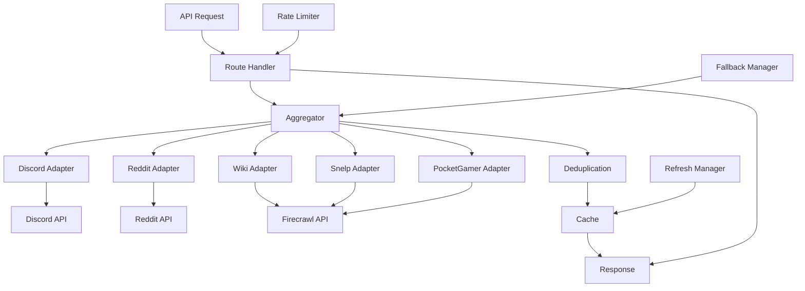
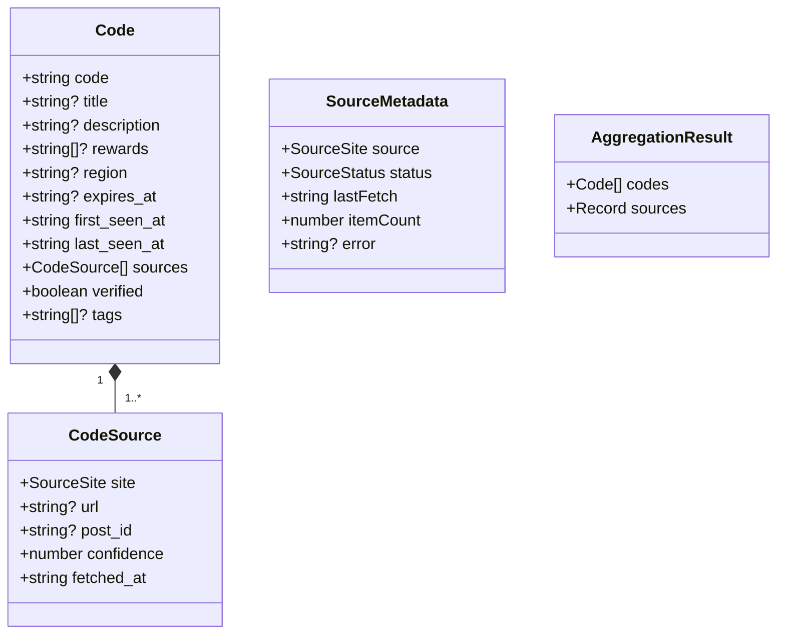
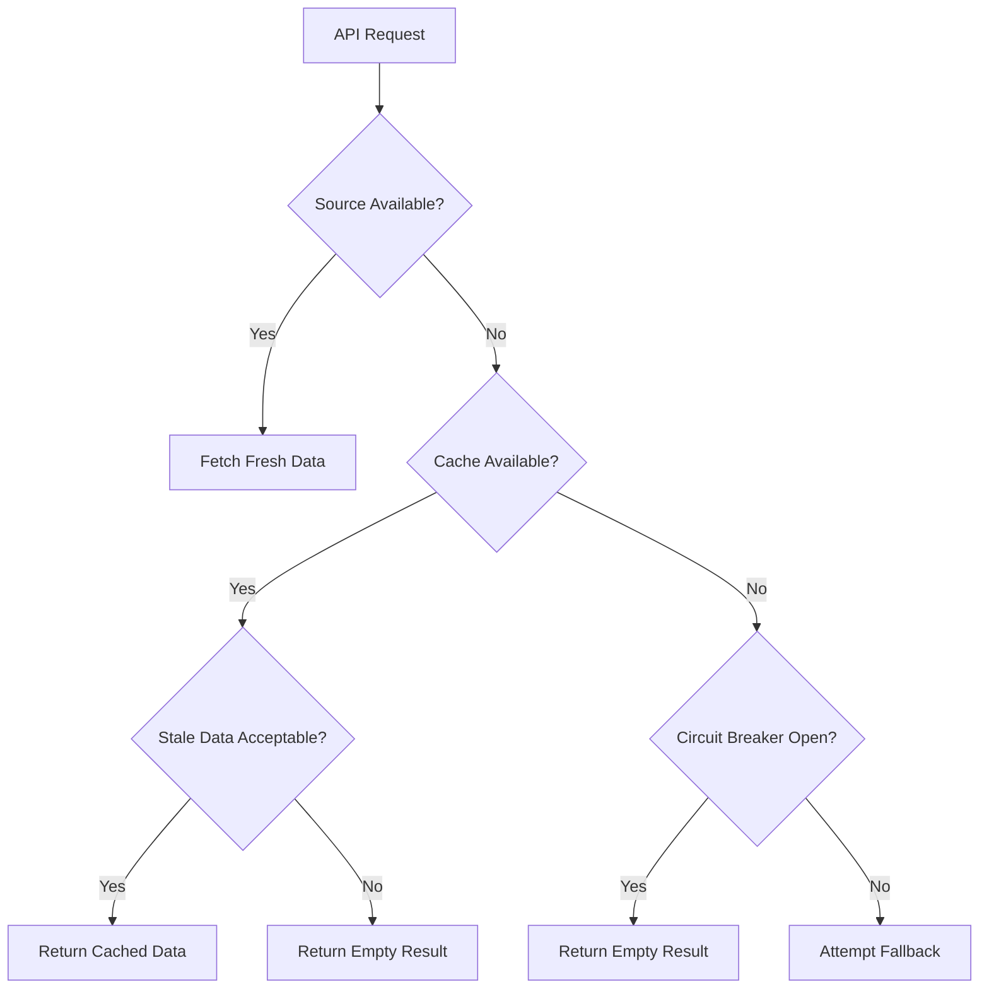
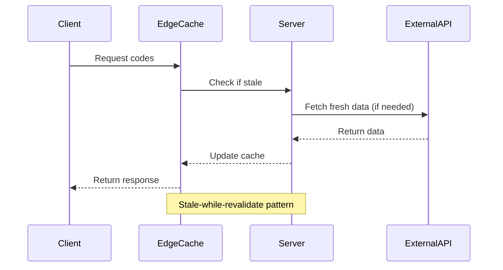
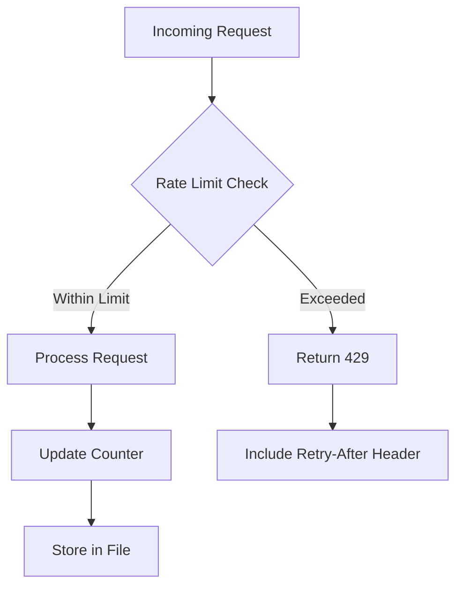

# Adapters

<cite>
**Referenced Files in This Document**   
- [discord.ts](file://apps/web/lib/adapters/discord.ts)
- [reddit.ts](file://apps/web/lib/adapters/reddit.ts)
- [snelp.ts](file://apps/web/lib/adapters/snelp.ts)
- [wiki.ts](file://apps/web/lib/adapters/wiki.ts)
- [pocketgamer.ts](file://apps/web/lib/adapters/pocketgamer.ts)
- [aggregator.ts](file://apps/web/lib/aggregator.ts)
- [codes.ts](file://apps/web/lib/types/codes.ts)
- [cache.ts](file://apps/web/lib/codes/cache.ts)
- [fallbacks.ts](file://apps/web/lib/codes/fallbacks.ts)
- [refresh.ts](file://apps/web/lib/codes/refresh.ts)
- [rate-limiter.ts](file://apps/web/lib/rate-limiter.ts)
- [route.ts](file://apps/web/app/api/codes/route.ts)
</cite>

## Table of Contents
1. [Introduction](#introduction)
2. [Adapter Architecture Overview](#adapter-architecture-overview)
3. [Core Adapter Components](#core-adapter-components)
4. [Individual Adapter Analysis](#individual-adapter-analysis)
5. [Trust Weighting System](#trust-weighting-system)
6. [Error Handling and Degraded Operation](#error-handling-and-degraded-operation)
7. [Caching and Rate Limiting Strategy](#caching-and-rate-limiting-strategy)
8. [Data Transformation and Standardization](#data-transformation-and-standardization)
9. [Adding New Adapters](#adding-new-adapters)
10. [Maintenance Guidelines](#maintenance-guidelines)

## Introduction

The slimy-monorepo platform implements an adapter pattern to integrate with multiple external data sources for retrieving game codes. This documentation details the architecture, implementation, and operational characteristics of the adapter system that connects to Discord, Reddit, Snelp, Wiki, and PocketGamer sources. The adapter pattern provides a consistent interface for disparate external APIs, enabling standardized data extraction, transformation, and error handling across all sources.

The system is designed to handle the challenges of external API integration including rate limiting, authentication, data inconsistency, and service availability. Each adapter follows a consistent pattern while implementing source-specific logic for data extraction and processing. The architecture supports graceful degradation when APIs are unavailable and employs sophisticated caching strategies to ensure reliable performance.

**Section sources**
- [aggregator.ts](file://apps/web/lib/aggregator.ts#L1-L86)
- [codes.ts](file://apps/web/lib/types/codes.ts#L1-L44)

## Adapter Architecture Overview

The adapter system follows a modular architecture where each external data source has its own dedicated adapter implementation. The core components work together to provide a unified interface for code retrieval:



**Diagram sources**
- [aggregator.ts](file://apps/web/lib/aggregator.ts#L1-L86)
- [route.ts](file://apps/web/app/api/codes/route.ts#L1-L135)

**Section sources**
- [aggregator.ts](file://apps/web/lib/aggregator.ts#L1-L86)
- [route.ts](file://apps/web/app/api/codes/route.ts#L1-L135)

## Core Adapter Components

The adapter system consists of several key components that work together to provide reliable data integration:

### Adapter Interface Contract
All adapters implement a consistent interface that returns a standardized response structure containing codes and metadata. The interface ensures that regardless of the source, the data format remains consistent for downstream processing.



**Diagram sources**
- [codes.ts](file://apps/web/lib/types/codes.ts#L1-L44)

### Aggregation System
The aggregator orchestrates the parallel execution of all adapters, combining their results and applying deduplication logic. It manages the overall workflow and ensures consistent error handling across all sources.

**Section sources**
- [aggregator.ts](file://apps/web/lib/aggregator.ts#L1-L86)

## Individual Adapter Analysis

### Discord Adapter

The Discord adapter retrieves codes from the official Super Snail Discord channel by accessing the Discord API to fetch recent messages from a specific channel.

**Data Extraction Logic**
- Extracts codes using regex pattern `\b[A-Z0-9]{4,}(?:-[A-Z0-9]{3,}){0,3}\b`
- Processes up to 100 recent messages from the configured channel
- Identifies pinned messages as potentially more important

**False Positive Filtering**
- Filters out codes containing "CODE", "SOURCE", or "QR"
- Ensures extracted text matches the expected code pattern

**Metadata Enrichment**
- Assigns trust weight of 0.9 (high confidence)
- Includes direct link to the Discord message
- Marks pinned messages with "pinned" tag
- Sets region to "global" by default

**Section sources**
- [discord.ts](file://apps/web/lib/adapters/discord.ts#L1-L152)

### Reddit Adapter

The Reddit adapter retrieves codes from the r/SuperSnail_US subreddit using the public Reddit JSON API.

**Data Extraction Logic**
- Searches for posts containing keywords like "code", "secret code", or "redeem"
- Extracts codes from both post titles and content
- Processes up to 50 recent posts from the past month

**False Positive Filtering**
- Filters out codes containing "CODE", "SOURCE", or "QR"
- Excludes codes consisting only of numbers
- Deduplicates cross-posts within 24 hours

**Metadata Enrichment**
- Assigns trust weight of 0.6 (moderate confidence)
- Includes permalink to the Reddit post
- Adds "reddit" tag to all extracted codes
- Sets region to "global" by default

**Section sources**
- [reddit.ts](file://apps/web/lib/adapters/reddit.ts#L1-L175)

### Snelp Adapter

The Snelp adapter retrieves codes from Snelp.com using the Firecrawl API to scrape and extract content.

**Data Extraction Logic**
- Uses Firecrawl API to retrieve page content in markdown format
- Extracts codes from each line of the markdown content
- Processes the entire page content to find all potential codes

**False Positive Filtering**
- Filters out codes containing "CODE", "SOURCE", or "QR"
- Excludes codes shorter than 6 characters
- Applies the same regex pattern as other adapters

**Metadata Enrichment**
- Assigns trust weight of 0.65 (moderate confidence)
- References the Snelp.com URL as the source
- Adds "snelp" tag to all extracted codes
- Sets region to "global" by default

**Section sources**
- [snelp.ts](file://apps/web/lib/adapters/snelp.ts#L1-L156)

### Wiki Adapter

The Wiki adapter retrieves codes from supersnail.wiki.gg using the Firecrawl API to scrape structured data.

**Data Extraction Logic**
- Specifically targets table rows in the wiki format
- Uses pattern `\|\s*([A-Z0-9-]{4,})\s*\|` to identify code entries
- Extracts additional information from adjacent columns (rewards, expiry, region)

**False Positive Filtering**
- Relies on the structured table format to minimize false positives
- Validates expiry dates and parses them into ISO format
- Only extracts codes from properly formatted table rows

**Metadata Enrichment**
- Assigns trust weight of 1.0 (highest confidence)
- Marks codes as "verified" due to the official nature of the wiki
- Adds both "wiki" and "official" tags
- Preserves region information from the wiki
- Parses and includes expiry dates when available

**Section sources**
- [wiki.ts](file://apps/web/lib/adapters/wiki.ts#L1-L168)

### PocketGamer Adapter

The PocketGamer adapter retrieves codes from PocketGamer.com using the Firecrawl API.

**Data Extraction Logic**
- Uses Firecrawl API to retrieve page content in markdown format
- Applies the standard code regex pattern to find potential codes
- Processes the entire page content to identify all code entries

**False Positive Filtering**
- Filters out codes containing "CODE", "SOURCE", or "QR"
- Excludes codes shorter than 6 characters
- Applies the same validation as other scraping adapters

**Metadata Enrichment**
- Assigns trust weight of 0.7 (moderately high confidence)
- References the PocketGamer URL as the source
- Adds "pocketgamer" tag to all extracted codes
- Sets region to "global" by default

**Section sources**
- [pocketgamer.ts](file://apps/web/lib/adapters/pocketgamer.ts#L1-L156)

## Trust Weighting System

The adapter system implements a trust weighting system that assigns confidence scores to codes based on their source. This system helps prioritize more reliable sources when presenting codes to users.

### Trust Weight Assignments
| Source | Trust Weight | Rationale |
|--------|-------------|---------|
| Wiki | 1.0 | Official, curated content with high accuracy |
| Discord | 0.9 | Official community channel with moderator oversight |
| PocketGamer | 0.7 | Reputable gaming website with editorial standards |
| Snelp | 0.65 | Dedicated code site but user-submitted content |
| Reddit | 0.6 | Community-driven content with variable quality |

### Confidence Application
The trust weight is stored in the `confidence` field of the `CodeSource` object and is used by downstream systems to:
- Prioritize display of higher-confidence codes
- Weight results in search algorithms
- Determine verification status (wiki codes are automatically marked as verified)
- Inform users about the reliability of each code source

The system allows for dynamic adjustment of trust weights based on historical accuracy and can be updated as the reliability of sources changes over time.

**Section sources**
- [codes.ts](file://apps/web/lib/types/codes.ts#L1-L44)
- [discord.ts](file://apps/web/lib/adapters/discord.ts#L9)
- [reddit.ts](file://apps/web/lib/adapters/reddit.ts#L9)
- [snelp.ts](file://apps/web/lib/adapters/snelp.ts#L9)
- [wiki.ts](file://apps/web/lib/adapters/wiki.ts#L9)
- [pocketgamer.ts](file://apps/web/lib/adapters/pocketgamer.ts#L9)

## Error Handling and Degraded Operation

The adapter system implements comprehensive error handling to maintain functionality even when external APIs are unavailable.

### Error States
Adapters can return several status states:
- **ok**: Successful retrieval with valid data
- **degraded**: Rate limited but may have partial data
- **failed**: Complete failure to retrieve data
- **not_configured**: Missing required credentials

### Degraded Operation Modes
When APIs are unavailable, the system employs several fallback strategies:



**Diagram sources**
- [fallbacks.ts](file://apps/web/lib/codes/fallbacks.ts#L1-L326)

### Circuit Breaker Pattern
The system implements a circuit breaker pattern to prevent cascading failures:
- Tracks consecutive failures for each source
- Opens the circuit after 3 consecutive failures
- Prevents further requests for 5 minutes
- Automatically resets when the timeout expires

### Fallback Mechanisms
The fallback system provides multiple layers of redundancy:
1. **Cache fallback**: Returns stale data from Redis when fresh data cannot be retrieved
2. **Circuit breaker**: Prevents overwhelming failing services with repeated requests
3. **Emergency codes**: Provides a small set of known-good codes as last resort

**Section sources**
- [fallbacks.ts](file://apps/web/lib/codes/fallbacks.ts#L1-L326)
- [discord.ts](file://apps/web/lib/adapters/discord.ts#L101-L113)
- [reddit.ts](file://apps/web/lib/adapters/reddit.ts#L88-L99)
- [snelp.ts](file://apps/web/lib/adapters/snelp.ts#L107-L118)
- [wiki.ts](file://apps/web/lib/adapters/wiki.ts#L119-L130)
- [pocketgamer.ts](file://apps/web/lib/adapters/pocketgamer.ts#L107-L118)

## Caching and Rate Limiting Strategy

The adapter system employs sophisticated caching and rate limiting to ensure performance and reliability.

### Next.js Revalidation Caching
Each adapter implements Next.js revalidation to cache responses at the edge:



**Diagram sources**
- [discord.ts](file://apps/web/lib/adapters/discord.ts#L97)
- [reddit.ts](file://apps/web/lib/adapters/reddit.ts#L85)
- [snelp.ts](file://apps/web/lib/adapters/snelp.ts#L104)
- [wiki.ts](file://apps/web/lib/adapters/wiki.ts#L116)
- [pocketgamer.ts](file://apps/web/lib/adapters/pocketgamer.ts#L104)

### Cache Configuration
- **Discord**: 600 seconds (10 minutes)
- **Reddit**: 600 seconds (10 minutes)
- **Scraping adapters**: 900 seconds (15 minutes)
- Uses Redis for persistent storage with 5-minute TTL
- Implements stale-while-revalidate pattern

### Rate Limiting Response
The system handles rate limiting gracefully:

**Discord Rate Limiting**
- Detects 429 responses from Discord API
- Extracts Retry-After header value
- Returns degraded status with retry information
- Prevents repeated requests during cooldown period

**Firecrawl Rate Limiting**
- Handles 429 responses from Firecrawl API
- Returns degraded status without exposing internal details
- Relies on caching to serve data during rate limit periods

### File-Backed Rate Limiter
The system implements a file-backed rate limiter for API endpoints:



**Diagram sources**
- [rate-limiter.ts](file://apps/web/lib/rate-limiter.ts#L1-L90)

The rate limiter uses a simple file-based storage system in the `data/rate-limits/` directory, with each key (typically IP address or user ID) having its own JSON file containing request count and reset time.

**Section sources**
- [cache.ts](file://apps/web/lib/codes/cache.ts#L1-L302)
- [refresh.ts](file://apps/web/lib/codes/refresh.ts#L1-L298)
- [rate-limiter.ts](file://apps/web/lib/rate-limiter.ts#L1-L90)

## Data Transformation and Standardization

Each adapter transforms raw API responses into standardized code objects according to the common schema.

### Transformation Process
1. **Raw Response**: Receive data from external API
2. **Pattern Matching**: Extract potential codes using regex
3. **Filtering**: Remove false positives based on content
4. **Enrichment**: Add source metadata and trust weights
5. **Standardization**: Format data according to Code interface
6. **Aggregation**: Combine results from all adapters

### Example Transformations

**Discord Message to Code Object**
```typescript
// Raw Discord message
{
  id: "12345",
  content: "New code: SLIMY-2024 for 100 gems!",
  timestamp: "2024-01-01T00:00:00Z",
  pinned: true
}

// Transformed Code object
{
  code: "SLIMY-2024",
  description: "New code: SLIMY-2024 for 100 gems!",
  region: "global",
  sources: [{
    site: "discord",
    url: "https://discord.com/channels/@me/1118010099974287370/12345",
    confidence: 0.9,
    fetched_at: "2024-01-01T00:00:00Z"
  }],
  tags: ["pinned"]
}
```

**Wiki Table Row to Code Object**
```typescript
// Raw wiki table row
"| SLIMY-2024 | 100 Gems | Never | Global |"

// Transformed Code object
{
  code: "SLIMY-2024",
  description: "100 Gems",
  rewards: ["100 Gems"],
  region: "Global",
  expires_at: null,
  sources: [{
    site: "wiki",
    url: "https://supersnail.wiki.gg/wiki/Snail_codes",
    confidence: 1.0,
    fetched_at: "2024-01-01T00:00:00Z"
  }],
  verified: true,
  tags: ["wiki", "official"]
}
```

The transformation process ensures that regardless of the source format, the output conforms to the standardized Code interface, enabling consistent processing and display throughout the application.

**Section sources**
- [discord.ts](file://apps/web/lib/adapters/discord.ts#L21-L62)
- [reddit.ts](file://apps/web/lib/adapters/reddit.ts#L24-L68)
- [snelp.ts](file://apps/web/lib/adapters/snelp.ts#L22-L67)
- [wiki.ts](file://apps/web/lib/adapters/wiki.ts#L23-L62)
- [pocketgamer.ts](file://apps/web/lib/adapters/pocketgamer.ts#L22-L67)

## Adding New Adapters

To add a new adapter to the system, follow these steps:

### Implementation Requirements
1. Create a new file in `apps/web/lib/adapters/` with the naming pattern `[source].ts`
2. Implement the standard fetch function that returns `{ codes: Code[], metadata: SourceMetadata }`
3. Include proper error handling and degraded operation modes
4. Implement source-specific data extraction and filtering
5. Assign an appropriate trust weight based on source reliability

### Integration Steps
1. Import the new adapter in `aggregator.ts`
2. Add the fetch function to the Promise.all array in `aggregateCodes()`
3. Add the metadata to the sources object in the return value
4. Update the SourceSite type in `types/codes.ts` if necessary

### Best Practices
- Use consistent error handling patterns
- Implement appropriate caching via Next.js revalidation
- Include comprehensive logging for debugging
- Handle rate limiting responses gracefully
- Filter out common false positives specific to the source
- Set appropriate trust weights based on source reliability

### Testing Considerations
- Write unit tests for the extraction logic
- Test error handling scenarios (network failures, rate limiting)
- Verify data transformation produces correctly formatted Code objects
- Test edge cases like empty responses or malformed data

**Section sources**
- [aggregator.ts](file://apps/web/lib/aggregator.ts#L6-L10)
- [codes.ts](file://apps/web/lib/types/codes.ts#L5-L6)

## Maintenance Guidelines

### Monitoring and Observability
- Monitor the health endpoint (`/api/codes?health=true`) for overall system status
- Track error rates and failure modes for each adapter
- Monitor cache hit rates and performance metrics
- Watch for changes in external API behavior or rate limits

### Configuration Management
- Store API credentials in environment variables
- Use feature flags to enable/disable adapters during maintenance
- Configure trust weights based on observed accuracy
- Adjust caching and revalidation times based on source update frequency

### Update Procedures
When external sources change their API or format:
1. Update the adapter implementation to handle the new format
2. Test thoroughly with real data
3. Deploy with feature flag or canary release
4. Monitor for errors and performance impact
5. Remove old implementation once stable

### Deprecation Process
When retiring an adapter:
1. Mark the adapter as deprecated in code comments
2. Reduce its trust weight to minimize impact
3. Monitor usage and inform stakeholders
4. Remove from the aggregator after sufficient deprecation period
5. Clean up related code and tests

Regular maintenance ensures the adapter system remains reliable and responsive to changes in external data sources.

**Section sources**
- [aggregator.ts](file://apps/web/lib/aggregator.ts#L1-L86)
- [fallbacks.ts](file://apps/web/lib/codes/fallbacks.ts#L1-L326)
- [refresh.ts](file://apps/web/lib/codes/refresh.ts#L1-L298)