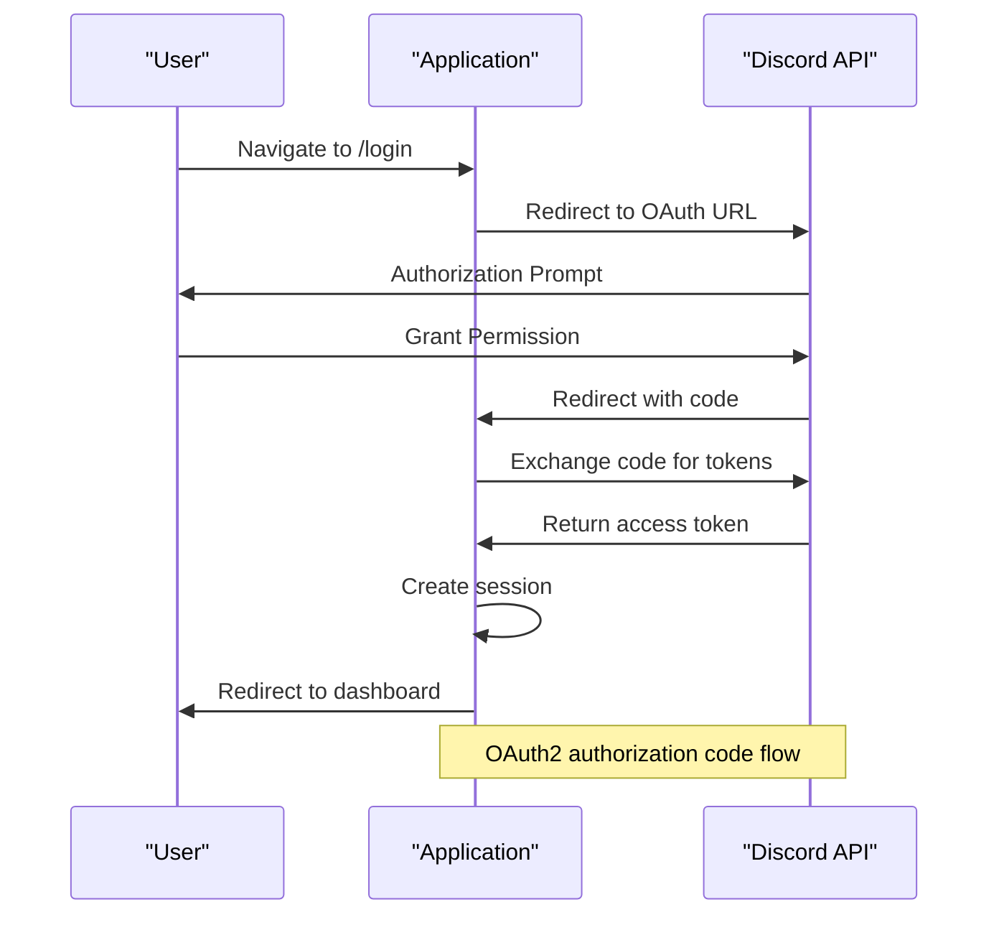
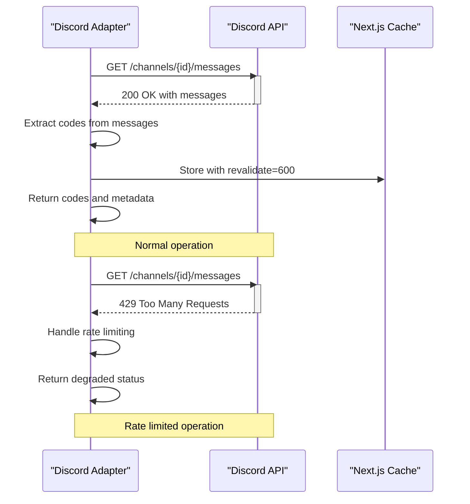
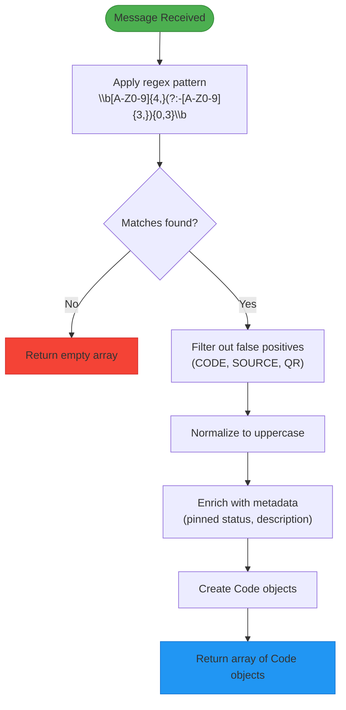
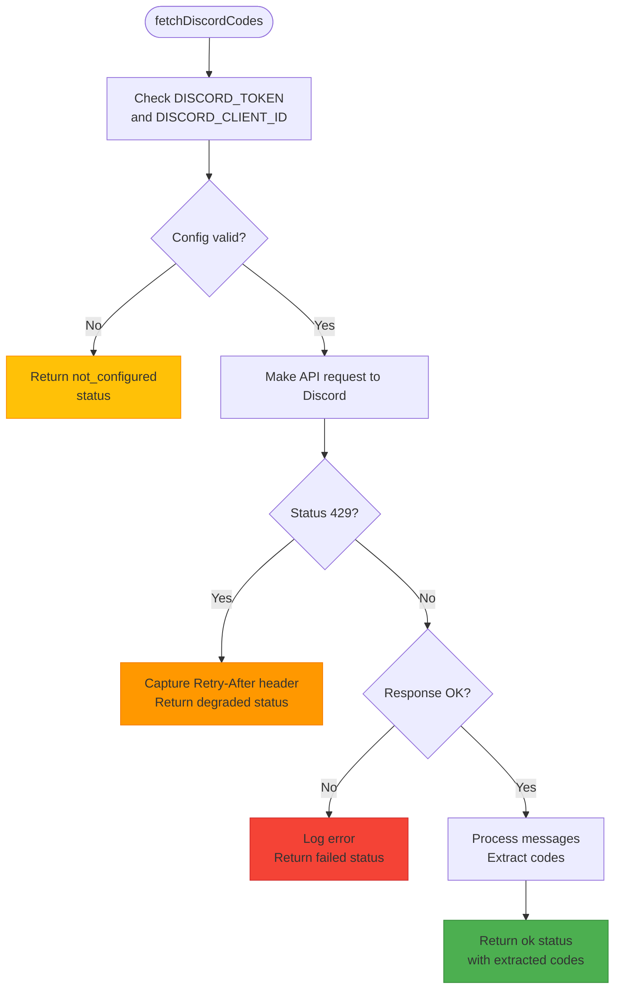
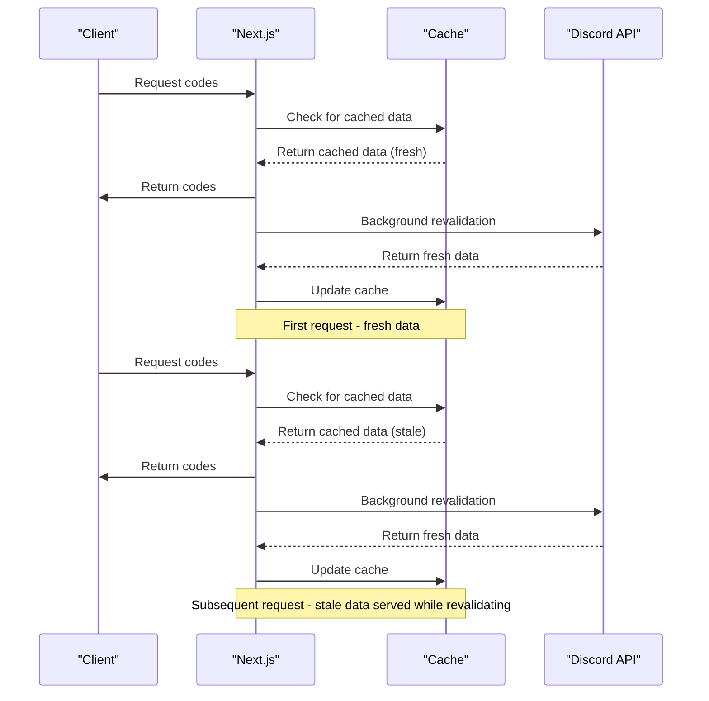
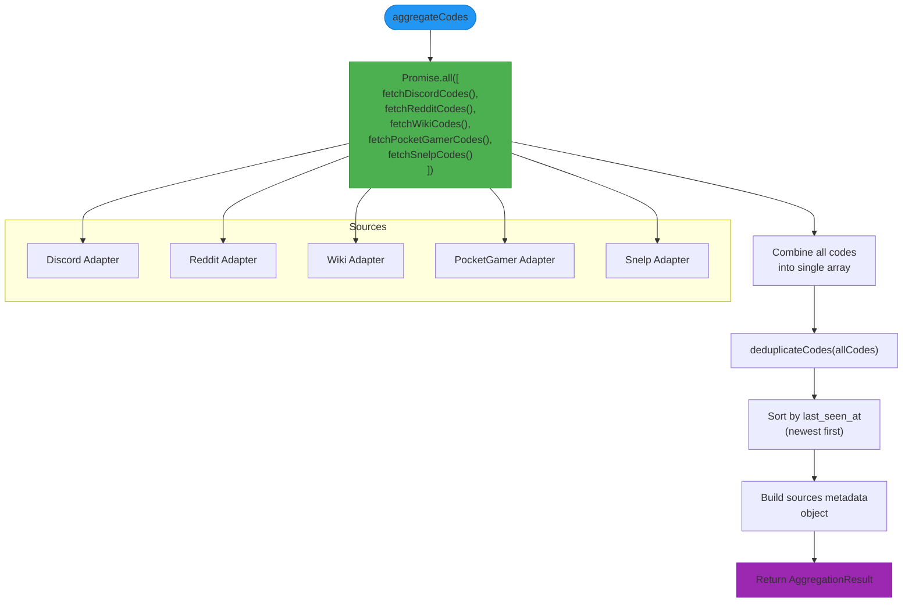
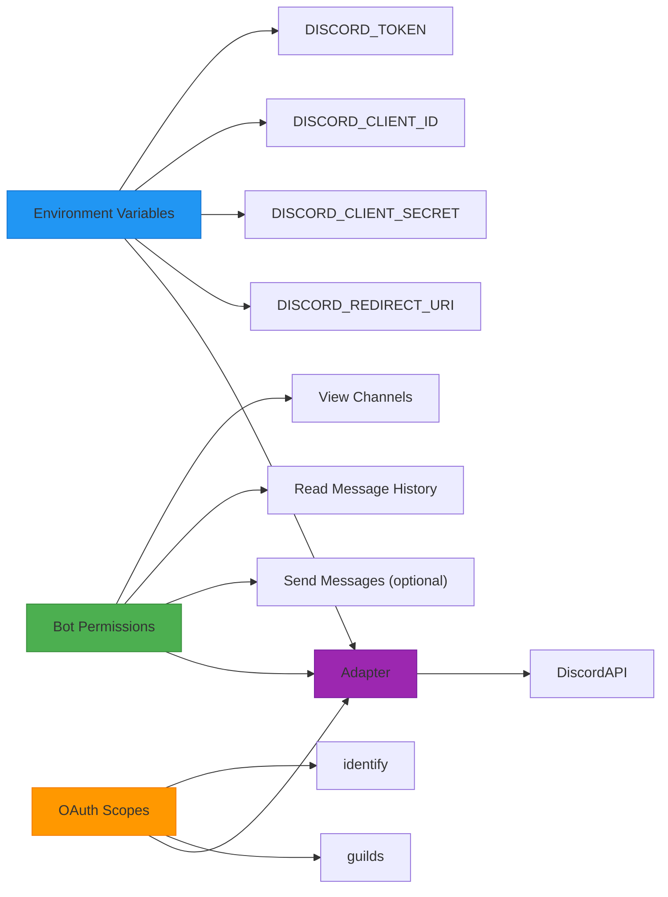

# Discord Adapter

<cite>
**Referenced Files in This Document**   
- [discord.ts](file://apps/web/lib/adapters/discord.ts)
- [aggregator.ts](file://apps/web/lib/aggregator.ts)
- [codes-aggregator.ts](file://apps/web/lib/codes-aggregator.ts)
- [cache.ts](file://apps/web/lib/codes/cache.ts)
- [route.ts](file://apps/web/app/api/codes/route.ts)
- [auth.js](file://apps/admin-api/src/routes/auth.js)
- [oauth.js](file://apps/admin-api/src/services/oauth.js)
- [errors.js](file://apps/admin-api/src/lib/errors.js)
</cite>

## Table of Contents
1. [Introduction](#introduction)
2. [Authentication and OAuth Integration](#authentication-and-oauth-integration)
3. [Discord API Connection and Rate Limiting](#discord-api-connection-and-rate-limiting)
4. [Message Parsing and Code Detection](#message-parsing-and-code-detection)
5. [Metadata Enrichment and Normalization](#metadata-enrichment-and-normalization)
6. [Error Handling and Degraded Operation](#error-handling-and-degraded-operation)
7. [Caching and Revalidation Strategy](#caching-and-revalidation-strategy)
8. [Integration with Codes Aggregator](#integration-with-codes-aggregator)
9. [Bot Configuration and Permissions](#bot-configuration-and-permissions)
10. [Example Data Flow](#example-data-flow)

## Introduction
The Discord adapter is responsible for extracting promotional codes from the official Super Snail Discord channel. It connects to the Discord API using bot authentication, retrieves recent messages from a configured channel, parses them for promotional codes using regex patterns, and normalizes the extracted data into a unified code schema. The adapter handles authentication via OAuth, implements robust error handling for API failures and rate limiting, and integrates with the central codes aggregator system. This documentation details the implementation, configuration, and operational characteristics of the Discord adapter.

## Authentication and OAuth Integration
The Discord adapter uses Discord's OAuth2 protocol for authentication and authorization. The system implements a standard authorization code flow to obtain access tokens for accessing Discord API resources.

The authentication process begins with a user initiating login through the `/api/auth/login` endpoint, which redirects to Discord's authorization URL with appropriate parameters including client ID, redirect URI, response type, scope, and state parameter for CSRF protection. The configured scopes include "identify" and "guilds" to access user profile and guild membership information.

Upon successful authorization, Discord redirects back to the application's callback endpoint (`/api/auth/callback`) with an authorization code. This code is exchanged for access and refresh tokens by making a POST request to Discord's token endpoint with the client credentials. The access token is then used to fetch user profile information and guild memberships.



**Diagram sources**
- [auth.js](file://apps/admin-api/src/routes/auth.js#L126-L164)
- [oauth.js](file://apps/admin-api/src/services/oauth.js#L20-L47)

**Section sources**
- [auth.js](file://apps/admin-api/src/routes/auth.js#L126-L164)
- [oauth.js](file://apps/admin-api/src/services/oauth.js#L20-L47)

## Discord API Connection and Rate Limiting
The Discord adapter establishes connections to the Discord API using a bot token for authentication. The connection is configured to target a specific channel (ID: 1118010099974287370) in the Super Snail Discord server to extract promotional codes from messages.

The adapter makes HTTP GET requests to the Discord API endpoint `https://discord.com/api/v10/channels/{channel_id}/messages` with a limit parameter to retrieve up to 100 recent messages. Authentication is performed using the Bot authorization scheme with the DISCORD_TOKEN environment variable.

The implementation includes comprehensive rate limiting handling as specified by Discord's API rate limiting policies. When a 429 Too Many Requests response is received, the adapter reads the Retry-After header to determine when to retry the request. The response metadata reflects the degraded status with appropriate error messaging.



**Diagram sources**
- [discord.ts](file://apps/web/lib/adapters/discord.ts#L90-L114)
- [route.ts](file://apps/web/app/api/codes/route.ts#L5)

**Section sources**
- [discord.ts](file://apps/web/lib/adapters/discord.ts#L71-L114)

## Message Parsing and Code Detection
The Discord adapter implements a regex-based pattern matching system to detect promotional codes within message content. The primary regex pattern used is `\b[A-Z0-9]{4,}(?:-[A-Z0-9]{3,}){0,3}\b`, which matches alphanumeric strings of at least 4 characters that may contain up to three hyphen-separated groups.

The message parsing logic processes each retrieved message and applies the regex pattern to extract potential codes. The implementation includes filtering to eliminate common false positives such as words containing "CODE", "SOURCE", or "QR". All extracted codes are normalized to uppercase format to ensure consistency.

The parsing function `extractCodesFromMessage` processes each message and returns an array of code objects with basic properties including the code itself, description (truncated message content), region (set to "global"), and timestamps. The function also identifies pinned messages and adds a "pinned" tag to codes extracted from them, providing additional context about the importance of the code.



**Diagram sources**
- [discord.ts](file://apps/web/lib/adapters/discord.ts#L21-L62)

**Section sources**
- [discord.ts](file://apps/web/lib/adapters/discord.ts#L21-L62)

## Metadata Enrichment and Normalization
The Discord adapter enriches extracted codes with comprehensive metadata to provide context and provenance information. Each code object is normalized into a standard schema that includes source-specific metadata, timestamps, and confidence scoring.

The metadata enrichment process adds several key pieces of information to each extracted code:
- **Source attribution**: The site is set to "discord" with a URL linking directly to the message in Discord
- **Confidence scoring**: A trust weight of 0.9 is assigned to all Discord-extracted codes, reflecting the high reliability of this source
- **Temporal data**: Both first_seen_at and last_seen_at timestamps are set to the message timestamp
- **Source identification**: The post_id is populated with the Discord message ID for traceability
- **Fetched timestamp**: The fetched_at field records when the code was retrieved from Discord

The normalization process ensures that all codes follow a consistent schema regardless of their source. This includes standardizing the code format to uppercase, setting the region to "global" by default, and initializing empty arrays for rewards and tags. The verified flag is set to false by default, indicating that the code has not been manually verified.

```mermaid
classDiagram
class Code {
+string code
+string? title
+string? description
+string[] rewards
+string? region
+string? expires_at
+string first_seen_at
+string last_seen_at
+CodeSource[] sources
+boolean verified
+string[]? tags
}
class CodeSource {
+SourceSite site
+string? url
+string? post_id
+number confidence
+string fetched_at
}
class SourceMetadata {
+SourceSite source
+SourceStatus status
+string lastFetch
+number itemCount
+string? error
}
Code "1" *-- "1..*" CodeSource : contains
CodeSource --> SourceSite : enum
SourceMetadata --> SourceSite : enum
SourceMetadata --> SourceStatus : enum
note right of Code
Normalized code schema with
enriched metadata from Discord
end note
```

**Diagram sources**
- [discord.ts](file://apps/web/lib/adapters/discord.ts#L38-L58)
- [codes.ts](file://apps/web/lib/types/codes.ts#L17-L43)

**Section sources**
- [discord.ts](file://apps/web/lib/adapters/discord.ts#L38-L58)

## Error Handling and Degraded Operation
The Discord adapter implements comprehensive error handling to ensure reliable operation even when the Discord API is unavailable or rate limited. The error handling strategy follows a graceful degradation approach, providing partial functionality when complete operation is not possible.

The adapter handles several error scenarios:
- **Missing configuration**: When DISCORD_TOKEN or DISCORD_CLIENT_ID environment variables are not set, the adapter returns an empty result with "not_configured" status
- **Rate limiting**: When Discord returns a 429 status code, the adapter captures the Retry-After header and returns a "degraded" status with appropriate error messaging
- **API errors**: For other non-200 responses, the adapter throws an error which is caught and converted to a "failed" status
- **Network failures**: Any network-level errors during the fetch operation are caught and handled gracefully

The error handling maintains system stability by preventing exceptions from propagating to the calling code. Instead, structured metadata is returned indicating the status of the operation, allowing the calling system to make informed decisions about how to present the information to users.



**Diagram sources**
- [discord.ts](file://apps/web/lib/adapters/discord.ts#L74-L151)

**Section sources**
- [discord.ts](file://apps/web/lib/adapters/discord.ts#L74-L151)

## Caching and Revalidation Strategy
The Discord adapter leverages Next.js revalidation tags to implement an efficient caching strategy that balances data freshness with API rate limit considerations. The caching mechanism reduces the frequency of API calls to Discord while ensuring that users receive reasonably up-to-date information.

The adapter uses Next.js's `revalidate` option with a value of 600 seconds (10 minutes) to cache the results of Discord API calls. This means that after the initial request, subsequent requests within the 10-minute window will be served from cache without making additional calls to the Discord API. After 10 minutes, the next request will trigger a revalidation, fetching fresh data from Discord.

The caching strategy is implemented at multiple levels:
- **Adapter level**: The `fetchDiscordCodes` function results are cached with 10-minute revalidation
- **Aggregator level**: The combined results from all adapters are cached with 60-second revalidation
- **API endpoint level**: The `/api/codes` endpoint has its own caching configuration

This multi-layered approach optimizes performance by reducing redundant API calls while maintaining acceptable data freshness. The cache headers include "stale-while-revalidate" directives to serve stale data when the origin is unreachable, ensuring degraded operation rather than complete failure.



**Diagram sources**
- [discord.ts](file://apps/web/lib/adapters/discord.ts#L97-L98)
- [route.ts](file://apps/web/app/api/codes/route.ts#L5)
- [cache.ts](file://apps/web/lib/codes/cache.ts)

**Section sources**
- [discord.ts](file://apps/web/lib/adapters/discord.ts#L97-L98)
- [route.ts](file://apps/web/app/api/codes/route.ts#L5)

## Integration with Codes Aggregator
The Discord adapter integrates with the central codes aggregator system through a well-defined interface that enables parallel fetching from multiple sources and subsequent deduplication of results. The aggregator orchestrates the collection of codes from various sources including Discord, Reddit, Wiki, PocketGamer, and Snelp.

The integration occurs through the `aggregateCodes` function in the aggregator module, which imports the `fetchDiscordCodes` function from the Discord adapter. All source adapters are called in parallel using `Promise.all()`, maximizing efficiency and minimizing total aggregation time.

After collecting results from all sources, the aggregator applies deduplication logic to merge codes with identical values, preserving the most complete information from each source. The results are sorted by last_seen_at timestamp (newest first) and returned with comprehensive metadata about each source's status and item count.



**Diagram sources**
- [aggregator.ts](file://apps/web/lib/aggregator.ts#L19-L35)
- [codes-aggregator.ts](file://apps/web/lib/codes-aggregator.ts)

**Section sources**
- [aggregator.ts](file://apps/web/lib/aggregator.ts#L19-L35)

## Bot Configuration and Permissions
The Discord adapter requires specific bot configuration and permissions to function correctly. The bot must be configured with appropriate OAuth2 scopes and permissions to access the target channel and read message history.

The required environment variables for configuration are:
- **DISCORD_TOKEN**: The bot token for authenticating API requests
- **DISCORD_CLIENT_ID**: The client ID of the Discord application
- **DISCORD_CLIENT_SECRET**: The client secret for OAuth2 token exchange
- **DISCORD_REDIRECT_URI**: The callback URL for OAuth2 flow

The bot requires the following permissions in the Discord server:
- **View Channels**: To access the channel containing promotional codes
- **Read Message History**: To retrieve past messages containing codes
- **Send Messages** (optional): For bot interaction features

The OAuth2 scopes required for user authentication are "identify" and "guilds", allowing the application to identify users and access their guild memberships. The bot invite URL should include these scopes and appropriate permissions to ensure proper functionality.



**Section sources**
- [discord.ts](file://apps/web/lib/adapters/discord.ts#L71-L73)
- [auth.js](file://apps/admin-api/src/routes/auth.js#L13)

## Example Data Flow
This section illustrates the complete data flow from a raw Discord API response to a normalized code object in the unified schema.

Consider a sample Discord message containing a promotional code:

```json
{
  "id": "1234567890",
  "content": "New code available: SNAIL-2024-GIVEAWAY! Use it before it expires.",
  "timestamp": "2024-01-15T10:30:00.000Z",
  "pinned": true
}
```

The adapter processes this message through the following steps:

1. **Message retrieval**: The adapter fetches the message from Discord API
2. **Pattern matching**: The regex pattern identifies "SNAIL-2024-GIVEAWAY" as a potential code
3. **False positive filtering**: The code is checked against exclusion patterns (CODE, SOURCE, QR) - passes
4. **Normalization**: The code is converted to uppercase (already in correct format)
5. **Metadata enrichment**: Additional context is added including source URL, confidence score, and timestamps
6. **Schema normalization**: The data is structured into the standard code schema

The resulting normalized code object:

```json
{
  "code": "SNAIL-2024-GIVEAWAY",
  "title": null,
  "description": "New code available: SNAIL-2024-GIVEAWAY! Use it before it expires.",
  "rewards": [],
  "region": "global",
  "expires_at": null,
  "first_seen_at": "2024-01-15T10:30:00.000Z",
  "last_seen_at": "2024-01-15T10:30:00.000Z",
  "sources": [
    {
      "site": "discord",
      "url": "https://discord.com/channels/@me/1118010099974287370/1234567890",
      "post_id": "1234567890",
      "confidence": 0.9,
      "fetched_at": "2024-01-15T10:35:00.000Z"
    }
  ],
  "verified": false,
  "tags": ["pinned"]
}
```

This transformation process ensures that promotional codes from Discord are consistently formatted and enriched with contextual information, making them interoperable with codes from other sources in the aggregation system.

**Section sources**
- [discord.ts](file://apps/web/lib/adapters/discord.ts#L21-L62)
- [types/codes.ts](file://apps/web/lib/types/codes.ts#L17-L29)