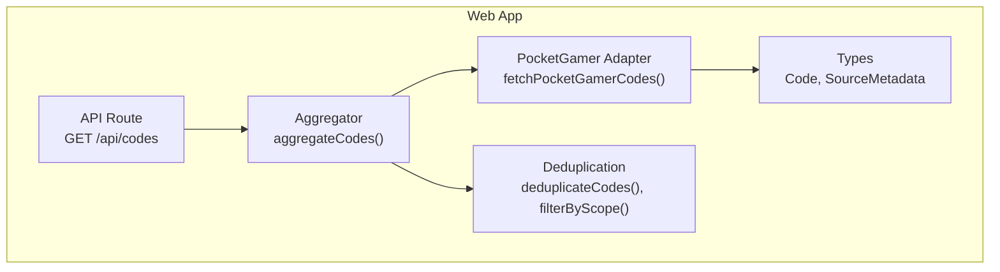
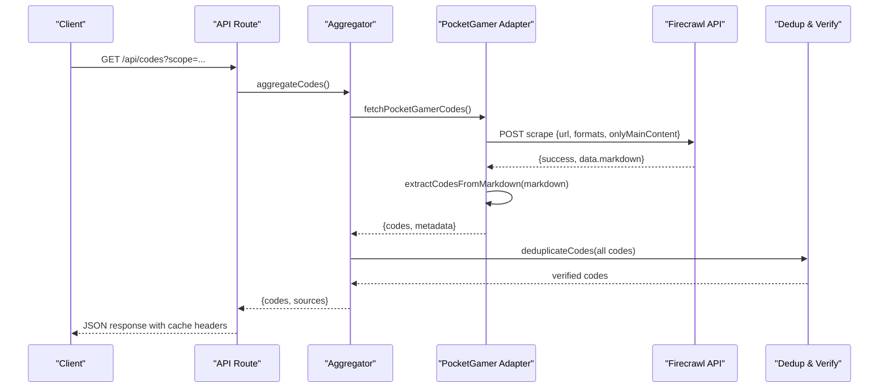
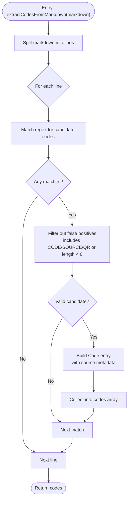
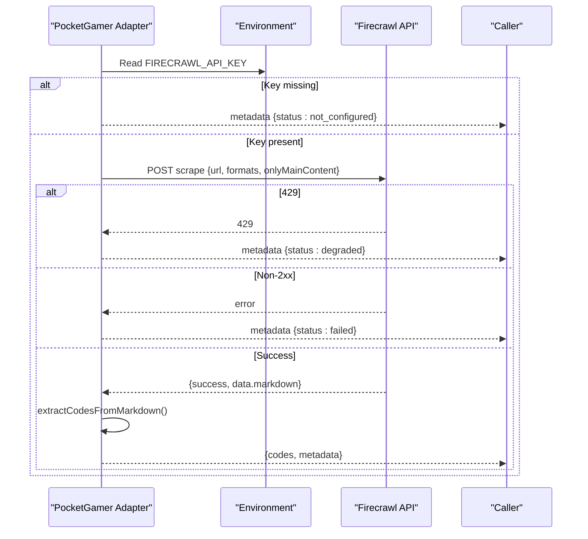
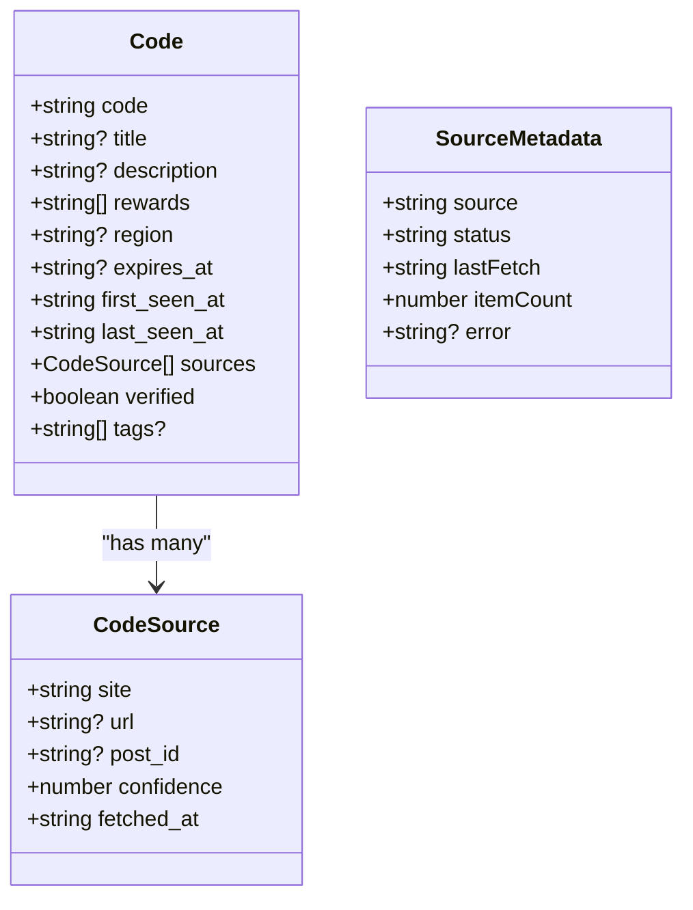
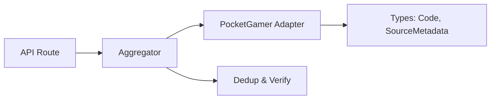

# PocketGamer Adapter

<cite>
**Referenced Files in This Document**
- [pocketgamer.ts](file://apps/web/lib/adapters/pocketgamer.ts)
- [codes.ts](file://apps/web/lib/types/codes.ts)
- [aggregator.ts](file://apps/web/lib/aggregator.ts)
- [dedupe.ts](file://apps/web/lib/dedupe.ts)
- [route.ts](file://apps/web/app/api/codes/route.ts)
- [SPEC.md](file://apps/web/docs/codes/SPEC.md)
- [ADAPTERS.md](file://apps/web/docs/codes/ADAPTERS.md)
</cite>

## Table of Contents
1. [Introduction](#introduction)
2. [Project Structure](#project-structure)
3. [Core Components](#core-components)
4. [Architecture Overview](#architecture-overview)
5. [Detailed Component Analysis](#detailed-component-analysis)
6. [Dependency Analysis](#dependency-analysis)
7. [Performance Considerations](#performance-considerations)
8. [Troubleshooting Guide](#troubleshooting-guide)
9. [Conclusion](#conclusion)
10. [Appendices](#appendices)

## Introduction
This document explains the PocketGamer adapter implementation used to retrieve promotional codes from PocketGamer’s “super-snail/codes” page. The adapter integrates with the Codes Aggregator pipeline, leveraging Firecrawl to scrape the page content in Markdown format, extracting candidate codes using a regular expression, and returning standardized code entries with metadata. It also covers how editorial trust signals are represented and how the adapter participates in deduplication and verification.

## Project Structure
The PocketGamer adapter is part of the web application’s adapters module and is orchestrated by the aggregator. The API route exposes the aggregated codes to clients. The adapter relies on shared types for code and metadata structures.

**Diagram sources**
- [pocketgamer.ts](file://apps/web/lib/adapters/pocketgamer.ts#L1-L155)
- [codes.ts](file://apps/web/lib/types/codes.ts#L1-L44)
- [aggregator.ts](file://apps/web/lib/aggregator.ts#L1-L86)
- [dedupe.ts](file://apps/web/lib/dedupe.ts#L1-L145)
- [route.ts](file://apps/web/app/api/codes/route.ts#L1-L135)

**Section sources**
- [pocketgamer.ts](file://apps/web/lib/adapters/pocketgamer.ts#L1-L155)
- [aggregator.ts](file://apps/web/lib/aggregator.ts#L1-L86)
- [route.ts](file://apps/web/app/api/codes/route.ts#L1-L135)

## Core Components
- PocketGamer Adapter: Fetches and parses PocketGamer content via Firecrawl, extracts candidate codes, and returns standardized entries with source metadata.
- Types: Defines the shape of Code, SourceMetadata, and related enums used across adapters and the aggregator.
- Aggregator: Orchestrates fetching from all sources, merges results, deduplicates, sorts, and builds source metadata.
- Deduplication: Applies trust weights and verification rules to produce verified codes.
- API Route: Exposes aggregated codes with caching and health endpoints.

**Section sources**
- [pocketgamer.ts](file://apps/web/lib/adapters/pocketgamer.ts#L1-L155)
- [codes.ts](file://apps/web/lib/types/codes.ts#L1-L44)
- [aggregator.ts](file://apps/web/lib/aggregator.ts#L1-L86)
- [dedupe.ts](file://apps/web/lib/dedupe.ts#L1-L145)
- [route.ts](file://apps/web/app/api/codes/route.ts#L1-L135)

## Architecture Overview
The PocketGamer adapter is invoked by the aggregator, which concurrently fetches from multiple sources. The adapter scrapes PocketGamer’s codes page using Firecrawl, converts the Markdown content into standardized code entries, and attaches source metadata. The aggregator then deduplicates and verifies codes, and the API route serves the results to clients with cache headers.

**Diagram sources**
- [aggregator.ts](file://apps/web/lib/aggregator.ts#L17-L65)
- [pocketgamer.ts](file://apps/web/lib/adapters/pocketgamer.ts#L72-L155)
- [route.ts](file://apps/web/app/api/codes/route.ts#L1-L135)
- [dedupe.ts](file://apps/web/lib/dedupe.ts#L1-L145)

## Detailed Component Analysis

### PocketGamer Adapter
- Purpose: Scrape PocketGamer’s “super-snail/codes” page via Firecrawl, extract candidate codes from Markdown, and return standardized entries with source metadata.
- Data source: The adapter targets a specific URL and requests Markdown output with only main content.
- Extraction logic: Uses a regular expression to match sequences of uppercase letters and digits, optionally separated by hyphens, with length constraints. It filters out common false positives (e.g., substrings indicating non-codes).
- Output: Produces Code entries with:
  - code: Uppercased and normalized
  - description: A snippet from the original line
  - region: global
  - expires_at: null (no expiry parsed)
  - timestamps: first_seen_at and last_seen_at set to current time
  - sources: includes site, url, confidence, and fetched_at
  - verified: false (subject to later verification)
  - tags: ["pocketgamer"]

**Diagram sources**
- [pocketgamer.ts](file://apps/web/lib/adapters/pocketgamer.ts#L22-L66)

**Section sources**
- [pocketgamer.ts](file://apps/web/lib/adapters/pocketgamer.ts#L1-L155)

### API Usage and Web Scraping Method
- Firecrawl integration: The adapter posts to the Firecrawl scrape endpoint with:
  - Authorization: Bearer token from environment
  - Body: url, formats: ["markdown"], onlyMainContent: true
  - Revalidation: 900 seconds (15 minutes)
- Rate limiting: Detects 429 responses and returns degraded metadata.
- Error handling: Missing API key yields not_configured metadata; other failures yield failed metadata with error messages.

**Diagram sources**
- [pocketgamer.ts](file://apps/web/lib/adapters/pocketgamer.ts#L72-L155)

**Section sources**
- [pocketgamer.ts](file://apps/web/lib/adapters/pocketgamer.ts#L72-L155)

### Article Crawling Logic, Publication Date Filtering, and Section-Specific Parsing
- Crawling: The adapter requests only main content from the PocketGamer codes page and expects Markdown output.
- Publication date filtering: The adapter does not parse publication dates or filter by date. Publication date is not part of the returned Code structure.
- Section-specific parsing: The adapter does not implement dedicated section parsing. It scans the entire Markdown body for candidate codes using a regex and basic heuristics to remove false positives.

**Section sources**
- [pocketgamer.ts](file://apps/web/lib/adapters/pocketgamer.ts#L92-L131)
- [codes.ts](file://apps/web/lib/types/codes.ts#L17-L43)

### Code Extraction Patterns and Validation Rules
- Pattern: Matches sequences of uppercase letters and digits with optional hyphens, with a minimum length threshold.
- Validation:
  - Rejects matches containing common false-positive markers (e.g., substrings indicating non-codes).
  - Ensures uppercase normalization.
  - Assigns a confidence score via source metadata.

**Section sources**
- [pocketgamer.ts](file://apps/web/lib/adapters/pocketgamer.ts#L22-L66)

### Editorial Trust Signals and Confidence Scores
- Trust representation: The adapter attaches a SourceMetadata object with a confidence value and marks the code as unverified initially.
- Verification: The aggregator’s deduplication logic applies trust weights and verification rules. PocketGamer is assigned a moderate trust weight, and verification depends on combined trust from recent sources or high-trust sources.

**Diagram sources**
- [codes.ts](file://apps/web/lib/types/codes.ts#L9-L43)

**Section sources**
- [pocketgamer.ts](file://apps/web/lib/adapters/pocketgamer.ts#L43-L66)
- [dedupe.ts](file://apps/web/lib/dedupe.ts#L84-L114)

### Error Handling for Site Changes, Paywalls, and Content Updates
- Missing API key: Returns not_configured metadata.
- Rate limiting: Returns degraded metadata on 429.
- Non-2xx responses: Throws and returns failed metadata.
- Content changes: The adapter does not implement change detection; it relies on Firecrawl to return Markdown content. If the site structure changes, the regex and heuristics may need updates.

**Section sources**
- [pocketgamer.ts](file://apps/web/lib/adapters/pocketgamer.ts#L78-L155)

### Transforming PocketGamer Content into Standardized Code Entries
- Input: Markdown from PocketGamer’s codes page.
- Transformation steps:
  - Split into lines.
  - Match candidate codes with regex.
  - Filter false positives.
  - Build Code entries with source metadata.
  - Attach tags and confidence.

**Section sources**
- [pocketgamer.ts](file://apps/web/lib/adapters/pocketgamer.ts#L22-L66)

### Caching Policies and Update Frequency
- Adapter-level caching: The adapter sets a 15-minute revalidate directive for Firecrawl requests.
- API-level caching: The API route sets client-side caching headers and server-side cache controls, with stale-while-revalidate policies to serve stale data while refreshing in the background.
- Update frequency: The adapter revalidates every 15 minutes; the API route revalidates every 60 seconds.

**Section sources**
- [pocketgamer.ts](file://apps/web/lib/adapters/pocketgamer.ts#L104-L105)
- [route.ts](file://apps/web/app/api/codes/route.ts#L1-L20)

### Best Practices for Maintaining the Adapter During Redesigns
- Monitor Firecrawl responses and adjust regex/heuristics if PocketGamer changes markup or text formatting.
- Keep the target URL updated if PocketGamer moves the codes page.
- Consider adding change detection (e.g., hashing main content) to avoid unnecessary parsing when content is unchanged.
- Validate that confidence and verification logic remain aligned with evolving editorial trust signals.

**Section sources**
- [ADAPTERS.md](file://apps/web/docs/codes/ADAPTERS.md#L53-L69)

## Dependency Analysis
The PocketGamer adapter depends on shared types and participates in the aggregator and deduplication pipeline.

**Diagram sources**
- [pocketgamer.ts](file://apps/web/lib/adapters/pocketgamer.ts#L1-L155)
- [codes.ts](file://apps/web/lib/types/codes.ts#L1-L44)
- [aggregator.ts](file://apps/web/lib/aggregator.ts#L1-L86)
- [dedupe.ts](file://apps/web/lib/dedupe.ts#L1-L145)
- [route.ts](file://apps/web/app/api/codes/route.ts#L1-L135)

**Section sources**
- [aggregator.ts](file://apps/web/lib/aggregator.ts#L17-L65)
- [dedupe.ts](file://apps/web/lib/dedupe.ts#L1-L145)

## Performance Considerations
- Firecrawl requests are cached at the adapter level (15 minutes) and at the API level (60 seconds with stale-while-revalidate).
- Regex-based extraction is linear in the number of lines in the Markdown body.
- Deduplication and verification operate on the combined set of codes from all sources.

[No sources needed since this section provides general guidance]

## Troubleshooting Guide
- Missing Firecrawl API key: The adapter returns not_configured metadata. Ensure the environment variable is set.
- Rate limiting: On 429, the adapter returns degraded metadata. Retry after the rate limit resets.
- Firecrawl errors: Non-2xx responses cause failed metadata with error details.
- Verification not occurring: PocketGamer codes are unverified by default; verification depends on aggregator logic and combined trust weights.

**Section sources**
- [pocketgamer.ts](file://apps/web/lib/adapters/pocketgamer.ts#L78-L155)
- [dedupe.ts](file://apps/web/lib/dedupe.ts#L84-L114)

## Conclusion
The PocketGamer adapter provides a focused, resilient integration for extracting promotional codes from PocketGamer’s codes page. It leverages Firecrawl for reliable content retrieval, applies straightforward extraction rules, and integrates cleanly into the broader Codes Aggregator pipeline. Verification and trust weighting are handled by the deduplication layer, enabling robust, standardized code entries for downstream consumers.

[No sources needed since this section summarizes without analyzing specific files]

## Appendices

### API Endpoint Details
- Endpoint: GET /api/codes
- Query parameters:
  - scope: active, past7, or all
  - q: optional search query
  - metadata: include source metadata
  - health: health check mode
- Response includes codes, sources, scope, query, count, and timestamp; cache headers indicate freshness and processing time.

**Section sources**
- [route.ts](file://apps/web/app/api/codes/route.ts#L1-L135)
- [SPEC.md](file://apps/web/docs/codes/SPEC.md#L1-L82)