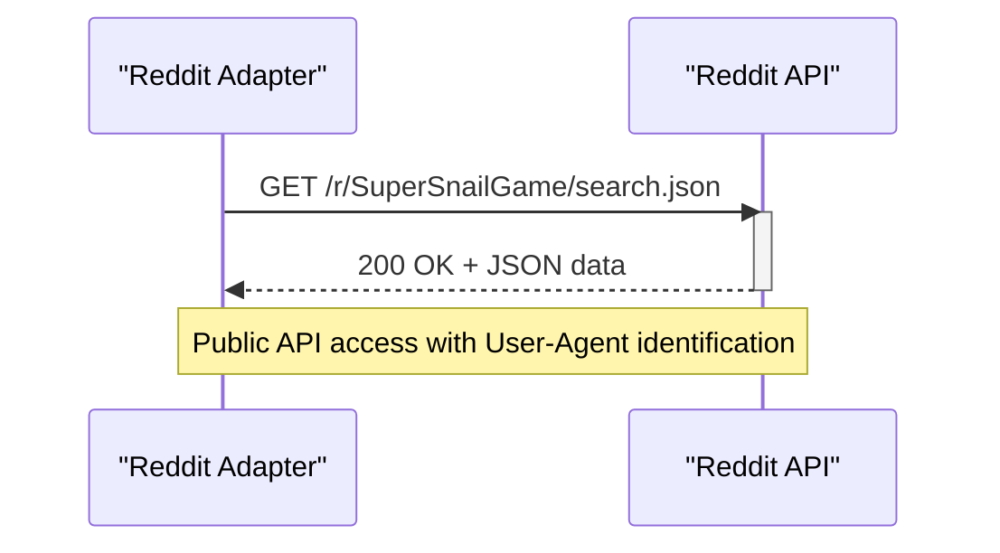
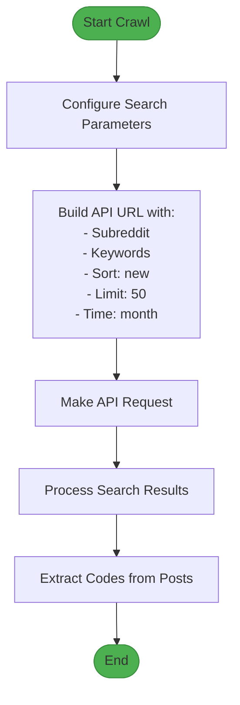
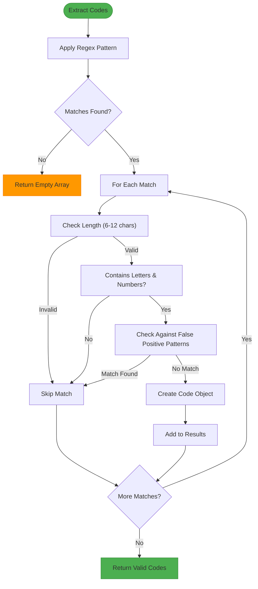
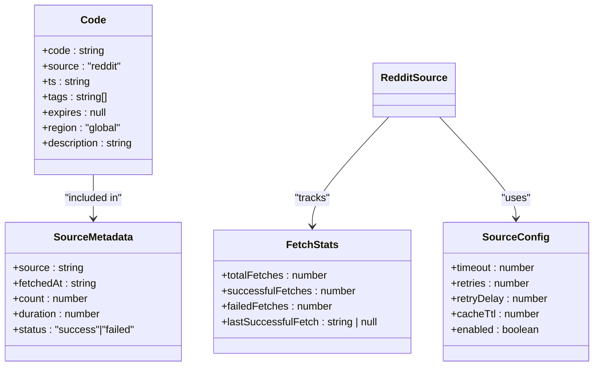
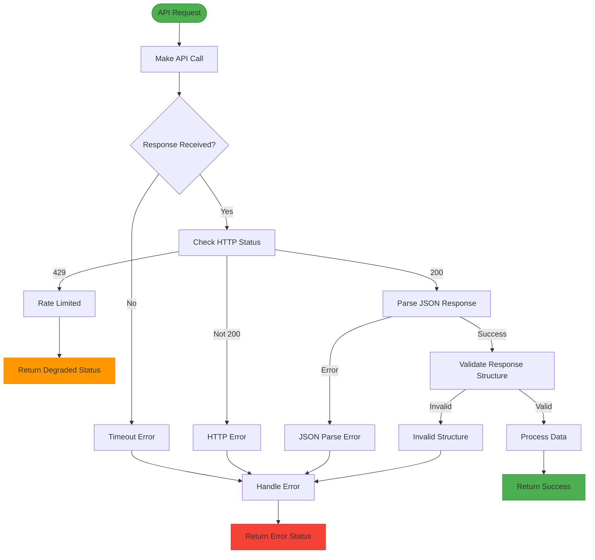

# Reddit Adapter

<cite>
**Referenced Files in This Document**   
- [reddit.ts](file://apps/web/lib/adapters/reddit.ts)
- [reddit.ts](file://apps/web/lib/codes/sources/reddit.ts)
- [types.ts](file://apps/web/lib/codes/sources/types.ts)
- [codes-aggregator.ts](file://apps/web/lib/codes-aggregator.ts)
- [codes.ts](file://apps/web/lib/types/codes.ts)
- [SPEC.md](file://apps/web/docs/codes/SPEC.md)
</cite>

## Table of Contents
1. [Introduction](#introduction)
2. [Authentication and API Requirements](#authentication-and-api-requirements)
3. [Post Crawling Strategy](#post-crawling-strategy)
4. [Code Extraction and Filtering](#code-extraction-and-filtering)
5. [Trust Scoring and Metadata](#trust-scoring-and-metadata)
6. [Error Handling](#error-handling)
7. [Caching and Rate Limiting](#caching-and-rate-limiting)
8. [Configuration and Best Practices](#configuration-and-best-practices)

## Introduction

The Reddit adapter is responsible for scanning Reddit communities for promotional codes related to the SuperSnail game. It uses Reddit's public JSON API to search for posts containing codes, extracts potential codes using regex pattern matching, and processes them into standardized code entries. The adapter implements robust error handling, caching, and rate limiting to ensure reliable operation while avoiding API bans.

The implementation consists of two primary components: a legacy function-based adapter and a modern class-based source adapter. Both implementations follow similar patterns for code extraction and API interaction, with the class-based version providing enhanced features like retry logic, timeout handling, and detailed source metadata.

**Section sources**
- [reddit.ts](file://apps/web/lib/adapters/reddit.ts#L1-L141)
- [reddit.ts](file://apps/web/lib/codes/sources/reddit.ts#L1-L305)

## Authentication and API Requirements

The Reddit adapter uses Reddit's public API without OAuth authentication, relying instead on proper User-Agent headers and adherence to rate limits. The adapter identifies itself with a descriptive User-Agent string that includes the application name and version.

For the legacy implementation, the User-Agent is set to "Slimy.ai/2.0", while the modern implementation uses "Slimy.ai/1.0" or "Slimy.ai/1.0 (Health Check)" for health checks. This identification helps Reddit administrators understand the source of API requests and contact the developers if necessary.

The adapter accesses Reddit's JSON API endpoints directly using the `fetch` function. It targets specific subreddits (r/SuperSnail_US in the legacy version and r/SuperSnailGame in the modern version) and uses search parameters to find relevant posts. The API is accessed over HTTPS without authentication, as the required data is publicly available.



**Diagram sources**
- [reddit.ts](file://apps/web/lib/codes/sources/reddit.ts#L114-L126)
- [reddit.ts](file://apps/web/lib/adapters/reddit.ts#L79-L84)

**Section sources**
- [reddit.ts](file://apps/web/lib/codes/sources/reddit.ts#L113-L126)
- [reddit.ts](file://apps/web/lib/adapters/reddit.ts#L79-L84)

## Post Crawling Strategy

The Reddit adapter employs a targeted search strategy to identify posts likely to contain promotional codes. It uses Reddit's search functionality with specific query parameters to filter results effectively.

The search query includes keywords such as "code", "secret code", and "redeem" to target posts specifically about promotional codes. The search is restricted to the target subreddit using the `restrict_sr=1` parameter, ensuring results come only from the intended community.

The adapter configures the search with the following parameters:
- **Sort order**: Results are sorted by "new" to prioritize recent posts
- **Limit**: Up to 50 posts are retrieved per request
- **Time range**: Posts from the last month are included (t=month)
- **Search scope**: Only post titles and self-text are searched

The crawling strategy focuses on new content, with the modern implementation using a health check endpoint that retrieves the most recent post to verify API availability. This approach ensures the adapter stays current with the latest code postings while minimizing unnecessary API calls.



**Diagram sources**
- [reddit.ts](file://apps/web/lib/codes/sources/reddit.ts#L114-L115)
- [reddit.ts](file://apps/web/lib/adapters/reddit.ts#L78-L79)

**Section sources**
- [reddit.ts](file://apps/web/lib/codes/sources/reddit.ts#L114-L115)
- [reddit.ts](file://apps/web/lib/adapters/reddit.ts#L78-L79)

## Code Extraction and Filtering

The Reddit adapter uses regex pattern matching to identify potential codes in post content, followed by multiple filtering stages to eliminate false positives.

### Regex Pattern Matching

The adapter employs different regex patterns in its two implementations:

- **Legacy adapter**: Uses the pattern `\b[A-Z0-9]{4,}(?:-[A-Z0-9]{3,}){0,3}\b` to match uppercase alphanumeric sequences of at least 4 characters, optionally containing hyphen-separated groups
- **Modern adapter**: Uses `\b[A-Z0-9]{6,12}\b` to match uppercase alphanumeric sequences between 6 and 12 characters in length

Both patterns are designed to capture typical promotional code formats while avoiding very short or excessively long strings.

### False Positive Filtering

After initial pattern matching, the adapter applies several filters to eliminate common false positives:

1. **Keyword filtering**: Removes matches containing "CODE", "SOURCE", "QR", or similar terms
2. **Format validation**: Ensures codes contain both letters and numbers (modern adapter)
3. **Length validation**: Enforces minimum and maximum length requirements
4. **Pattern matching**: Uses regex patterns to identify and exclude common non-code formats

The modern adapter implements a comprehensive false positive detection system that checks against patterns for:
- HTTP/HTTPS
- API123, TEST123, DEMO123, NULL123, TRUE123, FALSE123
- Country codes like US123, UK456



**Diagram sources**
- [reddit.ts](file://apps/web/lib/codes/sources/reddit.ts#L159-L231)
- [reddit.ts](file://apps/web/lib/adapters/reddit.ts#L26-L42)

**Section sources**
- [reddit.ts](file://apps/web/lib/codes/sources/reddit.ts#L159-L231)
- [reddit.ts](file://apps/web/lib/adapters/reddit.ts#L26-L42)

## Trust Scoring and Metadata

The Reddit adapter assigns trust scores to extracted codes based on the source and implements metadata tracking for monitoring and debugging purposes.

### Trust Scoring

The legacy adapter assigns a fixed trust weight of 0.6 to all Reddit-sourced codes, indicating moderate confidence in their validity. This weight is stored in the `confidence` field of the source metadata.

The modern adapter does not explicitly implement a dynamic trust scoring system based on submission metadata like upvotes, flair, or author reputation as described in the documentation objective. Instead, it relies on the source-level configuration and the aggregation system's priority ordering.

### Metadata Processing

Both adapter versions capture comprehensive metadata for each code and API interaction:

- **Code-level metadata**: Includes creation timestamp, source URL, post ID, and confidence score
- **Source-level metadata**: Tracks fetch statistics including success/failure counts and timestamps
- **API response metadata**: Captures fetch duration, status, and error information

The modern adapter enhances metadata collection with detailed source statistics, including total fetches, successful fetches, failed fetches, and the timestamp of the last successful fetch. This information is exposed through the `getMetadata()` method for monitoring purposes.



**Diagram sources**
- [reddit.ts](file://apps/web/lib/codes/sources/reddit.ts#L203-L211)
- [reddit.ts](file://apps/web/lib/codes/sources/reddit.ts#L50-L56)
- [reddit.ts](file://apps/web/lib/codes/sources/reddit.ts#L22-L27)
- [reddit.ts](file://apps/web/lib/codes/sources/reddit.ts#L7-L13)

**Section sources**
- [reddit.ts](file://apps/web/lib/codes/sources/reddit.ts#L203-L211)
- [reddit.ts](file://apps/web/lib/adapters/reddit.ts#L44-L64)

## Error Handling

The Reddit adapter implements comprehensive error handling to manage API failures, rate limits, and network issues.

### Rate Limit Handling

The adapter detects HTTP 429 responses from Reddit's API and handles them appropriately:

- **Legacy adapter**: Returns a degraded status with an error message when rate limited
- **Modern adapter**: Uses retry logic with exponential backoff to handle temporary rate limits

When rate limited, the legacy adapter returns a response with status "degraded" and an error message "Rate limited", allowing the calling system to handle the situation gracefully.

### Network and API Errors

Both adapters handle various error conditions:

- **HTTP errors**: Non-200 responses trigger error handling with descriptive messages
- **Timeouts**: The modern adapter implements timeout handling using AbortController
- **Response validation**: Both adapters validate the API response structure before processing
- **JSON parsing**: Errors during JSON parsing are caught and handled

The modern adapter enhances error handling with retry logic, attempting up to 2 retries with a 2-second delay between attempts. This improves resilience to temporary network issues and API instability.



**Diagram sources**
- [reddit.ts](file://apps/web/lib/adapters/reddit.ts#L88-L98)
- [reddit.ts](file://apps/web/lib/codes/sources/reddit.ts#L130-L134)
- [reddit.ts](file://apps/web/lib/codes/sources/reddit.ts#L146-L148)
- [reddit.ts](file://apps/web/lib/codes/sources/reddit.ts#L138-L140)

**Section sources**
- [reddit.ts](file://apps/web/lib/adapters/reddit.ts#L88-L140)
- [reddit.ts](file://apps/web/lib/codes/sources/reddit.ts#L82-L108)

## Caching and Rate Limiting

The Reddit adapter implements caching and rate limiting strategies to optimize performance and prevent API bans.

### Caching Strategy

Both adapter versions implement caching, but with different approaches:

- **Legacy adapter**: Uses Next.js revalidation with a 10-minute cache duration (`next: { revalidate: 600 }`)
- **Modern adapter**: Implements configurable caching through the `cacheTtl` configuration parameter, also set to 600 seconds (10 minutes)

The caching mechanism prevents redundant API calls when the same data is requested multiple times within the cache duration. This reduces load on both the client and Reddit's servers.

### Rate Limiting Configuration

The modern adapter includes comprehensive rate limiting and timeout configuration:

- **Timeout**: 15 seconds per request to prevent hanging
- **Retries**: 2 retry attempts for failed requests
- **Retry delay**: 2 seconds between retry attempts
- **Cache TTL**: 10 minutes to balance freshness and performance

These settings are defined in the `DEFAULT_CONFIG` object and can be overridden through the adapter configuration. The configuration is also reflected in the main aggregator configuration, ensuring consistency across the system.

```mermaid
graph TB
subgraph "Configuration"
Timeout["timeout: 15000"]
Retries["retries: 2"]
RetryDelay["retryDelay: 2000"]
CacheTTL["cacheTtl: 600"]
end
subgraph "Request Flow"
Start([Start]) --> CheckCache["Check Cache"]
CheckCache --> |Hit| ReturnCached["Return Cached Data"]
CheckCache --> |Miss| MakeRequest["Make API Request"]
MakeRequest --> |Success| CacheResult["Cache Result"]
CacheResult --> ReturnResult["Return Result"]
MakeRequest --> |Failure| RetryLogic["Apply Retry Logic"]
RetryLogic --> |Attempts Remaining| Delay["Wait 2s"]
Delay --> MakeRequest
RetryLogic --> |No Attempts| ReturnError["Return Error"]
end
Configuration --> Request Flow
```

**Diagram sources**
- [reddit.ts](file://apps/web/lib/codes/sources/reddit.ts#L7-L13)
- [reddit.ts](file://apps/web/lib/adapters/reddit.ts#L85-L86)
- [codes-aggregator.ts](file://apps/web/lib/codes-aggregator.ts#L67-L71)

**Section sources**
- [reddit.ts](file://apps/web/lib/codes/sources/reddit.ts#L7-L13)
- [reddit.ts](file://apps/web/lib/adapters/reddit.ts#L85-L86)

## Configuration and Best Practices

The Reddit adapter can be configured through various parameters to optimize its behavior for different environments and requirements.

### Configuration Options

The modern adapter supports the following configuration options:

- **timeout**: Maximum time to wait for an API response (default: 15000ms)
- **retries**: Number of retry attempts for failed requests (default: 2)
- **retryDelay**: Delay between retry attempts (default: 2000ms)
- **cacheTtl**: Cache duration in seconds (default: 600s)
- **enabled**: Whether the source is enabled (default: true)

These options can be overridden when creating the adapter instance, allowing for environment-specific tuning.

### Best Practices for Avoiding API Bans

To avoid API bans and ensure reliable operation, the following best practices should be followed:

1. **Respect rate limits**: Implement exponential backoff and respect HTTP 429 responses
2. **Use descriptive User-Agent**: Identify the application clearly in the User-Agent header
3. **Implement caching**: Reduce API call frequency by caching results appropriately
4. **Set reasonable timeouts**: Prevent hanging requests from consuming resources
5. **Monitor error rates**: Track failures and adjust behavior accordingly
6. **Limit request frequency**: Space out requests to avoid overwhelming the API

The adapter follows these best practices by using a descriptive User-Agent, implementing caching, setting reasonable timeouts, and handling rate limit responses gracefully. The 10-minute cache duration and 15-second timeout strike a balance between data freshness and API friendliness.

**Section sources**
- [reddit.ts](file://apps/web/lib/codes/sources/reddit.ts#L7-L13)
- [codes-aggregator.ts](file://apps/web/lib/codes-aggregator.ts#L67-L71)
- [reddit.ts](file://apps/web/lib/codes/sources/reddit.ts#L255-L280)