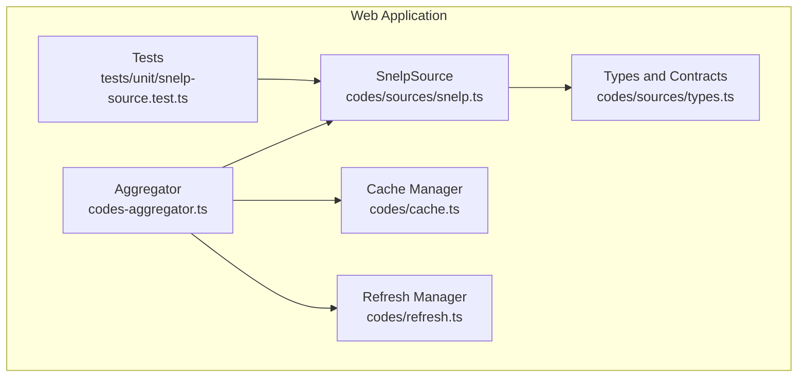
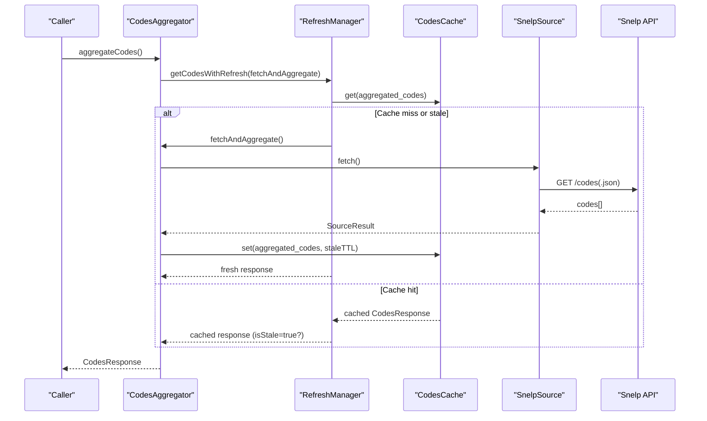
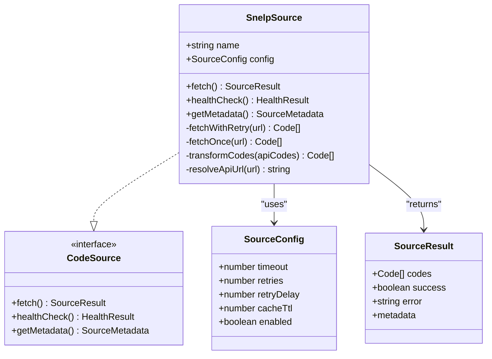
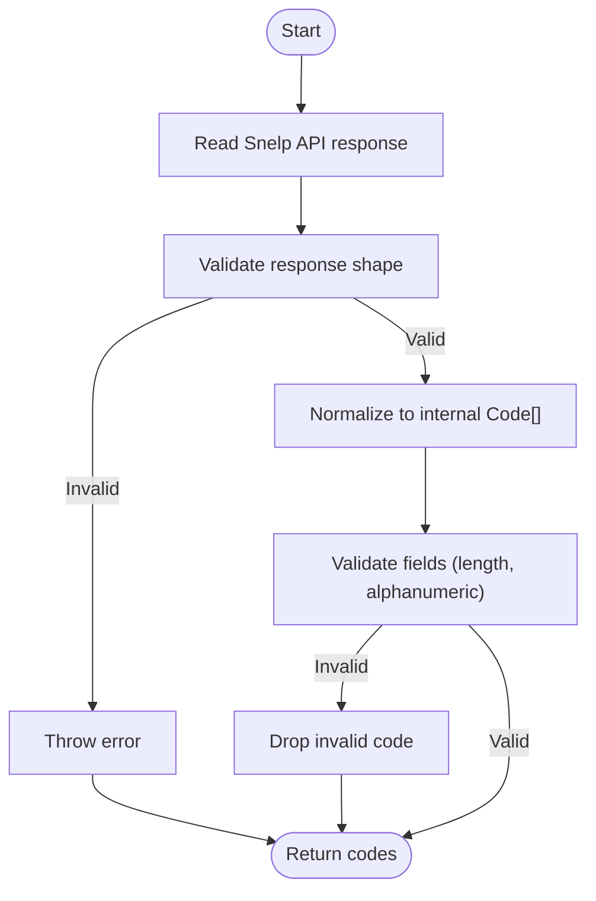
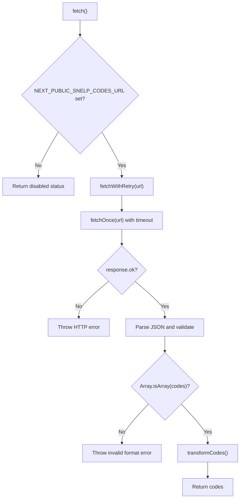
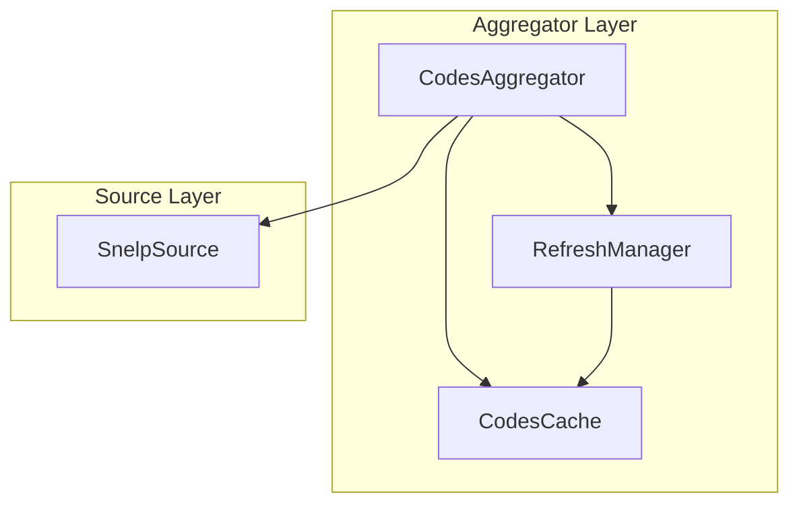
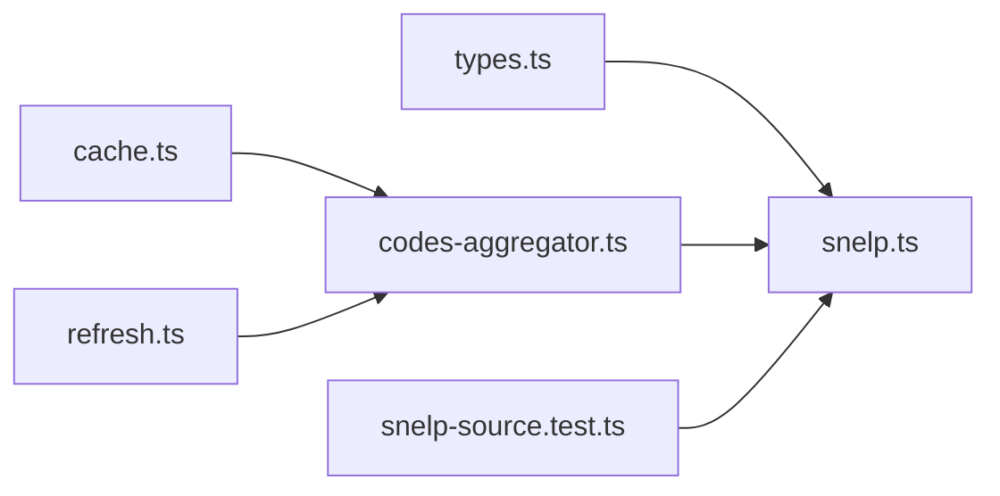

# Snelp Adapter

<cite>
**Referenced Files in This Document**
- [snelp.ts](file://apps/web/lib/codes/sources/snelp.ts)
- [types.ts](file://apps/web/lib/codes/sources/types.ts)
- [codes-aggregator.ts](file://apps/web/lib/codes-aggregator.ts)
- [cache.ts](file://apps/web/lib/codes/cache.ts)
- [refresh.ts](file://apps/web/lib/codes/refresh.ts)
- [SPEC.md](file://apps/web/docs/codes/SPEC.md)
- [snelp-source.test.ts](file://apps/web/tests/unit/snelp-source.test.ts)
</cite>

## Table of Contents
1. [Introduction](#introduction)
2. [Project Structure](#project-structure)
3. [Core Components](#core-components)
4. [Architecture Overview](#architecture-overview)
5. [Detailed Component Analysis](#detailed-component-analysis)
6. [Dependency Analysis](#dependency-analysis)
7. [Performance Considerations](#performance-considerations)
8. [Troubleshooting Guide](#troubleshooting-guide)
9. [Conclusion](#conclusion)
10. [Appendices](#appendices)

## Introduction
This document explains the Snelp adapter implementation used to retrieve promotional codes from the Snelp community platform. It covers how the adapter integrates with the Snelp API, the data extraction and normalization pipeline, error recovery mechanisms, caching and refresh behavior, and compatibility considerations for API version changes. It also clarifies how the adapter fits into the broader codes aggregation system and how it normalizes Snelp-specific fields into the universal code schema.

## Project Structure
The Snelp adapter lives in the web application’s codes subsystem and participates in the unified aggregation pipeline. Key files include:
- Snelp source adapter: implements the CodeSource interface and performs fetching, transformation, and health checks
- Types and interfaces: define the source contract, configuration, and result shapes
- Aggregator: orchestrates fetching from multiple sources, deduplication, caching, and refresh
- Cache and refresh managers: provide Redis-backed caching and background refresh
- Tests: validate behavior under missing configuration and typical scenarios

**Diagram sources**
- [snelp.ts](file://apps/web/lib/codes/sources/snelp.ts#L1-L304)
- [types.ts](file://apps/web/lib/codes/sources/types.ts#L1-L104)
- [codes-aggregator.ts](file://apps/web/lib/codes-aggregator.ts#L1-L353)
- [cache.ts](file://apps/web/lib/codes/cache.ts#L1-L302)
- [refresh.ts](file://apps/web/lib/codes/refresh.ts#L1-L298)
- [snelp-source.test.ts](file://apps/web/tests/unit/snelp-source.test.ts#L1-L64)

**Section sources**
- [snelp.ts](file://apps/web/lib/codes/sources/snelp.ts#L1-L304)
- [types.ts](file://apps/web/lib/codes/sources/types.ts#L1-L104)
- [codes-aggregator.ts](file://apps/web/lib/codes-aggregator.ts#L1-L353)
- [cache.ts](file://apps/web/lib/codes/cache.ts#L1-L302)
- [refresh.ts](file://apps/web/lib/codes/refresh.ts#L1-L298)
- [snelp-source.test.ts](file://apps/web/tests/unit/snelp-source.test.ts#L1-L64)

## Core Components
- SnelpSource: Implements the CodeSource interface, fetches codes from the Snelp API, transforms the response into the internal Code format, and exposes health checks and metadata.
- SourceResult and SourceConfig: Define the shape of fetch results and the adapter configuration (timeout, retries, cache TTL, enabled flag).
- CodesAggregator: Coordinates fetching from all sources, applies fallbacks, deduplicates, sorts, and manages caching and refresh.
- CodesCache and RefreshManager: Provide Redis-backed caching and background refresh with stale-while-revalidate semantics.
- Tests: Verify behavior when the Snelp API URL is missing and when a successful response is received.

**Section sources**
- [snelp.ts](file://apps/web/lib/codes/sources/snelp.ts#L1-L304)
- [types.ts](file://apps/web/lib/codes/sources/types.ts#L1-L104)
- [codes-aggregator.ts](file://apps/web/lib/codes-aggregator.ts#L1-L353)
- [cache.ts](file://apps/web/lib/codes/cache.ts#L1-L302)
- [refresh.ts](file://apps/web/lib/codes/refresh.ts#L1-L298)
- [snelp-source.test.ts](file://apps/web/tests/unit/snelp-source.test.ts#L1-L64)

## Architecture Overview
The Snelp adapter is a CodeSource that integrates with the CodesAggregator. The aggregator runs periodic refresh cycles, caches results, and serves data with fallback and deduplication logic. The adapter itself handles retries, timeouts, and response transformation.

**Diagram sources**
- [codes-aggregator.ts](file://apps/web/lib/codes-aggregator.ts#L144-L271)
- [refresh.ts](file://apps/web/lib/codes/refresh.ts#L54-L100)
- [cache.ts](file://apps/web/lib/codes/cache.ts#L120-L183)
- [snelp.ts](file://apps/web/lib/codes/sources/snelp.ts#L37-L97)

## Detailed Component Analysis

### SnelpSource: Fetch, Transform, Health, and Metadata
- Fetching:
  - Reads NEXT_PUBLIC_SNELP_CODES_URL from environment.
  - If missing, returns disabled status with empty codes.
  - Otherwise resolves the API URL (supports .json, /api/, or appends /codes.json).
  - Performs fetch with AbortController timeout and retry logic.
  - Validates response shape and throws on invalid format.
- Transformation:
  - Accepts either an array of strings or objects with code/text, timestamps, active flags, regions, and descriptions.
  - Normalizes to internal Code format with uppercase codes, standardized timestamps, tags, and optional expiration.
  - Applies basic validation (length and alphanumeric constraints).
- Health check:
  - Issues a HEAD-like request with a short timeout and a specific User-Agent header.
- Metadata:
  - Tracks total/successful/failed fetches and last successful fetch timestamp.

**Diagram sources**
- [snelp.ts](file://apps/web/lib/codes/sources/snelp.ts#L1-L304)
- [types.ts](file://apps/web/lib/codes/sources/types.ts#L1-L104)

**Section sources**
- [snelp.ts](file://apps/web/lib/codes/sources/snelp.ts#L37-L296)
- [types.ts](file://apps/web/lib/codes/sources/types.ts#L1-L104)

### Data Extraction and Normalization Pipeline
- Input: Snelp API response array (strings or objects).
- Extraction:
  - Filters null/empty entries and validates presence of code/text.
  - Converts strings to objects with normalized fields.
  - Maps timestamps, active flags, regions, and descriptions.
- Validation:
  - Enforces length bounds and alphanumeric constraints.
- Output: Internal Code[] compatible with the aggregator.

**Diagram sources**
- [snelp.ts](file://apps/web/lib/codes/sources/snelp.ts#L173-L226)

**Section sources**
- [snelp.ts](file://apps/web/lib/codes/sources/snelp.ts#L173-L226)

### Trust Weighting and Community Tags
- Trust weighting:
  - The Snelp adapter does not compute trust weights based on user verification levels or engagement metrics.
  - The adapter sets a fixed confidence level for Snelp sources in the aggregator’s unified schema.
- Community tags:
  - Active codes receive an “active” tag during transformation.
  - Additional tags such as “snelp” are not added to the unified schema in this adapter’s transformation.

Note: The adapter’s role is to fetch and normalize codes; trust weighting and tag enrichment are handled elsewhere in the aggregation pipeline.

**Section sources**
- [snelp.ts](file://apps/web/lib/codes/sources/snelp.ts#L173-L226)

### Error Recovery and Retry Logic
- Environment configuration:
  - If NEXT_PUBLIC_SNELP_CODES_URL is missing, the adapter returns disabled status and avoids making network requests.
- Network errors:
  - Uses AbortController with timeout configured in SourceConfig.
  - Retries up to configured attempts with a fixed delay.
  - Throws explicit errors on HTTP errors and invalid response formats.
- Health checks:
  - Short timeout health check to probe availability.

**Diagram sources**
- [snelp.ts](file://apps/web/lib/codes/sources/snelp.ts#L37-L171)

**Section sources**
- [snelp.ts](file://apps/web/lib/codes/sources/snelp.ts#L37-L171)

### Caching Behavior and Synchronization
- Aggregator caching:
  - The aggregator caches aggregated results with TTL and stale-while-revalidate semantics.
  - RefreshManager periodically refreshes aggregated codes in the background.
- Source-level cache TTL:
  - SnelpSource has its own cacheTtl setting in SourceConfig, but the aggregator’s cache controls the overall aggregated cache.
- Synchronization:
  - RefreshManager coordinates cache updates and background refresh.
  - CodesAggregator writes aggregated results to cache and reads them back for serving.

**Diagram sources**
- [codes-aggregator.ts](file://apps/web/lib/codes-aggregator.ts#L144-L271)
- [refresh.ts](file://apps/web/lib/codes/refresh.ts#L54-L100)
- [cache.ts](file://apps/web/lib/codes/cache.ts#L120-L183)
- [snelp.ts](file://apps/web/lib/codes/sources/snelp.ts#L1-L304)

**Section sources**
- [codes-aggregator.ts](file://apps/web/lib/codes-aggregator.ts#L144-L271)
- [refresh.ts](file://apps/web/lib/codes/refresh.ts#L1-L298)
- [cache.ts](file://apps/web/lib/codes/cache.ts#L1-L302)

### Compatibility Notes for API Version Changes
- URL resolution:
  - The adapter resolves URLs to support .json, /api/, or appends /codes.json automatically.
- Response shape:
  - Expects an array of codes; accepts either strings or objects with code/text and optional metadata.
- Backward compatibility:
  - The adapter tolerates missing optional fields and normalizes to the internal schema.
- Health checks:
  - Health checks use a dedicated User-Agent and short timeout to detect availability without heavy load.

**Section sources**
- [snelp.ts](file://apps/web/lib/codes/sources/snelp.ts#L280-L296)

## Dependency Analysis
The Snelp adapter depends on:
- Source contracts and configuration (types.ts)
- Aggregator orchestration (codes-aggregator.ts)
- Cache and refresh managers (cache.ts, refresh.ts)
- Tests validate runtime behavior (snelp-source.test.ts)

**Diagram sources**
- [types.ts](file://apps/web/lib/codes/sources/types.ts#L1-L104)
- [snelp.ts](file://apps/web/lib/codes/sources/snelp.ts#L1-L304)
- [codes-aggregator.ts](file://apps/web/lib/codes-aggregator.ts#L1-L353)
- [cache.ts](file://apps/web/lib/codes/cache.ts#L1-L302)
- [refresh.ts](file://apps/web/lib/codes/refresh.ts#L1-L298)
- [snelp-source.test.ts](file://apps/web/tests/unit/snelp-source.test.ts#L1-L64)

**Section sources**
- [types.ts](file://apps/web/lib/codes/sources/types.ts#L1-L104)
- [snelp.ts](file://apps/web/lib/codes/sources/snelp.ts#L1-L304)
- [codes-aggregator.ts](file://apps/web/lib/codes-aggregator.ts#L1-L353)
- [cache.ts](file://apps/web/lib/codes/cache.ts#L1-L302)
- [refresh.ts](file://apps/web/lib/codes/refresh.ts#L1-L298)
- [snelp-source.test.ts](file://apps/web/tests/unit/snelp-source.test.ts#L1-L64)

## Performance Considerations
- Timeout and retries:
  - SourceConfig allows tuning timeouts and retry delays to balance responsiveness and resilience.
- Background refresh:
  - RefreshManager performs background refreshes to keep data fresh without blocking requests.
- Cache TTL and stale-while-revalidate:
  - Aggregator cache reduces latency and load; stale data can be served while refreshing in the background.

[No sources needed since this section provides general guidance]

## Troubleshooting Guide
Common issues and resolutions:
- Missing NEXT_PUBLIC_SNELP_CODES_URL:
  - The adapter logs a warning and returns disabled status with empty codes.
- Rate limiting or HTTP errors:
  - The adapter retries and throws explicit errors; inspect logs for HTTP status and error messages.
- Invalid response format:
  - The adapter validates the response shape and throws on invalid arrays; confirm the API returns an array of codes.
- Health check failures:
  - Use healthCheck() to probe availability; verify URL resolution and network connectivity.

**Section sources**
- [snelp.ts](file://apps/web/lib/codes/sources/snelp.ts#L37-L171)
- [snelp-source.test.ts](file://apps/web/tests/unit/snelp-source.test.ts#L1-L64)

## Conclusion
The Snelp adapter provides a robust, configurable integration with the Snelp API. It fetches codes, transforms them into the internal schema, and participates in the aggregator’s caching and refresh system. While it does not compute trust weights or enrich tags internally, it lays the groundwork for higher-level systems to apply trust weighting and tag normalization. The adapter’s retry, timeout, and health-check mechanisms improve reliability, and the caching and refresh managers ensure efficient, resilient data delivery.

[No sources needed since this section summarizes without analyzing specific files]

## Appendices

### API Endpoint Usage and Response Structure
- Endpoint: The adapter resolves the Snelp API URL to one of:
  - A JSON endpoint (.json)
  - An API path (/api/)
  - A default path with appended /codes.json
- Response: An array of codes, each represented as:
  - A string (normalized to uppercase)
  - An object with fields such as code/text, timestamps, active flag, region, and description

**Section sources**
- [snelp.ts](file://apps/web/lib/codes/sources/snelp.ts#L280-L296)

### Pagination Handling
- The Snelp adapter expects a single endpoint that returns all codes in one array.
- Pagination is not implemented in this adapter; the aggregator handles overall pagination for the aggregated endpoint.

**Section sources**
- [SPEC.md](file://apps/web/docs/codes/SPEC.md#L1-L82)

### Real-Time Update Polling
- The aggregator uses RefreshManager to periodically refresh aggregated codes in the background.
- The Snelp adapter does not implement polling; refresh cadence is controlled centrally.

**Section sources**
- [refresh.ts](file://apps/web/lib/codes/refresh.ts#L102-L145)
- [codes-aggregator.ts](file://apps/web/lib/codes-aggregator.ts#L136-L139)

### Example: Raw Snelp API Data and Transformation
- Raw input examples:
  - Array of strings representing codes
  - Array of objects with code/text, timestamps, active flags, regions, and descriptions
- Transformation outcomes:
  - Normalized uppercase codes
  - Standardized timestamps
  - Active tag for active codes
  - Optional expiration and region fields

**Section sources**
- [snelp.ts](file://apps/web/lib/codes/sources/snelp.ts#L173-L226)