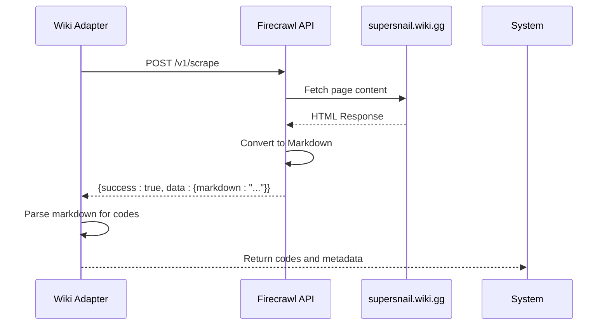
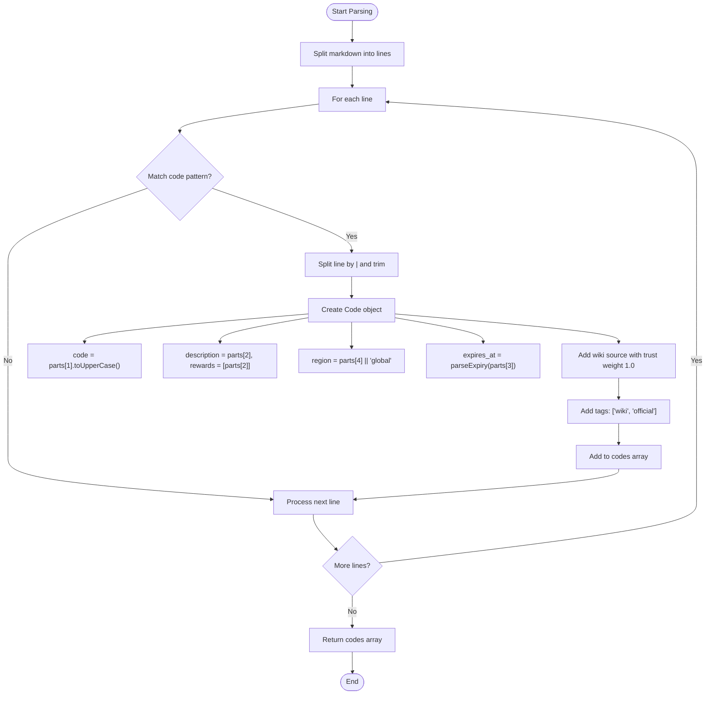
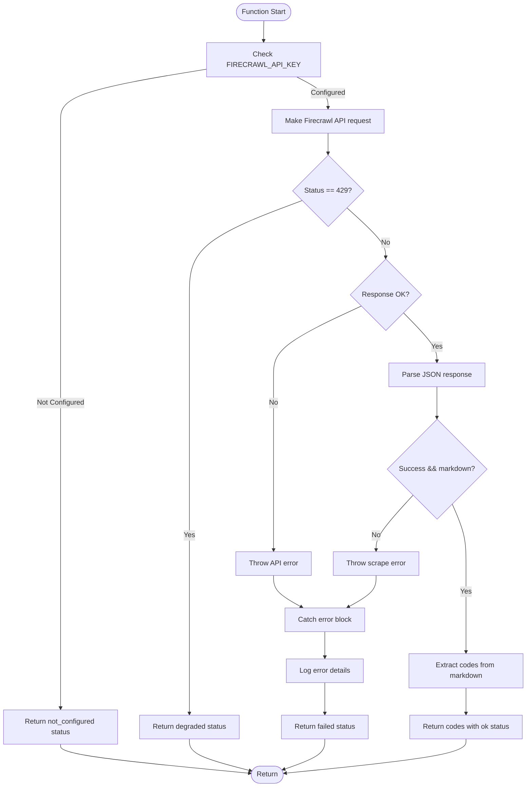

# Wiki Adapter

<cite>
**Referenced Files in This Document**   
- [wiki.ts](file://apps/web/lib/adapters/wiki.ts)
- [codes.ts](file://apps/web/lib/types/codes.ts)
- [ADAPTERS.md](file://apps/web/docs/codes/ADAPTERS.md)
- [refresh.ts](file://apps/web/lib/codes/refresh.ts)
- [cache.ts](file://apps/web/lib/codes/cache.ts)
</cite>

## Table of Contents
1. [Introduction](#introduction)
2. [HTTP Request Strategy](#http-request-strategy)
3. [Content Parsing and Code Extraction](#content-parsing-and-code-extraction)
4. [Change Detection and Caching](#change-detection-and-caching)
5. [Code Object Structure and Metadata](#code-object-structure-and-metadata)
6. [Error Handling and Degraded Operations](#error-handling-and-degraded-operations)
7. [Configuration and Environment Requirements](#configuration-and-environment-requirements)
8. [Integration with Aggregation System](#integration-with-aggregation-system)

## Introduction
The Wiki adapter is responsible for retrieving promotional codes from the official SuperSnail wiki at `supersnail.wiki.gg`. Unlike other sources that may use direct APIs, the wiki adapter employs a web scraping approach through the Firecrawl service to extract code listings from the wiki's markdown content. This adapter is considered a high-trust source due to the official nature of the wiki, and codes retrieved from it are automatically marked as verified. The adapter is designed to be resilient to rate limiting, network issues, and configuration errors, providing appropriate fallbacks and metadata about its operational status.

**Section sources**
- [wiki.ts](file://apps/web/lib/adapters/wiki.ts#L1-L167)
- [ADAPTERS.md](file://apps/web/docs/codes/ADAPTERS.md#L35-L52)

## HTTP Request Strategy
The Wiki adapter uses the Firecrawl API to perform web scraping operations, which acts as an intermediary to fetch and process the wiki page content. This approach offloads the complexity of direct browser automation and provides a clean, structured output. The adapter makes a POST request to the Firecrawl API endpoint with specific parameters to optimize the scraping process.

The request is configured to retrieve the page content in Markdown format, which simplifies parsing compared to raw HTML. The `onlyMainContent: true` option ensures that only the primary article content is extracted, filtering out navigation, sidebars, and other non-essential elements that could interfere with code detection. This targeted approach reduces data transfer and processing overhead.

Authentication is handled via a Bearer token using the `FIRECRAWL_API_KEY` environment variable. The adapter includes comprehensive error handling for various HTTP scenarios, including rate limiting (429 status) and other API errors. When rate-limited, the adapter gracefully degrades its operation rather than failing catastrophically, returning an appropriate status to the aggregation system.

**Diagram sources**
- [wiki.ts](file://apps/web/lib/adapters/wiki.ts#L104-L117)

**Section sources**
- [wiki.ts](file://apps/web/lib/adapters/wiki.ts#L104-L135)

## Content Parsing and Code Extraction
The content parsing process begins with the extraction of promotional codes from the Markdown content returned by Firecrawl. The adapter specifically targets table rows in the wiki page that follow the format `| CODE | Reward | Expires | Region |`, using a regular expression to identify valid code entries. The regex pattern `/\|\s*([A-Z0-9-]{4,})\s*\|/` matches table cells containing potential codes, requiring at least four characters to minimize false positives.

Once a code is identified, the entire table row is split by the pipe (`|`) character to extract the reward, expiration date, and region information. The expiration date string is processed through the `parseExpiry` function, which handles various edge cases such as "none", "-", or empty values by returning null. Valid date strings are converted to ISO 8601 format for consistent storage and comparison.

The parsing logic is designed to be forgiving of minor formatting variations in the wiki content while maintaining strict validation for the code format itself. Each extracted code is transformed into a structured `Code` object with standardized fields, including timestamps for first and last seen dates, source attribution, and tagging. The adapter assumes all wiki codes are verified due to the official nature of the source.

**Diagram sources**
- [wiki.ts](file://apps/web/lib/adapters/wiki.ts#L23-L62)

**Section sources**
- [wiki.ts](file://apps/web/lib/adapters/wiki.ts#L23-L62)
- [codes.ts](file://apps/web/lib/types/codes.ts#L17-L29)

## Change Detection and Caching
The Wiki adapter implements a multi-layered caching strategy to optimize performance and reduce unnecessary API calls to both Firecrawl and the wiki site. At the application level, the adapter leverages Next.js revalidation with a 900-second (15-minute) cache duration specified in the fetch options. This means that subsequent requests within this timeframe will be served from the cache without triggering a new scraping operation.

Beyond the HTTP-level caching, the adapter is integrated with the broader codes aggregation system's caching infrastructure. The refresh manager in the aggregation system implements a stale-while-revalidate pattern, allowing the system to serve potentially stale data while background refresh operations are in progress. This ensures that the user interface remains responsive even when the wiki data is being updated.

The adapter itself does not implement content-based change detection (such as hashing) within its core logic, as this functionality is handled at the aggregation layer. However, the metadata returned by the adapter includes timestamps and item counts that the aggregation system can use to detect changes and trigger appropriate actions. The combination of short-term caching and background refreshes provides a balance between data freshness and system performance.

**Section sources**
- [wiki.ts](file://apps/web/lib/adapters/wiki.ts#L116-L117)
- [refresh.ts](file://apps/web/lib/codes/refresh.ts#L1-L49)
- [cache.ts](file://apps/web/lib/codes/cache.ts)

## Code Object Structure and Metadata
Each promotional code extracted by the Wiki adapter is represented as a structured `Code` object with standardized properties defined in the system's type definitions. The core properties include the code itself (converted to uppercase), description (typically the reward), region (defaulting to "global" if not specified), and expiration date (parsed from the wiki content).

A key feature of the code object is its `sources` array, which tracks the provenance of each code. For wiki-extracted codes, this array contains a single entry with the site set to "wiki", the URL pointing to the main codes page, a confidence (trust) weight of 1.0 (the maximum), and a timestamp of when the code was fetched. This provenance tracking enables the aggregation system to assess the reliability of codes based on their sources.

The adapter marks all wiki-extracted codes as `verified: true` due to the official nature of the source. Additionally, codes are tagged with "wiki" and "official" tags, which can be used for filtering and display purposes in the user interface. The `first_seen_at` and `last_seen_at` timestamps are both set to the current time when the code is first extracted, with the aggregation system responsible for updating the `last_seen_at` field in subsequent refreshes if the code persists.

**Section sources**
- [wiki.ts](file://apps/web/lib/adapters/wiki.ts#L39-L58)
- [codes.ts](file://apps/web/lib/types/codes.ts#L17-L29)

## Error Handling and Degraded Operations
The Wiki adapter includes comprehensive error handling to maintain system stability in the face of various failure modes. The primary error scenarios include missing configuration, rate limiting, API errors, and content parsing failures.

When the `FIRECRAWL_API_KEY` environment variable is not configured, the adapter immediately returns a response with an empty codes array and a "not_configured" status, along with an appropriate error message. This prevents unnecessary API calls and provides clear feedback to the system operator.

For rate limiting (HTTP 429), the adapter returns a "degraded" status rather than "failed", indicating that the service is temporarily unavailable but may recover. This distinction allows the aggregation system to prioritize other sources while continuing to attempt wiki updates.

All other errors, including network issues and API failures, are caught and result in a "failed" status. The original error message is preserved in the metadata for diagnostic purposes. In all error cases, the adapter returns an empty codes array to prevent partial or corrupted data from entering the system.

**Diagram sources**
- [wiki.ts](file://apps/web/lib/adapters/wiki.ts#L90-L166)

**Section sources**
- [wiki.ts](file://apps/web/lib/adapters/wiki.ts#L90-L166)

## Configuration and Environment Requirements
The Wiki adapter requires a single environment variable to function: `FIRECRAWL_API_KEY`. This API key authenticates the adapter with the Firecrawl service, enabling it to perform web scraping operations. Without this key, the adapter will operate in a "not_configured" state, returning no codes and indicating the missing configuration in its metadata.

The target wiki URL is hardcoded in the adapter as a constant (`WIKI_URL = "https://supersnail.wiki.gg/wiki/Snail_codes"`), reflecting the stable nature of the official codes page. This eliminates the need for additional configuration but means that any changes to the wiki's URL structure would require a code update.

The adapter's caching behavior is configured through the Next.js `revalidate` option in the fetch request, set to 900 seconds (15 minutes). This value is hardcoded and not configurable through environment variables, representing a balance between data freshness and API usage.

**Section sources**
- [wiki.ts](file://apps/web/lib/adapters/wiki.ts#L8-L9)
- [wiki.ts](file://apps/web/lib/adapters/wiki.ts#L116-L117)
- [ADAPTERS.md](file://apps/web/docs/codes/ADAPTERS.md#L41-L42)

## Integration with Aggregation System
The Wiki adapter integrates seamlessly with the broader codes aggregation system through a standardized interface. It exports a single function, `fetchWikiCodes`, which returns a promise resolving to an object containing both the extracted codes and metadata about the fetch operation.

The metadata includes the source name ("wiki"), operational status ("ok", "degraded", "failed", or "not_configured"), timestamp of the last fetch, item count, and any error messages. This metadata is crucial for the aggregation system to assess the health and reliability of the wiki source and to provide diagnostic information to system operators.

The adapter's output format aligns with the `AggregationResult` interface expected by the aggregation system, allowing it to be combined with codes from other sources such as Discord, Reddit, and Snelp. The aggregation system applies deduplication logic, with wiki-sourced codes taking precedence due to their high trust weight, ensuring that official codes override potentially conflicting information from less reliable sources.

**Section sources**
- [wiki.ts](file://apps/web/lib/adapters/wiki.ts#L84-L87)
- [codes.ts](file://apps/web/lib/types/codes.ts#L31-L38)
- [codes-aggregator.ts](file://apps/web/lib/codes-aggregator.ts)