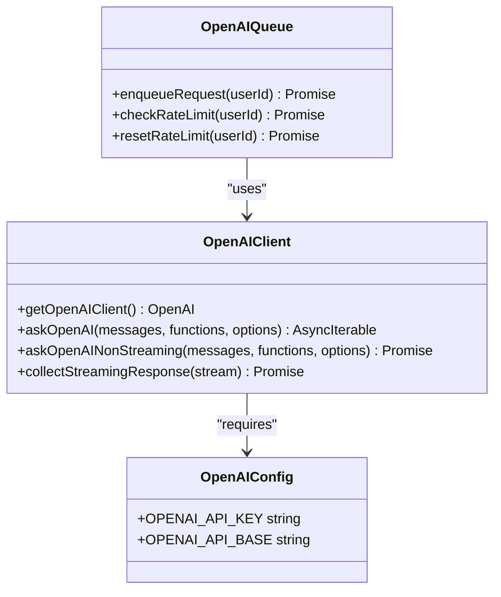
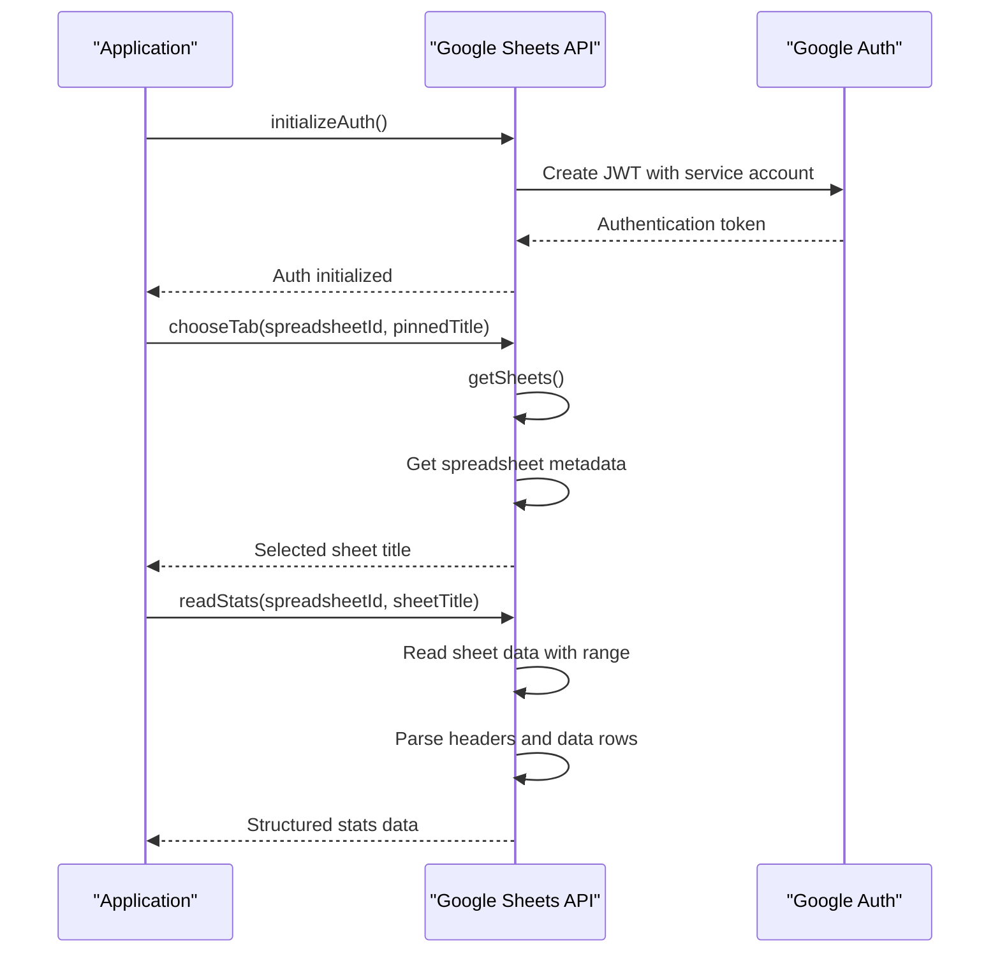
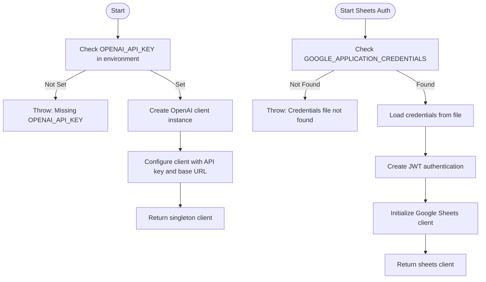
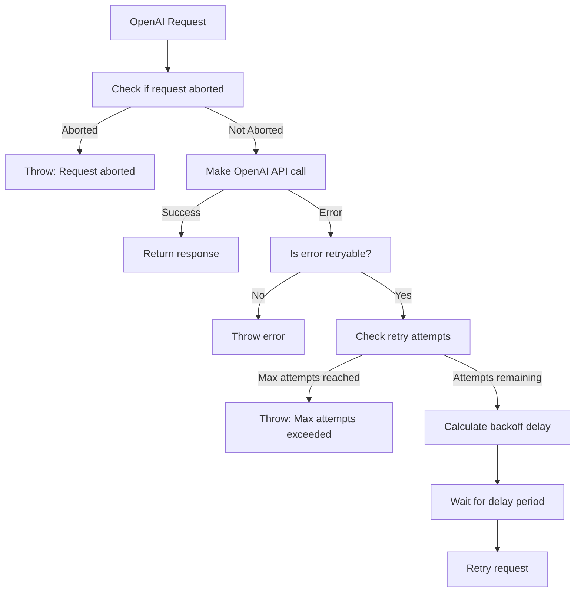
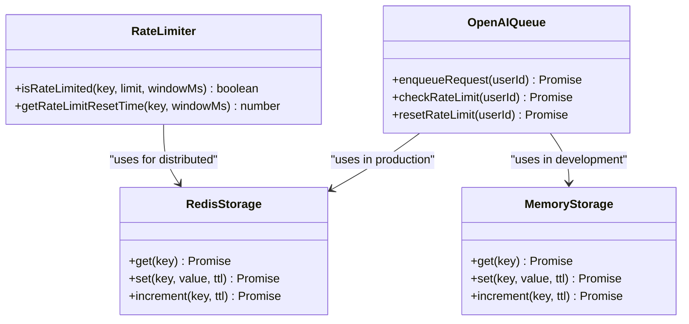

# External APIs

<cite>
**Referenced Files in This Document**   
- [client.js](file://lib/openai/client.js)
- [queue.js](file://lib/openai/queue.js)
- [openai-client.ts](file://apps/web/lib/openai-client.ts)
- [sheets.js](file://apps/admin-api/lib/sheets.js)
- [env.js](file://apps/web/lib/env.js)
- [env.ts](file://apps/web/lib/env.ts)
- [api-client.ts](file://apps/web/lib/api-client.ts)
- [api-error-handler.ts](file://apps/web/lib/api-error-handler.ts)
- [openai.ts](file://apps/web/lib/chat/openai.ts)
- [rate-limiter.ts](file://apps/web/lib/rate-limiter.ts)
</cite>

## Table of Contents
1. [Introduction](#introduction)
2. [OpenAI API Integration](#openai-api-integration)
3. [Google Sheets API Integration](#google-sheets-api-integration)
4. [Configuration and Authentication](#configuration-and-authentication)
5. [Error Handling and Recovery](#error-handling-and-recovery)
6. [Rate Limiting and Performance](#rate-limiting-and-performance)
7. [Security Considerations](#security-considerations)
8. [Code Examples](#code-examples)
9. [Conclusion](#conclusion)

## Introduction
This document provides comprehensive documentation for external API integrations in the slimy-monorepo platform. It details the implementation and usage patterns for two critical external services: OpenAI API for AI-powered chat functionality and Google Sheets API for data ingestion from spreadsheets. The documentation covers configuration requirements, authentication mechanisms, error handling strategies, rate limiting considerations, and security best practices. The goal is to provide developers with a complete understanding of how to work with these external APIs within the platform's architecture.

## OpenAI API Integration

The OpenAI API integration in the slimy-monorepo platform provides robust support for both streaming and non-streaming chat completions, with comprehensive retry logic, error handling, and function calling capabilities. The integration is designed to handle real-time interactions while maintaining reliability under various network conditions.

The core functionality is implemented in the `lib/openai/client.js` file, which provides a singleton client instance with built-in retry mechanisms using exponential backoff. The client supports both streaming and non-streaming request methods, allowing for real-time response generation in chat interfaces as well as traditional request-response patterns for batch processing.



**Diagram sources**
- [client.js](file://lib/openai/client.js#L1-L215)
- [queue.js](file://lib/openai/queue.js#L1-L301)

**Section sources**
- [client.js](file://lib/openai/client.js#L1-L215)
- [openai-client.ts](file://apps/web/lib/openai-client.ts#L1-L62)

## Google Sheets API Integration

The Google Sheets API integration enables the platform to read data from Google Spreadsheets, primarily for retrieving stats and member information. The integration uses service account authentication and provides functionality for selecting specific sheet tabs and parsing tabular data into structured formats.

The implementation in `apps/admin-api/lib/sheets.js` provides a clean interface for interacting with Google Sheets, including functions to initialize authentication, choose specific tabs within a spreadsheet, and read data in a structured format. The integration is designed to be resilient to common issues such as missing spreadsheets, empty sheets, or authentication failures.



**Diagram sources**
- [sheets.js](file://apps/admin-api/lib/sheets.js#L1-L176)

**Section sources**
- [sheets.js](file://apps/admin-api/lib/sheets.js#L1-L176)

## Configuration and Authentication

### OpenAI Configuration
The OpenAI API integration requires specific environment variables to be configured for authentication and operational parameters. These are validated through the environment configuration system in `apps/web/lib/env.ts`.

The primary configuration requirements are:
- **OPENAI_API_KEY**: Required API key for authenticating with the OpenAI service. This should be a valid key starting with "sk-".
- **OPENAI_API_BASE**: Optional base URL for the OpenAI API endpoint, defaulting to "https://api.openai.com/v1" if not specified.

The configuration is validated at runtime, and the system provides helper functions to check if OpenAI is properly configured before attempting API calls.

### Google Sheets Authentication
The Google Sheets API integration uses service account authentication, which is more secure than user-based authentication for server-side applications. The authentication mechanism is implemented in `apps/admin-api/lib/sheets.js`.

Key configuration elements:
- **GOOGLE_APPLICATION_CREDENTIALS**: Environment variable specifying the path to the service account JSON credentials file. Defaults to '/app/google-service-account.json' if not set.
- The service account must have read-only access to the target spreadsheets, with the scope 'https://www.googleapis.com/auth/spreadsheets.readonly'.

The authentication flow initializes a JWT client using the service account credentials and caches the authentication client for reuse across requests to minimize overhead.



**Diagram sources**
- [env.ts](file://apps/web/lib/env.ts#L1-L220)
- [sheets.js](file://apps/admin-api/lib/sheets.js#L1-L176)

**Section sources**
- [env.ts](file://apps/web/lib/env.ts#L1-L220)
- [sheets.js](file://apps/admin-api/lib/sheets.js#L1-L176)

## Error Handling and Recovery

The external API integrations implement comprehensive error handling strategies to ensure system resilience and provide meaningful feedback when issues occur.

### OpenAI Error Handling
The OpenAI client implements sophisticated error handling with retry logic for transient failures. The retry mechanism uses exponential backoff with jitter to prevent thundering herd problems during service outages.

Key aspects of the error handling:
- **Retryable errors**: Network errors (ECONNRESET, ETIMEDOUT), rate limits (429), timeouts (408), and server errors (500+)
- **Exponential backoff**: Base delay of 1000ms, doubling with each attempt, with random jitter added
- **Maximum retries**: Configurable, defaulting to 3 attempts
- **Maximum delay**: Capped at 10 seconds to prevent excessively long waits

The error handling is implemented in the `askOpenAI` and `askOpenAINonStreaming` functions in `lib/openai/client.js`, which wrap the underlying OpenAI client calls with retry logic.

### Google Sheets Error Handling
The Google Sheets integration includes specific error handling for common issues encountered when working with spreadsheets:
- **Missing credentials file**: Validates the existence of the service account JSON file
- **Empty spreadsheets**: Returns structured empty data rather than throwing errors
- **Missing sheet tabs**: Falls back to the first available tab if the pinned title is not found
- **Authentication failures**: Provides detailed error logging for troubleshooting

The error handling is designed to be graceful, allowing the application to continue functioning even when spreadsheet data is temporarily unavailable.



**Diagram sources**
- [client.js](file://lib/openai/client.js#L1-L215)
- [sheets.js](file://apps/admin-api/lib/sheets.js#L1-L176)

**Section sources**
- [client.js](file://lib/openai/client.js#L1-L215)
- [sheets.js](file://apps/admin-api/lib/sheets.js#L1-L176)

## Rate Limiting and Performance

The platform implements rate limiting at multiple levels to protect both external APIs and internal resources.

### OpenAI Rate Limiting
The OpenAI integration includes a sophisticated rate limiting system implemented in `lib/openai/queue.js`. This system provides per-user rate limiting to prevent abuse and ensure fair usage of API resources.

Key features:
- **Default limits**: 10 requests per minute per user
- **Storage backends**: Uses Redis in production, falls back to in-memory storage in development
- **Sliding window algorithm**: Tracks request counts within a configurable time window
- **Rate limit status**: Provides information on remaining requests and reset time

The rate limiting is implemented as a queue system that checks the rate limit status before allowing requests to proceed to the OpenAI API.

### Performance Optimization
Several performance optimization strategies are employed:

**Caching**: The platform uses Redis for distributed caching of frequently accessed data, reducing the need for repeated API calls.

**Request Batching**: While not explicitly implemented in the core API clients, the architecture supports batching through the use of message queues and background processing.

**Connection Reuse**: Both API clients implement singleton patterns to reuse connections and authentication tokens, minimizing overhead.

**Streaming**: The OpenAI integration supports streaming responses, allowing for real-time display of AI-generated content without waiting for complete responses.



**Diagram sources**
- [queue.js](file://lib/openai/queue.js#L1-L301)
- [rate-limiter.ts](file://apps/web/lib/rate-limiter.ts#L1-L90)

**Section sources**
- [queue.js](file://lib/openai/queue.js#L1-L301)
- [rate-limiter.ts](file://apps/web/lib/rate-limiter.ts#L1-L90)

## Security Considerations

The external API integrations incorporate several security measures to protect sensitive data and credentials.

### API Key Management
- **Environment variables**: API keys are stored in environment variables rather than code
- **Validation**: The system validates that API keys are present and properly formatted
- **Access control**: Environment variables are restricted to authorized services and personnel

### Data Privacy
- **Minimal data exposure**: The Google Sheets integration only requests read-only access to spreadsheets
- **Service accounts**: Uses service account authentication rather than user credentials
- **Secure storage**: Credentials files are stored securely and referenced via environment variables

### Error Handling Security
- **Error sanitization**: Error messages are sanitized to prevent leakage of sensitive information
- **Structured error responses**: Errors are returned in a consistent format that doesn't expose internal implementation details
- **Comprehensive logging**: Errors are logged with context for debugging while avoiding sensitive data exposure

The security configuration is validated through the environment validation system, which checks for proper configuration of security-related environment variables and provides warnings for potential issues.

**Section sources**
- [env.ts](file://apps/web/lib/env.ts#L1-L220)
- [client.js](file://lib/openai/client.js#L1-L215)
- [sheets.js](file://apps/admin-api/lib/sheets.js#L1-L176)

## Code Examples

This section provides practical examples of how to use the external API integrations in the slimy-monorepo platform.

### OpenAI Integration Examples

**Initializing the OpenAI client:**
```typescript
import { getOpenAIClient } from '@/lib/openai-client';

// The client is automatically initialized with credentials from environment variables
const openai = getOpenAIClient();
```

**Making a non-streaming request:**
```typescript
import { createChatCompletion } from '@/lib/openai-client';

const response = await createChatCompletion([
  { role: 'system', content: 'You are a helpful assistant.' },
  { role: 'user', content: 'Hello!' }
], {
  model: 'gpt-4',
  temperature: 0.7,
  maxTokens: 1000
});
```

**Making a streaming request:**
```typescript
import { createStreamingChatCompletion } from '@/lib/openai-client';

const stream = await createStreamingChatCompletion([
  { role: 'system', content: 'You are a helpful assistant.' },
  { role: 'user', content: 'Tell me about AI.' }
], {
  model: 'gpt-4',
  temperature: 0.7,
  maxTokens: 1000
});

// Process streaming chunks
for await (const chunk of stream) {
  const content = chunk.choices[0]?.delta?.content;
  if (content) {
    process.stdout.write(content);
  }
}
```

### Google Sheets Integration Examples

**Reading data from a spreadsheet:**
```javascript
const { chooseTab, readStats } = require('./sheets');

// Choose the appropriate tab
const sheetTitle = await chooseTab('spreadsheet-id-123', 'October Stats');

// Read the data
const statsData = await readStats('spreadsheet-id-123', sheetTitle);
console.log(`Read ${statsData.members.length} members from ${statsData.title}`);
```

**Handling the response:**
```javascript
// The response includes structured data
{
  title: "October Stats",
  count: 150,
  totalSim: 45000,
  totalPower: 75000,
  members: [
    {
      name: "Alice",
      count: 10,
      sim: 300,
      power: 500
    },
    // ... more members
  ]
}
```

**Section sources**
- [openai-client.ts](file://apps/web/lib/openai-client.ts#L1-L62)
- [openai.ts](file://apps/web/lib/chat/openai.ts#L1-L133)
- [sheets.js](file://apps/admin-api/lib/sheets.js#L1-L176)

## Conclusion
The external API integrations in the slimy-monorepo platform provide robust, secure, and performant access to critical third-party services. The OpenAI integration offers both streaming and non-streaming capabilities with comprehensive retry logic and error handling, while the Google Sheets integration enables reliable data ingestion from spreadsheets using service account authentication.

Key strengths of the implementation include:
- **Resilience**: Comprehensive error handling and retry mechanisms ensure reliability
- **Security**: Proper credential management and access controls protect sensitive data
- **Performance**: Rate limiting, caching, and connection reuse optimize resource usage
- **Maintainability**: Clean, well-documented code with clear separation of concerns

Developers working with these integrations should ensure proper configuration of environment variables, handle errors gracefully, and respect rate limits to maintain system stability and provide a good user experience.