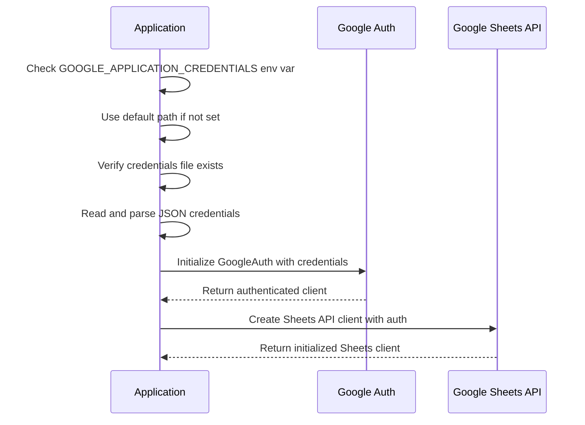
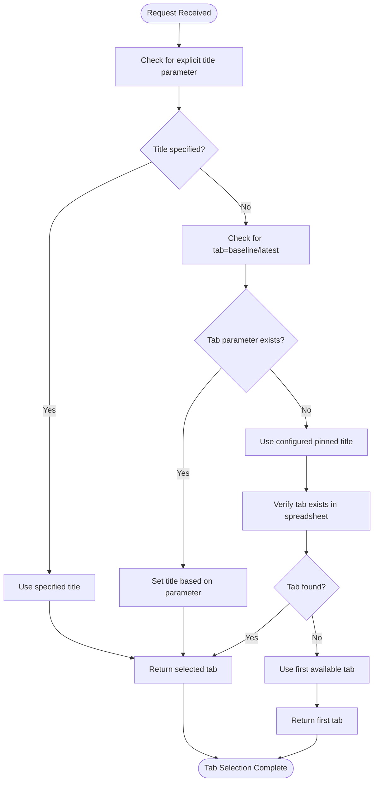
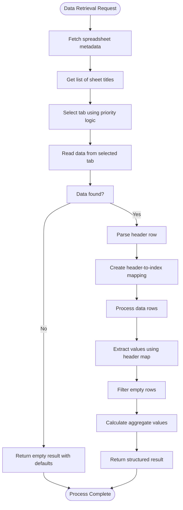
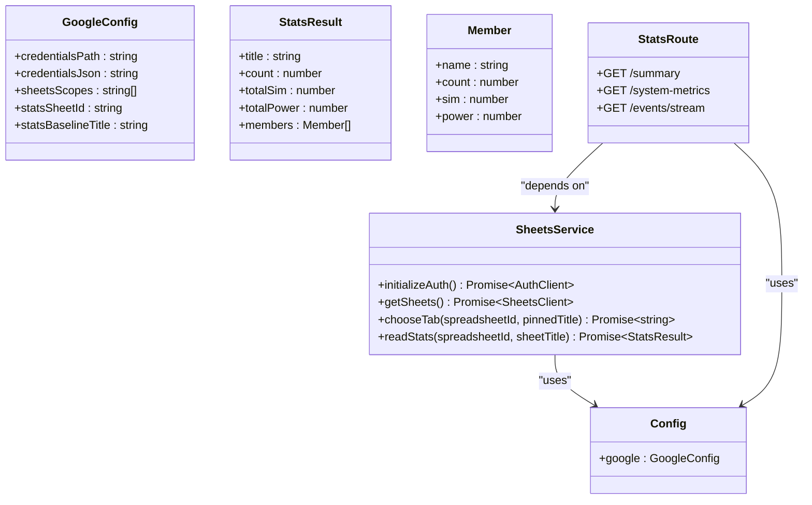
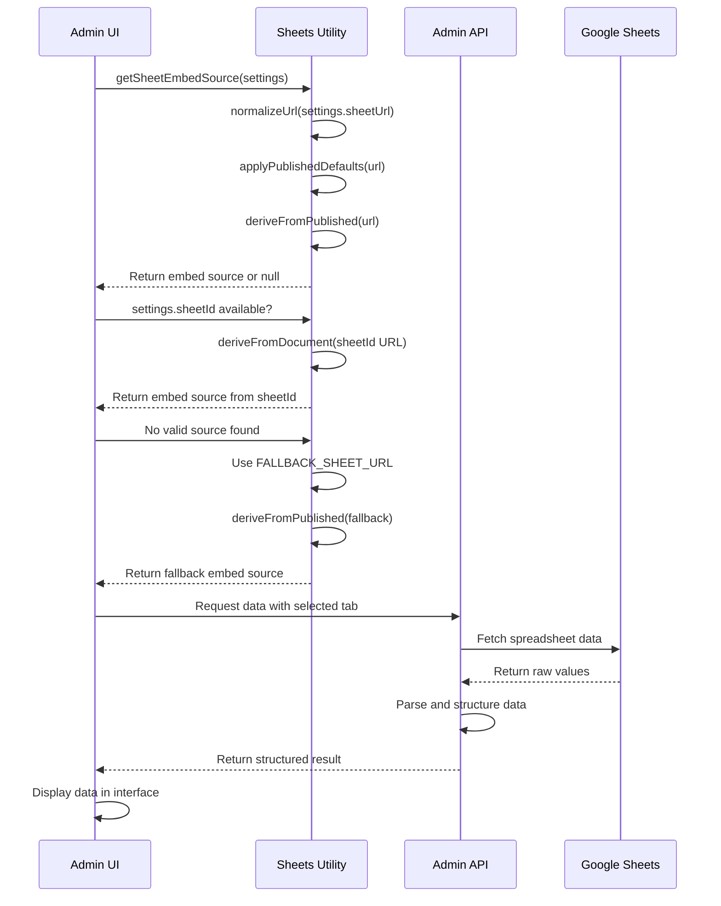

# Google Sheets Integration

<cite>
**Referenced Files in This Document**   
- [sheets.js](file://apps/admin-api/lib/sheets.js)
- [config/index.js](file://apps/admin-api/src/lib/config/index.js)
- [stats.js](file://apps/admin-api/src/routes/stats.js)
- [sheets.js](file://apps/admin-ui/lib/sheets.js)
- [api.js](file://apps/admin-ui/lib/api.js)
- [club-sheets.js](file://apps/admin-api/lib/club-sheets.js)
- [sheet-smoke.js](file://apps/admin-api/scripts/sheet-smoke.js)
</cite>

## Table of Contents
1. [Introduction](#introduction)
2. [Authentication Mechanism](#authentication-mechanism)
3. [Sheet Tab Selection Logic](#sheet-tab-selection-logic)
4. [Data Retrieval Process](#data-retrieval-process)
5. [Backend Implementation](#backend-implementation)
6. [Frontend Implementation](#frontend-implementation)
7. [Configuration Examples](#configuration-examples)
8. [Security Considerations](#security-considerations)
9. [Troubleshooting Guide](#troubleshooting-guide)
10. [Conclusion](#conclusion)

## Introduction
The Google Sheets integration in the slimy-monorepo platform enables seamless data exchange between Google Sheets and the application's backend services. This integration supports both data retrieval for analytics and display purposes, with implementations in both the admin-api backend and admin-ui frontend components. The system uses service account authentication, implements intelligent tab selection logic, and provides robust error handling for various failure scenarios.

## Authentication Mechanism

The Google Sheets API integration uses service account authentication through the Google Cloud Platform. The authentication process is initialized using the `GOOGLE_APPLICATION_CREDENTIALS` environment variable, which points to a JSON key file containing the service account credentials.

The authentication flow follows these steps:
1. Check for the `GOOGLE_APPLICATION_CREDENTIALS` environment variable
2. If not set, fall back to a default path (`/app/google-service-account.json`)
3. Validate the existence of the credentials file
4. Load and parse the JSON credentials
5. Initialize Google Auth with the specified scopes

The system is configured to use read-only access to spreadsheets through the scope `https://www.googleapis.com/auth/spreadsheets.readonly`, ensuring the service account can only read data and cannot modify spreadsheets.



**Diagram sources**
- [sheets.js](file://apps/admin-api/lib/sheets.js#L15-L44)
- [config/index.js](file://apps/admin-api/src/lib/config/index.js#L199-L202)

**Section sources**
- [sheets.js](file://apps/admin-api/lib/sheets.js#L15-L44)
- [config/index.js](file://apps/admin-api/src/lib/config/index.js#L199-L202)

## Sheet Tab Selection Logic

The tab selection logic implements a prioritized approach to determine which sheet tab to use when retrieving data from a spreadsheet. The system first attempts to use a pinned title, falling back to the first available tab if the pinned title is not found.

The selection algorithm follows this priority order:
1. Check for an explicitly specified title in the request
2. Look for a "baseline" or "latest" parameter in the query
3. Use the configured pinned title (from `STATS_BASELINE_TITLE`)
4. Fall back to the first available sheet tab

This logic ensures consistent data retrieval while allowing flexibility for different use cases and user preferences.



**Diagram sources**
- [sheets.js](file://apps/admin-api/lib/sheets.js#L68-L90)
- [stats.js](file://apps/admin-api/src/routes/stats.js#L20-L28)

**Section sources**
- [sheets.js](file://apps/admin-api/lib/sheets.js#L68-L90)
- [stats.js](file://apps/admin-api/src/routes/stats.js#L20-L28)

## Data Retrieval Process

The data retrieval process from Google Sheets involves multiple steps to fetch, parse, and structure spreadsheet data for application use. The process begins with metadata fetching to enumerate available sheets, followed by data extraction from the selected tab.

The retrieval workflow includes:
1. Fetching spreadsheet metadata to identify available sheets
2. Selecting the appropriate sheet tab based on the selection logic
3. Reading cell values from the selected range
4. Parsing headers and mapping column names
5. Converting rows to structured objects
6. Calculating aggregate values
7. Returning structured data with metadata

The system expects the first row to contain headers and subsequent rows to contain data. It handles empty spreadsheets gracefully by returning default values.



**Diagram sources**
- [sheets.js](file://apps/admin-api/lib/sheets.js#L108-L173)
- [stats.js](file://apps/admin-api/src/routes/stats.js#L35)

**Section sources**
- [sheets.js](file://apps/admin-api/lib/sheets.js#L108-L173)

## Backend Implementation

The backend implementation of the Google Sheets integration is centered in the admin-api service, which handles authentication, data retrieval, and API exposure. The core functionality is implemented in the `sheets.js` utility module, which provides methods for authentication initialization, tab selection, and data reading.

Key backend components include:
- Authentication initialization using service account credentials
- Spreadsheet metadata fetching to enumerate sheets
- Tab selection with fallback logic
- Data parsing and structuring
- Error handling for various failure scenarios
- Caching of results to improve performance

The integration is exposed through API endpoints that allow clients to retrieve spreadsheet data with various query parameters to control the selection of data.



**Diagram sources**
- [sheets.js](file://apps/admin-api/lib/sheets.js#L1-L176)
- [config/index.js](file://apps/admin-api/src/lib/config/index.js#L198-L205)
- [stats.js](file://apps/admin-api/src/routes/stats.js#L1-L87)

**Section sources**
- [sheets.js](file://apps/admin-api/lib/sheets.js#L1-L176)
- [config/index.js](file://apps/admin-api/src/lib/config/index.js#L198-L205)
- [stats.js](file://apps/admin-api/src/routes/stats.js#L1-L87)

## Frontend Implementation

The frontend implementation in the admin-ui application handles the display of Google Sheets data and the generation of embed sources for published sheets. The implementation focuses on creating embeddable content with appropriate parameters for seamless integration.

Key frontend features include:
- URL normalization and validation
- Embed source derivation for published sheets
- Fallback mechanisms for missing or invalid URLs
- Parameter injection for widget display
- Client-side error handling

The system generates embed sources with specific parameters to ensure proper display, including widget mode, hidden headers, and single tab view.



**Diagram sources**
- [sheets.js](file://apps/admin-ui/lib/sheets.js#L1-L72)
- [api.js](file://apps/admin-ui/lib/api.js#L24-L59)

**Section sources**
- [sheets.js](file://apps/admin-ui/lib/sheets.js#L1-L72)
- [api.js](file://apps/admin-ui/lib/api.js#L24-L59)

## Configuration Examples

The Google Sheets integration requires specific environment variables to be configured for proper operation. These configurations control authentication, sheet access, and default behaviors.

### Required Environment Variables
| Environment Variable | Description | Example Value |
|----------------------|-------------|---------------|
| GOOGLE_APPLICATION_CREDENTIALS | Path to service account JSON key file | /app/google-service-account.json |
| STATS_SHEET_ID | ID of the Google Sheets spreadsheet | 1aBcDeFgHiJkLmNoPqRsTuVwXyZ |
| STATS_BASELINE_TITLE | Default/pinned sheet tab title | Baseline (10-24-25) |

### Example Configuration
```env
# Google Sheets Configuration
GOOGLE_APPLICATION_CREDENTIALS=/app/google-service-account.json
STATS_SHEET_ID=1aBcDeFgHiJkLmNoPqRsTuVwXyZ
STATS_BASELINE_TITLE=Baseline (10-24-25)

# Service Account Key (alternative to file path)
GOOGLE_APPLICATION_CREDENTIALS_JSON={"type":"service_account",...}
```

### API Usage Examples
```javascript
// Retrieve stats with default tab
GET /api/stats/summary

// Retrieve stats with specific tab
GET /api/stats/summary?title=October%20Results

// Retrieve stats with baseline tab
GET /api/stats/summary?tab=baseline

// Retrieve stats with latest tab
GET /api/stats/summary?tab=latest
```

**Section sources**
- [config/index.js](file://apps/admin-api/src/lib/config/index.js#L198-L205)
- [stats.js](file://apps/admin-api/src/routes/stats.js#L11-L12)

## Security Considerations

The Google Sheets integration incorporates several security measures to protect service account credentials and ensure proper access control.

### Service Account Key Storage
- Store JSON key files outside the application repository
- Use environment variables to specify the key file path
- Restrict file permissions to readable only by the application user
- Rotate keys periodically and revoke unused keys
- Use the principle of least privilege when configuring service account permissions

### Access Control
- Grant the service account only "Viewer" access to required spreadsheets
- Avoid using personal Google accounts for service integration
- Regularly audit spreadsheet sharing permissions
- Monitor access logs for unusual activity
- Implement IP restrictions when possible

### Environment Configuration
- Never commit service account keys to version control
- Use separate service accounts for different environments (development, staging, production)
- Validate that credentials are not exposed in client-side code
- Use secret management tools in production environments

### Sharing Permissions
- Share spreadsheets with the service account email address, not with "Anyone with the link"
- Use specific file sharing rather than folder-level sharing
- Regularly review and clean up sharing permissions
- Set expiration dates on sharing links when appropriate
- Monitor for unauthorized sharing changes

**Section sources**
- [sheets.js](file://apps/admin-api/lib/sheets.js#L20-L35)
- [config/index.js](file://apps/admin-api/src/lib/config/index.js#L199-L202)

## Troubleshooting Guide

This section addresses common issues encountered with the Google Sheets integration and provides solutions for resolution.

### Invalid URLs
**Symptoms**: URL normalization fails, embed sources not generated
**Causes**: Malformed URLs, missing protocol, incorrect format
**Solutions**:
- Ensure URLs start with `https://docs.google.com/spreadsheets/d/`
- Use the full edit URL or published URL format
- Verify the URL contains a valid spreadsheet ID
- Test URL validity by opening in a browser

### Missing Permissions
**Symptoms**: Authentication errors, access denied messages
**Causes**: Service account not granted access, insufficient permissions
**Solutions**:
- Verify the spreadsheet is shared with the service account email
- Ensure the service account has "Viewer" or higher permissions
- Check that the sharing is not restricted by organizational policies
- Validate that the service account key has the required scopes

### Sheet Not Found Errors
**Symptoms**: 404 responses, "no tabs found" messages
**Causes**: Incorrect spreadsheet ID, no accessible tabs, deleted sheets
**Solutions**:
- Verify the STATS_SHEET_ID environment variable
- Check that the spreadsheet exists and is accessible
- Confirm that the spreadsheet contains at least one visible tab
- Validate that the service account has permission to view the spreadsheet

### Authentication Failures
**Symptoms**: "credentials file not found", authentication initialization errors
**Causes**: Missing key file, incorrect path, invalid JSON
**Solutions**:
- Verify the GOOGLE_APPLICATION_CREDENTIALS path is correct
- Ensure the key file exists at the specified location
- Validate the JSON format of the key file
- Check file permissions allow reading by the application

### Data Retrieval Issues
**Symptoms**: Empty results, parsing errors, missing data
**Causes**: Incorrect header mapping, empty spreadsheets, format changes
**Solutions**:
- Verify the first row contains expected headers (name, count, sim, power)
- Check that data rows are properly formatted
- Ensure there are no empty rows between header and data
- Validate that the expected sheet tab exists with the correct title

**Section sources**
- [sheets.js](file://apps/admin-api/lib/sheets.js#L24-L26)
- [sheets.js](file://apps/admin-api/lib/sheets.js#L91-L93)
- [sheets.js](file://apps/admin-api/lib/sheets.js#L121-L123)
- [sheets.js](file://apps/admin-api/lib/sheets.js#L166-L171)

## Conclusion

The Google Sheets integration in the slimy-monorepo platform provides a robust mechanism for retrieving and displaying spreadsheet data across both backend and frontend components. The implementation leverages service account authentication for secure access, implements intelligent tab selection logic with fallback mechanisms, and provides comprehensive error handling for various failure scenarios.

Key strengths of the integration include:
- Secure authentication using service account credentials
- Flexible tab selection with pinned title prioritization
- Graceful handling of missing data and errors
- Consistent data parsing and structuring
- Proper separation of concerns between backend and frontend

The system is designed to be reliable and maintainable, with clear configuration requirements and comprehensive troubleshooting guidance. By following the security best practices outlined in this documentation, administrators can ensure the integration remains secure while providing valuable data access capabilities.