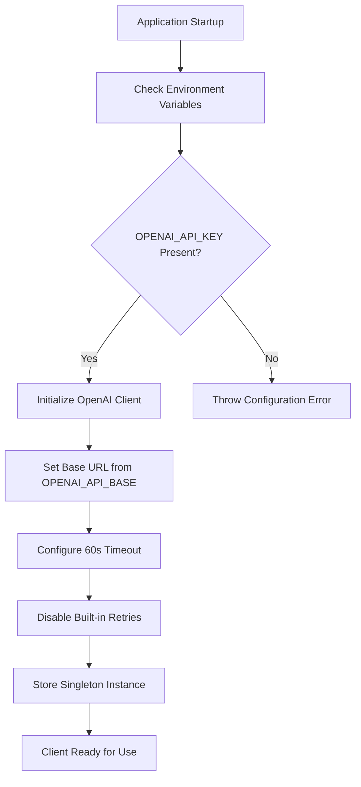
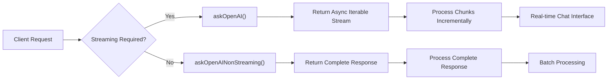
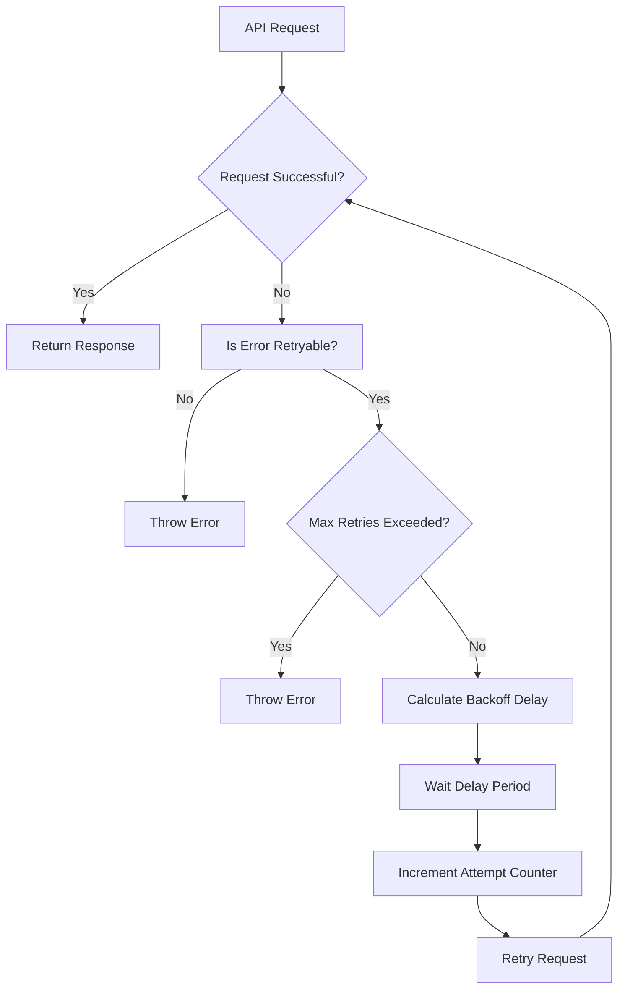
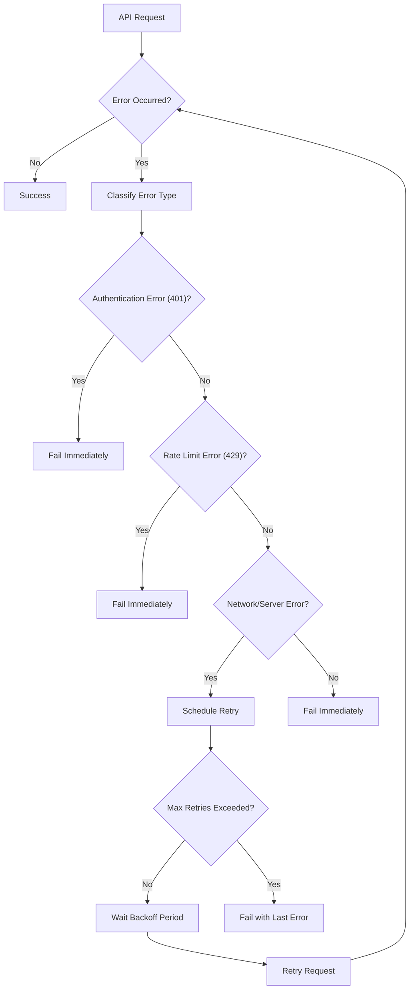
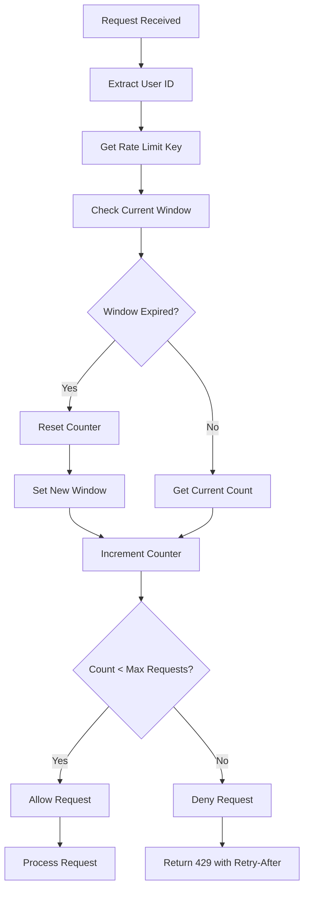
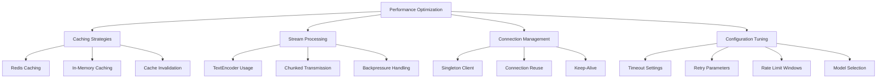

# OpenAI Integration

<cite>
**Referenced Files in This Document**   
- [client.js](file://lib/openai/client.js)
- [queue.js](file://lib/openai/queue.js)
- [openai-client.ts](file://apps/web/lib/openai-client.ts)
- [env.ts](file://apps/web/lib/env.ts)
- [redis-client.js](file://apps/web/lib/cache/redis-client.js)
- [route.ts](file://apps/web/app/api/chat/message/route.ts)
- [openai.ts](file://apps/web/lib/chat/openai.ts)
- [personality-modes.ts](file://apps/web/lib/personality-modes.ts)
</cite>

## Table of Contents
1. [Introduction](#introduction)
2. [Client Initialization and Configuration](#client-initialization-and-configuration)
3. [Streaming and Non-Streaming Methods](#streaming-and-non-streaming-methods)
4. [Function Calling Support](#function-calling-support)
5. [Retry Logic with Exponential Backoff](#retry-logic-with-exponential-backoff)
6. [Singleton Client Pattern](#singleton-client-pattern)
7. [Error Handling Strategies](#error-handling-strategies)
8. [Rate Limiting and Queue Management](#rate-limiting-and-queue-management)
9. [Security Considerations](#security-considerations)
10. [Performance Optimization](#performance-optimization)
11. [Code Examples](#code-examples)
12. [Conclusion](#conclusion)

## Introduction

The OpenAI integration in the slimy-monorepo platform provides a robust interface for interacting with OpenAI's chat completion API. This documentation covers the implementation details of both streaming and non-streaming chat completion methods, including function calling support, retry logic with exponential backoff, and comprehensive error handling. The system uses a singleton client pattern for connection reuse, supports configuration via environment variables, and implements sophisticated rate limiting and caching strategies to ensure reliability and performance.

The integration is designed to support real-time chat interfaces with efficient stream processing, while also providing non-streaming methods for simpler use cases. It includes comprehensive error handling for authentication (401) and rate limiting (429) errors, with specific retry avoidance for these cases. The system also addresses security considerations for API key management and data privacy, and provides performance optimization tips for production deployment.

**Section sources**
- [client.js](file://lib/openai/client.js#L1-L215)
- [openai-client.ts](file://apps/web/lib/openai-client.ts#L1-L61)

## Client Initialization and Configuration

The OpenAI client is configured through environment variables and provides sensible defaults for production use. The primary configuration options are:

- **OPENAI_API_KEY**: Required API key for authentication with OpenAI services
- **OPENAI_API_BASE**: Optional base URL for the OpenAI API (defaults to https://api.openai.com/v1)
- **Timeout**: 60-second timeout for API requests
- **Retry Configuration**: Max retries set to 3 with exponential backoff

The client initialization follows a singleton pattern, ensuring that only one instance of the OpenAI client is created and reused throughout the application lifecycle. This approach conserves resources and maintains consistent connection state.

Configuration validation occurs at runtime, with the system checking for the presence of required environment variables. The `hasOpenAI()` helper function provides a convenient way to check if OpenAI is properly configured before making requests.



**Diagram sources**
- [client.js](file://lib/openai/client.js#L28-L45)
- [env.ts](file://apps/web/lib/env.ts#L23-L25)
- [openai-client.ts](file://apps/web/lib/openai-client.ts#L5-L15)

**Section sources**
- [client.js](file://lib/openai/client.js#L28-L45)
- [env.ts](file://apps/web/lib/env.ts#L23-L25)
- [openai-client.ts](file://apps/web/lib/openai-client.ts#L5-L15)

## Streaming and Non-Streaming Methods

The OpenAI integration provides two primary methods for chat completion: streaming and non-streaming. These methods cater to different use cases and performance requirements.

### Streaming Method

The streaming method (`askOpenAI`) enables real-time responses by returning an async iterable stream of chat completion chunks. This is ideal for real-time chat interfaces where immediate feedback is crucial. The method processes responses incrementally, allowing the client to display partial results as they become available.

Key features of the streaming method:
- Returns an async iterable stream of completion chunks
- Enables real-time response display in chat interfaces
- Uses TextEncoder for efficient binary data transmission
- Supports cancellation via AbortSignal
- Includes built-in retry logic with exponential backoff

### Non-Streaming Method

The non-streaming method (`askOpenAINonStreaming`) returns the complete response after processing all content. This approach is suitable for scenarios where the complete response is needed before any processing occurs, such as batch operations or when integrating with systems that expect complete responses.

Key features of the non-streaming method:
- Returns complete chat completion response
- Simpler implementation for straightforward use cases
- Lower memory overhead for short responses
- Synchronous processing pattern
- Same retry and error handling as streaming method

Both methods support the same configuration options, including model selection, temperature, max tokens, and function calling. The choice between streaming and non-streaming depends on the specific requirements of the use case, with streaming preferred for interactive applications and non-streaming for batch processing.



**Diagram sources**
- [client.js](file://lib/openai/client.js#L99-L148)
- [client.js](file://lib/openai/client.js#L157-L198)
- [openai-client.ts](file://apps/web/lib/openai-client.ts#L39-L57)
- [openai-client.ts](file://apps/web/lib/openai-client.ts#L19-L37)

**Section sources**
- [client.js](file://lib/openai/client.js#L99-L198)
- [openai-client.ts](file://apps/web/lib/openai-client.ts#L19-L57)

## Function Calling Support

The OpenAI integration includes comprehensive support for function calling, enabling the AI model to interact with external systems and retrieve real-time data. Function calling allows the model to recognize when it needs additional information to answer a query and to request that information through predefined functions.

The implementation supports the OpenAI function calling interface, allowing developers to define functions with specific parameters and descriptions. When the model determines that a function call is necessary, it returns a function call request instead of a direct response. The application can then execute the requested function and provide the results back to the model for final response generation.

Key aspects of function calling implementation:
- Functions are passed as part of the request payload using the `tools` parameter
- Each function includes a name, description, and parameter schema
- The model decides when to call functions based on the conversation context
- Function responses are fed back into the model for final response generation
- Error handling for failed function calls is integrated with the retry system

The function calling capability enables complex workflows where the AI can dynamically retrieve data, perform calculations, or interact with external APIs to provide more accurate and contextually relevant responses. This feature is particularly valuable for applications that require real-time data integration or complex decision-making processes.

**Section sources**
- [client.js](file://lib/openai/client.js#L81-L82)
- [client.js](file://lib/openai/client.js#L119)
- [client.js](file://lib/openai/client.js#L175)

## Retry Logic with Exponential Backoff

The OpenAI integration implements a robust retry mechanism with exponential backoff to handle transient failures and maintain service reliability. The retry logic is designed to balance resilience with system performance, avoiding overwhelming the OpenAI API during periods of high load or temporary outages.

### Retry Configuration

The default retry configuration includes:
- **Max Retries**: 3 attempts
- **Base Delay**: 1,000 milliseconds (1 second)
- **Max Delay**: 10,000 milliseconds (10 seconds)

These values can be overridden through the `retryConfig` option in the request parameters, allowing for customization based on specific use cases and performance requirements.

### Exponential Backoff Algorithm

The backoff algorithm follows a standard exponential pattern with jitter to prevent the "thundering herd" problem:

```
delay = min(baseDelay * 2^attempt + randomJitter, maxDelay)
```

Where:
- `baseDelay` is the initial delay (1,000ms)
- `attempt` is the current retry attempt (0-indexed)
- `randomJitter` is a random value up to 1,000ms to prevent synchronized retries
- `maxDelay` caps the maximum delay at 10,000ms

### Retry Conditions

The system retries requests for the following conditions:
- **Rate Limit Errors (429)**: Temporary throttling by OpenAI
- **Server Errors (5xx)**: Issues with the OpenAI service
- **Timeout Errors (408)**: Request timeout
- **Network Errors**: Connection reset, timeout, or DNS resolution failures

### Non-Retry Conditions

The system does not retry for:
- **Authentication Errors (401)**: Invalid API keys
- **Client Errors (4xx)**: Except for 408 and 429
- **Aborted Requests**: When an AbortSignal is triggered
- **Exhausted Retry Attempts**: After reaching maxRetries

The retry logic is implemented in both the streaming and non-streaming methods, ensuring consistent behavior across all API interactions. The system logs retry attempts with detailed error information, aiding in troubleshooting and monitoring.



**Diagram sources**
- [client.js](file://lib/openai/client.js#L50-L54)
- [client.js](file://lib/openai/client.js#L107-L144)
- [client.js](file://lib/openai/client.js#L164-L194)

**Section sources**
- [client.js](file://lib/openai/client.js#L20-L24)
- [client.js](file://lib/openai/client.js#L49-L54)
- [client.js](file://lib/openai/client.js#L58-L69)
- [client.js](file://lib/openai/client.js#L107-L148)
- [client.js](file://lib/openai/client.js#L164-L198)

## Singleton Client Pattern

The OpenAI integration employs a singleton pattern for client instantiation, ensuring connection reuse and resource efficiency. This design pattern creates a single instance of the OpenAI client that is shared across the entire application, preventing the creation of multiple connections and associated overhead.

### Implementation Details

The singleton pattern is implemented through a private static instance variable and a factory method:

```javascript
let openaiClient = null;

function getOpenAIClient() {
    if (!openaiClient) {
        // Initialize client with configuration
        openaiClient = new OpenAI({ /* config */ });
    }
    return openaiClient;
}
```

### Benefits of Singleton Pattern

1. **Connection Reuse**: Eliminates the overhead of establishing new connections for each request
2. **Resource Efficiency**: Reduces memory usage by sharing a single client instance
3. **Consistent State**: Maintains consistent configuration and authentication state
4. **Performance**: Faster request processing due to established connections
5. **Simplified Management**: Centralized client configuration and lifecycle management

### Thread Safety

The implementation ensures thread safety by checking for an existing instance before creating a new one. In a multi-threaded environment, this prevents race conditions that could result in multiple client instances.

### Lifecycle Management

The singleton instance persists for the lifetime of the application, from first use until application shutdown. This ensures that the connection remains established, reducing latency for subsequent requests. The client automatically handles reconnection in case of network interruptions, maintaining availability without requiring client recreation.

The singleton pattern is particularly beneficial in server-side applications where multiple requests may occur simultaneously, as it prevents resource exhaustion from creating numerous client instances.

**Section sources**
- [client.js](file://lib/openai/client.js#L28-L45)
- [openai-client.ts](file://apps/web/lib/openai-client.ts#L3-L17)

## Error Handling Strategies

The OpenAI integration implements comprehensive error handling strategies to ensure reliability and provide meaningful feedback to users and developers. The system distinguishes between different error types and applies appropriate handling mechanisms for each category.

### Authentication Errors (401)

Authentication errors occur when the API key is invalid, missing, or lacks sufficient permissions. The system handles these errors by:

- Immediately failing the request without retry attempts
- Throwing a descriptive error with guidance for resolution
- Logging the error for security monitoring
- Returning appropriate HTTP status codes to clients

The implementation specifically avoids retrying authentication errors, as subsequent attempts with the same credentials will likely fail.

### Rate Limiting Errors (429)

Rate limiting errors occur when the request rate exceeds OpenAI's limits. The system handles these errors by:

- Immediately failing the request without retry attempts
- Including retry-after information in the response
- Logging the rate limit event for monitoring
- Providing user-friendly error messages

Avoiding retries on rate limit errors prevents exacerbating the throttling condition and respects OpenAI's rate limiting policies.

### Network and Server Errors

For network connectivity issues and OpenAI server errors (5xx), the system implements retry logic with exponential backoff. These errors are typically transient and may resolve with subsequent attempts.

### Error Classification

The error handling system classifies errors into retryable and non-retryable categories:

**Retryable Errors:**
- Network errors (ECONNRESET, ETIMEDOUT, ENOTFOUND)
- Rate limit errors (429)
- Timeout errors (408)
- Server errors (5xx)

**Non-Retryable Errors:**
- Authentication errors (401)
- Client errors (4xx except 408 and 429)
- Aborted requests
- Invalid request parameters

The error handling is integrated with the retry logic, ensuring that only appropriate errors trigger retry attempts. Detailed error logging provides visibility into failure patterns, aiding in troubleshooting and system optimization.



**Diagram sources**
- [client.js](file://lib/openai/client.js#L58-L69)
- [client.js](file://lib/openai/client.js#L129-L132)
- [client.js](file://lib/openai/client.js#L183-L186)
- [route.ts](file://apps/web/app/api/chat/message/route.ts#L87-L95)

**Section sources**
- [client.js](file://lib/openai/client.js#L58-L69)
- [route.ts](file://apps/web/app/api/chat/message/route.ts#L87-L95)
- [route.ts](file://apps/web/app/api/chat/message/route.ts#L171-L179)
- [route.ts](file://apps/web/app/api/chat/message/route.ts#L182-L189)

## Rate Limiting and Queue Management

The OpenAI integration implements sophisticated rate limiting and queue management to prevent service abuse and ensure fair usage. The system uses a distributed rate limiting approach with Redis as the primary storage, falling back to in-memory storage when Redis is unavailable.

### Rate Limiting Configuration

The default rate limits are:
- **Max Requests**: 10 per time window
- **Time Window**: 60,000 milliseconds (1 minute)
- **Storage**: Redis (production) or in-memory (development)

### Redis-Based Rate Limiting

In production environments, the system uses Redis to store rate limit counters, enabling distributed rate limiting across multiple application instances. The Redis implementation provides:

- Atomic increment operations for accurate counting
- Automatic expiration of rate limit windows
- Low-latency access to rate limit data
- Persistence across application restarts

### In-Memory Fallback

When Redis is not available, the system falls back to an in-memory storage implementation. This is suitable for development and testing environments but not recommended for production due to:

- Lack of persistence across application restarts
- Inability to coordinate limits across multiple instances
- Higher memory usage for large numbers of users

### Rate Limiting Algorithm

The rate limiting system uses a sliding window algorithm with the following components:

1. **Window Start Time**: Tracks when the current rate limit window began
2. **Request Counter**: Counts requests within the current window
3. **Expiration**: Automatically expires old windows and counters

When a request is received, the system:
1. Checks if the current window has expired
2. If expired, resets the counter and starts a new window
3. Increments the request counter
4. Compares the counter to the maximum allowed requests
5. Allows or denies the request based on the comparison

### Queue Management

The system implements a request queue to manage OpenAI API calls, preventing overwhelming the service during peak usage. The queue:

- Enforces per-user rate limits
- Provides rate limit status checks
- Supports administrative reset of limits
- Integrates with the retry system

The queue system is designed to be extensible, allowing for custom storage implementations and configuration options for different usage scenarios.



**Diagram sources**
- [queue.js](file://lib/openai/queue.js#L156-L201)
- [queue.js](file://lib/openai/queue.js#L56-L95)
- [queue.js](file://lib/openai/queue.js#L100-L141)

**Section sources**
- [queue.js](file://lib/openai/queue.js#L49-L52)
- [queue.js](file://lib/openai/queue.js#L156-L201)
- [redis-client.js](file://apps/web/lib/cache/redis-client.js#L274-L289)

## Security Considerations

The OpenAI integration addresses several critical security considerations to protect API keys, user data, and system integrity.

### API Key Management

The system implements secure API key management practices:

- **Environment Variables**: API keys are stored in environment variables rather than code
- **Validation**: The system validates the presence of API keys at startup
- **Access Control**: Limited access to environment variables containing sensitive data
- **Rotation**: Support for easy API key rotation without code changes

The `hasOpenAI()` helper function provides a secure way to check if OpenAI is configured without exposing the actual key value.

### Data Privacy

The integration respects user data privacy through:

- **Minimal Data Retention**: Only necessary data is stored temporarily
- **Secure Transmission**: All API calls use HTTPS
- **Input Validation**: User inputs are validated to prevent injection attacks
- **Rate Limiting**: Prevents abuse and data scraping

### Environment Configuration

Security-related environment variables include:

- **OPENAI_API_KEY**: Encrypted and restricted access
- **OPENAI_API_BASE**: Validates URL format to prevent SSRF attacks
- **REDIS_URL/REDIS_HOST/REDIS_PORT**: Validates connection details
- **REDIS_PASSWORD**: Secure storage for Redis authentication

### Error Handling Security

The error handling system is designed to avoid information leakage:

- Generic error messages for client-facing responses
- Detailed logging for internal monitoring
- No exposure of sensitive configuration details
- Proper HTTP status codes without revealing internal structure

### Deployment Security

The system includes security measures for different deployment environments:

- **Development**: In-memory storage with warnings about production unsuitability
- **Production**: Redis-based storage with connection validation
- **Testing**: Isolated configurations to prevent interference with production data

The security model follows the principle of least privilege, ensuring that each component has only the permissions necessary for its function.

**Section sources**
- [env.ts](file://apps/web/lib/env.ts#L23-L25)
- [env.ts](file://apps/web/lib/env.ts#L197-L199)
- [client.js](file://lib/openai/client.js#L35-L37)
- [openai-client.ts](file://apps/web/lib/openai-client.ts#L8-L10)

## Performance Optimization

The OpenAI integration includes several performance optimization strategies to enhance response times, reduce costs, and improve user experience.

### Request Batching

While the current implementation focuses on individual requests, the architecture supports request batching through:

- **Queue System**: The OpenAIQueue class can be extended to support batch processing
- **Parallel Processing**: Multiple requests can be processed concurrently using Promise.all
- **Connection Reuse**: The singleton client pattern enables efficient connection utilization

### Caching Strategies

The system implements multi-layer caching to reduce API calls and improve response times:

#### Redis Caching

In production environments, Redis is used for distributed caching with:
- **TTL-based Expiration**: Automatic cleanup of stale data
- **JSON Serialization**: Efficient storage of complex objects
- **Pattern-based Invalidation**: Bulk cache clearing when needed
- **Fallback Mechanisms**: Stale-while-revalidate pattern for high availability

#### In-Memory Caching

For development and testing, an in-memory cache provides:
- **Automatic Cleanup**: Periodic removal of expired entries
- **Simple Implementation**: Easy to set up and use
- **No External Dependencies**: Suitable for isolated environments

### Efficient Stream Processing

For real-time chat interfaces, the system optimizes stream processing through:

- **TextEncoder Usage**: Efficient binary data encoding for streaming
- **Chunked Transmission**: Incremental data delivery to clients
- **Backpressure Handling**: Proper management of stream flow
- **Error Recovery**: Graceful handling of stream interruptions

### Connection Optimization

The singleton client pattern contributes to performance by:
- **Reducing Connection Overhead**: Eliminates TCP handshake latency
- **Maintaining Keep-Alive**: Persistent connections reduce latency
- **Pooling Resources**: Shared client instance conserves memory

### Configuration Tuning

Performance can be optimized through configuration:
- **Timeout Settings**: Adjust based on expected response times
- **Retry Parameters**: Tune based on reliability requirements
- **Rate Limit Windows**: Configure based on usage patterns
- **Model Selection**: Choose appropriate models for specific tasks

The system's modular design allows for easy integration of additional optimization techniques as requirements evolve.



**Diagram sources**
- [queue.js](file://lib/openai/queue.js#L274-L289)
- [redis-client.js](file://apps/web/lib/cache/redis-client.js#L233-L309)
- [route.ts](file://apps/web/app/api/chat/message/route.ts#L125)
- [client.js](file://lib/openai/client.js#L41-L42)

**Section sources**
- [queue.js](file://lib/openai/queue.js#L274-L289)
- [redis-client.js](file://apps/web/lib/cache/redis-client.js#L233-L309)
- [route.ts](file://apps/web/app/api/chat/message/route.ts#L125)
- [client.js](file://lib/openai/client.js#L41-L42)

## Code Examples

This section provides practical code examples demonstrating how to use the OpenAI integration in the slimy-monorepo platform.

### Client Initialization

```typescript
// Import the client functions
import { getOpenAIClient, askOpenAI, askOpenAINonStreaming } from './lib/openai/client';

// The client is automatically initialized when first used
// Configuration comes from environment variables
```

### Streaming Chat Completion

```typescript
// Example of streaming chat completion
async function handleStreamingRequest() {
  const messages = [
    { role: 'system', content: 'You are a helpful assistant.' },
    { role: 'user', content: 'Hello, how are you?' }
  ];
  
  try {
    // Get streaming response
    const stream = await askOpenAI(messages, undefined, {
      model: 'gpt-4',
      temperature: 0.7,
      maxTokens: 1000
    });
    
    // Process stream chunks
    let fullResponse = '';
    for await (const chunk of stream) {
      const content = chunk.choices[0]?.delta?.content;
      if (content) {
        fullResponse += content;
        // Send chunk to client in real-time
        console.log('Chunk:', content);
      }
    }
    
    console.log('Complete response:', fullResponse);
  } catch (error) {
    console.error('Streaming error:', error);
    throw error;
  }
}
```

### Non-Streaming Chat Completion

```typescript
// Example of non-streaming chat completion
async function handleNonStreamingRequest() {
  const messages = [
    { role: 'system', content: 'You are a helpful assistant.' },
    { role: 'user', content: 'What is the capital of France?' }
  ];
  
  try {
    // Get complete response
    const response = await askOpenAINonStreaming(messages, undefined, {
      model: 'gpt-4',
      temperature: 0.7,
      maxTokens: 1000
    });
    
    // Extract response content
    const content = response.choices[0]?.message?.content;
    console.log('Response:', content);
    
  } catch (error) {
    console.error('Request failed:', error);
    throw error;
  }
}
```

### Error Handling

```typescript
// Example of comprehensive error handling
async function robustRequest() {
  const messages = [
    { role: 'user', content: 'Tell me about AI.' }
  ];
  
  try {
    const stream = await askOpenAI(messages);
    
    // Process the stream
    const fullResponse = await collectStreamingResponse(stream);
    return fullResponse;
    
  } catch (error) {
    // Handle specific error types
    if (error.status === 401) {
      throw new Error('Authentication failed. Please check your API key.');
    }
    
    if (error.status === 429) {
      throw new Error('Rate limit exceeded. Please try again later.');
    }
    
    // Re-throw other errors
    throw error;
  }
}
```

### Configuration Check

```typescript
// Check if OpenAI is configured before making requests
import { hasOpenAI } from './lib/env';

function safeOpenAIUsage() {
  if (!hasOpenAI()) {
    console.warn('OpenAI is not configured. Please set OPENAI_API_KEY.');
    return;
  }
  
  // Proceed with OpenAI requests
  console.log('OpenAI is ready to use.');
}
```

These examples demonstrate the core usage patterns of the OpenAI integration, showing how to initialize the client, make streaming and non-streaming requests, handle errors appropriately, and check configuration before use.

**Section sources**
- [client.js](file://lib/openai/client.js#L99-L148)
- [client.js](file://lib/openai/client.js#L157-L198)
- [client.js](file://lib/openai/client.js#L205-L214)
- [env.ts](file://apps/web/lib/env.ts#L197-L199)
- [route.ts](file://apps/web/app/api/chat/message/route.ts#L113-L126)

## Conclusion

The OpenAI integration in the slimy-monorepo platform provides a comprehensive, production-ready solution for interacting with OpenAI's chat completion API. The system combines robust features with thoughtful design patterns to deliver reliable, secure, and high-performance AI capabilities.

Key strengths of the implementation include:

- **Reliability**: Comprehensive retry logic with exponential backoff handles transient failures
- **Performance**: Singleton client pattern and connection reuse minimize latency
- **Scalability**: Distributed rate limiting with Redis supports high-traffic applications
- **Security**: Proper API key management and error handling protect sensitive information
- **Flexibility**: Support for both streaming and non-streaming methods accommodates various use cases

The integration is designed with production deployment in mind, featuring environment-based configuration, comprehensive logging, and monitoring capabilities. The clear separation of concerns and modular architecture make it easy to extend and maintain.

For optimal results, developers should:
- Ensure proper configuration of environment variables
- Implement appropriate error handling in client code
- Monitor rate limit usage and adjust configuration as needed
- Consider caching strategies for frequently requested content
- Regularly review and update API keys and security settings

The OpenAI integration represents a mature, well-tested solution that balances functionality, performance, and security, making it suitable for both development and production environments.