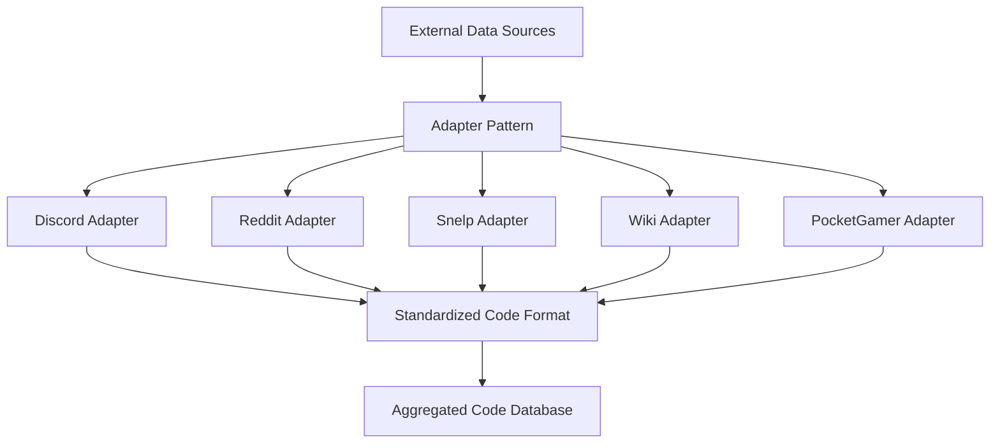
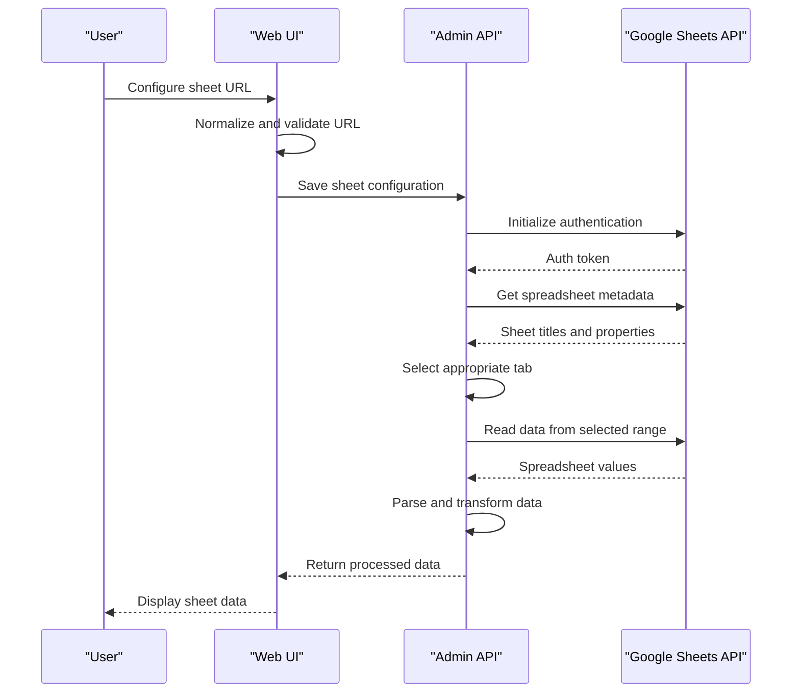
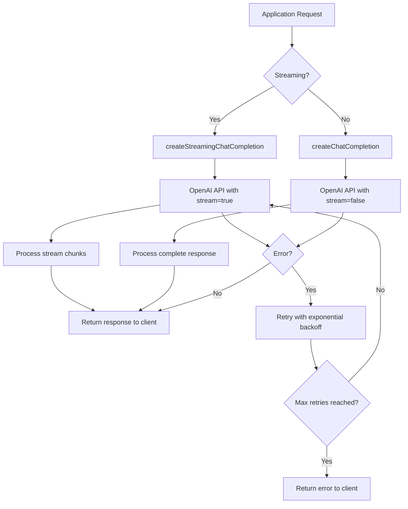
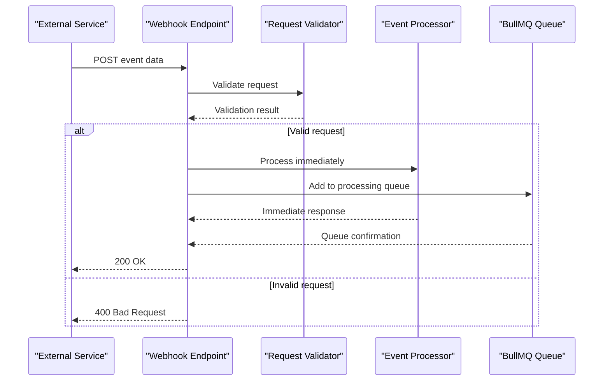
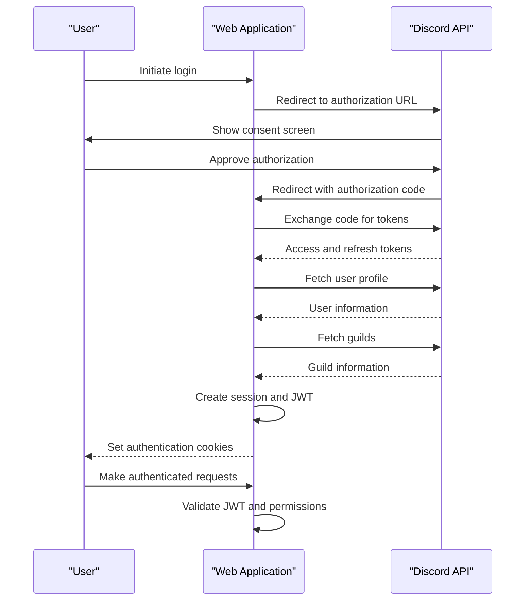
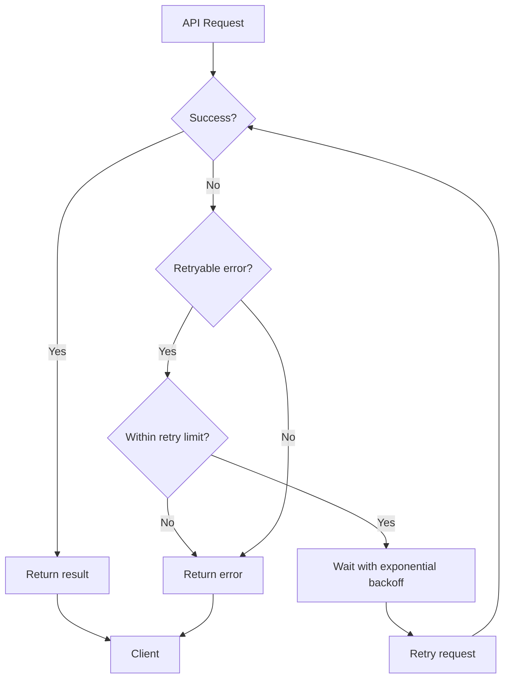
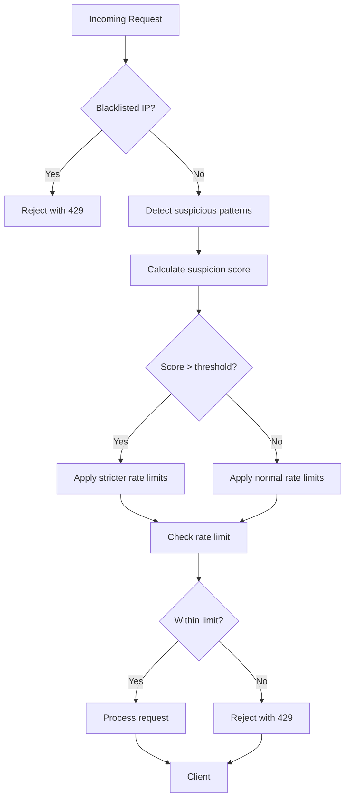

# Integration Points

<cite>
**Referenced Files in This Document**   
- [discord.ts](file://apps/web/lib/adapters/discord.ts)
- [reddit.ts](file://apps/web/lib/adapters/reddit.ts)
- [snelp.ts](file://apps/web/lib/adapters/snelp.ts)
- [wiki.ts](file://apps/web/lib/adapters/wiki.ts)
- [pocketgamer.ts](file://apps/web/lib/adapters/pocketgamer.ts)
- [index.js](file://apps/admin-api/src/lib/queues/index.js)
- [chat-processor.js](file://apps/admin-api/src/lib/queues/chat-processor.js)
- [database-processor.js](file://apps/admin-api/src/lib/queues/database-processor.js)
- [audit-processor.js](file://apps/admin-api/src/lib/queues/audit-processor.js)
- [sheets.js](file://apps/admin-api/lib/sheets.js)
- [club-sheets.js](file://apps/admin-api/lib/club-sheets.js)
- [openai-client.ts](file://apps/web/lib/openai-client.ts)
- [client.js](file://lib/openai/client.js)
- [queue.js](file://lib/openai/queue.js)
- [errors.js](file://apps/admin-api/src/lib/errors.js)
- [ddos-protection.ts](file://apps/web/lib/security/ddos-protection.ts)
- [rate-limiter.ts](file://apps/web/lib/rate-limiter.ts)
- [oauth.js](file://apps/admin-api/src/services/oauth.js)
</cite>

## Table of Contents
1. [External Data Source Integrations](#external-data-source-integrations)
2. [Queue-Based Architecture with BullMQ](#queue-based-architecture-with-bullmq)
3. [Google Sheets API Integration](#google-sheets-api-integration)
4. [OpenAI API Integration](#openai-api-integration)
5. [Webhook Endpoints and Event Handling](#webhook-endpoints-and-event-handling)
6. [Authentication and Authorization Patterns](#authentication-and-authorization-patterns)
7. [Error Handling and Retry Strategies](#error-handling-and-retry-strategies)
8. [Rate Limiting and DDoS Protection](#rate-limiting-and-ddos-protection)
9. [Monitoring and Observability](#monitoring-and-observability)

## External Data Source Integrations

The slimy-monorepo platform implements an adapter pattern to integrate with multiple external data sources for collecting game codes and related information. Each adapter follows a consistent interface while handling the specific requirements of its target platform.

The primary external data sources include:
- **Discord**: Official Super Snail Discord channel
- **Reddit**: r/SuperSnail_US subreddit
- **Snelp**: Snelp.com codes page
- **Wiki**: supersnail.wiki.gg code database
- **PocketGamer**: PocketGamer.com Super Snail coverage

Each adapter is implemented as a separate module in the `apps/web/lib/adapters/` directory, following a consistent pattern of export functions that return standardized code objects. The adapters handle authentication, rate limiting, error handling, and data transformation to a common format.

The adapter pattern enables the platform to:
- Add new data sources without modifying core application logic
- Handle different authentication mechanisms per platform
- Implement source-specific error handling and retry strategies
- Apply different trust weights to codes based on source reliability
- Cache responses with appropriate TTLs based on source update frequency



**Diagram sources**
- [discord.ts](file://apps/web/lib/adapters/discord.ts)
- [reddit.ts](file://apps/web/lib/adapters/reddit.ts)
- [snelp.ts](file://apps/web/lib/adapters/snelp.ts)
- [wiki.ts](file://apps/web/lib/adapters/wiki.ts)
- [pocketgamer.ts](file://apps/web/lib/adapters/pocketgamer.ts)

**Section sources**
- [discord.ts](file://apps/web/lib/adapters/discord.ts)
- [reddit.ts](file://apps/web/lib/adapters/reddit.ts)
- [snelp.ts](file://apps/web/lib/adapters/snelp.ts)
- [wiki.ts](file://apps/web/lib/adapters/wiki.ts)
- [pocketgamer.ts](file://apps/web/lib/adapters/pocketgamer.ts)

## Queue-Based Architecture with BullMQ

The platform employs a robust queue-based architecture using BullMQ for asynchronous processing of background tasks. This architecture enables the system to handle resource-intensive operations without blocking the main application flow, ensuring responsive user experiences and reliable processing of critical operations.

The queue infrastructure is implemented in the `apps/admin-api/src/lib/queues/` directory and consists of three primary queues:

1. **Chat Queue**: Handles chat bot interactions and message processing
2. **Database Queue**: Manages database operations and data processing
3. **Audit Queue**: Processes event sourcing and audit trail logging

Each queue is configured with appropriate concurrency limits, retry strategies, and job retention policies. The QueueManager class provides a centralized interface for managing all queues, workers, and schedulers.

Key features of the queue architecture include:
- Automatic retry with exponential backoff for failed jobs
- Job prioritization and delay capabilities
- Comprehensive monitoring and statistics collection
- Graceful shutdown and error handling
- Queue schedulers for improved reliability

```mermaid
classDiagram
class QueueManager {
+redis : Redis
+queues : Map
+workers : Map
+schedulers : Map
+isInitialized : boolean
+initialize() : Promise~boolean~
+addJob(queueName, jobName, data, options) : Promise~Job~
+getQueueStats(queueName) : Promise~Object~
+close() : Promise~void~
}
class Queue {
+name : string
+connection : Redis
+defaultJobOptions : Object
}
class Worker {
+queueName : string
+processor : Function
+concurrency : number
}
class QueueScheduler {
+queueName : string
+connection : Redis
}
QueueManager --> Queue : "manages"
QueueManager --> Worker : "creates"
QueueManager --> QueueScheduler : "creates"
Worker --> "chat-processor" : "delegates"
Worker --> "database-processor" : "delegates"
Worker --> "audit-processor" : "delegates"
```

**Diagram sources**
- [index.js](file://apps/admin-api/src/lib/queues/index.js)
- [chat-processor.js](file://apps/admin-api/src/lib/queues/chat-processor.js)
- [database-processor.js](file://apps/admin-api/src/lib/queues/database-processor.js)
- [audit-processor.js](file://apps/admin-api/src/lib/queues/audit-processor.js)

**Section sources**
- [index.js](file://apps/admin-api/src/lib/queues/index.js)

## Google Sheets API Integration

The platform integrates with Google Sheets API to enable data import and export functionality for guild statistics and club analytics. This integration allows users to connect their Google Sheets documents to automatically sync game data.

The integration is implemented in two components:
1. Server-side implementation in `apps/admin-api/lib/sheets.js` for backend operations
2. Client-side implementation in `apps/admin-ui/lib/sheets.js` for frontend embedding

Key features of the Google Sheets integration include:
- Service account authentication using Google Cloud credentials
- Spreadsheet metadata retrieval to identify available sheets
- Tab selection logic with pinning support
- Data parsing from spreadsheet ranges
- Error handling for missing spreadsheets or permissions
- Fallback mechanisms for unavailable sheets

The system supports both published and document-based sheet URLs, automatically converting them to appropriate embed formats. For published sheets, the system applies standard parameters for widget display, headers, and single-sheet viewing.



**Diagram sources**
- [sheets.js](file://apps/admin-api/lib/sheets.js)
- [club-sheets.js](file://apps/admin-api/lib/club-sheets.js)

**Section sources**
- [sheets.js](file://apps/admin-api/lib/sheets.js)
- [club-sheets.js](file://apps/admin-api/lib/club-sheets.js)

## OpenAI API Integration

The platform integrates with OpenAI API to provide AI-powered features, particularly for the chat bot functionality. The integration is implemented with robust error handling, retry logic, and streaming support for real-time responses.

The OpenAI integration is structured across multiple files:
- `lib/openai/client.js`: Core OpenAI client with retry logic
- `apps/web/lib/openai-client.ts`: Next.js compatible client
- `lib/openai/queue.js`: Queue-based processing for AI requests

Key features of the OpenAI integration include:
- Singleton client pattern to avoid unnecessary connections
- Exponential backoff retry strategy for failed requests
- Configurable timeouts and retry limits
- Streaming support for real-time chat responses
- Environment variable-based configuration
- Error handling for common API issues

The integration supports both streaming and non-streaming chat completions, allowing for flexible implementation based on use case requirements. The system also includes comprehensive error handling for authentication issues, rate limiting, and service outages.



**Diagram sources**
- [client.js](file://lib/openai/client.js)
- [openai-client.ts](file://apps/web/lib/openai-client.ts)
- [queue.js](file://lib/openai/queue.js)

**Section sources**
- [client.js](file://lib/openai/client.js)
- [openai-client.ts](file://apps/web/lib/openai-client.ts)

## Webhook Endpoints and Event Handling

The platform implements webhook endpoints and event handling mechanisms to process external events and integrate with third-party services. These endpoints follow a consistent pattern of authentication, validation, and asynchronous processing.

Key webhook endpoints include:
- Discord OAuth callback handlers
- Authentication callbacks
- Event stream endpoints
- Health check endpoints

The event handling system uses a combination of immediate processing for critical operations and queue-based processing for resource-intensive tasks. This ensures that webhook responses are fast while still guaranteeing reliable processing of the underlying operations.

The platform also implements Server-Sent Events (SSE) for real-time event streaming, allowing clients to receive updates without polling. The `/api/stats/events/stream` endpoint provides a continuous connection for pushing events to connected clients.



**Section sources**
- [oauth.js](file://apps/admin-api/src/services/oauth.js)
- [stats.js](file://apps/admin-api/src/routes/stats.js)

## Authentication and Authorization Patterns

The platform implements comprehensive authentication and authorization patterns for securing access to external APIs and protecting user data. The system uses OAuth 2.0 for external service authentication and JWT-based authentication for internal API protection.

For Discord integration, the platform implements a complete OAuth flow:
1. Redirect users to Discord authorization URL
2. Handle callback with authorization code
3. Exchange code for access and refresh tokens
4. Use tokens to fetch user and guild information
5. Store tokens securely and handle refresh when needed

The authentication system includes several key components:
- CSRF protection for OAuth flows
- State parameter validation to prevent CSRF attacks
- Token refresh mechanisms for long-lived sessions
- Role-based access control (RBAC) for API endpoints
- Secure token storage and transmission

The platform also implements proper error handling for authentication failures, including token expiration, revoked permissions, and invalid credentials.



**Diagram sources**
- [oauth.js](file://apps/admin-api/src/services/oauth.js)
- [auth.js](file://apps/admin-api/src/routes/auth.js)

**Section sources**
- [oauth.js](file://apps/admin-api/src/services/oauth.js)

## Error Handling and Retry Strategies

The platform implements comprehensive error handling and retry strategies across all integration points to ensure reliability and resilience in the face of external service failures.

The error handling system is built around a hierarchy of error classes defined in `apps/admin-api/src/lib/errors.js`, including:
- AppError: Base application error
- AuthenticationError: Authentication-related errors
- AuthorizationError: Permission-related errors
- ValidationError: Input validation errors
- ExternalServiceError: External API failures
- ConfigurationError: Missing configuration
- InternalServerError: Unhandled exceptions

For retry strategies, the platform implements:
- Exponential backoff with jitter for API calls
- Configurable retry limits and delay parameters
- Circuit breaker patterns to prevent cascading failures
- Fallback mechanisms for degraded functionality
- Comprehensive logging and monitoring of errors

The queue system automatically retries failed jobs with exponential backoff, while the OpenAI client implements custom retry logic with configurable parameters. External service adapters also implement retry logic appropriate to each service's rate limiting policies.



**Section sources**
- [errors.js](file://apps/admin-api/src/lib/errors.js)
- [client.js](file://lib/openai/client.js)
- [index.js](file://apps/admin-api/src/lib/queues/index.js)

## Rate Limiting and DDoS Protection

The platform implements sophisticated rate limiting and DDoS protection mechanisms to protect against abuse and ensure fair usage of resources.

The rate limiting system operates at multiple levels:
1. **IP-based rate limiting**: Tracks requests per IP address
2. **Tiered rate limiting**: Different limits for public, authenticated, and premium users
3. **File-backed rate limiting**: Simple file-based storage for rate limit counters
4. **Redis-backed rate limiting**: Advanced rate limiting with distributed storage

The DDoS protection system, implemented in `apps/web/lib/security/ddos-protection.ts`, includes:
- Multi-tier rate limiting with burst allowances
- Suspicious activity detection based on request patterns
- Dynamic suspicion scoring based on multiple factors
- Automatic IP blacklisting for abusive clients
- Adaptive throttling based on threat level

The system uses a combination of immediate rejection for clear abuse and progressive throttling for borderline cases. It also implements fail-open behavior to ensure service availability during infrastructure failures.



**Section sources**
- [ddos-protection.ts](file://apps/web/lib/security/ddos-protection.ts)
- [rate-limiter.ts](file://apps/web/lib/rate-limiter.ts)

## Monitoring and Observability

The platform implements comprehensive monitoring and observability features to track the health and performance of integration points.

Key monitoring capabilities include:
- **Metrics collection**: Job processing times, queue lengths, API latencies
- **Logging**: Structured logging with context for debugging
- **Error tracking**: Centralized error reporting and analysis
- **Health checks**: Endpoint monitoring and status reporting
- **Usage analytics**: Tracking of API usage and feature adoption

The system uses Prometheus for metrics collection and Grafana for visualization, with dashboards configured to monitor key integration metrics. The platform also implements request tracing and correlation IDs to track requests across service boundaries.

For external API integrations, the monitoring system tracks:
- Success/failure rates for API calls
- Response times and latency percentiles
- Rate limit status and retry counts
- Authentication token validity
- Data freshness and update frequency

The observability infrastructure enables proactive detection of issues, rapid troubleshooting, and data-driven optimization of integration performance.

**Section sources**
- [metrics.js](file://apps/admin-api/src/lib/monitoring/metrics.js)
- [logger.js](file://apps/admin-api/src/lib/logger.js)
- [grafana-dashboard.json](file://apps/admin-api/monitoring/dashboards/grafana-dashboard.json)