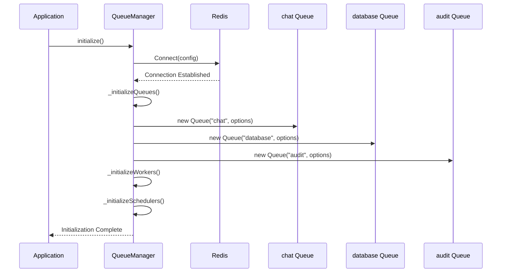
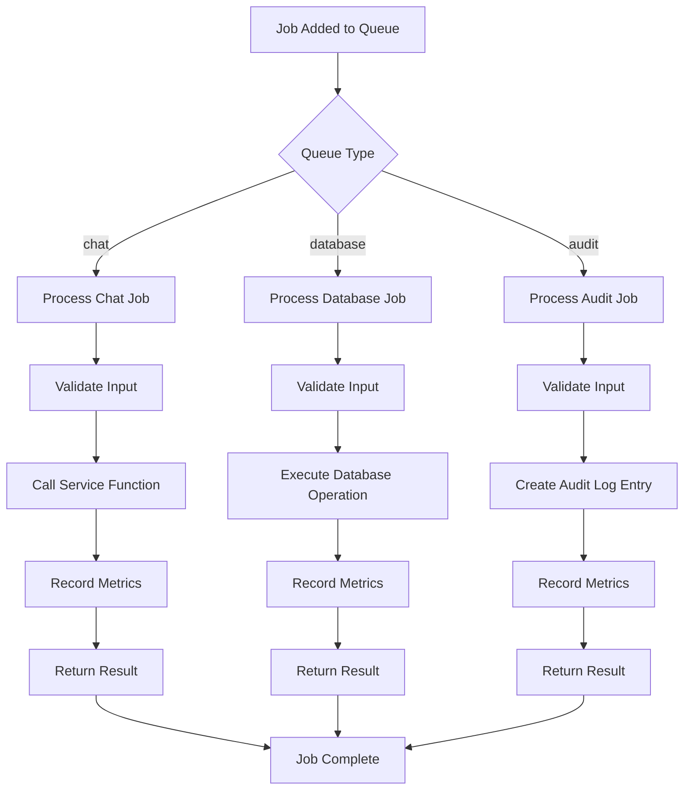
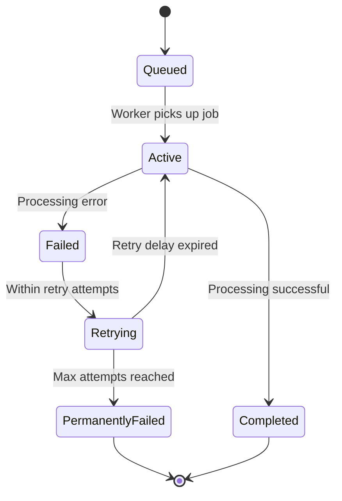
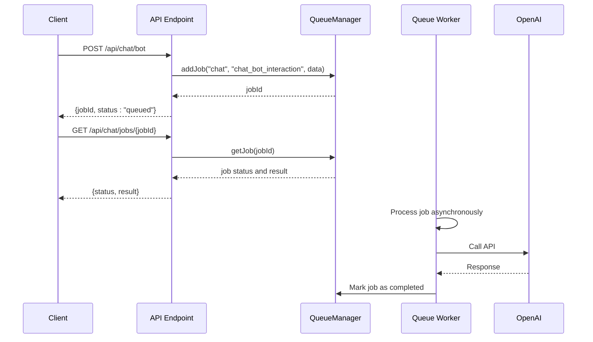
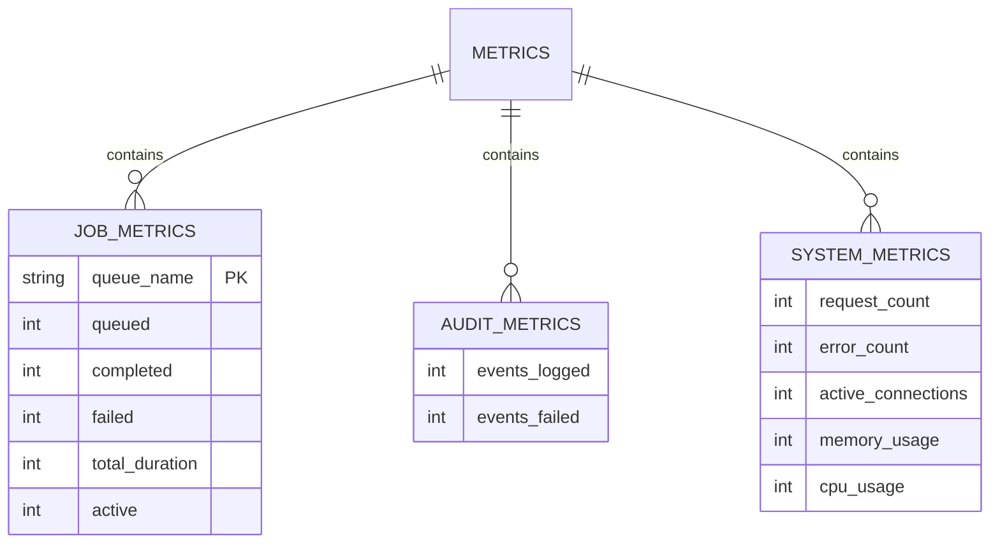

# Queue-Based Processing

<cite>
**Referenced Files in This Document**   
- [index.js](file://apps/admin-api/src/lib/queues/index.js)
- [audit-processor.js](file://apps/admin-api/src/lib/queues/audit-processor.js)
- [chat-processor.js](file://apps/admin-api/src/lib/queues/chat-processor.js)
- [database-processor.js](file://apps/admin-api/src/lib/queues/database-processor.js)
- [config.js](file://apps/admin-api/src/lib/config/index.js)
- [metrics.js](file://apps/admin-api/src/lib/monitoring/metrics.js)
- [chat.js](file://apps/admin-api/src/routes/chat.js)
</cite>

## Table of Contents
1. [Introduction](#introduction)
2. [Architecture Overview](#architecture-overview)
3. [Queue Initialization and Management](#queue-initialization-and-management)
4. [Job Processing Patterns](#job-processing-patterns)
5. [Error Handling and Retry Mechanisms](#error-handling-and-retry-mechanisms)
6. [API Integration and Asynchronous Operations](#api-integration-and-asynchronous-operations)
7. [Configuration and Redis Connection Management](#configuration-and-redis-connection-management)
8. [Monitoring Considerations](#monitoring-considerations)
9. [Job Payload Examples and Workflows](#job-payload-examples-and-workflows)
10. [Scalability and System Resilience](#scalability-and-system-resilience)
11. [Best Practices](#best-practices)

## Introduction

The slimy-monorepo platform implements a robust queue-based processing system using BullMQ for background job processing and task orchestration. This system enables asynchronous execution of resource-intensive operations, decoupling API endpoints from long-running tasks to improve responsiveness and system reliability. The architecture centers around three primary queues: audit-processor, chat-processor, and database-processor, each designed to handle specific categories of operations with appropriate concurrency levels and processing patterns.

This documentation provides a comprehensive overview of the queue system's implementation, covering initialization, job creation, processing workflows, error handling, and integration with the API layer. The system leverages Redis as the message broker, providing persistent storage for jobs and enabling reliable processing even during system restarts. The design emphasizes scalability, resilience, and observability, with comprehensive monitoring and metrics collection built into the core infrastructure.

**Section sources**
- [index.js](file://apps/admin-api/src/lib/queues/index.js#L1-L395)
- [config.js](file://apps/admin-api/src/lib/config/index.js#L1-L262)

## Architecture Overview

The queue-based processing system in the slimy-monorepo platform follows a producer-consumer pattern with BullMQ as the job queue implementation. The architecture consists of three main queues that handle different types of operations: chat processing, database operations, and audit logging. Each queue has dedicated workers that process jobs asynchronously, allowing the main application to respond to API requests quickly while background tasks are executed in the background.

The system is built around a QueueManager class that serves as the central coordinator for all queue operations. This singleton instance manages Redis connections, initializes queues and workers, and provides a unified interface for job submission and queue management. The architecture promotes separation of concerns by isolating job processing logic into dedicated processor modules (chat-processor.js, database-processor.js, and audit-processor.js), each responsible for handling specific job types within their respective domains.

```mermaid
graph TD
subgraph "API Layer"
A[API Endpoints] --> B[QueueManager]
end
subgraph "Queue Infrastructure"
B --> C[chat Queue]
B --> D[database Queue]
B --> E[audit Queue]
C --> F[Chat Worker]
D --> G[Database Worker]
E --> H[Audit Worker]
end
subgraph "External Services"
F --> I[OpenAI API]
G --> J[Database]
H --> J
end
subgraph "Monitoring"
K[Metrics] < --> B
K < --> F
K < --> G
K < --> H
end
style A fill:#f9f,stroke:#333
style B fill:#bbf,stroke:#333
style C fill:#f96,stroke:#333
style D fill:#f96,stroke:#333
style E fill:#f96,stroke:#333
```

**Diagram sources**
- [index.js](file://apps/admin-api/src/lib/queues/index.js#L30-L387)
- [chat-processor.js](file://apps/admin-api/src/lib/queues/chat-processor.js#L1-L279)
- [database-processor.js](file://apps/admin-api/src/lib/queues/database-processor.js#L1-L324)
- [audit-processor.js](file://apps/admin-api/src/lib/queues/audit-processor.js#L1-L401)

## Queue Initialization and Management

The queue system is initialized through the QueueManager class, which handles the setup of Redis connections, queue instances, workers, and schedulers. The initialization process begins with establishing a connection to Redis using configuration parameters from the application's config module. The Redis connection is configured with specific options for reliability, including maxRetriesPerRequest set to 3 and retryDelayOnFailover set to 100 milliseconds, ensuring resilience during temporary connectivity issues.

Three primary queues are initialized with different concurrency levels based on their operational requirements: the chat queue with a concurrency of 5, the database queue with a concurrency of 10, and the audit queue with a concurrency of 2. Each queue is configured with default job options that specify how completed and failed jobs are handled, including removing completed jobs after 50 occurrences and failed jobs after 100 occurrences. Failed jobs are automatically retried up to 3 times with exponential backoff starting at a 2-second delay, providing a robust mechanism for handling transient failures.



**Diagram sources**
- [index.js](file://apps/admin-api/src/lib/queues/index.js#L42-L75)
- [index.js](file://apps/admin-api/src/lib/queues/index.js#L81-L104)

## Job Processing Patterns

The system implements a structured job processing pattern where each queue has a dedicated worker that processes jobs according to predefined handlers. The processing workflow begins when a job is added to a queue with a specific type and data payload. The worker then routes the job to the appropriate handler function based on the job type, ensuring separation of concerns and maintainability. This pattern is implemented through the _processChatJob, _processDatabaseJob, and _processAuditJob methods in the QueueManager class, which use switch statements to dispatch jobs to their respective processing functions.

For chat operations, the chat-processor handles interactions with the OpenAI API, including processing user prompts and generating responses. The database-processor manages all database operations such as creating conversations, saving messages, updating conversation metadata, and deleting conversations. The audit-processor handles event sourcing and audit trail logging, capturing user actions and system events for compliance and security purposes. Each processor module exports specific functions that are imported into the QueueManager and used to process jobs of the corresponding type.



**Diagram sources**
- [index.js](file://apps/admin-api/src/lib/queues/index.js#L228-L313)
- [chat-processor.js](file://apps/admin-api/src/lib/queues/chat-processor.js#L27-L95)
- [database-processor.js](file://apps/admin-api/src/lib/queues/database-processor.js#L25-L193)
- [audit-processor.js](file://apps/admin-api/src/lib/queues/audit-processor.js#L33-L125)

## Error Handling and Retry Mechanisms

The queue system implements comprehensive error handling and retry mechanisms to ensure reliability and fault tolerance. Each worker wraps job processing in try-catch blocks that capture errors, record appropriate metrics, and re-throw exceptions to trigger BullMQ's built-in retry mechanism. The system uses exponential backoff for retries, starting with a 2-second delay and increasing for subsequent attempts, which helps prevent overwhelming external services during transient failures.

Failed jobs are tracked through the metrics system, with specific counters for failed jobs in each queue. The audit-processor demonstrates a particularly resilient approach to error handling by treating audit logging failures as non-critical; if audit logging fails, the system records this as a separate audit event but does not fail the main operation. This ensures that audit logging issues do not cascade into failures of primary business operations.



**Diagram sources**
- [index.js](file://apps/admin-api/src/lib/queues/index.js#L114-L126)
- [index.js](file://apps/admin-api/src/lib/queues/index.js#L135-L147)
- [index.js](file://apps/admin-api/src/lib/queues/index.js#L156-L168)
- [audit-processor.js](file://apps/admin-api/src/lib/queues/audit-processor.js#L102-L125)

## API Integration and Asynchronous Operations

The queue system is tightly integrated with the API layer, enabling asynchronous operations that improve responsiveness and user experience. API endpoints submit jobs to the appropriate queues and return immediately with a job ID, allowing clients to poll for job status or receive updates through other mechanisms. This pattern is evident in the chat routes, where endpoints like POST /api/chat/bot and POST /api/chat/conversations submit jobs to the chat and database queues respectively, returning a jobId that clients can use to track progress.

The integration follows a consistent pattern across endpoints: first checking if the queue system is initialized, then submitting a job with appropriate data and metadata (including requestId for tracing), and finally returning a response with the job ID and estimated wait time. Status endpoints like GET /api/chat/jobs/:jobId allow clients to check the status of submitted jobs, retrieving results when jobs are completed or error information when they fail.



**Diagram sources**
- [chat.js](file://apps/admin-api/src/routes/chat.js#L53-L91)
- [chat.js](file://apps/admin-api/src/routes/chat.js#L127-L181)
- [index.js](file://apps/admin-api/src/lib/queues/index.js#L207-L223)

## Configuration and Redis Connection Management

The queue system's configuration is managed through the application's centralized config module, which loads and validates environment variables. Redis connection details are obtained from the REDIS_URL environment variable, with connection options including maxRetriesPerRequest set to 3 and retryDelayOnFailover set to 100 milliseconds for resilience. The Redis connection is established with lazyConnect enabled, which defers the actual connection until the first command is sent, improving startup performance.

The QueueManager class manages the Redis connection lifecycle, ensuring proper initialization and cleanup. During initialization, the system tests the Redis connection with a ping command before proceeding with queue setup. The connection is shared across all queues, workers, and schedulers, optimizing resource usage. When the application shuts down, the QueueManager's close method systematically closes workers, schedulers, queues, and finally the Redis connection, ensuring graceful shutdown and proper resource cleanup.

**Section sources**
- [index.js](file://apps/admin-api/src/lib/queues/index.js#L49-L58)
- [config.js](file://apps/admin-api/src/lib/config/index.js#L208-L216)
- [index.js](file://apps/admin-api/src/lib/queues/index.js#L344-L386)

## Monitoring Considerations

The system includes comprehensive monitoring capabilities through a dedicated metrics module that tracks key performance indicators for the queue system. Metrics are collected at multiple levels, including job queuing, completion, failure rates, and processing duration. The metrics module maintains counters for queued, completed, and failed jobs for each queue type (chat, database, audit), as well as tracking the total duration of job processing to calculate average execution times.

The monitoring system also captures job throughput, calculating jobs per minute for each queue based on the system's uptime. This data is exposed through a snapshot function that provides a comprehensive view of the system's health, including request metrics, error rates, database performance, and system resource usage (memory and CPU). The metrics are integrated with the job processing workflow, with each worker recording job duration, completion, and failure metrics as part of the processing lifecycle.



**Diagram sources**
- [metrics.js](file://apps/admin-api/src/lib/monitoring/metrics.js#L27-L48)
- [metrics.js](file://apps/admin-api/src/lib/monitoring/metrics.js#L106-L134)
- [metrics.js](file://apps/admin-api/src/lib/monitoring/metrics.js#L224-L306)

## Job Payload Examples and Workflows

The system processes various job types with specific payload structures tailored to their operational requirements. For chat bot interactions, the job payload includes the user's prompt, guild ID for context, user ID for authorization, and request ID for tracing. Database operations include payloads for creating conversations (with user ID, optional title, and personality mode) and saving messages (with conversation ID, user ID, role, content, and personality mode). Audit events include comprehensive details such as user ID, action performed, resource type and ID, IP address, user agent, session ID, and success status.

The workflow for a typical chat interaction begins with the API endpoint validating the request and submitting a job to the chat queue with the appropriate payload. The chat worker processes the job by calling the OpenAI API, recording the interaction in the audit log, and returning the response. For database operations, the workflow involves validating the request, submitting a job to the database queue, and allowing the database worker to handle the persistence operation asynchronously.

**Section sources**
- [chat-processor.js](file://apps/admin-api/src/lib/queues/chat-processor.js#L27-L95)
- [database-processor.js](file://apps/admin-api/src/lib/queues/database-processor.js#L25-L193)
- [audit-processor.js](file://apps/admin-api/src/lib/queues/audit-processor.js#L33-L125)
- [chat.js](file://apps/admin-api/src/routes/chat.js#L72-L77)

## Scalability and System Resilience

The queue system is designed with scalability and resilience in mind, employing several patterns to ensure reliable operation under varying loads. The use of Redis as a persistent message broker ensures that jobs are not lost during system restarts or failures. The configuration of different concurrency levels for each queue (5 for chat, 10 for database, 2 for audit) allows the system to optimize resource allocation based on the processing requirements of each job type.

The system implements queue schedulers for each queue, which provide additional reliability by automatically retrying failed jobs and handling delayed jobs. This enhances system resilience by ensuring that transient failures do not result in permanent job loss. The separation of concerns between different queue types allows for independent scaling of processing capacity for different types of operations, enabling targeted optimization based on workload patterns.

**Section sources**
- [index.js](file://apps/admin-api/src/lib/queues/index.js#L83-L85)
- [index.js](file://apps/admin-api/src/lib/queues/index.js#L184-L195)

## Best Practices

The implementation follows several best practices for queue-based systems. Job payloads are kept lightweight, containing only essential data to minimize serialization overhead and memory usage. Each processor module focuses on a single responsibility, making the codebase more maintainable and testable. The system uses request IDs for tracing operations across synchronous and asynchronous boundaries, facilitating debugging and monitoring.

When adding new queue processors, developers should follow the established pattern of creating a dedicated processor module that exports specific handler functions, registering these functions in the QueueManager, and ensuring proper error handling and metrics collection. For long-running tasks, the system should implement progress tracking and provide mechanisms for clients to check job status, preventing timeouts and improving user experience.

**Section sources**
- [index.js](file://apps/admin-api/src/lib/queues/index.js#L21-L28)
- [chat-processor.js](file://apps/admin-api/src/lib/queues/chat-processor.js#L1-L279)
- [database-processor.js](file://apps/admin-api/src/lib/queues/database-processor.js#L1-L324)
- [audit-processor.js](file://apps/admin-api/src/lib/queues/audit-processor.js#L1-L401)