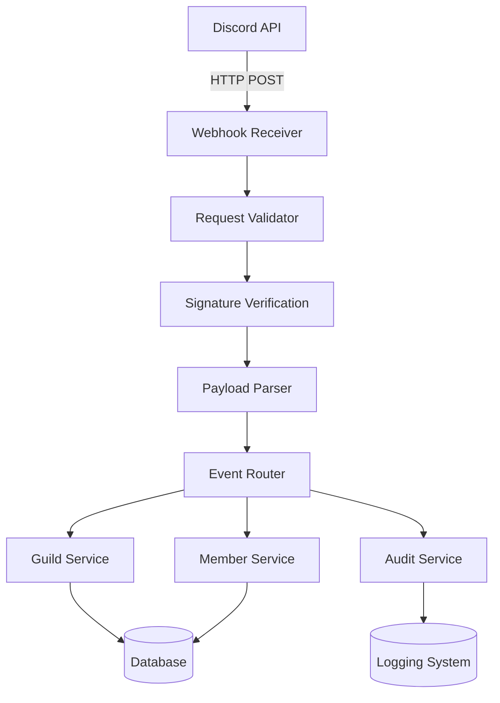
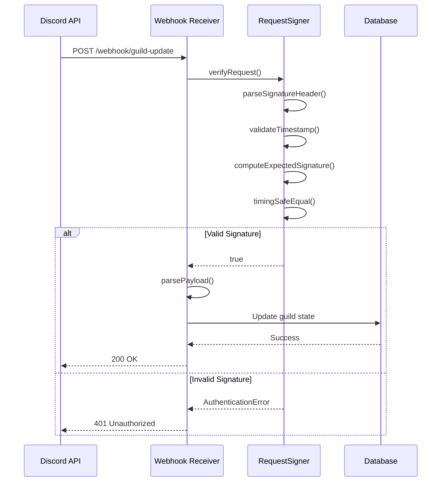
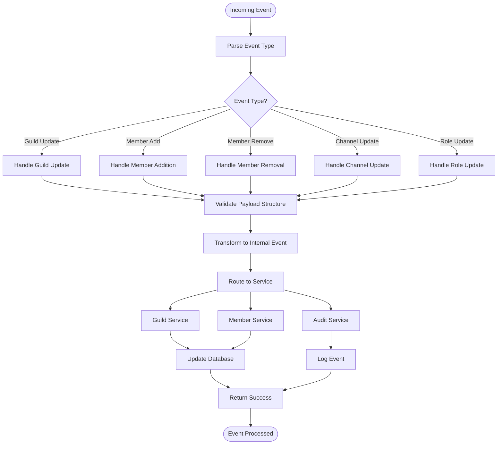
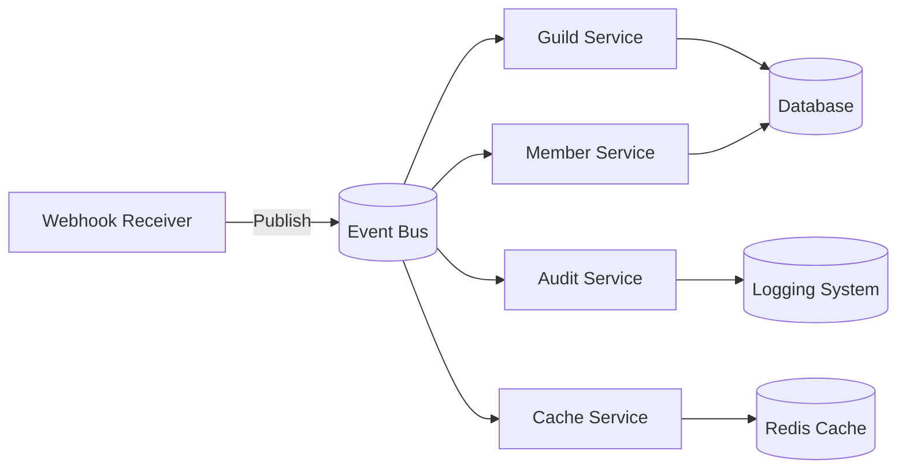
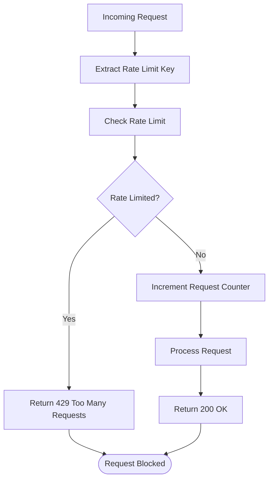
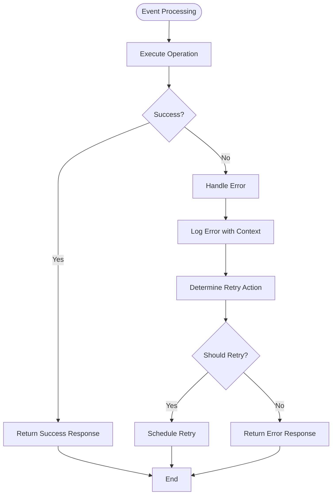

# Webhooks

<cite>
**Referenced Files in This Document**   
- [discord.ts](file://apps/admin-api/src/routes/discord.js)
- [guild.service.js](file://apps/admin-api/src/services/guild.service.js)
- [request-signing.ts](file://apps/web/lib/security/request-signing.ts)
- [rate-limiter.ts](file://apps/web/lib/rate-limiter.ts)
- [errorHandler.ts](file://apps/bot/src/lib/errorHandler.ts)
- [BOT_LOGGING.md](file://apps/bot/docs/BOT_LOGGING.md)
</cite>

## Table of Contents
1. [Introduction](#introduction)
2. [Webhook Endpoint Architecture](#webhook-endpoint-architecture)
3. [Request Validation and Signature Verification](#request-validation-and-signature-verification)
4. [Event Routing System](#event-routing-system)
5. [Internal Service Integration](#internal-service-integration)
6. [Security Considerations](#security-considerations)
7. [Error Handling and Retry Policies](#error-handling-and-retry-policies)
8. [Monitoring and Delivery Success Rates](#monitoring-and-delivery-success-rates)
9. [Configuration Requirements](#configuration-requirements)
10. [Conclusion](#conclusion)

## Introduction
The slimy-monorepo platform implements a robust webhook system for receiving real-time events from the Discord API, specifically focusing on guild-related events. This documentation details the architecture, security mechanisms, and operational aspects of the webhook endpoints and event handling system. The platform processes various Discord events including guild updates, member changes, and other state transitions, ensuring reliable synchronization between Discord and internal services.

## Webhook Endpoint Architecture
The webhook system is designed to handle incoming Discord events through a series of well-defined endpoints that process and route events to appropriate internal services. The architecture follows a microservices pattern where webhook receivers act as entry points for external events, which are then processed and distributed to relevant components.

**Diagram sources**
- [discord.ts](file://apps/admin-api/src/routes/discord.js)
- [guild.service.js](file://apps/admin-api/src/services/guild.service.js)

**Section sources**
- [discord.ts](file://apps/admin-api/src/routes/discord.js)
- [guild.service.js](file://apps/admin-api/src/services/guild.service.js)

## Request Validation and Signature Verification
All incoming webhook requests undergo rigorous validation and signature verification to ensure authenticity and prevent unauthorized access. The system implements HMAC-SHA256 based request signing to verify the integrity of incoming requests.

The signature verification process follows these steps:
1. Extract signature header from request
2. Parse timestamp and signature components
3. Validate timestamp tolerance (5-minute window)
4. Recompute expected signature using shared secret
5. Perform timing-safe comparison of signatures

**Diagram sources**
- [request-signing.ts](file://apps/web/lib/security/request-signing.ts)
- [discord.ts](file://apps/admin-api/src/routes/discord.js)

**Section sources**
- [request-signing.ts](file://apps/web/lib/security/request-signing.ts)
- [discord.ts](file://apps/admin-api/src/routes/discord.js)

## Event Routing System
The event routing system processes different types of Discord events through a centralized router that directs events to appropriate handlers based on event type. The system supports various event categories including guild updates, member changes, channel modifications, and role adjustments.

**Diagram sources**
- [guild.service.js](file://apps/admin-api/src/services/guild.service.js)
- [discord.ts](file://apps/admin-api/src/routes/discord.js)

**Section sources**
- [guild.service.js](file://apps/admin-api/src/services/guild.service.js)
- [discord.ts](file://apps/admin-api/src/routes/discord.js)

## Internal Service Integration
Webhook receivers integrate with internal services to maintain state synchronization across the platform. When Discord events are received, they trigger updates in various internal systems including user management, guild settings, and audit logging.

The integration follows a publish-subscribe pattern where the webhook receiver acts as a publisher, and internal services act as subscribers. This decoupled architecture ensures that failure in one service does not impact the processing of events by other services.

Key integration points include:
- **Guild Service**: Updates guild metadata, settings, and ownership information
- **Member Service**: Manages user membership, roles, and permissions
- **Audit Service**: Logs all state changes for compliance and debugging
- **Cache Service**: Invalidates relevant cache entries to ensure data consistency

**Diagram sources**
- [guild.service.js](file://apps/admin-api/src/services/guild.service.js)
- [discord.ts](file://apps/admin-api/src/routes/discord.js)

**Section sources**
- [guild.service.js](file://apps/admin-api/src/services/guild.service.js)
- [discord.ts](file://apps/admin-api/src/routes/discord.js)

## Security Considerations
The webhook system implements multiple security layers to protect against unauthorized access, replay attacks, and denial-of-service attempts.

### Signature Validation
The system uses HMAC-SHA256 signatures with a shared secret to verify request authenticity. The signature header follows the format `t={timestamp},v1={signature}` where:
- `t` represents the Unix timestamp in seconds
- `v1` represents the HMAC-SHA256 signature

The system validates that the timestamp is within a 5-minute window to prevent replay attacks.

### Rate Limiting
A file-backed rate limiter protects webhook endpoints from abuse. The system tracks request counts per IP address or user identifier within a sliding time window.

**Diagram sources**
- [request-signing.ts](file://apps/web/lib/security/request-signing.ts)
- [rate-limiter.ts](file://apps/web/lib/rate-limiter.ts)

**Section sources**
- [request-signing.ts](file://apps/web/lib/security/request-signing.ts)
- [rate-limiter.ts](file://apps/web/lib/rate-limiter.ts)

## Error Handling and Retry Policies
The system implements comprehensive error handling and retry mechanisms to ensure reliable event delivery and processing.

### Error Handling
All event processing operations are wrapped in try-catch blocks that prevent unhandled exceptions from crashing the system. Errors are logged with contextual information including:
- Event type
- Guild ID
- Timestamp
- Error message and stack trace

### Retry Policies
Failed webhook deliveries follow an exponential backoff retry policy:
- Maximum retries: 3
- Base delay: 1 second
- Backoff multiplier: 2
- Maximum delay: 30 seconds

Retryable errors include network timeouts, 5xx server errors, and rate limit responses (429).

**Section sources**
- [errorHandler.ts](file://apps/bot/src/lib/errorHandler.ts)
- [BOT_LOGGING.md](file://apps/bot/docs/BOT_LOGGING.md)

## Monitoring and Delivery Success Rates
The platform includes comprehensive monitoring of webhook delivery success rates through various mechanisms:

1. **Logging System**: All webhook requests and responses are logged with timestamps, status codes, and processing times
2. **Metrics Collection**: Key metrics are collected including:
   - Request rate
   - Error rate
   - Processing latency
   - Retry count
3. **Health Checks**: Regular health checks verify the availability and responsiveness of webhook endpoints
4. **Alerting**: Threshold-based alerts notify administrators of abnormal patterns

The system also provides a health command (`!bothealth`) that returns diagnostic information including uptime, memory usage, and connection status.

**Section sources**
- [BOT_LOGGING.md](file://apps/bot/docs/BOT_LOGGING.md)
- [errorHandler.ts](file://apps/bot/src/lib/errorHandler.ts)

## Configuration Requirements
Proper configuration of webhook endpoints requires the following:

### Environment Variables
- `REQUEST_SIGNING_SECRET`: Shared secret for HMAC signature verification
- `DISCORD_BOT_TOKEN`: Bot token for authenticating with Discord API
- `DISCORD_CLIENT_ID`: Client ID for OAuth operations
- `NODE_ENV`: Environment indicator (development, production)

### Security Configuration
- The `REQUEST_SIGNING_SECRET` must be changed from the default value in production
- Webhook endpoints should be protected behind a reverse proxy with TLS termination
- Rate limiting parameters should be tuned based on expected traffic patterns

### Operational Configuration
- Database connections must be properly configured for the guild service
- Cache storage must be available for rate limiting
- Logging destinations should be configured for production environments

**Section sources**
- [request-signing.ts](file://apps/web/lib/security/request-signing.ts)
- [rate-limiter.ts](file://apps/web/lib/rate-limiter.ts)

## Conclusion
The webhook system in the slimy-monorepo platform provides a secure, reliable mechanism for receiving and processing real-time events from Discord. Through robust signature verification, comprehensive error handling, and effective integration with internal services, the system ensures accurate state synchronization while maintaining high availability and security standards. The modular architecture allows for easy extension to support additional event types and integration points as needed.