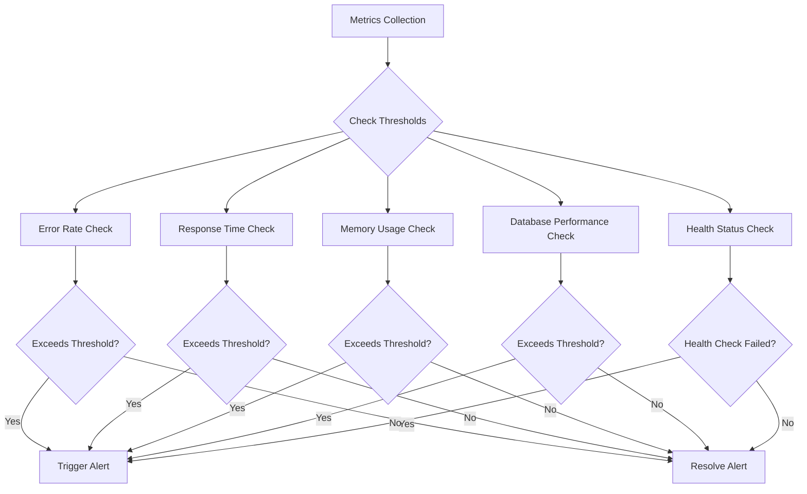
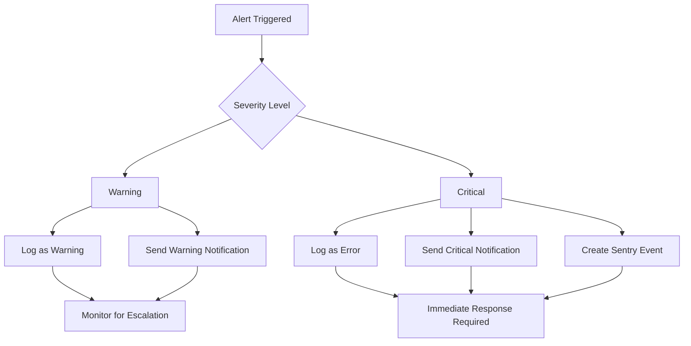
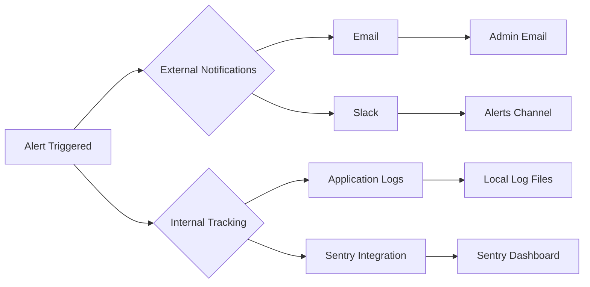
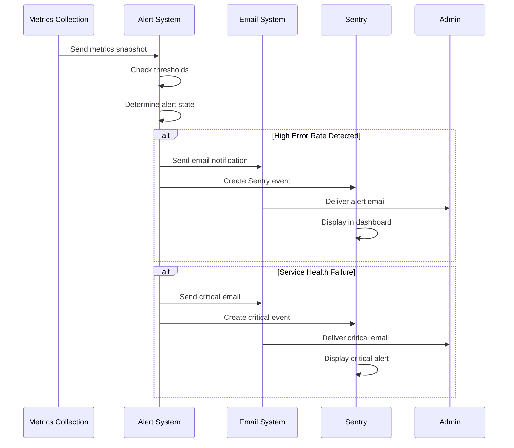
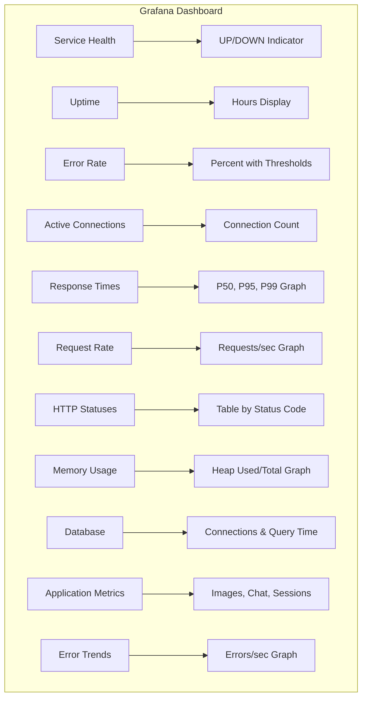
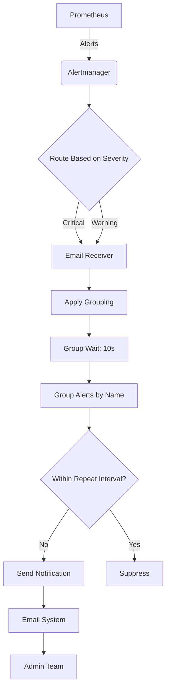
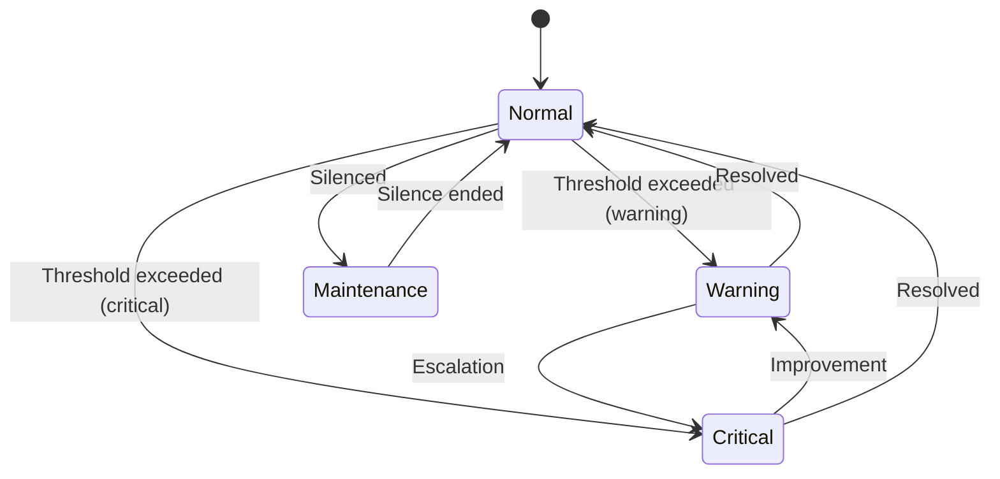
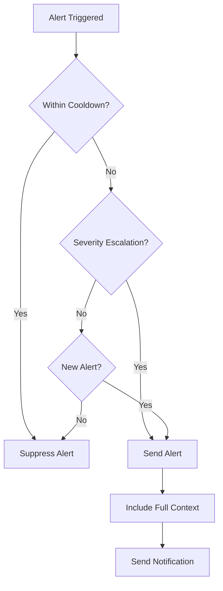

# Alerting System

<cite>
**Referenced Files in This Document**   
- [alerts.js](file://apps/admin-api/src/lib/alerts.js)
- [alertmanager.yml](file://apps/web/monitoring/alertmanager.yml)
- [metrics.js](file://apps/admin-api/src/lib/monitoring/metrics.js)
- [grafana-dashboard.json](file://apps/admin-api/monitoring/dashboards/grafana-dashboard.json)
- [alerting.ts](file://apps/web/lib/monitoring/alerting.ts)
</cite>

## Table of Contents
1. [Introduction](#introduction)
2. [Alert Rules and Thresholds](#alert-rules-and-thresholds)
3. [Alert Severity Levels](#alert-severity-levels)
4. [Notification Channels](#notification-channels)
5. [Active Alert Examples](#active-alert-examples)
6. [Grafana Dashboard Visualization](#grafana-dashboard-visualization)
7. [Alertmanager Integration](#alertmanager-integration)
8. [Alert Silencing and Escalation](#alert-silencing-and-escalation)
9. [On-Call Rotation Considerations](#on-call-rotation-considerations)
10. [Alert Fatigue Prevention](#alert-fatigue-prevention)
11. [Troubleshooting Guidance](#troubleshooting-guidance)

## Introduction
The alerting system in the slimy-monorepo platform provides comprehensive monitoring and notification capabilities for critical application metrics. The system is designed to detect performance degradation, service health issues, and resource utilization problems through a combination of threshold-based alerts and health checks. Alerts are triggered based on predefined thresholds for error rates, response times, memory usage, and database performance, with integration to Alertmanager for notification routing and deduplication. The system includes both in-application alerting logic and external monitoring through Prometheus and Grafana, providing a robust observability framework for maintaining service reliability.

**Section sources**
- [alerts.js](file://apps/admin-api/src/lib/alerts.js#L1-L343)
- [alerting.ts](file://apps/web/lib/monitoring/alerting.ts#L1-L357)

## Alert Rules and Thresholds
The alerting system defines specific thresholds for various performance and health metrics that trigger alerts when exceeded. These thresholds are configured in the `ALERT_THRESHOLDS` object within the alerts.js file and are used to monitor key aspects of system performance.

### Error Rate Thresholds
Error rate monitoring tracks the percentage of failed requests compared to total requests. The system triggers alerts when error rates exceed predefined thresholds:
- **Warning**: 5% error rate
- **Critical**: 10% error rate

### Response Time Thresholds
Response time monitoring tracks both P95 and P99 percentiles of request response times:
- **P95 Response Time**:
  - Warning: 2,000ms (2 seconds)
  - Critical: 5,000ms (5 seconds)
- **P99 Response Time**:
  - Warning: 5,000ms (5 seconds)
  - Critical: 10,000ms (10 seconds)

### Resource Utilization Thresholds
Memory usage is monitored as a percentage of heap memory utilization:
- **Warning**: 80% memory usage
- **Critical**: 90% memory usage

### Database Performance Thresholds
Database query performance is monitored based on average query time:
- **Warning**: 100ms average query time
- **Critical**: 500ms average query time

### Health Check Thresholds
Service health is monitored through health check endpoints, with alerts triggered immediately upon failure of a health check.

**Diagram sources**
- [alerts.js](file://apps/admin-api/src/lib/alerts.js#L7-L42)
- [metrics.js](file://apps/admin-api/src/lib/monitoring/metrics.js#L223-L306)

**Section sources**
- [alerts.js](file://apps/admin-api/src/lib/alerts.js#L7-L42)

## Alert Severity Levels
The alerting system implements a two-tier severity classification system to differentiate between different levels of urgency and impact.

### Warning Severity
Warning-level alerts indicate potential issues that require attention but do not represent immediate service disruption. These alerts are typically triggered when metrics approach critical thresholds but have not yet reached levels that significantly impact service quality. Examples include:
- Error rates between 5% and 10%
- Response times between 2-5 seconds (P95) or 5-10 seconds (P99)
- Memory usage between 80% and 90%
- Database query times between 100-500ms

### Critical Severity
Critical-level alerts indicate severe issues that are actively impacting service quality and require immediate attention. These alerts are triggered when metrics exceed critical thresholds, potentially leading to service degradation or outage. Examples include:
- Error rates exceeding 10%
- Response times exceeding 5 seconds (P95) or 10 seconds (P99)
- Memory usage exceeding 90%
- Database query times exceeding 500ms
- Service health check failures

The system prevents alert flapping through cooldown periods and state tracking, ensuring that alerts are only triggered when there is a genuine change in severity or when a previously resolved issue reoccurs.

**Diagram sources**
- [alerts.js](file://apps/admin-api/src/lib/alerts.js#L68-L109)
- [alerting.ts](file://apps/web/lib/monitoring/alerting.ts#L13-L27)

**Section sources**
- [alerts.js](file://apps/admin-api/src/lib/alerts.js#L68-L109)
- [alerting.ts](file://apps/web/lib/monitoring/alerting.ts#L13-L27)

## Notification Channels
The alerting system supports multiple notification channels for delivering alerts to operations teams and stakeholders. The configuration is designed to ensure reliable delivery while minimizing alert fatigue.

### Email Notifications
Email notifications are configured as the primary notification channel in the Alertmanager configuration. The system is set up to send email alerts to designated recipients with detailed information about the alert, including:
- Alert name and status
- Summary and description of the issue
- Severity level
- Relevant metrics and context

The email configuration includes SMTP settings for Gmail, with authentication via app password for secure delivery.

### Slack Integration
Slack integration is available as a commented configuration option in the Alertmanager configuration. When enabled, this would send alerts to a designated Slack channel (#alerts) with formatted messages that include:
- Alert name as title
- Summary and description of the issue
- Severity level
- Relevant metrics and context

The Slack integration is currently disabled but can be activated by uncommenting the configuration and providing a valid webhook URL.

### Internal Logging and Sentry Integration
In addition to external notifications, the system integrates with internal logging and Sentry for comprehensive alert tracking:
- All alerts are logged locally with appropriate severity levels
- Critical alerts are automatically reported to Sentry as error events
- Warning alerts are reported to Sentry as warning events
- Both alert types include full context and metadata for troubleshooting

**Diagram sources**
- [alertmanager.yml](file://apps/web/monitoring/alertmanager.yml#L1-L46)
- [alerts.js](file://apps/admin-api/src/lib/alerts.js#L84-L105)

**Section sources**
- [alertmanager.yml](file://apps/web/monitoring/alertmanager.yml#L1-L46)
- [alerts.js](file://apps/admin-api/src/lib/alerts.js#L84-L105)

## Active Alert Examples
The alerting system monitors several key metrics and triggers specific alerts when thresholds are exceeded. These alerts provide detailed context to facilitate rapid diagnosis and resolution.

### High Error Rate Detection
The high error rate alert is triggered when the application error rate exceeds predefined thresholds. This alert monitors the percentage of failed requests compared to total requests and fires under the following conditions:
- **Warning**: When error rate reaches 5%
- **Critical**: When error rate reaches 10%

The alert includes context such as the current error rate percentage and the threshold value, helping engineers quickly assess the severity of the issue.

### Service Health Check Failures
The service health check alert is triggered immediately when any health check endpoint returns a failure status. This critical alert indicates that one or more essential services are not functioning properly. The alert includes detailed information about:
- The overall health status
- Individual check results
- Any specific components that are failing

This alert has no threshold-based cooldown and triggers immediately upon failure to ensure rapid response to service outages.

### Slow Response Time Alerts
The system monitors both P95 and P99 response time percentiles, triggering separate alerts for each:
- **P95 Slow Response**: Triggered when 95% of requests exceed 2 seconds (warning) or 5 seconds (critical)
- **P99 Slow Response**: Triggered when 99% of requests exceed 5 seconds (warning) or 10 seconds (critical)

These alerts help identify performance degradation that may not be apparent from average response times alone.

### High Memory Usage
The high memory usage alert monitors heap memory utilization and triggers when usage exceeds thresholds:
- **Warning**: At 80% memory usage
- **Critical**: At 90% memory usage

The alert includes detailed memory metrics such as heap used, heap total, and the calculated usage percentage.

### Slow Database Queries
The slow database queries alert monitors average query execution time and triggers when it exceeds thresholds:
- **Warning**: At 100ms average query time
- **Critical**: At 500ms average query time

This alert helps identify database performance issues that may be impacting overall application responsiveness.

**Diagram sources**
- [alerts.js](file://apps/admin-api/src/lib/alerts.js#L125-L234)
- [metrics.js](file://apps/admin-api/src/lib/monitoring/metrics.js#L223-L306)

**Section sources**
- [alerts.js](file://apps/admin-api/src/lib/alerts.js#L125-L234)

## Grafana Dashboard Visualization
The Grafana dashboard provides real-time visualization of system metrics and alert states, enabling operations teams to monitor system health at a glance. The dashboard is configured through the grafana-dashboard.json file and includes multiple panels for different aspects of system performance.

### Service Health Indicators
The dashboard includes a dedicated panel for service health with color-coded indicators:
- **Green**: Service is UP and healthy
- **Red**: Service is DOWN or failing health checks

This panel uses the Prometheus `up` metric to determine service availability and provides immediate visual feedback on service status.

### Performance Metrics Visualization
The dashboard displays key performance metrics with color-coded thresholds that correspond to alert levels:
- **Error Rate**: Displayed as a percentage with color thresholds at 5% (orange) and 10% (red)
- **Response Times**: Graphed for P50, P95, and P99 percentiles with millisecond scale
- **Memory Usage**: Shown as used heap memory in MB with total heap as reference
- **Database Performance**: Displayed with connections count and average query time

### Request and Error Trends
The dashboard includes time-series graphs for:
- Request rate (requests per second)
- Error trends (errors per second)
- HTTP status code distribution

These graphs help identify patterns and trends in system behavior over time, facilitating proactive issue detection.

### Application-Specific Metrics
Additional panels track application-specific metrics such as:
- Images processed
- Chat messages handled
- Active sessions
- Uptime (in hours)

**Diagram sources**
- [grafana-dashboard.json](file://apps/admin-api/monitoring/dashboards/grafana-dashboard.json#L1-L364)

**Section sources**
- [grafana-dashboard.json](file://apps/admin-api/monitoring/dashboards/grafana-dashboard.json#L1-L364)

## Alertmanager Integration
The alerting system integrates with Alertmanager for notification routing, deduplication, and cooldown management. The configuration is defined in the alertmanager.yml file and provides sophisticated alert handling capabilities.

### Notification Routing
Alertmanager routes alerts based on severity levels:
- **Critical alerts**: Sent to the email receiver with continue set to true, allowing the alert to potentially trigger additional notifications
- **Warning alerts**: Sent to the email receiver as standalone notifications

The routing configuration uses the 'severity' label to determine the appropriate notification path.

### Alert Grouping and Deduplication
The system implements several mechanisms to prevent alert spam and ensure meaningful notifications:
- **Grouping**: Alerts are grouped by alert name to consolidate related alerts
- **Group Wait**: 10 seconds delay before sending the initial notification, allowing time for related alerts to be grouped
- **Group Interval**: 10 seconds between subsequent notifications of the same group
- **Repeat Interval**: 1 hour before repeating the same alert if unresolved

### Cooldown Periods
The system implements a 5-minute cooldown period for alerts to prevent flapping. This is enforced through the `ALERT_COOLDOWN_MS` constant in the alerts.js file, which prevents the same alert at the same severity level from triggering repeatedly within the cooldown window.

### Email Configuration
The email notification system is configured with:
- SMTP server: smtp.gmail.com:587
- From address: alerts@yourdomain.com
- Authentication via username and app password
- Recipient: admin@yourdomain.com
- Custom subject and body templates that include alert details

**Diagram sources**
- [alertmanager.yml](file://apps/web/monitoring/alertmanager.yml#L7-L12)
- [alerts.js](file://apps/admin-api/src/lib/alerts.js#L47-L66)

**Section sources**
- [alertmanager.yml](file://apps/web/monitoring/alertmanager.yml#L7-L12)
- [alerts.js](file://apps/admin-api/src/lib/alerts.js#L47-L66)

## Alert Silencing and Escalation
The alerting system includes mechanisms for temporary alert silencing and escalation policies to ensure appropriate response to critical issues.

### Alert Silencing
While not explicitly configured in the current implementation, the Alertmanager framework supports alert silencing through its API and UI. This allows operations teams to temporarily suppress alerts during planned maintenance or when an issue is being actively worked on. The silencing would be configured based on alert labels, time ranges, and matchers.

### Escalation Policies
The current configuration implements a basic escalation policy through the 'continue: true' setting for critical alerts. This allows critical alerts to potentially trigger multiple notification channels, though only email is currently configured. The system could be extended to include additional escalation paths such as:
- Secondary notification channels (Slack, SMS, phone calls)
- Escalation to on-call engineers after a response timeout
- Automatic ticket creation in issue tracking systems

### Alert State Management
The system maintains alert state in memory through the `alertStates` Map object, which tracks:
- Current severity level for each alert
- Timestamp when the alert was triggered
- Alert message and context
- Resolution status

This state management prevents duplicate alerts and ensures that resolution notifications are sent when issues are fixed.

**Section sources**
- [alerts.js](file://apps/admin-api/src/lib/alerts.js#L45-L46)
- [alertmanager.yml](file://apps/web/monitoring/alertmanager.yml#L13-L21)

## On-Call Rotation Considerations
The alerting system design incorporates considerations for effective on-call rotation management, though specific rotation details are not configured in the provided files.

### Notification Targeting
The current configuration sends all alerts to a generic admin email address. For effective on-call rotations, this would need to be enhanced to:
- Route alerts to the current on-call engineer
- Implement escalation paths if the primary on-call does not acknowledge the alert
- Support multiple notification methods (email, SMS, phone) for critical alerts

### Alert Prioritization
The severity-based classification system supports effective on-call management by:
- Distinguishing between issues requiring immediate response (critical) and those that can wait (warning)
- Providing clear context to help on-call engineers quickly assess the impact and required response
- Including relevant metrics and timestamps to facilitate troubleshooting

### Response Time Expectations
The system's 5-minute cooldown period aligns with typical on-call response expectations, providing sufficient time for the on-call engineer to acknowledge and begin addressing the issue before potential escalation.

**Section sources**
- [alertmanager.yml](file://apps/web/monitoring/alertmanager.yml#L22-L33)

## Alert Fatigue Prevention
The alerting system incorporates several mechanisms to prevent alert fatigue and ensure that alerts remain meaningful and actionable.

### Threshold Tuning
Alert thresholds are carefully calibrated to balance sensitivity with signal-to-noise ratio:
- Warning thresholds are set at levels that indicate potential issues before they become critical
- Critical thresholds represent genuine service impact levels
- Multiple metrics are monitored to provide context and prevent false positives

### Alert Grouping
The Alertmanager configuration groups alerts by alert name, consolidating related alerts into single notifications. This prevents situations where multiple similar alerts flood notification channels simultaneously.

### Cooldown Periods
A 5-minute cooldown period prevents alert flapping, where an alert repeatedly triggers and resolves due to metrics hovering around the threshold. This ensures that each alert represents a meaningful state change rather than transient fluctuations.

### Contextual Information
Each alert includes detailed context to help recipients quickly understand the issue:
- Specific metric values and thresholds
- Timestamps and duration information
- Relevant system state and metadata
- Links to dashboards for further investigation

### Proper Alert Classification
The two-tier severity system (warning and critical) helps recipients prioritize their response, ensuring that truly critical issues receive immediate attention while less urgent matters can be addressed appropriately.

**Section sources**
- [alerts.js](file://apps/admin-api/src/lib/alerts.js#L47-L66)
- [alertmanager.yml](file://apps/web/monitoring/alertmanager.yml#L9-L11)

## Troubleshooting Guidance
This section provides guidance for diagnosing and resolving common issues with the alerting system.

### Alerts Not Firing
If expected alerts are not triggering, check the following:

1. **Metric Collection**: Verify that metrics are being collected by checking the metrics endpoint or logs
2. **Threshold Configuration**: Confirm that the threshold values in alerts.js match expected levels
3. **Alert State Tracking**: Check if the alert is in cooldown by examining the alertCooldowns Map
4. **Service Health**: Ensure the monitoring service itself is running and not experiencing issues

### False Positives
If alerts are triggering inappropriately:

1. **Threshold Review**: Evaluate whether thresholds are too sensitive for normal operating conditions
2. **Metric Accuracy**: Verify that the underlying metrics are being calculated correctly
3. **Cooldown Period**: Consider adjusting the ALERT_COOLDOWN_MS value if alert flapping is occurring
4. **Data Sampling**: Check if the metrics are based on sufficient data points to be meaningful

### Notification Delivery Issues
If alerts are triggering but notifications are not being received:

1. **Email Configuration**: Verify SMTP settings in alertmanager.yml are correct
2. **Network Connectivity**: Ensure the system can reach the SMTP server
3. **Authentication**: Confirm that email credentials are valid
4. **Spam Filters**: Check if alert emails are being filtered as spam

### Dashboard Display Problems
If Grafana dashboard metrics appear incorrect:

1. **Data Source**: Verify the Prometheus data source is correctly configured
2. **Metric Names**: Confirm that metric names in the dashboard match those exported by the application
3. **Time Ranges**: Check that the dashboard time range is appropriate for the data being viewed
4. **Panel Queries**: Validate that panel queries are correctly formulated

**Section sources**
- [alerts.js](file://apps/admin-api/src/lib/alerts.js#L49-L66)
- [alertmanager.yml](file://apps/web/monitoring/alertmanager.yml#L1-L46)
- [grafana-dashboard.json](file://apps/admin-api/monitoring/dashboards/grafana-dashboard.json#L1-L364)