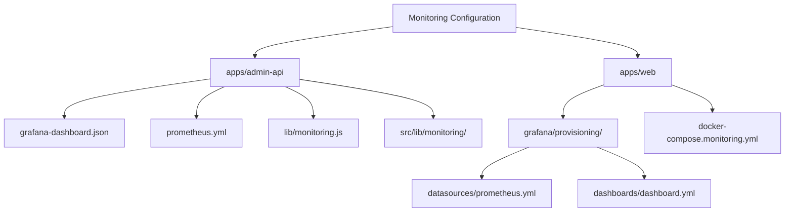
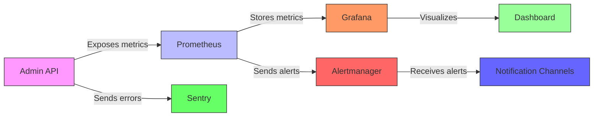
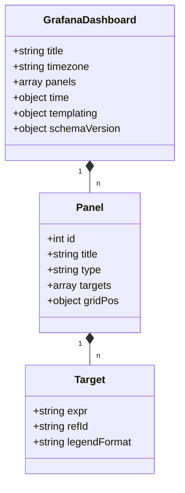
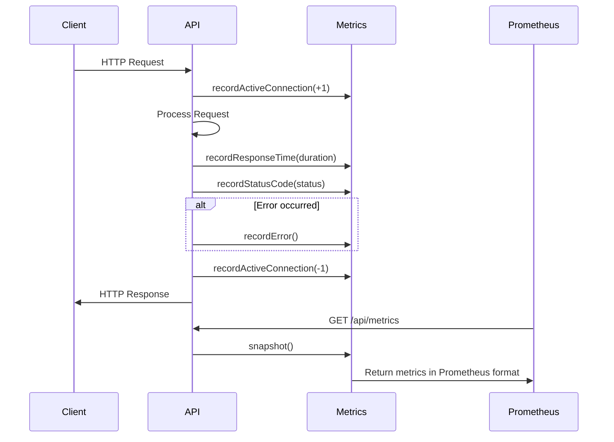
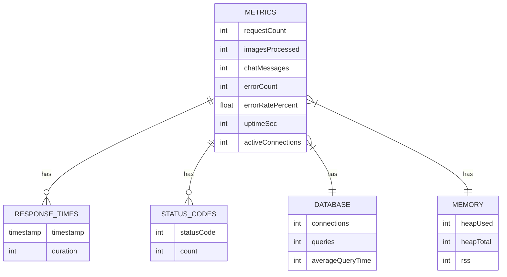
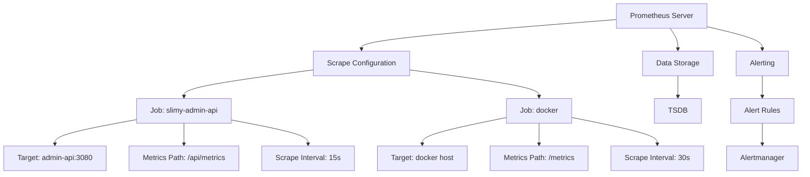
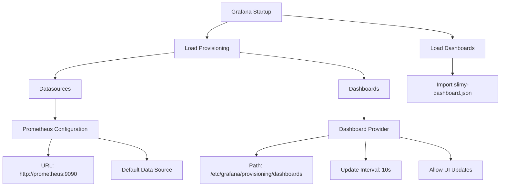
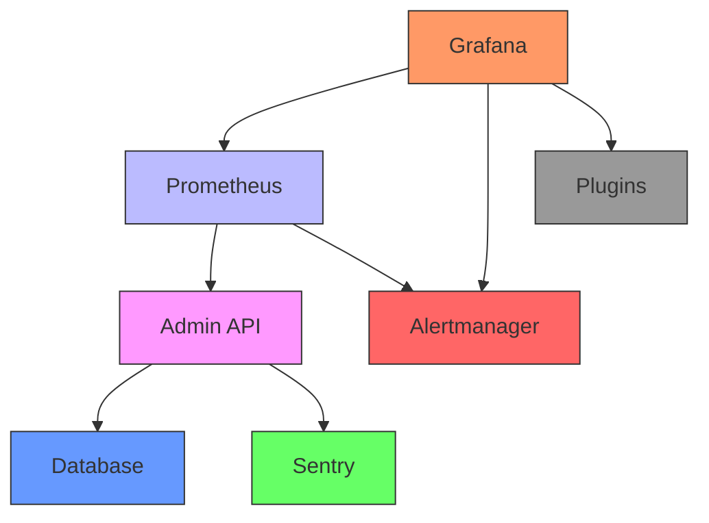

# Dashboard Visualization

<cite>
**Referenced Files in This Document**   
- [grafana-dashboard.json](file://apps/admin-api/grafana-dashboard.json)
- [grafana-dashboard.json](file://apps/admin-api/monitoring/dashboards/grafana-dashboard.json)
- [prometheus.yml](file://apps/admin-api/prometheus.yml)
- [prometheus.yml](file://apps/web/grafana/provisioning/datasources/prometheus.yml)
- [dashboard.yml](file://apps/web/grafana/provisioning/dashboards/dashboard.yml)
- [metrics.js](file://apps/admin-api/src/lib/monitoring/metrics.js)
- [metrics.ts](file://apps/admin-api/src/lib/monitoring/metrics.ts)
- [monitoring.js](file://apps/admin-api/lib/monitoring.js)
- [alerts.js](file://apps/admin-api/src/lib/alerts.js)
- [docker-compose.monitoring.yml](file://apps/web/docker-compose.monitoring.yml)
- [MONITORING_README.md](file://apps/admin-api/MONITORING_README.md)
- [MONITORING_SETUP_GUIDE.md](file://apps/admin-api/MONITORING_SETUP_GUIDE.md)
</cite>

## Table of Contents
1. [Introduction](#introduction)
2. [Project Structure](#project-structure)
3. [Core Components](#core-components)
4. [Architecture Overview](#architecture-overview)
5. [Detailed Component Analysis](#detailed-component-analysis)
6. [Dependency Analysis](#dependency-analysis)
7. [Performance Considerations](#performance-considerations)
8. [Troubleshooting Guide](#troubleshooting-guide)
9. [Conclusion](#conclusion)

## Introduction
This document provides comprehensive guidance on dashboard visualization using Grafana within the slimy-monorepo platform. It details the configuration and import process for the `grafana-dashboard.json` file, data source setup with Prometheus, and explains the key panels and visualization choices used in monitoring the Slimy Admin API. The documentation covers dashboard templating, sharing practices, version control, and troubleshooting steps for common issues.

## Project Structure
The monitoring and dashboard visualization components are organized within the slimy-monorepo platform with a clear structure that separates configuration files, dashboard definitions, and metrics collection logic. The Grafana dashboard configuration is maintained in multiple locations for both development and production environments.

**Diagram sources**
- [grafana-dashboard.json](file://apps/admin-api/grafana-dashboard.json)
- [prometheus.yml](file://apps/admin-api/prometheus.yml)
- [prometheus.yml](file://apps/web/grafana/provisioning/datasources/prometheus.yml)
- [dashboard.yml](file://apps/web/grafana/provisioning/dashboards/dashboard.yml)

**Section sources**
- [grafana-dashboard.json](file://apps/admin-api/grafana-dashboard.json)
- [prometheus.yml](file://apps/admin-api/prometheus.yml)
- [prometheus.yml](file://apps/web/grafana/provisioning/datasources/prometheus.yml)
- [dashboard.yml](file://apps/web/grafana/provisioning/dashboards/dashboard.yml)

## Core Components
The dashboard visualization system in the slimy-monorepo platform consists of several core components that work together to provide comprehensive monitoring capabilities. The system is built around Prometheus for metrics collection and Grafana for visualization, with the Admin API exposing metrics in Prometheus format.

The key components include the Grafana dashboard definition file (`grafana-dashboard.json`), Prometheus configuration for scraping metrics from the Admin API, and the metrics collection implementation within the application code. The system also includes alerting configuration through Alertmanager and automated provisioning for Grafana data sources and dashboards.

**Section sources**
- [grafana-dashboard.json](file://apps/admin-api/grafana-dashboard.json)
- [prometheus.yml](file://apps/admin-api/prometheus.yml)
- [metrics.js](file://apps/admin-api/src/lib/monitoring/metrics.js)
- [metrics.ts](file://apps/admin-api/src/lib/monitoring/metrics.ts)

## Architecture Overview
The monitoring architecture follows a standard observability pattern with the Admin API exposing metrics, Prometheus scraping and storing these metrics, and Grafana visualizing them through dashboards. The system is designed to be deployed both in development and production environments with appropriate configuration.

**Diagram sources**
- [docker-compose.monitoring.yml](file://apps/web/docker-compose.monitoring.yml)
- [prometheus.yml](file://apps/admin-api/prometheus.yml)
- [grafana-dashboard.json](file://apps/admin-api/grafana-dashboard.json)

## Detailed Component Analysis

### Grafana Dashboard Configuration
The Grafana dashboard configuration is defined in the `grafana-dashboard.json` file, which contains all panel definitions, layout, and visualization settings for monitoring the Slimy Admin API.

**Diagram sources**
- [grafana-dashboard.json](file://apps/admin-api/grafana-dashboard.json)
- [grafana-dashboard.json](file://apps/admin-api/monitoring/dashboards/grafana-dashboard.json)

#### Key Dashboard Panels
The dashboard includes several key panels that monitor different aspects of the system:

1. **Service Health**: Displays the current status of the service using a single-stat panel with color-coded mapping (green for UP, red for DOWN)
2. **Uptime**: Shows service uptime in hours, calculated from the service start time
3. **Error Rate**: Displays the current error rate as a percentage with threshold-based coloring (green < 5%, orange 5-10%, red > 10%)
4. **Active Connections**: Shows the number of currently active connections to the service
5. **Response Time Percentiles**: Graph showing P50, P95, and P99 response times over time
6. **Request Rate**: Time series graph of requests per second
7. **HTTP Status Codes**: Table showing the distribution of HTTP status codes
8. **Memory Usage**: Graph showing heap memory usage (used vs total)
9. **Database Performance**: Dual-axis graph showing database connections and average query time
10. **Application Metrics**: Graph showing business-specific metrics like images processed and chat messages
11. **Error Trends**: Time series graph of errors per second

**Section sources**
- [grafana-dashboard.json](file://apps/admin-api/grafana-dashboard.json)
- [MONITORING_README.md](file://apps/admin-api/MONITORING_README.md)

### Metrics Collection Implementation
The metrics collection is implemented in the Admin API through the metrics.js and metrics.ts files, which track various performance and business metrics.

**Diagram sources**
- [metrics.js](file://apps/admin-api/src/lib/monitoring/metrics.js)
- [metrics.ts](file://apps/admin-api/src/lib/monitoring/metrics.ts)
- [monitoring.js](file://apps/admin-api/lib/monitoring.js)

#### Metrics Data Model
The metrics system collects and exposes various types of metrics for monitoring:

**Diagram sources**
- [metrics.js](file://apps/admin-api/src/lib/monitoring/metrics.js)
- [metrics.ts](file://apps/admin-api/src/lib/monitoring/metrics.ts)

### Prometheus Configuration
The Prometheus configuration is defined in the prometheus.yml file, which specifies how Prometheus should scrape metrics from the Admin API and other services.

**Diagram sources**
- [prometheus.yml](file://apps/admin-api/prometheus.yml)
- [docker-compose.monitoring.yml](file://apps/web/docker-compose.monitoring.yml)

### Grafana Provisioning
The Grafana provisioning configuration ensures that data sources and dashboards are automatically configured when Grafana starts up.

**Diagram sources**
- [prometheus.yml](file://apps/web/grafana/provisioning/datasources/prometheus.yml)
- [dashboard.yml](file://apps/web/grafana/provisioning/dashboards/dashboard.yml)

## Dependency Analysis
The dashboard visualization system has several dependencies between components that must be properly configured for the system to function correctly.

**Diagram sources**
- [docker-compose.monitoring.yml](file://apps/web/docker-compose.monitoring.yml)
- [prometheus.yml](file://apps/admin-api/prometheus.yml)
- [grafana-dashboard.json](file://apps/admin-api/grafana-dashboard.json)

## Performance Considerations
The dashboard visualization system is designed with performance in mind, both in terms of the monitoring system itself and the impact on the monitored application.

The metrics collection uses a sliding window approach for response time tracking, keeping only the most recent 1,000 response times to limit memory usage. The system exposes metrics via a dedicated endpoint (/api/metrics) that returns data in Prometheus format, which is optimized for scraping efficiency.

The dashboard is configured with a 30-second refresh interval to balance real-time monitoring with system load. Time ranges are set to show the last hour by default, with the ability to adjust as needed. Panel queries use appropriate range vectors (e.g., [5m] for rate calculations) to ensure accurate metrics representation.

**Section sources**
- [metrics.js](file://apps/admin-api/src/lib/monitoring/metrics.js)
- [grafana-dashboard.json](file://apps/admin-api/grafana-dashboard.json)

## Troubleshooting Guide
This section provides guidance for troubleshooting common issues with the dashboard visualization system.

### Missing Data in Panels
If panels are not showing data, check the following:

1. Verify that the Admin API is running and accessible at the configured target (admin-api:3080)
2. Confirm that the /api/metrics endpoint is accessible and returning data
3. Check Prometheus targets page (http://localhost:9090/targets) to ensure the slimy-admin-api job is healthy
4. Verify that the metrics endpoint is being scraped successfully and there are no scrape errors
5. Check that the metric names in the dashboard queries match the actual metrics exposed by the application

### Configuration Synchronization
To ensure configuration synchronization across environments:

1. Use the same dashboard JSON file across all environments (development, staging, production)
2. Ensure Prometheus scrape configurations are consistent across environments
3. Use environment variables for configurable values like service names and thresholds
4. Store dashboard and monitoring configurations in version control
5. Use the provisioning system to automatically deploy dashboards and data sources

### Alerting Issues
If alerts are not firing as expected:

1. Verify that the alert thresholds in alerts.js match the expected values
2. Check that the alert checking function is running (look for logs indicating alert monitoring)
3. Verify that the cooldown period (5 minutes) is not preventing alert triggering
4. Check that the metrics being evaluated are being collected correctly
5. Ensure that the alert states are being updated properly when conditions change

**Section sources**
- [grafana-dashboard.json](file://apps/admin-api/grafana-dashboard.json)
- [prometheus.yml](file://apps/admin-api/prometheus.yml)
- [alerts.js](file://apps/admin-api/src/lib/alerts.js)
- [MONITORING_README.md](file://apps/admin-api/MONITORING_README.md)

## Conclusion
The dashboard visualization system in the slimy-monorepo platform provides comprehensive monitoring capabilities for the Admin API through a well-structured integration of Grafana, Prometheus, and application-level metrics collection. The system offers real-time visibility into service health, performance metrics, and business KPIs through a carefully designed dashboard with multiple panel types optimized for different data visualization needs.

The configuration is designed to be easily deployable in both development and production environments, with automated provisioning ensuring consistency across deployments. The system includes alerting capabilities through both application-level alert checking and Prometheus alert rules, providing multiple layers of monitoring coverage.

By following the documented setup procedures and understanding the component interactions, teams can effectively monitor the health and performance of the Slimy Admin API and quickly identify and resolve issues as they arise.