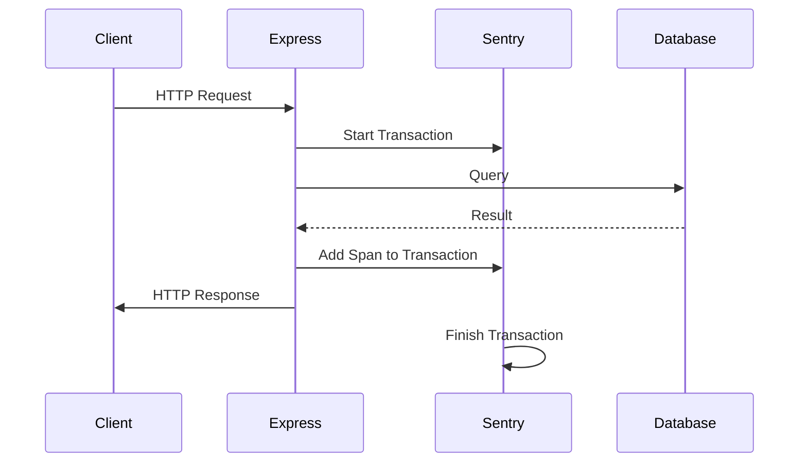

# Error Tracking

<cite>
**Referenced Files in This Document**   
- [sentry.js](file://apps/admin-api/src/lib/monitoring/sentry.js)
- [sentry.js](file://apps/admin-api/src/lib/sentry.js)
- [config/index.js](file://apps/admin-api/src/lib/config/index.js)
- [error-handler.js](file://apps/admin-api/src/middleware/error-handler.js)
- [logger.js](file://apps/admin-api/src/lib/logger.js)
- [ERROR_HANDLING.md](file://apps/admin-api/ERROR_HANDLING.md)
</cite>

## Table of Contents
1. [Introduction](#introduction)
2. [Sentry Integration Setup](#sentry-integration-setup)
3. [Error Capture and Context Enrichment](#error-capture-and-context-enrichment)
4. [Performance Monitoring and Tracing](#performance-monitoring-and-tracing)
5. [Configuration and Sampling](#configuration-and-sampling)
6. [Security and Data Protection](#security-and-data-protection)
7. [Error Investigation Workflow](#error-investigation-workflow)
8. [CPU and Memory Profiling](#cpu-and-memory-profiling)
9. [Conclusion](#conclusion)

## Introduction
The slimy-monorepo platform implements comprehensive error tracking and monitoring using Sentry for both frontend and backend services. The system captures unhandled exceptions, promise rejections, and manual error reports with contextual debugging information through breadcrumbs. It provides transaction tracing for performance monitoring of critical paths and API endpoints, with configuration options for sampling rates, error grouping, and release health tracking. The platform also includes CPU and memory profiling capabilities for diagnosing performance issues. This documentation details the implementation and usage of Sentry across the platform's services.

## Sentry Integration Setup
The Sentry integration is implemented through the `sentry.js` module located in the admin-api service. The initialization process begins with checking for the presence of required configuration values, specifically the Sentry DSN (Data Source Name), which is loaded from environment variables or configuration files. If the DSN is not configured, the system logs a message indicating that Sentry initialization is skipped. When properly configured, Sentry is initialized with essential parameters including the DSN, environment (development, staging, or production), and release version, which is typically derived from the application version.

The integration includes the `nodeProfilingIntegration` from `@sentry/profiling-node`, enabling CPU and memory profiling capabilities. Environment-specific configuration sets different sampling rates for development and production environments, with higher sampling rates in development for comprehensive debugging and lower rates in production to minimize performance impact and data volume. The initialization function is designed to be idempotent, ensuring that multiple calls do not result in duplicate Sentry instances.

**Section sources**
- [sentry.js](file://apps/admin-api/src/lib/monitoring/sentry.js#L7-L50)
- [config/index.js](file://apps/admin-api/src/lib/config/index.js#L232-L240)

## Error Capture and Context Enrichment
The platform captures various types of errors including unhandled exceptions, promise rejections, and manual error reports. The error capture mechanism is implemented through middleware functions that intercept errors during request processing. When an error occurs, the system uses Sentry's `captureException` method within a scoped context to include relevant metadata. The error handler middleware automatically captures user information when available, attaching the user ID and username to the error report for better context during debugging.

Additional context is captured through tags that include request-specific information such as method, path, and request ID. The system provides utility functions like `captureError` and `captureMessage` that allow developers to manually report errors and informational messages with custom context. These functions iterate through provided context objects and attach each key-value pair as a tag in Sentry, enabling rich filtering and searching capabilities in the Sentry dashboard.

The implementation includes a filtering mechanism in the `beforeSend` callback that excludes certain non-actionable errors from being reported, such as client-side 4xx errors and timeout errors, to reduce noise in the error tracking system. This ensures that the team focuses on server-side issues that require attention.

**Section sources**
- [sentry.js](file://apps/admin-api/src/lib/monitoring/sentry.js#L73-L112)
- [sentry.js](file://apps/admin-api/src/lib/monitoring/sentry.js#L101-L112)
- [error-handler.js](file://apps/admin-api/src/middleware/error-handler.js#L17-L25)

## Performance Monitoring and Tracing
Performance monitoring is implemented through transaction tracing for critical paths and API endpoints. The system automatically creates transactions for each HTTP request using the `sentryRequestHandler` middleware, which starts a transaction with operation type "http.server" and a name combining the HTTP method and request path. The transaction is attached to the request object for potential use in downstream processing and is automatically finished when the response is completed, with the HTTP status code set on the transaction for performance analysis.

The platform supports manual transaction creation through the `startTransaction` utility function, allowing developers to trace specific code paths or background processes. These transactions can be named and categorized by operation type, providing granular performance insights. The system also captures performance metrics for database queries, HTTP requests, and cache operations through dedicated tracing helpers that create spans within transactions, enabling detailed breakdowns of execution time across different subsystems.

Transaction data includes duration, start and end times, and custom metadata, which can be used to identify performance bottlenecks. The integration with request IDs allows correlation between performance data and error reports, providing a comprehensive view of system behavior under different conditions.

**Diagram sources **
- [sentry.js](file://apps/admin-api/src/lib/monitoring/sentry.js#L50-L71)
- [sentry.js](file://apps/admin-api/src/lib/monitoring/sentry.js#L129-L138)

**Section sources**
- [sentry.js](file://apps/admin-api/src/lib/monitoring/sentry.js#L50-L71)
- [sentry.js](file://apps/admin-api/src/lib/monitoring/sentry.js#L129-L138)

## Configuration and Sampling
The Sentry configuration is managed through environment variables and the centralized configuration system in `config/index.js`. Key configuration parameters include the DSN, environment, release version, and sampling rates for both traces and profiles. The sampling rates are environment-aware, with development environments typically set to 100% sampling (1.0) to capture comprehensive data for debugging, while production environments use lower rates (0.1) to balance monitoring needs with performance and cost considerations.

The configuration also includes error filtering rules that prevent certain types of non-actionable errors from being reported to Sentry. These include client-side errors (4xx status codes) and timeout errors, which are often outside the control of the server team. This filtering reduces noise in the error tracking system and helps focus attention on genuine server-side issues that require resolution.

Release health tracking is implemented by including the application version in the Sentry initialization, allowing Sentry to correlate errors and performance issues with specific code deployments. This enables teams to identify regressions introduced in specific releases and track the stability of each version over time.

**Section sources**
- [config/index.js](file://apps/admin-api/src/lib/config/index.js#L232-L240)
- [sentry.js](file://apps/admin-api/src/lib/monitoring/sentry.js#L23-L24)

## Security and Data Protection
The platform implements several security measures to protect sensitive data when using Sentry for error tracking. The configuration includes automatic scrubbing of sensitive information from error reports, though specific implementation details would depend on Sentry's built-in data scrubbing features. The system is designed to avoid capturing personally identifiable information (PII) in error contexts, with careful consideration given to what data is included in error reports.

Authentication and authorization errors are handled with appropriate error messages that do not reveal sensitive system information. The error response format standardizes error messages while providing enough context for debugging without exposing implementation details. Request bodies and query parameters are selectively logged based on their sensitivity, with mechanisms in place to exclude potentially sensitive data from error reports.

The use of request IDs provides a way to trace issues without including sensitive user data in logs, as the request ID can be used to correlate logs across services while keeping individual log entries free of PII. This approach balances the need for effective debugging with the requirement to protect user privacy and comply with data protection regulations.

**Section sources**
- [ERROR_HANDLING.md](file://apps/admin-api/ERROR_HANDLING.md#L73-L87)
- [logger.js](file://apps/admin-api/src/lib/logger.js#L29-L48)

## Error Investigation Workflow
The error investigation workflow begins with the automatic capture of errors through the Sentry integration, which includes comprehensive context such as user information, request details, and stack traces. Developers can access the Sentry dashboard to view reported errors, filter them by environment, release, or error type, and examine the full stack trace along with associated breadcrumbs that provide contextual information about events leading up to the error.

Each error report includes a unique identifier and is grouped based on similarity, allowing teams to identify recurring issues versus isolated incidents. The integration with release tracking enables teams to determine when an error was first introduced and whether it correlates with a specific deployment. Issue assignment functionality in Sentry allows team members to take ownership of specific errors, with status tracking to monitor resolution progress.

The request ID system enables cross-service correlation of logs, allowing developers to trace a user request across multiple services and identify the source of issues in distributed systems. This is particularly valuable in microservices architectures where a single user action may involve multiple service calls. The combination of structured logging and error tracking provides a comprehensive toolkit for diagnosing and resolving issues efficiently.

**Section sources**
- [ERROR_HANDLING.md](file://apps/admin-api/ERROR_HANDLING.md#L103-L141)
- [logger.js](file://apps/admin-api/src/lib/logger.js#L110-L135)

## CPU and Memory Profiling
CPU and memory profiling capabilities are enabled through the `nodeProfilingIntegration` from `@sentry/profiling-node`, which is included in the Sentry initialization configuration. This integration allows the collection of performance profiles that show function call stacks and execution times, helping to identify performance bottlenecks and memory leaks in the application.

The profiling data is sampled based on the configured `profilesSampleRate`, which follows the same environment-based strategy as transaction sampling. In development environments, profiling is typically enabled at a higher rate to provide detailed performance insights during development and testing. In production, the sampling rate is reduced to minimize the performance overhead of profiling on live systems.

The collected profiles are transmitted to Sentry along with error reports and transaction data, where they can be viewed alongside stack traces and performance metrics. This integrated view allows developers to understand not only that an error occurred but also the performance characteristics of the system at the time of the error, providing valuable context for diagnosing intermittent or performance-related issues.

**Section sources**
- [sentry.js](file://apps/admin-api/src/lib/monitoring/sentry.js#L4-L5)
- [sentry.js](file://apps/admin-api/src/lib/monitoring/sentry.js#L19-L21)
- [sentry.js](file://apps/admin-api/src/lib/monitoring/sentry.js#L24-L25)

## Conclusion
The slimy-monorepo platform's error tracking implementation with Sentry provides comprehensive monitoring and debugging capabilities across its services. The integration captures errors with rich contextual information, enables performance monitoring through transaction tracing, and includes CPU and memory profiling for diagnosing performance issues. The configuration system allows for environment-specific settings, including sampling rates that balance monitoring needs with performance considerations. Security measures protect sensitive data while still providing sufficient context for effective debugging. The combination of automated error capture, structured logging, and request tracing creates a robust observability framework that supports efficient issue diagnosis and resolution.