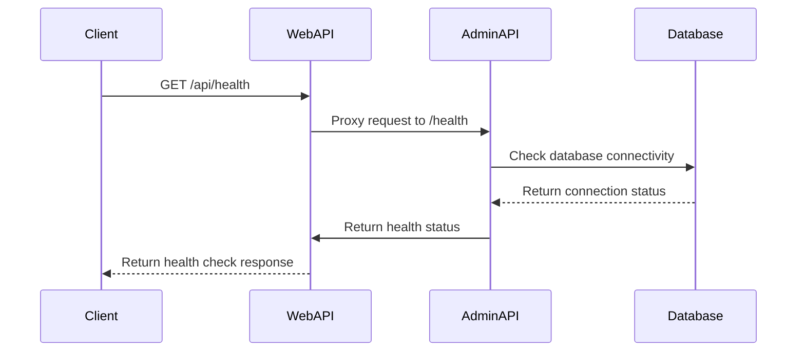
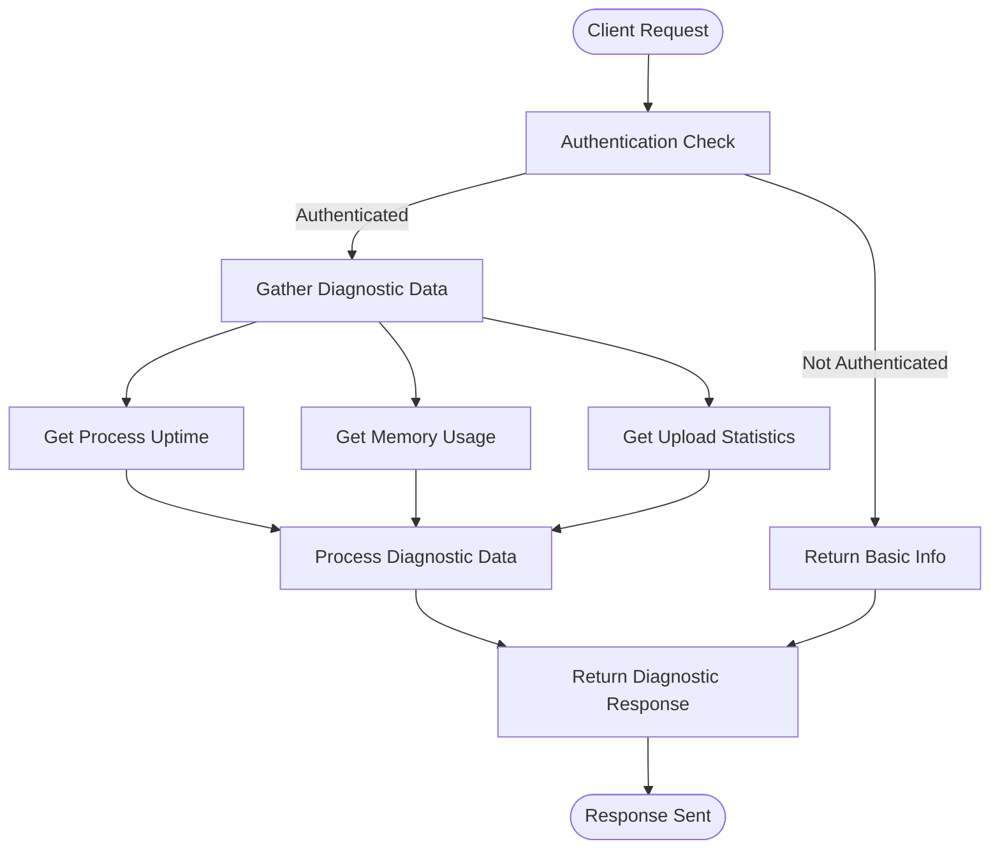
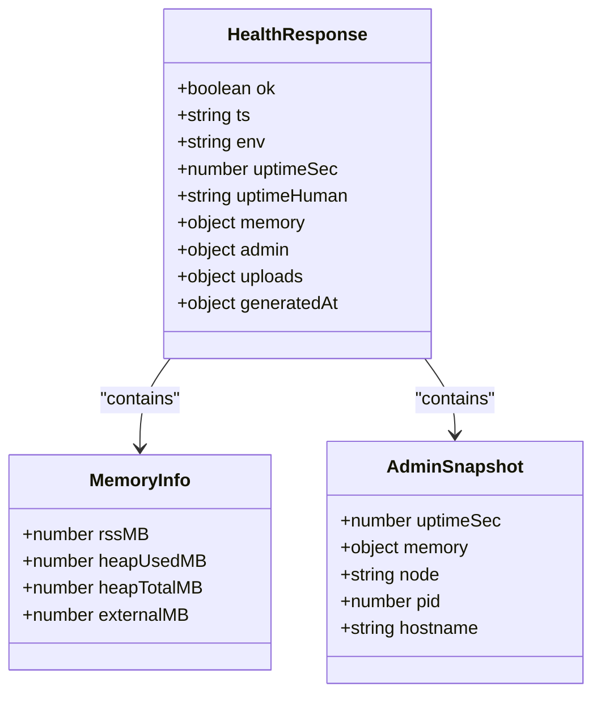
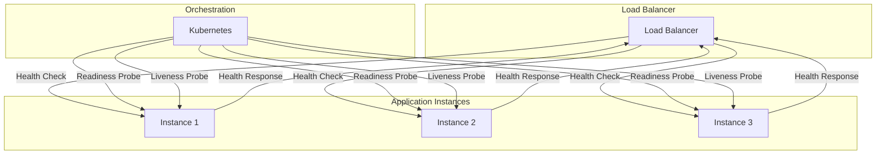
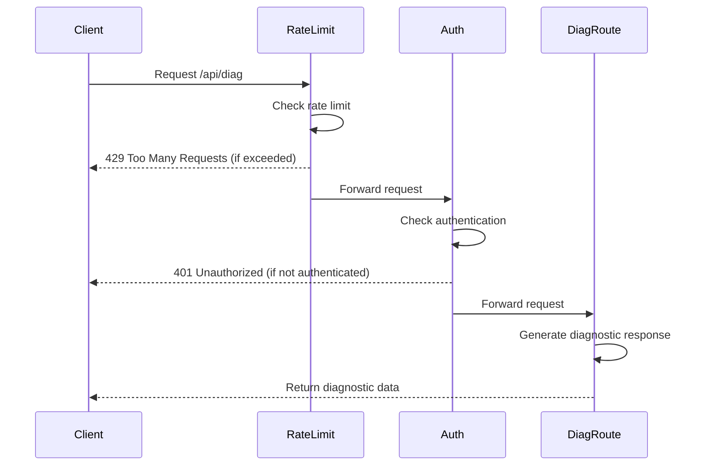
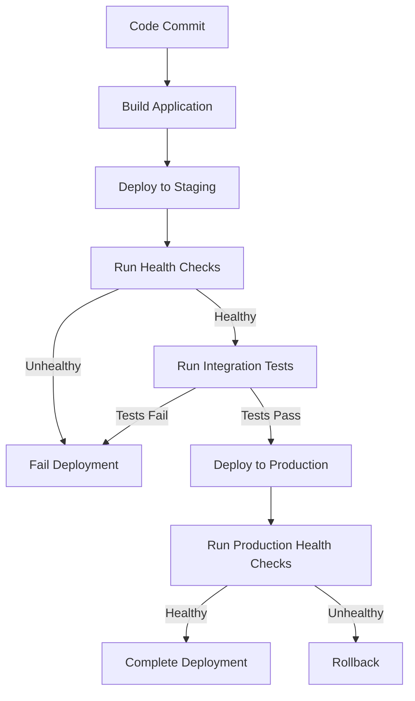
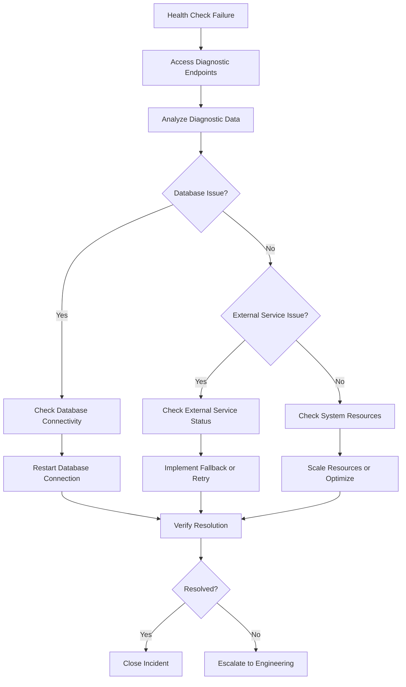

# Health Checks and Diagnostics

<cite>
**Referenced Files in This Document**   
- [health.js](file://apps/admin-api/src/services/health.js)
- [diag.js](file://apps/admin-api/src/routes/diag.js)
- [diagnostics.js](file://apps/admin-api/src/routes/diagnostics.js)
- [health.test.js](file://apps/admin-api/tests/integration/health.test.js)
- [database.js](file://apps/admin-api/lib/database.js)
- [auth.js](file://apps/admin-api/src/middleware/auth.js)
- [rate-limit.js](file://apps/admin-api/src/middleware/rate-limit.js)
- [api-client.ts](file://apps/web/lib/api-client.ts)
- [route.ts](file://apps/web/app/api/health/route.ts)
- [route.ts](file://apps/web/app/api/diag/route.ts)
- [redis.js](file://apps/admin-api/lib/cache/redis.js)
- [queue-manager.js](file://apps/admin-api/lib/queue-manager.js)
</cite>

## Table of Contents
1. [Introduction](#introduction)
2. [Health Check Implementation](#health-check-implementation)
3. [Diagnostic Routes](#diagnostic-routes)
4. [Health Check Response Format](#health-check-response-format)
5. [Integration with Load Balancers and Orchestration](#integration-with-load-balancers-and-orchestration)
6. [Diagnostic Output Examples](#diagnostic-output-examples)
7. [Security Considerations](#security-considerations)
8. [Deployment Pipeline Integration](#deployment-pipeline-integration)
9. [Troubleshooting Workflows](#troubleshooting-workflows)
10. [Conclusion](#conclusion)

## Introduction
The slimy-monorepo platform implements comprehensive health checks and diagnostic tools to ensure system reliability, monitor component health, and facilitate troubleshooting. This document details the implementation of health endpoints, diagnostic routes, response formats, and integration with infrastructure components. The system provides visibility into database connectivity, external service availability, and system resource status, enabling proactive monitoring and rapid incident response.

## Health Check Implementation

The health check system in the slimy-monorepo platform is implemented through multiple endpoints that verify the health of various system components. The primary health check functionality is located in the `health.js` service, which performs database connectivity checks and retrieves component health information.

The `/health` endpoint implementation verifies database connectivity by checking if the database is properly configured and accessible. It queries the database to retrieve aggregate statistics and snapshot information for a specific guild, ensuring that the database connection is functional and responsive.



**Diagram sources**
- [health.js](file://apps/admin-api/src/services/health.js)
- [database.js](file://apps/admin-api/lib/database.js)
- [route.ts](file://apps/web/app/api/health/route.ts)

**Section sources**
- [health.js](file://apps/admin-api/src/services/health.js#L1-L63)
- [database.js](file://apps/admin-api/lib/database.js#L1-L680)

## Diagnostic Routes

The diagnostic routes in `diag.js` provide detailed system information for troubleshooting purposes. These routes expose system metrics such as uptime, memory usage, process information, and upload statistics. The `/api/diag` endpoint returns comprehensive diagnostic information when accessed by authenticated users.

The diagnostic system includes two main routes:
1. `/api/diag` - Returns basic diagnostic information including uptime, memory usage, and upload statistics
2. `/api/diagnostics` - Returns more detailed diagnostic information with caching mechanism

The diagnostic routes are protected by authentication middleware, ensuring that sensitive system information is only accessible to authorized users. The implementation includes error handling to prevent system crashes when diagnostic data cannot be retrieved.



**Diagram sources**
- [diag.js](file://apps/admin-api/src/routes/diag.js)
- [diagnostics.js](file://apps/admin-api/src/routes/diagnostics.js)
- [auth.js](file://apps/admin-api/src/middleware/auth.js)

**Section sources**
- [diag.js](file://apps/admin-api/src/routes/diag.js#L1-L55)
- [diagnostics.js](file://apps/admin-api/src/routes/diagnostics.js#L1-L79)

## Health Check Response Format

The health check response format includes comprehensive information about the system's status, uptime, version, and component health breakdown. The response structure is standardized across different health endpoints to ensure consistency.

The response includes the following key components:
- **Status**: A boolean indicating overall health status
- **Uptime**: System uptime in seconds and human-readable format
- **Version**: Application version information
- **Component Health**: Breakdown of individual component health status
- **Timestamp**: ISO timestamp of when the health check was performed
- **Environment**: Current deployment environment

For the `/health` endpoint, the response includes guild-specific information such as member count, power statistics, and synchronization status. The diagnostic endpoints provide additional system-level information including memory usage, process ID, and hostname.



**Diagram sources**
- [health.js](file://apps/admin-api/src/services/health.js)
- [diag.js](file://apps/admin-api/src/routes/diag.js)
- [diagnostics.js](file://apps/admin-api/src/routes/diagnostics.js)

**Section sources**
- [health.js](file://apps/admin-api/src/services/health.js#L47-L57)
- [diag.js](file://apps/admin-api/src/routes/diag.js#L10-L19)
- [diagnostics.js](file://apps/admin-api/src/routes/diagnostics.js#L50-L63)

## Integration with Load Balancers and Orchestration

The health check system is integrated with load balancers and container orchestration platforms to enable automatic failover and ensure high availability. The `/health` endpoint is designed to be lightweight and fast, making it suitable for frequent polling by load balancers.

The health check endpoints return HTTP status code 200 for healthy instances and non-200 status codes for unhealthy instances, allowing load balancers to automatically route traffic away from failing instances. The response includes cache control headers to optimize performance and reduce load on the health check endpoints.

Container orchestration platforms such as Kubernetes can use the health check endpoints as readiness and liveness probes to determine when to route traffic to a container and when to restart a failing container. The health check response includes environment information that helps orchestration platforms make routing decisions based on deployment environments.



**Diagram sources**
- [route.ts](file://apps/web/app/api/health/route.ts)
- [health.js](file://apps/admin-api/src/services/health.js)
- [database.js](file://apps/admin-api/lib/database.js)

**Section sources**
- [route.ts](file://apps/web/app/api/health/route.ts#L1-L19)
- [health.js](file://apps/admin-api/src/services/health.js#L14-L18)

## Diagnostic Output Examples

The diagnostic endpoints provide detailed output showing various system metrics and component statuses. Here are examples of diagnostic outputs for different system components:

**Database Connection Status:**
```json
{
  "ok": true,
  "uptimeSec": 3600,
  "memory": {
    "rssMb": 150.5,
    "heapUsedMb": 80.2
  },
  "node": "v18.17.0",
  "pid": 12345,
  "hostname": "slimy-server-01",
  "database": {
    "connected": true,
    "poolSize": 10,
    "activeConnections": 3
  }
}
```

**Cache Health:**
```json
{
  "ok": true,
  "cache": {
    "type": "mock",
    "status": "available",
    "statistics": {
      "hits": 1500,
      "misses": 200,
      "hitRatio": 0.88
    }
  }
}
```

**Queue Processor Status:**
```json
{
  "ok": true,
  "queues": {
    "audit-processor": {
      "jobs": 0,
      "status": "idle"
    },
    "chat-processor": {
      "jobs": 5,
      "status": "processing"
    },
    "database-processor": {
      "jobs": 0,
      "status": "idle"
    }
  }
}
```

**Section sources**
- [diag.js](file://apps/admin-api/src/routes/diag.js#L42-L47)
- [diagnostics.js](file://apps/admin-api/src/routes/diagnostics.js#L50-L63)
- [redis.js](file://apps/admin-api/lib/cache/redis.js)
- [queue-manager.js](file://apps/admin-api/lib/queue-manager.js)

## Security Considerations

The diagnostic endpoints are protected with authentication and rate limiting to prevent unauthorized access and abuse. The `/api/diag` and `/api/diagnostics` routes require user authentication, ensuring that sensitive system information is only accessible to authorized users.

Authentication is implemented using JWT tokens and session management. The system checks for valid session tokens in cookies and validates them against the database. Users must be authenticated to access detailed diagnostic information, while unauthenticated users receive only basic health information.

Rate limiting is applied to diagnostic endpoints to prevent denial-of-service attacks and excessive resource consumption. The rate limiting configuration is defined in `rate-limit.js` and applies different limits based on user roles and IP addresses. The rate limiter uses a sliding window algorithm to prevent abuse while allowing legitimate diagnostic requests.



**Diagram sources**
- [auth.js](file://apps/admin-api/src/middleware/auth.js)
- [rate-limit.js](file://apps/admin-api/src/middleware/rate-limit.js)
- [diag.js](file://apps/admin-api/src/routes/diag.js)

**Section sources**
- [auth.js](file://apps/admin-api/src/middleware/auth.js#L237-L243)
- [rate-limit.js](file://apps/admin-api/src/middleware/rate-limit.js#L7-L22)
- [diag.js](file://apps/admin-api/src/routes/diag.js#L22-L33)

## Deployment Pipeline Integration

Health checks are integrated into deployment pipelines and canary release processes to ensure smooth deployments and rapid rollback when issues are detected. During deployment, health checks are used to verify that new instances are functioning correctly before routing traffic to them.

In canary releases, health checks monitor the new version's performance and stability compared to the current production version. If health checks detect issues with the canary version, traffic can be automatically routed back to the stable version.

The health check system is also used in automated testing pipelines to verify that the application is functioning correctly after code changes. Integration tests validate that health endpoints return expected responses and that all system components are properly initialized.



**Diagram sources**
- [health.test.js](file://apps/admin-api/tests/integration/health.test.js)
- [route.ts](file://apps/web/app/api/health/route.ts)
- [health.js](file://apps/admin-api/src/services/health.js)

**Section sources**
- [health.test.js](file://apps/admin-api/tests/integration/health.test.js)
- [route.ts](file://apps/web/app/api/health/route.ts#L5-L18)

## Troubleshooting Workflows

The health check and diagnostic system supports troubleshooting workflows for common failure scenarios. When issues are detected, the system provides detailed information to help identify and resolve problems quickly.

For database connectivity issues, the health check system verifies database configuration and attempts to establish a connection. If the database is unreachable, the health check returns an error response with details about the connection failure. Administrators can use diagnostic endpoints to check database connection status and review recent database operations.

For external API outages, the system monitors the availability of external services and provides status information through diagnostic endpoints. When an external service is unavailable, the system logs the error and may implement fallback mechanisms to maintain functionality.

The troubleshooting workflow includes the following steps:
1. Monitor health check endpoints for failures
2. Access diagnostic endpoints to gather detailed system information
3. Identify the affected component based on diagnostic data
4. Apply appropriate remediation steps
5. Verify resolution through subsequent health checks



**Diagram sources**
- [health.js](file://apps/admin-api/src/services/health.js)
- [diag.js](file://apps/admin-api/src/routes/diag.js)
- [database.js](file://apps/admin-api/lib/database.js)

**Section sources**
- [health.js](file://apps/admin-api/src/services/health.js#L14-L18)
- [diag.js](file://apps/admin-api/src/routes/diag.js#L35-L47)
- [database.js](file://apps/admin-api/lib/database.js#L12-L48)

## Conclusion
The health checks and diagnostic tools in the slimy-monorepo platform provide comprehensive monitoring and troubleshooting capabilities. The system verifies database connectivity, external service availability, and system resource status through well-designed health endpoints. Diagnostic routes offer detailed system information for administrators and support personnel. The health check response format includes essential information for monitoring and alerting systems. Integration with load balancers and container orchestration enables automatic failover and ensures high availability. Security measures protect diagnostic endpoints from unauthorized access and abuse. The system is integrated into deployment pipelines and canary release processes to ensure smooth deployments. Troubleshooting workflows leverage health check and diagnostic data to quickly identify and resolve issues, minimizing downtime and maintaining system reliability.