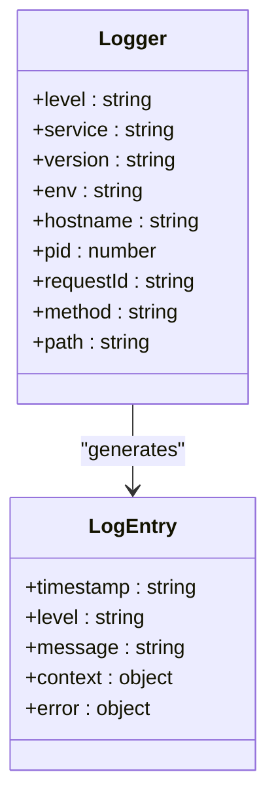
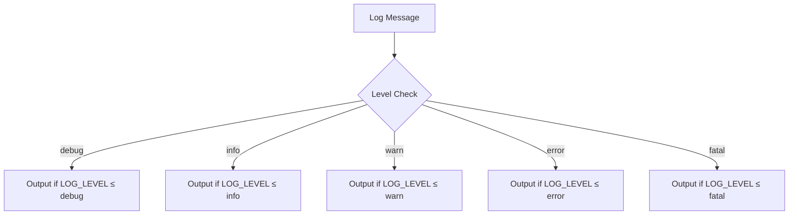
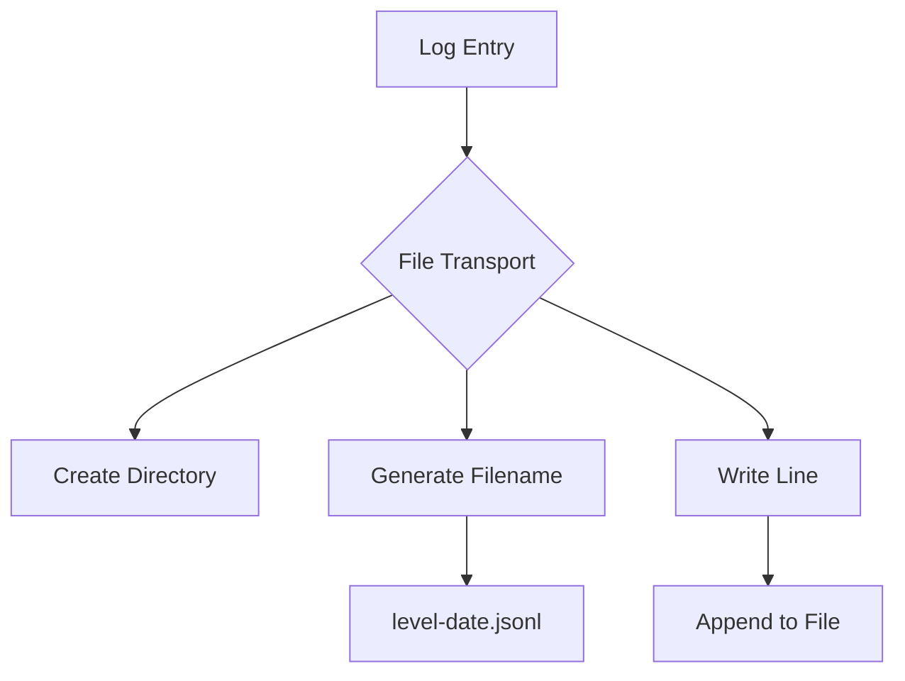
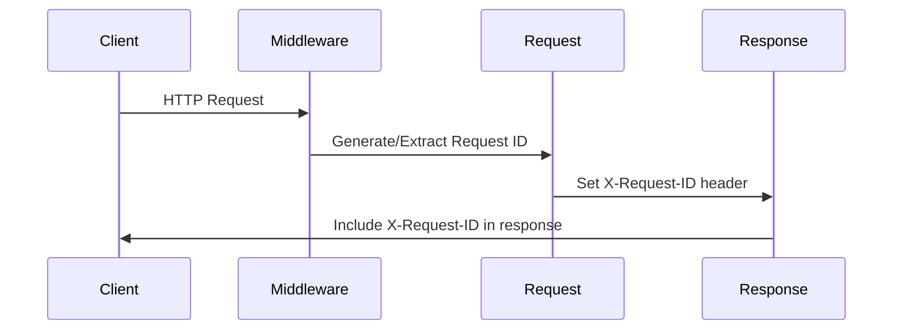
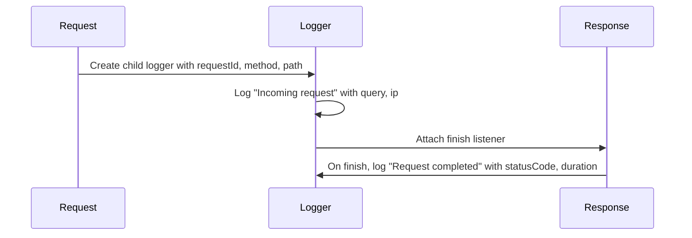
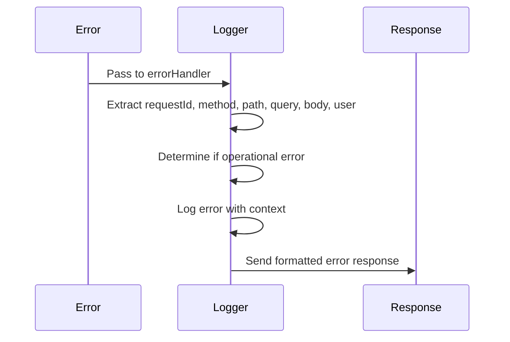
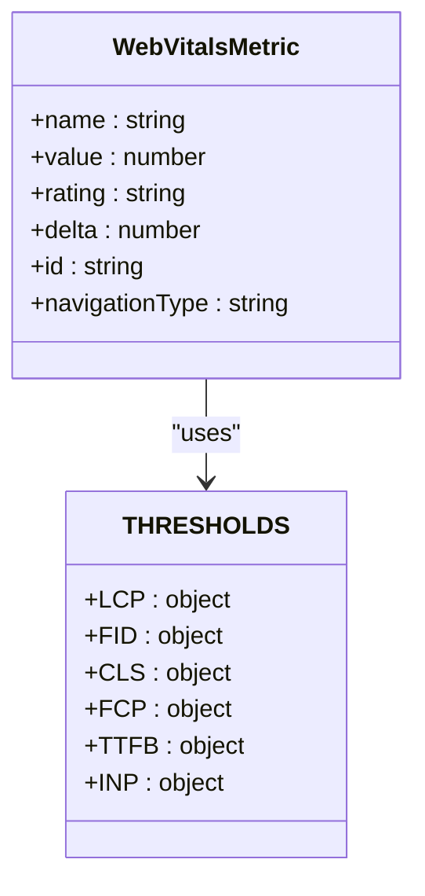
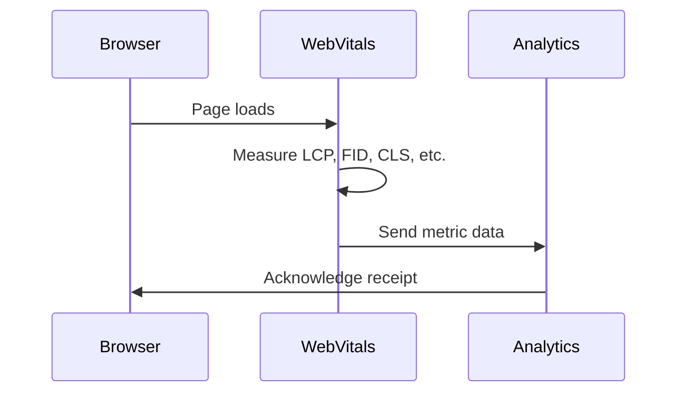

# Logging Strategy

<cite>
**Referenced Files in This Document**   
- [logger.js](file://apps/admin-api/src/lib/logger.js)
- [logger.ts](file://apps/bot/src/lib/logger.ts)
- [logger.ts](file://apps/web/lib/monitoring/logger.ts)
- [request-id.js](file://apps/admin-api/src/middleware/request-id.js)
- [error-handler.js](file://apps/admin-api/src/middleware/error-handler.js)
- [web-vitals.ts](file://apps/web/lib/monitoring/web-vitals.ts)
- [apm.ts](file://apps/web/lib/monitoring/apm.ts)
- [common.ts](file://apps/web/lib/types/common.ts)
</cite>

## Table of Contents
1. [Introduction](#introduction)
2. [Structured Logging Implementation](#structured-logging-implementation)
3. [Log Levels and Usage Patterns](#log-levels-and-usage-patterns)
4. [Log Rotation and Retention Policies](#log-rotation-and-retention-policies)
5. [Middleware Integration and Context Capture](#middleware-integration-and-context-capture)
6. [Error Context Capture](#error-context-capture)
7. [Log Aggregation and Future ELK Integration](#log-aggregation-and-future-elk-integration)
8. [Log Filtering and Troubleshooting](#log-filtering-and-troubleshooting)
9. [Web Vitals Monitoring](#web-vitals-monitoring)
10. [Conclusion](#conclusion)

## Introduction
The slimy-monorepo platform implements a comprehensive logging strategy across its services to ensure observability, debugging capabilities, and performance monitoring. The logging system is designed with structured JSON format as its foundation, providing consistent fields for timestamp, log level, message, and contextual metadata. This document details the implementation of logging across the platform's various components, including the admin API, bot service, and web application.

**Section sources**
- [logger.js](file://apps/admin-api/src/lib/logger.js#L1-L169)
- [logger.ts](file://apps/bot/src/lib/logger.ts#L1-L93)
- [logger.ts](file://apps/web/lib/monitoring/logger.ts#L1-L310)

## Structured Logging Implementation
The platform employs structured logging with JSON format across all services, ensuring consistency and machine-readability of log data. Each service implements its own logging solution while maintaining common patterns and fields.

The admin API uses Pino as its primary logging library, configured to output structured JSON logs with consistent fields including timestamp, level, message, and contextual metadata. The logger automatically includes service context such as service name, version, environment, hostname, and process ID in all log entries.



**Diagram sources**
- [logger.js](file://apps/admin-api/src/lib/logger.js#L8-L28)
- [common.ts](file://apps/web/lib/types/common.ts#L109-L119)

The web application implements a custom structured logger class that supports multiple transports (console and file) and provides type-safe logging with TypeScript. The logger writes to JSONL (JSON Lines) format files, with separate files for each log level and date.

The bot service uses a simpler structured logging approach with a custom logger that formats messages with timestamp, level, and optional context in a consistent pattern. While not using a dedicated logging library, it maintains the structured approach with key-value pairs in the log output.

**Section sources**
- [logger.js](file://apps/admin-api/src/lib/logger.js#L3-L28)
- [logger.ts](file://apps/web/lib/monitoring/logger.ts#L8-L23)
- [logger.ts](file://apps/bot/src/lib/logger.ts#L1-L35)

## Log Levels and Usage Patterns
The platform utilizes a standard set of log levels across services, with consistent usage patterns to ensure predictable behavior and appropriate verbosity.

### Log Levels
The following log levels are implemented across the platform:

| Level | Purpose | Usage Pattern |
|-------|-------|-------------|
| debug | Detailed debugging information | Development and troubleshooting, typically disabled in production |
| info | General operational information | Normal application flow, successful operations |
| warn | Potential issues or unexpected behavior | Non-critical problems, deprecated features, recoverable errors |
| error | Errors that prevent specific operations | Failed operations, caught exceptions, system errors |
| fatal | Critical errors requiring immediate attention | System-wide failures, unrecoverable conditions |

The admin API and web application both implement all five log levels, while the bot service uses the first four (excluding fatal). Log levels are configurable via the `LOG_LEVEL` environment variable, with default values set based on the environment (debug in development, info in production).



**Diagram sources**
- [logger.js](file://apps/admin-api/src/lib/logger.js#L5-L6)
- [logger.ts](file://apps/web/lib/monitoring/logger.ts#L104-L124)
- [common.ts](file://apps/web/lib/types/common.ts#L104)

The usage patterns are consistent across services:
- **debug**: Used for detailed debugging information, parameter values, and internal state during development
- **info**: Records successful operations, system startup/shutdown, and important milestones
- **warn**: Indicates potential issues, deprecated features, or recoverable errors
- **error**: Logs errors that prevent specific operations from completing successfully
- **fatal**: Reserved for critical system failures that may require immediate intervention

**Section sources**
- [logger.js](file://apps/admin-api/src/lib/logger.js#L5-L6)
- [logger.ts](file://apps/web/lib/monitoring/logger.ts#L104-L124)
- [logger.ts](file://apps/bot/src/lib/logger.ts#L14)

## Log Rotation and Retention Policies
The platform implements log rotation and retention policies to manage disk space and ensure log data is available for appropriate periods.

### File-Based Logging
The web application implements file-based logging with JSONL format, with separate files for each log level and date. The file transport creates log files with the naming pattern `{level}-{date}.jsonl` in the configured log directory (default: 'logs').



**Diagram sources**
- [logger.ts](file://apps/web/lib/monitoring/logger.ts#L76-L104)

The file transport ensures the log directory exists and creates it if necessary. Each log entry is written as a separate line in the JSONL format, enabling efficient streaming and processing.

### Retention and Rotation
The current implementation relies on date-based file naming for log rotation, with a new file created each day for each log level. This provides automatic rotation without requiring additional rotation logic.

For retention, the platform does not implement automatic log cleanup in the logging system itself. Instead, retention is managed externally through:
- Infrastructure-level log rotation (e.g., Docker log drivers)
- Backup and archival processes
- Manual cleanup procedures

The audit logging system implements its own retention policy, with audit logs stored in date-based files in the `data/audit-logs` directory. These logs are retained for compliance purposes and are subject to separate archival procedures.

**Section sources**
- [logger.ts](file://apps/web/lib/monitoring/logger.ts#L84-L92)
- [audit-log.ts](file://apps/web/lib/audit-log.ts#L112-L115)

## Middleware Integration and Context Capture
The platform implements comprehensive middleware integration to capture contextual information and ensure consistent logging across requests.

### Request ID Middleware
The request ID middleware generates a unique identifier for each incoming request and propagates it through the request-response cycle. This enables distributed tracing and correlation of log entries across different services.



**Diagram sources**
- [request-id.js](file://apps/admin-api/src/middleware/request-id.js#L9-L25)

The middleware first checks for an existing `X-Request-ID` header in the incoming request. If present, it uses that value; otherwise, it generates a new UUID or falls back to a timestamp-based identifier. The request ID is added to both the request object and the response headers, ensuring it's available throughout the request lifecycle and visible to clients.

### Request Logging Middleware
The admin API implements request logging middleware that creates a child logger with request-specific context and logs both the start and completion of each request.



**Diagram sources**
- [logger.js](file://apps/admin-api/src/lib/logger.js#L110-L136)

The middleware creates a child logger with context including the request ID, HTTP method, and path. It logs the incoming request with details such as query parameters and client IP address. A listener is attached to the response's 'finish' event to log the completion of the request with the status code and duration.

The web application implements a similar request logger that generates a random request ID and captures user agent and IP information from request headers.

**Section sources**
- [logger.js](file://apps/admin-api/src/lib/logger.js#L110-L136)
- [request-id.js](file://apps/admin-api/src/middleware/request-id.js#L9-L25)
- [logger.ts](file://apps/web/lib/monitoring/logger.ts#L274-L308)

## Error Context Capture
The platform implements comprehensive error context capture to facilitate debugging and troubleshooting of issues.

### Error Handling Middleware
The error handling middleware in the admin API captures detailed context about errors and logs them appropriately based on their severity.



**Diagram sources**
- [error-handler.js](file://apps/admin-api/src/middleware/error-handler.js#L10-L82)

When an error occurs, the middleware extracts the request ID from the request and uses the request's logger if available, falling back to the default logger. It captures comprehensive context including the request method, path, query parameters, request body, and user ID. The error is logged using the `logError` function, which includes the error's name, message, code, status code, and stack trace.

The middleware distinguishes between operational errors (expected errors like validation failures) and non-operational errors (unexpected system errors), logging client errors (4xx) as warnings and server errors (5xx) as errors.

### Structured Error Logging
The logging system captures errors in a structured format with consistent fields:

```json
{
  "error": {
    "name": "ErrorType",
    "message": "Error message",
    "code": "ERROR_CODE",
    "statusCode": 500,
    "stack": "Stack trace"
  },
  "context": {
    "requestId": "req-123",
    "method": "GET",
    "path": "/api/users",
    "user": "user-456"
  }
}
```

This structured approach enables effective filtering, searching, and analysis of error logs.

**Section sources**
- [error-handler.js](file://apps/admin-api/src/middleware/error-handler.js#L18-L25)
- [logger.js](file://apps/admin-api/src/lib/logger.js#L141-L159)
- [errors.js](file://apps/admin-api/src/lib/errors.js#L6-L255)

## Log Aggregation and Future ELK Integration
The platform currently uses file-based and console logging, with plans for centralized log aggregation through ELK stack integration.

### Current Log Aggregation Challenges
The distributed nature of the logging implementation presents several challenges:

1. **Multiple Formats**: Different services use slightly different logging formats and structures
2. **Decentralized Storage**: Logs are stored locally on each server instance
3. **Limited Search Capabilities**: No centralized search across all services
4. **Retention Management**: Manual processes for log rotation and archival

The admin API's production configuration includes Datadog-specific fields in logs when a request ID is present, indicating existing integration with monitoring platforms:

```javascript
if (obj.requestId) {
  base.dd = {
    trace_id: obj.requestId,
    span_id: obj.requestId,
  };
}
```

This suggests partial integration with external monitoring systems, but not a comprehensive log aggregation solution.

### Future ELK Stack Integration
The platform has plans to implement ELK (Elasticsearch, Logstash, Kibana) stack integration for centralized log management. This will address the current challenges by:

1. **Centralized Storage**: All logs aggregated in a single Elasticsearch cluster
2. **Unified Search**: Kibana interface for searching and analyzing logs across services
3. **Advanced Filtering**: Complex queries and filters across structured log data
4. **Visualization**: Dashboards for monitoring system health and performance
5. **Alerting**: Automated alerts based on log patterns and error rates

The structured JSON format used by the logging system is well-suited for ELK integration, requiring minimal transformation for ingestion into Elasticsearch.

**Section sources**
- [logger.js](file://apps/admin-api/src/lib/logger.js#L81-L93)
- [logger.ts](file://apps/web/lib/monitoring/logger.ts#L76-L104)

## Log Filtering and Troubleshooting
The platform provides mechanisms for log filtering and troubleshooting common logging issues.

### Log Filtering
The logging system supports filtering through several mechanisms:

1. **Log Level Filtering**: Configurable via `LOG_LEVEL` environment variable
2. **Context-Based Filtering**: Logs can be filtered by specific context fields (requestId, userId, guildId)
3. **Service-Specific Filtering**: Different services can have independent log level configurations

The web application's logger implements a `shouldLog` method that determines whether a message should be logged based on the configured log level:

```javascript
private shouldLog(level: LogLevel): boolean {
  const levels: LogLevel[] = ['debug', 'info', 'warn', 'error', 'fatal'];
  const configLevel = levels.indexOf(this.config.level);
  const messageLevel = levels.indexOf(level);
  return messageLevel >= configLevel;
}
```

This ensures that only messages at or above the configured level are output.

### Troubleshooting Common Issues
The platform addresses common logging issues through various strategies:

#### Missing Context
To prevent missing context in logs, the system uses child loggers that inherit context from parent loggers. The `createLogger` function in the admin API creates child loggers with request-specific context:

```javascript
function createLogger(context = {}) {
  return logger.child(context);
}
```

This ensures that contextual information like request ID, user ID, and guild ID is consistently included in log entries.

#### Excessive Verbosity
To prevent excessive verbosity, especially in production, the system:
- Sets default log level to 'info' in production
- Limits debug logs to development environment
- Uses environment-specific configurations

The bot service implements environment-based debug logging:

```typescript
if (process.env.NODE_ENV !== 'production') {
  console.debug(formatLog('DEBUG', message, context));
}
```

This prevents debug logs from appearing in production environments.

**Section sources**
- [logger.js](file://apps/admin-api/src/lib/logger.js#L103-L105)
- [logger.ts](file://apps/web/lib/monitoring/logger.ts#L144-L149)
- [logger.ts](file://apps/bot/src/lib/logger.ts#L73-L75)

## Web Vitals Monitoring
The platform implements comprehensive web vitals monitoring to track frontend performance and user experience.

### Core Web Vitals Tracking
The web application tracks the following Core Web Vitals metrics:

- **LCP (Largest Contentful Paint)**: Measures loading performance
- **FID (First Input Delay)**: Measures interactivity
- **CLS (Cumulative Layout Shift)**: Measures visual stability
- **FCP (First Contentful Paint)**: Measures initial loading
- **TTFB (Time to First Byte)**: Measures server response time
- **INP (Interaction to Next Paint)**: Measures responsiveness



**Diagram sources**
- [web-vitals.ts](file://apps/web/lib/monitoring/web-vitals.ts#L13-L32)

The system uses the web-vitals library to collect these metrics and sends them to an analytics endpoint. Each metric is evaluated against predefined thresholds to determine its rating (good, needs-improvement, or poor).

### Data Collection and Transmission
Web vitals data is collected and transmitted using the following process:



**Diagram sources**
- [web-vitals.ts](file://apps/web/lib/monitoring/web-vitals.ts#L47-L82)

The data is sent to the `/api/web-vitals` endpoint using the `navigator.sendBeacon` method for reliability, with a fallback to `fetch` if sendBeacon is not available. The payload includes the metric name, value, rating, delta, ID, navigation type, URL, timestamp, user agent, connection type, and device memory.

The system also provides a snapshot capability to retrieve current web vitals values programmatically, which can be useful for debugging and performance testing.

**Section sources**
- [web-vitals.ts](file://apps/web/lib/monitoring/web-vitals.ts#L1-L207)

## Conclusion
The slimy-monorepo platform implements a robust logging strategy that balances structured data collection with practical implementation across multiple services. The use of JSON format with consistent fields enables effective log analysis and sets the foundation for future ELK stack integration.

Key strengths of the current logging implementation include:
- Structured JSON format for machine readability
- Consistent contextual metadata across services
- Comprehensive request and error context capture
- Environment-appropriate log levels and verbosity
- Support for distributed tracing via request IDs

Areas for improvement include:
- Centralized log aggregation to address current decentralization
- Standardization of log formats across all services
- Automated log rotation and retention policies
- Enhanced alerting based on log patterns

The foundation is well-established for evolving the logging system into a comprehensive observability platform that supports both operational monitoring and user experience optimization.