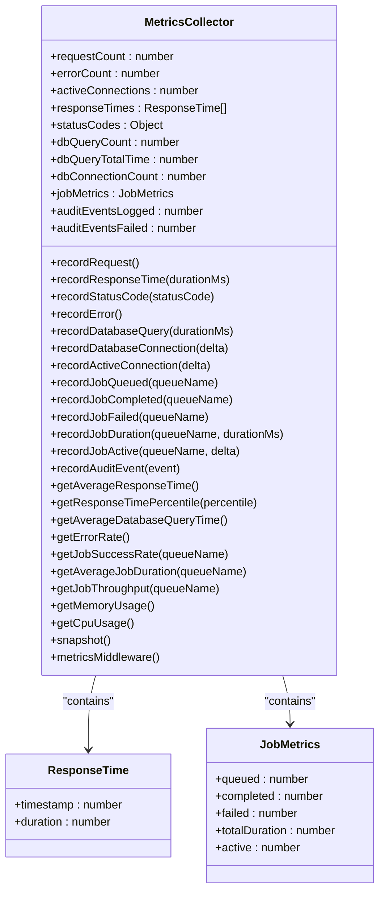

# Metrics Collection

<cite>
**Referenced Files in This Document**   
- [prometheus.yml](file://apps/admin-api/prometheus.yml)
- [metrics.js](file://apps/admin-api/src/lib/monitoring/metrics.js)
- [metrics.ts](file://apps/admin-api/src/lib/monitoring/metrics.ts)
- [app.js](file://apps/admin-api/src/app.js)
- [index.js](file://apps/admin-api/src/routes/index.js)
- [MONITORING_README.md](file://apps/admin-api/MONITORING_README.md)
- [MONITORING_SETUP_GUIDE.md](file://apps/admin-api/MONITORING_SETUP_GUIDE.md)
</cite>

## Table of Contents
1. [Introduction](#introduction)
2. [Prometheus Configuration](#prometheus-configuration)
3. [Custom Metrics Implementation](#custom-metrics-implementation)
4. [Metrics Endpoint](#metrics-endpoint)
5. [Metric Types and Instrumentation](#metric-types-and-instrumentation)
6. [Metric Naming and Labeling](#metric-naming-and-labeling)
7. [Performance Considerations](#performance-considerations)
8. [Troubleshooting](#troubleshooting)
9. [Conclusion](#conclusion)

## Introduction
The slimy-monorepo platform implements comprehensive metrics collection using Prometheus for monitoring application performance, system health, and business operations. The metrics system provides visibility into API performance, database operations, job processing, and system resources. This documentation details the configuration, implementation, and usage of the metrics collection system, including Prometheus configuration, custom metrics, and monitoring endpoints.

**Section sources**
- [MONITORING_README.md](file://apps/admin-api/MONITORING_README.md#L1-L208)
- [MONITORING_SETUP_GUIDE.md](file://apps/admin-api/MONITORING_SETUP_GUIDE.md#L1-L357)

## Prometheus Configuration
The Prometheus configuration for the slimy-monorepo platform is defined in the `prometheus.yml` file, which specifies global settings, scrape configurations, and optional alerting rules. The configuration is designed to collect metrics from the admin API and Docker containers.

The global configuration sets the scrape interval and evaluation interval to 15 seconds, ensuring frequent metric collection for timely monitoring:

```yaml
global:
  scrape_interval: 15s
  evaluation_interval: 15s
```

The scrape configuration includes two jobs:
1. **slimy-admin-api**: Scrapes the admin API's metrics endpoint every 15 seconds
2. **docker**: Collects Docker container metrics every 30 seconds

The admin API job is configured to scrape the `/api/metrics` endpoint from the admin-api service running on port 3080:

```yaml
scrape_configs:
  - job_name: 'slimy-admin-api'
    static_configs:
      - targets: ['admin-api:3080']
    metrics_path: '/api/metrics'
    scrape_interval: 15s
    scrape_timeout: 10s
```

The configuration also includes commented alerting rules for high error rates, which can be enabled by uncommenting the relevant sections. These alerts trigger warnings when error rates exceed 5% and critical alerts when they exceed 10%, with appropriate cooldown periods to prevent alert spam.

**Diagram sources**
- [prometheus.yml](file://apps/admin-api/prometheus.yml#L1-L52)

```mermaid
graph TD
A[Prometheus Server] --> B[Admin API Service]
A --> C[Docker Host]
B --> D[/api/metrics Endpoint]
C --> E[Docker Metrics Endpoint]
D --> F[Application Metrics]
E --> G[Container Metrics]
F --> H[Grafana Dashboard]
G --> H
H --> I[Alertmanager]
```

**Section sources**
- [prometheus.yml](file://apps/admin-api/prometheus.yml#L1-L52)

## Custom Metrics Implementation
The slimy-monorepo platform implements custom metrics in both JavaScript (`metrics.js`) and TypeScript (`metrics.ts`) files located in the `src/lib/monitoring/` directory. These files provide comprehensive instrumentation for tracking application performance, system health, and business operations.

The metrics implementation includes several categories of metrics:

### Request and Performance Metrics
- **Request tracking**: Counts total requests, active connections, and request duration
- **Response time monitoring**: Tracks average, P50, P95, and P99 response times using a sliding window of the last 1000 requests
- **Error tracking**: Counts errors and calculates error rates as a percentage of total requests
- **HTTP status codes**: Tracks distribution of HTTP response status codes

### Database and Job Queue Metrics
- **Database performance**: Monitors query count, total query time, and average query duration
- **Connection pooling**: Tracks active database connections
- **Job queue processing**: Monitors queued, completed, and failed jobs for chat, database, and audit processors
- **Job throughput**: Calculates jobs processed per minute for each queue type

### System and Application Metrics
- **Memory usage**: Tracks RSS, heap total, heap used, and external memory in MB
- **CPU usage**: Monitors user and system CPU time in milliseconds
- **Application-specific metrics**: Tracks images processed, chat messages, and audit events

The implementation uses a combination of counters, gauges, and calculated metrics to provide comprehensive monitoring. Counters increment monotonically (e.g., request count, error count), while gauges represent values that can go up and down (e.g., active connections, memory usage). Calculated metrics like averages and percentiles are derived from raw data collected over time.

**Diagram sources**
- [metrics.js](file://apps/admin-api/src/lib/monitoring/metrics.js#L1-L357)
- [metrics.ts](file://apps/admin-api/src/lib/monitoring/metrics.ts#L1-L202)



**Section sources**
- [metrics.js](file://apps/admin-api/src/lib/monitoring/metrics.js#L1-L357)
- [metrics.ts](file://apps/admin-api/src/lib/monitoring/metrics.ts#L1-L202)

## Metrics Endpoint
The `/api/metrics` endpoint exposes application metrics in Prometheus-compatible format for scraping by the Prometheus server. This endpoint is configured in the application's routing system and is accessible at the specified metrics path.

The endpoint is implemented through the integration of the metrics middleware in the application's request processing pipeline. When a request is made to `/api/metrics`, the system collects and formats the current state of all tracked metrics according to the Prometheus text-based exposition format.

The metrics endpoint is registered in the application's main router (`src/routes/index.js`) and is served by the metrics module's snapshot functionality, which compiles all current metrics into a structured format. The endpoint provides a comprehensive view of the application's current state, including:

- Request metrics (total requests, active connections, recent requests)
- Performance metrics (response time percentiles, error rates)
- Database metrics (connection count, query statistics)
- Job queue metrics (queued, completed, and failed jobs)
- System metrics (memory and CPU usage)
- Application-specific metrics (images processed, chat messages)

The endpoint is designed to be lightweight and efficient, with minimal impact on application performance. It collects metrics from in-memory data structures that are updated synchronously during request processing, ensuring that the metrics are current and accurate.

**Section sources**
- [index.js](file://apps/admin-api/src/routes/index.js#L1-L82)
- [app.js](file://apps/admin-api/src/app.js#L1-L64)

## Metric Types and Instrumentation
The slimy-monorepo platform implements various metric types to effectively monitor different aspects of the application. These metric types follow Prometheus best practices and are implemented in both JavaScript and TypeScript files.

### Counter Metrics
Counters are used for metrics that only increase over time, such as:
- Total requests served
- Error count
- Images processed
- Chat messages handled
- Database queries executed
- Job queue operations (queued, completed, failed)

Counters are implemented as simple numeric variables that are incremented using dedicated recording functions. For example, the `recordRequest()` function increments the request counter, while `recordError()` increments the error counter.

### Gauge Metrics
Gauges represent values that can fluctuate up and down, such as:
- Active connections
- Database connection count
- Memory usage (RSS, heap, external)
- Job queue active workers

Gauges are implemented by tracking the current value and allowing increments and decrements. For example, `recordActiveConnection(delta)` adjusts the active connections gauge by the specified delta, allowing it to increase when connections are established and decrease when they are closed.

### Histograms and Summaries
The system implements histogram-like functionality through response time tracking. Although not using Prometheus histogram data types directly, the implementation captures response times in a sliding window and calculates percentiles (P50, P95, P99) from the collected data.

The response time tracking uses a fixed-size array (1000 entries) that maintains a sliding window of recent requests. When the array is full, older entries are removed using the `shift()` method. This approach provides accurate percentile calculations while limiting memory usage.

The system calculates and exposes the following response time metrics:
- Average response time
- P50 (median) response time
- P95 response time (95% of requests are faster)
- P99 response time (99% of requests are faster)

### Summary Metrics
The system implements summary metrics through calculated values derived from raw data:
- Error rate percentage (errors / total requests)
- Job success rate percentage (completed / total attempts)
- Average database query time
- Job throughput (jobs per minute)

These summary metrics provide higher-level insights into system performance and reliability, helping identify trends and potential issues.

**Section sources**
- [metrics.js](file://apps/admin-api/src/lib/monitoring/metrics.js#L1-L357)
- [metrics.ts](file://apps/admin-api/src/lib/monitoring/metrics.ts#L1-L202)

## Metric Naming and Labeling
The slimy-monorepo platform follows consistent naming conventions for metrics to ensure clarity and maintainability. While the current implementation primarily uses JavaScript objects and direct property access rather than a formal metrics registry, the naming patterns reflect Prometheus best practices.

### Naming Conventions
Metric names follow a structured pattern that includes the application name, subsystem, and specific metric:
- `slimy_admin_api_requests` - Total requests to the admin API
- `slimy_admin_api_errors` - Total errors in the admin API
- `slimy_admin_api_response_time_p95` - P95 response time
- `slimy_admin_api_database_connections` - Database connection count
- `slimy_admin_api_job_queue_chat_queued` - Chat jobs queued

The naming convention uses snake_case and includes the application prefix to avoid collisions in multi-service environments.

### Label Usage for Cardinality Control
While the current implementation doesn't extensively use Prometheus labels, the data structure supports potential label-based cardinality control. The system could be enhanced to include labels for:
- HTTP method (GET, POST, PUT, DELETE)
- Endpoint path or route
- Status code ranges (2xx, 4xx, 5xx)
- Job queue types (chat, database, audit)

Cardinality control is maintained by limiting the number of distinct time series. For example, response times are tracked in a sliding window of 1000 requests rather than storing every individual request indefinitely. Status codes are tracked as a simple object with numeric keys, preventing unbounded growth.

The implementation also includes calculated metrics (like error rates and averages) rather than exposing every raw data point, which helps control cardinality while still providing valuable insights.

Future enhancements could include more sophisticated labeling to provide dimensional analysis of metrics while carefully managing cardinality to prevent performance issues in the monitoring system.

**Section sources**
- [metrics.js](file://apps/admin-api/src/lib/monitoring/metrics.js#L1-L357)
- [metrics.ts](file://apps/admin-api/src/lib/monitoring/metrics.ts#L1-L202)

## Performance Considerations
The metrics collection system in the slimy-monorepo platform is designed with performance in mind, balancing comprehensive monitoring with minimal impact on application performance.

### Memory Usage
The system implements several strategies to control memory usage:
- Response times are stored in a sliding window of 1000 entries, with older entries removed when the limit is exceeded
- Raw request metrics are not stored long-term; only aggregated values are maintained
- The response time array uses a simple push/shift pattern, which is memory efficient for the fixed window size

The memory impact is further reduced by only storing essential data points (timestamp and duration) for response time calculations, rather than complete request objects.

### High-Frequency Metrics Collection
The system is optimized for high-frequency metrics collection through:
- Synchronous updates during request processing, avoiding additional async operations
- Simple increment operations for counters, which are computationally inexpensive
- Batched calculations for percentiles and averages, performed only when needed

The scrape interval of 15 seconds provides frequent monitoring without overwhelming the system with too many scrape requests. The metrics endpoint itself is lightweight, primarily reading from pre-aggregated data structures rather than performing expensive calculations on each request.

### Performance Impact
Based on the monitoring documentation, the performance impact of the metrics system is minimal:
- Metrics collection adds approximately 1-2ms per request
- Logging adds about 0.5ms per log entry
- Health checks run every 30 seconds with minimal overhead

The system also includes performance monitoring for the monitoring system itself, tracking metrics like the number of recent requests processed in the last 5 minutes, which helps identify potential performance bottlenecks.

### Optimization Opportunities
Potential optimizations include:
- Implementing a more efficient data structure for response time percentiles, such as a histogram or reservoir sampling
- Adding configurable sampling for high-volume metrics to reduce collection overhead
- Implementing metric expiration or aggregation for long-term storage
- Using Prometheus client libraries with built-in optimizations for high-frequency metrics

These optimizations could further reduce the performance impact while maintaining the quality of monitoring data.

**Section sources**
- [metrics.js](file://apps/admin-api/src/lib/monitoring/metrics.js#L1-L357)
- [MONITORING_SETUP_GUIDE.md](file://apps/admin-api/MONITORING_SETUP_GUIDE.md#L306-L312)

## Troubleshooting
This section provides guidance for troubleshooting common issues with the metrics collection system in the slimy-monorepo platform.

### Missing Metrics
If metrics are not appearing in Prometheus or Grafana, follow these steps:

1. **Verify endpoint accessibility**: Check that the `/api/metrics` endpoint is accessible by making a direct HTTP request to the service.
2. **Check Prometheus configuration**: Verify that the Prometheus configuration correctly points to the admin API service and uses the correct metrics path (`/api/metrics`).
3. **Review service logs**: Check the application logs for any errors related to metrics collection or the metrics endpoint.
4. **Validate network connectivity**: Ensure that Prometheus can reach the admin API service on port 3080.
5. **Confirm service health**: Verify that the admin API service is running and healthy by checking the `/api/health` endpoint.

### Configuration Validation
To validate the Prometheus configuration:

1. **Syntax check**: Use the Prometheus configuration validator to check for syntax errors in `prometheus.yml`.
2. **Target verification**: Access the Prometheus web UI and navigate to the "Targets" page to confirm that the slimy-admin-api job is listed and its state is "UP".
3. **Metric inspection**: In the Prometheus web UI, use the expression browser to query specific metrics (e.g., `slimy_admin_api_requests`) and verify they return data.
4. **Scrape interval confirmation**: Check that the scrape interval matches the configured value (15 seconds) in the targets list.

### Alert Troubleshooting
If alerts are not firing as expected:

1. **Verify alert thresholds**: Check the alert thresholds in the Prometheus configuration or the application's alert configuration.
2. **Check alert evaluation interval**: Ensure that the evaluation interval (15 seconds) allows sufficient time for alerts to trigger.
3. **Review alert cooldown periods**: Confirm that the "for" duration in alert rules (e.g., "5m" for warnings) has elapsed.
4. **Validate alert expressions**: Test the PromQL expressions in the alert rules using the Prometheus expression browser to ensure they return the expected results.
5. **Check Alertmanager configuration**: If using Alertmanager, verify that it is properly configured and can send notifications.

### Common Issues and Solutions
- **High memory usage**: If memory usage is excessive, check the response time window size and consider reducing it from 1000 entries if necessary.
- **Slow metrics endpoint**: If the `/api/metrics` endpoint is slow, verify that no expensive calculations are being performed during metric collection.
- **Inconsistent metrics**: If metrics appear inconsistent, check for race conditions in multi-threaded environments or ensure that metric updates are thread-safe.
- **Missing job metrics**: If job queue metrics are not updating, verify that the job processing code is properly calling the metrics recording functions.

Regular monitoring of the monitoring system itself, including metrics about metric collection, can help identify and resolve issues before they impact observability.

**Section sources**
- [MONITORING_README.md](file://apps/admin-api/MONITORING_README.md#L178-L193)
- [MONITORING_SETUP_GUIDE.md](file://apps/admin-api/MONITORING_SETUP_GUIDE.md#L277-L296)

## Conclusion
The metrics collection system in the slimy-monorepo platform provides comprehensive monitoring capabilities through Prometheus integration. The system is configured with appropriate scrape intervals and targets to collect metrics from both the admin API and Docker containers. Custom metrics are implemented in JavaScript and TypeScript files to track API response times, request rates, error counts, queue processing latency, and database connection pool usage.

The `/api/metrics` endpoint exposes these metrics in Prometheus-compatible format, enabling visualization in Grafana and alerting through Alertmanager. The implementation uses appropriate metric types including counters, gauges, and calculated summaries to provide insights into application performance and system health.

The system follows sound practices for metric naming and includes considerations for performance and memory usage, particularly through the use of sliding windows for response time tracking. Troubleshooting guidance is available for common issues such as missing metrics and configuration problems.

Future enhancements could include more sophisticated labeling for dimensional analysis, improved cardinality control, and integration with additional monitoring tools for distributed tracing and log aggregation. The current implementation provides a solid foundation for observability in the slimy-monorepo platform.