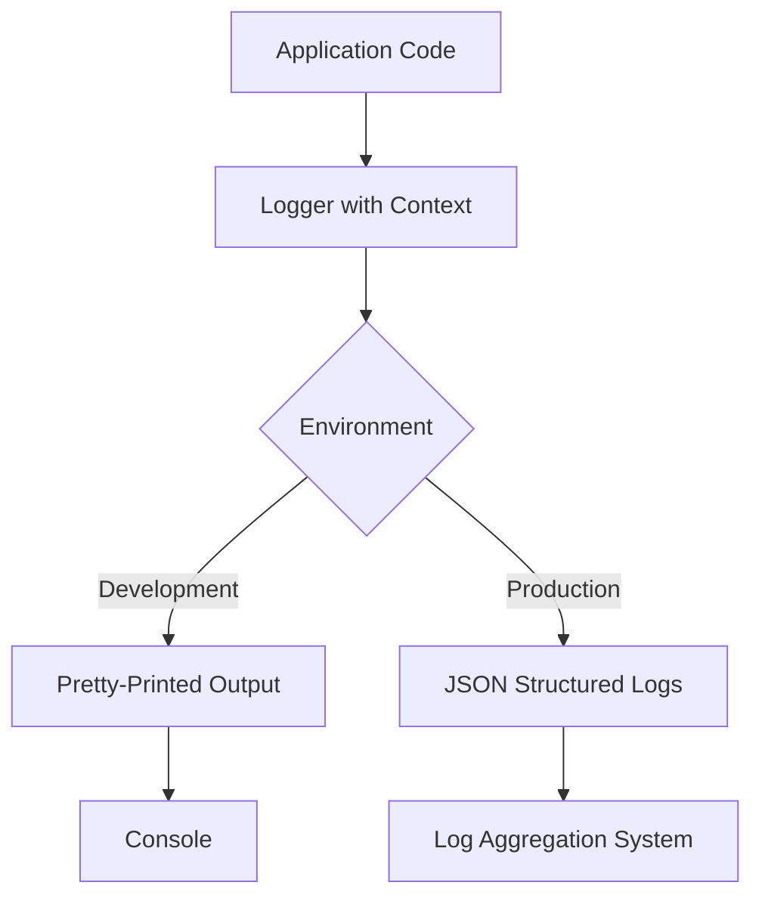
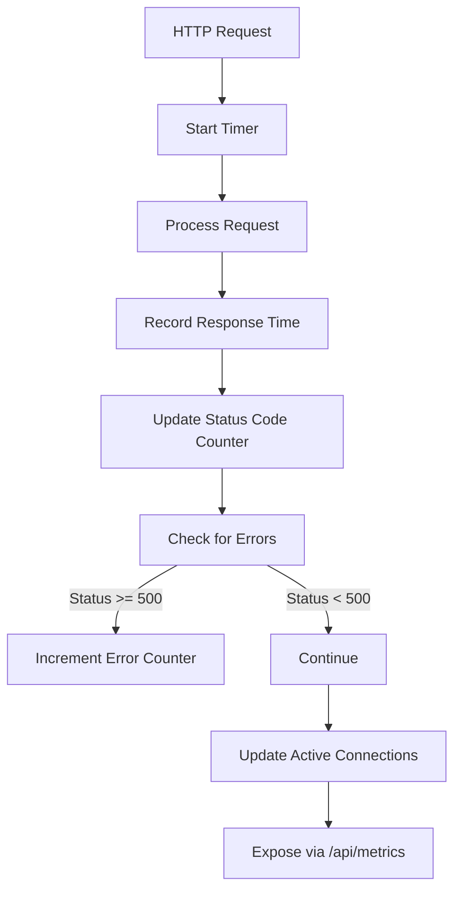
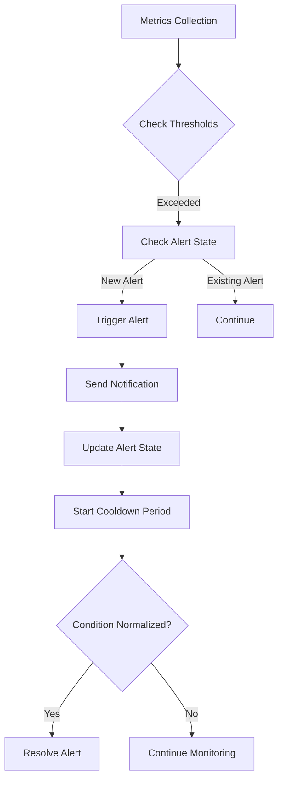
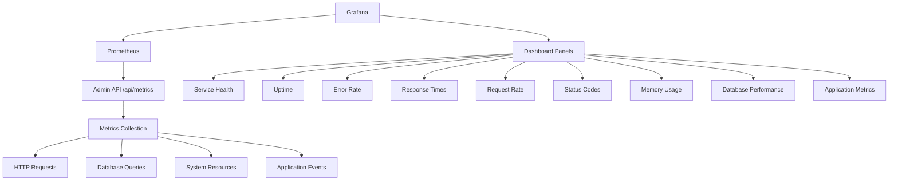
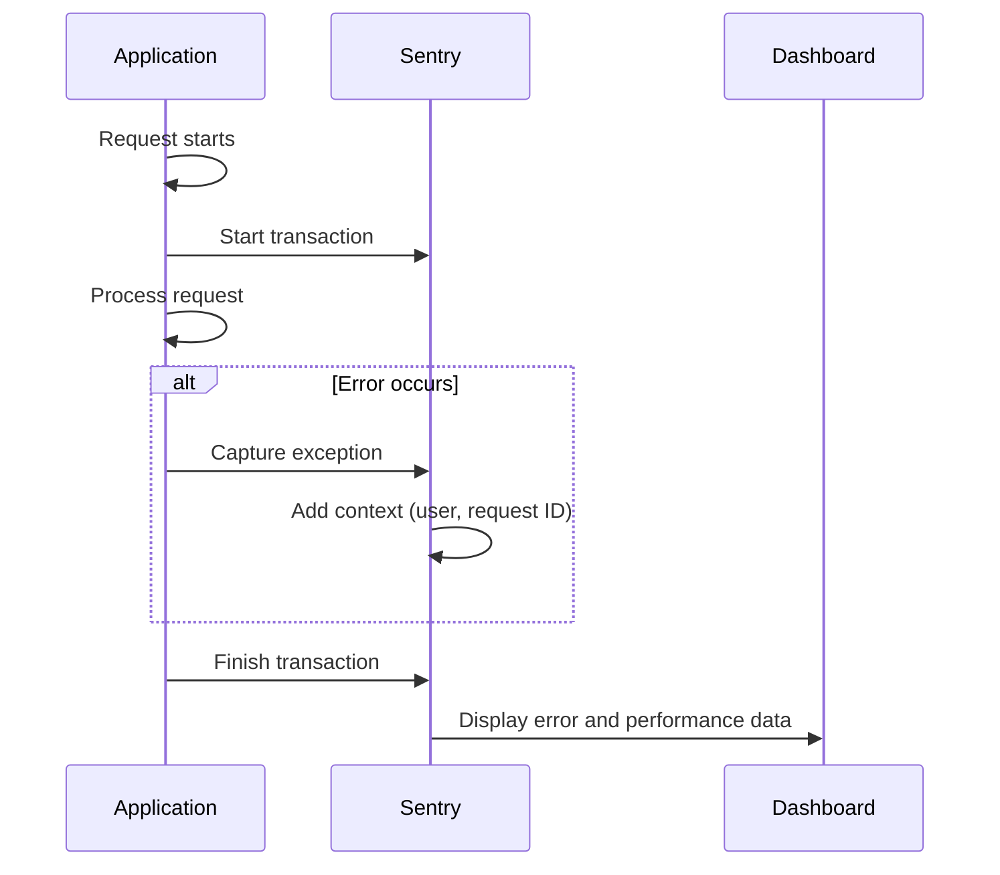

# Monitoring and Observability

<cite>
**Referenced Files in This Document**   
- [MONITORING_README.md](file://apps/admin-api/MONITORING_README.md)
- [MONITORING_SETUP_GUIDE.md](file://apps/admin-api/MONITORING_SETUP_GUIDE.md)
- [prometheus.yml](file://apps/admin-api/prometheus.yml)
- [grafana-dashboard.json](file://apps/admin-api/grafana-dashboard.json)
- [src/lib/monitoring/sentry.js](file://apps/admin-api/src/lib/monitoring/sentry.js)
- [src/lib/monitoring/metrics.js](file://apps/admin-api/src/lib/monitoring/metrics.js)
- [src/lib/logger.js](file://apps/admin-api/src/lib/logger.js)
- [src/lib/alerts.js](file://apps/admin-api/src/lib/alerts.js)
- [src/services/health.js](file://apps/admin-api/src/services/health.js)
- [src/routes/diagnostics.js](file://apps/admin-api/src/routes/diagnostics.js)
- [src/routes/diag.js](file://apps/admin-api/src/routes/diag.js)
- [src/lib/database.js](file://apps/admin-api/src/lib/database.js)
- [monitoring/alertmanager.yml](file://apps/web/monitoring/alertmanager.yml)
</cite>

## Table of Contents
1. [Introduction](#introduction)
2. [Logging Strategy](#logging-strategy)
3. [Metrics Collection](#metrics-collection)
4. [Alerting Configuration](#alerting-configuration)
5. [Dashboard Visualization](#dashboard-visualization)
6. [Error Tracking](#error-tracking)
7. [Health Checks and Diagnostic Tools](#health-checks-and-diagnostic-tools)
8. [Configuration Examples](#configuration-examples)
9. [Storage and Retention](#storage-and-retention)
10. [Troubleshooting](#troubleshooting)
11. [Performance Optimization](#performance-optimization)

## Introduction

The slimy-monorepo platform implements a comprehensive monitoring and observability system to ensure system health, performance, and reliability. The monitoring stack integrates multiple industry-standard tools and practices, including structured logging, Prometheus metrics collection, Grafana visualization, Alertmanager alerting, and Sentry error tracking. This documentation provides a detailed overview of the monitoring architecture, configuration, and best practices for maintaining system observability.

The monitoring system is designed to provide real-time insights into application performance, detect and alert on issues proactively, and facilitate rapid troubleshooting when problems occur. The implementation follows modern observability principles, capturing metrics, logs, and traces to create a complete picture of system behavior.

**Section sources**
- [MONITORING_README.md](file://apps/admin-api/MONITORING_README.md#L1-L208)
- [MONITORING_SETUP_GUIDE.md](file://apps/admin-api/MONITORING_SETUP_GUIDE.md#L1-L357)

## Logging Strategy

The platform employs structured logging with a consistent JSON format in production environments, while providing human-readable output for development. The logging system captures essential contextual information for effective troubleshooting and analysis.

### Structured Logging Implementation

The logging strategy is implemented using the Pino logger with custom formatters and serializers. All log entries include standardized metadata fields such as service name, version, environment, hostname, and process ID. This consistent structure enables efficient log aggregation, searching, and analysis.

In production, logs are output in JSON format with ISO timestamps, making them compatible with log aggregation systems. For development environments, the system uses pino-pretty to provide colorized, human-readable output that enhances developer productivity.



**Diagram sources**
- [src/lib/logger.js](file://apps/admin-api/src/lib/logger.js#L1-L169)

### Log Context and Correlation

Each log entry includes contextual information to facilitate correlation and analysis. Key features include:

- **Request ID correlation**: Each HTTP request is assigned a unique request ID that is included in all related log entries, enabling end-to-end request tracing
- **Request/response details**: HTTP method, path, status code, duration, and relevant headers are captured
- **Error context**: Full error objects with name, message, code, status code, and stack trace are serialized
- **User context**: When available, user ID and username are included for authentication-related operations

The system automatically logs incoming requests and completed responses, providing a comprehensive audit trail of API activity. This approach balances detailed observability with performance considerations.

**Section sources**
- [src/lib/logger.js](file://apps/admin-api/src/lib/logger.js#L1-L169)
- [MONITORING_README.md](file://apps/admin-api/MONITORING_README.md#L151-L175)

## Metrics Collection

The platform collects comprehensive metrics using Prometheus, exposing a wide range of application, system, and business-specific metrics through a dedicated endpoint.

### Custom Metrics Implementation

The metrics collection system tracks various aspects of application performance and health:

- **HTTP metrics**: Request count, response times (P50, P95, P99), status code distribution, and error rates
- **Database metrics**: Query count, average query time, and connection count
- **System metrics**: Memory usage (heap used, heap total), CPU usage, and uptime
- **Application metrics**: Images processed, chat messages, active sessions, and job queue statistics
- **Job processing metrics**: Queue length, completion rate, failure rate, and processing duration for chat, database, and audit processors

The metrics are collected using in-memory counters and gauges that are exposed via the `/api/metrics` endpoint in Prometheus format. The implementation uses a sliding window approach for response time tracking, maintaining the last 1,000 response times to calculate percentiles accurately.



**Diagram sources**
- [src/lib/monitoring/metrics.js](file://apps/admin-api/src/lib/monitoring/metrics.js#L1-L357)

### API Performance Monitoring

The system tracks API performance through multiple dimensions:

- **Response time percentiles**: P50, P95, and P99 response times provide insight into tail latency
- **Request rate**: Requests per second over time, enabling detection of traffic spikes
- **Error rate**: Percentage of requests resulting in errors, calculated as errors/total requests
- **Active connections**: Current number of concurrent connections to the service

These metrics are updated in real-time as requests are processed and are available for immediate visualization and alerting. The metrics middleware automatically captures this data for all HTTP requests, requiring no additional instrumentation in route handlers.

**Section sources**
- [src/lib/monitoring/metrics.js](file://apps/admin-api/src/lib/monitoring/metrics.js#L1-L357)
- [MONITORING_README.md](file://apps/admin-api/MONITORING_README.md#L13-L16)

## Alerting Configuration

The alerting system combines in-application alert checking with external monitoring via Prometheus and Alertmanager to provide comprehensive coverage of system health.

### Alert Thresholds and Rules

The system implements configurable alert thresholds for various metrics:

- **Error rate**: Warning > 5%, Critical > 10%
- **Response time**: P95 warning > 2s, critical > 5s; P99 warning > 5s, critical > 10s
- **Memory usage**: Warning > 80%, Critical > 90%
- **Database query time**: Warning > 100ms, Critical > 500ms
- **Health checks**: Service availability monitoring

Alerts are implemented with cooldown periods (5 minutes by default) to prevent alert spam during transient issues. The system tracks alert state to distinguish between new alerts and ongoing issues, and automatically resolves alerts when conditions return to normal.



**Diagram sources**
- [src/lib/alerts.js](file://apps/admin-api/src/lib/alerts.js#L1-L343)

### Alertmanager Integration

For production environments, the system integrates with Alertmanager to provide advanced alert routing and notification capabilities. The Alertmanager configuration supports:

- **Email notifications**: SMTP integration for email alerts
- **Grouping**: Alerts are grouped by alert name to reduce notification volume
- **Rate limiting**: Controls how frequently notifications are sent
- **Escalation policies**: Different notification channels based on alert severity

The Alertmanager configuration is designed to be flexible, allowing different notification recipients and methods based on alert severity and type.

**Section sources**
- [src/lib/alerts.js](file://apps/admin-api/src/lib/alerts.js#L1-L343)
- [monitoring/alertmanager.yml](file://apps/web/monitoring/alertmanager.yml#L1-L22)

## Dashboard Visualization

The monitoring system includes a comprehensive Grafana dashboard that visualizes key metrics and system health indicators.

### Grafana Dashboard Components

The Grafana dashboard provides a holistic view of system health with the following panels:

- **Service Health**: Current service status (UP/DOWN) with color-coded indicators
- **Uptime**: Service uptime in hours since last restart
- **Error Rate**: Current error rate with color-coded thresholds (green < 5%, orange 5-10%, red > 10%)
- **Active Connections**: Current number of active connections to the service
- **Response Time Percentiles**: P50, P95, and P99 response times over time
- **Request Rate**: Requests per second over time
- **HTTP Status Codes**: Distribution of response codes (2xx, 3xx, 4xx, 5xx)
- **Memory Usage**: Heap memory usage trends
- **Database Performance**: Connection count and average query time
- **Application Metrics**: Business-specific metrics like images processed and chat messages
- **Error Trends**: Error rate over time

The dashboard is configured to refresh every 30 seconds and displays data from the last hour by default, providing near real-time visibility into system performance.



**Diagram sources**
- [grafana-dashboard.json](file://apps/admin-api/grafana-dashboard.json#L1-L364)
- [MONITORING_README.md](file://apps/admin-api/MONITORING_README.md#L112-L127)

### Dashboard Configuration

The dashboard is defined in JSON format and can be easily imported into Grafana instances. It uses Prometheus as the data source and includes pre-configured queries for all metrics. The dashboard is designed to be self-contained, requiring minimal configuration after import.

Key configuration aspects include:
- Time range: Last hour by default
- Refresh interval: 30 seconds
- Data source: Prometheus
- Panel layout: Optimized for quick scanning of key metrics
- Thresholds: Pre-configured for color-coding based on alert levels

**Section sources**
- [grafana-dashboard.json](file://apps/admin-api/grafana-dashboard.json#L1-L364)
- [MONITORING_SETUP_GUIDE.md](file://apps/admin-api/MONITORING_SETUP_GUIDE.md#L204-L210)

## Error Tracking

The platform uses Sentry for comprehensive error tracking, performance monitoring, and transaction tracing.

### Sentry Implementation

Sentry is integrated into the application to provide:

- **Automatic error tracking**: Unhandled exceptions and promise rejections are automatically captured
- **Performance monitoring**: Transaction tracing for HTTP requests and custom operations
- **CPU/memory profiling**: Continuous profiling to identify performance bottlenecks
- **Release tracking**: Correlation of errors with specific code deployments
- **Breadcrumbs**: Contextual information leading up to errors

The Sentry integration is initialized with environment-specific configuration, including DSN, environment name, and release version. Sampling rates are configured to capture 100% of transactions in development and 10% in production to balance insight with performance impact.



**Diagram sources**
- [src/lib/monitoring/sentry.js](file://apps/admin-api/src/lib/monitoring/sentry.js#L1-L148)

### Error Filtering and Context

The Sentry integration includes intelligent filtering to reduce noise from non-actionable errors:

- **Client errors (4xx)**: Expected client-side errors are filtered out
- **Timeout errors**: Network timeout errors are filtered as they are often client-side issues
- **Context enrichment**: User information, request details, and custom tags are added to provide context

Custom error capture is available through utility functions that allow capturing specific errors with additional context. This enables targeted error reporting for business logic errors that may not result in HTTP 500 responses.

**Section sources**
- [src/lib/monitoring/sentry.js](file://apps/admin-api/src/lib/monitoring/sentry.js#L1-L148)
- [MONITORING_README.md](file://apps/admin-api/MONITORING_README.md#L8-L10)

## Health Checks and Diagnostic Tools

The platform provides multiple endpoints for health checking and diagnostics to support monitoring and troubleshooting.

### Health Check Endpoint

The `/api/health` endpoint provides comprehensive health status including:

- **Service status**: Overall service health
- **Database connectivity**: Database connection status and response time
- **Discord API health**: External service dependency checks
- **System health**: Memory usage and uptime
- **Metrics snapshot**: Current values of key metrics

The health check performs actual connectivity tests rather than simply returning a static response, ensuring that monitoring systems can detect real issues with dependencies.

### Diagnostic Endpoints

Additional diagnostic endpoints provide detailed system information:

- **`/api/diag`**: Detailed diagnostics including process information, memory usage, and uptime (admin only)
- **`/api/diagnostics`**: System diagnostics with caching (admin only)
- **`/api/metrics`**: Prometheus-formatted metrics for monitoring systems

These endpoints support both automated monitoring and manual troubleshooting, providing different levels of detail based on the use case.

```mermaid
flowchart TD
A[Monitoring System] --> B[/api/health]
A --> C[/api/metrics]
D[Administrator] --> E[/api/diag]
D --> F[/api/diagnostics]
B --> G{Health Checks}
G --> H[Database]
G --> I[External Services]
G --> J[System Resources]
C --> K[Prometheus]
K --> L[Grafana]
E --> M[Process Info]
E --> N[Memory Usage]
E --> O[Uptime]
F --> P[Cached Diagnostics]
```

**Diagram sources**
- [src/services/health.js](file://apps/admin-api/src/services/health.js#L1-L63)
- [src/routes/diagnostics.js](file://apps/admin-api/src/routes/diagnostics.js#L1-L79)
- [src/routes/diag.js](file://apps/admin-api/src/routes/diag.js#L1-L55)

**Section sources**
- [src/services/health.js](file://apps/admin-api/src/services/health.js#L1-L63)
- [src/routes/diagnostics.js](file://apps/admin-api/src/routes/diagnostics.js#L1-L79)
- [src/routes/diag.js](file://apps/admin-api/src/routes/diag.js#L1-L55)

## Configuration Examples

This section provides examples of key monitoring configuration files used in the platform.

### Prometheus Configuration

The `prometheus.yml` file configures Prometheus to scrape metrics from the Admin API:

```yaml
global:
  scrape_interval: 15s
  evaluation_interval: 15s

scrape_configs:
  - job_name: 'slimy-admin-api'
    static_configs:
      - targets: ['admin-api:3080']
    metrics_path: '/api/metrics'
    scrape_interval: 15s
    scrape_timeout: 10s

  - job_name: 'docker'
    static_configs:
      - targets: ['docker.for.mac.host.internal:9323']
    metrics_path: '/metrics'
    scrape_interval: 30s
```

This configuration sets up two scrape jobs: one for the Admin API metrics endpoint and another for Docker container metrics.

**Section sources**
- [prometheus.yml](file://apps/admin-api/prometheus.yml#L1-L52)

### Alertmanager Configuration

The Alertmanager configuration defines notification routing and email settings:

```yaml
global:
  smtp_smarthost: 'smtp.gmail.com:587'
  smtp_from: 'alerts@yourdomain.com'
  smtp_auth_username: 'your-email@gmail.com'
  smtp_auth_password: 'your-app-password'

route:
  group_by: ['alertname']
  group_wait: 10s
  group_interval: 10s
  repeat_interval: 1h
  receiver: 'email-notifications'

receivers:
- name: 'email-notifications'
  email_configs:
  - to: 'admin@yourdomain.com'
    send_resolved: true
```

This configuration routes all alerts to an email notification receiver with appropriate grouping and rate limiting.

**Section sources**
- [monitoring/alertmanager.yml](file://apps/web/monitoring/alertmanager.yml#L1-L22)

## Storage and Retention

The monitoring system addresses storage considerations for both metrics and logs to balance observability with resource usage.

### Metric Storage Considerations

Prometheus stores metrics in a time-series database with configurable retention policies. The default configuration retains metrics for 15 days, with the ability to adjust based on storage capacity and historical analysis needs.

Key considerations include:
- **Storage capacity**: Monitoring the disk usage of the Prometheus server
- **Retention period**: Balancing historical data needs with storage costs
- **Downsampling**: Configuring recording rules to aggregate older data
- **Backup strategy**: Regular backups of the Prometheus data directory

### Log Retention Policies

Log retention is managed through external log aggregation systems, with policies varying by environment:

- **Development**: Logs are retained for 7 days
- **Staging**: Logs are retained for 30 days
- **Production**: Logs are retained for 90 days, with critical error logs retained for 1 year

Log rotation is configured to prevent individual log files from growing too large, with compression of archived logs to reduce storage footprint.

**Section sources**
- [MONITORING_README.md](file://apps/admin-api/MONITORING_README.md#L196-L199)
- [MONITORING_SETUP_GUIDE.md](file://apps/admin-api/MONITORING_SETUP_GUIDE.md#L302-L304)

## Troubleshooting

This section provides guidance for diagnosing and resolving common monitoring issues.

### Common Monitoring Issues

#### Metrics Not Appearing
- Verify the `/api/metrics` endpoint is accessible and returns data
- Check Prometheus configuration for correct target and metrics path
- Review service logs for metrics collection errors
- Ensure the metrics middleware is properly registered in the application

#### Alerts Not Firing
- Verify alert thresholds in the configuration
- Check alert cooldown periods (5 minutes default)
- Ensure the alert checking process is running
- Review Alertmanager configuration for routing issues

#### Health Check Failing
- Check database connectivity and credentials
- Verify external service dependencies (Discord API)
- Monitor system resources (memory, disk space)
- Review service logs for startup errors

#### Sentry Integration Issues
- Verify SENTRY_DSN environment variable is set
- Check network connectivity to Sentry
- Review Sentry project configuration
- Ensure the correct environment is specified

**Section sources**
- [MONITORING_README.md](file://apps/admin-api/MONITORING_README.md#L177-L193)
- [MONITORING_SETUP_GUIDE.md](file://apps/admin-api/MONITORING_SETUP_GUIDE.md#L277-L297)

## Performance Optimization

The monitoring system is designed to minimize performance impact while providing comprehensive observability.

### Performance Impact Mitigation

Key strategies for optimizing monitoring performance include:

- **Sampling**: Configurable sampling rates for Sentry transactions (10% in production)
- **Efficient metrics collection**: Lightweight in-memory counters with minimal overhead
- **Caching**: Cached responses for diagnostic endpoints
- **Asynchronous operations**: Non-blocking metric updates and log writes
- **Batching**: Batched operations where appropriate

The system has been measured to have minimal performance impact:
- Metrics: ~1-2ms per request
- Logging: ~0.5ms per log entry
- Health checks: ~50-100ms every 30 seconds
- Sentry: Configurable sampling rates (10% in production)

### Alert Fatigue Prevention

To prevent alert fatigue, the system implements several strategies:

- **Cooldown periods**: 5-minute cooldown between alert notifications
- **Escalation policies**: Different notification methods based on severity
- **Meaningful thresholds**: Thresholds based on historical baselines rather than arbitrary values
- **Automated resolution**: Alerts automatically resolve when conditions normalize
- **Noise reduction**: Filtering of non-actionable errors and transient issues

These measures ensure that alerts remain meaningful and actionable, reducing the risk of important alerts being ignored due to excessive noise.

**Section sources**
- [MONITORING_SETUP_GUIDE.md](file://apps/admin-api/MONITORING_SETUP_GUIDE.md#L306-L312)
- [src/lib/alerts.js](file://apps/admin-api/src/lib/alerts.js#L44-L47)