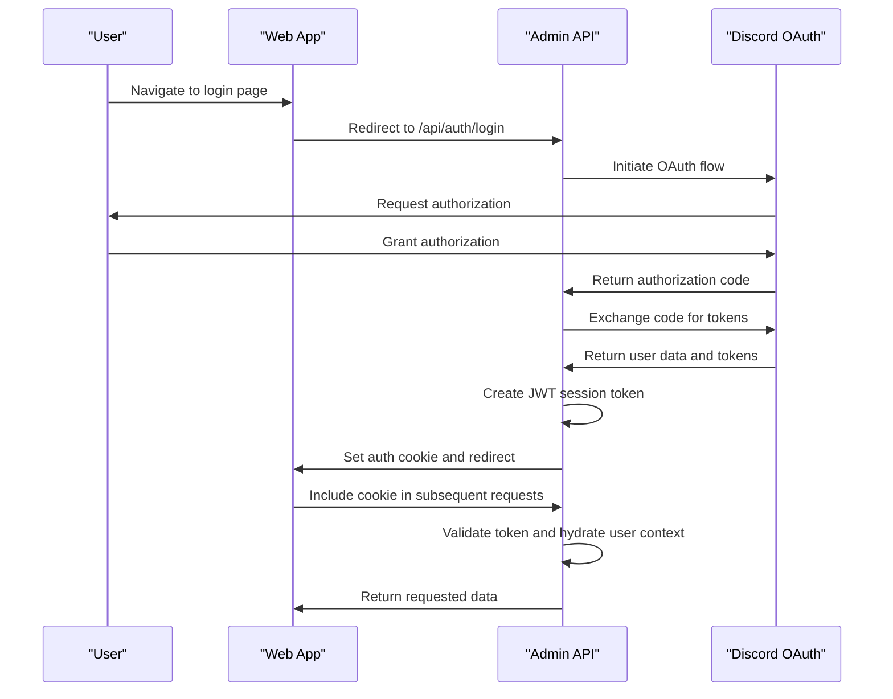
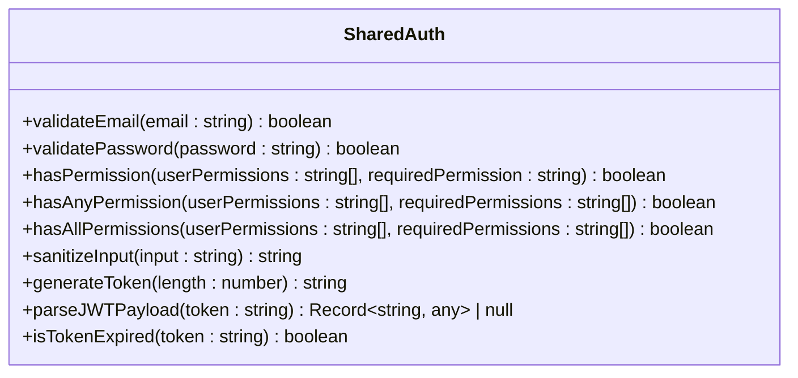
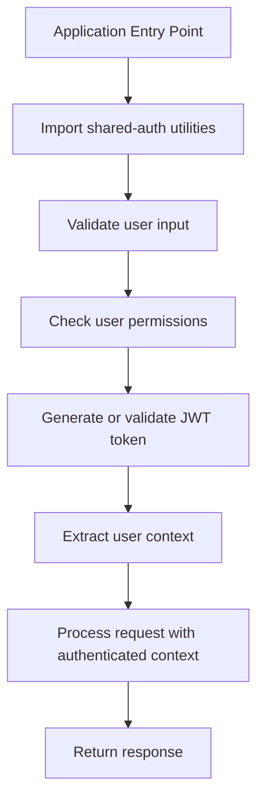

# Shared Authentication Package

<cite>
**Referenced Files in This Document**   
- [index.ts](file://packages/shared-auth/src/index.ts)
- [index.test.ts](file://packages/shared-auth/src/index.test.ts)
- [package.json](file://packages/shared-auth/package.json)
- [jwt.js](file://apps/admin-api/lib/jwt.js)
- [auth.js](file://apps/admin-api/src/middleware/auth.js)
- [session-store.js](file://apps/admin-api/lib/session-store.js)
- [server.ts](file://apps/web/lib/auth/server.ts)
- [request-context.ts](file://apps/web/lib/auth/request-context.ts)
- [config.js](file://apps/admin-api/src/config.js)
- [token.js](file://apps/admin-api/src/services/token.js)
</cite>

## Table of Contents
1. [Introduction](#introduction)
2. [Core Utilities](#core-utilities)
3. [Authentication Flow](#authentication-flow)
4. [Exported Functions and Types](#exported-functions-and-types)
5. [Usage Examples](#usage-examples)
6. [Testing Strategy](#testing-strategy)
7. [Integration with Express.js and Next.js](#integration-with-expressjs-and-nextjs)
8. [Security Considerations](#security-considerations)
9. [Extensibility](#extensibility)
10. [Conclusion](#conclusion)

## Introduction

The shared-auth package serves as the central authentication utility across the slimy-monorepo platform, providing standardized authentication mechanisms for applications such as admin-api, web, and admin-ui. This package ensures consistent handling of JWT tokens, user session management, and OAuth integration patterns. By centralizing authentication logic, it reduces code duplication and enhances security across services.

The package is designed to work seamlessly with both Express.js middleware and Next.js API routes, enabling unified authentication across different application types within the monorepo. It provides essential functions for token generation, validation, and user context extraction while maintaining a lightweight and modular architecture.

**Section sources**
- [index.ts](file://packages/shared-auth/src/index.ts)
- [package.json](file://packages/shared-auth/package.json)

## Core Utilities

The shared-auth package provides several core utilities for authentication and security operations. These include email and password validation, permission checking, input sanitization, token generation, and JWT payload parsing.

The package implements robust validation functions that ensure data integrity and security. The `validateEmail` function uses a regular expression to verify email format, while `validatePassword` enforces strong password requirements including minimum length, uppercase and lowercase letters, and numeric characters. These validation functions are critical for maintaining security standards across the platform.

Permission management is handled through a set of functions that support role-based access control (RBAC). The `hasPermission`, `hasAnyPermission`, and `hasAllPermissions` functions enable fine-grained access control by checking user permissions against required permissions. This allows applications to implement sophisticated authorization logic based on user roles and capabilities.

**Section sources**
- [index.ts](file://packages/shared-auth/src/index.ts)

## Authentication Flow

The authentication flow in the slimy-monorepo platform follows a standardized pattern across applications. When a user attempts to authenticate, the system first validates credentials through OAuth with Discord. Upon successful authentication, the admin-api generates a JWT token containing user information and sets it as a secure cookie.

The JWT token is signed using HS256 algorithm with a secret key configured in the environment. The token contains essential user information including ID, username, avatar, role, and guild membership. This token is then used for subsequent requests to authenticate the user without requiring repeated OAuth flows.

Session management is implemented through a combination of JWT tokens and database-stored session data. The session-store.js module handles persistent session storage, allowing for session revocation and expiration management. Sessions are automatically cleaned up after expiration through a periodic cleanup process that runs every hour.

**Diagram sources**
- [auth.js](file://apps/admin-api/src/middleware/auth.js)
- [jwt.js](file://apps/admin-api/lib/jwt.js)
- [session-store.js](file://apps/admin-api/lib/session-store.js)

**Section sources**
- [auth.js](file://apps/admin-api/src/middleware/auth.js)
- [jwt.js](file://apps/admin-api/lib/jwt.js)
- [session-store.js](file://apps/admin-api/lib/session-store.js)

## Exported Functions and Types

The shared-auth package exports a comprehensive set of functions and types for authentication operations. These functions are designed to be reusable across different applications within the monorepo.

The package provides validation functions including `validateEmail` and `validatePassword` that return boolean values indicating whether the input meets the required criteria. These functions include comprehensive edge case handling for null, undefined, and non-string inputs.

Permission checking is implemented through three functions: `hasPermission` checks for a single required permission, `hasAnyPermission` checks if the user has at least one of the required permissions, and `hasAllPermissions` verifies that the user possesses all specified permissions. These functions include robust type checking to prevent runtime errors when handling invalid input types.

Token generation and manipulation functions include `generateToken` for creating random alphanumeric tokens of specified length, `parseJWTPayload` for extracting payload data from JWT tokens without verification, and `isTokenExpired` for checking token expiration based on the exp claim. These functions are essential for various authentication scenarios across the platform.

**Diagram sources**
- [index.ts](file://packages/shared-auth/src/index.ts)

**Section sources**
- [index.ts](file://packages/shared-auth/src/index.ts)

## Usage Examples

The shared-auth package is utilized across multiple applications in the slimy-monorepo, demonstrating its versatility and effectiveness in different contexts.

In the admin-api application, the package's functions are integrated into Express.js middleware for authentication and authorization. The auth.js middleware uses the validation and permission checking functions to protect routes and ensure that only authorized users can access specific endpoints. The JWT handling is implemented through the jwt.js module, which signs and verifies tokens using the configured secret.

The web application implements authentication through Next.js API routes and server components. The server.ts module uses the shared-auth utilities to validate user sessions and extract user context. It leverages AsyncLocalStorage through request-context.ts to provide per-request caching of authenticated user data, preventing multiple database calls when requireAuth() is invoked multiple times within the same request.

**Diagram sources**
- [server.ts](file://apps/web/lib/auth/server.ts)
- [request-context.ts](file://apps/web/lib/auth/request-context.ts)
- [auth.js](file://apps/admin-api/src/middleware/auth.js)

**Section sources**
- [server.ts](file://apps/web/lib/auth/server.ts)
- [request-context.ts](file://apps/web/lib/auth/request-context.ts)
- [auth.js](file://apps/admin-api/src/middleware/auth.js)

## Testing Strategy

The shared-auth package implements a comprehensive testing strategy using Vitest to ensure reliability and maintain code quality. The test suite includes unit tests for each exported function, covering both positive and negative test cases as well as edge cases.

The index.test.ts file contains detailed test suites for each function in the package. Each function is tested with valid inputs, invalid inputs, edge cases, and boundary conditions. For example, the validateEmail function is tested with various valid email formats as well as numerous invalid formats to ensure accurate validation.

The testing strategy includes mocking of external dependencies where necessary and uses parameterized tests to cover multiple test cases efficiently. The test suite achieves high code coverage, ensuring that all code paths are exercised during testing. This comprehensive approach helps identify potential issues early in the development cycle and provides confidence in the package's reliability.

The tests are organized into descriptive describe blocks for each function, with individual test cases clearly labeled to indicate what scenario they are testing. This organization makes it easy to understand the test coverage and identify any gaps in testing.

**Section sources**
- [index.test.ts](file://packages/shared-auth/src/index.test.ts)

## Integration with Express.js and Next.js

The shared-auth package is designed to integrate seamlessly with both Express.js middleware and Next.js API routes, providing a consistent authentication experience across different application types.

In Express.js applications like admin-api, the package is integrated through middleware functions that handle authentication and authorization. The auth.js middleware uses the shared-auth utilities to validate tokens, hydrate user context, and enforce access controls. The middleware follows Express.js conventions, making it easy to apply to specific routes or route groups.

For Next.js applications like the web app, the integration is implemented through server components and API routes. The server.ts module provides a requireAuth function that validates user sessions and extracts user context. This function leverages Next.js features like cookies() and fetch() to handle authentication in server-side contexts.

The integration approach ensures that authentication logic is consistent across both frameworks while respecting their different architectural patterns. The use of AsyncLocalStorage in request-context.ts enables efficient request-scoped caching of user data in Next.js applications, reducing database load and improving performance.

**Section sources**
- [auth.js](file://apps/admin-api/src/middleware/auth.js)
- [server.ts](file://apps/web/lib/auth/server.ts)
- [request-context.ts](file://apps/web/lib/auth/request-context.ts)

## Security Considerations

The shared-auth package implements several security measures to protect against common vulnerabilities and ensure the integrity of the authentication system.

Token security is enforced through the use of HS256 algorithm with a configurable secret key. The package includes validation of the secret key length, warning when it is shorter than 32 characters to prevent weak cryptographic keys. Token expiration is handled through the expiresIn configuration, with tokens automatically expiring after the specified duration.

Input validation and sanitization are critical security features provided by the package. The validateEmail and validatePassword functions prevent invalid or malicious input from being processed. The sanitizeInput function removes HTML tags and script content from user input, protecting against cross-site scripting (XSS) attacks.

The implementation includes protection against CSRF attacks through the use of CSRF tokens. The createSessionToken function generates a unique CSRF token for each session, which is then validated on subsequent requests to prevent cross-site request forgery.

Cookie security is enforced through configurable options including HttpOnly, Secure, and SameSite attributes. These settings prevent client-side script access to authentication cookies, ensure cookies are only transmitted over HTTPS connections, and protect against cross-site request forgery attacks.

Rate limiting is implemented to prevent brute force attacks on authentication endpoints. The security middleware applies rate limits to authentication attempts, limiting each IP address to a maximum number of attempts within a specified time window.

**Section sources**
- [jwt.js](file://apps/admin-api/lib/jwt.js)
- [config.js](file://apps/admin-api/src/config.js)
- [token.js](file://apps/admin-api/src/services/token.js)
- [security.js](file://apps/admin-api/src/middleware/security.js)

## Extensibility

The shared-auth package is designed with extensibility in mind, allowing for easy integration of new authentication providers and custom claims.

The modular architecture enables the addition of new authentication providers by implementing provider-specific OAuth flows while reusing the core JWT handling and session management functionality. For example, adding GitHub authentication would require implementing the OAuth flow with GitHub's authorization endpoints while using the existing token generation and validation mechanisms.

Custom claims can be added to JWT tokens by extending the payload structure in the createSessionToken function. This allows applications to include additional user information or metadata in the token payload while maintaining compatibility with the existing authentication infrastructure.

The permission system is designed to be flexible, supporting both simple role-based access control and more complex permission schemes. New permissions can be added to the system without modifying the core authentication logic, allowing applications to define their own permission hierarchies.

The package's TypeScript implementation provides strong typing for all functions and interfaces, making it easier to extend the package with new functionality while maintaining type safety. The clear separation of concerns between validation, token handling, and session management facilitates targeted extensions without affecting unrelated components.

**Section sources**
- [index.ts](file://packages/shared-auth/src/index.ts)
- [token.js](file://apps/admin-api/src/services/token.js)

## Conclusion

The shared-auth package provides a robust and flexible authentication solution for the slimy-monorepo platform. By centralizing authentication utilities, it ensures consistency, improves security, and reduces code duplication across applications.

The package offers a comprehensive set of functions for validation, permission checking, token management, and input sanitization. Its integration with both Express.js and Next.js demonstrates its versatility in handling different application architectures while maintaining a consistent authentication experience.

The comprehensive testing strategy ensures reliability and helps maintain code quality. Security considerations are addressed through multiple layers of protection, including input validation, secure token handling, CSRF protection, and rate limiting.

The extensible design allows for the addition of new authentication providers and custom claims, ensuring the package can evolve with the platform's needs. As the slimy-monorepo continues to grow, the shared-auth package will remain a critical component in maintaining secure and reliable authentication across all applications.