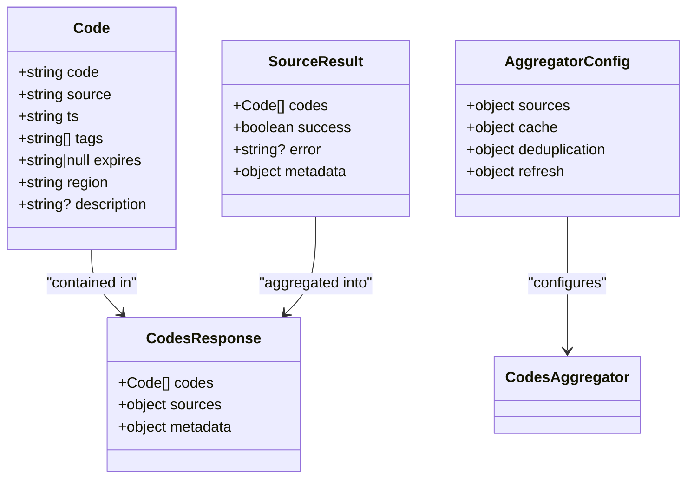
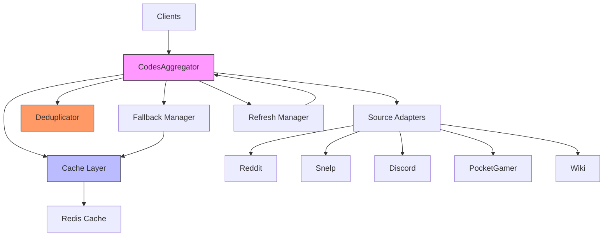
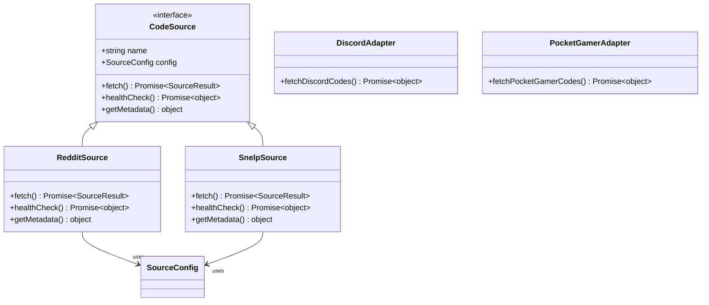
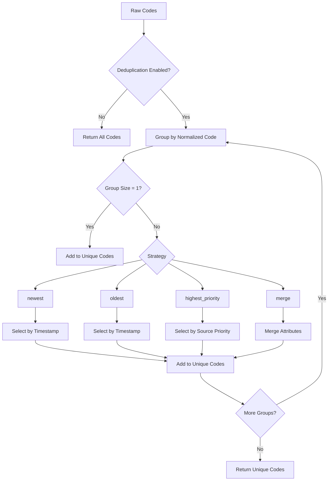
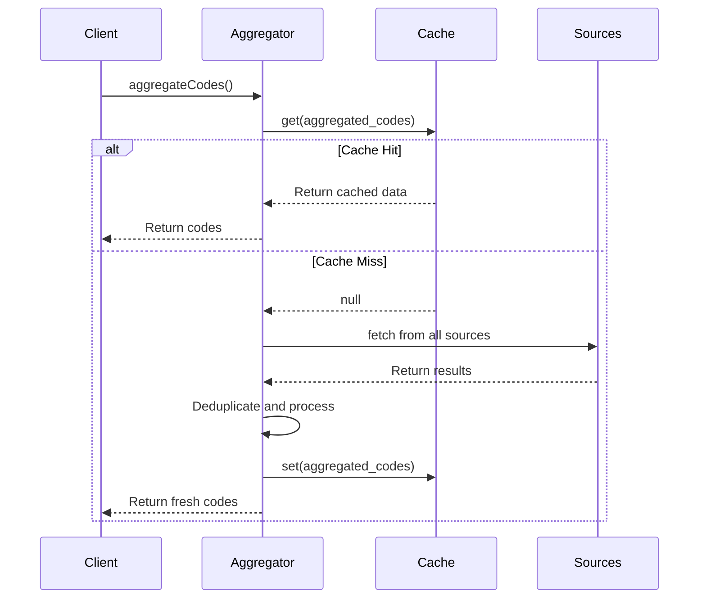
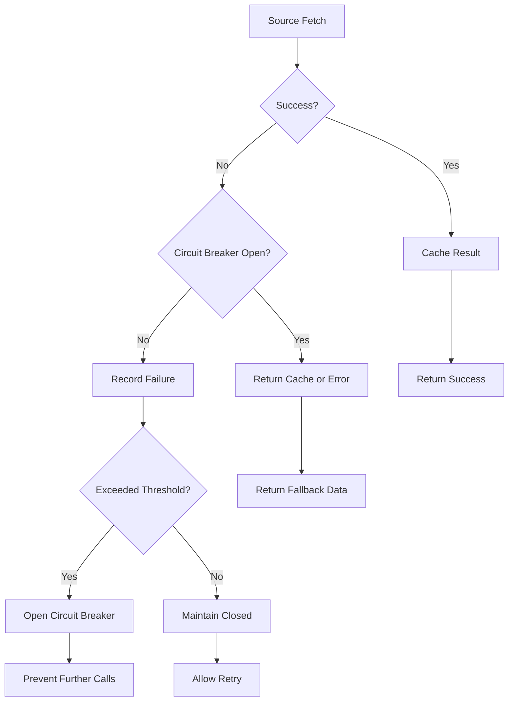
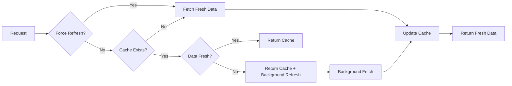
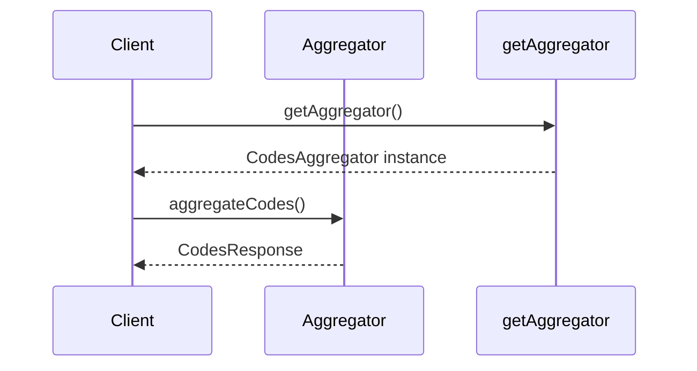

# Shared Codes Aggregation Package

<cite>
**Referenced Files in This Document**   
- [apps/web/lib/codes-aggregator.ts](file://apps/web/lib/codes-aggregator.ts)
- [apps/web/lib/codes/sources/types.ts](file://apps/web/lib/codes/sources/types.ts)
- [apps/web/lib/codes/sources/reddit.ts](file://apps/web/lib/codes/sources/reddit.ts)
- [apps/web/lib/codes/sources/snelp.ts](file://apps/web/lib/codes/sources/snelp.ts)
- [apps/web/lib/codes/deduplication.ts](file://apps/web/lib/codes/deduplication.ts)
- [apps/web/lib/codes/cache.ts](file://apps/web/lib/codes/cache.ts)
- [apps/web/lib/codes/fallbacks.ts](file://apps/web/lib/codes/fallbacks.ts)
- [apps/web/lib/codes/refresh.ts](file://apps/web/lib/codes/refresh.ts)
- [apps/web/lib/adapters/discord.ts](file://apps/web/lib/adapters/discord.ts)
- [apps/web/lib/adapters/pocketgamer.ts](file://apps/web/lib/adapters/pocketgamer.ts)
- [apps/web/lib/adapters/wiki.ts](file://apps/web/lib/adapters/wiki.ts)
- [apps/web/lib/types/codes.ts](file://apps/web/lib/types/codes.ts)
</cite>

## Table of Contents
1. [Introduction](#introduction)
2. [Core Data Structures](#core-data-structures)
3. [Aggregation Architecture](#aggregation-architecture)
4. [Source Adapters](#source-adapters)
5. [Deduplication Logic](#deduplication-logic)
6. [Caching Strategy](#caching-strategy)
7. [Fallback and Resilience](#fallback-and-resilience)
8. [Auto-Refresh Mechanism](#auto-refresh-mechanism)
9. [Usage Examples](#usage-examples)
10. [Performance Considerations](#performance-considerations)
11. [Extension Points](#extension-points)

## Introduction

The Shared Codes Aggregation Package provides a comprehensive solution for collecting, processing, and serving promotional codes from multiple external sources. This system powers the codes aggregator feature used across web, admin-ui, and background processors, ensuring consistent access to the latest promotional codes for the Super Snail game.

The package implements a robust architecture that handles code ingestion from diverse sources including Reddit, Discord, PocketGamer, and official Snelp APIs. It features sophisticated deduplication, caching, and fallback mechanisms to ensure high availability and data quality. The system is designed with extensibility in mind, allowing new sources to be added through the adapter pattern without modifying core aggregation logic.

**Section sources**
- [apps/web/lib/codes-aggregator.ts](file://apps/web/lib/codes-aggregator.ts#L1-L50)

## Core Data Structures

The package defines several key data structures that form the foundation of the code aggregation system. The primary `Code` interface represents a promotional code with essential metadata including the code string, source information, timestamps, expiration data, region specificity, and descriptive tags.



**Diagram sources**
- [apps/web/lib/codes-aggregator.ts](file://apps/web/lib/codes-aggregator.ts#L15-L52)
- [apps/web/lib/codes/sources/types.ts](file://apps/web/lib/codes/sources/types.ts#L6-L30)

The `CodesResponse` structure provides a comprehensive output format that includes not only the aggregated codes but also detailed metadata about the aggregation process, source health, and deduplication statistics. This rich metadata enables clients to understand the quality and freshness of the returned data.

## Aggregation Architecture

The core of the system is the `CodesAggregator` class, which orchestrates the entire code aggregation process. It follows a modular architecture with clearly separated concerns for source management, caching, deduplication, and error handling.



**Diagram sources**
- [apps/web/lib/codes-aggregator.ts](file://apps/web/lib/codes-aggregator.ts#L95-L361)

The aggregation process follows a well-defined workflow:
1. Concurrently fetch codes from all enabled sources
2. Apply fallback mechanisms for failed sources
3. Deduplicate and merge overlapping codes
4. Sort results by recency
5. Cache the final result
6. Return enriched response with metadata

The system uses a singleton pattern for the aggregator instance, ensuring consistent configuration and state across the application. Configuration options allow tuning of timeouts, retry behavior, caching parameters, and deduplication strategies.

**Section sources**
- [apps/web/lib/codes-aggregator.ts](file://apps/web/lib/codes-aggregator.ts#L95-L361)

## Source Adapters

The package implements the adapter pattern to interface with various code sources. Each source adapter conforms to the `CodeSource` interface, providing a consistent API for fetching codes regardless of the underlying source technology.



**Diagram sources**
- [apps/web/lib/codes/sources/types.ts](file://apps/web/lib/codes/sources/types.ts#L33-L60)
- [apps/web/lib/codes/sources/reddit.ts](file://apps/web/lib/codes/sources/reddit.ts#L18-L305)
- [apps/web/lib/codes/sources/snelp.ts](file://apps/web/lib/codes/sources/snelp.ts#L18-L304)
- [apps/web/lib/adapters/discord.ts](file://apps/web/lib/adapters/discord.ts#L67-L151)
- [apps/web/lib/adapters/pocketgamer.ts](file://apps/web/lib/adapters/pocketgamer.ts#L72-L155)

### Reddit Adapter

The Reddit adapter (`RedditSource`) connects to the r/SuperSnailGame subreddit to extract community-submitted codes. It uses the Reddit search API to find posts containing "code" in the title or content. The adapter includes sophisticated text analysis to identify potential codes while filtering out false positives like URLs, common words, and non-code patterns.

Key features:
- Configurable timeout and retry parameters
- Rate limit awareness
- False positive filtering using regex patterns
- Post context preservation in code descriptions
- Health checking via subreddit availability

### Snelp Adapter

The Snelp adapter (`SnelpSource`) connects to the official Snelp API to retrieve authoritative codes. It handles environment configuration through the `NEXT_PUBLIC_SNELP_CODES_URL` variable and includes URL resolution logic to accommodate different API endpoint formats.

Key features:
- Environment-based configuration
- Flexible URL resolution
- Response transformation from various API formats
- Comprehensive validation of code format and content
- Health checking via API endpoint availability

### External Source Adapters

Additional adapters provide connectivity to other code sources:

- **Discord Adapter**: Monitors the official Super Snail Discord channel for pinned messages and code announcements
- **PocketGamer Adapter**: Uses Firecrawl API to scrape codes from gaming news sites
- **Wiki Adapter**: Integrates with community wikis for comprehensive code listings

These adapters follow the same principles of resilience, error handling, and metadata enrichment as the core adapters.

**Section sources**
- [apps/web/lib/codes/sources/reddit.ts](file://apps/web/lib/codes/sources/reddit.ts#L18-L305)
- [apps/web/lib/codes/sources/snelp.ts](file://apps/web/lib/codes/sources/snelp.ts#L18-L304)
- [apps/web/lib/adapters/discord.ts](file://apps/web/lib/adapters/discord.ts#L67-L151)
- [apps/web/lib/adapters/pocketgamer.ts](file://apps/web/lib/adapters/pocketgamer.ts#L72-L155)
- [apps/web/lib/adapters/wiki.ts](file://apps/web/lib/adapters/wiki.ts#L72-L155)

## Deduplication Logic

The deduplication system is a critical component that ensures code quality by eliminating duplicates and resolving conflicts between different sources. The `CodeDeduplicator` class implements multiple strategies for handling duplicate codes.



**Diagram sources**
- [apps/web/lib/codes/deduplication.ts](file://apps/web/lib/codes/deduplication.ts#L49-L242)

The system supports four deduplication strategies:
- **newest**: Selects the most recently created code
- **oldest**: Selects the earliest created code
- **highest_priority**: Selects based on configurable source priority order
- **merge**: Combines attributes from all duplicates (tags, descriptions, etc.)

The deduplication process normalizes codes by converting to uppercase and removing whitespace before comparison. It also provides comprehensive statistics on the deduplication process, including counts of total, unique, and duplicate codes.

**Section sources**
- [apps/web/lib/codes/deduplication.ts](file://apps/web/lib/codes/deduplication.ts#L49-L303)

## Caching Strategy

The caching system uses Redis to store aggregated results and intermediate data, significantly improving performance and reducing load on external APIs. The `CodesCache` class provides a robust interface with retry logic and connection management.



**Diagram sources**
- [apps/web/lib/codes/cache.ts](file://apps/web/lib/codes/cache.ts#L42-L277)

Key caching features:
- Configurable TTL (Time To Live) with default of 300 seconds
- Stale-while-revalidate support
- Automatic Redis connection management
- Retry logic for transient failures
- Comprehensive cache statistics
- Key prefixing for namespace isolation

The system uses specific cache keys defined in the `CacheKeys` object, including `aggregated_codes` for the final result and source-specific keys for intermediate data.

**Section sources**
- [apps/web/lib/codes/cache.ts](file://apps/web/lib/codes/cache.ts#L42-L301)

## Fallback and Resilience

The fallback system ensures high availability even when external sources are unavailable. The `FallbackManager` implements multiple resilience patterns including circuit breakers, cached data fallback, and emergency codes.



**Diagram sources**
- [apps/web/lib/codes/fallbacks.ts](file://apps/web/lib/codes/fallbacks.ts#L47-L310)

The fallback mechanisms include:
- **Circuit Breaker**: Prevents cascading failures by temporarily halting requests to failing services
- **Cache Fallback**: Returns stale data when sources fail, configurable with age limits
- **Emergency Codes**: Hardcoded fallback codes for critical situations
- **Retry Logic**: Configurable retry attempts with exponential backoff

The system tracks failure counts and automatically resets the circuit breaker after a recovery timeout, allowing gradual reconnection to restored services.

**Section sources**
- [apps/web/lib/codes/fallbacks.ts](file://apps/web/lib/codes/fallbacks.ts#L47-L325)

## Auto-Refresh Mechanism

The refresh system implements a stale-while-revalidate pattern to ensure data freshness while maintaining responsiveness. The `CodesRefreshManager` handles both on-demand and periodic refreshes.



**Diagram sources**
- [apps/web/lib/codes/refresh.ts](file://apps/web/lib/codes/refresh.ts#L41-L240)

Key refresh features:
- Configurable refresh interval (default: 300 seconds)
- Stale-while-revalidate support
- Background refresh to avoid blocking requests
- Force refresh threshold for stale data
- Automatic refresh interval management
- Comprehensive refresh statistics

The system balances freshness and performance by serving stale data when available while asynchronously refreshing in the background, ensuring users always receive a timely response.

**Section sources**
- [apps/web/lib/codes/refresh.ts](file://apps/web/lib/codes/refresh.ts#L41-L297)

## Usage Examples

The package provides multiple interfaces for accessing aggregated codes, from high-level convenience functions to fine-grained control through the aggregator instance.

### Basic Usage



**Diagram sources**
- [apps/web/lib/codes-aggregator.ts](file://apps/web/lib/codes-aggregator.ts#L347-L360)

The simplest usage pattern uses the legacy `aggregateCodes()` function or the singleton pattern with `getAggregator()`:

```typescript
import { aggregateCodes } from "@/lib/codes-aggregator";

const result = await aggregateCodes();
// Process result.codes array
```

### Advanced Configuration

For customized behavior, create an aggregator instance with specific configuration:

```typescript
import { CodesAggregator } from "@/lib/codes-aggregator";

const aggregator = new CodesAggregator({
  sources: {
    reddit: { enabled: false },
    snelp: { cacheTtl: 600 }
  },
  deduplication: {
    strategy: "merge",
    priorityOrder: ["snelp", "discord", "reddit"]
  }
});

const result = await aggregator.aggregateCodes();
```

### Filtering and Search

The package includes utility functions for filtering and searching codes:

```typescript
import { filterByScope, searchCodes } from "@/lib/codes-aggregator";

// Filter for active codes only
const activeCodes = filterByScope(allCodes, "active");

// Search for codes matching a query
const searchResults = searchCodes(allCodes, "special");
```

These functions support scopes like "active", "past7" (last 7 days), and "all", with search functionality that matches code strings, descriptions, and tags.

**Section sources**
- [apps/web/lib/codes-aggregator.ts](file://apps/web/lib/codes-aggregator.ts#L358-L405)

## Performance Considerations

The package is designed with performance and scalability in mind, implementing several optimizations for handling large datasets and high request volumes.

### Caching Strategy

The Redis-based caching system dramatically reduces load on external APIs and improves response times. With a default TTL of 300 seconds, the system can serve cached results for most requests, only hitting external sources when necessary.

### Concurrent Processing

The aggregator fetches from all sources concurrently using `Promise.allSettled()`, minimizing total latency. This parallel processing ensures that slow sources don't block faster ones.

### Memory Efficiency

The deduplication system uses efficient data structures like Maps and Sets to minimize memory usage when processing large code sets. The normalization process reduces storage requirements by eliminating whitespace and standardizing case.

### Rate Limit Awareness

Each source adapter respects rate limits and implements appropriate delays to avoid being blocked by external services. The circuit breaker pattern prevents overwhelming failing services with repeated requests.

### Scalability

The stateless design allows the system to scale horizontally across multiple instances. The shared Redis cache ensures consistency while enabling load distribution.

**Section sources**
- [apps/web/lib/codes-aggregator.ts](file://apps/web/lib/codes-aggregator.ts#L199-L206)
- [apps/web/lib/codes/cache.ts](file://apps/web/lib/codes/cache.ts#L121-L149)

## Extension Points

The package is designed to be extensible, with several well-defined extension points for adding new functionality.

### Adding New Sources

New sources can be added by implementing the `CodeSource` interface and registering the adapter:

```typescript
import { CodeSource, SourceFactory } from "@/lib/codes/sources/types";

class NewSource implements CodeSource {
  readonly name = "newsource";
  readonly config;
  
  constructor(config) {
    this.config = { /* default config */ };
  }
  
  async fetch() {
    // Implementation
  }
  
  async healthCheck() {
    // Implementation
  }
  
  getMetadata() {
    // Implementation
  }
}

export const createNewSource: SourceFactory<NewSource> = (config) => {
  return new NewSource(config);
};
```

The factory pattern allows the new source to be integrated into the aggregator configuration seamlessly.

### Custom Filtering Rules

Custom filtering logic can be implemented by extending the existing utility functions or creating new ones:

```typescript
function filterByRegion(codes: Code[], region: string): Code[] {
  return codes.filter(code => code.region === region);
}

function filterByExpiration(codes: Code[], status: "active" | "expired"): Code[] {
  const now = new Date();
  return codes.filter(code => {
    if (!code.expires) return status === "active";
    return status === "active" ? new Date(code.expires) > now : new Date(code.expires) <= now;
  });
}
```

### Configuration Overrides

The system supports configuration overrides at multiple levels:
- Global defaults in `DEFAULT_CONFIG`
- Instance-level configuration in `CodesAggregator` constructor
- Source-specific configuration in the sources object
- Runtime configuration through environment variables

This layered configuration approach allows fine-grained control over system behavior in different environments.

**Section sources**
- [apps/web/lib/codes/sources/types.ts](file://apps/web/lib/codes/sources/types.ts#L33-L60)
- [apps/web/lib/codes-aggregator.ts](file://apps/web/lib/codes-aggregator.ts#L57-L90)