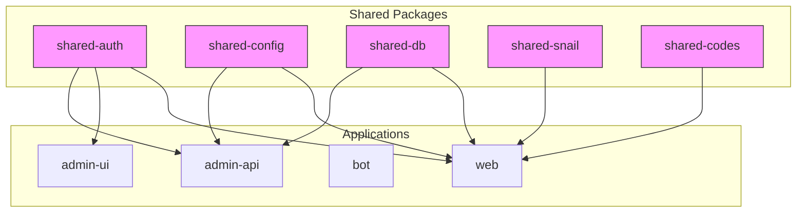
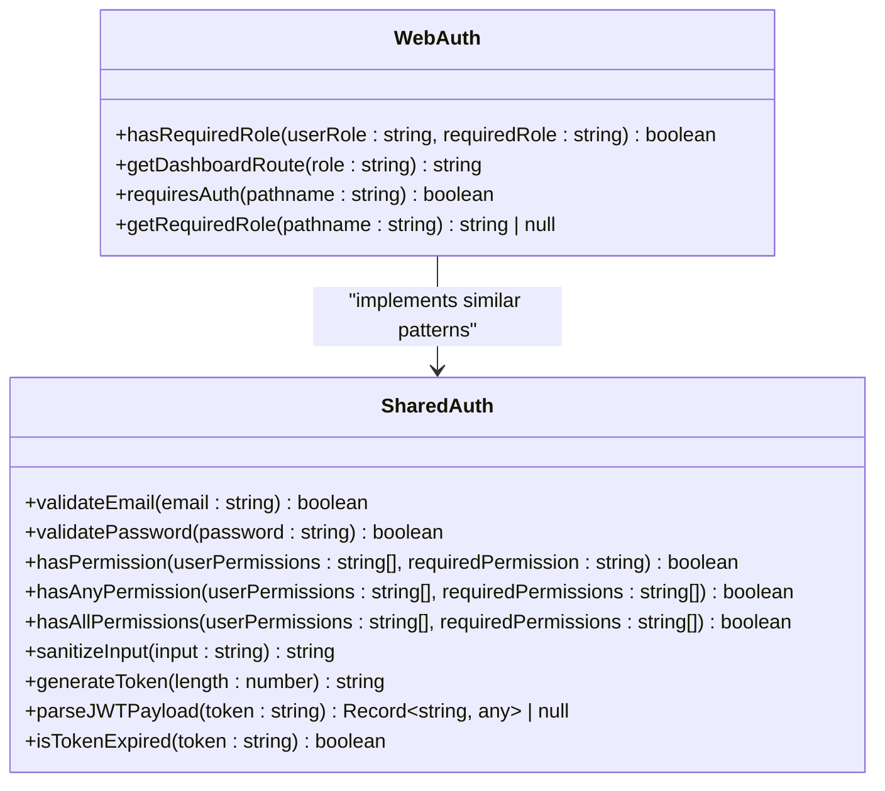
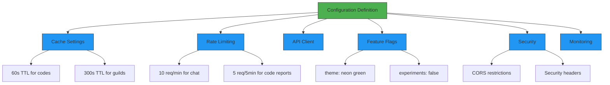
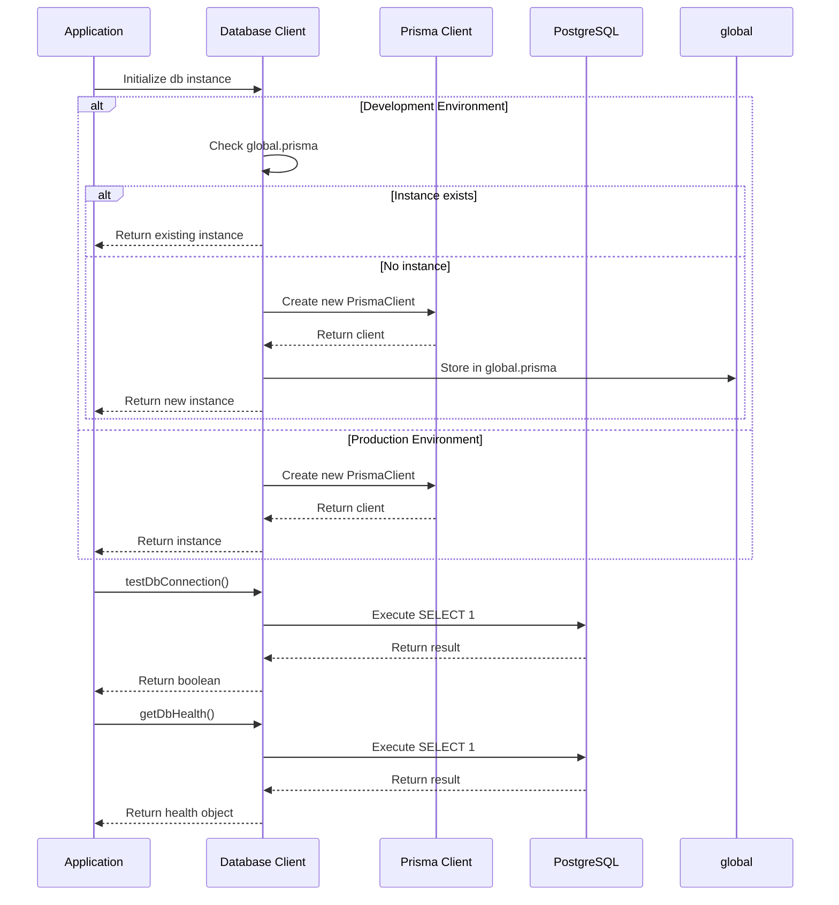
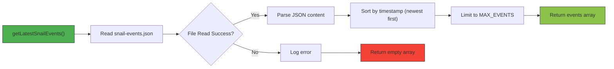

# Shared Components

<cite>
**Referenced Files in This Document**   
- [shared-auth/src/index.ts](file://packages/shared-auth/src/index.ts)
- [shared-config/package.json](file://packages/shared-config/package.json)
- [shared-db/package.json](file://packages/shared-db/package.json)
- [shared-snail/package.json](file://packages/shared-snail/package.json)
- [shared-codes/package.json](file://packages/shared-codes/package.json)
- [web/lib/config.ts](file://apps/web/lib/config.ts)
- [web/lib/db.ts](file://apps/web/lib/db.ts)
- [web/lib/snail-events.ts](file://apps/web/lib/snail-events.ts)
- [web/lib/codes-aggregator.ts](file://apps/web/lib/codes-aggregator.ts)
- [web/lib/auth/index.ts](file://apps/web/lib/auth/index.ts)
</cite>

## Table of Contents
1. [Introduction](#introduction)
2. [Shared Packages Overview](#shared-packages-overview)
3. [shared-auth Package](#shared-auth-package)
4. [shared-config Package](#shared-config-package)
5. [shared-db Package](#shared-db-package)
6. [shared-snail Package](#shared-snail-package)
7. [shared-codes Package](#shared-codes-package)
8. [Usage Patterns Across Applications](#usage-patterns-across-applications)
9. [Dependency Management Strategy](#dependency-management-strategy)
10. [Backward Compatibility and Migration](#backward-compatibility-and-migration)
11. [Guidelines for Creating New Shared Packages](#guidelines-for-creating-new-shared-packages)

## Introduction
The slimy-monorepo platform utilizes a collection of shared packages to promote code reuse, maintain consistency across applications, and reduce duplication. These shared components provide essential functionality for authentication, configuration management, database access, snail-related operations, and codes aggregation. This document details each shared package, its API surface, usage patterns, and the strategies employed for dependency management and backward compatibility within the monorepo architecture.

## Shared Packages Overview

The slimy-monorepo contains five primary shared packages located in the `packages/` directory:

- **shared-auth**: Authentication utilities for email validation, password strength checking, permission management, and JWT handling
- **shared-config**: Configuration management for centralized application settings
- **shared-db**: Database access patterns and connection management
- **shared-snail**: Snail-related functionality and event processing
- **shared-codes**: Codes aggregation logic for combining data from multiple sources

These packages are designed as reusable libraries that can be imported by any application within the monorepo, ensuring consistent implementation of common functionality across different services.



**Diagram sources**
- [packages/shared-auth/package.json](file://packages/shared-auth/package.json)
- [packages/shared-config/package.json](file://packages/shared-config/package.json)
- [packages/shared-db/package.json](file://packages/shared-db/package.json)
- [packages/shared-snail/package.json](file://packages/shared-snail/package.json)
- [packages/shared-codes/package.json](file://packages/shared-codes/package.json)

**Section sources**
- [packages/shared-auth/package.json](file://packages/shared-auth/package.json)
- [packages/shared-config/package.json](file://packages/shared-config/package.json)
- [packages/shared-db/package.json](file://packages/shared-db/package.json)
- [packages/shared-snail/package.json](file://packages/shared-snail/package.json)
- [packages/shared-codes/package.json](file://packages/shared-codes/package.json)

## shared-auth Package

The shared-auth package provides a collection of authentication utilities used across the slimy-monorepo applications. It includes functions for validating user credentials, managing permissions, and handling JWT tokens.

### API Surface
The package exports the following functions:

- `validateEmail(email: string)`: Validates if an email address is in a valid format
- `validatePassword(password: string)`: Checks password strength against requirements (8+ characters, uppercase, lowercase, number)
- `hasPermission(userPermissions: string[], requiredPermission: string)`: Determines if a user has a specific permission
- `hasAnyPermission(userPermissions: string[], requiredPermissions: string[])`: Checks if a user has any of the required permissions
- `hasAllPermissions(userPermissions: string[], requiredPermissions: string[])`: Verifies if a user has all required permissions
- `sanitizeInput(input: string)`: Removes potentially dangerous characters from user input
- `generateToken(length: number = 32)`: Generates a random token of specified length
- `parseJWTPayload(token: string)`: Parses a JWT token payload (for display purposes only)
- `isTokenExpired(token: string)`: Checks if a JWT token is expired based on its exp claim

### Usage Patterns
Applications import and use these utilities to implement consistent authentication logic. For example, the web application uses similar permission checking patterns in its authentication layer, demonstrating the shared principles even when not directly importing the package.



**Diagram sources**
- [packages/shared-auth/src/index.ts](file://packages/shared-auth/src/index.ts)
- [apps/web/lib/auth/index.ts](file://apps/web/lib/auth/index.ts)

**Section sources**
- [packages/shared-auth/src/index.ts](file://packages/shared-auth/src/index.ts)

## shared-config Package

The shared-config package provides centralized configuration management for applications within the slimy-monorepo. It defines a standardized approach to managing application settings across different environments and services.

### API Surface
While the package.json indicates the package exists, the implementation details are primarily found in application-specific configuration files. The web application demonstrates a comprehensive configuration system with typed constants for various domains:

- Cache configuration with TTL settings for different data types
- Rate limiting parameters for API endpoints and user actions
- API client settings including retry policies and timeouts
- Feature flags with default values and storage configuration
- Security settings for CORS, headers, and rate limiting behavior
- Monitoring and logging configuration based on environment

### Usage Patterns
Applications import configuration constants to ensure consistent behavior across the platform. The configuration system uses TypeScript const assertions to ensure immutability and type safety, making it difficult to accidentally modify configuration values at runtime.



**Diagram sources**
- [apps/web/lib/config.ts](file://apps/web/lib/config.ts)

**Section sources**
- [packages/shared-config/package.json](file://packages/shared-config/package.json)
- [apps/web/lib/config.ts](file://apps/web/lib/config.ts)

## shared-db Package

The shared-db package provides standardized database access patterns across the slimy-monorepo applications. It encapsulates database connection management and provides a consistent interface for database operations.

### API Surface
The package.json indicates the package exists, but implementation details are found in application-specific database modules. The web application demonstrates a sophisticated database client implementation using Prisma ORM with the following features:

- Singleton Prisma client instance to prevent multiple connections
- Development environment optimization to handle hot reloading
- Database connection testing and health check functions
- Graceful connection termination
- Type exports from Prisma client for consistent type usage

### Usage Patterns
The database package follows a singleton pattern to ensure efficient resource usage. In development, it leverages a global variable to maintain a single instance during hot reloads, preventing connection leaks. The implementation includes comprehensive error handling and health monitoring capabilities.



**Diagram sources**
- [apps/web/lib/db.ts](file://apps/web/lib/db.ts)

**Section sources**
- [packages/shared-db/package.json](file://packages/shared-db/package.json)
- [apps/web/lib/db.ts](file://apps/web/lib/db.ts)

## shared-snail Package

The shared-snail package provides functionality related to snail operations and events within the slimy-monorepo platform. It handles snail-related data processing and event management.

### API Surface
The package.json indicates the package exists, but implementation details are found in application-specific snail modules. The web application demonstrates snail event handling with the following components:

- `SnailEvent` interface defining the structure of snail events
- `getLatestSnailEvents()` function that reads and parses JSON data from a file
- File-backed storage using `data/snail-events.json`
- Event sorting by timestamp (newest first)
- Limiting results to a maximum number of events

### Usage Patterns
The snail package follows a file-based data storage pattern, reading events from a JSON file in the data directory. This approach provides a simple, persistent storage mechanism for snail-related events without requiring a database connection. The implementation includes error handling to gracefully manage file read failures.



**Diagram sources**
- [apps/web/lib/snail-events.ts](file://apps/web/lib/snail-events.ts)

**Section sources**
- [packages/shared-snail/package.json](file://packages/shared-snail/package.json)
- [apps/web/lib/snail-events.ts](file://apps/web/lib/snail-events.ts)

## shared-codes Package

The shared-codes package provides comprehensive codes aggregation logic for combining data from multiple sources with advanced features like caching, deduplication, and fallback mechanisms.

### API Surface
The package.json indicates the package exists with an entry point at `src/index.ts`. The web application demonstrates a sophisticated codes aggregation system with the following components:

- `CodesAggregator` class that manages the aggregation process
- Multiple source adapters (Snelp, Reddit) with configurable timeouts and retries
- Caching layer with TTL and stale-while-revalidate support
- Deduplication system with configurable strategies (newest, oldest, priority)
- Fallback mechanisms for handling source failures
- Auto-refresh capability for periodic updates
- Comprehensive health monitoring

### Usage Patterns
The codes aggregation system follows a modular architecture with pluggable components for different aspects of the aggregation process. It implements the singleton pattern to ensure a single instance across the application, with lazy initialization. The system provides both modern class-based and legacy function-based interfaces for backward compatibility.

```mermaid
classDiagram
class CodesAggregator {
-sources Map~string, CodeSource~
-config AggregatorConfig
-cache Cache
-deduplicator Deduplicator
-fallbackManager FallbackManager
-refreshManager CodesRefreshManager
+aggregateCodes() Promise~CodesResponse~
+getHealthStatus() Promise~HealthStatus~
}
class CodeSource {
+name string
+fetch() Promise~SourceResult~
+healthCheck() Promise~HealthStatus~
}
class Cache {
+get~T~(key : string) Promise~T | undefined~
+set(key : string, value : any, ttl? : number) Promise~void~
+getStats() Promise~CacheStats~
}
class Deduplicator {
+deduplicate(codes : Code[]) DeduplicationResult
}
class FallbackManager {
+executeWithFallback~T~(fn : () => Promise~T~, source : string, options : FallbackOptions) Promise~T~
+aggregateWithFallbacks(results : SourceResult[]) Promise~AggregatedResult~
}
class CodesRefreshManager {
+startCodesAutoRefresh(fetchFn : () => Promise~CodesResponse~) void
+getCodesWithRefresh(fetchFn : () => Promise~CodesResponse~) Promise~{response : CodesResponse, isStale : boolean}~
}
CodesAggregator --> CodeSource : "uses"
CodesAggregator --> Cache : "uses"
CodesAggregator --> Deduplicator : "uses"
CodesAggregator --> FallbackManager : "uses"
CodesAggregator --> CodesRefreshManager : "uses"
```

**Diagram sources**
- [apps/web/lib/codes-aggregator.ts](file://apps/web/lib/codes-aggregator.ts)

**Section sources**
- [packages/shared-codes/package.json](file://packages/shared-codes/package.json)
- [apps/web/lib/codes-aggregator.ts](file://apps/web/lib/codes-aggregator.ts)

## Usage Patterns Across Applications

Shared packages are imported and utilized consistently across applications within the slimy-monorepo. The web application serves as the primary consumer of these shared components, demonstrating best practices for integration.

### Import Patterns
Applications import shared packages using their scoped package names (e.g., @slimy/shared-auth). Configuration and utility functions are typically imported at the top level of modules that require them, ensuring they are available throughout the file.

### Consistency Benefits
The shared packages promote consistency in several ways:
- Authentication logic is implemented uniformly across services
- Configuration values are centralized, preventing drift between applications
- Database connection patterns are standardized, reducing the risk of connection leaks
- Error handling and fallback mechanisms are consistent across data aggregation
- Type definitions are shared, ensuring data contract consistency

### Example Implementation
The web application's codes aggregation system demonstrates how shared principles are applied even when not directly importing a shared package. The implementation follows similar patterns to what would be expected from the shared-codes package, suggesting a consistent architectural approach across the monorepo.

## Dependency Management Strategy

The slimy-monorepo employs a monorepo dependency management strategy using pnpm workspaces to manage shared packages and application dependencies.

### Versioning Approach
All shared packages are currently at version 0.0.0, indicating they are in active development and may have breaking changes. The monorepo structure allows for atomic commits that can update both shared packages and their consumers simultaneously, reducing the risk of version incompatibilities.

### Build Process
The shared packages have placeholder build scripts that currently output "TODO" messages, suggesting the build process is not yet fully implemented. This indicates the packages are likely consumed directly from source rather than built artifacts.

### Dependency Resolution
pnpm workspaces enable efficient dependency resolution by:
- Creating symbolic links between packages in the monorepo
- Deduplicating dependencies across the entire workspace
- Maintaining a single node_modules directory at the root level
- Preventing version conflicts between shared packages and applications

## Backward Compatibility and Migration

The slimy-monorepo shared packages include considerations for backward compatibility, particularly evident in the codes aggregation system.

### Deprecation Strategy
The codes-aggregator implementation includes a deprecated `aggregateCodes()` function that serves as a backward compatibility layer for the newer `CodesAggregator` class. This pattern allows for gradual migration of consumers to the new API while maintaining functionality for existing code.

### Migration Pathways
When updating shared packages, the recommended approach includes:
1. Adding new functionality alongside existing APIs
2. Marking old functions as deprecated with JSDoc comments
3. Providing migration guides for consumers
4. Maintaining backward compatibility for a reasonable period
5. Removing deprecated functionality in major version updates

### Breaking Change Management
For breaking changes, the strategy involves:
- Incrementing the major version of the shared package
- Providing clear migration documentation
- Coordinating updates across all dependent applications
- Using the monorepo structure to make atomic changes when necessary

## Guidelines for Creating New Shared Packages

When deciding whether to create a new shared package or extend an existing one, consider the following guidelines:

### When to Create New Packages
Create a new shared package when:
- The functionality represents a distinct domain with low coupling to existing packages
- The code will be used by three or more applications
- The package has a clear, focused responsibility (following the Single Responsibility Principle)
- The functionality requires different versioning or release cycles
- The package has unique dependency requirements

### When to Extend Existing Packages
Extend an existing package when:
- The functionality is closely related to the package's current domain
- The change maintains backward compatibility
- The addition doesn't significantly increase the package's complexity
- The feature is needed by all current consumers of the package

### Package Design Principles
Follow these principles when creating or extending shared packages:
- Keep APIs simple and focused
- Provide comprehensive TypeScript types
- Include thorough documentation in JSDoc comments
- Implement robust error handling
- Design for testability
- Consider performance implications
- Plan for backward compatibility from the start