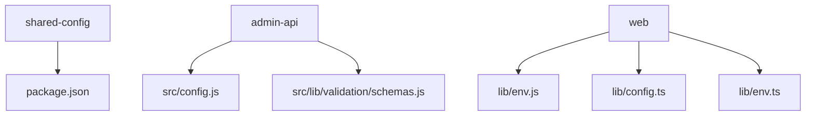
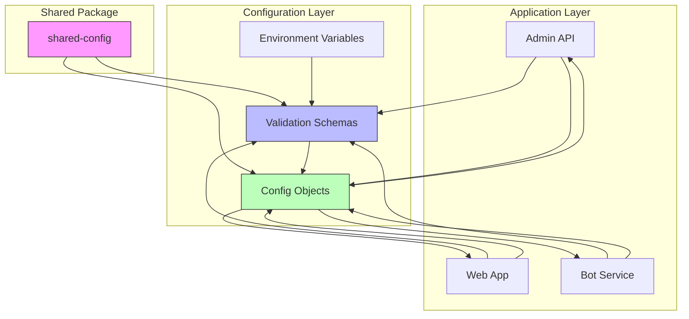
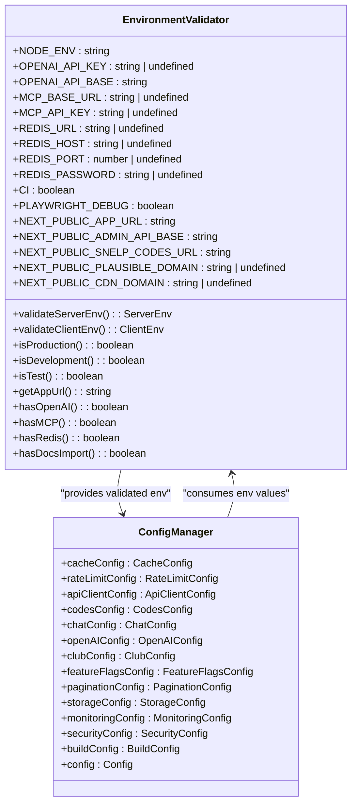
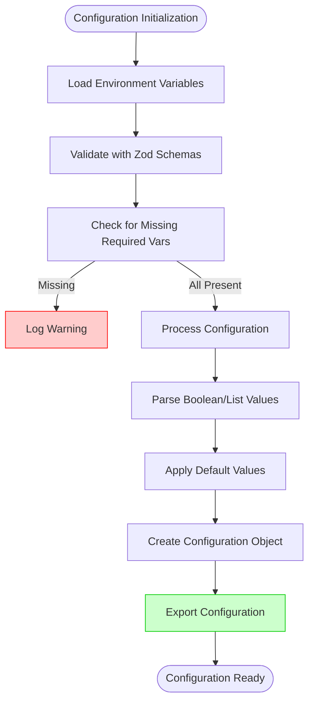
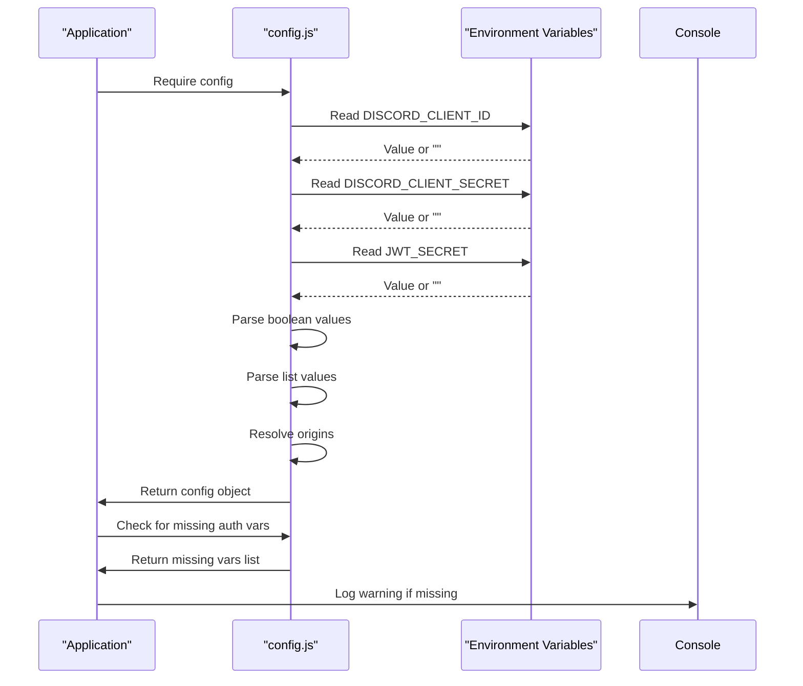
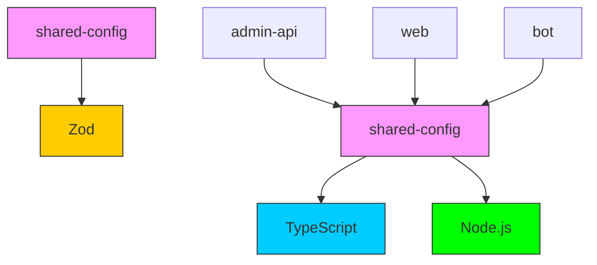

# Shared Configuration Package

<cite>
**Referenced Files in This Document**   
- [config.js](file://apps/admin-api/src/config.js)
- [env.js](file://apps/web/lib/env.js)
- [env.ts](file://apps/web/lib/env.ts)
- [config.ts](file://apps/web/lib/config.ts)
- [schemas.js](file://apps/admin-api/src/lib/validation/schemas.js)
- [schemas.ts](file://apps/admin-api/src/lib/validation/schemas.ts)
- [package.json](file://packages/shared-config/package.json)
</cite>

## Table of Contents
1. [Introduction](#introduction)
2. [Project Structure](#project-structure)
3. [Core Components](#core-components)
4. [Architecture Overview](#architecture-overview)
5. [Detailed Component Analysis](#detailed-component-analysis)
6. [Dependency Analysis](#dependency-analysis)
7. [Performance Considerations](#performance-considerations)
8. [Troubleshooting Guide](#troubleshooting-guide)
9. [Conclusion](#conclusion)

## Introduction
The shared-config package is designed to standardize environment configuration management across all applications in the monorepo. Although the package itself currently lacks implementation, the configuration patterns are already established across the admin-api, web, and bot services. This document details how these applications handle environment variables, validation, and configuration loading, providing a blueprint for the future implementation of the shared-config package.

## Project Structure

**Diagram sources**
- [package.json](file://packages/shared-config/package.json)
- [config.js](file://apps/admin-api/src/config.js)
- [env.js](file://apps/web/lib/env.js)
- [config.ts](file://apps/web/lib/config.ts)

**Section sources**
- [package.json](file://packages/shared-config/package.json)
- [config.js](file://apps/admin-api/src/config.js)
- [env.js](file://apps/web/lib/env.js)
- [config.ts](file://apps/web/lib/config.ts)

## Core Components

The configuration system in the monorepo consists of several key components that will be consolidated into the shared-config package:

1. **Environment Variable Validation**: Using Zod for runtime type checking and validation
2. **Configuration Loading**: Centralized configuration objects with default values
3. **Environment Detection**: Helpers for determining NODE_ENV and related behaviors
4. **Feature Detection**: Utilities to check for optional service availability

The current implementation shows a clear pattern of separating environment variable validation from application configuration, with the web application using a more comprehensive approach with Zod validation.

**Section sources**
- [env.js](file://apps/web/lib/env.js)
- [config.js](file://apps/admin-api/src/config.js)
- [config.ts](file://apps/web/lib/config.ts)

## Architecture Overview

**Diagram sources**
- [env.js](file://apps/web/lib/env.js)
- [config.js](file://apps/admin-api/src/config.js)
- [config.ts](file://apps/web/lib/config.ts)

## Detailed Component Analysis

### Environment Validation Analysis

The configuration system implements robust environment variable validation using Zod, particularly in the web application. The validation process separates server-side and client-side environment variables, ensuring that sensitive configuration remains server-only while public configuration is safely exposed to the client.

**Diagram sources**
- [env.js](file://apps/web/lib/env.js)
- [config.ts](file://apps/web/lib/config.ts)

### Configuration Schema Analysis

The configuration schema design follows a modular approach with typed constants. Each configuration category is defined as a separate object with specific properties and default values. The web application's implementation is particularly comprehensive, covering multiple aspects of the application including caching, rate limiting, API clients, and feature flags.

**Diagram sources**
- [config.js](file://apps/admin-api/src/config.js)
- [env.js](file://apps/web/lib/env.js)

### Admin API Configuration Analysis

The admin-api implements a straightforward configuration system with environment variable loading and basic validation. It defines configuration categories for Discord authentication, JWT handling, CSRF protection, network settings, role management, and UI integration. The configuration includes helper functions for parsing boolean and list values from environment variables.

**Diagram sources**
- [config.js](file://apps/admin-api/src/config.js)

## Dependency Analysis

**Diagram sources**
- [package.json](file://packages/shared-config/package.json)
- [config.js](file://apps/admin-api/src/config.js)
- [env.js](file://apps/web/lib/env.js)

## Performance Considerations

The current configuration implementation has several performance implications that should be considered for the shared package:

1. **Validation Overhead**: Environment validation occurs at module load time, which adds startup cost but ensures configuration validity early
2. **Memory Usage**: Configuration objects are created once and reused, minimizing memory overhead during application runtime
3. **Type Safety**: The use of Zod and TypeScript provides compile-time and runtime type safety, reducing configuration-related errors
4. **Caching**: Configuration values are computed once and cached in module scope, avoiding repeated parsing

The shared-config package should maintain these performance characteristics while potentially optimizing the validation process for production environments.

## Troubleshooting Guide

Common configuration issues and their solutions:

**Section sources**
- [config.js](file://apps/admin-api/src/config.js)
- [env.js](file://apps/web/lib/env.js)
- [schemas.js](file://apps/admin-api/src/lib/validation/schemas.js)

### Missing Environment Variables
When required environment variables are missing, applications log warnings but continue to run with fallback values. To resolve:
1. Check the appropriate .env file for the environment
2. Verify variable names match the expected format
3. Ensure the .env file is being loaded by the application
4. Check for typos in variable names

### Type Mismatch Errors
When environment variables have incorrect types (e.g., string instead of number), the validation system will throw errors. To resolve:
1. Verify the expected type in the validation schema
2. Convert the environment variable to the correct type
3. Check for whitespace or special characters in the value
4. Use the appropriate parsing function (parseBoolean, parseList, etc.)

### Environment-Specific Configuration Issues
When configuration behaves differently across environments:
1. Check for environment-specific .env files (.env.production, .env.development)
2. Verify NODE_ENV is set correctly
3. Check for conditional logic based on environment
4. Ensure secrets are properly managed and not committed to version control

## Conclusion

The shared-config package will consolidate the existing configuration patterns from across the monorepo into a standardized, reusable solution. The current implementations in admin-api and web applications demonstrate effective approaches to environment variable management, validation, and configuration loading that should be incorporated into the shared package. Key features to include are Zod-based validation, environment detection helpers, typed configuration objects, and support for both server and client environments. The package should maintain backward compatibility while providing a consistent interface for all applications in the monorepo.