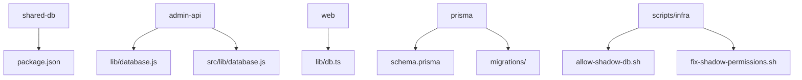
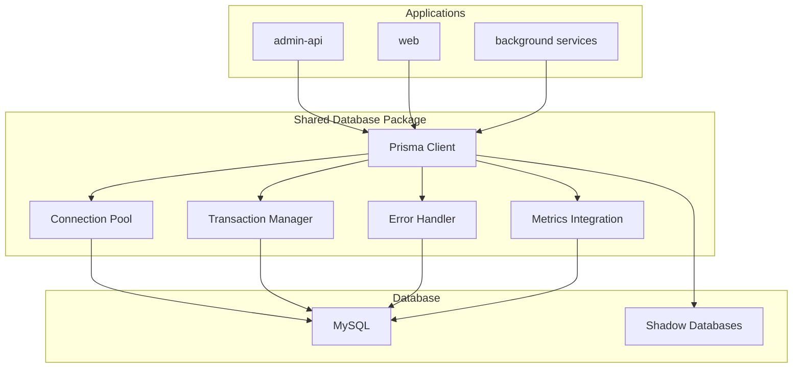
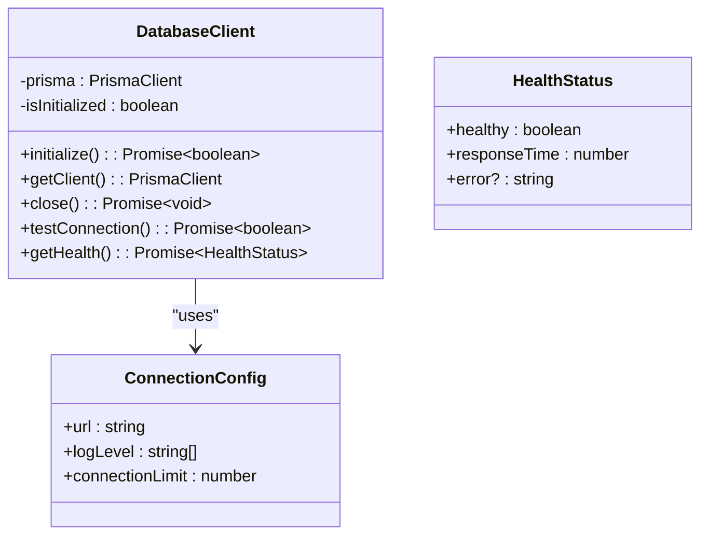
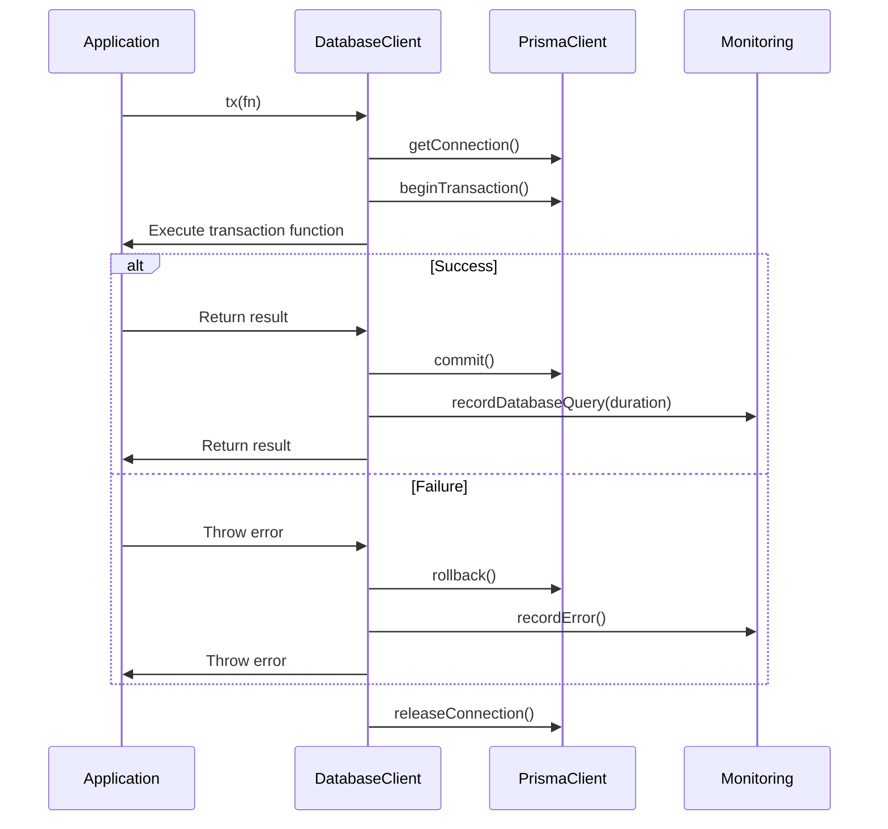
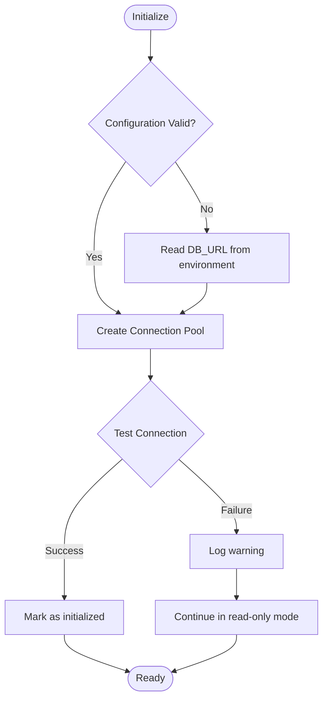
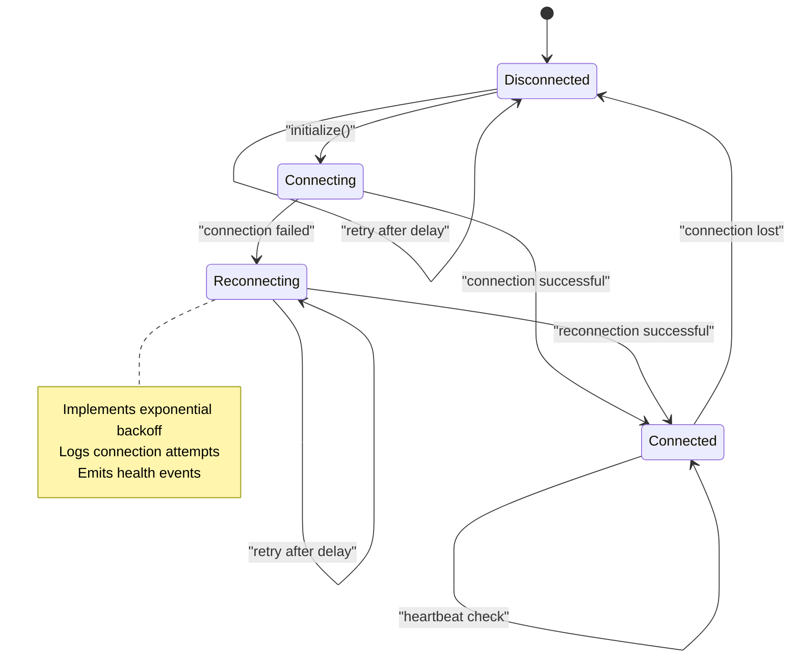

# Shared Database Access Package

<cite>
**Referenced Files in This Document**   
- [database.js](file://apps/admin-api/lib/database.js)
- [database.js](file://apps/admin-api/src/lib/database.js)
- [db.ts](file://apps/web/lib/db.ts)
- [schema.prisma](file://apps/admin-api/prisma/schema.prisma)
- [schema.prisma](file://apps/web/prisma/schema.prisma)
- [fix-shadow-permissions.sh](file://scripts/infra/fix-shadow-permissions.sh)
- [allow-shadow-db.sh](file://scripts/infra/allow-shadow-db.sh)
</cite>

## Table of Contents
1. [Introduction](#introduction)
2. [Project Structure](#project-structure)
3. [Core Components](#core-components)
4. [Architecture Overview](#architecture-overview)
5. [Detailed Component Analysis](#detailed-component-analysis)
6. [Dependency Analysis](#dependency-analysis)
7. [Performance Considerations](#performance-considerations)
8. [Troubleshooting Guide](#troubleshooting-guide)
9. [Conclusion](#conclusion)

## Introduction
The shared-db package is designed to encapsulate database access patterns and Prisma client initialization across the platform, ensuring consistent database connections, transaction handling, and ORM usage between admin-api, web, and background services. This document provides a comprehensive analysis of the current database access implementations across the monorepo and outlines the requirements for the shared-db package.

## Project Structure



**Diagram sources**
- [package.json](file://packages/shared-db/package.json)
- [database.js](file://apps/admin-api/lib/database.js)
- [database.js](file://apps/admin-api/src/lib/database.js)
- [db.ts](file://apps/web/lib/db.ts)

**Section sources**
- [package.json](file://packages/shared-db/package.json)

## Core Components

The shared-db package will consolidate database access patterns currently implemented across multiple applications. Key components include Prisma client initialization, connection pooling, transaction management, and error handling. The package will provide a unified interface for database operations while maintaining the specific requirements of each service.

**Section sources**
- [database.js](file://apps/admin-api/lib/database.js)
- [database.js](file://apps/admin-api/src/lib/database.js)
- [db.ts](file://apps/web/lib/db.ts)

## Architecture Overview



**Diagram sources**
- [database.js](file://apps/admin-api/src/lib/database.js)
- [db.ts](file://apps/web/lib/db.ts)
- [schema.prisma](file://apps/admin-api/prisma/schema.prisma)

## Detailed Component Analysis

### Database Client Initialization

The shared-db package will standardize Prisma client initialization across all services. Currently, different applications implement their own initialization logic with varying configurations.



**Diagram sources**
- [database.js](file://apps/admin-api/src/lib/database.js#L6-72)
- [db.ts](file://apps/web/lib/db.ts#L7-43)

**Section sources**
- [database.js](file://apps/admin-api/src/lib/database.js)
- [db.ts](file://apps/web/lib/db.ts)

### Transaction Management

The shared-db package will provide consistent transaction handling across services. The current implementation in admin-api demonstrates a robust transaction pattern that should be standardized.



**Diagram sources**
- [database.js](file://apps/admin-api/lib/database.js#L41-57)

### Connection Pooling and Lifecycle Management

The shared-db package will manage connection pooling and lifecycle events consistently across services. The implementation will combine the best practices from existing applications.



**Diagram sources**
- [database.js](file://apps/admin-api/lib/database.js#L18-29)
- [database.js](file://apps/admin-api/lib/database.js#L63-79)

### Error Handling and Resilience

The shared-db package will implement comprehensive error handling for database outages and connection issues, ensuring graceful degradation and proper monitoring.



**Diagram sources**
- [database.js](file://apps/admin-api/lib/database.js#L63-79)
- [db.ts](file://apps/web/lib/db.ts#L47-54)

## Dependency Analysis

```mermaid
graph TD
A[shared-db] --> B[@prisma/client]
A --> C[monitoring/metrics]
A --> D[config]
E[admin-api] --> A
F[web] --> A
G[background services] --> A
B --> H[MySQL Database]
A --> H
I[Prisma Migrations] --> A
J[Shadow Database Scripts] --> A
```

**Diagram sources**
- [package.json](file://packages/shared-db/package.json)
- [database.js](file://apps/admin-api/src/lib/database.js#L2)
- [db.ts](file://apps/web/lib/db.ts#L7)
- [allow-shadow-db.sh](file://scripts/infra/allow-shadow-db.sh)
- [fix-shadow-permissions.sh](file://scripts/infra/fix-shadow-permissions.sh)

**Section sources**
- [package.json](file://packages/shared-db/package.json)
- [database.js](file://apps/admin-api/src/lib/database.js)
- [db.ts](file://apps/web/lib/db.ts)
- [allow-shadow-db.sh](file://scripts/infra/allow-shadow-db.sh)
- [fix-shadow-permissions.sh](file://scripts/infra/fix-shadow-permissions.sh)

## Performance Considerations

The shared-db package will incorporate performance optimizations from existing implementations, including query instrumentation, connection pooling, and indexing strategies. The package will provide built-in metrics collection for database queries and connection management, enabling monitoring and optimization of database performance across all services.

**Section sources**
- [database.js](file://apps/admin-api/src/lib/database.js#L23-37)
- [schema.prisma](file://apps/admin-api/prisma/schema.prisma)

## Troubleshooting Guide

The shared-db package will include comprehensive troubleshooting capabilities, including health checks, connection testing, and detailed error reporting. When database connectivity issues occur, the package will provide clear diagnostic information to aid in resolution.

**Section sources**
- [db.ts](file://apps/web/lib/db.ts#L47-80)
- [database.js](file://apps/admin-api/lib/database.js#L63-79)

## Conclusion

The shared-db package will unify database access patterns across the platform, providing consistent initialization, connection management, transaction handling, and error resilience. By consolidating the best practices from existing implementations, the package will ensure reliable and performant database access for all services while simplifying maintenance and reducing code duplication.