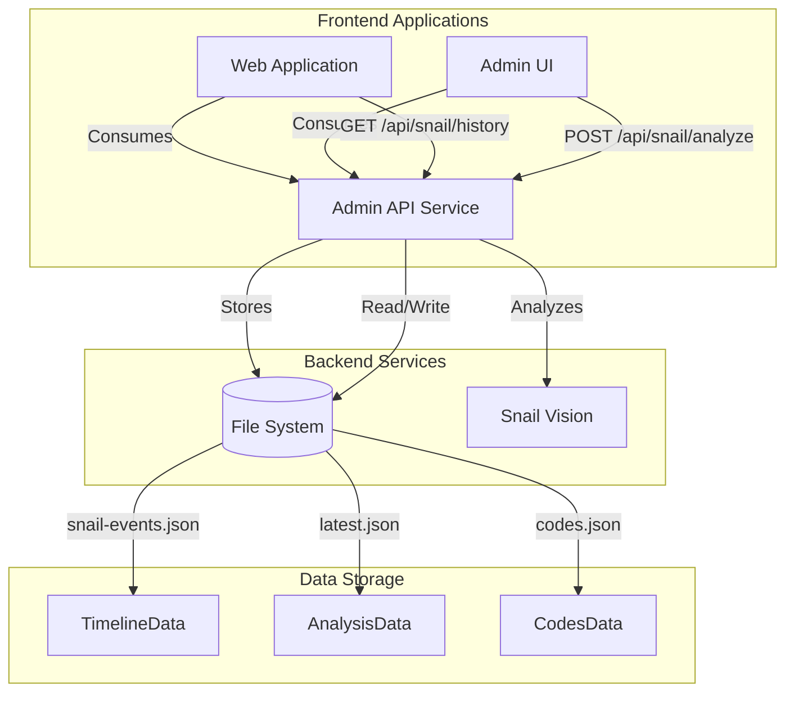
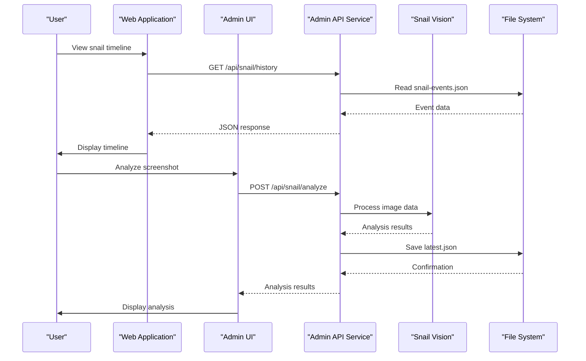
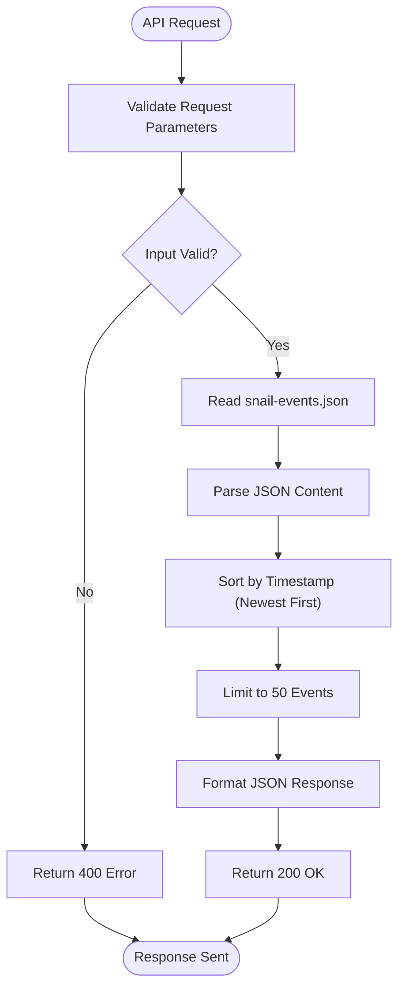
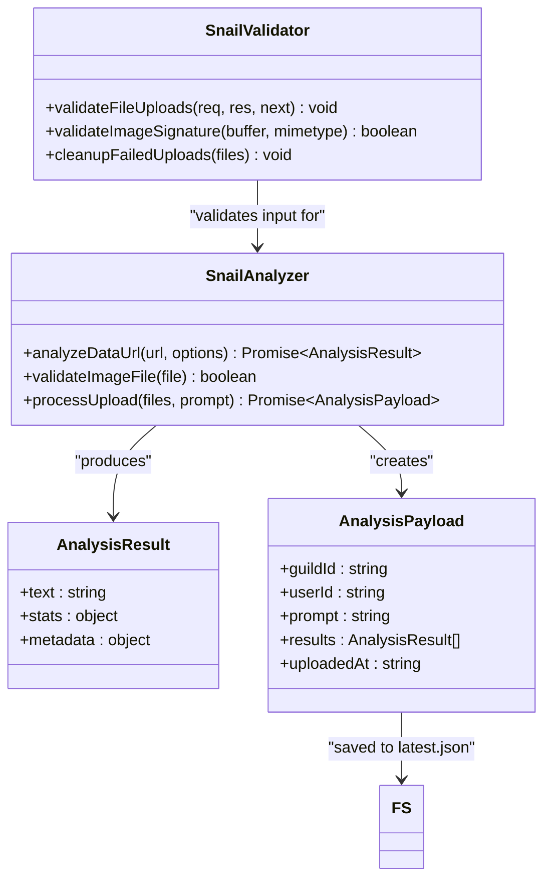
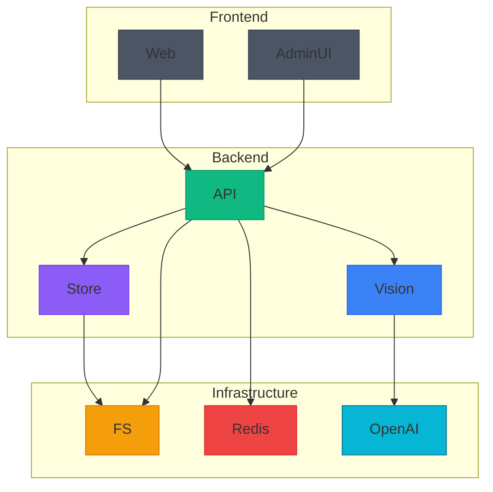

# Shared Snail Functionality Package

<cite>
**Referenced Files in This Document**   
- [snail.js](file://apps/admin-api/src/routes/snail.js#L1-L403)
- [snail-vision.js](file://apps/admin-api/lib/snail-vision.js#L1-L5)
- [schemas.js](file://apps/admin-api/src/lib/validation/schemas.js#L171-L198)
- [snail-events.ts](file://apps/web/lib/snail-events.ts#L1-L37)
- [snail-timeline.tsx](file://apps/web/components/snail-timeline.tsx#L1-L91)
- [route.ts](file://apps/web/app/api/snail/history/route.ts#L1-L32)
- [snail-events.json](file://apps/web/data/snail-events.json#L1-L31)
</cite>

## Table of Contents
1. [Introduction](#introduction)
2. [Project Structure](#project-structure)
3. [Core Components](#core-components)
4. [Architecture Overview](#architecture-overview)
5. [Detailed Component Analysis](#detailed-component-analysis)
6. [Dependency Analysis](#dependency-analysis)
7. [Performance Considerations](#performance-considerations)
8. [Troubleshooting Guide](#troubleshooting-guide)
9. [Conclusion](#conclusion)

## Introduction
The shared-snail package provides centralized business logic and utilities for snail-related features across the application suite. It enables consistent handling of snail tools, timeline processing, and event tracking for web, admin-ui, and admin-api applications. The package is designed to abstract complex game data analysis, state calculation, and history reconstruction functionality into reusable components that can be leveraged across multiple frontends and services.

## Project Structure
The shared-snail functionality is distributed across multiple applications in the monorepo, with core logic residing in the admin-api service and client-facing components in the web application. The package structure follows a microservice-oriented design where backend services provide APIs for snail functionality, while frontend applications consume these APIs and provide user interfaces.

**Diagram sources**
- [snail.js](file://apps/admin-api/src/routes/snail.js#L1-L403)
- [snail-events.ts](file://apps/web/lib/snail-events.ts#L1-L37)
- [route.ts](file://apps/web/app/api/snail/history/route.ts#L1-L32)

**Section sources**
- [snail.js](file://apps/admin-api/src/routes/snail.js#L1-L403)
- [snail-events.ts](file://apps/web/lib/snail-events.ts#L1-L37)

## Core Components
The shared-snail package consists of several core components that provide reusable functionality for snail-related features. These include event parsing, state calculation, history reconstruction, and screenshot analysis capabilities. The components are designed to be consumed by multiple applications (web, admin-ui, admin-api) through well-defined APIs and utility functions.

The package centralizes business logic for Super Snail game features, including code redemption tracking, user stats analysis, tier cost calculations, and secret codes management. It provides both backend API endpoints and frontend utility functions to ensure consistent behavior across all client applications.

**Section sources**
- [snail.js](file://apps/admin-api/src/routes/snail.js#L1-L403)
- [snail-events.ts](file://apps/web/lib/snail-events.ts#L1-L37)

## Architecture Overview
The shared-snail architecture follows a service-oriented design with clear separation between frontend and backend responsibilities. The admin-api service exposes RESTful endpoints for snail functionality, while frontend applications consume these endpoints and provide user interfaces. The architecture supports multiple clients (web, admin-ui) accessing the same underlying business logic.

**Diagram sources**
- [snail.js](file://apps/admin-api/src/routes/snail.js#L1-L403)
- [route.ts](file://apps/web/app/api/snail/history/route.ts#L1-L32)
- [snail-timeline.tsx](file://apps/web/components/snail-timeline.tsx#L1-L91)

## Detailed Component Analysis

### Event Processing and Timeline Management
The shared-snail package provides comprehensive event processing and timeline management capabilities. The system handles event parsing, sorting, and retrieval through a combination of file-backed storage and API endpoints.

**Diagram sources**
- [snail-events.ts](file://apps/web/lib/snail-events.ts#L1-L37)
- [route.ts](file://apps/web/app/api/snail/history/route.ts#L1-L32)
- [snail-events.json](file://apps/web/data/snail-events.json#L1-L31)

**Section sources**
- [snail-events.ts](file://apps/web/lib/snail-events.ts#L1-L37)
- [route.ts](file://apps/web/app/api/snail/history/route.ts#L1-L32)
- [snail-events.json](file://apps/web/data/snail-events.json#L1-L31)

### Screenshot Analysis and State Calculation
The package includes robust screenshot analysis capabilities through the snail-vision component. This functionality enables users to upload Super Snail game screenshots for automated analysis, extracting key statistics and game state information.

**Diagram sources**
- [snail-vision.js](file://apps/admin-api/lib/snail-vision.js#L1-L5)
- [snail.js](file://apps/admin-api/src/routes/snail.js#L1-L403)
- [schemas.js](file://apps/admin-api/src/lib/validation/schemas.js#L171-L198)

**Section sources**
- [snail-vision.js](file://apps/admin-api/lib/snail-vision.js#L1-L5)
- [snail.js](file://apps/admin-api/src/routes/snail.js#L1-L403)
- [schemas.js](file://apps/admin-api/src/lib/validation/schemas.js#L171-L198)

## Dependency Analysis
The shared-snail package has dependencies across multiple layers of the application stack, integrating with backend services, data models, and frontend components. The dependency graph shows how different applications leverage the shared functionality.

**Diagram sources**
- [snail.js](file://apps/admin-api/src/routes/snail.js#L1-L403)
- [snail-vision.js](file://apps/admin-api/lib/snail-vision.js#L1-L5)
- [store.js](file://apps/admin-api/src/lib/store.js#L1-L10)

**Section sources**
- [snail.js](file://apps/admin-api/src/routes/snail.js#L1-L403)
- [snail-vision.js](file://apps/admin-api/lib/snail-vision.js#L1-L5)
- [store.js](file://apps/admin-api/src/lib/store.js#L1-L10)

## Performance Considerations
The shared-snail package implements several performance optimizations to ensure responsive user experiences. These include caching strategies, file size limitations, and efficient data processing pipelines. The system is designed to handle multiple concurrent users analyzing screenshots and retrieving timeline data without significant performance degradation.

The API endpoints implement caching mechanisms to reduce redundant processing, particularly for frequently accessed data like secret codes and help text. File uploads are limited to 10MB per file with a maximum of 8 files per request to prevent excessive resource consumption. The timeline data is stored in a file-backed JSON format for simplicity, with automatic sorting and limiting to maintain performance.

## Troubleshooting Guide
Common issues with the shared-snail package typically relate to file upload validation, API connectivity, and data persistence. When users encounter problems with screenshot analysis, verify that uploaded files meet the requirements (supported formats, appropriate size, valid signatures). For timeline display issues, check that the snail-events.json file exists and contains properly formatted data.

Ensure that the OPENAI_API_KEY environment variable is configured when using the snail-vision analysis functionality. Monitor the server logs for errors related to file system access, particularly when saving analysis results to the data/snail directory. The system includes fallback mechanisms for external API failures, such as using local code caches when the remote Snelp API is unavailable.

**Section sources**
- [snail.js](file://apps/admin-api/src/routes/snail.js#L1-L403)
- [snail-vision.js](file://apps/admin-api/lib/snail-vision.js#L1-L5)
- [snail-events.ts](file://apps/web/lib/snail-events.ts#L1-L37)

## Conclusion
The shared-snail package provides a comprehensive solution for centralizing snail-related functionality across the application suite. By abstracting business logic into reusable components, it ensures consistent behavior and reduces code duplication between web, admin-ui, and admin-api applications. The package effectively handles event tracking, timeline management, and screenshot analysis through a well-designed API and utility functions.

Future enhancements could include database-backed storage for improved scalability, enhanced analysis algorithms for more accurate stat extraction, and real-time collaboration features for shared snail tooling. The current implementation provides a solid foundation for snail-related features while maintaining flexibility for future extensions and analytics capabilities.