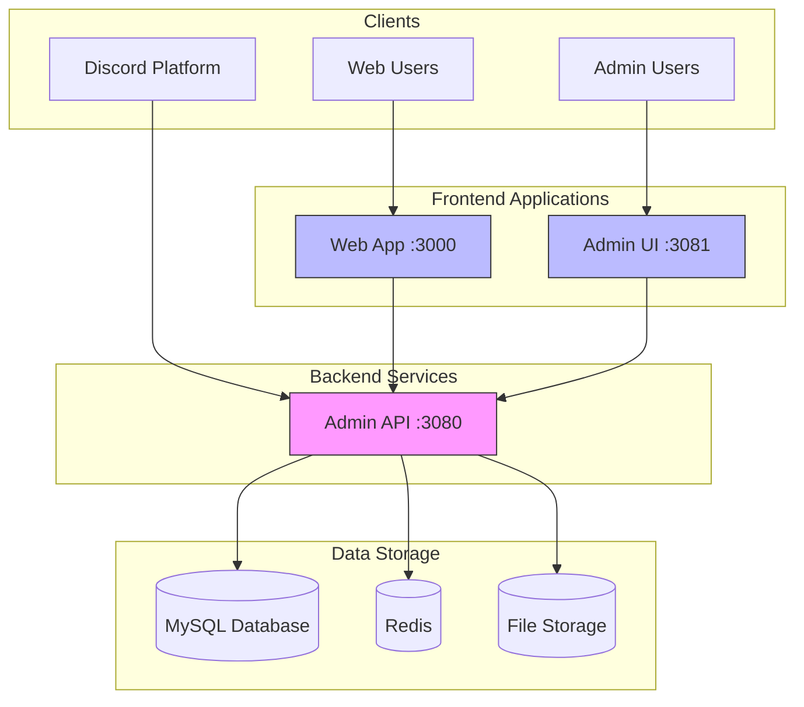
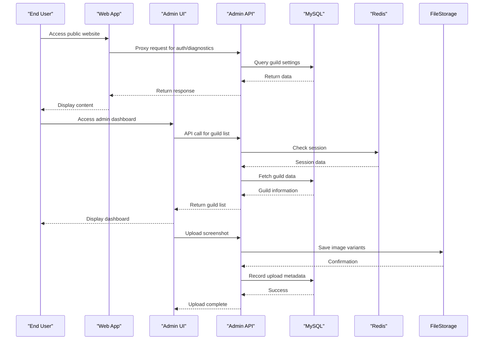

# System Overview

<cite>
**Referenced Files in This Document**   
- [README.md](file://README.md)
- [package.json](file://package.json)
- [pnpm-workspace.yaml](file://pnpm-workspace.yaml)
- [apps/admin-api/README.md](file://apps/admin-api/README.md)
- [apps/web/README.md](file://apps/web/README.md)
- [apps/admin-ui/README.md](file://apps/admin-ui/README.md)
- [apps/bot/README.md](file://apps/bot/README.md)
- [docs/INFRA_OVERVIEW.md](file://docs/INFRA_OVERVIEW.md)
- [docs/SERVICES_MATRIX.md](file://docs/SERVICES_MATRIX.md)
- [docker-compose.yml](file://docker-compose.yml)
- [apps/admin-api/src/app.js](file://apps/admin-api/src/app.js)
- [apps/web/lib/api/admin-client.ts](file://apps/web/lib/api/admin-client.ts)
- [apps/admin-api/src/config.js](file://apps/admin-api/src/config.js)
- [apps/web/lib/config.ts](file://apps/web/lib/config.ts)
- [apps/admin-api/src/lib/queues/index.js](file://apps/admin-api/src/lib/queues/index.js)
- [apps/admin-api/lib/queue-manager.js](file://apps/admin-api/lib/queue-manager.js)
- [apps/admin-api/lib/monitoring.js](file://apps/admin-api/lib/monitoring.js)
- [apps/admin-api/MONITORING_SETUP_GUIDE.md](file://apps/admin-api/MONITORING_SETUP_GUIDE.md)
- [apps/admin-api/MONITORING_README.md](file://apps/admin-api/MONITORING_README.md)
</cite>

## Table of Contents
1. [Introduction](#introduction)
2. [Core Applications](#core-applications)
3. [Shared Packages and Infrastructure](#shared-packages-and-infrastructure)
4. [System Architecture](#system-architecture)
5. [Component Interactions](#component-interactions)
6. [Primary Use Cases](#primary-use-cases)
7. [User Journeys](#user-journeys)
8. [Technology Stack and Impact](#technology-stack-and-impact)
9. [Monitoring and Observability](#monitoring-and-observability)

## Introduction

The slimy-monorepo platform is a comprehensive full-stack Discord community management system designed to streamline guild administration, club analytics, snail tools, chat processing, and usage monitoring. This monorepo architecture integrates multiple applications and services into a cohesive ecosystem that enables community managers, administrators, and end users to effectively manage and analyze their Discord communities.

The platform's primary purpose is to provide a unified interface for Discord bot administration, offering advanced analytics for club performance, tools for processing chat interactions, and comprehensive monitoring of system usage. By consolidating these capabilities into a single monorepo, the system ensures consistency across components, simplifies dependency management, and streamlines development workflows.

The architecture follows a microservices-inspired pattern within a monorepo structure, with clearly defined applications serving specific functions while sharing common packages for authentication, configuration, and database access. This approach balances the benefits of code reuse and consistent tooling with the operational independence of separate services.

**Section sources**
- [README.md](file://README.md#L1-L158)
- [docs/INFRA_OVERVIEW.md](file://docs/INFRA_OVERVIEW.md#L1-L229)

## Core Applications

The slimy-monorepo platform consists of four primary applications that work together to deliver its comprehensive functionality. Each application serves a distinct purpose within the ecosystem, with well-defined responsibilities and interfaces.

The **admin-api** application is an Express.js REST API that serves as the backend for Discord bot administration. It handles authentication, guild management, club analytics, upload management, and health monitoring. This service acts as the central data hub, providing a secure interface for other applications to access and modify data.

The **web** application is a Next.js 16 web application that serves as the public-facing website for the Slimy.ai Discord bot. It features a codes aggregator that combines codes from multiple sources, an MDX documentation system, and role-based access control. This application provides user tools and information to the broader community.

The **admin-ui** application is a Next.js 14 dashboard that offers a web-based interface for Discord bot administrators. It enables users to manage guilds, monitor bot health, upload screenshots, and access Google Sheet integrations for corrections and rescan operations. This admin panel provides a comprehensive view of bot operations and community metrics.

The **bot** application is currently a placeholder for the Discord bot functionality. While the scaffolding exists, the actual bot logic needs to be migrated from existing services. This component will eventually handle Discord gateway connections, slash commands, and message processing.

**Section sources**
- [apps/admin-api/README.md](file://apps/admin-api/README.md#L1-L239)
- [apps/web/README.md](file://apps/web/README.md#L1-L164)
- [apps/admin-ui/README.md](file://apps/admin-ui/README.md#L1-L132)
- [apps/bot/README.md](file://apps/bot/README.md#L1-L56)

## Shared Packages and Infrastructure

The slimy-monorepo platform includes a collection of shared packages and infrastructure components that support the core applications. These shared resources promote code reuse, ensure consistency across services, and provide essential functionality for the entire ecosystem.

The **packages/** directory contains reusable libraries that can be shared across multiple applications. These include shared-auth for authentication utilities, shared-config for configuration management, shared-db for database helpers, and shared-snail for snail-related functionality. This modular approach allows common functionality to be maintained in a single location while being consumed by multiple applications.

The **infra/docker/** directory contains Docker and Caddy configuration files that enable containerized deployment and reverse proxying. The platform uses Caddy as a reverse proxy with automatic HTTPS via Let's Encrypt, request routing by domain/path, and static file serving for uploads. Services are managed as systemd units for reliable operation.

The monorepo structure is managed through pnpm workspaces, as defined in the pnpm-workspace.yaml file. This configuration enables efficient dependency management across the multiple applications and packages within the repository. The root package.json file provides workspace scripts for common operations like development, testing, and building.

**Section sources**
- [package.json](file://package.json#L1-L45)
- [pnpm-workspace.yaml](file://pnpm-workspace.yaml#L1-L14)
- [docker-compose.yml](file://docker-compose.yml#L1-L154)

## System Architecture

The slimy-monorepo platform follows a layered architecture with clear separation of concerns between frontend, backend, and data storage components. This architecture enables scalability, maintainability, and clear boundaries between system components.

**Diagram sources**
- [docs/INFRA_OVERVIEW.md](file://docs/INFRA_OVERVIEW.md#L1-L229)
- [docker-compose.yml](file://docker-compose.yml#L1-L154)

The architecture consists of four main layers: clients, frontend applications, backend services, and data storage. The clients include Discord itself, web users accessing the public site, and admin users managing their communities. The frontend applications provide user interfaces for different user roles, with the Web app serving public users and the Admin UI serving administrators.

The Admin API serves as the central backend service, providing RESTful endpoints for all data operations. It handles authentication, guild management, club analytics, and other core functionality. This service acts as the gateway between the frontend applications and the underlying data storage systems.

Data storage is provided through multiple mechanisms: MySQL for persistent data storage via Prisma ORM, Redis for session caching and temporary data, and file storage for uploaded images and other binary content. This multi-tiered approach allows each data type to be stored in the most appropriate system.

**Section sources**
- [docs/INFRA_OVERVIEW.md](file://docs/INFRA_OVERVIEW.md#L1-L229)
- [docker-compose.yml](file://docker-compose.yml#L1-L154)

## Component Interactions

The components within the slimy-monorepo platform interact through well-defined interfaces using REST APIs, queues, and shared data stores. These interactions enable the system to function as a cohesive whole while maintaining loose coupling between components.

**Diagram sources**
- [apps/admin-api/README.md](file://apps/admin-api/README.md#L1-L239)
- [apps/web/README.md](file://apps/web/README.md#L1-L164)
- [apps/admin-ui/README.md](file://apps/admin-ui/README.md#L1-L132)

The primary interaction pattern involves frontend applications communicating with the Admin API through REST endpoints. The Web app uses server-side proxies to securely access the Admin API, while the Admin UI makes direct API calls. This separation ensures that sensitive operations are properly authenticated and authorized.

The Admin API serves as the central coordination point, interacting with multiple data stores based on the request type. For authentication and session management, it uses Redis to store session data and JWT tokens in httpOnly cookies. For persistent data storage, it uses MySQL via Prisma ORM to manage user data, guild configurations, and analytics metrics.

Queues are used for asynchronous processing of tasks such as chat processing, database operations, and audit logging. The queue system allows long-running operations to be processed in the background without blocking API responses, improving overall system responsiveness and reliability.

**Section sources**
- [apps/admin-api/src/app.js](file://apps/admin-api/src/app.js#L1-L64)
- [apps/web/lib/api/admin-client.ts](file://apps/web/lib/api/admin-client.ts#L1-L398)
- [apps/admin-api/src/lib/queues/index.js](file://apps/admin-api/src/lib/queues/index.js#L132-L395)

## Primary Use Cases

The slimy-monorepo platform supports several primary use cases that address the needs of different user roles within the Discord community ecosystem. These use cases reflect the core functionality provided by the system and demonstrate how users interact with the various components.

For **community managers**, the primary use case involves managing guild configurations and monitoring bot health. This includes viewing guild dashboards, configuring bot settings, managing channel permissions, and reviewing usage statistics. The Admin UI provides a comprehensive interface for these tasks, allowing managers to oversee multiple guilds from a single dashboard.

For **administrators**, the key use case is system administration and user management. This includes managing user roles and permissions, configuring global settings, monitoring system diagnostics, and handling authentication. The role-based access control system enables administrators to define fine-grained permissions for different user groups.

For **end users**, the primary use case is accessing community tools and information. This includes viewing aggregated codes from multiple sources, accessing documentation, using snail tools, and participating in chat interactions. The Web app provides a user-friendly interface for these activities, with features like the codes aggregator and documentation system.

Additional use cases include **club analytics**, where users can view member power metrics and trigger rescans of club data, and **diagnostic operations**, where administrators can access system health information and troubleshoot issues.

**Section sources**
- [apps/admin-api/README.md](file://apps/admin-api/README.md#L1-L239)
- [apps/web/README.md](file://apps/web/README.md#L1-L164)
- [apps/admin-ui/README.md](file://apps/admin-ui/README.md#L1-L132)

## User Journeys

The user journeys within the slimy-monorepo platform illustrate how different user roles interact with the system to accomplish their goals. These journeys demonstrate the flow of operations from initial access to task completion.

The **authentication journey** begins when a user accesses the Admin UI and is redirected to the Admin API for Discord OAuth login. The Admin API initiates the OAuth flow with Discord, exchanges the authorization code for an access token, and creates a JWT with user information. The session data, including guilds and access tokens, is stored server-side to avoid cookie size limitations, and the user is redirected back to the appropriate dashboard based on their role.

The **guild configuration journey** starts when an administrator selects a guild from their dashboard and navigates to the settings page. The Admin UI requests guild configuration data from the Admin API, which retrieves the information from the MySQL database. The administrator makes changes to the configuration, which are sent back to the Admin API for validation and storage. The updated settings are then reflected in the Discord bot's behavior.

The **data analysis journey** occurs when a user accesses club analytics through either the Web app or Admin UI. The requesting application calls the Admin API endpoint for club data, which queries the MySQL database for member power metrics. The results are returned and displayed in a sortable table, with options to trigger a rescan of the data. The rescan operation is added to a processing queue for asynchronous execution.

The **diagnostic operations journey** involves administrators accessing system health information through the diagnostics endpoint. The Admin API collects metrics on uptime, memory usage, and upload statistics, which are displayed in the Admin UI's sidebar widget. For more detailed diagnostics, administrators can access specific diagnostic endpoints that provide deeper system insights.

**Section sources**
- [apps/admin-api/README.md](file://apps/admin-api/README.md#L1-L239)
- [apps/web/README.md](file://apps/web/README.md#L1-L164)
- [apps/admin-ui/README.md](file://apps/admin-ui/README.md#L1-L132)

## Technology Stack and Impact

The technology choices in the slimy-monorepo platform have significant implications for system capabilities, performance, and maintainability. The selected technologies enable the platform to deliver robust functionality while maintaining developer productivity and system reliability.

The use of a **monorepo architecture** with pnpm workspaces allows for efficient dependency management and code sharing across multiple applications. This approach reduces duplication, ensures consistency in tooling and configurations, and simplifies version management. The monorepo structure also facilitates atomic commits that can span multiple packages and applications.

The **Express.js backend** provides a flexible and performant foundation for the Admin API. Its middleware architecture enables modular implementation of cross-cutting concerns like authentication, logging, and error handling. The integration with Prisma ORM simplifies database operations and provides type safety for data access patterns.

The **Next.js frontend applications** leverage server-side rendering and API routes to deliver fast, SEO-friendly interfaces with secure backend integration. The App Router in Next.js 16 enables sophisticated routing patterns and layout management, while server-side proxies in the Web app ensure secure access to backend APIs.

The **queue system** based on Redis and BullMQ enables reliable asynchronous processing of long-running operations. This architecture improves system responsiveness by offloading intensive tasks like chat processing and database operations to background workers. The queue system also provides resilience through job persistence and retry mechanisms.

The **Docker and Caddy infrastructure** enables consistent deployment across environments and automated HTTPS configuration. This setup simplifies operations and ensures that security best practices are consistently applied.

**Section sources**
- [apps/admin-api/README.md](file://apps/admin-api/README.md#L1-L239)
- [apps/web/README.md](file://apps/web/README.md#L1-L164)
- [apps/admin-ui/README.md](file://apps/admin-ui/README.md#L1-L132)
- [docker-compose.yml](file://docker-compose.yml#L1-L154)

## Monitoring and Observability

The slimy-monorepo platform includes comprehensive monitoring and observability features that provide insights into system health, performance, and user behavior. These capabilities enable proactive issue detection, performance optimization, and informed decision-making.

The monitoring stack includes **Sentry** for error tracking and **Prometheus** for metrics collection, with **Grafana** providing visualization dashboards. The Admin API includes built-in metrics for job processing, API response times, and system resource usage. These metrics are exposed for collection by Prometheus and can be visualized in Grafana dashboards.

The system implements structured logging with consistent formatting across components. Log entries include request IDs for tracing operations across service boundaries, timestamps for temporal analysis, and contextual information for debugging. The logging system is configurable by environment, with more verbose output in development and production-appropriate levels in production.

Health checks are implemented at multiple levels, from basic liveness probes to comprehensive readiness checks that verify database connectivity and external service availability. The `/api/diag` endpoint provides a lightweight diagnostics snapshot including uptime, memory usage, and upload statistics.

Alerting is configured for critical system metrics, with notifications sent when thresholds are exceeded. The system monitors for issues such as high error rates, slow response times, and resource exhaustion. These alerts enable rapid response to potential problems before they impact users.

**Section sources**
- [apps/admin-api/lib/monitoring.js](file://apps/admin-api/lib/monitoring.js#L1-L34)
- [apps/admin-api/MONITORING_SETUP_GUIDE.md](file://apps/admin-api/MONITORING_SETUP_GUIDE.md#L337-L357)
- [apps/admin-api/MONITORING_README.md](file://apps/admin-api/MONITORING_README.md#L201-L208)