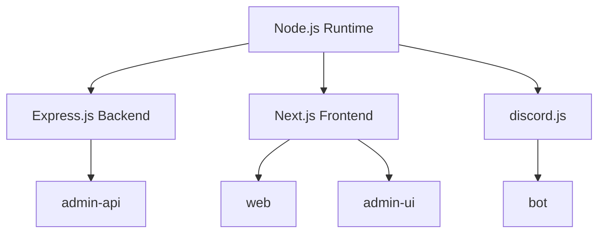
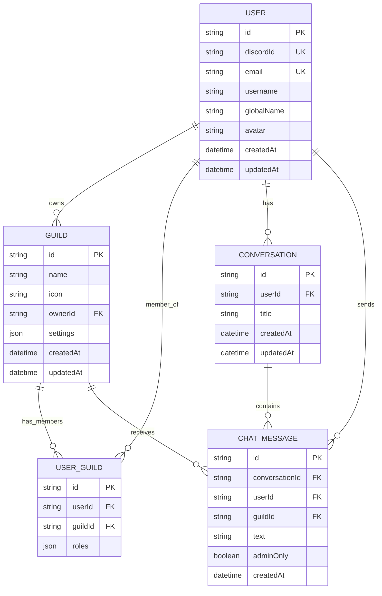
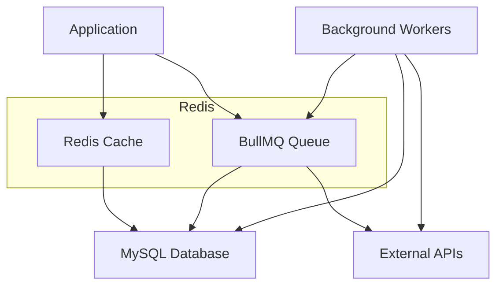
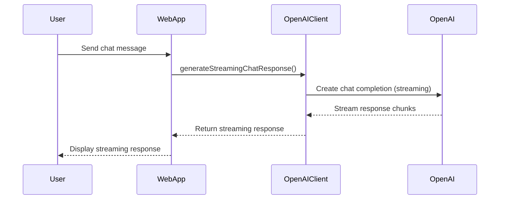
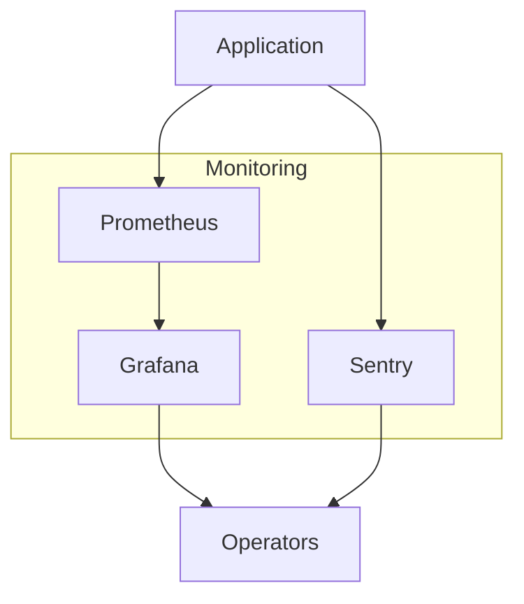
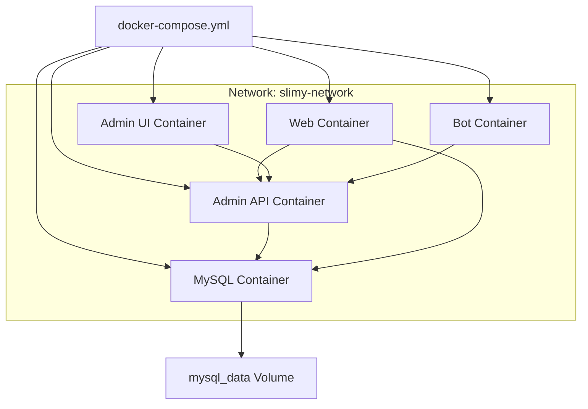

# Technology Stack

<cite>
**Referenced Files in This Document**   
- [package.json](file://package.json)
- [pnpm-workspace.yaml](file://pnpm-workspace.yaml)
- [apps/admin-api/package.json](file://apps/admin-api/package.json)
- [apps/web/package.json](file://apps/web/package.json)
- [apps/bot/package.json](file://apps/bot/package.json)
- [apps/admin-ui/package.json](file://apps/admin-ui/package.json)
- [apps/admin-api/prisma/schema.prisma](file://apps/admin-api/prisma/schema.prisma)
- [apps/web/lib/cache/redis.ts](file://apps/web/lib/cache/redis.ts)
- [apps/admin-api/lib/cache/redis.js](file://apps/admin-api/lib/cache/redis.js)
- [lib/openai/client.js](file://lib/openai/client.js)
- [apps/web/lib/chat/openai.ts](file://apps/web/lib/chat/openai.ts)
- [apps/admin-api/monitoring/dashboards/grafana-dashboard.json](file://apps/admin-api/monitoring/dashboards/grafana-dashboard.json)
- [apps/web/grafana/provisioning/dashboards/dashboard.yml](file://apps/web/grafana/provisioning/dashboards/dashboard.yml)
- [docker-compose.yml](file://docker-compose.yml)
- [apps/admin-api/prometheus.yml](file://apps/admin-api/prometheus.yml)
- [apps/web/monitoring/alertmanager.yml](file://apps/web/monitoring/alertmanager.yml)
</cite>

## Table of Contents
1. [Introduction](#introduction)
2. [Core Application Technologies](#core-application-technologies)
3. [Database and Data Access](#database-and-data-access)
4. [Caching and Job Processing](#caching-and-job-processing)
5. [AI and External Integrations](#ai-and-external-integrations)
6. [Monitoring and Observability](#monitoring-and-observability)
7. [Containerization and Orchestration](#containerization-and-orchestration)
8. [Testing Framework](#testing-framework)
9. [Type Safety and Shared Code](#type-safety-and-shared-code)
10. [Dependency Management](#dependency-management)
11. [Technology Rationale](#technology-rationale)

## Introduction

The slimy-monorepo platform is a comprehensive application ecosystem built with modern JavaScript/TypeScript technologies. This document details the technology stack that powers the platform, covering backend services, frontend applications, database interactions, AI integrations, monitoring systems, and deployment infrastructure. The architecture is designed to support a Discord-integrated application with advanced analytics, chat capabilities, and administrative interfaces, all orchestrated through a monorepo structure that enables efficient development and deployment workflows.

**Section sources**
- [package.json](file://package.json)
- [pnpm-workspace.yaml](file://pnpm-workspace.yaml)

## Core Application Technologies

The slimy-monorepo platform leverages Node.js as its runtime environment, with applications built using both JavaScript and TypeScript for maximum flexibility and type safety. The backend API services are implemented using Express.js, a minimalist web framework for Node.js that provides robust features for building web applications and APIs. The platform's frontend rendering is powered by Next.js, which enables server-side rendering, static site generation, and API route handling within a unified framework.

The monorepo contains multiple applications that serve different purposes within the ecosystem:
- **admin-api**: A backend service built with Express.js that handles API requests, database operations, and business logic
- **web**: The primary frontend application built with Next.js that provides the main user interface and public-facing services
- **admin-ui**: An administrative interface built with Next.js that provides monitoring and management capabilities
- **bot**: A Discord bot application that interacts with the Discord API to provide real-time functionality

Each application is configured with appropriate dependencies and scripts for development, testing, and production deployment. The use of TypeScript across shared packages and applications ensures type safety and improves developer experience through better tooling and error detection.

**Diagram sources**
- [apps/admin-api/package.json](file://apps/admin-api/package.json)
- [apps/web/package.json](file://apps/web/package.json)
- [apps/bot/package.json](file://apps/bot/package.json)
- [apps/admin-ui/package.json](file://apps/admin-ui/package.json)

**Section sources**
- [apps/admin-api/package.json](file://apps/admin-api/package.json)
- [apps/web/package.json](file://apps/web/package.json)
- [apps/bot/package.json](file://apps/bot/package.json)
- [apps/admin-ui/package.json](file://apps/admin-ui/package.json)

## Database and Data Access

The platform uses MySQL as its primary relational database, with Prisma ORM serving as the database access layer. Prisma provides a type-safe and intuitive way to interact with the database, generating client code based on the schema definition. The Prisma schema defines a comprehensive data model with entities for users, guilds (Discord servers), chat messages, analytics, and various other domain-specific models.

The data model includes proper relationships between entities, such as the many-to-many relationship between users and guilds, and includes performance optimizations like indexes on frequently queried fields. The schema also incorporates best practices for data modeling, including timestamp tracking, soft deletion patterns, and JSON fields for flexible data storage.

Prisma migrations are used to manage database schema changes over time, with migration files stored in the repository to ensure consistent database state across environments. The platform uses Prisma Client to execute database operations, benefiting from type safety and query optimization features.

**Diagram sources**
- [apps/admin-api/prisma/schema.prisma](file://apps/admin-api/prisma/schema.prisma)

**Section sources**
- [apps/admin-api/prisma/schema.prisma](file://apps/admin-api/prisma/schema.prisma)
- [apps/admin-api/package.json](file://apps/admin-api/package.json)
- [apps/web/package.json](file://apps/web/package.json)

## Caching and Job Processing

The platform implements a comprehensive caching strategy using Redis for both data caching and queue management. Redis is used to cache frequently accessed data, reducing database load and improving response times. The caching implementation includes features like TTL (time-to-live) management, stale-while-revalidate patterns, and pattern-based cache invalidation.

For job processing, the platform uses BullMQ, a Redis-based queue system that enables asynchronous processing of background tasks. This allows the application to handle long-running operations like data processing, analytics generation, and external API calls without blocking the main request-response cycle. The queue system supports features like job prioritization, retry logic, and monitoring.

The Redis implementation is consistent across applications, with both the admin-api and web applications using Redis for caching. The configuration includes connection retry logic, error handling, and performance monitoring to ensure reliability.

**Diagram sources**
- [apps/web/lib/cache/redis.ts](file://apps/web/lib/cache/redis.ts)
- [apps/admin-api/lib/cache/redis.js](file://apps/admin-api/lib/cache/redis.js)
- [apps/admin-api/package.json](file://apps/admin-api/package.json)

**Section sources**
- [apps/web/lib/cache/redis.ts](file://apps/web/lib/cache/redis.ts)
- [apps/admin-api/lib/cache/redis.js](file://apps/admin-api/lib/cache/redis.js)
- [apps/admin-api/lib/queue-manager.js](file://apps/admin-api/lib/queue-manager.js)

## AI and External Integrations

The platform integrates with OpenAI to provide AI-powered features, particularly in the chat functionality. The OpenAI client implementation includes robust features like streaming responses, exponential backoff retry logic, and function calling support. This enables real-time chat interactions with AI models while maintaining reliability in the face of network issues or API rate limits.

The platform also integrates with Google Sheets API for data integration, allowing for the import and export of data between the application and Google Sheets. This facilitates data analysis, reporting, and collaboration with external stakeholders.

Additionally, the platform uses discord.js for bot functionality, enabling interaction with Discord servers, channels, and users. The bot can respond to commands, send messages, and perform administrative tasks within Discord servers.

**Diagram sources**
- [lib/openai/client.js](file://lib/openai/client.js)
- [apps/web/lib/chat/openai.ts](file://apps/web/lib/chat/openai.ts)
- [apps/bot/package.json](file://apps/bot/package.json)

**Section sources**
- [lib/openai/client.js](file://lib/openai/client.js)
- [apps/web/lib/chat/openai.ts](file://apps/web/lib/chat/openai.ts)
- [apps/admin-api/package.json](file://apps/admin-api/package.json)

## Monitoring and Observability

The platform implements a comprehensive monitoring solution using Prometheus for metrics collection, Grafana for visualization, and Sentry for error tracking. This observability stack provides insights into application performance, error rates, and system health.

Prometheus is configured to scrape metrics from the admin-api service, collecting data on request rates, response times, error rates, memory usage, and database performance. The metrics are exposed through a dedicated endpoint and scraped at regular intervals.

Grafana is used to visualize the collected metrics through dashboards that provide real-time insights into system health. The dashboards include panels for service health, uptime, error rates, response time percentiles, request rates, HTTP status codes, memory usage, and database performance.

Sentry is integrated for error tracking and performance monitoring, capturing exceptions and providing detailed context for debugging. This enables proactive identification and resolution of issues before they impact users.

**Diagram sources**
- [apps/admin-api/monitoring/dashboards/grafana-dashboard.json](file://apps/admin-api/monitoring/dashboards/grafana-dashboard.json)
- [apps/admin-api/prometheus.yml](file://apps/admin-api/prometheus.yml)
- [apps/web/monitoring/alertmanager.yml](file://apps/web/monitoring/alertmanager.yml)

**Section sources**
- [apps/admin-api/monitoring/dashboards/grafana-dashboard.json](file://apps/admin-api/monitoring/dashboards/grafana-dashboard.json)
- [apps/admin-api/prometheus.yml](file://apps/admin-api/prometheus.yml)
- [apps/web/monitoring/alertmanager.yml](file://apps/web/monitoring/alertmanager.yml)
- [apps/admin-api/package.json](file://apps/admin-api/package.json)

## Containerization and Orchestration

The platform uses Docker for containerization and docker-compose for orchestration. Each application component is containerized with its own Dockerfile, ensuring consistent deployment across environments. The docker-compose.yml file defines the services, networks, and volumes required to run the complete system.

The architecture includes containers for:
- MySQL database
- Admin API backend service
- Web frontend application
- Admin UI frontend application
- Discord bot

The containers are connected through a shared network, enabling service-to-service communication. The configuration includes health checks for critical services, ensuring that dependent services only start when their dependencies are ready. Environment variables are used to configure service behavior, with sensible defaults provided for development environments.

**Diagram sources**
- [docker-compose.yml](file://docker-compose.yml)

**Section sources**
- [docker-compose.yml](file://docker-compose.yml)

## Testing Framework

The platform employs a comprehensive testing strategy using multiple testing frameworks to ensure code quality and reliability. The testing stack includes:

- **Jest**: Used for unit and integration testing in the admin-api application, providing a complete testing solution with mocking, coverage reporting, and watch mode
- **Vitest**: Used for testing in the bot and web applications, offering a fast and modern testing experience with Vite integration
- **Playwright**: Used for end-to-end testing of the web application, enabling reliable browser automation and testing of user interactions

The testing configuration includes code coverage reporting, with thresholds set to ensure adequate test coverage. The test scripts are integrated into the development workflow, with pre-commit hooks and CI/CD pipelines ensuring that tests are run automatically.

**Section sources**
- [apps/admin-api/package.json](file://apps/admin-api/package.json)
- [apps/web/package.json](file://apps/web/package.json)
- [apps/bot/package.json](file://apps/bot/package.json)

## Type Safety and Shared Code

TypeScript is used extensively across the platform to provide type safety and improve developer productivity. The monorepo structure enables sharing of TypeScript types and utilities across applications through shared packages in the packages/ directory.

The use of TypeScript provides several benefits:
- Compile-time type checking to catch errors before runtime
- Better IDE support with autocompletion and refactoring tools
- Clearer code documentation through type annotations
- Improved code maintainability and refactorability

Shared packages like shared-auth, shared-config, and shared-db contain common functionality that can be reused across applications, reducing duplication and ensuring consistency.

**Section sources**
- [tsconfig.json](file://tsconfig.json)
- [packages/shared-auth/src/index.ts](file://packages/shared-auth/src/index.ts)
- [packages/shared-config/package.json](file://packages/shared-config/package.json)

## Dependency Management

The platform uses pnpm as its package manager, leveraging its workspace features to manage dependencies across the monorepo. The pnpm-workspace.yaml file defines the workspace packages, enabling efficient dependency management and linking.

The dependency management strategy includes:
- Shared dependencies across applications to reduce duplication
- Explicit approval for build scripts to enhance security
- Version pinning for critical dependencies to ensure stability
- Regular dependency updates to incorporate security fixes and improvements

The package.json files in each application specify both production and development dependencies, with clear separation between the two. The root package.json contains common development tools and scripts that are shared across the monorepo.

**Section sources**
- [package.json](file://package.json)
- [pnpm-workspace.yaml](file://pnpm-workspace.yaml)
- [pnpm-lock.yaml](file://pnpm-lock.yaml)

## Technology Rationale

The technology choices in the slimy-monorepo platform are designed to balance development velocity, system performance, and maintainability. The use of Node.js and JavaScript/TypeScript enables rapid development with a large ecosystem of libraries and tools. The Express.js and Next.js frameworks provide proven solutions for building web applications with minimal configuration.

The monorepo structure with pnpm workspaces facilitates code sharing and coordinated releases, while allowing applications to evolve independently when needed. The use of Prisma ORM simplifies database interactions and provides type safety, reducing the risk of SQL injection and other data access issues.

The caching and job processing architecture with Redis and BullMQ enables the platform to handle high loads and background processing efficiently. The monitoring stack with Prometheus, Grafana, and Sentry provides comprehensive observability, enabling proactive issue detection and resolution.

The containerization strategy with Docker and docker-compose ensures consistent deployment across environments, from development to production. The comprehensive testing framework with Jest, Vitest, and Playwright ensures code quality and reliability.

Overall, the technology stack is designed to support a scalable, maintainable, and high-performing application that can evolve to meet changing requirements while providing a reliable experience for users.

**Section sources**
- [package.json](file://package.json)
- [pnpm-workspace.yaml](file://pnpm-workspace.yaml)
- [docker-compose.yml](file://docker-compose.yml)