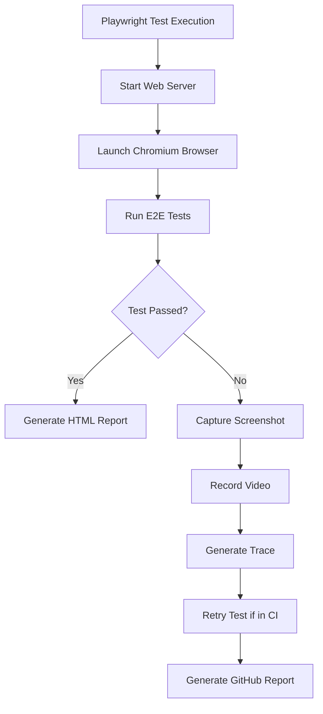
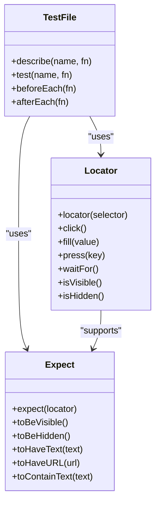
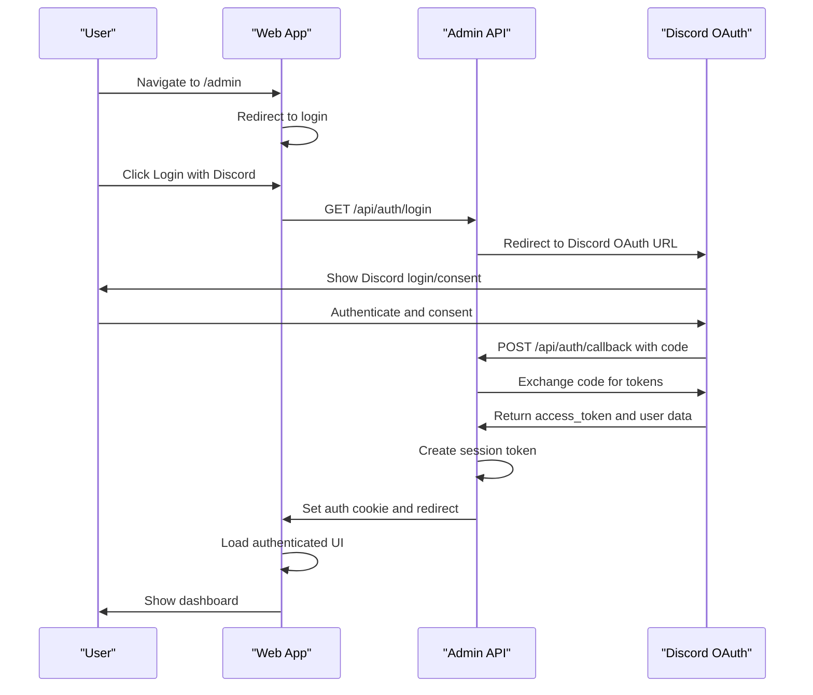
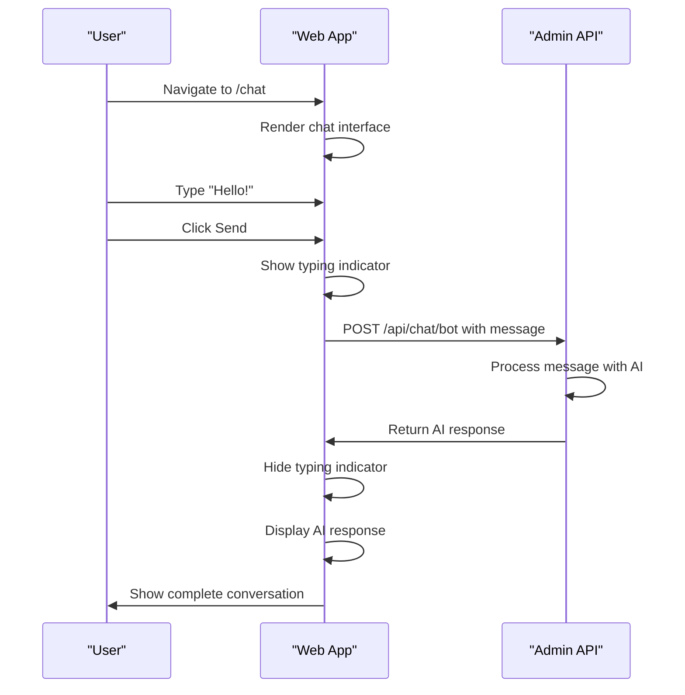
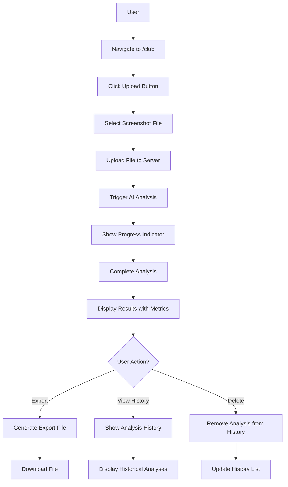
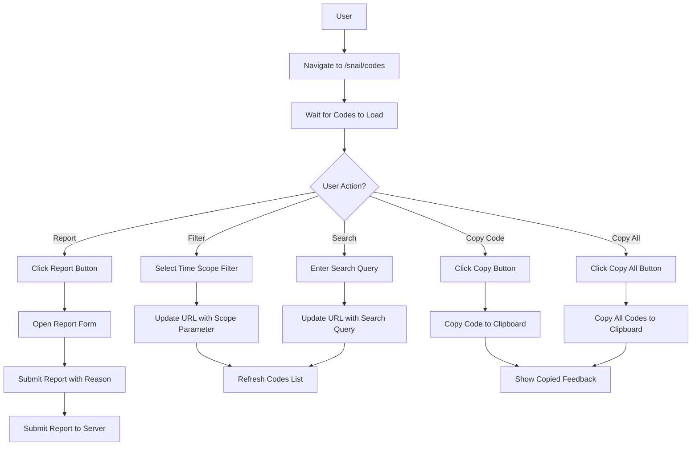
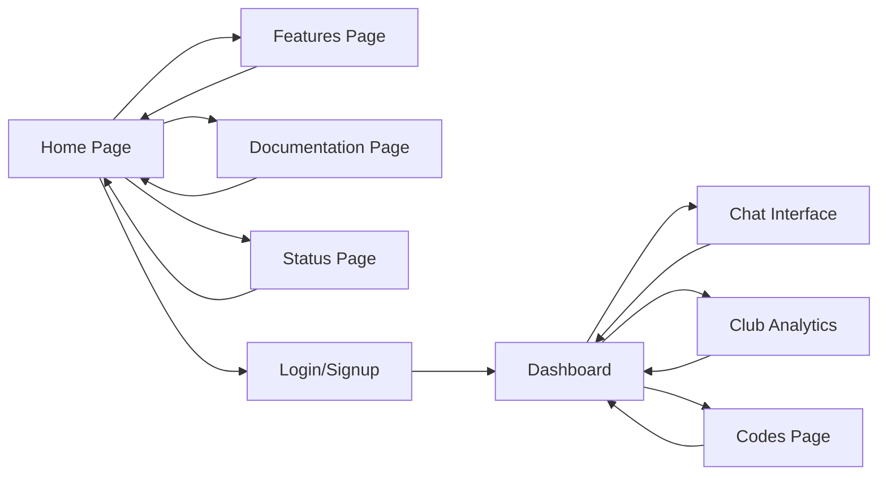
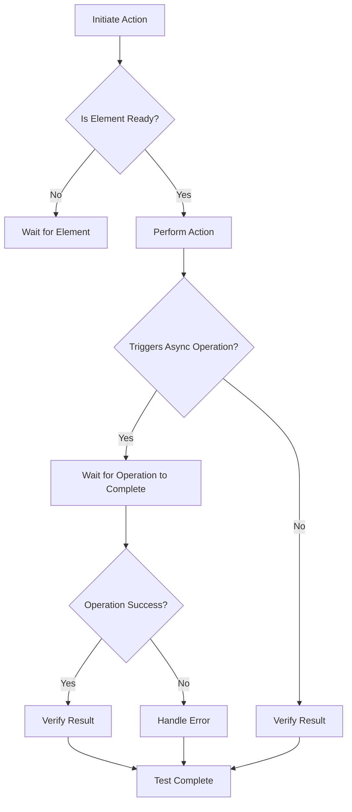
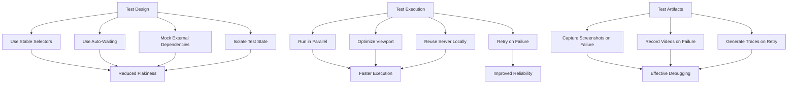

# End-to-End Testing

<cite>
**Referenced Files in This Document**   
- [playwright.config.ts](file://apps/web/playwright.config.ts)
- [auth-flow.spec.ts](file://apps/web/tests/e2e/auth-flow.spec.ts)
- [chat.spec.ts](file://apps/web/tests/e2e/chat.spec.ts)
- [club-analytics.spec.ts](file://apps/web/tests/e2e/club-analytics.spec.ts)
- [codes-page.spec.ts](file://apps/web/tests/e2e/codes-page.spec.ts)
- [navigation.spec.ts](file://apps/web/tests/e2e/navigation.spec.ts)
- [setup.ts](file://apps/web/tests/setup.ts)
- [chat-interface.tsx](file://apps/web/components/chat/chat-interface.tsx)
- [Results.tsx](file://apps/web/components/club/Results.tsx)
- [header.tsx](file://apps/web/components/layout/header.tsx)
- [login-button.tsx](file://apps/web/components/auth/login-button.tsx)
- [context.tsx](file://apps/web/lib/auth/context.tsx)
- [useAuth.ts](file://apps/web/hooks/useAuth.ts)
- [auth.js](file://apps/admin-api/src/routes/auth.js)
- [route.ts](file://apps/web/app/api/auth/discord.bak/callback/route.ts)
</cite>

## Table of Contents
1. [Introduction](#introduction)
2. [Playwright Configuration](#playwright-configuration)
3. [Test Implementation Patterns](#test-implementation-patterns)
4. [Key User Workflows](#key-user-workflows)
5. [Handling Asynchronous Operations](#handling-asynchronous-operations)
6. [Test Execution and Debugging](#test-execution-and-debugging)
7. [Performance Considerations and Flakiness Mitigation](#performance-considerations-and-flakiness-mitigation)
8. [CI Integration](#ci-integration)

## Introduction
This document provides comprehensive guidance on the end-to-end (E2E) testing framework for the Slimy.ai web application. The E2E tests validate complete user journeys through the application interface, ensuring that all components work together as expected. The testing framework is built on Playwright, a modern browser automation library that enables reliable and fast cross-browser testing. The tests cover critical user workflows including authentication via Discord OAuth, navigating the dashboard, interacting with the chat interface, viewing club analytics, and browsing promotional codes.

**Section sources**
- [playwright.config.ts](file://apps/web/playwright.config.ts)
- [auth-flow.spec.ts](file://apps/web/tests/e2e/auth-flow.spec.ts)

## Playwright Configuration
The Playwright configuration is defined in `playwright.config.ts` and sets up the testing environment with optimal settings for both local development and CI/CD pipelines. The configuration specifies the test directory, parallel execution settings, retry policies, and reporter options. Key configuration elements include:

- **Test Directory**: Tests are located in `./tests/e2e` to organize E2E tests separately from unit and integration tests.
- **Parallel Execution**: `fullyParallel: true` enables parallel test execution to reduce overall test runtime.
- **CI-Specific Settings**: In CI environments, tests are configured with `forbidOnly: true` to prevent accidental commits of `.only` tests, `retries: 2` to handle transient failures, and `workers: 1` to manage resource usage.
- **Reporting**: The reporter is set to "github" in CI for integration with GitHub Actions, and "html" locally for detailed HTML reports.
- **Browser Context**: The configuration uses Chromium with a configurable viewport size that reduces to 1280x720 in CI for faster execution.
- **Web Server**: The configuration automatically starts the web server using `npm run build && npm start` and waits for it to be available at `http://localhost:3000`.
- **Trace and Screenshot Collection**: Traces are captured on the first retry (`trace: "on-first-retry"`) and screenshots are taken only on failures (`screenshot: "only-on-failure"`), with videos retained on failure for debugging.

**Diagram sources**
- [playwright.config.ts](file://apps/web/playwright.config.ts)

**Section sources**
- [playwright.config.ts](file://apps/web/playwright.config.ts)

## Test Implementation Patterns
The E2E tests follow established patterns to ensure maintainability, reliability, and readability. The tests are organized by feature area, with separate spec files for authentication flow, chat functionality, club analytics, codes page, and navigation. Each test file uses Playwright's `test.describe` blocks to group related tests and `test.beforeEach` hooks to set up common preconditions.

The tests leverage Playwright's auto-waiting capabilities and assertion library to handle asynchronous operations and verify application state. Test selectors use data-testid attributes to provide stable, implementation-agnostic targeting of UI elements. This approach decouples tests from CSS classes and text content, making them more resilient to UI changes.

Page object patterns are implicitly followed through the use of consistent selectors and helper methods within each test file. For example, the chat interface tests use data-testid selectors like `chat-interface`, `message-input`, and `send-btn` to interact with the chat components.

**Diagram sources**
- [auth-flow.spec.ts](file://apps/web/tests/e2e/auth-flow.spec.ts)
- [chat.spec.ts](file://apps/web/tests/e2e/chat.spec.ts)
- [club-analytics.spec.ts](file://apps/web/tests/e2e/club-analytics.spec.ts)

**Section sources**
- [auth-flow.spec.ts](file://apps/web/tests/e2e/auth-flow.spec.ts)
- [chat.spec.ts](file://apps/web/tests/e2e/chat.spec.ts)
- [club-analytics.spec.ts](file://apps/web/tests/e2e/club-analytics.spec.ts)
- [codes-page.spec.ts](file://apps/web/tests/e2e/codes-page.spec.ts)
- [navigation.spec.ts](file://apps/web/tests/e2e/navigation.spec.ts)

## Key User Workflows
The E2E test suite validates several critical user workflows that represent the core functionality of the Slimy.ai application. These workflows are designed to simulate real user interactions and ensure that the application behaves as expected from the user's perspective.

### Authentication via Discord OAuth
The authentication flow tests validate the complete Discord OAuth process, from initial login to session management. The tests verify that unauthenticated users are redirected to the login page, that the login button is visible on the home page, and that clicking the login button redirects to Discord's OAuth authorization endpoint. The tests also validate the OAuth parameters in the authorization URL, including client_id, redirect_uri, response_type, and scope.

The authentication implementation uses a redirect-based flow where the frontend redirects to the admin API's `/api/auth/login` endpoint, which initiates the Discord OAuth handshake. After successful authentication, Discord redirects back to the application's callback URL, where the admin API exchanges the authorization code for access and refresh tokens, fetches the user profile, and sets an authentication cookie.

**Diagram sources**
- [auth-flow.spec.ts](file://apps/web/tests/e2e/auth-flow.spec.ts)
- [login-button.tsx](file://apps/web/components/auth/login-button.tsx)
- [context.tsx](file://apps/web/lib/auth/context.tsx)
- [auth.js](file://apps/admin-api/src/routes/auth.js)

### Chat Interface Interaction
The chat interface tests validate the core conversational functionality of the application. These tests verify that the chat page loads correctly, that users can send messages, receive AI responses, change personality modes, and that chat history is persisted across sessions. The tests also validate error handling for rate limiting and API failures.

The chat interface uses a React component with a message input field, send button, personality mode selector, and message history display. The interface interacts with the backend via API calls to `/api/chat/bot`, with the frontend managing the conversation state and displaying typing indicators while waiting for responses.

**Diagram sources**
- [chat.spec.ts](file://apps/web/tests/e2e/chat.spec.ts)
- [chat-interface.tsx](file://apps/web/components/chat/chat-interface.tsx)

### Club Analytics Workflow
The club analytics tests validate the process of uploading club screenshots, analyzing them with AI, viewing results, exporting analysis, and managing analysis history. These tests ensure that users can successfully upload screenshots, trigger analysis, view the results with key metrics, export the analysis in various formats, browse their analysis history, and delete analyses when needed.

The club analytics feature allows users to upload screenshots of their club data, which are then processed by AI to extract key metrics and insights. The results are displayed in a structured format with confidence scores, and users can export the analysis or view detailed information about previous analyses.

**Diagram sources**
- [club-analytics.spec.ts](file://apps/web/tests/e2e/club-analytics.spec.ts)
- [Results.tsx](file://apps/web/components/club/Results.tsx)

### Promotional Codes Browsing
The codes page tests validate the functionality for browsing, searching, filtering, and interacting with promotional codes. These tests ensure that users can view available codes, filter them by time scope (e.g., past 7 days), search for specific codes, copy individual codes to the clipboard, copy all codes at once, and report invalid codes.

The promotional codes feature provides a centralized hub for users to access and manage promotional codes from various sources. The interface includes filtering options, search functionality, and actions for copying and reporting codes.

**Diagram sources**
- [codes-page.spec.ts](file://apps/web/tests/e2e/codes-page.spec.ts)

### Navigation and Routing
The navigation tests validate the application's routing and navigation between different pages and sections. These tests ensure that users can navigate from the home page to features, documentation, status page, and other key sections of the application. The tests verify that navigation links work correctly, that the URL updates appropriately, and that the correct content is displayed for each page.

The navigation structure follows a standard web application pattern with a header containing links to major sections of the application. The header also includes user-specific elements like the login button, user navigation menu, and dashboard link that appear based on authentication status.

**Diagram sources**
- [navigation.spec.ts](file://apps/web/tests/e2e/navigation.spec.ts)
- [header.tsx](file://apps/web/components/layout/header.tsx)

## Handling Asynchronous Operations
The E2E tests are designed to handle the asynchronous nature of web applications, particularly when dealing with dynamic content loading, API calls, and state persistence. Playwright's built-in auto-waiting mechanisms automatically wait for elements to be actionable before performing actions, eliminating the need for manual timeouts in most cases.

For API interactions, the tests use Playwright's routing capabilities to intercept and mock API responses when needed. This allows for testing error conditions and edge cases without relying on the actual backend services. For example, the chat tests mock API errors by intercepting requests to `/api/chat/bot` and returning a 500 status code, then verifying that the application displays an appropriate error message.

The tests also handle dynamic content loading by waiting for specific elements to appear or for network requests to complete. For instance, the club analytics tests wait for the analysis results to become visible after clicking the analyze button, with a timeout of 60 seconds to accommodate the AI processing time.

State persistence is validated through tests that reload the page and verify that the application state is preserved. For example, the chat tests verify that chat history is persisted by sending a message, reloading the page, and checking that the message is still visible in the chat interface.

**Diagram sources**
- [chat.spec.ts](file://apps/web/tests/e2e/chat.spec.ts)
- [club-analytics.spec.ts](file://apps/web/tests/e2e/club-analytics.spec.ts)

**Section sources**
- [auth-flow.spec.ts](file://apps/web/tests/e2e/auth-flow.spec.ts)
- [chat.spec.ts](file://apps/web/tests/e2e/chat.spec.ts)
- [club-analytics.spec.ts](file://apps/web/tests/e2e/club-analytics.spec.ts)
- [codes-page.spec.ts](file://apps/web/tests/e2e/codes-page.spec.ts)

## Test Execution and Debugging
The E2E tests can be executed using the npm scripts defined in the package.json file. The primary command for running E2E tests is `npm run test:e2e`, which executes all tests in the `tests/e2e` directory. For interactive debugging, the `npm run test:e2e:ui` command launches the Playwright Test UI, which provides a visual interface for running, debugging, and inspecting tests.

When tests fail, Playwright automatically captures screenshots, videos, and traces to aid in debugging. Screenshots are taken only on failure (`screenshot: "only-on-failure"`), videos are retained on failure (`video: "retain-on-failure"`), and traces are generated on the first retry (`trace: "on-first-retry"`). These artifacts are invaluable for understanding what went wrong during test execution, especially in CI environments where visual inspection is not possible.

The Playwright Test UI provides several debugging features:
- **Test Browser**: A built-in browser for running and debugging tests
- **Source Code Editor**: For viewing and editing test code
- **Test Explorer**: For navigating and running individual tests
- **Inspector**: For exploring page elements and generating selectors
- **Trace Viewer**: For analyzing test execution with screenshots, network requests, and console logs

For local development, developers can use the `--headed` flag to run tests in a visible browser window, or the `--debug` flag to launch the Playwright Inspector for step-by-step debugging. The `--grep` flag can be used to run specific tests by name or pattern, which is useful when focusing on a particular feature area.

**Section sources**
- [package.json](file://apps/web/package.json)
- [playwright.config.ts](file://apps/web/playwright.config.ts)

## Performance Considerations and Flakiness Mitigation
The E2E test suite is designed with performance and reliability in mind, particularly for CI/CD environments where test execution time and stability are critical. Several strategies are employed to mitigate flakiness and optimize test performance.

### Parallel Execution
The configuration sets `fullyParallel: true` to enable parallel execution of test files and tests within files. This significantly reduces overall test execution time by leveraging multiple CPU cores. In CI environments, the number of workers is limited to 1 (`workers: 1`) to manage resource usage, while locally multiple workers can run in parallel.

### Retry Strategy
Tests are configured to retry on failure in CI environments (`retries: 2`), which helps mitigate transient failures caused by network issues, slow API responses, or other environmental factors. This improves test reliability without masking genuine application issues.

### Viewport Optimization
The viewport size is reduced in CI environments from 1920x1080 to 1280x720 to improve rendering performance and reduce resource usage. This optimization helps ensure consistent test execution across different CI runners.

### Web Server Management
The configuration uses `reuseExistingServer: !process.env.CI` to reuse an existing server instance during local development, reducing startup time between test runs. In CI environments, a fresh server instance is started for each test run to ensure isolation.

### Selectors and Assertions
The tests use stable, implementation-agnostic selectors (data-testid attributes) rather than CSS classes or text content, making them more resilient to UI changes. Assertions use Playwright's auto-waiting capabilities rather than manual timeouts, reducing the likelihood of timing-related flakiness.

### Mocking and Stubbing
Where appropriate, the tests use Playwright's routing capabilities to intercept and mock API responses. This allows for testing error conditions and edge cases without relying on the actual backend services, improving test reliability and speed.

**Diagram sources**
- [playwright.config.ts](file://apps/web/playwright.config.ts)

**Section sources**
- [playwright.config.ts](file://apps/web/playwright.config.ts)
- [auth-flow.spec.ts](file://apps/web/tests/e2e/auth-flow.spec.ts)
- [chat.spec.ts](file://apps/web/tests/e2e/chat.spec.ts)

## CI Integration
The E2E tests are integrated into the CI/CD pipeline through GitHub Actions, with configuration that optimizes test execution for the CI environment. The reporter is set to "github" in CI, which provides detailed test results directly in the GitHub pull request interface, including pass/fail status, error messages, and links to artifacts.

The CI configuration includes several optimizations:
- **Retry Policy**: Tests are retried up to 2 times on failure to handle transient issues
- **Single Worker**: Tests run with a single worker to manage resource usage on CI runners
- **Reduced Viewport**: The viewport size is reduced to 1280x720 for faster rendering
- **Artifact Collection**: Screenshots, videos, and traces are collected for failed tests to aid in debugging
- **Web Server**: The web server is started automatically as part of the test run, with a timeout of 2 minutes

The CI pipeline ensures that all E2E tests pass before merging code changes, providing confidence that new features and bug fixes do not break existing functionality. The integration with GitHub provides immediate feedback on test results, allowing developers to quickly identify and fix issues.

**Section sources**
- [playwright.config.ts](file://apps/web/playwright.config.ts)
- [package.json](file://apps/web/package.json)