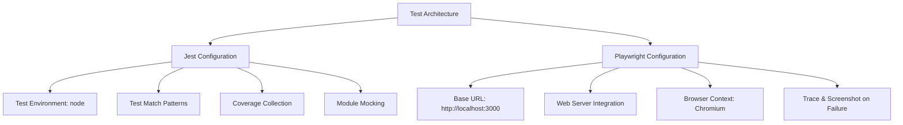
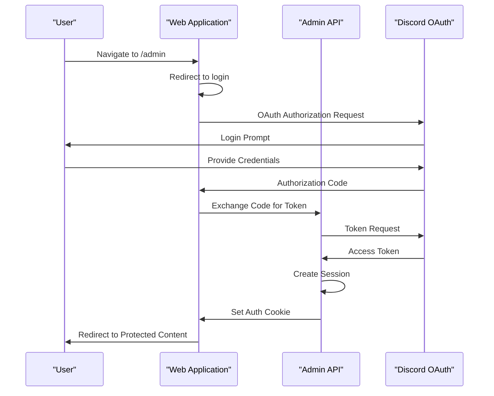
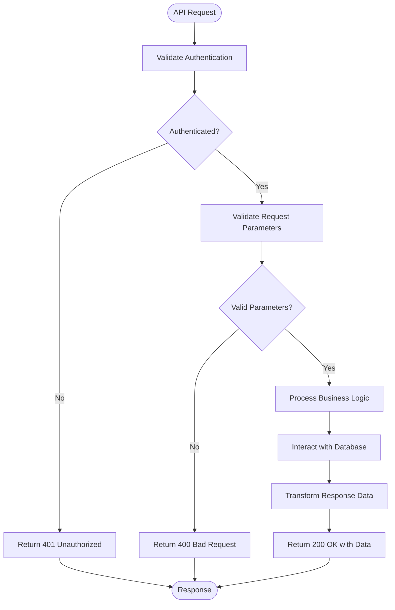
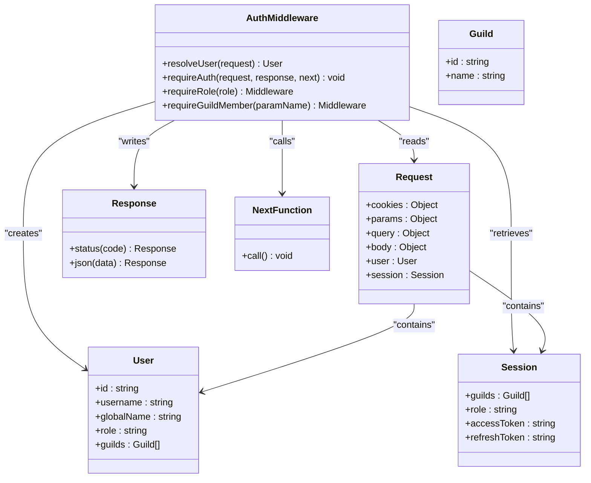
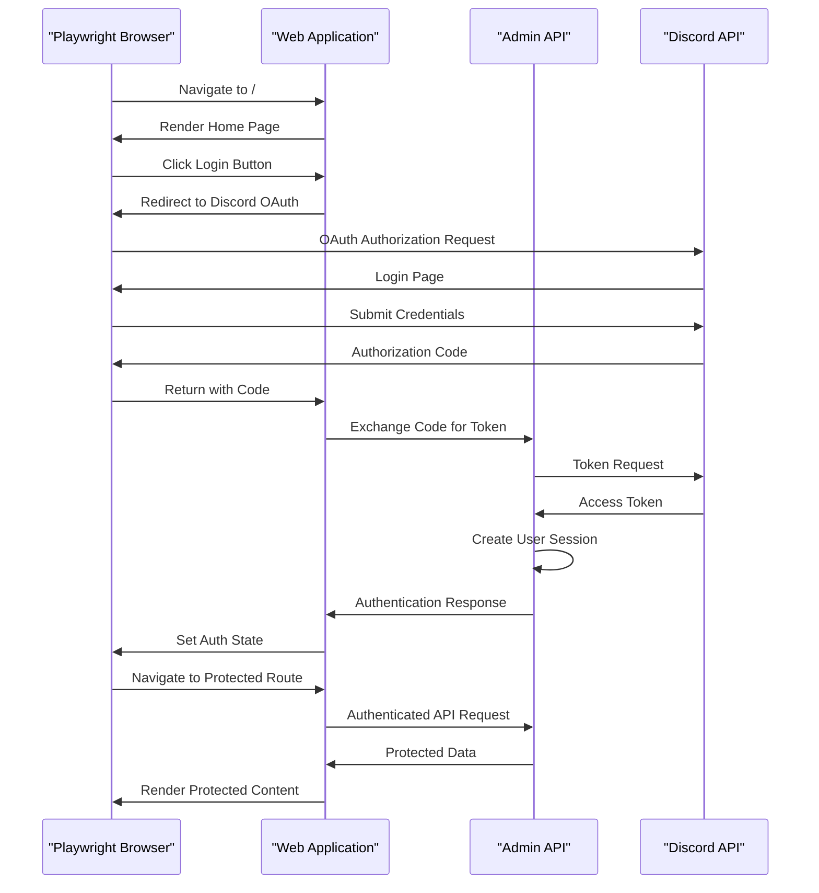
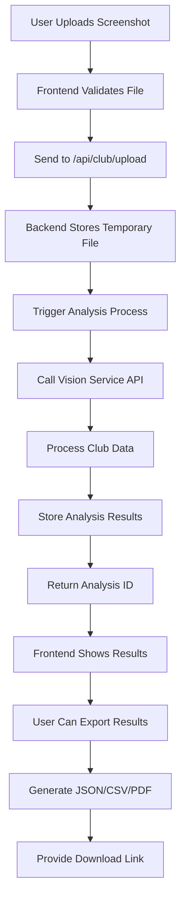
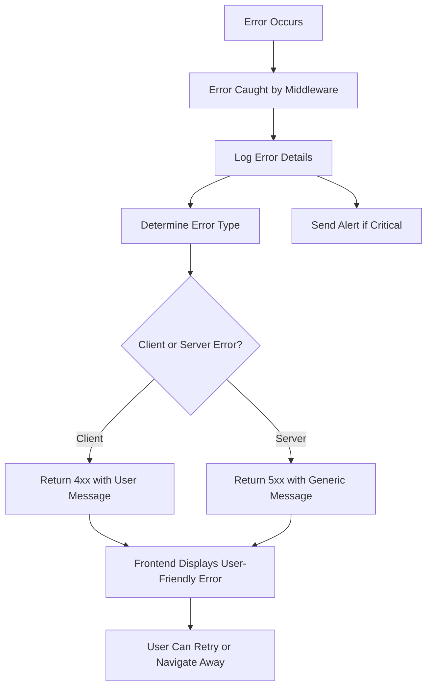
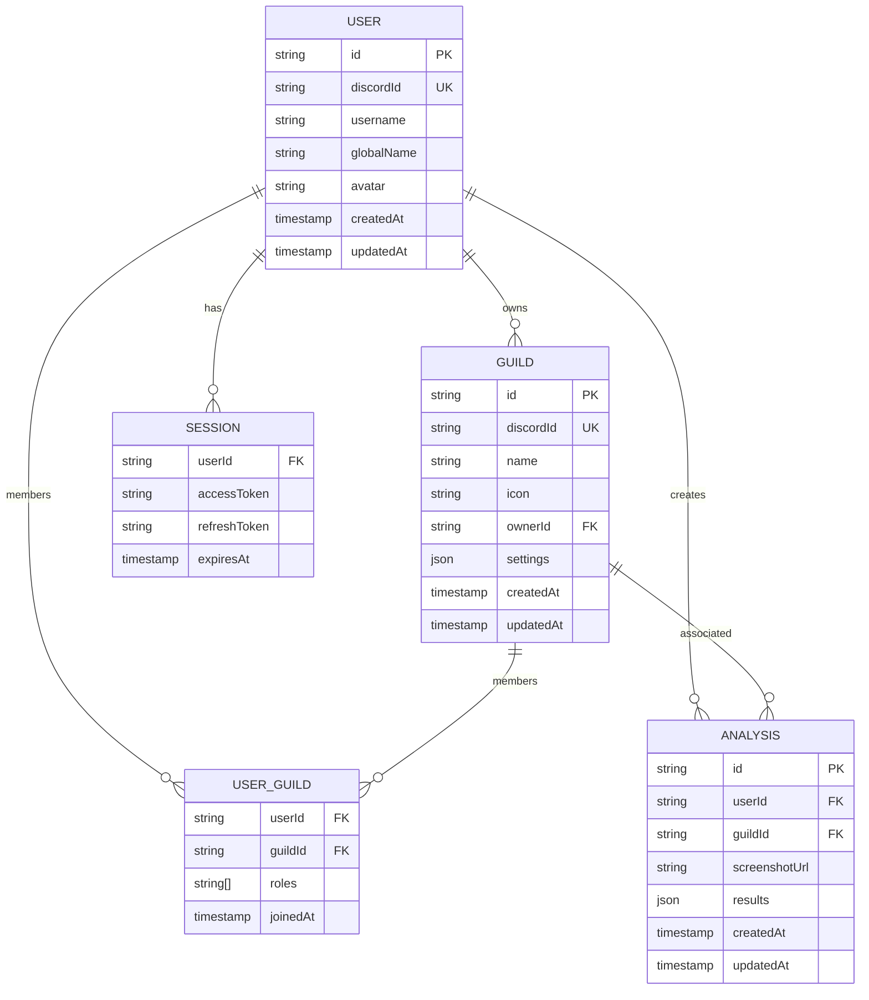
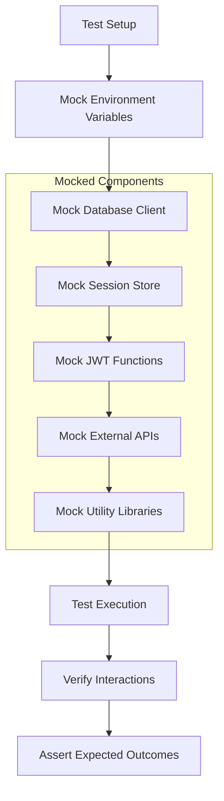
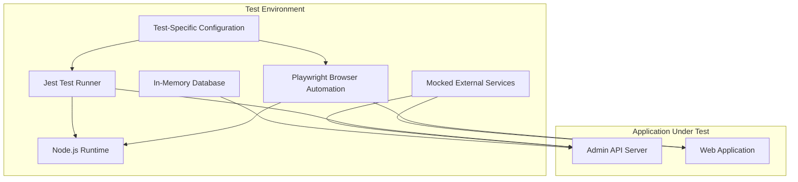

# Integration Testing

<cite>
**Referenced Files in This Document**   
- [auth-flow.test.js](file://apps/admin-api/tests/integration/auth-flow.test.js)
- [error-handling.test.js](file://apps/admin-api/tests/integration/error-handling.test.js)
- [health.test.js](file://apps/admin-api/tests/integration/health.test.js)
- [auth-middleware.test.js](file://apps/admin-api/tests/auth/auth-middleware.test.js)
- [auth-routes.test.js](file://apps/admin-api/tests/api/auth-routes.test.js)
- [guilds.test.js](file://apps/admin-api/src/routes/guilds.test.js)
- [club-api.test.js](file://apps/admin-api/tests/club-api.test.js)
- [test-database.js](file://apps/admin-api/test-database.js)
- [jest.config.js](file://apps/admin-api/jest.config.js)
- [jest.setup.js](file://apps/admin-api/jest.setup.js)
- [auth-flow.spec.ts](file://apps/web/tests/e2e/auth-flow.spec.ts)
- [club-analytics.spec.ts](file://apps/web/tests/e2e/club-analytics.spec.ts)
- [playwright.config.ts](file://apps/web/playwright.config.ts)
- [analyze.test.ts](file://apps/web/tests/api/club/analyze.test.ts)
- [upload.test.ts](file://apps/web/tests/api/club/upload.test.ts)
- [diag.test.ts](file://apps/web/tests/api/diag.test.ts)
- [route.test.ts](file://apps/web/tests/api/screenshot/route.test.ts)
- [usage-route.test.ts](file://apps/web/tests/api/usage-route.test.ts)
- [usage.test.ts](file://apps/web/tests/api/usage.test.ts)
</cite>

## Table of Contents
1. [Introduction](#introduction)
2. [Test Architecture and Configuration](#test-architecture-and-configuration)
3. [Authentication Flow Testing](#authentication-flow-testing)
4. [API Endpoint Integration Testing](#api-endpoint-integration-testing)
5. [Middleware Integration Validation](#middleware-integration-validation)
6. [End-to-End User Journey Testing](#end-to-end-user-journey-testing)
7. [Club Analytics Integration Testing](#club-analytics-integration-testing)
8. [Error Handling and Resilience Testing](#error-handling-and-resilience-testing)
9. [Database Interaction and State Management](#database-interaction-and-state-management)
10. [External Dependency Mocking Strategy](#external-dependency-mocking-strategy)
11. [Test Execution Environment](#test-execution-environment)
12. [Conclusion](#conclusion)

## Introduction
The integration testing framework for the slimy-monorepo platform ensures robust verification of component interactions across the admin-api and web applications. These tests validate critical system behaviors including authentication flows, API request handling, service coordination, and database interactions. The test suite simulates real-world usage scenarios such as user authentication, guild configuration updates, and club data processing to ensure system reliability and consistency across environments. Integration tests serve as living documentation of system behavior, capturing expected interactions between components and providing confidence in the platform's stability.

## Test Architecture and Configuration
The integration testing framework is built on Jest for the admin-api services and Playwright for end-to-end testing of the web application. The configuration establishes a consistent test environment with predefined settings for test execution, coverage collection, and module resolution. Test files are organized by type (integration, API, unit, E2E) and feature domain, enabling targeted test execution and maintenance.

**Diagram sources**
- [jest.config.js](file://apps/admin-api/jest.config.js)
- [playwright.config.ts](file://apps/web/playwright.config.ts)

**Section sources**
- [jest.config.js](file://apps/admin-api/jest.config.js)
- [playwright.config.ts](file://apps/web/playwright.config.ts)

## Authentication Flow Testing
Authentication flow integration tests validate the complete OAuth2 process between the application and Discord, ensuring secure user identification and session management. The tests verify redirect behavior, token exchange, and session establishment across both admin-api and web applications. Test cases cover successful authentication, error handling during OAuth flow, and proper session state management.

**Diagram sources**
- [auth-flow.test.js](file://apps/admin-api/tests/integration/auth-flow.test.js)
- [auth-flow.spec.ts](file://apps/web/tests/e2e/auth-flow.spec.ts)

**Section sources**
- [auth-flow.test.js](file://apps/admin-api/tests/integration/auth-flow.test.js)
- [auth-flow.spec.ts](file://apps/web/tests/e2e/auth-flow.spec.ts)

## API Endpoint Integration Testing
API endpoint integration tests verify the correct handling of HTTP requests, response formatting, and business logic execution within the admin-api application. These tests validate RESTful routes for guild management, club data processing, and diagnostic endpoints. The test suite confirms proper request validation, authentication requirements, and data transformation across various API endpoints.

**Diagram sources**
- [auth-routes.test.js](file://apps/admin-api/tests/api/auth-routes.test.js)
- [guilds.test.js](file://apps/admin-api/src/routes/guilds.test.js)
- [club-api.test.js](file://apps/admin-api/tests/club-api.test.js)

**Section sources**
- [auth-routes.test.js](file://apps/admin-api/tests/api/auth-routes.test.js)
- [guilds.test.js](file://apps/admin-api/src/routes/guilds.test.js)
- [club-api.test.js](file://apps/admin-api/tests/club-api.test.js)

## Middleware Integration Validation
Middleware integration tests verify the proper chaining and execution of request processing components including authentication, role-based access control, and error handling. The tests validate that middleware functions correctly modify request objects, enforce security policies, and handle edge cases such as missing parameters or insufficient permissions.

**Diagram sources**
- [auth-middleware.test.js](file://apps/admin-api/tests/auth/auth-middleware.test.js)

**Section sources**
- [auth-middleware.test.js](file://apps/admin-api/tests/auth/auth-middleware.test.js)

## End-to-End User Journey Testing
End-to-end tests validate complete user workflows across the web application, simulating real user interactions from authentication through feature usage. These tests use Playwright to control a real browser instance, ensuring that frontend and backend components work together seamlessly. Test scenarios include authentication flows, navigation between pages, and interaction with UI components.

**Diagram sources**
- [auth-flow.spec.ts](file://apps/web/tests/e2e/auth-flow.spec.ts)

**Section sources**
- [auth-flow.spec.ts](file://apps/web/tests/e2e/auth-flow.spec.ts)

## Club Analytics Integration Testing
Club analytics integration tests validate the complete workflow for processing club data, from screenshot upload through analysis and result presentation. These tests verify file handling, API integration with vision services, data processing, and storage of analysis results. The test suite ensures that users can successfully upload club screenshots, trigger analysis, view results, and manage their analysis history.

**Diagram sources**
- [club-analytics.spec.ts](file://apps/web/tests/e2e/club-analytics.spec.ts)
- [analyze.test.ts](file://apps/web/tests/api/club/analyze.test.ts)
- [upload.test.ts](file://apps/web/tests/api/club/upload.test.ts)

**Section sources**
- [club-analytics.spec.ts](file://apps/web/tests/e2e/club-analytics.spec.ts)
- [analyze.test.ts](file://apps/web/tests/api/club/analyze.test.ts)
- [upload.test.ts](file://apps/web/tests/api/club/upload.test.ts)

## Error Handling and Resilience Testing
Error handling integration tests validate the system's response to various failure scenarios, ensuring graceful degradation and meaningful error messages. Tests cover API failures, network timeouts, invalid inputs, and service unavailability. The test suite verifies that error middleware properly formats responses and that frontend components handle errors appropriately.

**Diagram sources**
- [error-handling.test.js](file://apps/admin-api/tests/integration/error-handling.test.js)
- [diag.test.ts](file://apps/web/tests/api/diag.test.ts)
- [route.test.ts](file://apps/web/tests/api/screenshot/route.test.ts)

**Section sources**
- [error-handling.test.js](file://apps/admin-api/tests/integration/error-handling.test.js)
- [diag.test.ts](file://apps/web/tests/api/diag.test.ts)
- [route.test.ts](file://apps/web/tests/api/screenshot/route.test.ts)

## Database Interaction and State Management
Database integration tests verify proper interaction between application components and the database layer, ensuring data consistency and correct state management. The test suite validates CRUD operations, relationship management, and transaction integrity. Tests use a dedicated test database with predefined seeding to ensure consistent test conditions.

**Diagram sources**
- [test-database.js](file://apps/admin-api/test-database.js)
- [guilds.test.js](file://apps/admin-api/src/routes/guilds.test.js)
- [usage-route.test.ts](file://apps/web/tests/api/usage-route.test.ts)

**Section sources**
- [test-database.js](file://apps/admin-api/test-database.js)
- [guilds.test.js](file://apps/admin-api/src/routes/guilds.test.js)
- [usage-route.test.ts](file://apps/web/tests/api/usage-route.test.ts)

## External Dependency Mocking Strategy
The integration testing framework employs comprehensive mocking of external dependencies to ensure test isolation and reliability. Critical services such as Discord OAuth, database operations, session storage, and third-party APIs are mocked to simulate various response scenarios without relying on external systems. This approach enables consistent test execution and the ability to test edge cases that would be difficult to reproduce with real services.

**Diagram sources**
- [jest.setup.js](file://apps/admin-api/jest.setup.js)
- [auth-middleware.test.js](file://apps/admin-api/tests/auth/auth-middleware.test.js)
- [auth-flow.test.js](file://apps/admin-api/tests/integration/auth-flow.test.js)

**Section sources**
- [jest.setup.js](file://apps/admin-api/jest.setup.js)
- [auth-middleware.test.js](file://apps/admin-api/tests/auth/auth-middleware.test.js)

## Test Execution Environment
The test execution environment is configured to provide a consistent and isolated context for integration testing. The framework uses dedicated configuration files to set up test-specific environment variables, database connections, and service endpoints. Tests run in a node environment with mocked dependencies to ensure reliability and speed. The Playwright configuration integrates with the application's development server to enable end-to-end testing in a realistic environment.

**Diagram sources**
- [jest.config.js](file://apps/admin-api/jest.config.js)
- [playwright.config.ts](file://apps/web/playwright.config.ts)
- [jest.setup.js](file://apps/admin-api/jest.setup.js)

**Section sources**
- [jest.config.js](file://apps/admin-api/jest.config.js)
- [playwright.config.ts](file://apps/web/playwright.config.ts)
- [jest.setup.js](file://apps/admin-api/jest.setup.js)

## Conclusion
The integration testing framework for the slimy-monorepo platform provides comprehensive validation of component interactions across the admin-api and web applications. By simulating real-world usage scenarios, the tests ensure that API endpoints, authentication flows, and business logic work together as expected. The combination of unit, integration, and end-to-end tests creates a robust safety net for development, catching issues before they reach production. The extensive use of mocking enables reliable and fast test execution while still validating critical system behaviors. These integration tests serve as living documentation of the system's expected behavior, making it easier for developers to understand and maintain the codebase.