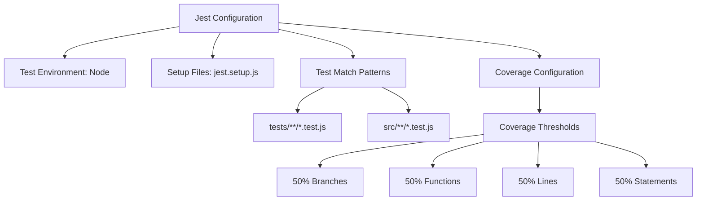
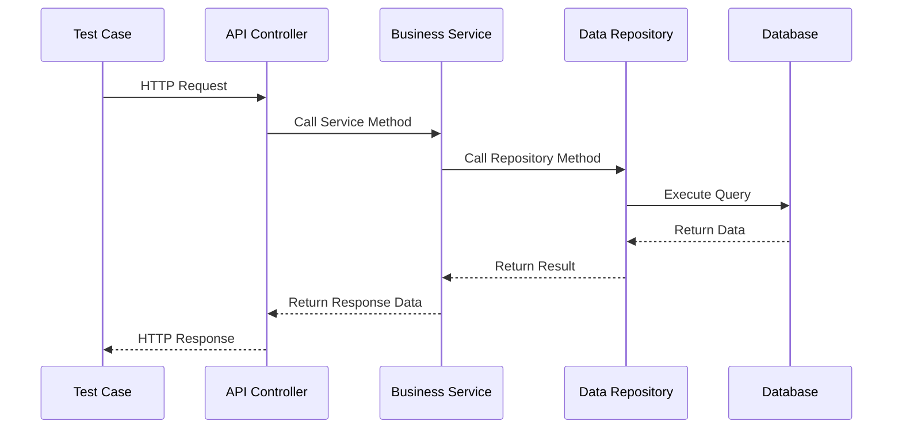
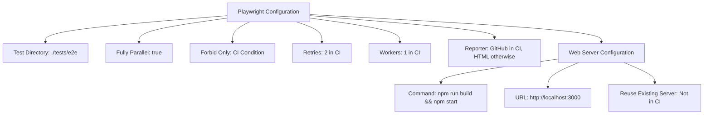
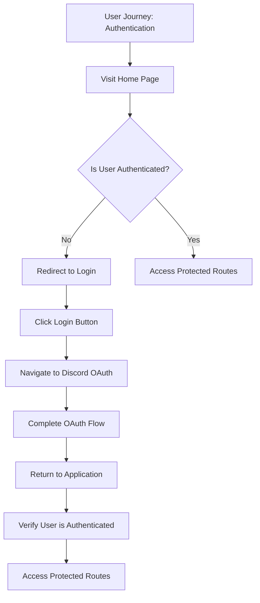
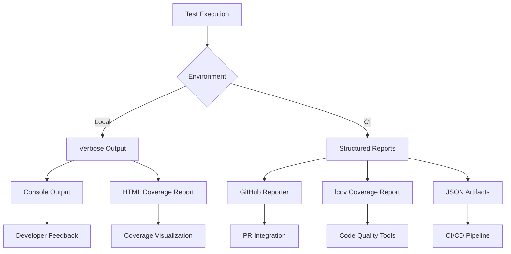
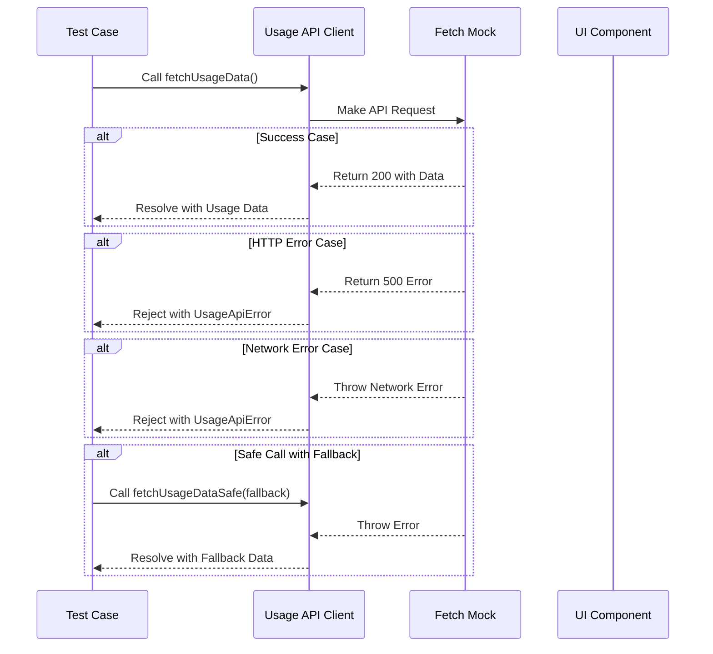
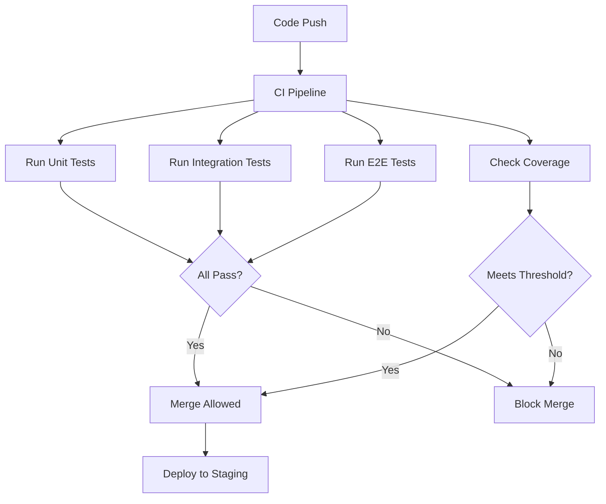

# Testing Strategy

<cite>
**Referenced Files in This Document**   
- [jest.config.js](file://apps/admin-api/jest.config.js)
- [jest.setup.js](file://apps/admin-api/jest.setup.js)
- [vitest.config.ts](file://apps/web/vitest.config.ts)
- [playwright.config.ts](file://apps/web/playwright.config.ts)
- [auth-middleware.test.js](file://apps/admin-api/tests/auth/auth-middleware.test.js)
- [usage.test.ts](file://apps/web/tests/api/usage.test.ts)
- [button.test.tsx](file://apps/web/tests/components/button.test.tsx)
- [auth-flow.spec.ts](file://apps/web/tests/e2e/auth-flow.spec.ts)
- [auth.js](file://apps/admin-api/src/middleware/auth.js)
- [usage.ts](file://apps/web/lib/api/usage.ts)
- [button.tsx](file://apps/web/components/ui/button.tsx)
- [setup.ts](file://apps/web/tests/setup.ts)
- [auth-mock.ts](file://apps/web/tests/utils/auth-mock.ts)
</cite>

## Table of Contents
1. [Introduction](#introduction)
2. [Unit Testing Approach](#unit-testing-approach)
3. [Integration Testing Methodology](#integration-testing-methodology)
4. [End-to-End Testing Implementation](#end-to-end-testing-implementation)
5. [Test Coverage and Reporting](#test-coverage-and-reporting)
6. [Testing Utilities and Mocks](#testing-utilities-and-mocks)
7. [Test Case Examples](#test-case-examples)
8. [Testing Best Practices](#testing-best-practices)
9. [Continuous Integration Integration](#continuous-integration-integration)
10. [Conclusion](#conclusion)

## Introduction
The slimy-monorepo platform employs a comprehensive testing strategy to ensure code quality, reliability, and maintainability across its diverse applications. This document details the testing approach for the platform, covering unit, integration, and end-to-end testing methodologies. The strategy leverages Jest for backend services, Vitest for frontend components, and Playwright for browser automation, providing a robust quality assurance framework that supports the platform's complex architecture and evolving feature set.

## Unit Testing Approach
The slimy-monorepo platform implements a comprehensive unit testing strategy using Jest for backend services and Vitest for frontend components. This approach ensures that individual units of code function correctly in isolation, providing a solid foundation for overall application reliability.

### Backend Unit Testing with Jest
The admin-api application uses Jest as its primary testing framework for backend services. The configuration in `jest.config.js` specifies a node test environment with setup files defined in `jest.setup.js`. Test files are located in the `tests/` directory and follow the `.test.js` naming convention. The configuration includes coverage collection from source files while excluding test files, with coverage thresholds set at 50% for branches, functions, lines, and statements.



**Diagram sources**
- [jest.config.js](file://apps/admin-api/jest.config.js)

**Section sources**
- [jest.config.js](file://apps/admin-api/jest.config.js)

### Frontend Unit Testing with Vitest
The web application utilizes Vitest for frontend unit testing, configured in `vitest.config.ts`. This configuration specifies a jsdom environment for testing React components, with test files located in the `tests/unit/` directory and following the `.test.{ts,tsx}` naming convention. The coverage configuration sets thresholds at 60% for branches, functions, lines, and statements, with excluded directories including node_modules, dist, and coverage reports.

```mermaid
flowchart TD
A[Vitest Configuration] --> B[Test Environment: jsdom]
A --> C[Setup Files: setup.ts]
A --> D[Test Include Patterns]
A --> E[Coverage Configuration]
D --> F[tests/**/*.test.{ts,tsx}]
D --> G[tests/**/__tests__/**/*.{ts,tsx}]
E --> H[Coverage Thresholds]
H --> I[60% Branches]
H --> J[60% Functions]
H --> K[60% Lines]
H --> L[60% Statements]
```

**Diagram sources**
- [vitest.config.ts](file://apps/web/vitest.config.ts)

**Section sources**
- [vitest.config.ts](file://apps/web/vitest.config.ts)

### Test Organization
Unit tests are organized by application and functionality, with dedicated directories for each application in the monorepo. The admin-api application places tests in the `tests/` directory at the application root, further organizing them by type (e.g., `auth/`, `api/`, `integration/`). The web application follows a similar pattern with tests in the `tests/` directory, organized into `unit/`, `components/`, and `api/` subdirectories. This organization facilitates easy navigation and maintenance of test suites as the codebase evolves.

## Integration Testing Methodology
The integration testing methodology for the slimy-monorepo platform focuses on validating interactions between components, services, and API endpoints. This approach ensures that different parts of the system work together as expected, identifying issues that may not be apparent in unit tests.

### API Endpoint Testing
Integration tests for API endpoints validate the behavior of HTTP routes and their interactions with backend services. These tests typically use a test server instance to simulate real API calls and verify responses. The tests cover various scenarios including successful requests, error conditions, authentication requirements, and data validation. For example, the auth middleware tests verify that authentication and authorization checks work correctly across different endpoints.

### Service Interaction Testing
Service interaction tests focus on the integration between different backend services and their dependencies. These tests verify that services can communicate with databases, external APIs, and other services as expected. The tests often use mocked dependencies to isolate the integration points being tested while maintaining realistic behavior. For instance, database interactions are typically mocked to avoid dependencies on actual database instances during testing.



**Diagram sources**
- [auth-middleware.test.js](file://apps/admin-api/tests/auth/auth-middleware.test.js)
- [auth.js](file://apps/admin-api/src/middleware/auth.js)

**Section sources**
- [auth-middleware.test.js](file://apps/admin-api/tests/auth/auth-middleware.test.js)

## End-to-End Testing Implementation
The end-to-end testing implementation for the slimy-monorepo platform uses Playwright for browser automation and user journey validation. This approach ensures that the complete application workflow functions correctly from the user's perspective.

### Playwright Configuration
The web application's Playwright configuration is defined in `playwright.config.ts`, which specifies the test directory as `./tests/e2e`, enables full parallelization, and configures retry behavior for CI environments. The configuration sets up a web server that runs the application before tests, ensuring tests are executed against a running instance. The baseURL is set to `http://localhost:3000`, and various options for tracing, screenshots, and video recording are configured to aid in debugging test failures.



**Diagram sources**
- [playwright.config.ts](file://apps/web/playwright.config.ts)

**Section sources**
- [playwright.config.ts](file://apps/web/playwright.config.ts)

### User Journey Validation
End-to-end tests validate complete user journeys through the application, simulating real user interactions with the interface. These tests cover critical workflows such as authentication, navigation, form submission, and data manipulation. For example, the authentication flow tests verify that unauthenticated users are redirected to the login page, that the OAuth login process works correctly, and that users can access protected routes after authentication.



**Diagram sources**
- [auth-flow.spec.ts](file://apps/web/tests/e2e/auth-flow.spec.ts)

**Section sources**
- [auth-flow.spec.ts](file://apps/web/tests/e2e/auth-flow.spec.ts)

## Test Coverage and Reporting
The slimy-monorepo platform implements comprehensive test coverage requirements and reporting mechanisms to ensure code quality and identify areas needing additional testing.

### Coverage Requirements
The platform enforces minimum coverage thresholds for both backend and frontend code. The admin-api application requires 50% coverage across branches, functions, lines, and statements, while the web application has a higher threshold of 60%. These thresholds are configured in the respective test framework configurations and serve as quality gates in the development process. The coverage configuration excludes test files, configuration files, and third-party dependencies to focus on application code.

### Reporting Mechanisms
Test reporting is integrated into the development workflow through multiple mechanisms. Local development provides detailed test output with verbose logging, while CI environments generate structured reports in various formats. The web application's Vitest configuration generates coverage reports in text, JSON, HTML, and lcov formats, enabling integration with code quality tools and dashboards. Playwright tests in CI environments use the GitHub reporter for seamless integration with pull request workflows, while local testing uses the HTML reporter for detailed visual reports.



**Diagram sources**
- [vitest.config.ts](file://apps/web/vitest.config.ts)
- [playwright.config.ts](file://apps/web/playwright.config.ts)

**Section sources**
- [vitest.config.ts](file://apps/web/vitest.config.ts)
- [playwright.config.ts](file://apps/web/playwright.config.ts)

## Testing Utilities and Mocks
The slimy-monorepo platform includes a comprehensive set of testing utilities and mock implementations to facilitate effective testing across the codebase.

### Mock Implementations
The platform uses extensive mocking to isolate units under test and simulate various scenarios. The `jest.setup.js` file in the admin-api application mocks critical dependencies such as the database, session store, JWT functions, and external services. These mocks provide controlled test environments while maintaining realistic behavior. For example, the database mock simulates Prisma client methods with predefined responses, allowing tests to verify business logic without requiring a real database connection.

```mermaid
classDiagram
class DatabaseMock {
+create() Promise~Guild~
+findUnique() Promise~Guild~
+findMany() Promise~Guild[]
+update() Promise~Guild~
+delete() Promise~{}
}
class SessionStoreMock {
+storeSession(userId, sessionData) void
+getSession(userId) SessionData
+clearSession(userId) void
+activeSessionCount() number
}
class JWTMock {
+verifySession(token) DecodedToken
+signSession(data) string
+setAuthCookie() void
+clearAuthCookie() void
}
class LoggerMock {
+info(message) void
+warn(message) void
+error(message) void
}
DatabaseMock <.. DatabaseClient : "mocks"
SessionStoreMock <.. SessionStore : "mocks"
JWTMock <.. JWTService : "mocks"
LoggerMock <.. Logger : "mocks"
```

**Diagram sources**
- [jest.setup.js](file://apps/admin-api/jest.setup.js)

**Section sources**
- [jest.setup.js](file://apps/admin-api/jest.setup.js)

### Testing Utilities
The platform provides various testing utilities to simplify common testing patterns and improve test reliability. The web application includes a `setup.ts` file that configures the test environment and sets required environment variables. Additionally, the `auth-mock.ts` utility provides functions for mocking authentication states, allowing tests to simulate both authenticated and unauthenticated scenarios easily. These utilities promote consistency across tests and reduce boilerplate code.

## Test Case Examples
The slimy-monorepo platform includes numerous test case examples that demonstrate effective testing practices for different components and scenarios.

### Auth Middleware Tests
The auth middleware tests in `auth-middleware.test.js` provide comprehensive coverage of authentication and authorization functionality. These tests verify that the `resolveUser` function correctly handles various token scenarios, including missing tokens, invalid tokens, and valid tokens. They also test the `requireAuth`, `requireRole`, and `requireGuildMember` middleware functions, ensuring proper error responses for unauthorized access attempts. The tests use Jest's mocking capabilities to isolate the middleware from its dependencies, focusing on the logic being tested.

**Section sources**
- [auth-middleware.test.js](file://apps/admin-api/tests/auth/auth-middleware.test.js)
- [auth.js](file://apps/admin-api/src/middleware/auth.js)

### API Route Tests
The usage API tests in `usage.test.ts` demonstrate effective testing of frontend API clients. These tests verify that the `fetchUsageData` function correctly handles successful responses, HTTP errors, application-level errors, and network failures. The tests use Vitest's mocking capabilities to intercept fetch calls and simulate various response scenarios. They also test the `fetchUsageDataSafe` function, which provides a fallback mechanism for error conditions, ensuring graceful degradation in the user interface.



**Diagram sources**
- [usage.test.ts](file://apps/web/tests/api/usage.test.ts)
- [usage.ts](file://apps/web/lib/api/usage.ts)

**Section sources**
- [usage.test.ts](file://apps/web/tests/api/usage.test.ts)

### UI Component Tests
The button component tests in `button.test.tsx` demonstrate effective testing of React components. These tests verify that the Button component renders correctly with different variants (default, destructive, outline, secondary, ghost, link, neon, purple) and sizes (default, sm, lg, icon). They also test interactive behavior such as click events, disabled state, and prop forwarding. The tests use React Testing Library to render components and interact with them in a way that simulates real user behavior, ensuring the component works correctly in the context of the application.

**Section sources**
- [button.test.tsx](file://apps/web/tests/components/button.test.tsx)
- [button.tsx](file://apps/web/components/ui/button.tsx)

## Testing Best Practices
The slimy-monorepo platform follows several testing best practices to ensure high-quality, maintainable tests that effectively validate the application.

### Test Isolation
Tests are designed to be isolated and independent, ensuring that the failure of one test does not affect others. This is achieved through proper setup and teardown of test environments, use of mocking to isolate dependencies, and avoidance of shared state between tests. The use of `beforeEach` and `afterEach` hooks ensures that each test starts with a clean state, while Jest's automatic mock clearing prevents interference between tests.

### Comprehensive Test Coverage
The platform emphasizes comprehensive test coverage, including positive and negative test cases, edge cases, and error conditions. Tests cover not only the happy path but also various failure modes and boundary conditions. For example, the usage API tests include cases for network failures, HTTP errors, invalid responses, and malformed data, ensuring the application handles these scenarios gracefully.

### Maintainable Test Suites
The test suites are designed to be maintainable as the codebase evolves. This is achieved through clear test organization, descriptive test names, and avoidance of brittle selectors or implementation details. Tests focus on the behavior and functionality of components rather than their internal implementation, making them more resilient to refactoring. The use of testing utilities and shared setup code reduces duplication and makes it easier to update tests when requirements change.

## Continuous Integration Integration
The testing strategy is fully integrated into the continuous integration pipeline, ensuring that tests are automatically executed for every code change.

### CI Test Execution
The platform's CI configuration runs all tests automatically on every push and pull request. The configuration includes separate jobs for unit tests, integration tests, and end-to-end tests, allowing for parallel execution and faster feedback. Test results are reported directly in the pull request interface, providing immediate feedback to developers. The CI environment uses the same test configurations as local development, ensuring consistency between development and production environments.

### Quality Gates
The CI pipeline includes quality gates based on test results and coverage metrics. Tests must pass for code to be merged, and coverage thresholds must be met or improved. This ensures that code quality is maintained and prevents the introduction of untested code. The coverage reporting integrates with code review tools, allowing reviewers to easily identify areas that need additional testing.



**Diagram sources**
- [jest.config.js](file://apps/admin-api/jest.config.js)
- [vitest.config.ts](file://apps/web/vitest.config.ts)
- [playwright.config.ts](file://apps/web/playwright.config.ts)

**Section sources**
- [jest.config.js](file://apps/admin-api/jest.config.js)
- [vitest.config.ts](file://apps/web/vitest.config.ts)
- [playwright.config.ts](file://apps/web/playwright.config.ts)

## Conclusion
The testing strategy for the slimy-monorepo platform provides a comprehensive framework for ensuring code quality and reliability. By leveraging Jest for backend testing, Vitest for frontend testing, and Playwright for end-to-end testing, the platform covers all aspects of the application from individual units to complete user journeys. The strategy emphasizes test isolation, comprehensive coverage, and maintainability, supported by robust testing utilities and mock implementations. Integration with the continuous integration pipeline ensures that tests are automatically executed and serve as quality gates for code changes. This comprehensive approach enables the platform to maintain high code quality while supporting rapid development and evolution of its features.