# Unit Testing

<cite>
**Referenced Files in This Document**   
- [jest.config.js](file://apps/admin-api/jest.config.js)
- [jest.setup.js](file://apps/admin-api/jest.setup.js)
- [vitest.config.ts](file://apps/web/vitest.config.ts)
- [vitest.config.ts](file://apps/bot/vitest.config.ts)
- [auth-middleware.test.js](file://apps/admin-api/tests/auth/auth-middleware.test.js)
- [rbac.test.js](file://apps/admin-api/tests/middleware/rbac.test.js)
- [codes-aggregator.test.ts](file://apps/web/tests/unit/codes-aggregator.test.ts)
- [api-client.test.ts](file://apps/web/lib/api-client.test.ts)
- [auth.js](file://apps/admin-api/src/middleware/auth.js)
- [rbac.js](file://apps/admin-api/src/middleware/rbac.js)
- [config/index.js](file://apps/admin-api/src/lib/config/index.js)
- [api-client.ts](file://apps/web/lib/api-client.ts)
- [auth-mock.ts](file://apps/web/tests/utils/auth-mock.ts)
- [setup.ts](file://apps/web/tests/setup.ts)
</cite>

## Table of Contents
1. [Introduction](#introduction)
2. [Testing Frameworks and Configuration](#testing-frameworks-and-configuration)
3. [Test Organization Patterns](#test-organization-patterns)
4. [Mocking Strategies](#mocking-strategies)
5. [Assertion Practices](#assertion-practices)
6. [Test Environment Isolation](#test-environment-isolation)
7. [Coverage Thresholds and Code Quality](#coverage-thresholds-and-code-quality)
8. [Best Practices for Unit Testing](#best-practices-for-unit-testing)
9. [Guidance for New Unit Tests](#guidance-for-new-unit-tests)
10. [Integration into Development Workflow](#integration-into-development-workflow)

## Introduction
The slimy-monorepo platform employs a comprehensive unit testing strategy to ensure the reliability and maintainability of its codebase. This document details the unit testing approach across the platform, focusing on the admin-api application using Jest and the web application using Vitest. The testing framework supports validation of individual functions and modules, with a strong emphasis on mocking dependencies, maintaining test isolation, and enforcing code quality through coverage thresholds. The documentation covers test organization, assertion practices, and integration into the development workflow, providing guidance for writing deterministic, fast, and maintainable unit tests.

## Testing Frameworks and Configuration
The slimy-monorepo platform utilizes different testing frameworks for its backend and frontend applications, each configured to meet the specific needs of the respective codebase.

### Jest for Backend Unit Tests
The admin-api application uses Jest as its primary testing framework. The configuration is defined in `jest.config.js`, which specifies the test environment as 'node' and includes setup files via `setupFilesAfterEnv`. The test match patterns are configured to find test files in both the `tests/` directory and within the `src/` directory, allowing for colocated tests. The coverage configuration collects coverage from all JavaScript files in the `src/` directory while excluding test files. The coverage thresholds are set at 50% for branches, functions, lines, and statements, providing a baseline for code quality.

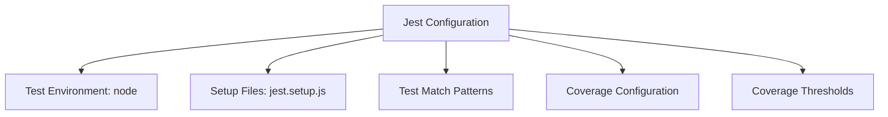

**Diagram sources**
- [jest.config.js](file://apps/admin-api/jest.config.js)

### Vitest for Frontend Unit Tests
The web application uses Vitest as its testing framework, configured in `vitest.config.ts`. The configuration includes plugins for React and TypeScript path resolution. The test environment is set to 'jsdom' for frontend tests, with a separate environment for unit and API tests. The coverage provider is set to 'v8', with reporters for text, JSON, HTML, and lcov formats. The coverage thresholds are set at 60% for branches, functions, lines, and statements, reflecting a higher standard for frontend code quality.

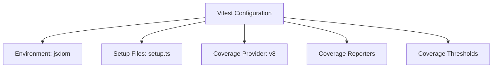

**Diagram sources**
- [vitest.config.ts](file://apps/web/vitest.config.ts)

**Section sources**
- [vitest.config.ts](file://apps/web/vitest.config.ts)
- [vitest.config.ts](file://apps/bot/vitest.config.ts)

## Test Organization Patterns
The unit tests in the slimy-monorepo platform follow a consistent organization pattern, with tests grouped by functionality and colocated with the code they test when appropriate.

### Backend Test Organization
In the admin-api application, tests are organized in a `tests/` directory at the root level, with subdirectories for different types of tests such as `api/`, `auth/`, `integration/`, and `middleware/`. Additionally, some test files are colocated with the source code in the `src/` directory, following the pattern of `<filename>.test.js`. This hybrid approach allows for both centralized and decentralized test organization, depending on the nature of the tests.

### Frontend Test Organization
In the web application, tests are organized in a `tests/` directory with subdirectories for `unit/`, `api/`, and `e2e/`. Unit tests are further organized by feature or component, with test files following the pattern of `<filename>.test.ts` or `<filename>.test.tsx`. This organization supports a clear separation of test types and makes it easy to locate tests for specific functionality.

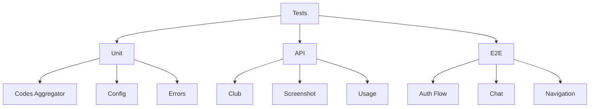

**Diagram sources**
- [tests](file://apps/web/tests)
- [tests](file://apps/admin-api/tests)

**Section sources**
- [tests](file://apps/web/tests)
- [tests](file://apps/admin-api/tests)

## Mocking Strategies
The unit testing strategy in the slimy-monorepo platform relies heavily on mocking to isolate the code under test and simulate dependencies.

### Mocking Dependencies in Backend Tests
The admin-api application uses Jest's mocking capabilities to mock dependencies such as database clients, external APIs, and configuration modules. The `jest.setup.js` file contains mocks for various modules, including the database, session store, JWT functions, and external services like Redis and OpenAI. These mocks are configured to return predictable data, allowing tests to focus on the logic of the code under test without relying on external systems.

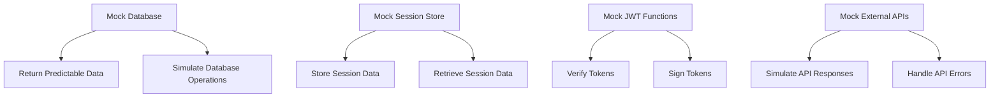

**Diagram sources**
- [jest.setup.js](file://apps/admin-api/jest.setup.js)

### Mocking Dependencies in Frontend Tests
The web application uses Vitest's mocking capabilities to mock dependencies such as API clients, authentication services, and external libraries. The `auth-mock.ts` file provides utilities for mocking authentication, allowing tests to simulate different user roles and authentication states. The `api-client.test.ts` file demonstrates how the API client is mocked to simulate network requests and responses, enabling tests to verify the behavior of the client without making actual network calls.

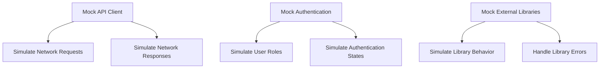

**Diagram sources**
- [auth-mock.ts](file://apps/web/tests/utils/auth-mock.ts)
- [api-client.test.ts](file://apps/web/lib/api-client.test.ts)

**Section sources**
- [auth-mock.ts](file://apps/web/tests/utils/auth-mock.ts)
- [api-client.test.ts](file://apps/web/lib/api-client.test.ts)

## Assertion Practices
The unit tests in the slimy-monorepo platform follow consistent assertion practices to ensure clarity and reliability.

### Backend Assertion Practices
In the admin-api application, assertions are made using Jest's expect API, with a focus on verifying the behavior of middleware functions, route handlers, and service functions. Tests for middleware functions typically verify that the correct status code and response body are returned in various scenarios, such as authentication failures or insufficient permissions. Tests for service functions verify that the correct database operations are performed and that the expected data is returned.

### Frontend Assertion Practices
In the web application, assertions are made using Vitest's expect API, with a focus on verifying the behavior of React components, utility functions, and API clients. Tests for React components typically verify that the correct elements are rendered and that user interactions produce the expected behavior. Tests for utility functions verify that the correct transformations are applied to the input data. Tests for API clients verify that the correct requests are made and that the responses are handled appropriately.

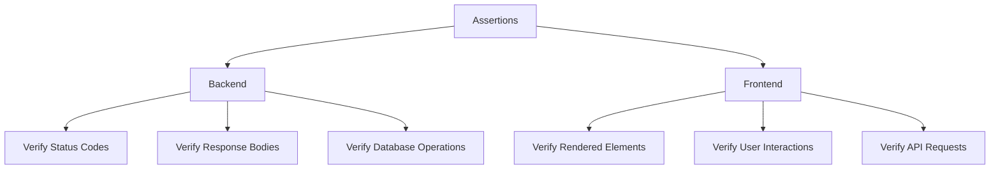

**Diagram sources**
- [auth-middleware.test.js](file://apps/admin-api/tests/auth/auth-middleware.test.js)
- [rbac.test.js](file://apps/admin-api/tests/middleware/rbac.test.js)
- [codes-aggregator.test.ts](file://apps/web/tests/unit/codes-aggregator.test.ts)

**Section sources**
- [auth-middleware.test.js](file://apps/admin-api/tests/auth/auth-middleware.test.js)
- [rbac.test.js](file://apps/admin-api/tests/middleware/rbac.test.js)
- [codes-aggregator.test.ts](file://apps/web/tests/unit/codes-aggregator.test.ts)

## Test Environment Isolation
The unit tests in the slimy-monorepo platform are designed to run in isolated environments, ensuring that tests do not interfere with each other or with the development environment.

### Backend Test Environment Isolation
The admin-api application uses Jest's test environment isolation features to ensure that each test runs in a clean environment. The `jest.setup.js` file sets up the required environment variables and mocks for each test, ensuring that tests do not rely on the state of the development environment. The database is mocked to prevent tests from making actual database calls, and the session store is mocked to prevent tests from modifying the session data.

### Frontend Test Environment Isolation
The web application uses Vitest's test environment isolation features to ensure that each test runs in a clean environment. The `setup.ts` file sets up the required environment variables for each test, ensuring that tests do not rely on the state of the development environment. The API client is mocked to prevent tests from making actual network calls, and the authentication service is mocked to prevent tests from modifying the authentication state.

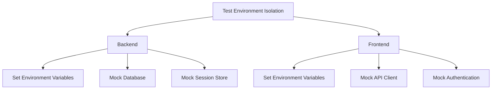

**Diagram sources**
- [jest.setup.js](file://apps/admin-api/jest.setup.js)
- [setup.ts](file://apps/web/tests/setup.ts)

**Section sources**
- [jest.setup.js](file://apps/admin-api/jest.setup.js)
- [setup.ts](file://apps/web/tests/setup.ts)

## Coverage Thresholds and Code Quality
The slimy-monorepo platform enforces code quality through coverage thresholds defined in the testing configuration files.

### Backend Coverage Thresholds
The admin-api application has coverage thresholds set at 50% for branches, functions, lines, and statements. These thresholds are defined in the `jest.config.js` file and are enforced during the test run. The coverage configuration collects coverage from all JavaScript files in the `src/` directory while excluding test files, ensuring that the coverage metrics reflect the quality of the production code.

### Frontend Coverage Thresholds
The web application has coverage thresholds set at 60% for branches, functions, lines, and statements. These thresholds are defined in the `vitest.config.ts` file and are enforced during the test run. The coverage configuration collects coverage from all TypeScript and TypeScript React files in the `tests/unit/` directory while excluding test files, ensuring that the coverage metrics reflect the quality of the production code.

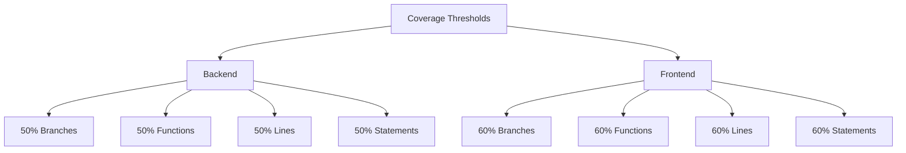

**Diagram sources**
- [jest.config.js](file://apps/admin-api/jest.config.js)
- [vitest.config.ts](file://apps/web/vitest.config.ts)

**Section sources**
- [jest.config.js](file://apps/admin-api/jest.config.js)
- [vitest.config.ts](file://apps/web/vitest.config.ts)

## Best Practices for Unit Testing
The slimy-monorepo platform follows several best practices for writing unit tests that are deterministic, fast, and maintainable.

### Writing Deterministic Tests
Tests are designed to be deterministic by using mocks to simulate dependencies and by setting up a consistent test environment. This ensures that tests produce the same results every time they are run, regardless of the state of the external systems.

### Writing Fast Tests
Tests are designed to be fast by minimizing the use of external systems and by using mocks to simulate dependencies. This allows tests to run quickly, enabling developers to run the test suite frequently during development.

### Writing Maintainable Tests
Tests are designed to be maintainable by following a consistent organization pattern and by using clear and descriptive test names. This makes it easy to understand the purpose of each test and to update tests when the code under test changes.

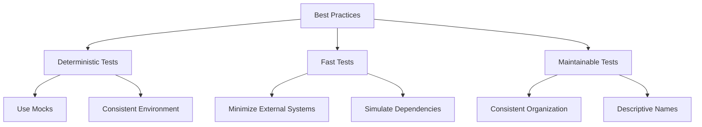

**Diagram sources**
- [auth-middleware.test.js](file://apps/admin-api/tests/auth/auth-middleware.test.js)
- [rbac.test.js](file://apps/admin-api/tests/middleware/rbac.test.js)
- [codes-aggregator.test.ts](file://apps/web/tests/unit/codes-aggregator.test.ts)

**Section sources**
- [auth-middleware.test.js](file://apps/admin-api/tests/auth/auth-middleware.test.js)
- [rbac.test.js](file://apps/admin-api/tests/middleware/rbac.test.js)
- [codes-aggregator.test.ts](file://apps/web/tests/unit/codes-aggregator.test.ts)

## Guidance for New Unit Tests
When writing new unit tests for the slimy-monorepo platform, developers should follow the established patterns and practices to ensure consistency and quality.

### Organizing New Tests
New tests should be organized according to the existing patterns, with backend tests placed in the `tests/` directory or colocated with the source code, and frontend tests placed in the `tests/unit/` directory. Test files should follow the naming convention of `<filename>.test.js` or `<filename>.test.ts`.

### Mocking Dependencies
New tests should use the existing mocks for dependencies such as the database, session store, and external APIs. If a new dependency needs to be mocked, the mock should be added to the appropriate setup file, such as `jest.setup.js` for backend tests or `setup.ts` for frontend tests.

### Writing Assertions
New tests should use the expect API to make assertions about the behavior of the code under test. Assertions should be clear and descriptive, verifying the expected outcomes of the code.

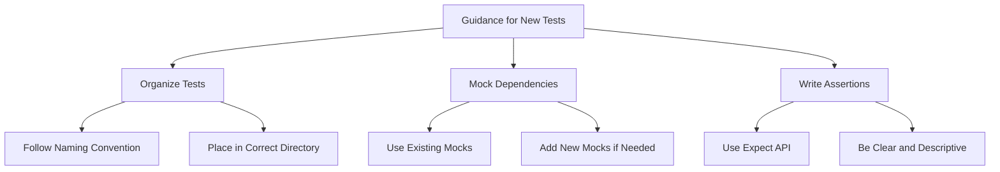

**Diagram sources**
- [jest.config.js](file://apps/admin-api/jest.config.js)
- [vitest.config.ts](file://apps/web/vitest.config.ts)
- [jest.setup.js](file://apps/admin-api/jest.setup.js)
- [setup.ts](file://apps/web/tests/setup.ts)

**Section sources**
- [jest.config.js](file://apps/admin-api/jest.config.js)
- [vitest.config.ts](file://apps/web/vitest.config.ts)
- [jest.setup.js](file://apps/admin-api/jest.setup.js)
- [setup.ts](file://apps/web/tests/setup.ts)

## Integration into Development Workflow
The unit testing process is integrated into the development workflow to ensure that tests are run frequently and that code quality is maintained.

### Running Tests
Tests can be run using the `test` script defined in the `package.json` file for each application. The admin-api application uses the `jest` command, while the web application uses the `vitest` command. Developers are encouraged to run the test suite frequently during development to catch issues early.

### Continuous Integration
The test suite is run as part of the continuous integration process, ensuring that all tests pass before code is merged into the main branch. The coverage thresholds are enforced during the CI process, preventing code with insufficient test coverage from being merged.

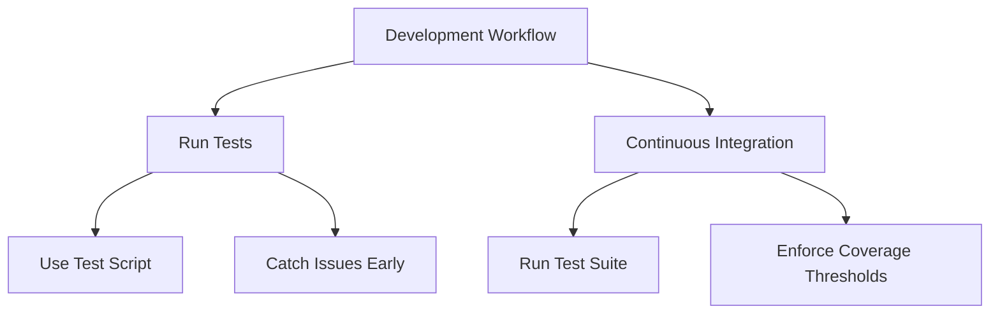

**Diagram sources**
- [package.json](file://apps/admin-api/package.json)
- [package.json](file://apps/web/package.json)

**Section sources**
- [package.json](file://apps/admin-api/package.json)
- [package.json](file://apps/web/package.json)