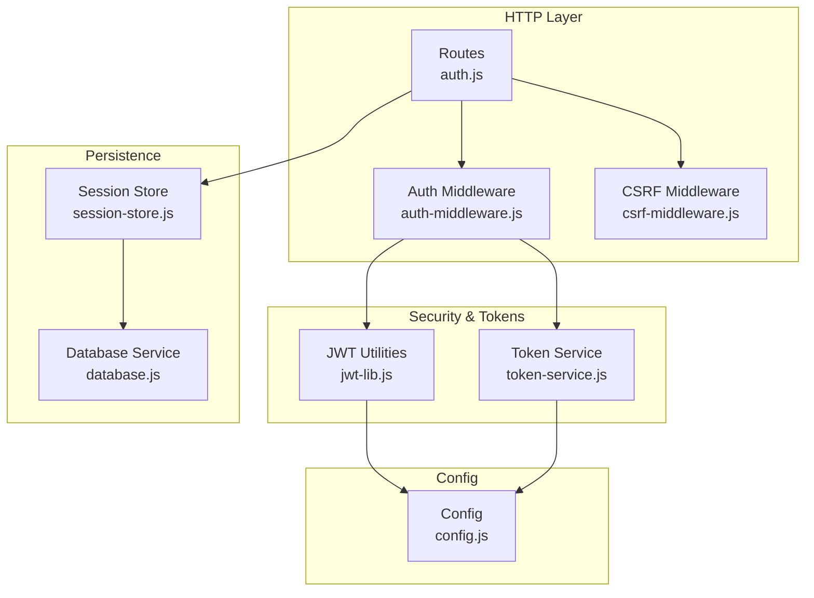
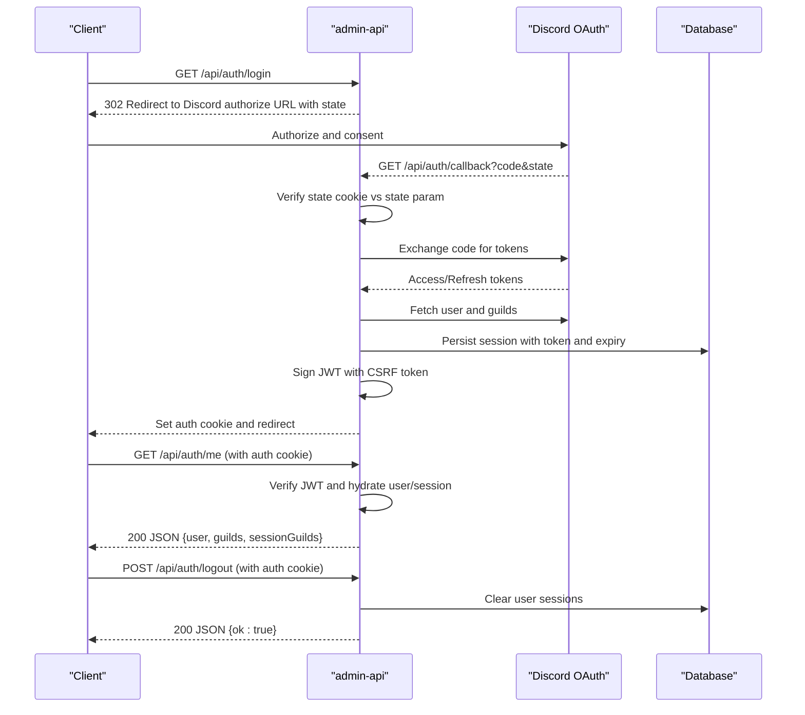
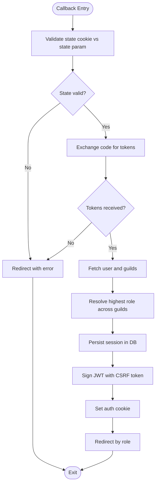
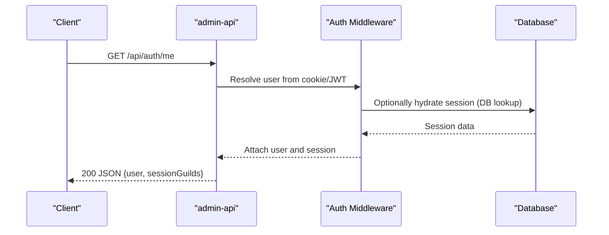
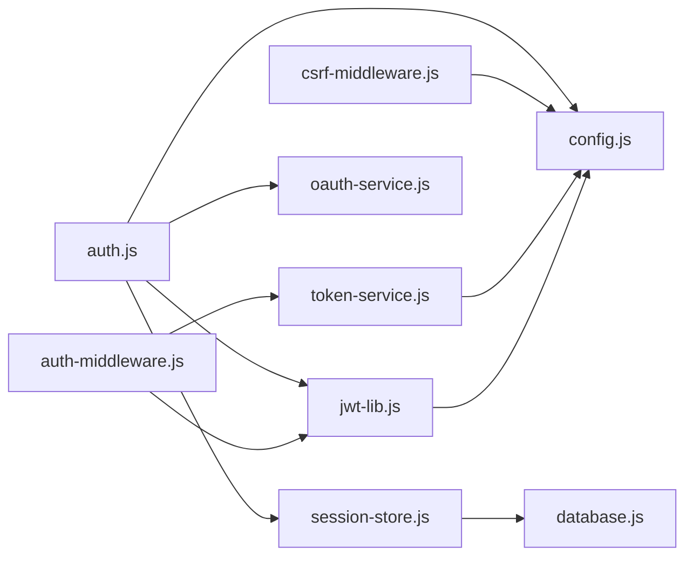

# Authentication Endpoints

<cite>
**Referenced Files in This Document**
- [auth.js](file://apps/admin-api/src/routes/auth.js)
- [auth-middleware.js](file://apps/admin-api/src/middleware/auth.js)
- [csrf-middleware.js](file://apps/admin-api/src/middleware/csrf.js)
- [token-service.js](file://apps/admin-api/src/services/token.js)
- [jwt-lib.js](file://apps/admin-api/lib/jwt.js)
- [session-store.js](file://apps/admin-api/lib/session-store.js)
- [database.js](file://apps/admin-api/src/lib/database.js)
- [config.js](file://apps/admin-api/src/config.js)
- [app.js](file://apps/admin-api/src/app.js)
- [oauth-service.js](file://apps/admin-api/src/services/oauth.js)
</cite>

## Table of Contents
1. [Introduction](#introduction)
2. [Project Structure](#project-structure)
3. [Core Components](#core-components)
4. [Architecture Overview](#architecture-overview)
5. [Detailed Component Analysis](#detailed-component-analysis)
6. [Dependency Analysis](#dependency-analysis)
7. [Performance Considerations](#performance-considerations)
8. [Troubleshooting Guide](#troubleshooting-guide)
9. [Conclusion](#conclusion)

## Introduction
This document provides comprehensive API documentation for the authentication endpoints in the admin-api service. It covers:
- OAuth flow initiation at GET /api/auth/login
- Callback handling at GET /api/auth/callback
- Current user retrieval at GET /api/auth/me
- Session clearing at POST /api/auth/logout

It details the JWT-based authentication mechanism, session management using a database-backed store, CSRF protection, and rate limiting policies. It also includes request/response schemas, example payloads, and integration guidance for admin-ui and web applications.

## Project Structure
The authentication system spans several modules:
- Route handlers for auth endpoints
- Middleware for authentication, CSRF, and RBAC
- Token signing and verification utilities
- Session persistence and cleanup
- Configuration for environment variables and security defaults

**Diagram sources**
- [auth.js](file://apps/admin-api/src/routes/auth.js#L1-L401)
- [auth-middleware.js](file://apps/admin-api/src/middleware/auth.js#L1-L231)
- [csrf-middleware.js](file://apps/admin-api/src/middleware/csrf.js#L1-L28)
- [token-service.js](file://apps/admin-api/src/services/token.js#L1-L60)
- [jwt-lib.js](file://apps/admin-api/lib/jwt.js#L1-L81)
- [session-store.js](file://apps/admin-api/lib/session-store.js#L1-L95)
- [database.js](file://apps/admin-api/src/lib/database.js#L1-L662)
- [config.js](file://apps/admin-api/src/config.js#L1-L125)

**Section sources**
- [auth.js](file://apps/admin-api/src/routes/auth.js#L1-L401)
- [auth-middleware.js](file://apps/admin-api/src/middleware/auth.js#L1-L231)
- [csrf-middleware.js](file://apps/admin-api/src/middleware/csrf.js#L1-L28)
- [token-service.js](file://apps/admin-api/src/services/token.js#L1-L60)
- [jwt-lib.js](file://apps/admin-api/lib/jwt.js#L1-L81)
- [session-store.js](file://apps/admin-api/lib/session-store.js#L1-L95)
- [database.js](file://apps/admin-api/src/lib/database.js#L1-L662)
- [config.js](file://apps/admin-api/src/config.js#L1-L125)

## Core Components
- OAuth flow: Initiates login with Discord, validates state, exchanges code for tokens, enriches user data, persists session, and sets a signed JWT cookie.
- JWT-based session: Signs a session payload containing user identity, roles, and a CSRF token; stores cookie with secure attributes.
- Session persistence: Stores user session tokens in the database with expiration; cleans up expired sessions periodically.
- Auth middleware: Reads cookies, verifies JWT, hydrates user and session data, and attaches to requests.
- CSRF protection: Enforces CSRF token presence for unsafe methods and validates against the user’s token.
- Rate limiting: Applies per-user and per-guild limits for task-related operations.

**Section sources**
- [auth.js](file://apps/admin-api/src/routes/auth.js#L108-L398)
- [jwt-lib.js](file://apps/admin-api/lib/jwt.js#L45-L81)
- [token-service.js](file://apps/admin-api/src/services/token.js#L29-L59)
- [session-store.js](file://apps/admin-api/lib/session-store.js#L18-L65)
- [database.js](file://apps/admin-api/src/lib/database.js#L242-L290)
- [auth-middleware.js](file://apps/admin-api/src/middleware/auth.js#L24-L128)
- [csrf-middleware.js](file://apps/admin-api/src/middleware/csrf.js#L7-L25)
- [rate-limit.js](file://apps/admin-api/src/middleware/rate-limit.js#L7-L21)

## Architecture Overview
The authentication flow integrates external OAuth with internal session management and cookie-based JWT verification.

**Diagram sources**
- [auth.js](file://apps/admin-api/src/routes/auth.js#L108-L398)
- [jwt-lib.js](file://apps/admin-api/lib/jwt.js#L64-L79)
- [token-service.js](file://apps/admin-api/src/services/token.js#L29-L49)
- [session-store.js](file://apps/admin-api/lib/session-store.js#L18-L39)
- [database.js](file://apps/admin-api/src/lib/database.js#L242-L290)

## Detailed Component Analysis

### Endpoint: GET /api/auth/login
- Purpose: Initiate OAuth with Discord. Generates a state parameter stored in a cookie and redirects the user to the Discord authorize URL.
- Method and URL: GET /api/auth/login
- Query parameters: None
- Headers: None
- Body: None
- Response: 302 redirect to Discord authorize URL with state and scopes.
- Security considerations:
  - State cookie is httpOnly, secure (when applicable), sameSite lax, and short-lived.
  - Redirect URI is configurable via environment variables.
- Example success flow:
  - Client receives a 302 redirect to Discord authorize URL.
- Example error flow:
  - Missing environment variables trigger warnings during startup.

**Section sources**
- [auth.js](file://apps/admin-api/src/routes/auth.js#L108-L119)
- [config.js](file://apps/admin-api/src/config.js#L31-L40)

### Endpoint: GET /api/auth/callback
- Purpose: Handle OAuth callback. Validates state, exchanges authorization code for tokens, fetches user and guilds, resolves roles, persists session, signs JWT, sets cookie, and redirects based on role.
- Method and URL: GET /api/auth/callback
- Query parameters:
  - code: Authorization code from Discord
  - state: State parameter sent with the authorize request
- Headers: None
- Body: None
- Response: 302 redirect to a role-based path (/guilds, /club, or /snail) or error redirection.
- Processing logic:
  - Validates state cookie equals state param.
  - Exchanges code for tokens with Discord.
  - Fetches user profile and guilds.
  - Resolves highest role across guilds (with or without bot token).
  - Enriches guilds with installed status and roles.
  - Persists session with token and expiry.
  - Signs JWT with CSRF token and sets secure cookie.
  - Redirects based on role.
- Example success payload (indirect):
  - Redirects to appropriate path based on user role.
- Example error payloads (indirect):
  - Redirects with error query parameter on state mismatch or token exchange failure.

**Diagram sources**
- [auth.js](file://apps/admin-api/src/routes/auth.js#L121-L398)
- [session-store.js](file://apps/admin-api/lib/session-store.js#L18-L39)
- [database.js](file://apps/admin-api/src/lib/database.js#L242-L290)

**Section sources**
- [auth.js](file://apps/admin-api/src/routes/auth.js#L121-L398)

### Endpoint: GET /api/auth/me
- Purpose: Return the authenticated user’s profile and session guilds.
- Method and URL: GET /api/auth/me
- Query parameters: None
- Headers: None
- Body: None
- Response:
  - 200 OK with JSON containing user fields and sessionGuilds.
  - 401 Unauthorized if not authenticated.
- Request flow:
  - Auth middleware reads cookie, verifies JWT, hydrates user and session data.
  - Returns user plus hydrated session guilds.
- Example success payload:
  - Fields include user identity, role, and arrays of guilds with role and installation status.
- Example error payload:
  - { error: "unauthorized" }

**Diagram sources**
- [auth.js](file://apps/admin-api/src/routes/auth.js#L376-L390)
- [auth-middleware.js](file://apps/admin-api/src/middleware/auth.js#L24-L128)
- [database.js](file://apps/admin-api/src/lib/database.js#L242-L290)

**Section sources**
- [auth.js](file://apps/admin-api/src/routes/auth.js#L376-L390)
- [auth-middleware.js](file://apps/admin-api/src/middleware/auth.js#L24-L128)

### Endpoint: POST /api/auth/logout
- Purpose: Clear the current session and remove the auth cookie.
- Method and URL: POST /api/auth/logout
- Query parameters: None
- Headers: None
- Body: None
- Response:
  - 200 OK with JSON { ok: true }.
- Behavior:
  - Clears database sessions for the user.
  - Clears the auth cookie.
- Example success payload:
  - { ok: true }

**Section sources**
- [auth.js](file://apps/admin-api/src/routes/auth.js#L392-L398)
- [session-store.js](file://apps/admin-api/lib/session-store.js#L57-L65)
- [jwt-lib.js](file://apps/admin-api/lib/jwt.js#L68-L72)

## Dependency Analysis
- Route dependencies:
  - auth.js depends on config, jwt utilities, session store, and Discord OAuth constants.
  - auth-middleware.js depends on token verification and session store hydration.
  - csrf-middleware.js depends on config for header name.
  - token-service.js depends on config for cookie options and JWT secret.
  - jwt-lib.js depends on config for cookie options and secret resolution.
  - session-store.js depends on database.js for persistence.
- External integrations:
  - Discord OAuth endpoints for authorization, token exchange, and user/guild APIs.
- Environment dependencies:
  - DISCORD_CLIENT_ID, DISCORD_CLIENT_SECRET, DISCORD_REDIRECT_URI, JWT_SECRET, SESSION_SECRET, COOKIE_DOMAIN, etc.

**Diagram sources**
- [auth.js](file://apps/admin-api/src/routes/auth.js#L1-L401)
- [auth-middleware.js](file://apps/admin-api/src/middleware/auth.js#L1-L231)
- [csrf-middleware.js](file://apps/admin-api/src/middleware/csrf.js#L1-L28)
- [token-service.js](file://apps/admin-api/src/services/token.js#L1-L60)
- [jwt-lib.js](file://apps/admin-api/lib/jwt.js#L1-L81)
- [session-store.js](file://apps/admin-api/lib/session-store.js#L1-L95)
- [database.js](file://apps/admin-api/src/lib/database.js#L1-L662)
- [config.js](file://apps/admin-api/src/config.js#L1-L125)
- [oauth-service.js](file://apps/admin-api/src/services/oauth.js#L1-L104)

**Section sources**
- [auth.js](file://apps/admin-api/src/routes/auth.js#L1-L401)
- [auth-middleware.js](file://apps/admin-api/src/middleware/auth.js#L1-L231)
- [csrf-middleware.js](file://apps/admin-api/src/middleware/csrf.js#L1-L28)
- [token-service.js](file://apps/admin-api/src/services/token.js#L1-L60)
- [jwt-lib.js](file://apps/admin-api/lib/jwt.js#L1-L81)
- [session-store.js](file://apps/admin-api/lib/session-store.js#L1-L95)
- [database.js](file://apps/admin-api/src/lib/database.js#L1-L662)
- [config.js](file://apps/admin-api/src/config.js#L1-L125)
- [oauth-service.js](file://apps/admin-api/src/services/oauth.js#L1-L104)

## Performance Considerations
- Token lifetime: JWT cookie max age and expiration are configured via environment variables.
- Session persistence: Sessions are stored with a fixed max age and cleaned up periodically.
- Parallel guild checks: During callback, guild membership checks are executed in parallel with timeouts to prevent slow responses.
- Database operations: Session creation and cleanup use database primitives; ensure database connectivity and indexing for performance.

[No sources needed since this section provides general guidance]

## Troubleshooting Guide
Common issues and resolutions:
- Missing environment variables:
  - Ensure DISCORD_CLIENT_ID, DISCORD_CLIENT_SECRET, DISCORD_REDIRECT_URI, JWT_SECRET, SESSION_SECRET, and COOKIE_DOMAIN are set appropriately.
- State mismatch:
  - Occurs when the state cookie does not match the state parameter; verify cookie settings and SameSite behavior.
- Token exchange failure:
  - Indicates issues with code-to-token exchange; confirm redirect URI and client credentials.
- Cookie not set:
  - Check cookie domain, secure flag, and SameSite settings; ensure HTTPS in production.
- Rate limiting:
  - Requests may be throttled; adjust ADMIN_TASK_LIMIT_WINDOW_MS and ADMIN_TASK_LIMIT_MAX as needed.

**Section sources**
- [config.js](file://apps/admin-api/src/config.js#L109-L122)
- [auth.js](file://apps/admin-api/src/routes/auth.js#L121-L156)
- [jwt-lib.js](file://apps/admin-api/lib/jwt.js#L64-L79)
- [rate-limit.js](file://apps/admin-api/src/middleware/rate-limit.js#L7-L21)

## Security Considerations
- JWT-based authentication:
  - HS256 signing with a strong secret; cookie options include httpOnly, secure, and sameSite.
  - CSRF protection enforced via a per-session CSRF token attached to the JWT payload.
- Session management:
  - Sessions persisted in the database with expiry; periodic cleanup removes expired entries.
  - Logout clears all user sessions.
- CSRF protection:
  - Unsafe methods require a CSRF token header matching the user’s token.
- Rate limiting:
  - Per-user and per-guild limits reduce abuse for task-related operations.
- Cookie handling:
  - Domain and secure flags are derived from configuration; production requires HTTPS and proper domain.
- Protection against common vulnerabilities:
  - State parameter validation prevents CSRF in OAuth flow.
  - Strict cookie attributes mitigate XSS and leakage risks.
  - Rate limiting reduces brute force and denial-of-service attempts.

**Section sources**
- [token-service.js](file://apps/admin-api/src/services/token.js#L29-L49)
- [jwt-lib.js](file://apps/admin-api/lib/jwt.js#L45-L79)
- [csrf-middleware.js](file://apps/admin-api/src/middleware/csrf.js#L7-L25)
- [session-store.js](file://apps/admin-api/lib/session-store.js#L18-L39)
- [database.js](file://apps/admin-api/src/lib/database.js#L271-L282)
- [rate-limit.js](file://apps/admin-api/src/middleware/rate-limit.js#L7-L21)

## Usage Examples and Integration Patterns

### Admin UI Integration
- Login:
  - Trigger GET /api/auth/login to initiate OAuth with Discord.
  - On success, the backend sets an auth cookie and redirects to a role-based path.
- Retrieve current user:
  - Call GET /api/auth/me with the auth cookie to receive user and sessionGuilds.
- Logout:
  - Call POST /api/auth/logout to clear sessions and remove the cookie.

### Web Application Integration
- Frontend should send the auth cookie automatically with requests.
- For CSRF-protected mutations, include the CSRF token in the configured header (default x-csrf-token).
- Handle redirects after login and logout accordingly.

[No sources needed since this section provides general guidance]

## API Definitions

### GET /api/auth/login
- Method: GET
- URL: /api/auth/login
- Query parameters: None
- Headers: None
- Body: None
- Response:
  - 302 Found to Discord authorize URL with state and scopes.
  - 401 Unauthorized if environment variables are missing (startup warning).

**Section sources**
- [auth.js](file://apps/admin-api/src/routes/auth.js#L108-L119)
- [config.js](file://apps/admin-api/src/config.js#L109-L122)

### GET /api/auth/callback
- Method: GET
- URL: /api/auth/callback
- Query parameters:
  - code: Authorization code
  - state: State parameter
- Headers: None
- Body: None
- Response:
  - 302 Found to role-based path (/guilds, /club, or /snail).
  - 302 Found to error path on state mismatch or token exchange failure.

**Section sources**
- [auth.js](file://apps/admin-api/src/routes/auth.js#L121-L156)

### GET /api/auth/me
- Method: GET
- URL: /api/auth/me
- Query parameters: None
- Headers: None
- Body: None
- Response:
  - 200 OK with JSON containing user fields and sessionGuilds.
  - 401 Unauthorized if not authenticated.

**Section sources**
- [auth.js](file://apps/admin-api/src/routes/auth.js#L376-L390)
- [auth-middleware.js](file://apps/admin-api/src/middleware/auth.js#L24-L128)

### POST /api/auth/logout
- Method: POST
- URL: /api/auth/logout
- Query parameters: None
- Headers: None
- Body: None
- Response:
  - 200 OK with JSON { ok: true }.

**Section sources**
- [auth.js](file://apps/admin-api/src/routes/auth.js#L392-L398)
- [session-store.js](file://apps/admin-api/lib/session-store.js#L57-L65)
- [jwt-lib.js](file://apps/admin-api/lib/jwt.js#L68-L72)

## Request/Response Schemas

### GET /api/auth/me
- Success response fields:
  - user: object with identity and role
  - guilds: array of guilds (subset of user’s guilds)
  - sessionGuilds: array of guilds from session store
- Error response fields:
  - error: string (e.g., "unauthorized")

**Section sources**
- [auth.js](file://apps/admin-api/src/routes/auth.js#L376-L390)

### POST /api/auth/logout
- Success response fields:
  - ok: boolean (true)

**Section sources**
- [auth.js](file://apps/admin-api/src/routes/auth.js#L392-L398)

## CSRF Protection
- CSRF enforcement:
  - Unsafe methods require a CSRF token header matching the user’s token.
  - Header name is configurable via config.csrf.headerName.
- Token generation:
  - CSRF token is included in the signed JWT payload upon login.

**Section sources**
- [csrf-middleware.js](file://apps/admin-api/src/middleware/csrf.js#L7-L25)
- [token-service.js](file://apps/admin-api/src/services/token.js#L29-L49)

## Rate Limiting Policies
- Policy:
  - Per-user and per-guild sliding window rate limiter for task-related operations.
  - Window and max values are configurable via environment variables.
- Enforcement:
  - Returns 429 with error payload when exceeded.

**Section sources**
- [rate-limit.js](file://apps/admin-api/src/middleware/rate-limit.js#L7-L21)
- [config.js](file://apps/admin-api/src/config.js#L80-L85)

## Token Refresh Strategies
- Current implementation:
  - Uses access/refresh tokens from Discord; stores tokens in the database for session persistence.
  - No explicit token refresh endpoint is exposed in the documented routes.
- Recommendations:
  - Implement a refresh endpoint that accepts a refresh token and returns a new access token.
  - Rotate refresh tokens and invalidate previous ones on reuse.
  - Enforce short-lived access tokens and long-lived refresh tokens with rotation.

[No sources needed since this section provides general guidance]

## Conclusion
The admin-api authentication system provides a robust OAuth-based login flow with JWT cookie-based session management, CSRF protection, and database-backed session persistence. The documented endpoints support typical admin-ui and web application integration patterns. Ensure proper environment configuration, especially for cookies and secrets, and consider adding a token refresh endpoint for improved security and UX.