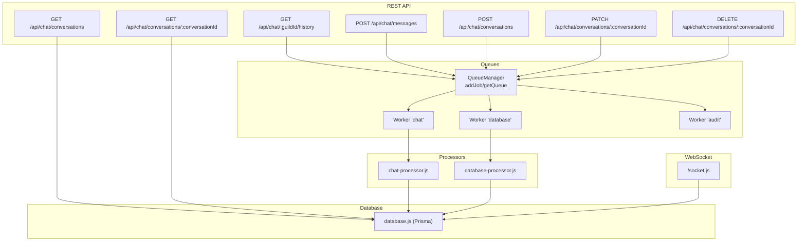
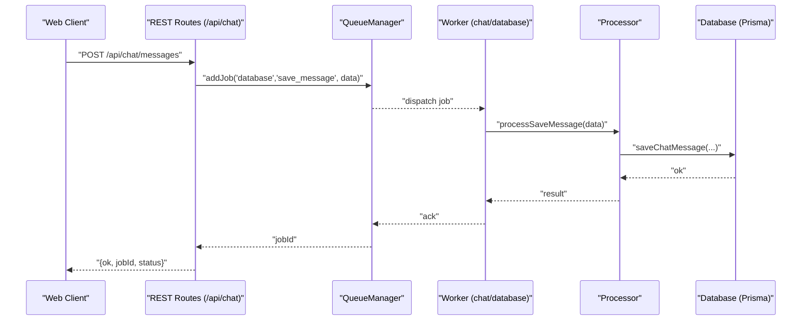
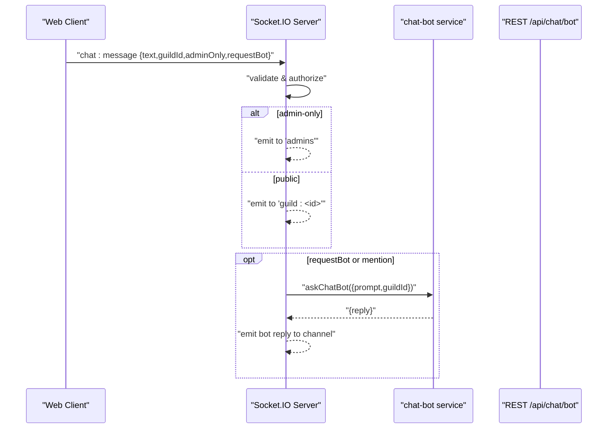
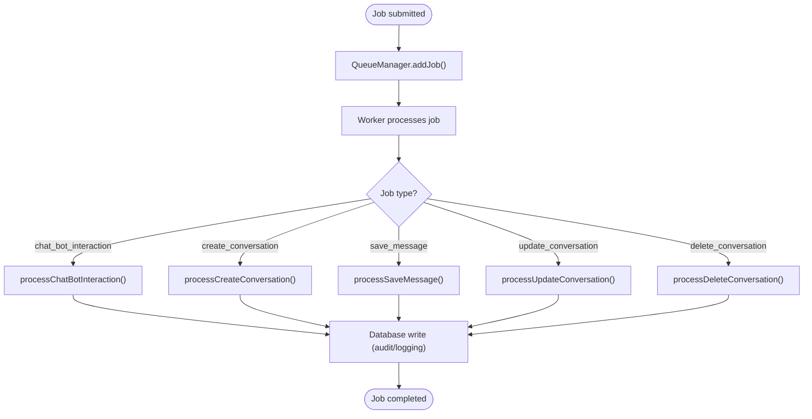
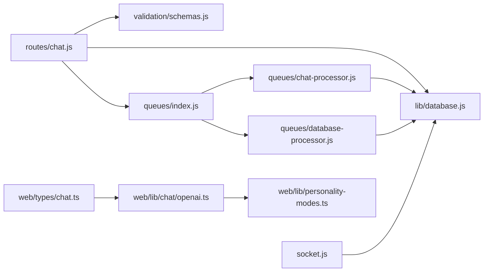

# Chat Service Endpoints

<cite>
**Referenced Files in This Document**
- [chat.js](file://apps/admin-api/src/routes/chat.js)
- [schemas.js](file://apps/admin-api/src/lib/validation/schemas.js)
- [queue-manager.js](file://apps/admin-api/src/lib/queues/index.js)
- [chat-processor.js](file://apps/admin-api/src/lib/queues/chat-processor.js)
- [database-processor.js](file://apps/admin-api/src/lib/queues/database-processor.js)
- [database.js](file://apps/admin-api/src/lib/database.js)
- [socket.js](file://apps/admin-api/src/socket.js)
- [rate-limit.js](file://apps/admin-api/src/middleware/rate-limit.js)
- [personality.js](file://apps/admin-api/src/services/personality.js)
- [chat.ts](file://apps/web/types/chat.ts)
- [openai.ts](file://apps/web/lib/chat/openai.ts)
- [personality-modes.ts](file://apps/web/lib/personality-modes.ts)
- [storage.ts](file://apps/web/lib/chat/storage.ts)
</cite>

## Table of Contents
1. [Introduction](#introduction)
2. [Project Structure](#project-structure)
3. [Core Components](#core-components)
4. [Architecture Overview](#architecture-overview)
5. [Detailed Component Analysis](#detailed-component-analysis)
6. [Dependency Analysis](#dependency-analysis)
7. [Performance Considerations](#performance-considerations)
8. [Troubleshooting Guide](#troubleshooting-guide)
9. [Conclusion](#conclusion)
10. [Appendices](#appendices)

## Introduction
This document provides comprehensive API documentation for the chat service endpoints in the admin-api service. It covers:
- REST endpoints for chat history, message submission, and conversation management
- Real-time WebSocket communication for live chat
- Job queuing system for asynchronous processing
- Validation and rate limiting policies
- Moderation and access control rules
- Personality mode feature and its impact on message processing
- Example request/response schemas and usage patterns for integration with the web application’s chat interface

## Project Structure
The chat service spans REST routes, validation schemas, queue infrastructure, database operations, WebSocket handling, and middleware. The web application integrates with these APIs and WebSocket streams.

**Diagram sources**
- [chat.js](file://apps/admin-api/src/routes/chat.js#L256-L657)
- [queue-manager.js](file://apps/admin-api/src/lib/queues/index.js#L1-L396)
- [chat-processor.js](file://apps/admin-api/src/lib/queues/chat-processor.js#L1-L279)
- [database-processor.js](file://apps/admin-api/src/lib/queues/database-processor.js#L1-L324)
- [database.js](file://apps/admin-api/src/lib/database.js#L1-L662)
- [socket.js](file://apps/admin-api/src/socket.js#L1-L204)

**Section sources**
- [chat.js](file://apps/admin-api/src/routes/chat.js#L1-L657)
- [queue-manager.js](file://apps/admin-api/src/lib/queues/index.js#L1-L396)
- [database.js](file://apps/admin-api/src/lib/database.js#L1-L662)
- [socket.js](file://apps/admin-api/src/socket.js#L1-L204)

## Core Components
- REST chat routes: history retrieval, message submission, conversation CRUD
- WebSocket chat: real-time messaging with authorization and channel scoping
- Queue manager: Redis-backed BullMQ queues for async processing
- Processors: chat and database job processors
- Database layer: Prisma client with chat message/conversation methods
- Validation: Zod schemas for request bodies and query parameters
- Rate limiting: per-user and per-guild rate limiter
- Personality service: guild-level personality profiles

**Section sources**
- [chat.js](file://apps/admin-api/src/routes/chat.js#L256-L657)
- [socket.js](file://apps/admin-api/src/socket.js#L1-L204)
- [queue-manager.js](file://apps/admin-api/src/lib/queues/index.js#L1-L396)
- [chat-processor.js](file://apps/admin-api/src/lib/queues/chat-processor.js#L1-L279)
- [database-processor.js](file://apps/admin-api/src/lib/queues/database-processor.js#L1-L324)
- [database.js](file://apps/admin-api/src/lib/database.js#L509-L577)
- [schemas.js](file://apps/admin-api/src/lib/validation/schemas.js#L390-L414)
- [rate-limit.js](file://apps/admin-api/src/middleware/rate-limit.js#L1-L23)
- [personality.js](file://apps/admin-api/src/services/personality.js#L1-L61)

## Architecture Overview
The chat service uses a hybrid REST/WebSocket architecture:
- REST endpoints accept requests and enqueue jobs for asynchronous processing
- WebSocket handles real-time chat events with authorization and channel scoping
- Queue workers process jobs and persist data via the database layer
- Validation ensures robust input handling; rate limiting prevents abuse

**Diagram sources**
- [chat.js](file://apps/admin-api/src/routes/chat.js#L583-L637)
- [queue-manager.js](file://apps/admin-api/src/lib/queues/index.js#L206-L223)
- [database-processor.js](file://apps/admin-api/src/lib/queues/database-processor.js#L75-L114)
- [database.js](file://apps/admin-api/src/lib/database.js#L509-L525)

## Detailed Component Analysis

### REST Endpoints

#### GET /api/chat/:guildId/history
- Purpose: Retrieve chat history for a guild or admin room
- Authentication: Required
- Roles:
  - Admin room: admin-only
  - Regular guilds: must be guild member or admin; admins/club members can view all; regular members can only view non-admin-only messages
- Query parameters:
  - limit: number (default 50, max 200)
- Response:
  - ok: boolean
  - messages: array of chat messages with metadata (messageId, guildId, userId, username, from, text, adminOnly, ts)
- Errors:
  - 403: forbidden/not_in_guild
  - 503: queues_unavailable (if queues are down)
- Notes:
  - Uses database.getChatMessages with includeAdminOnly flag based on role

**Section sources**
- [chat.js](file://apps/admin-api/src/routes/chat.js#L256-L342)
- [schemas.js](file://apps/admin-api/src/lib/validation/schemas.js#L42-L44)
- [database.js](file://apps/admin-api/src/lib/database.js#L527-L548)

#### POST /api/chat/messages
- Purpose: Submit a job to add a message to a conversation
- Authentication: Required
- Request body:
  - conversationId: UUID
  - message:
    - role: "user" or "assistant"
    - content: string (max length varies by schema)
    - personalityMode: optional enum
- Response:
  - ok: boolean
  - jobId: string
  - status: "queued"
  - estimatedWaitTime: string
- Errors:
  - 503: queues_unavailable
- Notes:
  - Enqueues a "database:save_message" job with userId, role, content, personalityMode

**Section sources**
- [chat.js](file://apps/admin-api/src/routes/chat.js#L583-L637)
- [schemas.js](file://apps/admin-api/src/lib/validation/schemas.js#L64-L71)
- [queue-manager.js](file://apps/admin-api/src/lib/queues/index.js#L206-L223)
- [database-processor.js](file://apps/admin-api/src/lib/queues/database-processor.js#L75-L114)

#### Conversation Management Endpoints
- POST /api/chat/conversations
  - Purpose: Create a new conversation for the authenticated user
  - Body: title (optional), personalityMode (optional enum)
  - Response: { ok, jobId, status, estimatedWaitTime }
  - Errors: 503 if queues unavailable
- GET /api/chat/conversations
  - Purpose: List conversations for the authenticated user
  - Query: limit (default 20, max 100)
  - Response: { ok, conversations[] }
- GET /api/chat/conversations/:conversationId
  - Purpose: Retrieve a specific conversation with messages
  - Response: { ok, conversation: { id, title, personalityMode, createdAt, updatedAt, messages[] } }
  - Errors: 404 if not found or access denied
- PATCH /api/chat/conversations/:conversationId
  - Purpose: Update conversation title
  - Body: title (optional)
  - Response: { ok }
  - Errors: 404 if not found or access denied
- DELETE /api/chat/conversations/:conversationId
  - Purpose: Delete a conversation (owner only)
  - Response: { ok }
  - Errors: 404 if not found or access denied

**Section sources**
- [chat.js](file://apps/admin-api/src/routes/chat.js#L344-L581)
- [schemas.js](file://apps/admin-api/src/lib/validation/schemas.js#L51-L71)
- [database.js](file://apps/admin-api/src/lib/database.js#L551-L577)
- [database-processor.js](file://apps/admin-api/src/lib/queues/database-processor.js#L1-L194)

### WebSocket-Based Real-Time Communication

#### WebSocket Endpoint and Authorization
- Origin: configured CORS for admin domain
- Authentication: verifies JWT cookie, attaches user/session to socket
- Channel scoping:
  - Joins "guild:<id>" rooms for each guild in session
  - Admins join "admins" room
- Events:
  - "chat:message": client sends { text, guildId, messageId?, adminOnly?, requestBot? }
  - Server validates text/guildId, enforces admin-only rules, emits to appropriate audience
  - Optionally triggers bot reply if mention detected or requestBot flag set

**Diagram sources**
- [socket.js](file://apps/admin-api/src/socket.js#L38-L201)
- [chat-bot.js](file://apps/admin-api/src/services/chat-bot.js#L1-L61)

**Section sources**
- [socket.js](file://apps/admin-api/src/socket.js#L1-L204)
- [chat-bot.js](file://apps/admin-api/src/services/chat-bot.js#L1-L61)

### Job Queuing System for Message Processing
- Queue types:
  - chat: chat bot interactions and message processing
  - database: conversation and message persistence
  - audit: event logging
- Concurrency:
  - chat: 5
  - database: 10
  - audit: 2
- Retries/backoff:
  - attempts: 3
  - exponential backoff starting at 2s
- Workers dispatch jobs to processors:
  - chat: processChatBotInteraction
  - database: processCreateConversation, processSaveMessage, processUpdateConversation, processDeleteConversation
- Queue stats exposed for monitoring

**Diagram sources**
- [queue-manager.js](file://apps/admin-api/src/lib/queues/index.js#L197-L314)
- [chat-processor.js](file://apps/admin-api/src/lib/queues/chat-processor.js#L1-L120)
- [database-processor.js](file://apps/admin-api/src/lib/queues/database-processor.js#L1-L194)

**Section sources**
- [queue-manager.js](file://apps/admin-api/src/lib/queues/index.js#L1-L396)
- [chat-processor.js](file://apps/admin-api/src/lib/queues/chat-processor.js#L1-L279)
- [database-processor.js](file://apps/admin-api/src/lib/queues/database-processor.js#L1-L324)

### Validation and Request Schemas
- Zod schemas enforce:
  - Limits and defaults for query parameters (history/list)
  - Enum constraints for personality modes and roles
  - Length limits for messages and prompts
  - UUID and Discord snowflake formats
- Middleware applies validation per route

**Section sources**
- [schemas.js](file://apps/admin-api/src/lib/validation/schemas.js#L390-L414)

### Rate Limiting Policies
- Per-user and per-guild rate limiter:
  - Key generator: userId:guildId
  - Standard headers and legacy headers enabled
  - Handler returns 429 with "rate-limit" error
- Applied to tasks endpoints (including chat bot interactions)

**Section sources**
- [rate-limit.js](file://apps/admin-api/src/middleware/rate-limit.js#L1-L23)
- [chat.js](file://apps/admin-api/src/routes/chat.js#L33-L102)

### Moderation and Access Control
- Admin-only messages:
  - Only admins can mark messages as admin-only
  - History endpoint filters out admin-only messages unless user has admin role
- Guild access:
  - Non-admin users must belong to the guild to view history
  - Effective role determines visibility of admin-only messages
- CSRF protection:
  - POST endpoints use CSRF middleware

**Section sources**
- [chat.js](file://apps/admin-api/src/routes/chat.js#L279-L342)
- [socket.js](file://apps/admin-api/src/socket.js#L123-L140)

### Personality Mode Feature
- Definition:
  - Enum values: helpful, creative, professional, casual
  - Stored per conversation and message
- Impact on processing:
  - REST: messages include personalityMode in request/response
  - WebSocket: messages include personalityMode for downstream clients
  - Validation enforces enum values
- Web integration:
  - Web app defines PersonalityMode and system prompts
  - Messages include personalityMode for UI and analytics

**Section sources**
- [schemas.js](file://apps/admin-api/src/lib/validation/schemas.js#L51-L71)
- [chat.js](file://apps/admin-api/src/routes/chat.js#L344-L581)
- [chat.ts](file://apps/web/types/chat.ts#L1-L31)
- [personality-modes.ts](file://apps/web/lib/personality-modes.ts#L1-L52)

### Request/Response Schemas

#### GET /api/chat/:guildId/history
- Query parameters:
  - limit: integer (optional, default 50, max 200)
- Response:
  - ok: boolean
  - messages: array of objects with fields:
    - messageId, guildId, userId, username, from{id,name,role,color}, text, adminOnly, ts

**Section sources**
- [schemas.js](file://apps/admin-api/src/lib/validation/schemas.js#L42-L44)
- [chat.js](file://apps/admin-api/src/routes/chat.js#L279-L342)

#### POST /api/chat/messages
- Request body:
  - conversationId: UUID
  - message:
    - role: "user" or "assistant"
    - content: string
    - personalityMode: enum (optional)
- Response:
  - ok: boolean
  - jobId: string
  - status: "queued"
  - estimatedWaitTime: string

**Section sources**
- [schemas.js](file://apps/admin-api/src/lib/validation/schemas.js#L64-L71)
- [chat.js](file://apps/admin-api/src/routes/chat.js#L583-L637)

#### Conversation Management
- POST /api/chat/conversations
  - Request body: { title: string, personalityMode: enum }
  - Response: { ok, jobId, status, estimatedWaitTime }
- GET /api/chat/conversations
  - Query: { limit: integer }
  - Response: { ok, conversations: array of { id, title, personalityMode, createdAt, updatedAt, messageCount } }
- GET /api/chat/conversations/:conversationId
  - Response: { ok, conversation: { id, title, personalityMode, createdAt, updatedAt, messages: array of { id, role, content, personalityMode, createdAt } } }
- PATCH /api/chat/conversations/:conversationId
  - Request body: { title: string }
  - Response: { ok }
- DELETE /api/chat/conversations/:conversationId
  - Response: { ok }

**Section sources**
- [schemas.js](file://apps/admin-api/src/lib/validation/schemas.js#L51-L71)
- [chat.js](file://apps/admin-api/src/routes/chat.js#L344-L581)

#### WebSocket Messages
- Client to server:
  - { text: string, guildId: string, messageId?: string, adminOnly?: boolean, requestBot?: boolean }
- Server to client:
  - Emitted "chat:message" with fields:
    - from{id,name,role,color}
    - text: string
    - guildId: string
    - messageId: string
    - adminOnly: boolean
    - ts: ISO timestamp

**Section sources**
- [socket.js](file://apps/admin-api/src/socket.js#L100-L199)

### Usage Examples and Integration Patterns

#### REST Integration (web application)
- Save a message to a conversation:
  - POST /api/chat/messages with { conversationId, message: { role, content, personalityMode } }
  - Poll /api/chat/jobs/:jobId until completed to retrieve results
- Create a conversation:
  - POST /api/chat/conversations with { title, personalityMode }
  - Use jobId to track creation
- List and retrieve conversations:
  - GET /api/chat/conversations?limit=N
  - GET /api/chat/conversations/:conversationId

**Section sources**
- [chat.js](file://apps/admin-api/src/routes/chat.js#L344-L581)
- [storage.ts](file://apps/web/lib/chat/storage.ts#L53-L101)

#### WebSocket Integration (real-time chat)
- Connect to WebSocket with JWT cookie
- Join guild rooms automatically based on session
- Send "chat:message" to broadcast or admin-only rooms
- Receive "chat:message" events for live updates

**Section sources**
- [socket.js](file://apps/admin-api/src/socket.js#L38-L201)

## Dependency Analysis

**Diagram sources**
- [chat.js](file://apps/admin-api/src/routes/chat.js#L1-L657)
- [schemas.js](file://apps/admin-api/src/lib/validation/schemas.js#L390-L414)
- [queue-manager.js](file://apps/admin-api/src/lib/queues/index.js#L1-L396)
- [chat-processor.js](file://apps/admin-api/src/lib/queues/chat-processor.js#L1-L279)
- [database-processor.js](file://apps/admin-api/src/lib/queues/database-processor.js#L1-L324)
- [database.js](file://apps/admin-api/src/lib/database.js#L1-L662)
- [socket.js](file://apps/admin-api/src/socket.js#L1-L204)
- [chat.ts](file://apps/web/types/chat.ts#L1-L31)
- [openai.ts](file://apps/web/lib/chat/openai.ts#L1-L100)
- [personality-modes.ts](file://apps/web/lib/personality-modes.ts#L1-L52)

**Section sources**
- [chat.js](file://apps/admin-api/src/routes/chat.js#L1-L657)
- [queue-manager.js](file://apps/admin-api/src/lib/queues/index.js#L1-L396)
- [database.js](file://apps/admin-api/src/lib/database.js#L1-L662)
- [socket.js](file://apps/admin-api/src/socket.js#L1-L204)
- [chat.ts](file://apps/web/types/chat.ts#L1-L31)
- [openai.ts](file://apps/web/lib/chat/openai.ts#L1-L100)
- [personality-modes.ts](file://apps/web/lib/personality-modes.ts#L1-L52)

## Performance Considerations
- Queue concurrency:
  - database queue uses higher concurrency (10) to handle frequent message saves
  - chat queue uses moderate concurrency (5) for bot interactions
- Backoff and retries:
  - Exponential backoff reduces thundering herd on failures
- Database limits:
  - History retrieval caps at 200 messages per request
  - Conversation listing caps at 100 per request
- WebSocket:
  - Minimal validation in socket handler; rely on REST endpoints for strict validation
- Metrics:
  - Queue and database operations are instrumented for monitoring

[No sources needed since this section provides general guidance]

## Troubleshooting Guide
- 403 Forbidden:
  - Admin-only room access requires admin role
  - Non-admin users must be part of the guild to view history
- 404 Not Found:
  - Conversation not found or access denied
- 429 Too Many Requests:
  - Rate limiter engaged; reduce request frequency
- 503 Service Unavailable:
  - Queue infrastructure not initialized
- Bot reply errors:
  - WebSocket emits error message when OpenAI is unreachable
- Validation errors:
  - Zod validation returns structured details for invalid fields

**Section sources**
- [chat.js](file://apps/admin-api/src/routes/chat.js#L279-L342)
- [rate-limit.js](file://apps/admin-api/src/middleware/rate-limit.js#L1-L23)
- [socket.js](file://apps/admin-api/src/socket.js#L159-L199)
- [schemas.js](file://apps/admin-api/src/lib/validation/schemas.js#L352-L386)

## Conclusion
The chat service provides a robust, scalable architecture combining REST APIs, WebSocket real-time messaging, and asynchronous job processing. Validation, rate limiting, and moderation controls ensure secure and reliable operation. Personality modes enhance user experience while maintaining consistent processing across REST and WebSocket pathways.

[No sources needed since this section summarizes without analyzing specific files]

## Appendices

### Appendix A: Personality Modes Reference
- REST enums: helpful, creative, professional, casual
- Web app modes: helpful, sarcastic, professional, creative, technical
- Both align on helpful, creative, professional; web adds sarcastic and technical

**Section sources**
- [schemas.js](file://apps/admin-api/src/lib/validation/schemas.js#L51-L71)
- [personality-modes.ts](file://apps/web/lib/personality-modes.ts#L1-L52)