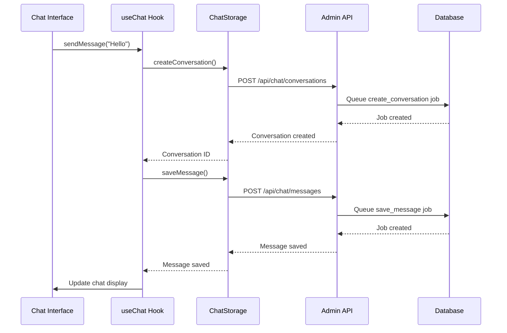
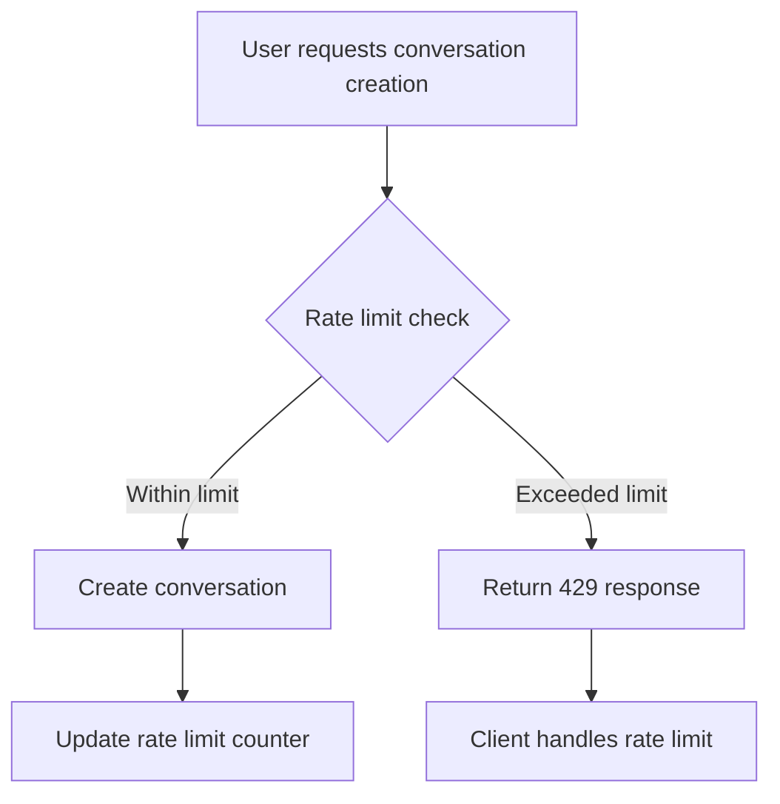
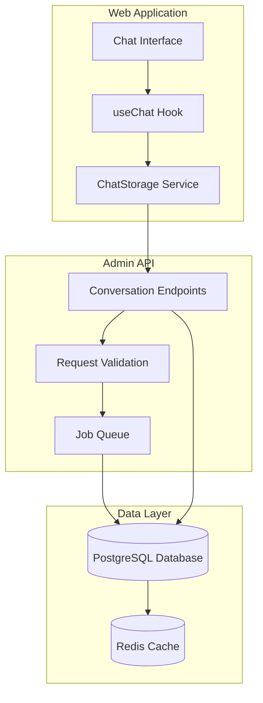

# Conversation Management

<cite>
**Referenced Files in This Document**   
- [chat.js](file://apps/admin-api/src/routes/chat.js)
- [route.ts](file://apps/web/app/api/chat/conversations/route.ts)
- [storage.ts](file://apps/web/lib/chat/storage.ts)
- [use-chat.ts](file://apps/web/hooks/use-chat.ts)
- [schemas.js](file://apps/admin-api/src/lib/validation/schemas.js)
- [database.js](file://apps/admin-api/src/lib/database.js)
- [rate-limiter.ts](file://apps/web/lib/rate-limiter.ts)
- [chat-interface.tsx](file://apps/web/components/chat/chat-interface.tsx)
</cite>

## Table of Contents
1. [Introduction](#introduction)
2. [API Endpoints](#api-endpoints)
3. [Request/Response Schemas](#requestresponse-schemas)
4. [Web Application Integration](#web-application-integration)
5. [Error Handling](#error-handling)
6. [Rate Limiting](#rate-limiting)
7. [Usage Examples](#usage-examples)
8. [Architecture Overview](#architecture-overview)

## Introduction
The conversation management system provides a comprehensive API for managing chat conversations within the Slimy.ai platform. This documentation details the endpoints for creating, listing, retrieving, and deleting conversations, along with their integration with the web application's chat interface. The system supports conversation persistence, role-based access control, and soft-delete semantics for conversation archival.

The conversation management functionality is implemented across multiple layers of the application architecture, with API endpoints in the admin-api service, client-side integration in the web application, and shared validation and storage logic. Conversations are stored in a PostgreSQL database using Prisma ORM, with asynchronous job processing for database operations.

**Section sources**
- [chat.js](file://apps/admin-api/src/routes/chat.js#L344-L537)
- [route.ts](file://apps/web/app/api/chat/conversations/route.ts#L7-L70)

## API Endpoints

### GET /api/chat/conversations
Retrieves a list of conversations accessible to the authenticated user with optional pagination support.

**Parameters**
- `limit` (query, optional): Maximum number of conversations to return (default: 20, maximum: 100)

**Authentication**: Required
**Authorization**: Users can only access their own conversations unless they have admin role

**Section sources**
- [chat.js](file://apps/admin-api/src/routes/chat.js#L396-L439)
- [route.ts](file://apps/web/app/api/chat/conversations/route.ts#L8-L35)

### POST /api/chat/conversations
Creates a new conversation for the authenticated user with initial metadata configuration.

**Request Body**
- `title` (string, optional): Conversation title
- `personalityMode` (string, optional): Personality mode for the conversation (default: "helpful")

**Authentication**: Required
**Authorization**: Users can only create conversations for themselves unless they have admin role

**Section sources**
- [chat.js](file://apps/admin-api/src/routes/chat.js#L344-L394)
- [route.ts](file://apps/web/app/api/chat/conversations/route.ts#L38-L69)

### GET /api/chat/conversations/:id
Retrieves detailed information about a specific conversation, including all messages.

**Path Parameters**
- `conversationId` (string): The unique identifier of the conversation

**Authentication**: Required
**Authorization**: Users can only access conversations they own

**Section sources**
- [chat.js](file://apps/admin-api/src/routes/chat.js#L441-L497)
- [storage.ts](file://apps/web/lib/chat/storage.ts#L103-L147)

### DELETE /api/chat/conversations/:id
Archives a conversation using soft-delete semantics. Only the conversation owner can delete their conversations.

**Path Parameters**
- `conversationId` (string): The unique identifier of the conversation to delete

**Authentication**: Required
**Authorization**: Users can only delete conversations they own

**Section sources**
- [chat.js](file://apps/admin-api/src/routes/chat.js#L499-L537)
- [storage.ts](file://apps/web/lib/chat/storage.ts#L151-L158)

## Request/Response Schemas

### Conversation Creation Request
```json
{
  "title": "string (optional)",
  "personalityMode": "string (optional, default: 'helpful')"
}
```

### Conversation Response
```json
{
  "ok": true,
  "conversations": [
    {
      "id": "string",
      "title": "string | null",
      "personalityMode": "string",
      "createdAt": "string (ISO 8601)",
      "updatedAt": "string (ISO 8601)",
      "messageCount": "number"
    }
  ]
}
```

### Conversation Detail Response
```json
{
  "ok": true,
  "conversation": {
    "id": "string",
    "title": "string | null",
    "personalityMode": "string",
    "createdAt": "string (ISO 8601)",
    "updatedAt": "string (ISO 8601)",
    "messages": [
      {
        "id": "string",
        "role": "user | assistant",
        "content": "string",
        "personalityMode": "string",
        "createdAt": "string (ISO 8601)"
      }
    ]
  }
}
```

**Section sources**
- [schemas.js](file://apps/admin-api/src/lib/validation/schemas.js#L51-L54)
- [storage.ts](file://apps/web/lib/chat/storage.ts#L5-L21)
- [database.js](file://apps/admin-api/src/lib/database.js#L550-L577)

## Web Application Integration

### Chat Interface Component
The web application's chat interface integrates with the conversation management API through the `useChat` hook and `ChatStorage` service. The interface provides:

- Conversation creation with automatic title generation from the first message
- Loading and displaying existing conversations
- Message persistence to conversations
- Conversation deletion with UI feedback



**Diagram sources**
- [use-chat.ts](file://apps/web/hooks/use-chat.ts#L47-L248)
- [chat-interface.tsx](file://apps/web/components/chat/chat-interface.tsx#L12-L96)
- [storage.ts](file://apps/web/lib/chat/storage.ts#L39-L54)

### Conversation Lifecycle Management
The web application manages the conversation lifecycle through the following workflow:

1. When a user sends their first message, a new conversation is automatically created
2. The conversation title is generated from the first message content
3. All messages are persisted to the conversation in the database
4. Users can load previous conversations from the conversation list
5. Conversations can be deleted, which archives them with soft-delete semantics

**Section sources**
- [use-chat.ts](file://apps/web/hooks/use-chat.ts#L56-L70)
- [storage.ts](file://apps/web/lib/chat/storage.ts#L186-L219)

## Error Handling

### Unauthorized Access
Attempts to access conversations without proper authorization result in 403 Forbidden responses. Users can only access their own conversations unless they have admin privileges.

```json
{
  "error": "Access denied"
}
```

### Resource Not Found
When attempting to access a conversation that doesn't exist or that the user doesn't have permission to access, the API returns a 404 Not Found response.

```json
{
  "error": "conversation_not_found"
}
```

### Validation Errors
Invalid request parameters or body content result in 400 Bad Request responses with detailed validation error information.

```json
{
  "error": "Validation failed",
  "details": [
    {
      "field": "title",
      "message": "Title too long (max 200 characters)"
    }
  ]
}
```

**Section sources**
- [chat.js](file://apps/admin-api/src/routes/chat.js#L462-L473)
- [schemas.js](file://apps/admin-api/src/lib/validation/schemas.js#L373-L380)
- [route.ts](file://apps/web/app/api/chat/conversations/route.ts#L16-L20)

## Rate Limiting
The conversation creation endpoint is subject to rate limiting to prevent abuse. The rate limiting is implemented using a file-backed rate limiter that tracks requests by user ID.

- **Limit**: 5 conversation creation requests per hour per user
- **Window**: 1 hour (3600000 milliseconds)
- **Storage**: File system in the data/rate-limits directory

When the rate limit is exceeded, the API returns a 429 Too Many Requests response.



**Diagram sources**
- [rate-limiter.ts](file://apps/web/lib/rate-limiter.ts#L23-L67)
- [chat.js](file://apps/admin-api/src/routes/chat.js#L368-L372)

## Usage Examples

### Starting a New Conversation
```javascript
// Create a new conversation with a custom title and personality mode
const response = await fetch('/api/chat/conversations', {
  method: 'POST',
  headers: {
    'Content-Type': 'application/json',
  },
  body: JSON.stringify({
    title: 'Project Brainstorming',
    personalityMode: 'creative'
  })
});

const { conversationId } = await response.json();
console.log(`Created conversation: ${conversationId}`);
```

### Resuming a Previous Conversation
```javascript
// List all conversations for the user
const response = await fetch('/api/chat/conversations?limit=10');
const { conversations } = await response.json();

// Load the most recent conversation
const latest = conversations[0];
const detailResponse = await fetch(`/api/chat/conversations/${latest.id}`);
const { conversation } = await detailResponse.json();

console.log(`Loaded conversation: ${conversation.title}`);
console.log(`Messages: ${conversation.messages.length}`);
```

### Deleting a Conversation
```javascript
// Delete a conversation by ID
const conversationId = 'abc123-xyz456';
const response = await fetch(`/api/chat/conversations/${conversationId}`, {
  method: 'DELETE'
});

if (response.ok) {
  console.log('Conversation archived successfully');
} else {
  console.error('Failed to archive conversation');
}
```

**Section sources**
- [use-chat.ts](file://apps/web/hooks/use-chat.ts#L56-L70)
- [storage.ts](file://apps/web/lib/chat/storage.ts#L39-L54)
- [chat.js](file://apps/admin-api/src/routes/chat.js#L344-L537)

## Architecture Overview



The conversation management system follows a layered architecture with clear separation of concerns. The web application handles user interaction through the chat interface component, which uses the `useChat` hook to manage state and the `ChatStorage` service to communicate with the backend API. The admin-api service exposes REST endpoints that validate requests, process them through a job queue for database operations, and persist data to PostgreSQL. This architecture ensures reliable conversation management with proper error handling and scalability.

**Diagram sources**
- [chat.js](file://apps/admin-api/src/routes/chat.js)
- [storage.ts](file://apps/web/lib/chat/storage.ts)
- [database.js](file://apps/admin-api/src/lib/database.js)
- [use-chat.ts](file://apps/web/hooks/use-chat.ts)