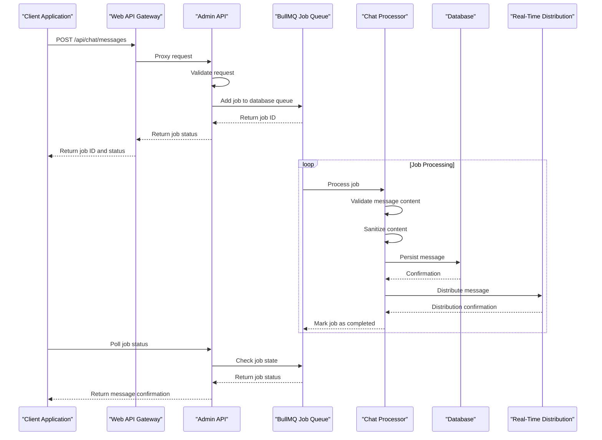
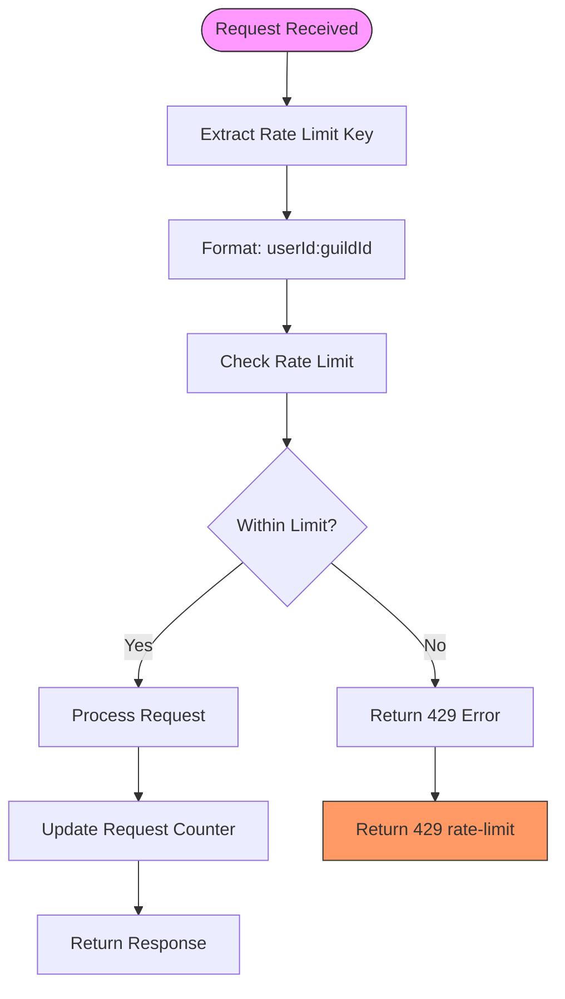
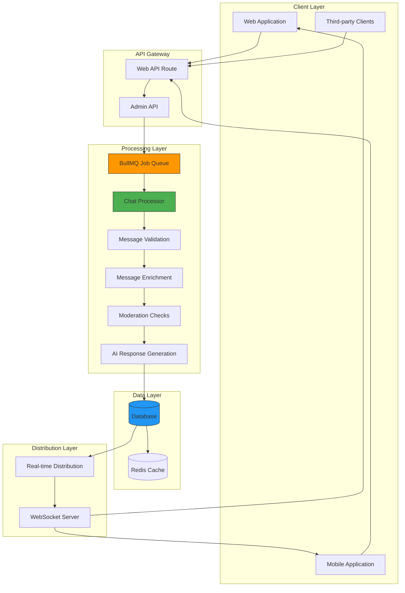

# Message Operations

<cite>
**Referenced Files in This Document**   
- [chat.js](file://apps/admin-api/src/routes/chat.js)
- [route.ts](file://apps/web/app/api/chat/messages/route.ts)
- [chat-processor.js](file://apps/admin-api/src/lib/queues/chat-processor.js)
- [rate-limit.js](file://apps/admin-api/src/middleware/rate-limit.js)
- [chat-bot.js](file://apps/admin-api/src/services/chat-bot.js)
- [storage.ts](file://apps/web/lib/chat/storage.ts)
- [schemas.js](file://apps/admin-api/src/lib/validation/schemas.js)
- [database.js](file://apps/admin-api/src/lib/database.js)
- [index.js](file://apps/admin-api/src/lib/queues/index.js)
</cite>

## Table of Contents
1. [Introduction](#introduction)
2. [API Endpoints](#api-endpoints)
3. [Message Processing Pipeline](#message-processing-pipeline)
4. [Request/Response Schemas](#requestresponse-schemas)
5. [Rate Limiting Implementation](#rate-limiting-implementation)
6. [Error Handling](#error-handling)
7. [Architecture Overview](#architecture-overview)

## Introduction
This document provides comprehensive documentation for the message operations in the chat service, focusing on the retrieval and submission of messages within conversations. The system implements a robust message handling infrastructure with asynchronous processing, validation, and real-time capabilities. The API supports both direct message operations and chat bot interactions, with comprehensive validation and security measures in place.

## API Endpoints

### GET /api/chat/messages
Retrieves message history within a conversation with support for pagination and filtering.

**Query Parameters**
- `limit`: number (optional) - Maximum number of messages to return (default: 50, max: 200)
- `offset`: number (optional) - Number of messages to skip for pagination
- `since`: string (optional) - ISO 8601 timestamp to filter messages created after this time
- `search`: string (optional) - Text to search for within message content

**Path Parameters**
- `conversationId`: string - UUID identifying the conversation

**Authentication Requirements**
- Requires authentication via JWT token
- User must be the owner of the conversation or have admin privileges

**Response**
Returns a JSON object with:
- `ok`: boolean - Success status
- `messages`: array - List of message objects with sender metadata, content, and timestamps
- `pagination`: object - Contains limit, offset, and total count information

**Section sources**
- [chat.js](file://apps/admin-api/src/routes/chat.js#L441-L497)
- [route.ts](file://apps/web/app/api/chat/messages/route.ts#L8-L38)

### POST /api/chat/messages
Submits a new message to a conversation with comprehensive validation.

**Request Body**
```json
{
  "conversationId": "uuid",
  "message": {
    "role": "user|assistant",
    "content": "string",
    "personalityMode": "helpful|creative|professional|casual"
  }
}
```

**Validation Rules**
- Content length must be between 1 and 4000 characters
- Role must be either "user" or "assistant"
- Conversation ID must be a valid UUID
- Content is scanned for potentially unsafe patterns (script tags, javascript: URLs, etc.)
- Maximum message size limit of 10,000 characters enforced

**Authentication Requirements**
- Requires authentication via JWT token
- CSRF protection is enforced
- User must have appropriate role permissions

**Response**
Returns a JSON object with:
- `ok`: boolean - Success status
- `jobId`: string - Identifier for the asynchronous processing job
- `status`: string - Initial job status ("queued")
- `estimatedWaitTime`: string - Human-readable estimate of processing time

**Section sources**
- [chat.js](file://apps/admin-api/src/routes/chat.js#L583-L637)
- [route.ts](file://apps/web/app/api/chat/messages/route.ts#L41-L74)
- [schemas.js](file://apps/admin-api/src/lib/validation/schemas.js#L64-L71)

## Message Processing Pipeline

The message processing pipeline follows an asynchronous architecture using BullMQ job queues to ensure reliable message handling and system responsiveness.



**Diagram sources**
- [chat.js](file://apps/admin-api/src/routes/chat.js#L583-L637)
- [chat-processor.js](file://apps/admin-api/src/lib/queues/chat-processor.js#L150-L206)
- [index.js](file://apps/admin-api/src/lib/queues/index.js)

**Section sources**
- [chat.js](file://apps/admin-api/src/routes/chat.js)
- [chat-processor.js](file://apps/admin-api/src/lib/queues/chat-processor.js)

## Request/Response Schemas

### Message Payload Schema
The message payload follows a structured format with metadata for proper rendering and processing.

**Request Schema**
```json
{
  "conversationId": "uuid",
  "message": {
    "role": "user|assistant",
    "content": "string",
    "personalityMode": "helpful|creative|professional|casual"
  }
}
```

**Response Schema**
```json
{
  "ok": true,
  "jobId": "string",
  "status": "queued|active|completed|failed",
  "estimatedWaitTime": "string"
}
```

**Message Object Structure**
- `id`: string - Unique message identifier
- `role`: string - Sender role ("user" or "assistant")
- `content`: string - Message text content
- `personalityMode`: string - Personality mode used for AI responses
- `createdAt`: string - ISO 8601 timestamp of message creation
- `sender`: object - Sender metadata including user ID, name, and role

**Validation Constraints**
- Content: 1-4000 characters, trimmed whitespace
- Role: Must be "user" or "assistant"
- Personality mode: Must be one of the defined modes
- Conversation ID: Valid UUID format

**Section sources**
- [schemas.js](file://apps/admin-api/src/lib/validation/schemas.js#L64-L71)
- [storage.ts](file://apps/web/lib/chat/storage.ts#L1-L224)

## Rate Limiting Implementation

The system implements rate limiting to prevent spam and abuse of the message endpoints.



**Configuration**
- Window: 15 minutes (900,000 ms)
- Maximum requests: 100 per window per user-guild pair
- Key generator: Combines user ID and guild ID for granular control
- Headers: Standard rate limit headers included in responses

**Implementation Details**
The rate limiting is implemented using express-rate-limit middleware with a custom key generator that combines the user ID and guild ID to create a composite key. This allows for fine-grained control over message submission rates while preventing abuse.

**Section sources**
- [rate-limit.js](file://apps/admin-api/src/middleware/rate-limit.js)
- [chat.js](file://apps/admin-api/src/routes/chat.js#L30)

## Error Handling

The system implements comprehensive error handling for invalid message content and unauthorized access attempts.

**Common Error Types**
- `400 Bad Request`: Validation failures, missing required fields
- `401 Unauthorized`: Missing or invalid authentication
- `403 Forbidden`: Insufficient permissions for requested operation
- `404 Not Found`: Resource not found (conversation, user, etc.)
- `429 Too Many Requests`: Rate limit exceeded
- `500 Internal Server Error`: Unexpected server errors
- `503 Service Unavailable`: Queues or dependencies unavailable

**Validation Error Response**
```json
{
  "error": "Validation failed",
  "details": [
    {
      "field": "message.content",
      "message": "Message too long"
    }
  ]
}
```

**Security Measures**
- Input sanitization to prevent XSS attacks
- Content scanning for malicious patterns
- Strict role-based access control
- CSRF protection for state-changing operations
- Comprehensive input validation using Zod schemas

**Section sources**
- [chat.js](file://apps/admin-api/src/routes/chat.js)
- [schemas.js](file://apps/admin-api/src/lib/validation/schemas.js)
- [chat-processor.js](file://apps/admin-api/src/lib/queues/chat-processor.js)

## Architecture Overview

The message operations architecture follows a microservices-inspired pattern with clear separation of concerns between API endpoints, processing logic, and data persistence.



**Diagram sources**
- [chat.js](file://apps/admin-api/src/routes/chat.js)
- [chat-processor.js](file://apps/admin-api/src/lib/queues/chat-processor.js)
- [database.js](file://apps/admin-api/src/lib/database.js)
- [index.js](file://apps/admin-api/src/lib/queues/index.js)

**Section sources**
- [chat.js](file://apps/admin-api/src/routes/chat.js)
- [chat-processor.js](file://apps/admin-api/src/lib/queues/chat-processor.js)
- [database.js](file://apps/admin-api/src/lib/database.js)