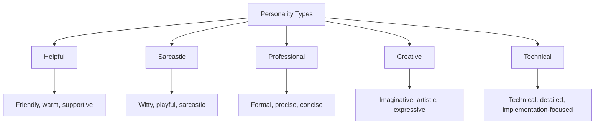
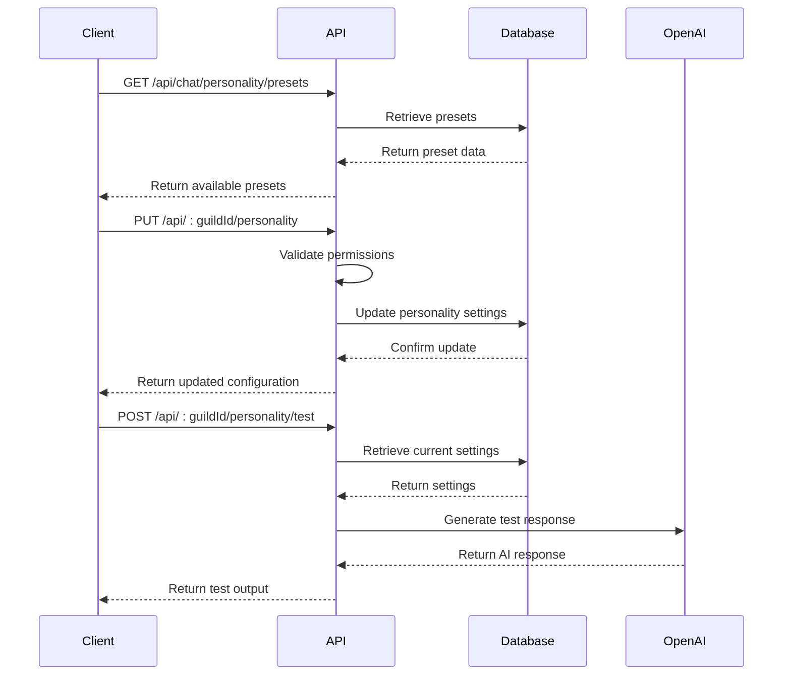
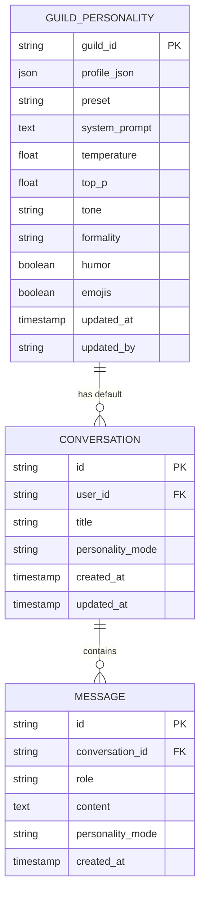
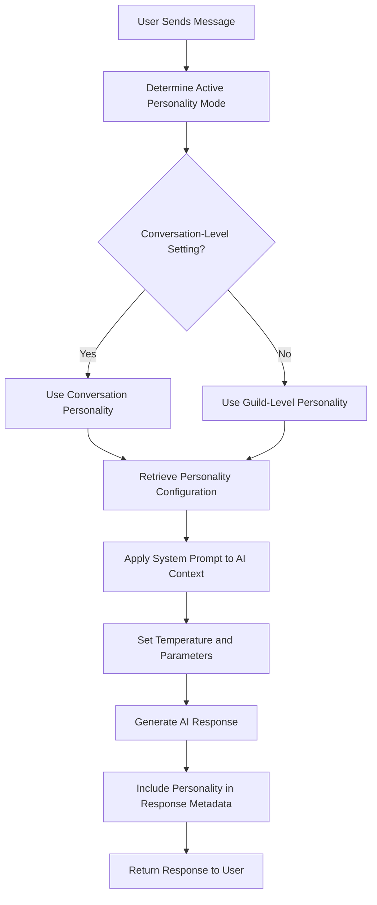

# Personality Mode Integration

<cite>
**Referenced Files in This Document**   
- [personality-modes.ts](file://apps/web/lib/personality-modes.ts)
- [chat.js](file://apps/admin-api/src/routes/chat.js)
- [storage.ts](file://apps/web/lib/chat/storage.ts)
- [openai.ts](file://apps/web/lib/chat/openai.ts)
- [personality.js](file://apps/admin-api/src/routes/personality.js)
- [guild-personality.js](file://apps/admin-api/lib/guild-personality.js)
- [guild-personality.sql](file://apps/admin-api/lib/guild-personality.sql)
- [personality-selector.tsx](file://apps/web/components/chat/personality-selector.tsx)
</cite>

## Table of Contents
1. [Introduction](#introduction)
2. [Personality Configuration Levels](#personality-configuration-levels)
3. [Available Personality Types](#available-personality-types)
4. [API Endpoints](#api-endpoints)
5. [Data Structure](#data-structure)
6. [Integration with Message Processing](#integration-with-message-processing)
7. [Permission Requirements](#permission-requirements)
8. [Audit Logging](#audit-logging)
9. [Performance and Caching](#performance-and-caching)
10. [User Experience Examples](#user-experience-examples)

## Introduction
The personality mode feature in the chat service allows users to customize the behavior and tone of AI responses at both guild and conversation levels. This documentation details the configuration, implementation, and integration of personality modes, providing comprehensive information for developers and administrators. The system enables dynamic adjustment of AI response characteristics, including tone, formality, and creativity, to suit different contexts and user preferences.

## Personality Configuration Levels
Personality modes can be configured at two distinct levels: guild-level and conversation-level. The guild-level configuration establishes default personality settings for all conversations within a guild, while conversation-level settings allow for specific overrides in individual conversations.

Guild-level personality settings are managed through the admin API and stored in the database, with configurations applied across all conversations in the guild unless specifically overridden. Conversation-level settings take precedence over guild-level configurations, allowing users to customize the AI's behavior for specific discussions.

The configuration hierarchy follows a cascading model where conversation-specific settings override guild defaults. This allows for consistent baseline behavior across a guild while maintaining flexibility for individual conversations. The system also supports preset personalities that can be applied at either level.

**Section sources**
- [personality.js](file://apps/admin-api/src/routes/personality.js#L1-L165)
- [guild-personality.js](file://apps/admin-api/lib/guild-personality.js#L1-L21)
- [guild-personality.sql](file://apps/admin-api/lib/guild-personality.sql#L1-L11)

## Available Personality Types
The system provides five distinct personality types, each with unique behavioral characteristics and response styles. These personalities are defined in the client-side configuration and determine the AI's tone, language style, and interaction approach.

The available personality modes are:
- **Helpful**: Friendly and informative assistant with warm, encouraging responses
- **Sarcastic**: Witty with playful sarcasm and clever remarks
- **Professional**: Formal business communication with precise, concise language
- **Creative**: Imaginative and expressive with vivid language and innovative solutions
- **Technical**: Developer-focused with detailed technical explanations and code examples

Each personality type includes specific configuration parameters that influence the AI's behavior, including system prompts, temperature settings, and visual indicators. The system prompts define the AI's role and response guidelines, while temperature values control the randomness and creativity of responses.

**Diagram sources**
- [personality-modes.ts](file://apps/web/lib/personality-modes.ts#L1-L52)

**Section sources**
- [personality-modes.ts](file://apps/web/lib/personality-modes.ts#L1-L52)

## API Endpoints
The personality mode feature is managed through a comprehensive set of API endpoints that handle configuration retrieval, updates, and testing. These endpoints follow REST principles and provide secure access to personality settings with appropriate authentication and authorization.

The primary API endpoints include:
- **GET /api/chat/personality/presets**: Retrieves available personality presets with their metadata
- **GET /api/:guildId/personality**: Retrieves the current personality configuration for a guild
- **PUT /api/:guildId/personality**: Updates the personality configuration for a guild
- **POST /api/:guildId/personality/reset**: Resets personality settings to default or specific preset
- **POST /api/:guildId/personality/test**: Tests the current personality configuration by generating a sample response

For conversation-level personality management, the system uses:
- **POST /api/chat/conversations**: Creates a new conversation with specified personality mode
- **GET /api/chat/conversations**: Lists all conversations with their personality settings
- **GET /api/chat/conversations/:id**: Retrieves a specific conversation including its personality mode

These endpoints are protected by authentication and role-based access control, ensuring that only authorized users can modify personality settings. The API also includes CSRF protection for write operations and caching for read operations to improve performance.

**Diagram sources**
- [personality.js](file://apps/admin-api/src/routes/personality.js#L1-L165)
- [chat.js](file://apps/admin-api/src/routes/chat.js#L1-L657)

**Section sources**
- [personality.js](file://apps/admin-api/src/routes/personality.js#L1-L165)
- [chat.js](file://apps/admin-api/src/routes/chat.js#L1-L657)

## Data Structure
The personality mode system uses a well-defined data structure to store and manage configuration settings. The data model includes both client-side definitions and server-side storage with corresponding database schema.

The client-side personality configuration is defined by the `PersonalityConfig` interface, which includes:
- **name**: Display name of the personality mode
- **description**: Brief description of the personality characteristics
- **systemPrompt**: System-level prompt that guides AI behavior
- **temperature**: Value controlling response randomness (0.0-1.0)
- **icon**: Visual indicator for the personality mode

On the server side, the database schema for guild personality settings includes:
- **preset**: Reference to predefined personality templates
- **system_prompt**: Custom system prompt for the guild
- **temperature**: Response creativity parameter
- **top_p**: Nucleus sampling parameter for response generation
- **tone**: Emotional tone of responses (neutral, friendly, playful, serious)
- **formality**: Formality level (casual, neutral, formal)
- **humor**: Boolean flag enabling humor in responses
- **emojis**: Boolean flag allowing emoji usage

Conversation-level personality settings are stored as part of the conversation record, with the personality mode specified as an enum field. Message records can also include optional personality mode information to track which mode was used for specific responses.

**Diagram sources**
- [personality-modes.ts](file://apps/web/lib/personality-modes.ts#L1-L52)
- [guild-personality.sql](file://apps/admin-api/lib/guild-personality.sql#L1-L11)
- [storage.ts](file://apps/web/lib/chat/storage.ts#L1-L224)

**Section sources**
- [personality-modes.ts](file://apps/web/lib/personality-modes.ts#L1-L52)
- [guild-personality.sql](file://apps/admin-api/lib/guild-personality.sql#L1-L11)
- [storage.ts](file://apps/web/lib/chat/storage.ts#L1-L224)

## Integration with Message Processing
The personality mode system is tightly integrated with the message processing pipeline, where mode selection directly influences AI response generation and bot behavior. When a user submits a message, the system retrieves the appropriate personality configuration based on the current context and applies it to the AI interaction.

The message processing flow begins with determining the active personality mode by checking the conversation-level setting, falling back to guild-level configuration if no conversation-specific setting exists. The system then retrieves the corresponding personality configuration, including the system prompt and temperature settings.

During AI response generation, the system prompt from the selected personality mode is included as the first message in the conversation context sent to the AI service. This system prompt guides the AI's behavior, tone, and response style throughout the interaction. The temperature setting from the personality configuration is applied to control the randomness and creativity of the AI's responses.

The integration also supports real-time personality switching within conversations. When a user changes the personality mode, subsequent messages will use the new configuration while preserving the conversation history. This allows for dynamic adjustment of the AI's behavior during ongoing discussions.

**Diagram sources**
- [openai.ts](file://apps/web/lib/chat/openai.ts#L1-L100)
- [storage.ts](file://apps/web/lib/chat/storage.ts#L1-L224)

**Section sources**
- [openai.ts](file://apps/web/lib/chat/openai.ts#L1-L100)
- [storage.ts](file://apps/web/lib/chat/storage.ts#L1-L224)

## Permission Requirements
The personality mode system implements role-based access control to ensure appropriate permissions for configuration changes. Different levels of access are required for various operations, with administrative privileges needed for guild-level changes and more permissive access for conversation-level settings.

For guild-level personality configuration, users must have administrative privileges within the guild. The system verifies both guild membership and role permissions before allowing modifications to guild-wide personality settings. This prevents unauthorized users from altering the default behavior for all members of a guild.

Conversation-level personality settings have more flexible permissions, allowing any participant in the conversation to modify the personality mode. This enables users to customize their individual experience without affecting others in the guild. However, the system still requires authentication to prevent anonymous changes.

The API endpoints enforce these permissions through middleware that checks user roles and ownership before processing requests. The system also implements CSRF protection for all write operations to prevent cross-site request forgery attacks. Additionally, rate limiting is applied to prevent abuse of the personality configuration endpoints.

**Section sources**
- [personality.js](file://apps/admin-api/src/routes/personality.js#L1-L165)
- [chat.js](file://apps/admin-api/src/routes/chat.js#L1-L657)

## Audit Logging
All changes to personality configurations are tracked through a comprehensive audit logging system that records configuration modifications for security and compliance purposes. The audit system captures detailed information about each configuration change, including the user responsible, timestamp, and specific changes made.

When a personality setting is modified, the system creates an audit log entry with the following information:
- **User ID**: Identifier of the user who made the change
- **Action**: Specific action performed (e.g., "personality.update")
- **Resource**: Target of the action (guild or conversation)
- **Timestamp**: Exact time of the change
- **IP Address**: Originating IP address of the request
- **User Agent**: Client information
- **Changes**: Details of what was modified

The audit system also supports bulk operations and asynchronous processing to ensure that logging does not impact the performance of personality configuration changes. Audit logs are stored securely and can be accessed by administrators for compliance reviews and troubleshooting.

**Section sources**
- [personality.js](file://apps/admin-api/src/routes/personality.js#L1-L165)
- [audit-processor.js](file://apps/admin-api/src/lib/queues/audit-processor.js#L1-L46)

## Performance and Caching
The personality mode system incorporates several performance optimizations and caching strategies to ensure responsive behavior and efficient resource utilization. These optimizations address both the configuration retrieval and AI response generation aspects of the system.

For configuration retrieval, the system implements multi-level caching with time-to-live (TTL) settings. Guild-level personality configurations are cached for 600-1200 seconds, reducing database queries for frequently accessed settings. The cache is automatically invalidated when configurations are updated, ensuring consistency between cache and database.

The API endpoints use response caching to minimize redundant processing. GET requests for personality configurations are cached at multiple levels, including application-level caching and HTTP-level caching headers. This reduces server load and improves response times for clients.

For AI response generation, the system optimizes performance by:
- Caching frequently used personality configurations in memory
- Implementing connection pooling for database access
- Using asynchronous processing for non-critical operations
- Employing efficient data serialization for configuration transmission

The system also monitors performance metrics related to personality mode operations, including cache hit rates, API response times, and database query performance. These metrics help identify potential bottlenecks and guide optimization efforts.

**Section sources**
- [personality.js](file://apps/admin-api/src/routes/personality.js#L1-L165)
- [chat.js](file://apps/admin-api/src/routes/chat.js#L1-L657)

## User Experience Examples
The different personality modes create distinct user experiences that cater to various contexts and preferences. These examples illustrate how the same query might be answered differently based on the selected personality mode.

With the **Helpful** personality, responses are warm and supportive, providing clear explanations with encouragement. For example, when asked about programming concepts, the AI might say: "That's a great question about closures in JavaScript! Let me explain this in a way that's easy to understand..."

The **Sarcastic** personality adds wit and playful humor to responses while remaining helpful. The same programming question might receive a response like: "Oh, closures? Those sneaky little functions that remember their birthplace. Let me explain before they escape again..."

The **Professional** personality delivers concise, formal responses suitable for business contexts: "Closures in JavaScript are function objects that enclose variables from their lexical scope. They enable data privacy and functional programming patterns."

The **Creative** personality uses imaginative language and analogies: "Imagine JavaScript closures as magical boxes that remember their childhood home. When a function is born inside another function, it carries that memory forever..."

The **Technical** personality provides detailed, implementation-focused responses with code examples: "JavaScript closures occur when a nested function retains access to its outer function's scope. Here's an example with practical applications in module patterns and data privacy..."

These varied response styles demonstrate how personality modes can be selected to match the context of the conversation, whether it's a casual chat, technical discussion, or professional consultation.

**Section sources**
- [personality-modes.ts](file://apps/web/lib/personality-modes.ts#L1-L52)
- [openai.ts](file://apps/web/lib/chat/openai.ts#L1-L100)
- [personality-selector.tsx](file://apps/web/components/chat/personality-selector.tsx#L1-L44)