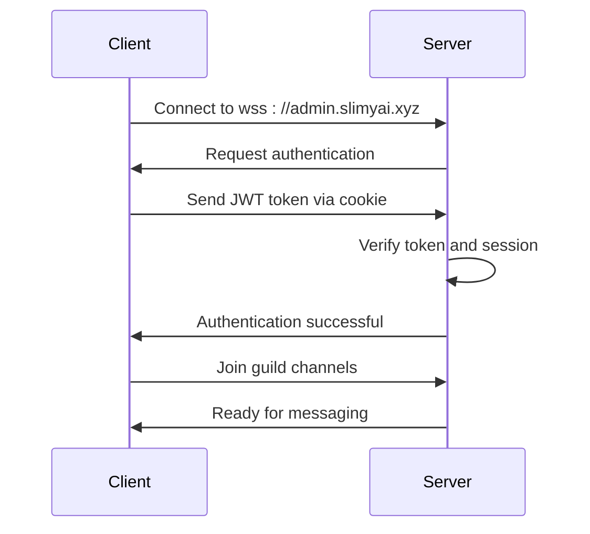
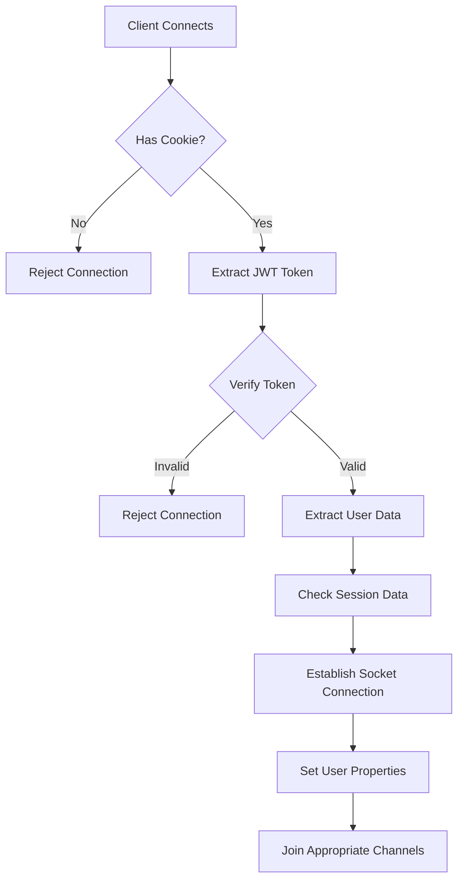
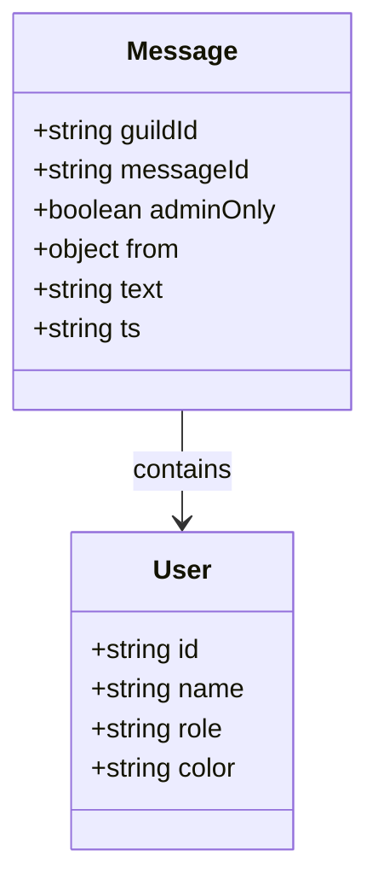
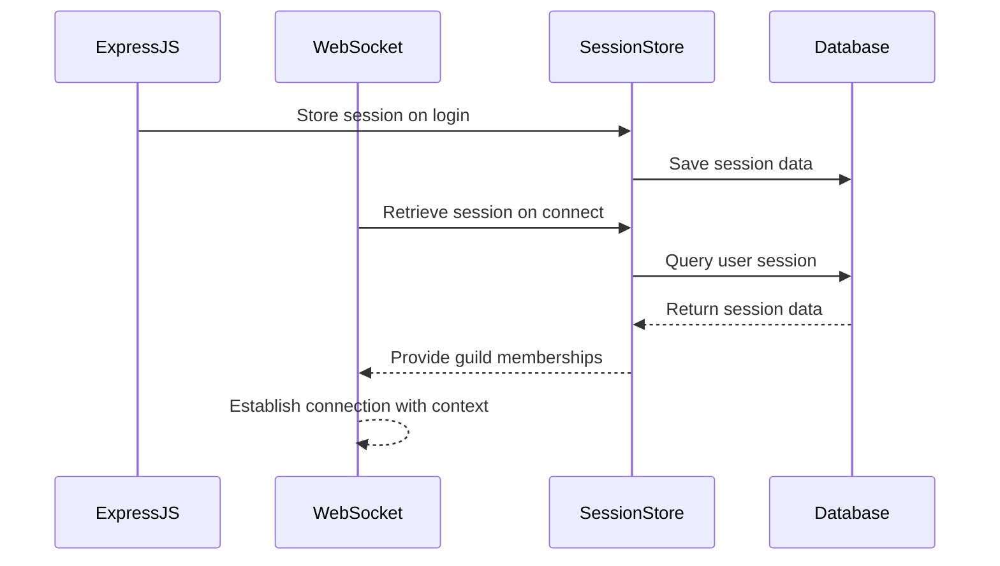
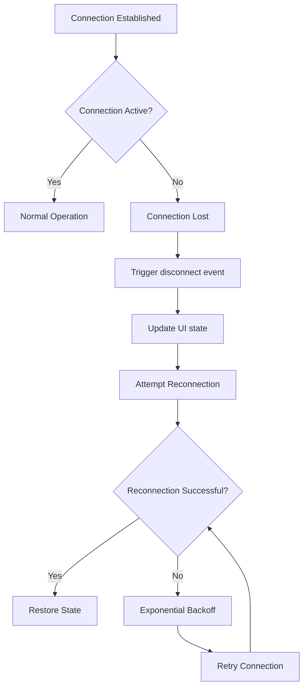
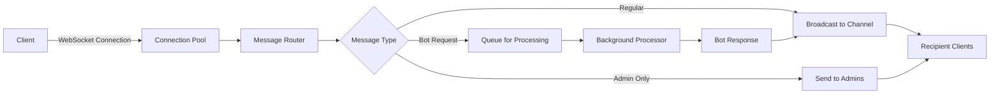
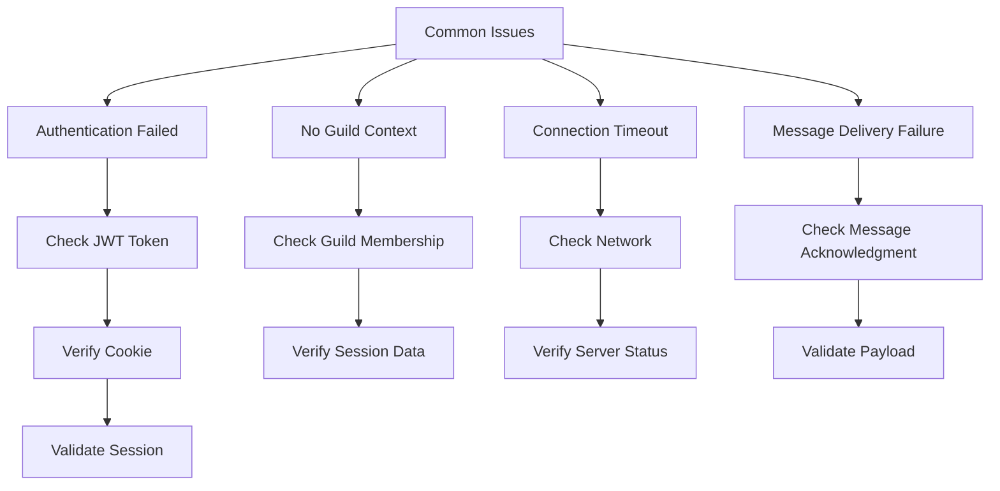

# Real-Time Communication

<cite>
**Referenced Files in This Document**   
- [socket.js](file://apps/admin-api/src/socket.js)
- [jwt.js](file://apps/admin-api/lib/jwt.js)
- [session-store.js](file://apps/admin-api/lib/session-store.js)
- [chat.js](file://apps/admin-api/src/routes/chat.js)
- [socket.js](file://apps/admin-ui/lib/socket.js)
- [SlimeChatBar.jsx](file://apps/admin-ui/components/SlimeChatBar.jsx)
- [index.js](file://apps/admin-ui/pages/chat/index.js)
- [ChatWidget.tsx](file://apps/web/components/ChatWidget.tsx)
</cite>

## Table of Contents
1. [Introduction](#introduction)
2. [WebSocket Connection Establishment](#websocket-connection-establishment)
3. [Authentication and Authorization](#authentication-and-authorization)
4. [Channel Subscription Mechanisms](#channel-subscription-mechanisms)
5. [Message Framing and Event Schema](#message-framing-and-event-schema)
6. [Backend Integration and Session Consistency](#backend-integration-and-session-consistency)
7. [Client-Side Reconnection Strategies](#client-side-reconnection-strategies)
8. [Performance Considerations](#performance-considerations)
9. [Troubleshooting and Monitoring](#troubleshooting-and-monitoring)

## Introduction
The real-time communication architecture in the chat service is built on a WebSocket-based messaging system that enables instant message delivery and presence updates. This documentation details the implementation of the real-time communication system, covering connection establishment, authentication, channel subscriptions, message framing, and client-server integration. The system is designed to provide reliable, low-latency communication between users in different guilds while maintaining security and scalability.

## WebSocket Connection Establishment

The WebSocket-based messaging system establishes real-time connections between clients and the server for instant message delivery. The connection process begins when the client initiates a connection to the WebSocket server, which is configured with CORS settings to allow connections from the admin interface domain.



**Diagram sources**
- [socket.js](file://apps/admin-api/src/socket.js#L38-L44)
- [socket.js](file://apps/admin-ui/lib/socket.js#L7-L10)

**Section sources**
- [socket.js](file://apps/admin-api/src/socket.js#L38-L44)
- [socket.js](file://apps/admin-ui/lib/socket.js#L7-L10)

## Authentication and Authorization

The system implements JWT-based authentication for secure WebSocket connections. Clients must present a valid JWT token in a cookie to establish a connection. The authentication process verifies the token and extracts user information, including role and guild membership.



The authentication flow uses the `verifySession` function from the JWT library to validate the token and extract user information. The session data is retrieved from the session store to obtain the user's guild memberships, which are stored separately from the JWT to keep the token size under 4KB.

**Diagram sources**
- [socket.js](file://apps/admin-api/src/socket.js#L46-L77)
- [jwt.js](file://apps/admin-api/lib/jwt.js#L52-L54)

**Section sources**
- [socket.js](file://apps/admin-api/src/socket.js#L46-L77)
- [jwt.js](file://apps/admin-api/lib/jwt.js#L52-L54)

## Channel Subscription Mechanisms

The system implements a channel subscription model that allows users to participate in guild-specific and admin-only communication channels. Upon successful authentication, the server automatically subscribes the client to relevant channels based on their guild membership and role.

```mermaid
flowchart LR
A[Authenticated User] --> B{Is Admin?}
B --> |Yes| C[Join admins channel]
B --> |No| D[Continue]
A --> E[Get Guild Memberships]
E --> F[For Each Guild]
F --> G[Join guild:{guildId} channel]
G --> H[Ready for Messaging]
```

When a user connects, the server iterates through their guild IDs and subscribes them to each guild's channel using the format `guild:{guildId}`. Administrators are additionally subscribed to the global "admins" channel, which receives admin-only messages. This subscription model enables targeted message delivery to specific user groups.

**Diagram sources**
- [socket.js](file://apps/admin-api/src/socket.js#L93-L98)
- [socket.js](file://apps/admin-api/src/socket.js#L148-L152)

**Section sources**
- [socket.js](file://apps/admin-api/src/socket.js#L93-L98)

## Message Framing and Event Schema

The messaging system uses a standardized message framing format for real-time events, supporting various message types including new messages, admin-only communications, and bot interactions. Each message follows a consistent structure with metadata and content.



The message payload includes the sender's information (ID, name, role, and color), the message text, timestamp, guild ID, message ID, and an admin-only flag. The system supports different message types through the same event channel, with filtering applied based on the adminOnly property and recipient permissions.

**Diagram sources**
- [socket.js](file://apps/admin-api/src/socket.js#L25-L36)
- [socket.js](file://apps/admin-api/src/socket.js#L141-L146)

**Section sources**
- [socket.js](file://apps/admin-api/src/socket.js#L25-L36)

## Backend Integration and Session Consistency

The Express.js backend is integrated with WebSocket handlers to maintain session consistency across HTTP and WebSocket connections. The system uses a shared authentication mechanism and session store to ensure users have a consistent experience regardless of the communication channel.



The integration uses the same JWT verification process for both HTTP routes and WebSocket connections, ensuring consistent authentication. The session store retrieves guild membership information that is used to determine channel subscriptions and message routing.

**Diagram sources**
- [socket.js](file://apps/admin-api/src/socket.js#L59-L64)
- [chat.js](file://apps/admin-api/src/routes/chat.js#L284-L323)

**Section sources**
- [socket.js](file://apps/admin-api/src/socket.js#L59-L64)
- [chat.js](file://apps/admin-api/src/routes/chat.js#L284-L323)

## Client-Side Reconnection Strategies

The client-side web application implements robust reconnection strategies to ensure reliable message delivery. The system handles connection interruptions gracefully and automatically attempts to restore connectivity.



The client libraries implement automatic reconnection with exponential backoff to prevent overwhelming the server during outages. Connection state is monitored through socket events, and the UI provides feedback about connection status to users.

**Diagram sources**
- [socket.js](file://apps/admin-ui/lib/socket.js#L5-L13)
- [SlimeChatBar.jsx](file://apps/admin-ui/components/SlimeChatBar.jsx#L60-L70)

**Section sources**
- [socket.js](file://apps/admin-ui/lib/socket.js#L5-L13)
- [SlimeChatBar.jsx](file://apps/admin-ui/components/SlimeChatBar.jsx#L60-L70)

## Performance Considerations

The real-time communication system incorporates several performance optimizations to handle high message volumes efficiently. These include connection pooling, message batching considerations, and heartbeat mechanisms to maintain connection health.



The system uses Socket.IO's built-in connection pooling and message broadcasting capabilities to efficiently deliver messages to multiple recipients. Message metrics are recorded to monitor system performance, and the architecture is designed to scale horizontally by adding additional WebSocket servers behind a load balancer.

**Diagram sources**
- [socket.js](file://apps/admin-api/src/socket.js#L141-L152)
- [socket.js](file://apps/admin-api/src/socket.js#L158-L175)

**Section sources**
- [socket.js](file://apps/admin-api/src/socket.js#L141-L152)

## Troubleshooting and Monitoring

The system includes comprehensive troubleshooting capabilities and monitoring approaches to track real-time communication health. Various mechanisms are in place to diagnose and resolve connectivity issues.



The system logs detailed information about connection attempts, authentication failures, and message processing. Client-side error handling provides meaningful feedback to users, while server-side monitoring tracks connection metrics and message volumes to identify potential issues.

**Diagram sources**
- [socket.js](file://apps/admin-api/src/socket.js#L110-L112)
- [socket.js](file://apps/admin-api/src/socket.js#L195-L197)
- [SlimeChatBar.jsx](file://apps/admin-ui/components/SlimeChatBar.jsx#L72-L76)

**Section sources**
- [socket.js](file://apps/admin-api/src/socket.js#L110-L112)
- [socket.js](file://apps/admin-api/src/socket.js#L195-L197)
- [SlimeChatBar.jsx](file://apps/admin-ui/components/SlimeChatBar.jsx#L72-L76)