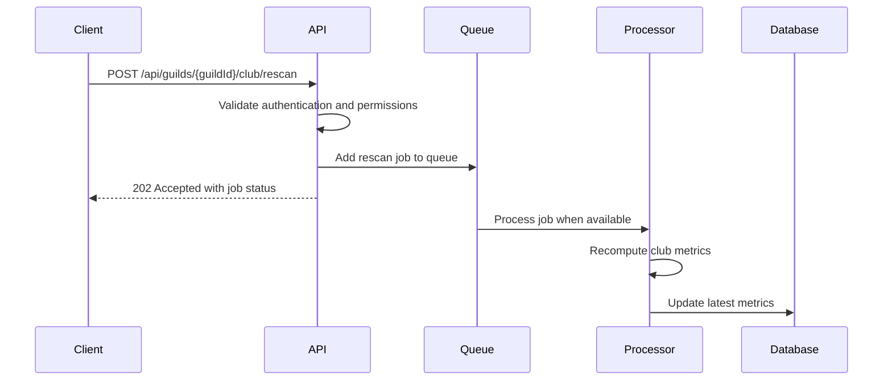
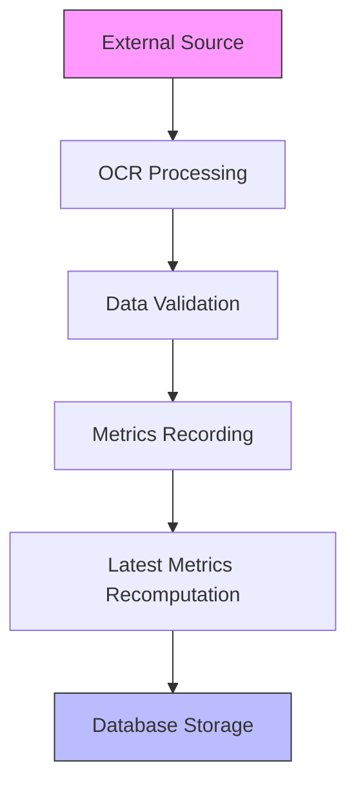
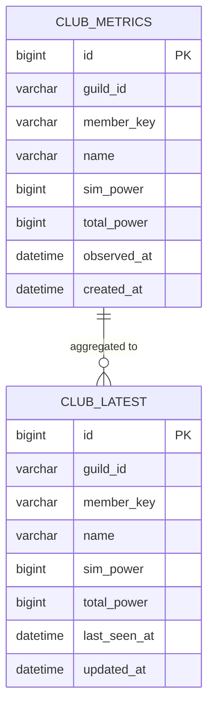
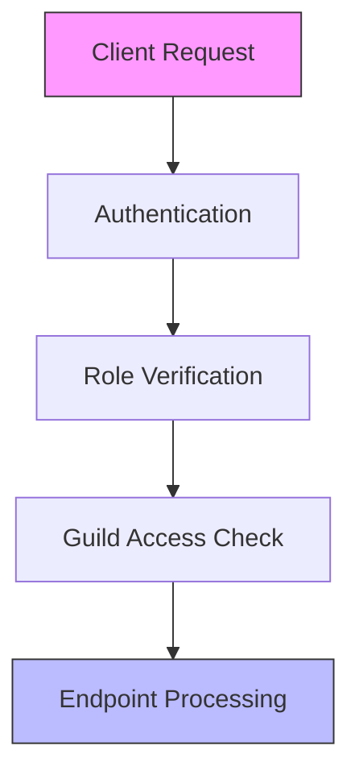

# Club Data Endpoints

<cite>
**Referenced Files in This Document**   
- [club.js](file://apps/admin-api/src/routes/club.js)
- [club-ingest.js](file://apps/admin-api/lib/club-ingest.js)
- [club-store.js](file://apps/admin-api/lib/club-store.js)
- [club-schema.sql](file://apps/admin-api/lib/club-schema.sql)
- [rescan.js](file://apps/admin-api/src/services/rescan.js)
- [auth.js](file://apps/admin-api/src/middleware/auth.js)
- [rbac.js](file://apps/admin-api/src/middleware/rbac.js)
- [queue-manager.js](file://apps/admin-api/lib/queue-manager.js)
</cite>

## Table of Contents
1. [Introduction](#introduction)
2. [Core Endpoints](#core-endpoints)
3. [Data Ingestion Pipeline](#data-ingestion-pipeline)
4. [Data Schema and Storage](#data-schema-and-storage)
5. [Authentication and Authorization](#authentication-and-authorization)
6. [Rate Limiting and Performance](#rate-limiting-and-performance)
7. [Usage Examples](#usage-examples)
8. [Error Handling](#error-handling)
9. [Conclusion](#conclusion)

## Introduction

The club data endpoints in the admin-api service provide access to club member metrics and enable administrative operations for data management. These endpoints support retrieving the latest club metrics and triggering complete reprocessing of club data through a rescan mechanism. The system is designed to handle data ingestion from external sources, validate the data, store it in a database, and provide efficient access to the most recent metrics.

The endpoints are part of a larger data processing pipeline that includes OCR parsing, data validation, and storage optimization. The architecture supports asynchronous processing for data updates, ensuring that the system remains responsive even during intensive data reprocessing operations.

**Section sources**
- [club.js](file://apps/admin-api/src/routes/club.js#L1-L88)

## Core Endpoints

### GET /api/guilds/:guildId/club/latest

This endpoint retrieves the most recent club metrics for a specific guild. It returns a list of members with their current power metrics, including both simulation power and total power values.

**Authentication Requirements**: This endpoint requires authentication and guild access. Users must be authenticated and have access to the specified guild to retrieve its club metrics.

**Query Parameters**: This endpoint does not accept any query parameters.

**Response Structure**:
```json
{
  "ok": true,
  "guildId": "string",
  "members": [
    {
      "memberKey": "string",
      "name": "string",
      "simPower": "number",
      "totalPower": "number",
      "changePercent": "number or null",
      "lastSeenAt": "string (ISO 8601 date)"
    }
  ]
}
```

The response includes the guild ID, a status flag, and an array of member objects. Each member object contains their identifier, name, power metrics, change percentage (currently null as historical comparison is not implemented), and the timestamp when they were last observed.

**Section sources**
- [club.js](file://apps/admin-api/src/routes/club.js#L17-L55)

### POST /api/guilds/:guildId/club/rescan

This endpoint triggers a complete reprocessing of club data for a specific guild. It initiates a job to rescan and recompute the club metrics, which is processed asynchronously.

**Authentication Requirements**: This endpoint requires authentication, guild access, and admin role. Only users with administrative privileges can trigger a rescan operation.

**Request Body**: This endpoint does not require a request body.

**Response Structure**:
```json
{
  "ok": true,
  "message": "string",
  "guildId": "string",
  "recomputedAt": "string (ISO 8601 date)"
}
```

The response confirms that the rescan has been scheduled with a 202 Accepted status code. It includes a message indicating the operation was scheduled, the guild ID, and the timestamp when the recomputation was initiated.

**Job Queuing Mechanism**: The rescan operation is added to a job queue for asynchronous processing. The queue manager handles the execution of these jobs, ensuring that resource-intensive operations do not block other API requests.



**Diagram sources**
- [club.js](file://apps/admin-api/src/routes/club.js#L57-L85)
- [club-ingest.js](file://apps/admin-api/lib/club-ingest.js#L96-L118)
- [queue-manager.js](file://apps/admin-api/lib/queue-manager.js#L1-L31)

**Section sources**
- [club.js](file://apps/admin-api/src/routes/club.js#L57-L85)
- [club-ingest.js](file://apps/admin-api/lib/club-ingest.js#L96-L118)

## Data Ingestion Pipeline

The data ingestion pipeline processes club data from external sources through several stages: data collection, OCR parsing, validation, and storage.



**Processing Frequency**: Club data is processed on-demand when new screenshots are uploaded or when a rescan is triggered manually. There is no scheduled automatic ingestion; all processing is initiated by explicit actions.

The pipeline begins with OCR processing of club screenshots, which extracts text data from images. This data is then validated and parsed into structured member metrics. Each member's metrics are recorded in the database with a timestamp, and the latest aggregates are recomputed to ensure the GET endpoint returns current data.

**Error Handling for Failed Ingestions**: When an ingestion fails, the system logs the error with detailed context including the guild ID and error message. The ingestion function returns a result object that includes any errors encountered, allowing for monitoring and troubleshooting. Individual member processing errors are captured and returned in the errors array, while the overall ingestion continues for other members.

**Section sources**
- [club-ingest.js](file://apps/admin-api/lib/club-ingest.js#L1-L124)
- [club-vision.js](file://apps/admin-api/lib/club-vision.js#L1-L3)

## Data Schema and Storage

The club data is stored in two related database tables that support both historical tracking and efficient access to current metrics.



**Diagram sources**
- [club-schema.sql](file://apps/admin-api/lib/club-schema.sql#L5-L58)

### Table: club_metrics

This table stores historical member power metrics extracted from OCR parsing. Each record represents a snapshot of a member's metrics at a specific point in time.

**Columns**:
- `id`: Primary key (auto-incrementing)
- `guild_id`: Guild identifier (VARCHAR 64)
- `member_key`: Canonicalized member identifier (VARCHAR 255)
- `name`: Member display name (VARCHAR 255)
- `sim_power`: Simulation power value (BIGINT, nullable)
- `total_power`: Total power value (BIGINT, nullable)
- `observed_at`: Timestamp when metrics were observed (DATETIME)
- `created_at`: Record creation timestamp (DATETIME)

**Indexes**:
- `idx_guild_member`: Composite index on guild_id and member_key for efficient querying by guild and member
- `idx_observed_at`: Index on observed_at for time-based queries
- Unique constraint on guild_id, member_key, and observed_at to prevent duplicate observations

### Table: club_latest

This table stores the latest/current metrics for each member, providing an aggregated view that supports efficient retrieval of current data.

**Columns**:
- `id`: Primary key (auto-incrementing)
- `guild_id`: Guild identifier (VARCHAR 64)
- `member_key`: Canonicalized member identifier (VARCHAR 255)
- `name`: Member display name (VARCHAR 255)
- `sim_power`: Latest simulation power value (BIGINT, nullable)
- `total_power`: Latest total power value (BIGINT, nullable)
- `last_seen_at`: Timestamp when member was last observed (DATETIME)
- `updated_at`: Timestamp of last update to this record (DATETIME with auto-update)

**Indexes**:
- Unique constraint on guild_id and member_key to ensure one record per member per guild
- `idx_guild_id`: Index on guild_id for guild-based queries
- `idx_total_power`: Index on total_power for ranking queries

The two-table design enables efficient queries for both current metrics (using club_latest) and historical analysis (using club_metrics), with the club_latest table being updated whenever new data is ingested.

**Section sources**
- [club-schema.sql](file://apps/admin-api/lib/club-schema.sql#L5-L58)
- [club-store.js](file://apps/admin-api/lib/club-store.js#L1-L3)

## Authentication and Authorization

The club data endpoints implement a multi-layered security model that ensures only authorized users can access or modify data.



**Authentication Process**: All requests are authenticated using session tokens passed in cookies. The system supports multiple cookie names for backward compatibility and verifies the token to extract user information.

**Authorization Requirements**:
- **GET /api/guilds/:guildId/club/latest**: Requires authentication and guild access. Any member of the guild can access this endpoint.
- **POST /api/guilds/:guildId/club/rescan**: Requires authentication, guild access, and admin role. Only administrators can trigger a rescan operation.

The authorization is implemented through middleware functions that validate the user's role and guild membership before allowing the request to proceed to the endpoint handler.

**Section sources**
- [auth.js](file://apps/admin-api/src/middleware/auth.js#L1-L231)
- [rbac.js](file://apps/admin-api/src/middleware/rbac.js#L1-L35)

## Rate Limiting and Performance

The system implements rate limiting and performance optimizations to handle usage patterns and prevent abuse.

**Rate Limiting Policies**: While specific rate limiting configurations are not visible in the analyzed code, the middleware directory contains a rate-limit.js file, indicating that rate limiting is implemented at the application level. The exact limits and configurations would be defined in the application's configuration files.

**Performance Considerations for Large Guilds**: The system is optimized for efficient retrieval of club metrics through the use of indexed database queries and cached latest metrics. For large guilds with many members, the GET endpoint performance is optimized by querying the club_latest table, which contains pre-aggregated data rather than requiring real-time aggregation from historical records.

The asynchronous nature of data updates means that changes to club data are not immediately reflected in the API responses. When a rescan is triggered, there is a delay between the request and when the updated data becomes available through the GET endpoint. Clients should implement appropriate polling or refresh mechanisms to handle this asynchrony.

**Section sources**
- [club.js](file://apps/admin-api/src/routes/club.js#L17-L88)
- [rate-limit.js](file://apps/admin-api/src/middleware/rate-limit.js)

## Usage Examples

### Displaying Club Metrics

To display the current club metrics in a user interface, clients can make a GET request to the latest endpoint:

```javascript
// Example: Fetching club metrics for display
fetch(`/api/guilds/${guildId}/club/latest`, {
  credentials: 'include' // Include cookies for authentication
})
.then(response => response.json())
.then(data => {
  // Display member list with power metrics
  renderClubLeaderboard(data.members);
})
.catch(error => {
  // Handle error (e.g., show error message)
  showError('Failed to load club metrics');
});
```

### Troubleshooting Data Discrepancies

When club data appears outdated or incorrect, administrators can trigger a rescan to force reprocessing:

```javascript
// Example: Triggering a rescan for data correction
fetch(`/api/guilds/${guildId}/club/rescan`, {
  method: 'POST',
  credentials: 'include'
})
.then(response => {
  if (response.status === 202) {
    // Rescan accepted, show confirmation
    showStatus('Rescan scheduled. Data will update shortly.');
    
    // Optionally poll for updated data
    setTimeout(() => refreshClubData(), 5000);
  } else {
    // Handle error
    showError('Failed to schedule rescan');
  }
})
.catch(error => {
  showError('Network error while scheduling rescan');
});
```

These examples demonstrate common usage patterns for the club data endpoints, showing how clients can retrieve current metrics and administrators can refresh the data when needed.

**Section sources**
- [club.js](file://apps/admin-api/src/routes/club.js#L17-L88)

## Error Handling

The system implements comprehensive error handling for the club data endpoints, with appropriate logging and client responses.

For the GET /api/guilds/:guildId/club/latest endpoint, errors are caught and passed to the error handling middleware. The system logs detailed error information including the guild ID and error stack trace, while returning a generic error response to the client to avoid exposing sensitive information.

For the POST /api/guilds/:guildId/club/rescan endpoint, similar error handling is implemented. If the rescan operation fails, the error is logged with full context, and the client receives an appropriate error response.

The data ingestion process includes specific error handling for individual member processing failures. When a member's metrics cannot be recorded, the error is captured in the result object's errors array, but the overall ingestion continues for other members. This ensures that partial failures do not prevent the processing of valid data.

**Section sources**
- [club.js](file://apps/admin-api/src/routes/club.js#L46-L54)
- [club.js](file://apps/admin-api/src/routes/club.js#L76-L84)
- [club-ingest.js](file://apps/admin-api/lib/club-ingest.js#L79-L84)

## Conclusion

The club data endpoints in the admin-api service provide a robust interface for accessing and managing club member metrics. The system is designed with a clear separation between data retrieval and data processing operations, with the GET endpoint providing efficient access to current metrics and the POST endpoint enabling administrative reprocessing.

The architecture supports asynchronous data updates through a job queuing mechanism, ensuring that intensive processing operations do not impact the responsiveness of the API. Data is stored in an optimized two-table structure that supports both efficient retrieval of current data and historical analysis.

Security is implemented through comprehensive authentication and authorization checks, ensuring that users can only access data for guilds they belong to, and only administrators can trigger data reprocessing operations.

For optimal use, clients should be aware of the asynchronous nature of data updates and implement appropriate patterns for refreshing data after triggering a rescan operation.