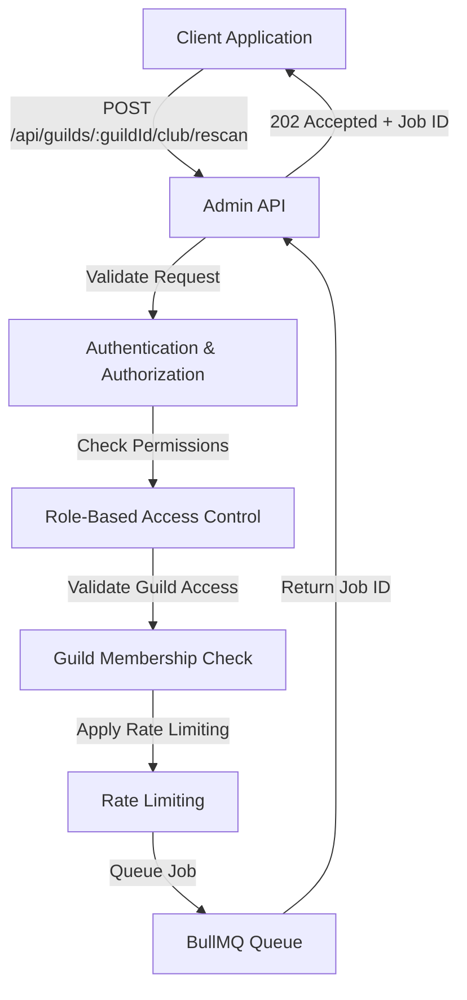
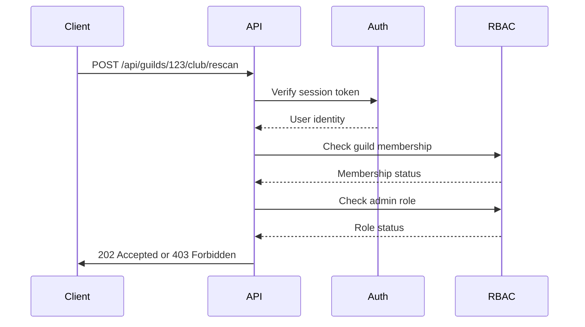
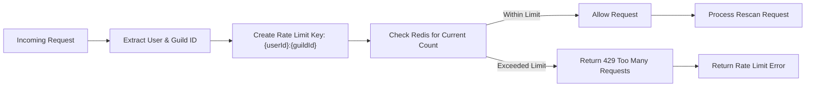
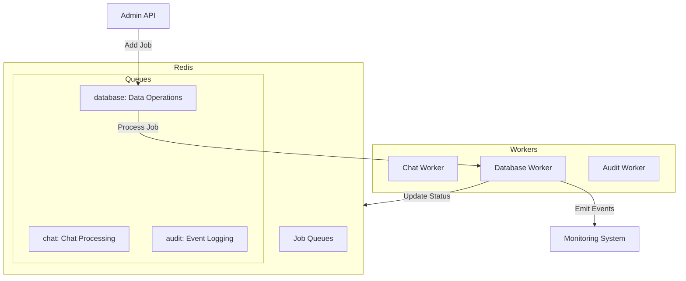
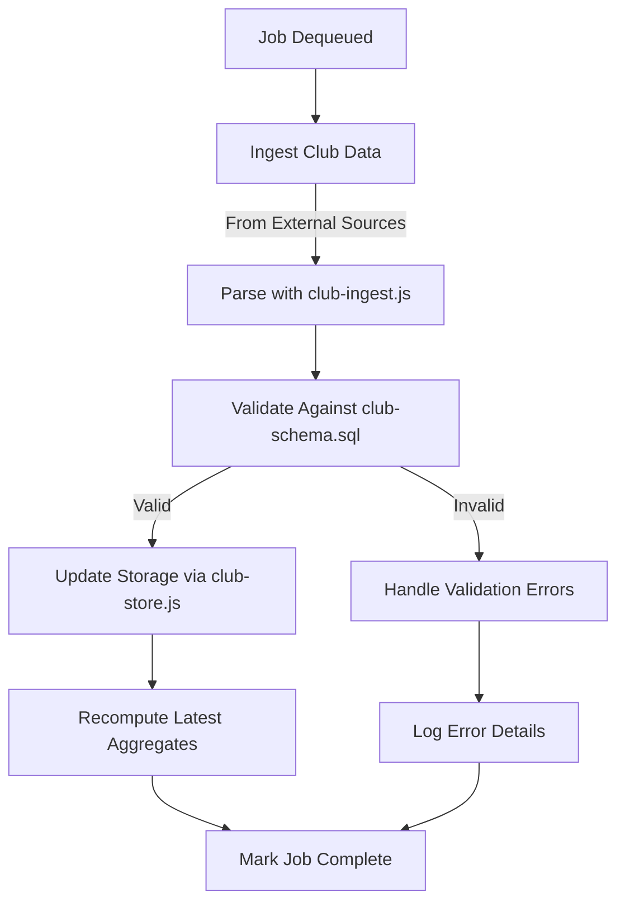

# Club Data Rescan

<cite>
**Referenced Files in This Document**   
- [club.js](file://apps/admin-api/src/routes/club.js#L57-L85)
- [club-ingest.js](file://apps/admin-api/lib/club-ingest.js#L95-L118)
- [database-processor.js](file://apps/admin-api/src/lib/queues/database-processor.js)
- [index.js](file://apps/admin-api/src/lib/queues/index.js)
- [queue-manager.js](file://apps/admin-api/lib/queue-manager.js)
- [auth.js](file://apps/admin-api/src/middleware/auth.js)
- [rbac.js](file://apps/admin-api/src/middleware/rbac.js)
- [rate-limit.js](file://apps/admin-api/src/middleware/rate-limit.js)
- [club-store.js](file://apps/admin-api/lib/club-store.js)
- [rescan.js](file://apps/admin-api/src/services/rescan.js)
- [route.ts](file://apps/web/app/api/club/rescan/route.ts)
</cite>

## Table of Contents
1. [Introduction](#introduction)
2. [API Endpoint Overview](#api-endpoint-overview)
3. [Authentication and Authorization](#authentication-and-authorization)
4. [Rate Limiting](#rate-limiting)
5. [Job Initiation and Response](#job-initiation-and-response)
6. [Asynchronous Processing Pipeline](#asynchronous-processing-pipeline)
7. [Backend Data Processing Flow](#backend-data-processing-flow)
8. [Error Handling and Monitoring](#error-handling-and-monitoring)
9. [Usage Examples](#usage-examples)
10. [Performance Considerations](#performance-considerations)

## Introduction
The Club Data Rescan endpoint provides a mechanism to reprocess club metrics for a specific guild. This API triggers an asynchronous job that rescans and recomputes club data, ensuring metrics are up-to-date. The system is designed to handle resource-intensive operations through a queued processing model, preventing performance degradation during reprocessing tasks.

**Section sources**
- [club.js](file://apps/admin-api/src/routes/club.js#L57-L85)

## API Endpoint Overview
The club data rescan functionality is exposed through a REST API endpoint that initiates the reprocessing job:

**Endpoint**: `POST /api/guilds/:guildId/club/rescan`  
**Method**: POST  
**Purpose**: Triggers a rescan of club metrics for the specified guild

The endpoint follows a fire-and-forget pattern, returning immediately with a job identifier that clients can use to monitor progress. This design allows the system to handle potentially long-running reprocessing tasks without blocking the client request.



**Diagram sources**
- [club.js](file://apps/admin-api/src/routes/club.js#L57-L85)
- [index.js](file://apps/admin-api/src/lib/queues/index.js)
- [auth.js](file://apps/admin-api/src/middleware/auth.js)
- [rbac.js](file://apps/admin-api/src/middleware/rbac.js)
- [rate-limit.js](file://apps/admin-api/src/middleware/rate-limit.js)

**Section sources**
- [club.js](file://apps/admin-api/src/routes/club.js#L57-L85)

## Authentication and Authorization
The rescan endpoint requires proper authentication and authorization to prevent unauthorized access to guild data.

### Authentication
The endpoint uses JWT-based authentication through session tokens. The system checks for valid session cookies in the request, supporting multiple cookie name fallbacks for backward compatibility.

### Authorization
Two levels of authorization are enforced:
1. **Guild Membership**: The requesting user must be a member of the specified guild
2. **Role Requirement**: The user must have admin privileges to trigger a rescan



**Diagram sources**
- [auth.js](file://apps/admin-api/src/middleware/auth.js#L154-L173)
- [rbac.js](file://apps/admin-api/src/middleware/rbac.js#L14-L29)

**Section sources**
- [auth.js](file://apps/admin-api/src/middleware/auth.js#L154-L173)
- [rbac.js](file://apps/admin-api/src/middleware/rbac.js#L14-L29)

## Rate Limiting
To prevent abuse and ensure system stability, the rescan endpoint implements rate limiting based on user and guild combinations.

### Rate Limit Configuration
- **Window**: 15 minutes (900,000 ms)
- **Maximum Requests**: Configurable per environment
- **Identifier**: Combination of user ID and guild ID

The rate limiter uses a sliding window algorithm to prevent burst attacks while allowing legitimate usage patterns. This ensures that administrators can perform necessary maintenance without overwhelming the system with consecutive rescan requests.



**Diagram sources**
- [rate-limit.js](file://apps/admin-api/src/middleware/rate-limit.js)

**Section sources**
- [rate-limit.js](file://apps/admin-api/src/middleware/rate-limit.js)

## Job Initiation and Response
When a valid rescan request is received, the system initiates an asynchronous job and returns immediate feedback to the client.

### Request Flow
1. Validate authentication and authorization
2. Apply rate limiting
3. Create processing job in the queue
4. Return job status response

### Response Format
The endpoint returns a 202 Accepted status with the following JSON response:

```json
{
  "ok": true,
  "message": "Rescan scheduled",
  "guildId": "123456789",
  "recomputedAt": "2024-01-15T10:30:00.000Z"
}
```

The 202 status indicates that the request has been accepted for processing but has not been completed. Clients should implement polling mechanisms to check the status of the rescan job.

**Section sources**
- [club.js](file://apps/admin-api/src/routes/club.js#L62-L85)
- [club-ingest.js](file://apps/admin-api/lib/club-ingest.js#L95-L118)

## Asynchronous Processing Pipeline
The rescan operation is handled through an asynchronous processing pipeline using BullMQ and Redis for reliable job queuing.

### Queue Architecture
The system utilizes multiple specialized queues for different types of background processing:



### Job Processing Workflow
1. Job is added to the database queue with type 'rescan_club_data'
2. Database worker picks up the job from the queue
3. Worker executes the rescan logic
4. Job status is updated in Redis
5. Completion events are emitted for monitoring

The queue system provides several reliability features:
- Automatic retry of failed jobs (3 attempts with exponential backoff)
- Job persistence in Redis
- Monitoring of job duration and success rates
- Queue statistics for operational visibility

**Diagram sources**
- [index.js](file://apps/admin-api/src/lib/queues/index.js)
- [database-processor.js](file://apps/admin-api/src/lib/queues/database-processor.js)

**Section sources**
- [index.js](file://apps/admin-api/src/lib/queues/index.js#L30-L396)
- [database-processor.js](file://apps/admin-api/src/lib/queues/database-processor.js)

## Backend Data Processing Flow
The backend processing pipeline handles the actual data reprocessing operations after the job is dequeued.

### Processing Stages
1. **Data Ingestion**: Retrieve club data from external sources
2. **Parsing**: Process data using the club-ingest.js module
3. **Validation**: Validate against the club schema
4. **Storage**: Update the database with new metrics



The current implementation focuses on recomputing aggregates from existing data, with plans to integrate full OCR pipeline processing in the future. The `rescanGuildClubMetrics` function in club-ingest.js serves as the primary entry point for the rescan logic.

**Diagram sources**
- [club-ingest.js](file://apps/admin-api/lib/club-ingest.js#L95-L118)
- [club-store.js](file://apps/admin-api/lib/club-store.js)

**Section sources**
- [club-ingest.js](file://apps/admin-api/lib/club-ingest.js#L95-L118)
- [club-store.js](file://apps/admin-api/lib/club-store.js)

## Error Handling and Monitoring
The system implements comprehensive error handling and monitoring to ensure reliability and provide visibility into job execution.

### Error Types and Handling
- **Authentication Errors**: 401 Unauthorized for invalid or missing credentials
- **Authorization Errors**: 403 Forbidden for insufficient permissions
- **Validation Errors**: 400 Bad Request for malformed requests
- **Rate Limit Errors**: 429 Too Many Requests for exceeded limits
- **Processing Errors**: 500 Internal Server Error for job execution failures

### Logging Strategy
The system uses structured logging with the following principles:
- All significant operations are logged with relevant context
- Error details include stack traces for debugging
- Performance metrics are captured for monitoring
- Sensitive information is redacted from logs

### Monitoring and Alerting
Key metrics are collected and exposed for monitoring:
- Job queue lengths
- Job processing duration
- Job success/failure rates
- Error rates by type

Administrators receive notifications for critical failures through integrated alerting systems, allowing for rapid response to issues affecting data processing.

**Section sources**
- [club.js](file://apps/admin-api/src/routes/club.js#L76-L84)
- [club-ingest.js](file://apps/admin-api/lib/club-ingest.js#L109-L117)
- [database-processor.js](file://apps/admin-api/src/lib/queues/database-processor.js)

## Usage Examples
This section provides practical examples of how to interact with the club data rescan endpoint.

### Triggering a Rescan
```bash
curl -X POST \
  https://api.example.com/api/guilds/123456789/club/rescan \
  -H "Authorization: Bearer <your-token>" \
  -H "Content-Type: application/json"
```

### Handling the Response
```javascript
async function triggerRescan(guildId) {
  try {
    const response = await fetch(`/api/guilds/${guildId}/club/rescan`, {
      method: 'POST',
      headers: {
        'Authorization': `Bearer ${token}`,
        'Content-Type': 'application/json'
      }
    });
    
    if (response.status === 202) {
      const data = await response.json();
      console.log('Rescan scheduled:', data);
      return data;
    } else if (response.status === 429) {
      console.error('Rate limited - please try again later');
    } else {
      console.error('Failed to trigger rescan:', response.status);
    }
  } catch (error) {
    console.error('Network error:', error);
  }
}
```

### Polling for Job Completion
Clients should implement polling to monitor the status of the rescan job:

```javascript
async function pollRescanStatus(guildId, interval = 5000) {
  const startTime = Date.now();
  const timeout = 300000; // 5 minutes
  
  while (Date.now() - startTime < timeout) {
    // Check status endpoint (implementation depends on system)
    const status = await checkRescanStatus(guildId);
    
    if (status.completed) {
      return status;
    }
    
    if (status.failed) {
      throw new Error(`Rescan failed: ${status.error}`);
    }
    
    await new Promise(resolve => setTimeout(resolve, interval));
  }
  
  throw new Error('Rescan timed out');
}
```

**Section sources**
- [route.ts](file://apps/web/app/api/club/rescan/route.ts)
- [club.js](file://apps/admin-api/src/routes/club.js#L57-L85)

## Performance Considerations
The club data rescan functionality involves resource-intensive operations that require careful performance management.

### Resource Management
- **Queue Concurrency**: The database queue processes jobs with a concurrency of 10, balancing throughput and resource utilization
- **Job Retries**: Failed jobs are automatically retried with exponential backoff to handle transient failures
- **Memory Usage**: Large data processing tasks are streamed when possible to minimize memory footprint

### Optimization Opportunities
- **Caching**: Implement result caching to avoid unnecessary recomputation
- **Batch Processing**: Group multiple rescan requests when possible
- **Progressive Enhancement**: Return partial results for large datasets
- **Webhooks**: Implement webhook notifications instead of polling for job completion

### Scalability
The system is designed to scale horizontally:
- Multiple worker instances can process jobs from the same queue
- Redis provides shared state across instances
- Database connections are pooled for efficiency

For large guilds with extensive data, administrators should consider scheduling rescans during off-peak hours to minimize impact on system performance.

**Section sources**
- [index.js](file://apps/admin-api/src/lib/queues/index.js#L83-L86)
- [database-processor.js](file://apps/admin-api/src/lib/queues/database-processor.js)