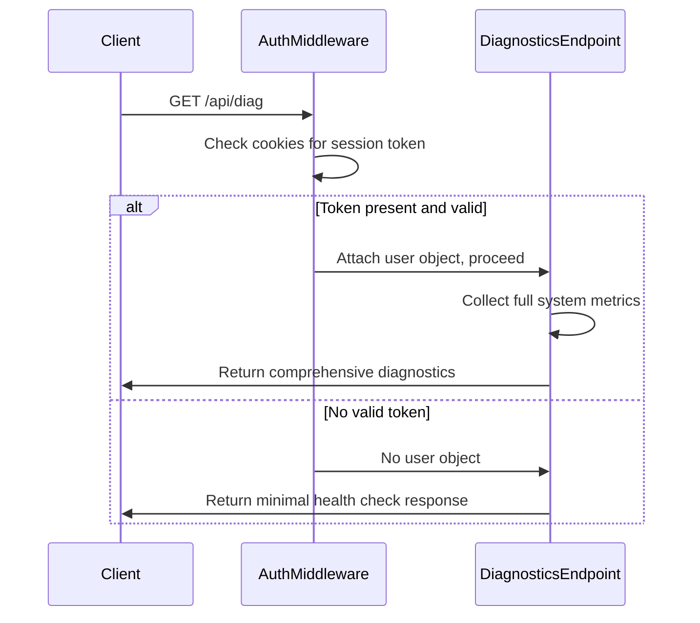
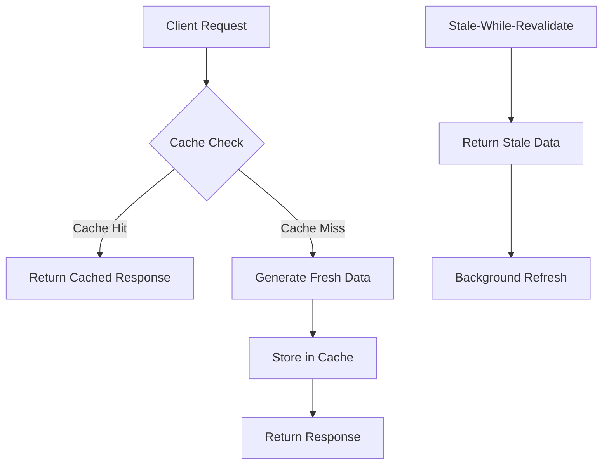

# Diagnostics Endpoints

<cite>
**Referenced Files in This Document**   
- [diag.js](file://apps/admin-api/src/routes/diag.js)
- [diagnostics.js](file://apps/admin-api/src/routes/diagnostics.js)
- [auth.js](file://apps/admin-api/src/middleware/auth.js)
- [uploads.js](file://apps/admin-api/src/services/uploads.js)
- [cache.js](file://apps/admin-api/src/middleware/cache.js)
- [app.js](file://apps/admin-api/src/app.js)
- [redis.ts](file://apps/web/lib/cache/redis.ts)
- [redis-client.ts](file://apps/web/lib/cache/redis-client.ts)
</cite>

## Table of Contents
1. [Introduction](#introduction)
2. [Core Diagnostics Endpoint](#core-diagnostics-endpoint)
3. [Authentication Behavior](#authentication-behavior)
4. [Response Structure](#response-structure)
5. [Caching Strategy](#caching-strategy)
6. [Error Handling](#error-handling)
7. [Usage Examples](#usage-examples)
8. [System Integration](#system-integration)

## Introduction
The diagnostics endpoints in the admin-api service provide critical system health monitoring capabilities for the application infrastructure. These endpoints serve as the foundation for system status monitoring, operational visibility, and troubleshooting across the platform. The primary diagnostic endpoint, GET /api/diag, delivers real-time system metrics that are essential for maintaining service reliability and performance. This documentation details the implementation, behavior, and integration patterns for these diagnostic endpoints, focusing on their role in the overall monitoring architecture and status page functionality.

## Core Diagnostics Endpoint

The primary diagnostics endpoint at GET /api/diag serves as the system health check interface, providing essential runtime information about the admin-api service. This endpoint is designed to deliver immediate feedback on system status while maintaining minimal overhead. The endpoint is implemented in the diag.js route file and follows a straightforward request-response pattern that adapts based on authentication state.

The endpoint serves dual purposes: providing basic health confirmation for unauthenticated health checks and delivering comprehensive system metrics for authenticated administrative users. This design allows external monitoring systems to verify service availability without requiring authentication, while enabling authorized users to access detailed performance data for troubleshooting and optimization.

**Section sources**
- [diag.js](file://apps/admin-api/src/routes/diag.js#L1-L55)

## Authentication Behavior

The diagnostics endpoint implements a tiered authentication model that provides different levels of information based on the requester's authentication status. When accessed without authentication, the endpoint returns a minimal response confirming service availability. This design enables external monitoring systems and load balancers to perform health checks without requiring credentials.

For authenticated users, the endpoint provides comprehensive system metrics including server performance data and upload statistics. Authentication is handled through the standard JWT-based authentication middleware, which processes session tokens from cookies. The authentication flow checks multiple potential cookie names to ensure compatibility across different deployment configurations and client implementations.

The authentication mechanism is implemented in the auth.js middleware, which resolves user sessions from cookies and attaches user information to the request object. This approach allows the diagnostics endpoint to make authorization decisions based on the presence and validity of session tokens without tightly coupling authentication logic to the route implementation.



**Diagram sources**
- [auth.js](file://apps/admin-api/src/middleware/auth.js#L1-L231)
- [diag.js](file://apps/admin-api/src/routes/diag.js#L1-L55)

**Section sources**
- [auth.js](file://apps/admin-api/src/middleware/auth.js#L1-L231)
- [diag.js](file://apps/admin-api/src/routes/diag.js#L1-L55)

## Response Structure

The diagnostics endpoint returns JSON responses with a consistent structure that varies based on authentication status. For unauthenticated requests, the response includes only the basic health confirmation:

```json
{
  "ok": true,
  "authenticated": false
}
```

For authenticated requests, the response includes comprehensive system metrics:

```json
{
  "ok": true,
  "authenticated": true,
  "admin": {
    "uptimeSec": 12345,
    "memory": {
      "rssMb": 45.6,
      "heapUsedMb": 32.1
    },
    "node": "v18.17.0",
    "pid": 1234,
    "hostname": "server-01"
  },
  "uploads": {
    "total": 250,
    "today": 15,
    "byGuild": {
      "1176605506912141444": 89,
      "2287716617023252555": 161
    }
  }
}
```

The response structure includes several key components:
- **Status indicator**: The "ok" field indicates successful processing
- **Authentication status**: The "authenticated" field shows whether the request was authenticated
- **System metrics**: The "admin" object contains server-level performance data
- **Upload statistics**: The "uploads" object provides file upload metrics

The system metrics include server uptime in seconds, memory usage (both RSS and heap), Node.js version, process ID, and hostname. The upload statistics include total uploads, uploads from the current day, and a breakdown by guild ID. This structure enables clients to quickly assess system health and performance characteristics.

**Section sources**
- [diag.js](file://apps/admin-api/src/routes/diag.js#L1-L55)
- [uploads.js](file://apps/admin-api/src/services/uploads.js#L1-L169)

## Caching Strategy

The web application layer implements a caching strategy for diagnostic information with 60-second revalidation requirements. While the primary diagnostics endpoint (/api/diag) does not implement caching directly, the system includes a secondary diagnostics endpoint (/api/diagnostics) that incorporates caching behavior.

The caching infrastructure is implemented using Redis as the primary cache store, with an in-memory fallback for development environments. The cache configuration supports stale-while-revalidate patterns, allowing the system to serve potentially stale data while refreshing the cache in the background. This approach ensures responsive performance even during periods of high load or backend latency.

The cache middleware provides configurable TTL (time-to-live) values and supports varying cache keys by user or guild context. Cache headers are set appropriately to communicate freshness information to clients. For diagnostic data, the cache is configured with a relatively short TTL to ensure that monitoring systems receive timely information while still benefiting from performance improvements.



**Diagram sources**
- [cache.js](file://apps/admin-api/src/middleware/cache.js#L1-L287)
- [redis.ts](file://apps/web/lib/cache/redis.ts#L1-L381)
- [redis-client.ts](file://apps/web/lib/cache/redis-client.ts#L1-L375)

**Section sources**
- [cache.js](file://apps/admin-api/src/middleware/cache.js#L1-L287)
- [redis.ts](file://apps/web/lib/cache/redis.ts#L1-L381)
- [redis-client.ts](file://apps/web/lib/cache/redis-client.ts#L1-L375)

## Error Handling

The diagnostics endpoint implements robust error handling to ensure reliable operation under various failure conditions. When errors occur during diagnostics collection, the endpoint returns structured error responses with appropriate HTTP status codes. Network errors, database connectivity issues, and other system failures are transformed into consistent JSON responses that maintain the API contract.

For the primary diagnostics endpoint, errors are caught and result in a 500 Internal Server Error response with a structured error payload:

```json
{
  "error": "diag_failed"
}
```

The error handling mechanism logs detailed error information for debugging while exposing only essential information to clients. This approach balances transparency with security, preventing sensitive system details from being exposed through error messages. The logging system captures error context including timestamps, error types, and relevant metadata to facilitate troubleshooting.

The secondary diagnostics endpoint (/api/diagnostics) implements similar error handling with additional context in the error response:

```json
{
  "ok": false,
  "error": "diagnostics_failed",
  "message": "Database connection timeout"
}
```

This comprehensive error handling ensures that monitoring systems can distinguish between different types of failures and respond appropriately.

**Section sources**
- [diag.js](file://apps/admin-api/src/routes/diag.js#L1-L55)
- [diagnostics.js](file://apps/admin-api/src/routes/diagnostics.js#L1-L79)

## Usage Examples

The diagnostics endpoint supports various integration scenarios for system monitoring and troubleshooting. For basic health checking, monitoring systems can perform unauthenticated requests to verify service availability:

```bash
curl -i http://admin-api.example.com/api/diag
```

For administrative monitoring and troubleshooting, authenticated requests provide comprehensive system insights:

```bash
curl -H "Cookie: slimy_admin=valid-session-token" \
  http://admin-api.example.com/api/diag
```

The response data can be integrated into monitoring dashboards, alerting systems, and automated health checks. The structured JSON format enables easy parsing and analysis by monitoring tools. The uptime and memory usage metrics are particularly valuable for capacity planning and performance optimization.

For troubleshooting connectivity issues between services, administrators can use the diagnostics endpoint to verify that the admin-api service is running and responsive. By comparing the Node.js version and hostname information across services, teams can identify version mismatches or deployment issues.

**Section sources**
- [diag.js](file://apps/admin-api/src/routes/diag.js#L1-L55)
- [diagnostics.js](file://apps/admin-api/src/routes/diagnostics.js#L1-L79)

## System Integration

The diagnostics endpoints are integrated into the broader monitoring architecture through several mechanisms. The status page functionality consumes diagnostic data to provide real-time system health visualization for administrators. Monitoring systems poll the endpoint at regular intervals to track system performance and trigger alerts based on predefined thresholds.

The endpoint's design supports integration with standard monitoring tools like Prometheus, Grafana, and custom health check systems. The consistent JSON structure and HTTP status codes enable reliable parsing and interpretation by monitoring clients. The tiered authentication model allows different monitoring systems to access appropriate levels of information based on their requirements.

The caching strategy in the web application layer complements the diagnostics endpoints by reducing load on the backend services while maintaining acceptable freshness for monitoring purposes. This layered approach to monitoring ensures that the system can scale to support multiple monitoring clients without impacting primary service performance.

**Section sources**
- [app.js](file://apps/admin-api/src/app.js#L1-L64)
- [diag.js](file://apps/admin-api/src/routes/diag.js#L1-L55)
- [diagnostics.js](file://apps/admin-api/src/routes/diagnostics.js#L1-L79)