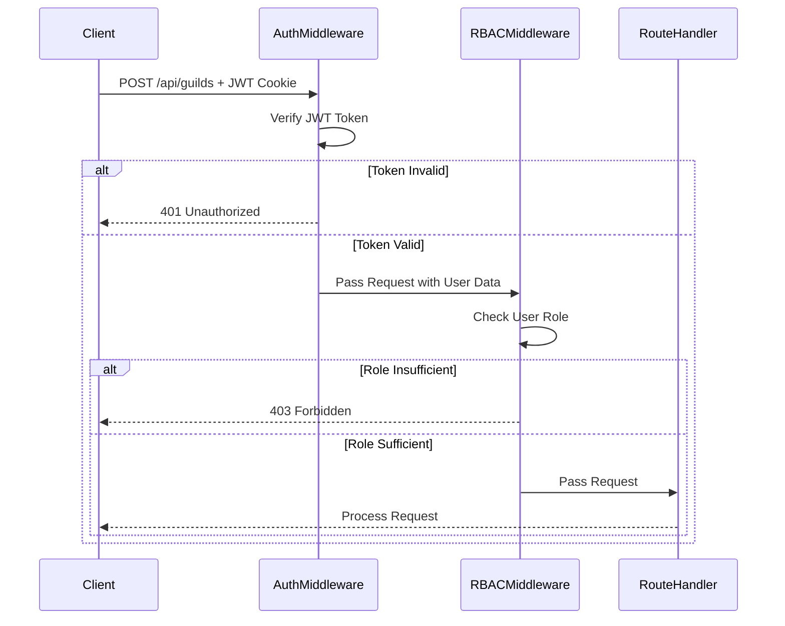
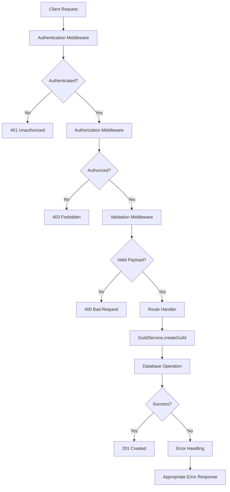
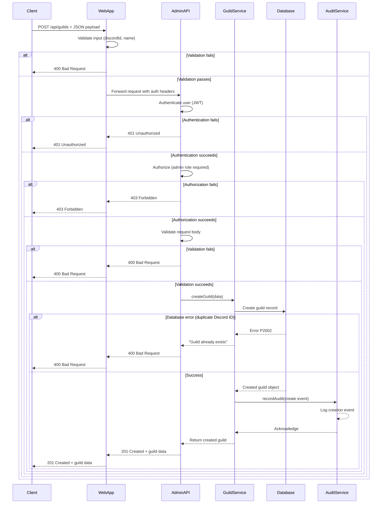

# Create Guild Endpoint

<cite>
**Referenced Files in This Document**   
- [guild.service.ts](file://apps/admin-api/src/services/guild.service.ts)
- [guilds.js](file://apps/admin-api/src/routes/guilds.js)
- [auth.js](file://apps/admin-api/src/middleware/auth.js)
- [rbac.js](file://apps/admin-api/src/middleware/rbac.js)
- [validate.js](file://apps/admin-api/src/middleware/validate.js)
- [database.js](file://apps/admin-api/src/lib/database.js)
- [audit.js](file://apps/admin-api/src/services/audit.js)
- [route.ts](file://apps/web/app/api/guilds/route.ts)
</cite>

## Table of Contents
1. [Introduction](#introduction)
2. [Endpoint Overview](#endpoint-overview)
3. [Authentication and Authorization](#authentication-and-authorization)
4. [Request Payload and Validation](#request-payload-and-validation)
5. [Data Flow and Processing](#data-flow-and-processing)
6. [Database Persistence](#database-persistence)
7. [Response Handling](#response-handling)
8. [Error Handling](#error-handling)
9. [Audit Logging](#audit-logging)
10. [Example Requests and Responses](#example-requests-and-responses)
11. [Sequence Diagram](#sequence-diagram)

## Introduction
This document provides comprehensive documentation for the POST /api/guilds endpoint, which is responsible for creating new guild configurations within the system. The endpoint serves as a critical administrative function that allows authorized users to register new Discord guilds with their associated settings and metadata. The implementation follows a layered architecture with clear separation of concerns between routing, business logic, data access, and security components.

The endpoint is designed with robust validation, transaction safety, and audit logging to ensure data integrity and security. It integrates with the Prisma ORM for database operations and implements comprehensive error handling for both expected and unexpected failure scenarios. The documentation covers all aspects of the endpoint's functionality, from authentication requirements to response generation.

**Section sources**
- [guild.service.ts](file://apps/admin-api/src/services/guild.service.ts#L1-L70)
- [guilds.js](file://apps/admin-api/src/routes/guilds.js#L1-L440)

## Endpoint Overview
The POST /api/guilds endpoint creates a new guild record in the system with the provided configuration. This endpoint is exclusively available to users with administrative privileges and requires proper authentication and authorization. When a valid request is received, the system validates the input payload, checks for existing guilds with the same Discord ID, creates the new guild record in the database, and returns the created guild information.

The endpoint follows RESTful principles and uses standard HTTP status codes to indicate the outcome of the operation. A successful creation returns a 201 Created status with the created resource in the response body. The endpoint is designed to be idempotent in nature by preventing the creation of duplicate guilds with the same Discord ID, ensuring data consistency across the system.

The endpoint is accessible at the path `/api/guilds` and accepts JSON payloads containing the guild configuration. It is implemented as part of the admin-api service and is consumed by the web application through an API client. The implementation leverages middleware for authentication, authorization, and input validation to ensure security and data integrity.

**Section sources**
- [guilds.js](file://apps/admin-api/src/routes/guilds.js#L1-L440)
- [route.ts](file://apps/web/app/api/guilds/route.ts#L54-L124)

## Authentication and Authorization
The POST /api/guilds endpoint requires strict authentication and authorization to prevent unauthorized access. Authentication is handled through JWT (JSON Web Tokens) that are validated on each request. The system checks for valid session tokens in cookies, with support for multiple cookie name fallbacks to accommodate different deployment scenarios.

Authorization is implemented through role-based access control (RBAC) with a hierarchical role system. Only users with the "admin" role or higher privileges can create new guilds. The authorization middleware checks the user's role against the minimum required role for the operation. The system implements a role hierarchy where "admin" roles have the necessary permissions to create guilds, while lower roles such as "member" or "moderator" are denied access.

The authentication process involves verifying the JWT token, extracting the user information, and attaching it to the request object for downstream middleware and route handlers to use. If authentication fails, the system returns a 401 Unauthorized status. If the authenticated user lacks the required privileges, a 403 Forbidden status is returned. This two-layer security approach ensures that only properly authenticated and authorized users can perform this sensitive administrative operation.



**Diagram sources**
- [auth.js](file://apps/admin-api/src/middleware/auth.js#L154-L172)
- [rbac.js](file://apps/admin-api/src/middleware/rbac.js#L5-L11)

## Request Payload and Validation
The POST /api/guilds endpoint expects a JSON payload with specific fields that are validated both at the web application level and the admin API level. The required fields are `discordId` and `name`, both of which must be non-empty strings. The optional `settings` field can contain additional configuration for the guild.

Validation occurs at multiple levels to ensure data integrity. At the web application level, basic validation checks for the presence and type of required fields. The discordId and name fields must be strings, and the name must be between 2 and 100 characters in length. This client-side validation provides immediate feedback to users and reduces unnecessary API calls.

When the request reaches the admin API, more comprehensive validation is performed. The system checks that both discordId and name are present and non-empty. The discordId serves as a unique identifier for the guild and must correspond to an actual Discord server ID. The name represents the display name of the guild within the system and should match the actual Discord guild name.

The validation process uses a middleware approach that parses and validates the request body against a defined schema before the request reaches the route handler. If validation fails, the system returns a 400 Bad Request response with details about the validation errors. This multi-layered validation approach ensures that only properly formatted and semantically correct data is processed by the system.

**Section sources**
- [route.ts](file://apps/web/app/api/guilds/route.ts#L66-L97)
- [guild.service.ts](file://apps/admin-api/src/services/guild.service.ts#L13-L15)

## Data Flow and Processing
The data flow for the POST /api/guilds endpoint follows a well-defined sequence of operations that ensures data integrity and proper error handling. When a request is received, it passes through multiple middleware layers before reaching the route handler. The middleware handles authentication, authorization, and input validation, ensuring that only valid and authorized requests proceed to the business logic layer.

Once the request passes all middleware checks, it reaches the route handler in the admin-api service. The handler extracts the guild data from the request body and passes it to the GuildService for processing. The GuildService performs additional validation and business logic checks before proceeding with the database operation.

The service layer is responsible for coordinating the creation of the guild record. It first validates the input data to ensure all required fields are present and properly formatted. Then it attempts to create the guild record through the database layer. If the operation succeeds, the newly created guild object is returned. If an error occurs, it is caught and transformed into an appropriate HTTP response.

Throughout this process, the system maintains request context including the user identity, request ID, and other metadata that can be used for logging and debugging. This structured data flow ensures that each component has a single responsibility and that errors are properly handled at each layer.



**Diagram sources**
- [guilds.js](file://apps/admin-api/src/routes/guilds.js#L88-L92)
- [guild.service.ts](file://apps/admin-api/src/services/guild.service.ts#L10-L33)

## Database Persistence
The database persistence layer for the POST /api/guilds endpoint is implemented using Prisma ORM, which provides a type-safe and efficient interface for database operations. When creating a new guild, the system uses Prisma's create method to insert a new record into the guilds table with the provided data.

The database schema defines the guild entity with fields for id, discordId, name, settings, createdAt, and updatedAt. The discordId field has a unique constraint to prevent duplicate guilds from being created with the same Discord ID. This constraint is enforced at the database level to ensure data integrity even in high-concurrency scenarios.

The create operation is wrapped in a try-catch block to handle potential database errors. If a unique constraint violation occurs (Prisma error code P2002), the system throws a specific error indicating that a guild with the given Discord ID already exists. Other database errors are propagated up the call stack to be handled by the global error handling middleware.

The database layer also handles the initialization and connection management for the PostgreSQL database. It includes connection pooling, query metrics collection, and proper error handling for connection failures. The system is designed to gracefully handle database connectivity issues and provide meaningful error messages when database operations fail.

**Section sources**
- [guild.service.ts](file://apps/admin-api/src/services/guild.service.ts#L18-L32)
- [database.js](file://apps/admin-api/src/lib/database.js#L358-L369)

## Response Handling
The response handling for the POST /api/guilds endpoint follows standard REST conventions with appropriate HTTP status codes and response bodies. Upon successful creation of a guild, the system returns a 201 Created status code with the created guild object in the response body. The response includes the guild's ID, Discord ID, name, settings, member count, message count, and timestamps.

The response body is formatted consistently across all guild-related endpoints, with the GuildService responsible for transforming the raw database record into a standardized response format. This includes calculating derived properties such as member count and message count using Prisma's relation counting capabilities.

For error responses, the system uses appropriate HTTP status codes to indicate the type of error. Validation errors return 400 Bad Request with details about the validation failures. Authentication errors return 401 Unauthorized, while authorization errors return 403 Forbidden. Database constraint violations return 409 Conflict, and other server errors return 500 Internal Server Error.

The response format is consistent across error types, including an error code, message, and optional details. This standardized error format makes it easier for clients to handle different error scenarios programmatically. The system also includes request IDs in error responses to facilitate debugging and log correlation.

**Section sources**
- [guild.service.ts](file://apps/admin-api/src/services/guild.service.ts#L568-L585)
- [error-handler.js](file://apps/admin-api/src/middleware/error-handler.js#L36-L41)

## Error Handling
The error handling strategy for the POST /api/guilds endpoint is comprehensive and designed to handle both expected and unexpected failure scenarios. The system distinguishes between operational errors (expected error conditions) and programmer errors (unexpected bugs), handling each appropriately.

For expected error conditions, the system throws specific error types with meaningful messages. When attempting to create a guild with a duplicate Discord ID, the system catches the Prisma unique constraint violation (error code P2002) and throws a descriptive error indicating that a guild with that Discord ID already exists. This prevents data duplication and provides clear feedback to the user.

Validation errors are handled by the validation middleware, which intercepts invalid payloads and returns a 400 Bad Request response with details about the specific validation failures. This includes the path to the invalid field and a description of why it failed validation, helping clients correct their requests.

For unexpected errors, the system uses a global error handling middleware that catches unhandled exceptions, logs them with full context, and returns a generic 500 Internal Server Error response. This prevents sensitive system information from being exposed to clients while ensuring that all errors are properly logged for debugging.

The error handling system also includes proper cleanup and resource management. Database transactions are automatically rolled back on error, and any allocated resources are properly released. This ensures that the system remains in a consistent state even when errors occur.

**Section sources**
- [guild.service.ts](file://apps/admin-api/src/services/guild.service.ts#L27-L32)
- [error-handler.js](file://apps/admin-api/src/middleware/error-handler.js#L10-L42)

## Audit Logging
The POST /api/guilds endpoint integrates with the audit logging system to record all creation attempts for security and compliance purposes. When a guild is successfully created, the system calls the recordAudit function to log the operation with relevant details. This creates an immutable record of the administrative action that can be used for auditing, debugging, and security analysis.

The audit log entry includes the admin ID (the user who performed the action), the action type ("guild.create"), the guild ID of the created guild, and the payload that was used to create the guild. This comprehensive logging provides full traceability for all guild creation operations, allowing administrators to track who created which guilds and when.

The audit logging is implemented as a best-effort system that does not block the main operation if logging fails. This ensures that the primary functionality remains available even if the audit logging system is temporarily unavailable. The system checks whether audit logging is enabled and whether the database is configured before attempting to write audit logs.

Audit logs are stored in a dedicated audit_log table with fields for timestamp, user ID, action type, resource ID, and payload. This structured format allows for efficient querying and analysis of administrative actions. The logging system also includes rate limiting and retention policies to manage storage requirements and prevent abuse.

**Section sources**
- [audit.js](file://apps/admin-api/src/services/audit.js#L6-L20)
- [guild.service.ts](file://apps/admin-api/src/services/guild.service.ts#L10-L33)

## Example Requests and Responses
This section provides examples of valid and invalid requests to the POST /api/guilds endpoint, along with the corresponding responses.

**Valid Request:**
```json
{
  "discordId": "1176605506912141444",
  "name": "Slimey Community",
  "settings": {
    "sheetUrl": "https://docs.google.com/spreadsheets/d/abc123",
    "weekWindowDays": 7
  }
}
```

**Successful Response (201 Created):**
```json
{
  "id": "clx8m5n6o7p8q9r0s1t2u3v4",
  "discordId": "1176605506912141444",
  "name": "Slimey Community",
  "settings": {
    "sheetUrl": "https://docs.google.com/spreadsheets/d/abc123",
    "weekWindowDays": 7
  },
  "memberCount": 0,
  "messageCount": 0,
  "createdAt": "2024-01-15T10:30:00.000Z",
  "updatedAt": "2024-01-15T10:30:00.000Z"
}
```

**Invalid Request - Missing Required Fields:**
```json
{
  "name": "Slimey Community"
}
```

**Error Response (400 Bad Request):**
```json
{
  "error": "validation-error",
  "details": [
    {
      "path": ["discordId"],
      "message": "Required"
    }
  ]
}
```

**Invalid Request - Duplicate Discord ID:**
```json
{
  "discordId": "1176605506912141444",
  "name": "Another Guild"
}
```

**Error Response (400 Bad Request):**
```json
{
  "error": "Guild with this Discord ID already exists"
}
```

**Section sources**
- [route.ts](file://apps/web/app/api/guilds/route.ts#L66-L97)
- [guild.service.ts](file://apps/admin-api/src/services/guild.service.ts#L13-L15)

## Sequence Diagram
The following sequence diagram illustrates the complete flow of a successful request to the POST /api/guilds endpoint, showing the interactions between the client, web application, admin API, and database components.



**Diagram sources**
- [route.ts](file://apps/web/app/api/guilds/route.ts#L58-L109)
- [guilds.js](file://apps/admin-api/src/routes/guilds.js#L88-L92)
- [guild.service.ts](file://apps/admin-api/src/services/guild.service.ts#L10-L33)
- [audit.js](file://apps/admin-api/src/services/audit.js#L6-L20)