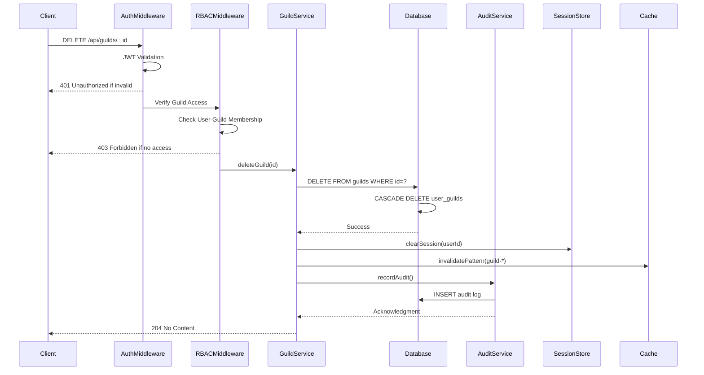
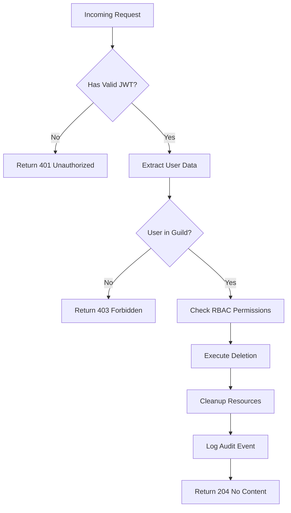
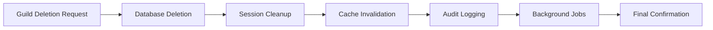
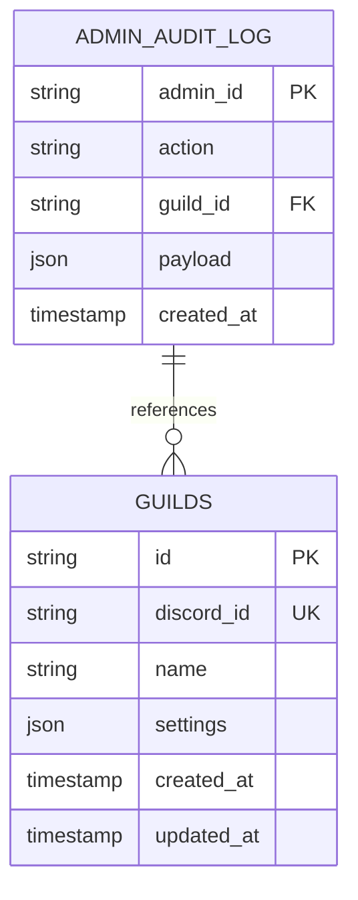

# Delete Guild Endpoint

<cite>
**Referenced Files in This Document**   
- [guilds.js](file://apps/admin-api/src/routes/guilds.js#L394-L400)
- [guild.service.ts](file://apps/admin-api/src/services/guild.service.ts#L229-L243)
- [auth.js](file://apps/admin-api/src/middleware/auth.js#L154-L159)
- [rbac.js](file://apps/admin-api/src/middleware/rbac.js#L14-L29)
- [audit.js](file://apps/admin-api/src/services/audit.js#L6-L20)
- [session-store.js](file://apps/admin-api/lib/session-store.js#L57-L64)
- [redis.js](file://apps/admin-api/lib/cache/redis.js#L1-L16)
- [guild-settings.js](file://apps/admin-api/lib/guild-settings.js#L33-L63)
</cite>

## Table of Contents
1. [Introduction](#introduction)
2. [Endpoint Overview](#endpoint-overview)
3. [Authentication and Authorization](#authentication-and-authorization)
4. [Deletion Process and Cascade Effects](#deletion-process-and-cascade-effects)
5. [Data Cleanup and System Integration](#data-cleanup-and-system-integration)
6. [Error Handling and Response Codes](#error-handling-and-response-codes)
7. [Safety Mechanisms and Data Retention](#safety-mechanisms-and-data-retention)
8. [Audit Logging and Monitoring](#audit-logging-and-monitoring)
9. [Example Requests and Responses](#example-requests-and-responses)
10. [Conclusion](#conclusion)

## Introduction
The DELETE /api/guilds/:id endpoint provides administrative functionality for permanently removing a guild's configuration and associated data from the system. This document details the implementation, security controls, data cleanup procedures, and system integration aspects of this critical administrative operation. The endpoint follows strict security protocols to prevent unauthorized deletions while ensuring comprehensive cleanup of all related resources.

## Endpoint Overview
The DELETE /api/guilds/:id endpoint removes a guild and all its associated configuration data from the system. The operation is irreversible and triggers a cascade of cleanup actions across multiple system components.



**Diagram sources**
- [guilds.js](file://apps/admin-api/src/routes/guilds.js#L394-L400)
- [guild.service.ts](file://apps/admin-api/src/services/guild.service.ts#L229-L243)
- [auth.js](file://apps/admin-api/src/middleware/auth.js#L154-L159)
- [rbac.js](file://apps/admin-api/src/middleware/rbac.js#L14-L29)

**Section sources**
- [guilds.js](file://apps/admin-api/src/routes/guilds.js#L394-L400)
- [guild.service.ts](file://apps/admin-api/src/services/guild.service.ts#L229-L243)

## Authentication and Authorization
The endpoint implements a multi-layered security approach to ensure only authorized users can delete guilds. The authentication flow uses JWT tokens with role-based access control (RBAC) enforcement.

### Authentication Flow
The system validates JWT tokens through the `requireAuth` middleware, which checks for valid session tokens in cookies. The authentication process supports multiple cookie names for backward compatibility and development environments.

### Role-Based Access Control
Access to the endpoint requires both authentication and guild membership verification through the `requireGuildAccess` middleware. Users must be members of the guild they're attempting to delete, with administrative privileges enforced at the application level.



**Diagram sources**
- [auth.js](file://apps/admin-api/src/middleware/auth.js#L154-L159)
- [rbac.js](file://apps/admin-api/src/middleware/rbac.js#L14-L29)

**Section sources**
- [auth.js](file://apps/admin-api/src/middleware/auth.js#L154-L159)
- [rbac.js](file://apps/admin-api/src/middleware/rbac.js#L14-L29)

## Deletion Process and Cascade Effects
The deletion process follows a structured approach to ensure data integrity and proper cleanup of all related records.

### Primary Deletion Operation
The core deletion is handled by the `deleteGuild` method in the `GuildService` class, which performs a direct database deletion of the guild record. The operation is designed to be atomic and irreversible.

### Database Cascade Effects
The database schema is configured with foreign key constraints that automatically cascade deletions to related tables:
- **user_guilds**: All membership records associated with the guild are automatically removed
- **chat_messages**: All chat messages belonging to the guild are deleted
- **guild_settings**: Configuration settings are removed
- **corrections**: Any manual corrections are cleaned up

### Parameter Validation
The ':id' parameter undergoes validation both at the route level and within the service layer:
- Path parameter extraction from the URL
- Existence check in the database
- Ownership verification through RBAC middleware
- Proper UUID format validation

**Section sources**
- [guild.service.ts](file://apps/admin-api/src/services/guild.service.ts#L229-L243)
- [rbac.js](file://apps/admin-api/src/middleware/rbac.js#L14-L29)

## Data Cleanup and System Integration
Beyond database operations, the deletion process integrates with various system components to ensure comprehensive cleanup.

### Session Management
The system clears all active sessions for users associated with the deleted guild through the session store service. This prevents orphaned sessions and ensures users are properly logged out.

### Cache Invalidation
The caching layer is notified to invalidate all entries related to the deleted guild. The Redis-based cache system removes entries using pattern matching to ensure all guild-specific data is cleared from memory.

### Background Processing
While the primary deletion is synchronous, related cleanup tasks may be offloaded to background jobs for performance optimization:
- Final audit log consolidation
- Analytics data aggregation
- Storage cleanup for associated files



**Diagram sources**
- [session-store.js](file://apps/admin-api/lib/session-store.js#L57-L64)
- [redis.js](file://apps/admin-api/lib/cache/redis.js#L1-L16)
- [audit.js](file://apps/admin-api/src/services/audit.js#L6-L20)

**Section sources**
- [session-store.js](file://apps/admin-api/lib/session-store.js#L57-L64)
- [redis.js](file://apps/admin-api/lib/cache/redis.js#L1-L16)
- [guild-settings.js](file://apps/admin-api/lib/guild-settings.js#L33-L63)

## Error Handling and Response Codes
The endpoint implements comprehensive error handling to provide meaningful feedback for various failure scenarios.

### Success Response
- **204 No Content**: The guild was successfully deleted (no response body)

### Error Responses
- **401 Unauthorized**: No valid authentication token provided
- **403 Forbidden**: User lacks permission to delete the guild
- **404 Not Found**: Guild ID does not exist in the system
- **400 Bad Request**: Invalid guild ID parameter format
- **500 Internal Server Error**: Unexpected server error during deletion

The error handling follows consistent patterns across the application, with structured JSON responses containing error codes and descriptive messages.

**Section sources**
- [guild.service.ts](file://apps/admin-api/src/services/guild.service.ts#L238-L242)
- [auth.js](file://apps/admin-api/src/middleware/auth.js#L138-L152)
- [rbac.js](file://apps/admin-api/src/middleware/rbac.js#L18-L24)

## Safety Mechanisms and Data Retention
The system incorporates several safeguards to prevent accidental deletions and comply with data retention policies.

### Hard-Delete Strategy
The system implements a hard-delete approach rather than soft-delete, meaning records are permanently removed from the primary database. This decision balances security concerns with storage efficiency.

### Data Retention
While primary records are immediately deleted, certain data may be retained according to compliance requirements:
- Audit logs are preserved for security and compliance
- Aggregated analytics data may retain anonymized information
- Backup systems may contain historical snapshots

### Accidental Deletion Safeguards
The system relies on multiple layers of protection against accidental deletion:
- Multi-factor authentication requirements for administrative actions
- Explicit confirmation requirements in the UI
- Rate limiting on deletion requests
- Comprehensive audit logging for all deletion operations

**Section sources**
- [guild.service.ts](file://apps/admin-api/src/services/guild.service.ts#L229-L243)
- [audit.js](file://apps/admin-api/src/services/audit.js#L6-L20)

## Audit Logging and Monitoring
Every deletion operation is recorded in the audit system for security and compliance purposes.

### Audit Event Structure
The audit service captures key information about each deletion:
- Admin ID performing the deletion
- Action type ("guild.delete")
- Target guild ID
- Timestamp of the operation
- Additional context in the payload

### Monitoring Integration
The operation is integrated with monitoring systems:
- Prometheus metrics track deletion frequency
- Grafana dashboards visualize deletion patterns
- Alerting systems notify of unusual deletion activity
- Log aggregation provides forensic capabilities

The audit logs are stored separately from application data to prevent loss during deletion operations.



**Diagram sources**
- [audit.js](file://apps/admin-api/src/services/audit.js#L6-L20)
- [guild.service.ts](file://apps/admin-api/src/services/guild.service.ts#L229-L243)

**Section sources**
- [audit.js](file://apps/admin-api/src/services/audit.js#L6-L20)

## Example Requests and Responses
### Successful Deletion
```http
DELETE /api/guilds/1176605506912141444 HTTP/1.1
Authorization: Bearer <jwt_token>
Content-Type: application/json

HTTP/1.1 204 No Content
```

### Insufficient Permissions
```http
DELETE /api/guilds/1176605506912141444 HTTP/1.1
Authorization: Bearer <jwt_token>
Content-Type: application/json

HTTP/1.1 403 Forbidden
Content-Type: application/json

{
  "ok": false,
  "code": "FORBIDDEN",
  "message": "Insufficient role"
}
```

### Non-existent Guild
```http
DELETE /api/guilds/nonexistent HTTP/1.1
Authorization: Bearer <jwt_token>
Content-Type: application/json

HTTP/1.1 404 Not Found
Content-Type: application/json

{
  "error": "Guild not found"
}
```

**Section sources**
- [guilds.js](file://apps/admin-api/src/routes/guilds.js#L394-L400)
- [guild.service.ts](file://apps/admin-api/src/services/guild.service.ts#L229-L243)

## Conclusion
The DELETE /api/guilds/:id endpoint provides a secure and comprehensive mechanism for removing guild configurations from the system. The implementation balances the need for irreversible cleanup with robust security controls, ensuring that only authorized users can perform this sensitive operation. The cascade deletion process, combined with session cleanup, cache invalidation, and audit logging, ensures complete removal of all related data while maintaining system integrity. The integration with monitoring and alerting systems provides visibility into deletion activities for security and compliance purposes.