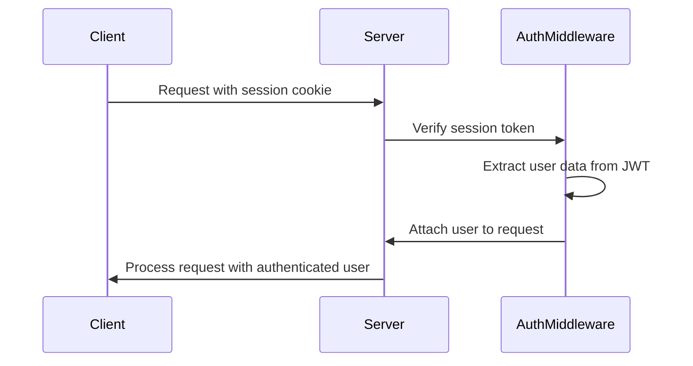
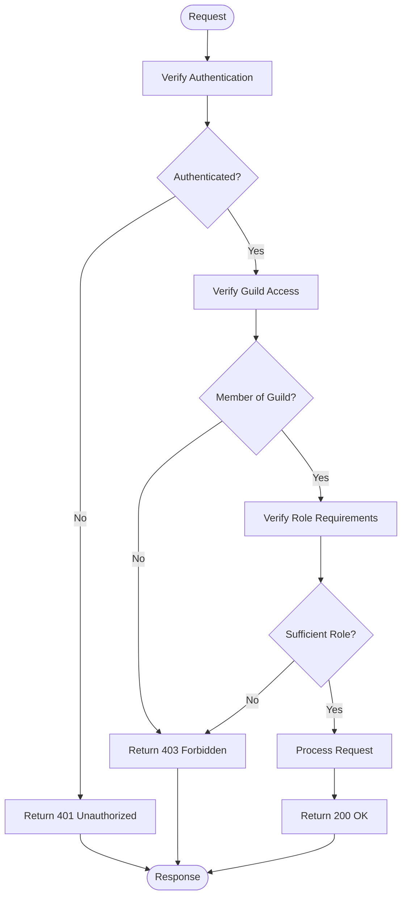
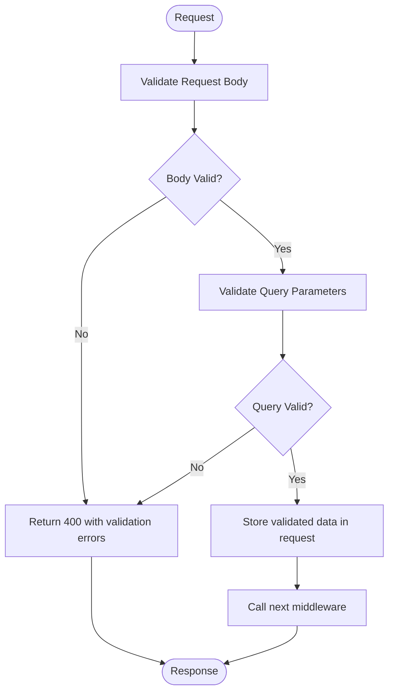
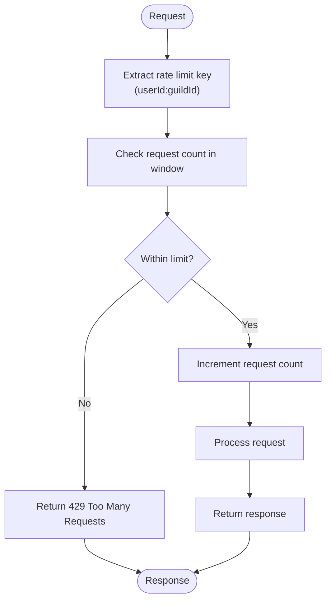
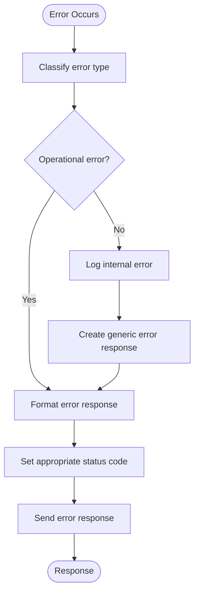
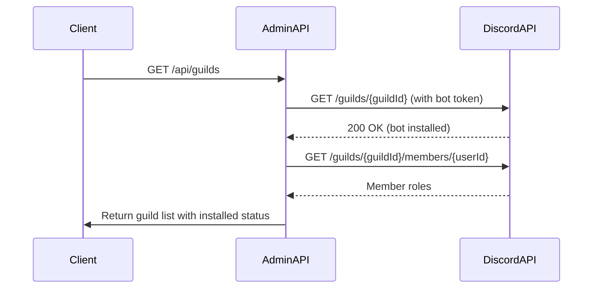
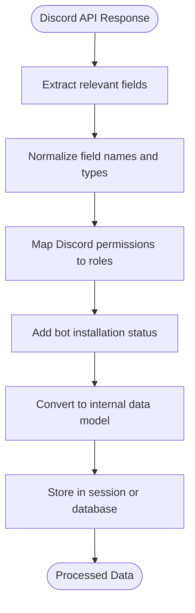
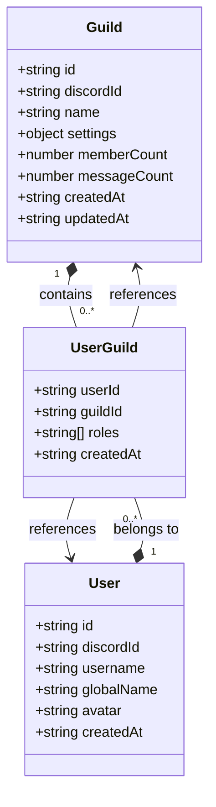

# Guild Management Endpoints

<cite>
**Referenced Files in This Document**   
- [guilds.js](file://apps/admin-api/src/routes/guilds.js)
- [guild.service.ts](file://apps/admin-api/src/services/guild.service.ts)
- [auth.js](file://apps/admin-api/src/middleware/auth.js)
- [rbac.js](file://apps/admin-api/src/middleware/rbac.js)
- [rate-limit.js](file://apps/admin-api/src/middleware/rate-limit.js)
- [auth.js](file://apps/admin-api/src/routes/auth.js)
- [oauth.js](file://apps/admin-api/src/services/oauth.js)
- [validate.js](file://apps/admin-api/src/middleware/validate.js)
- [config.js](file://apps/admin-api/src/config.js)
- [error-handler.js](file://apps/admin-api/src/middleware/error-handler.js)
</cite>

## Table of Contents
1. [Introduction](#introduction)
2. [API Endpoints](#api-endpoints)
3. [Authentication and Authorization](#authentication-and-authorization)
4. [Request Validation](#request-validation)
5. [Rate Limiting](#rate-limiting)
6. [Error Handling](#error-handling)
7. [Discord Integration](#discord-integration)
8. [Data Models](#data-models)
9. [Common Issues](#common-issues)
10. [Example Requests and Responses](#example-requests-and-responses)

## Introduction

The Guild Management API provides endpoints for managing Discord guilds within the admin-api service. This documentation details the endpoints for listing, creating, retrieving, and deleting guilds, along with their associated data and permissions. The API integrates with Discord to verify bot installation status and provides comprehensive role-based access control for secure operations.

The endpoints are designed to support administrative operations for guild management, including pagination, search functionality, and member inclusion options. The API follows RESTful principles with clear HTTP methods, URL patterns, and standardized response formats.

**Section sources**
- [guilds.js](file://apps/admin-api/src/routes/guilds.js#L1-L440)

## API Endpoints

### GET /api/guilds

Retrieves a list of guilds the authenticated user has access to, with bot installation status.

**HTTP Method**: GET  
**URL Pattern**: /api/guilds  
**Authentication**: Required  
**Role-based Access Control**: All authenticated users can access their own guilds

**Query Parameters**:
- `limit` (number, optional): Number of guilds to return per page (default: 50, max: 100)
- `offset` (number, optional): Number of guilds to skip for pagination
- `search` (string, optional): Search term to filter guilds by name
- `includeMembers` (boolean, optional): Whether to include member data in the response

**Response Schema**:
```json
{
  "guilds": [
    {
      "id": "string",
      "discordId": "string",
      "name": "string",
      "settings": "object",
      "memberCount": "number",
      "messageCount": "number",
      "createdAt": "string (ISO 8601)",
      "updatedAt": "string (ISO 8601)",
      "members": [
        {
          "userId": "string",
          "discordId": "string",
          "username": "string",
          "globalName": "string",
          "avatar": "string",
          "roles": ["string"],
          "joinedAt": "string (ISO 8601)",
          "userCreatedAt": "string (ISO 8601)"
        }
      ]
    }
  ],
  "pagination": {
    "total": "number",
    "limit": "number",
    "offset": "number",
    "hasMore": "boolean"
  }
}
```

**Example Response**:
```json
{
  "guilds": [
    {
      "id": "guild-123",
      "discordId": "1176605506912141444",
      "name": "Slimey Community",
      "settings": {
        "sheetUrl": "https://docs.google.com/spreadsheets/d/abc123",
        "weekWindowDays": 7
      },
      "memberCount": 150,
      "messageCount": 2500,
      "createdAt": "2024-01-15T10:30:00Z",
      "updatedAt": "2024-01-20T14:45:00Z"
    }
  ],
  "pagination": {
    "total": 1,
    "limit": 50,
    "offset": 0,
    "hasMore": false
  }
}
```

**Section sources**
- [guilds.js](file://apps/admin-api/src/routes/guilds.js#L90-L92)
- [guild.service.ts](file://apps/admin-api/src/services/guild.service.ts#L112-L174)

### GET /api/guilds/:id

Retrieves specific guild information with member data.

**HTTP Method**: GET  
**URL Pattern**: /api/guilds/:id  
**Authentication**: Required  
**Role-based Access Control**: User must be a member of the guild

**Path Parameters**:
- `id` (string): The unique identifier of the guild

**Query Parameters**:
- `includeMembers` (boolean, optional): Whether to include detailed member data

**Response Schema**:
```json
{
  "id": "string",
  "discordId": "string",
  "name": "string",
  "settings": "object",
  "memberCount": "number",
  "messageCount": "number",
  "createdAt": "string (ISO 8601)",
  "updatedAt": "string (ISO 8601)",
  "members": [
    {
      "userId": "string",
      "discordId": "string",
      "username": "string",
      "globalName": "string",
      "avatar": "string",
      "roles": ["string"],
      "joinedAt": "string (ISO 8601)",
      "userCreatedAt": "string (ISO 8601)"
    }
  ]
}
```

**Section sources**
- [guilds.js](file://apps/admin-api/src/routes/guilds.js#L94-L107)
- [guild.service.ts](file://apps/admin-api/src/services/guild.service.ts#L38-L70)

### POST /api/guilds

Creates a new guild with validation rules.

**HTTP Method**: POST  
**URL Pattern**: /api/guilds  
**Authentication**: Required  
**Role-based Access Control**: Admin role required

**Request Body Schema**:
```json
{
  "discordId": "string",
  "name": "string",
  "settings": "object"
}
```

**Validation Rules**:
- `discordId` and `name` are required fields
- `discordId` must be unique across all guilds
- `name` must not be empty

**Response Schema**:
```json
{
  "id": "string",
  "discordId": "string",
  "name": "string",
  "settings": "object",
  "memberCount": "number",
  "messageCount": "number",
  "createdAt": "string (ISO 8601)",
  "updatedAt": "string (ISO 8601)"
}
```

**Section sources**
- [guilds.js](file://apps/admin-api/src/routes/guilds.js#L90-L92)
- [guild.service.ts](file://apps/admin-api/src/services/guild.service.ts#L10-L33)

### DELETE /api/guilds/:id

Removes a guild from the system.

**HTTP Method**: DELETE  
**URL Pattern**: /api/guilds/:id  
**Authentication**: Required  
**Role-based Access Control**: Admin role required

**Path Parameters**:
- `id` (string): The unique identifier of the guild to delete

**Response Schema**:
```json
{
  "success": "boolean"
}
```

**Section sources**
- [guilds.js](file://apps/admin-api/src/routes/guilds.js#L90-L92)
- [guild.service.ts](file://apps/admin-api/src/services/guild.service.ts#L229-L243)

## Authentication and Authorization

The guild management endpoints require authentication and implement role-based access control (RBAC) to ensure secure access to guild resources.

### Authentication Requirements

All endpoints require authentication via a session token stored in a cookie. The authentication middleware verifies the session token and attaches the user information to the request object.

The authentication process follows these steps:
1. The client sends a request with a session cookie
2. The server verifies the session token using JWT validation
3. The user information is extracted from the token payload
4. The user object is attached to the request for subsequent middleware and route handlers



**Diagram sources**
- [auth.js](file://apps/admin-api/src/middleware/auth.js#L154-L160)

### Role-based Access Control

The API implements role-based access control to restrict operations based on user roles. The role hierarchy is defined as: viewer < editor < admin < owner.

**Access Control Rules**:
- **GET /api/guilds**: All authenticated users can list their guilds
- **GET /api/guilds/:id**: Users must be members of the requested guild
- **POST /api/guilds**: Requires admin or higher role
- **DELETE /api/guilds/:id**: Requires admin or higher role

The RBAC middleware checks both guild membership and role requirements:



**Diagram sources**
- [rbac.js](file://apps/admin-api/src/middleware/rbac.js#L14-L29)
- [auth.js](file://apps/admin-api/src/middleware/auth.js#L162-L173)

## Request Validation

The API implements comprehensive request validation using Zod schemas to ensure data integrity and prevent invalid data from being processed.

### Validation Middleware

The validation middleware processes both request body and query parameters, transforming and validating the data according to predefined schemas.



**Diagram sources**
- [validate.js](file://apps/admin-api/src/middleware/validate.js#L3-L38)

### Schema Definitions

The API uses Zod schemas to define the structure and constraints for request data:

**Settings Schema**:
- `sheetUrl`: Optional string or null, transformed from empty string to null
- `weekWindowDays`: Optional integer between 1-14 or null
- `thresholds`: Optional object with `warnLow` and `warnHigh` numeric values
- `tokensPerMinute`: Optional positive integer or null
- `testSheet`: Optional boolean

**Personality Schema**:
- `profile`: Required object with any properties

**Corrections Schema**:
- `weekId`: Optional string
- `memberKey`: Optional string
- `displayName`: Optional string
- `memberInput`: Optional string
- `metric`: Required enum ("total" or "sim")
- `value`: Required number or string
- `reason`: Optional string
- Validation: At least one of `memberKey`, `displayName`, or `memberInput` must be provided

**Section sources**
- [guilds.js](file://apps/admin-api/src/routes/guilds.js#L29-L86)

## Rate Limiting

The API implements rate limiting to prevent abuse and ensure fair usage of resources. Rate limits are applied at the endpoint level with configurable thresholds.

### Rate Limiting Configuration

Rate limiting is configured through environment variables with sensible defaults:

- **Window**: 60,000 milliseconds (1 minute) by default
- **Maximum requests**: 5 requests per window by default
- **Key generator**: Combines user ID (or IP address) with guild ID to create a unique rate limiting key

The rate limiting strategy uses a sliding window algorithm to track requests and prevent excessive usage:



**Diagram sources**
- [rate-limit.js](file://apps/admin-api/src/middleware/rate-limit.js#L7-L22)

### Rate Limit Headers

When rate limiting is enabled, the API includes standard rate limiting headers in responses:

- `X-RateLimit-Limit`: The maximum number of requests in the rate limit window
- `X-RateLimit-Remaining`: The number of requests remaining in the current window
- `X-RateLimit-Reset`: The time at which the rate limit window resets

These headers follow the standard rate limiting convention and help clients understand their rate limit status.

**Section sources**
- [rate-limit.js](file://apps/admin-api/src/middleware/rate-limit.js#L7-L22)

## Error Handling

The API implements a comprehensive error handling system to provide meaningful feedback to clients while maintaining security.

### Error Response Format

All error responses follow a standardized format:

```json
{
  "ok": false,
  "error": {
    "code": "string",
    "message": "string",
    "requestId": "string"
  }
}
```

Or for validation errors:

```json
{
  "error": "validation-error",
  "details": [
    {
      "path": ["string"],
      "message": "string"
    }
  ]
}
```

### Error Types

The API handles several types of errors:

**Authentication Errors**:
- `UNAUTHORIZED` (401): Authentication required
- `FORBIDDEN` (403): Insufficient role or permissions

**Validation Errors**:
- `validation-error` (400): Request data failed validation
- Specific field validation messages

**Resource Errors**:
- `NOT_FOUND` (404): Requested resource not found
- `rate-limit` (429): Rate limit exceeded

**Server Errors**:
- `server_error` (500): Internal server error



**Diagram sources**
- [error-handler.js](file://apps/admin-api/src/middleware/error-handler.js#L10-L42)

**Section sources**
- [error-handler.js](file://apps/admin-api/src/middleware/error-handler.js#L1-L82)

## Discord Integration

The API integrates with the Discord API to verify bot installation status and synchronize guild information.

### Bot Installation Verification

When listing guilds, the API verifies whether the bot is installed in each guild by making requests to the Discord API:

1. The API retrieves the user's guilds from the authentication token
2. For each guild, it makes a request to the Discord API to check bot membership
3. The bot token is used to authenticate these requests
4. A successful response indicates the bot is installed

The verification process includes timeout protection (2 seconds per guild) to prevent delays:



**Diagram sources**
- [auth.js](file://apps/admin-api/src/routes/auth.js#L203-L237)

### Data Transformation

The API transforms Discord API responses into a consistent format for internal use:

**User Transformation**:
- Maps Discord user fields to internal user model
- Handles optional fields like global_name
- Normalizes avatar URLs

**Guild Transformation**:
- Maps Discord guild permissions (bitfield) to role levels
- Determines user role based on permissions and ownership
- Adds installation status to guild objects

The transformation process ensures consistent data representation across the application:



**Section sources**
- [auth.js](file://apps/admin-api/src/routes/auth.js#L167-L318)
- [oauth.js](file://apps/admin-api/src/services/oauth.js#L69-L86)

## Data Models

The API uses well-defined data models for guilds and their relationships.

### Guild Entity

The guild entity represents a Discord server with the following properties:

**Core Properties**:
- `id`: Internal unique identifier (string)
- `discordId`: Discord's unique identifier for the guild (string)
- `name`: Display name of the guild (string)
- `settings`: Configuration object for the guild (object)
- `createdAt`: Timestamp when the guild was created (ISO 8601)
- `updatedAt`: Timestamp when the guild was last updated (ISO 8601)

**Count Properties**:
- `memberCount`: Number of members in the guild
- `messageCount`: Number of chat messages in the guild



**Diagram sources**
- [guild.service.ts](file://apps/admin-api/src/services/guild.service.ts#L568-L585)

### User-Guild Relationship

The user-guild relationship tracks membership and roles:

**Properties**:
- `userId`: Reference to the user
- `guildId`: Reference to the guild
- `roles`: Array of role strings (e.g., "admin", "editor")
- `joinedAt`: Timestamp when the user joined the guild

This relationship enables the RBAC system to determine user permissions within each guild.

**Section sources**
- [guild.service.ts](file://apps/admin-api/src/services/guild.service.ts#L587-L601)

## Common Issues

This section addresses common issues encountered when using the guild management endpoints.

### Permission Errors

**Issue**: Receiving 403 Forbidden responses when accessing guild endpoints.

**Causes**:
- User is not a member of the requested guild
- User lacks sufficient role permissions
- Session token is invalid or expired

**Solutions**:
1. Verify the user is a member of the guild in Discord
2. Check the user's role in the guild (admin role required for write operations)
3. Re-authenticate to refresh the session token

### Invalid Guild IDs

**Issue**: Receiving 404 Not Found responses for valid-looking guild IDs.

**Causes**:
- The guild ID does not exist in the database
- The user does not have access to the specified guild
- The guild ID format is incorrect

**Solutions**:
1. Verify the guild ID by listing all accessible guilds first
2. Ensure the user is a member of the guild
3. Check for typos in the guild ID

### Synchronization Delays with Discord

**Issue**: Bot installation status shows as false despite the bot being installed.

**Causes**:
- Discord API rate limiting
- Network latency between services
- Caching of previous installation status
- Bot token configuration issues

**Solutions**:
1. Verify the DISCORD_BOT_TOKEN environment variable is correctly configured
2. Wait for synchronization (typically resolves within a few minutes)
3. Clear any cached data if applicable
4. Check server logs for Discord API errors

### Rate Limiting Issues

**Issue**: Receiving 429 Too Many Requests responses.

**Causes**:
- Exceeding the configured rate limit (5 requests per minute by default)
- Multiple requests from the same user-guild combination

**Solutions**:
1. Implement exponential backoff in client applications
2. Cache responses client-side when possible
3. Monitor rate limit headers to adjust request frequency
4. Contact administrators to adjust rate limits if necessary

**Section sources**
- [auth.js](file://apps/admin-api/src/middleware/auth.js#L146-L152)
- [rbac.js](file://apps/admin-api/src/middleware/rbac.js#L22-L25)
- [rate-limit.js](file://apps/admin-api/src/middleware/rate-limit.js#L17-L19)

## Example Requests and Responses

### Successful Guild List Request

**Request**:
```http
GET /api/guilds?limit=10&search=community HTTP/1.1
Authorization: Bearer <token>
Cookie: slimy_admin_token=<session_token>
```

**Response**:
```http
HTTP/1.1 200 OK
Content-Type: application/json

{
  "guilds": [
    {
      "id": "guild-123",
      "discordId": "1176605506912141444",
      "name": "Slimey Community",
      "settings": {
        "sheetUrl": "https://docs.google.com/spreadsheets/d/abc123",
        "weekWindowDays": 7
      },
      "memberCount": 150,
      "messageCount": 2500,
      "createdAt": "2024-01-15T10:30:00Z",
      "updatedAt": "2024-01-20T14:45:00Z"
    }
  ],
  "pagination": {
    "total": 1,
    "limit": 10,
    "offset": 0,
    "hasMore": false
  }
}
```

### Guild Creation Request

**Request**:
```http
POST /api/guilds HTTP/1.1
Authorization: Bearer <token>
Cookie: slimy_admin_token=<session_token>
Content-Type: application/json
x-csrf-token: <csrf_token>

{
  "discordId": "1176605506912141444",
  "name": "Slimey Community",
  "settings": {
    "sheetUrl": "https://docs.google.com/spreadsheets/d/abc123"
  }
}
```

**Response**:
```http
HTTP/1.1 200 OK
Content-Type: application/json

{
  "id": "guild-123",
  "discordId": "1176605506912141444",
  "name": "Slimey Community",
  "settings": {
    "sheetUrl": "https://docs.google.com/spreadsheets/d/abc123"
  },
  "memberCount": 0,
  "messageCount": 0,
  "createdAt": "2024-01-20T14:45:00Z",
  "updatedAt": "2024-01-20T14:45:00Z"
}
```

### Permission Error Response

**Response**:
```http
HTTP/1.1 403 Forbidden
Content-Type: application/json

{
  "ok": false,
  "error": {
    "code": "FORBIDDEN",
    "message": "Insufficient role",
    "requestId": "req-abc123"
  }
}
```

### Validation Error Response

**Response**:
```http
HTTP/1.1 400 Bad Request
Content-Type: application/json

{
  "error": "validation-error",
  "details": [
    {
      "path": ["name"],
      "message": "Required"
    }
  ]
}
```

**Section sources**
- [guilds.js](file://apps/admin-api/src/routes/guilds.js#L90-L92)
- [error-handler.js](file://apps/admin-api/src/middleware/error-handler.js#L7-L13)
- [validate.js](file://apps/admin-api/src/middleware/validate.js#L7-L13)